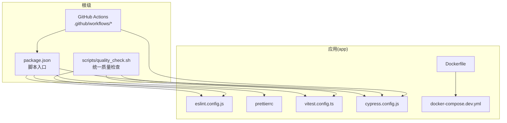
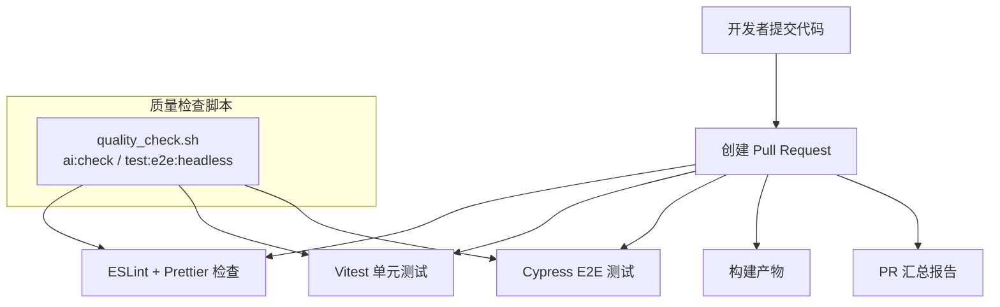
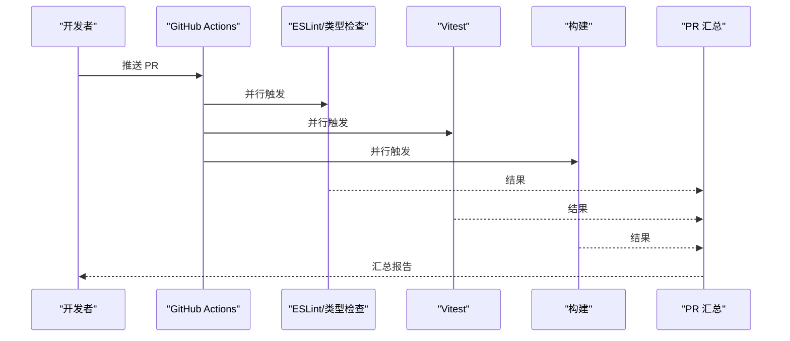
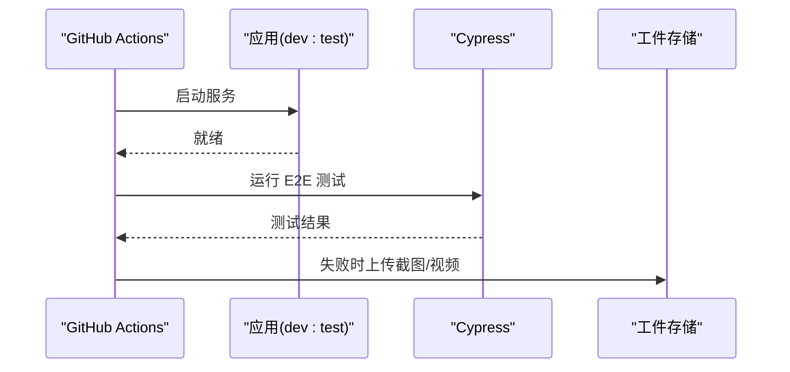
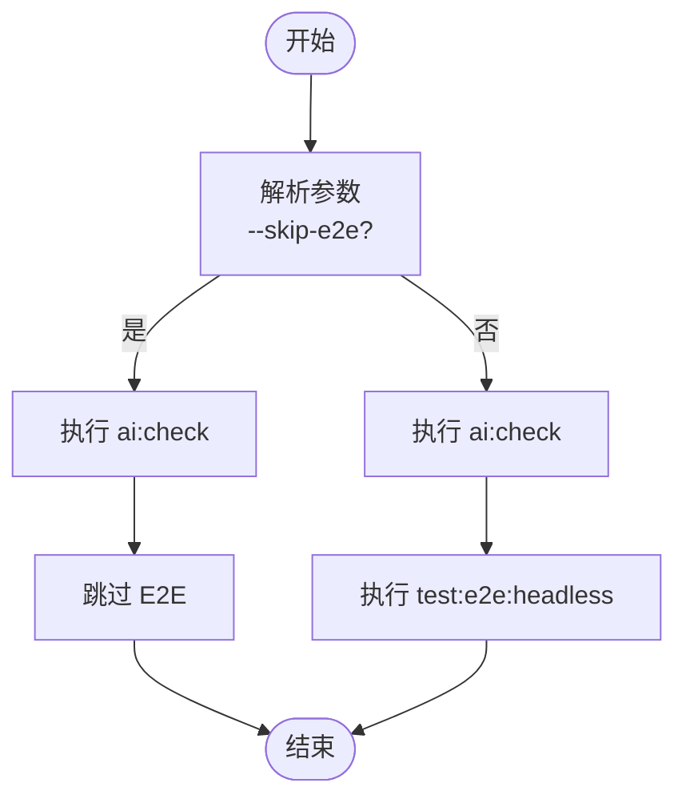
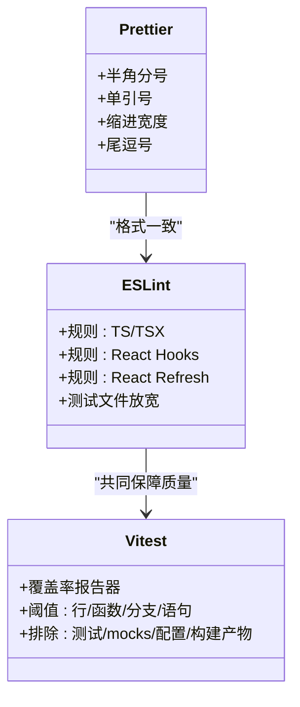
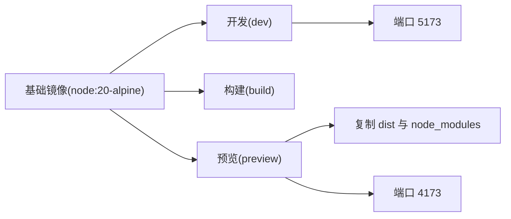
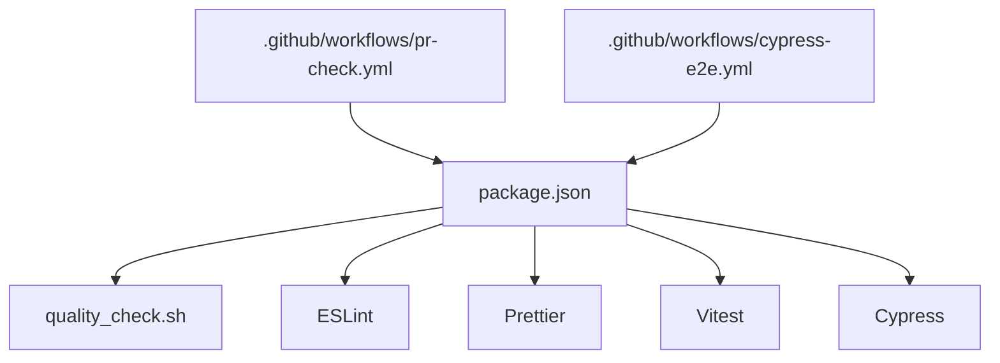

# CI/CD 流水线

<cite>
**本文引用的文件**
- [package.json](file://package.json)
- [scripts/quality_check.sh](file://scripts/quality_check.sh)
- [app/vitest.config.ts](file://app/vitest.config.ts)
- [app/eslint.config.js](file://app/eslint.config.js)
- [.prettierrc](file://.prettierrc)
- [app/cypress.config.js](file://app/cypress.config.js)
- [app/Dockerfile](file://app/Dockerfile)
- [app/docker-compose.dev.yml](file://app/docker-compose.dev.yml)
- [.github/workflows/cypress-e2e.yml](file://.github/workflows/cypress-e2e.yml)
- [.github/workflows/pr-check.yml](file://.github/workflows/pr-check.yml)
</cite>

## 目录
1. [简介](#简介)
2. [项目结构](#项目结构)
3. [核心组件](#核心组件)
4. [架构总览](#架构总览)
5. [详细组件分析](#详细组件分析)
6. [依赖关系分析](#依赖关系分析)
7. [性能考量](#性能考量)
8. [故障排查指南](#故障排查指南)
9. [结论](#结论)
10. [附录](#附录)

## 简介
本文件面向 OPC Starter 项目的持续集成与持续交付（CI/CD）流水线，系统性梳理 GitHub Actions 工作流配置、自动化测试与代码质量检查、构建与部署策略、以及监控与回滚等运维实践。重点覆盖以下方面：
- 自动化测试：ESLint、Prettier、Vitest 单元测试、Cypress E2E 测试
- 质量检查脚本：统一入口与可选跳过 E2E 的执行策略
- 多环境部署：开发分支、测试环境、生产环境的自动化部署思路
- 代码审查与安全扫描：建议的集成点与最佳实践
- 性能测试与监控：建议的落地方式
- 通知与回滚：基于 GitHub Actions 的通知与回滚策略

## 项目结构
围绕 CI/CD 的关键目录与文件如下：
- 根级脚本与工作流
  - scripts/quality_check.sh：统一的质量检查入口，支持跳过 E2E
  - .github/workflows/cypress-e2e.yml：端到端测试工作流
  - .github/workflows/pr-check.yml：PR 汇总检查工作流
- 应用侧质量工具
  - app/eslint.config.js：ESLint 配置
  - .prettierrc：Prettier 配置
  - app/vitest.config.ts：Vitest 测试配置（覆盖率阈值与排除规则）
  - app/cypress.config.js：Cypress 测试配置（超时、重试、截图与视频）
- 构建与运行
  - app/Dockerfile：多阶段构建（开发、构建、预览）
  - app/docker-compose.dev.yml：开发环境一键启动

**图表来源**
- [package.json:1-23](file://package.json#L1-L23)
- [scripts/quality_check.sh:1-30](file://scripts/quality_check.sh#L1-L30)
- [.github/workflows/cypress-e2e.yml](file://.github/workflows/cypress-e2e.yml)
- [.github/workflows/pr-check.yml](file://.github/workflows/pr-check.yml)
- [app/eslint.config.js:1-72](file://app/eslint.config.js#L1-L72)
- [.prettierrc:1-13](file://.prettierrc#L1-L13)
- [app/vitest.config.ts:1-40](file://app/vitest.config.ts#L1-L40)
- [app/cypress.config.js:1-73](file://app/cypress.config.js#L1-L73)
- [app/Dockerfile:1-33](file://app/Dockerfile#L1-L33)
- [app/docker-compose.dev.yml:1-16](file://app/docker-compose.dev.yml#L1-L16)

**章节来源**
- [package.json:1-23](file://package.json#L1-L23)
- [scripts/quality_check.sh:1-30](file://scripts/quality_check.sh#L1-L30)
- [.github/workflows/cypress-e2e.yml](file://.github/workflows/cypress-e2e.yml)
- [.github/workflows/pr-check.yml](file://.github/workflows/pr-check.yml)
- [app/eslint.config.js:1-72](file://app/eslint.config.js#L1-L72)
- [.prettierrc:1-13](file://.prettierrc#L1-L13)
- [app/vitest.config.ts:1-40](file://app/vitest.config.ts#L1-L40)
- [app/cypress.config.js:1-73](file://app/cypress.config.js#L1-L73)
- [app/Dockerfile:1-33](file://app/Dockerfile#L1-L33)
- [app/docker-compose.dev.yml:1-16](file://app/docker-compose.dev.yml#L1-L16)

## 核心组件
- 统一质量检查脚本
  - 提供 ai:check、lint、format、type-check、test、coverage、test:e2e:headless 等命令的统一入口
  - 支持通过参数跳过 E2E，便于快速验证非 E2E 相关变更
- ESLint 与 Prettier
  - ESLint 配置覆盖 TS/TSX、React Hooks、React Refresh 等规则；为测试文件放宽部分规则
  - Prettier 配置集中管理格式风格
- Vitest
  - 覆盖率报告器与阈值设置，排除测试、mock、公共配置与构建产物
- Cypress
  - CI 下自动重试、截图与视频录制、Dashboard 集成预留
- Docker 化
  - 多阶段构建，支持开发模式与预览模式

**章节来源**
- [scripts/quality_check.sh:1-30](file://scripts/quality_check.sh#L1-L30)
- [package.json:5-21](file://package.json#L5-L21)
- [app/eslint.config.js:1-72](file://app/eslint.config.js#L1-L72)
- [.prettierrc:1-13](file://.prettierrc#L1-L13)
- [app/vitest.config.ts:16-37](file://app/vitest.config.ts#L16-L37)
- [app/cypress.config.js:49-52](file://app/cypress.config.js#L49-L52)
- [app/Dockerfile:16-33](file://app/Dockerfile#L16-L33)

## 架构总览
下图展示从代码提交到测试与构建的整体流水线视图，涵盖质量检查、单元测试、E2E 测试与构建阶段。

**图表来源**
- [.github/workflows/pr-check.yml:115-130](file://.github/workflows/pr-check.yml#L115-L130)
- [.github/workflows/cypress-e2e.yml:57-90](file://.github/workflows/cypress-e2e.yml#L57-L90)
- [scripts/quality_check.sh:20-29](file://scripts/quality_check.sh#L20-L29)
- [app/vitest.config.ts:12-37](file://app/vitest.config.ts#L12-L37)
- [app/cypress.config.js:17-52](file://app/cypress.config.js#L17-L52)

## 详细组件分析

### GitHub Actions 工作流：PR 汇总检查
- 触发条件：PR 创建或更新
- 步骤组成：
  - 并行执行：ESLint + 类型检查、Vitest 单元测试、构建
  - 汇总：根据上游任务结果生成 PR 汇总报告
- 关键点：
  - 使用 needs 串联任务，确保汇总在所有任务完成后执行
  - 汇总报告中对每个子任务进行状态标记

**图表来源**
- [.github/workflows/pr-check.yml:115-130](file://.github/workflows/pr-check.yml#L115-L130)

**章节来源**
- [.github/workflows/pr-check.yml:115-130](file://.github/workflows/pr-check.yml#L115-L130)

### GitHub Actions 工作流：Cypress E2E 测试
- 触发条件：PR 或指定分支推送
- 步骤组成：
  - 启动应用：npm run dev:test
  - 等待服务就绪：wait-on
  - 运行 Cypress：支持矩阵浏览器、配置文件、可选 Dashboard 录制
  - 失败时上传截图与视频作为工件
- 关键点：
  - CI 下 retries 设置为 2，本地 openMode 不重试
  - 支持 GitHub Token 传递给 Cypress Dashboard 集成

**图表来源**
- [.github/workflows/cypress-e2e.yml:57-90](file://.github/workflows/cypress-e2e.yml#L57-L90)
- [app/cypress.config.js:49-52](file://app/cypress.config.js#L49-L52)

**章节来源**
- [.github/workflows/cypress-e2e.yml:57-90](file://.github/workflows/cypress-e2e.yml#L57-L90)
- [app/cypress.config.js:1-73](file://app/cypress.config.js#L1-L73)

### 质量检查脚本：统一入口与可选跳过 E2E
- 功能：
  - 先执行 ai:check（AI 友好检查）
  - 若传入 --skip-e2e，则跳过 E2E，直接结束
  - 否则执行 test:e2e:headless
- 使用场景：
  - 快速验证非 E2E 变更
  - 在本地或 CI 中统一调用

**图表来源**
- [scripts/quality_check.sh:7-29](file://scripts/quality_check.sh#L7-L29)

**章节来源**
- [scripts/quality_check.sh:1-30](file://scripts/quality_check.sh#L1-L30)
- [package.json:5-21](file://package.json#L5-L21)

### 代码质量工具：ESLint、Prettier、Vitest
- ESLint
  - 覆盖 TS/TSX、React Hooks、React Refresh
  - 对测试文件放宽规则，允许 any、宽松空对象类型等
- Prettier
  - 集中式格式化配置，保证团队一致性
- Vitest
  - 覆盖率阈值与排除规则，确保关键源码被测试覆盖

**图表来源**
- [app/eslint.config.js:1-72](file://app/eslint.config.js#L1-L72)
- [.prettierrc:1-13](file://.prettierrc#L1-L13)
- [app/vitest.config.ts:16-37](file://app/vitest.config.ts#L16-L37)

**章节来源**
- [app/eslint.config.js:1-72](file://app/eslint.config.js#L1-L72)
- [.prettierrc:1-13](file://.prettierrc#L1-L13)
- [app/vitest.config.ts:1-40](file://app/vitest.config.ts#L1-L40)

### 构建与部署：Docker 多阶段与开发环境
- 多阶段构建
  - 开发阶段：暴露 5173，运行 dev:test
  - 构建阶段：生成 dist
  - 预览阶段：复制 dist 与 node_modules，暴露 4173，运行 preview
- 开发环境
  - docker-compose.dev.yml 挂载源码、映射端口、加载 .env.test

**图表来源**
- [app/Dockerfile:1-33](file://app/Dockerfile#L1-L33)
- [app/docker-compose.dev.yml:4-16](file://app/docker-compose.dev.yml#L4-L16)

**章节来源**
- [app/Dockerfile:1-33](file://app/Dockerfile#L1-L33)
- [app/docker-compose.dev.yml:1-16](file://app/docker-compose.dev.yml#L1-L16)

## 依赖关系分析
- 脚本与工具
  - package.json 的脚本统一调度各质量工具
  - quality_check.sh 作为 CI 的统一入口，串联 ai:check 与 E2E
- 工具间耦合
  - ESLint 与 Prettier 在格式与静态规则上互补
  - Vitest 与 Cypress 分别负责单元与端到端测试，互补覆盖
- 工作流与工具
  - GitHub Actions 工作流直接调用 npm 脚本，实现解耦
  - Cypress 工作流通过 wait-on 等机制与应用生命周期绑定

**图表来源**
- [package.json:5-21](file://package.json#L5-L21)
- [scripts/quality_check.sh:20-29](file://scripts/quality_check.sh#L20-L29)
- [app/eslint.config.js:1-72](file://app/eslint.config.js#L1-L72)
- [.prettierrc:1-13](file://.prettierrc#L1-L13)
- [app/vitest.config.ts:12-37](file://app/vitest.config.ts#L12-L37)
- [app/cypress.config.js:57-70](file://app/cypress.config.js#L57-L70)
- [.github/workflows/pr-check.yml:115-130](file://.github/workflows/pr-check.yml#L115-L130)
- [.github/workflows/cypress-e2e.yml:57-90](file://.github/workflows/cypress-e2e.yml#L57-L90)

**章节来源**
- [package.json:5-21](file://package.json#L5-L21)
- [scripts/quality_check.sh:1-30](file://scripts/quality_check.sh#L1-L30)
- [app/eslint.config.js:1-72](file://app/eslint.config.js#L1-L72)
- [.prettierrc:1-13](file://.prettierrc#L1-L13)
- [app/vitest.config.ts:1-40](file://app/vitest.config.ts#L1-L40)
- [app/cypress.config.js:1-73](file://app/cypress.config.js#L1-L73)
- [.github/workflows/pr-check.yml:115-130](file://.github/workflows/pr-check.yml#L115-L130)
- [.github/workflows/cypress-e2e.yml:57-90](file://.github/workflows/cypress-e2e.yml#L57-L90)

## 性能考量
- 测试并行化
  - Cypress 工作流支持矩阵浏览器，可在 CI 中并行执行，缩短整体耗时
- 缓存与重试
  - Vitest 覆盖率阈值避免过度测试负担，同时保证关键路径覆盖
  - Cypress 在 CI 下开启重试，降低偶发失败的影响
- 构建优化
  - Docker 多阶段构建减少最终镜像体积，提升拉取与启动效率

[本节为通用指导，无需特定文件引用]

## 故障排查指南
- ESLint/Prettier 报错
  - 确认本地与 CI 使用相同版本的工具链
  - 检查测试文件规则放宽是否导致误报
- Vitest 覆盖率不足
  - 检查排除列表与阈值设置，确认关键模块未被排除
- Cypress 失败
  - 查看失败时上传的截图与视频工件
  - 检查等待服务就绪时间与超时配置
- Docker 构建异常
  - 确认多阶段目标正确（dev/build/preview）
  - 检查端口映射与卷挂载

**章节来源**
- [app/vitest.config.ts:16-37](file://app/vitest.config.ts#L16-L37)
- [app/cypress.config.js:49-52](file://app/cypress.config.js#L49-L52)
- [app/Dockerfile:16-33](file://app/Dockerfile#L16-L33)
- [app/docker-compose.dev.yml:9-15](file://app/docker-compose.dev.yml#L9-L15)

## 结论
本项目已具备完善的 CI/CD 基础设施：统一的质量检查入口、ESLint/Prettier/Vitest/Cypress 的协同、以及 Docker 多阶段构建与开发环境一键启动。建议在现有基础上补充：
- 代码审查与安全扫描：在 PR 检查工作流中增加安全扫描与依赖漏洞检测
- 性能测试：引入性能回归测试，结合 Cypress 或独立脚本
- 部署策略：为不同环境（开发/测试/生产）设计明确的分支策略与发布流程
- 监控与通知：在工作流中集成通知渠道与回滚策略

[本节为总结性内容，无需特定文件引用]

## 附录
- 质量检查脚本使用
  - 默认：先执行 ai:check，再执行 test:e2e:headless
  - 跳过 E2E：传入 --skip-e2e 参数
- 工作流配置要点
  - PR 汇总检查：串联 lint/type-check/build，生成汇总报告
  - E2E 测试：支持矩阵浏览器、CI 重试、截图与视频工件
- 构建与运行
  - 开发：docker-compose dev 镜像，端口 5173
  - 预览：复制 dist 与 node_modules，端口 4173

**章节来源**
- [scripts/quality_check.sh:1-30](file://scripts/quality_check.sh#L1-L30)
- [.github/workflows/pr-check.yml:115-130](file://.github/workflows/pr-check.yml#L115-L130)
- [.github/workflows/cypress-e2e.yml:57-90](file://.github/workflows/cypress-e2e.yml#L57-L90)
- [app/Dockerfile:16-33](file://app/Dockerfile#L16-L33)
- [app/docker-compose.dev.yml:4-16](file://app/docker-compose.dev.yml#L4-L16)