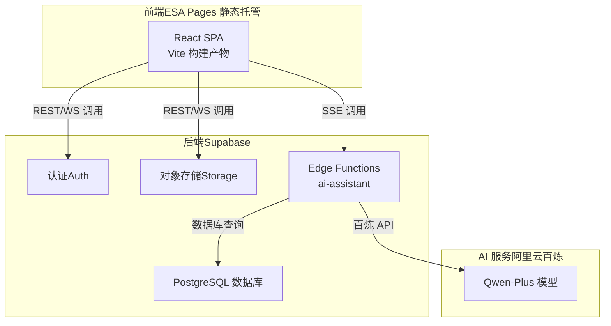
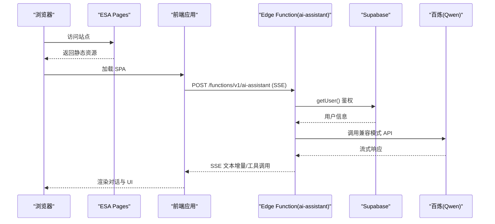
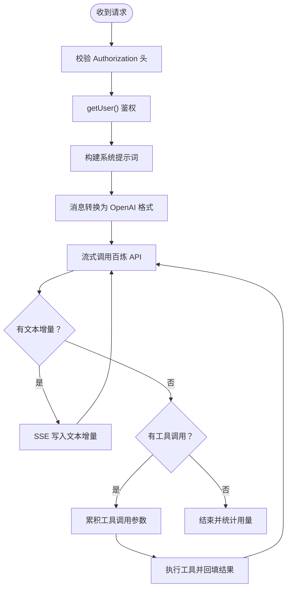
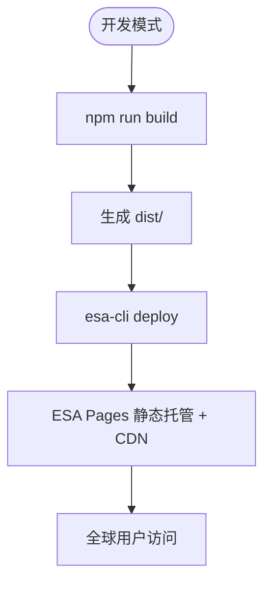
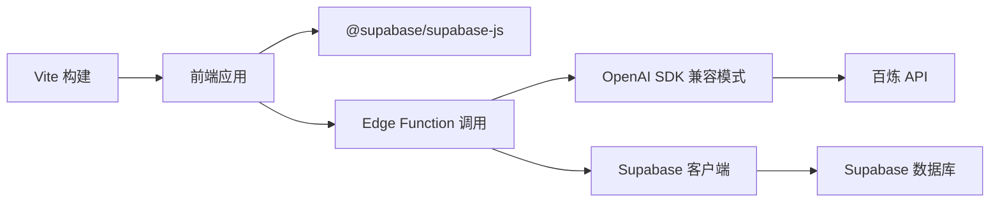

# 云平台部署

<cite>
**本文引用的文件**
- [ALIYUN-DEPLOY.md](file://ALIYUN-DEPLOY.md)
- [setup.sql](file://app/supabase/setup.sql)
- [index.ts](file://app/supabase/functions/ai-assistant/index.ts)
- [types.ts](file://app/supabase/functions/ai-assistant/types.ts)
- [sse.ts](file://app/supabase/functions/ai-assistant/sse.ts)
- [agentLoop.ts](file://app/supabase/functions/ai-assistant/agentLoop.ts)
- [tools.ts](file://app/supabase/functions/ai-assistant/tools.ts)
- [vite.config.ts](file://app/vite.config.ts)
- [package.json](file://app/package.json)
- [env.local.example](file://app/env.local.example)
- [esa.jsonc](file://app/esa.jsonc)
- [README.md](file://README.md)
</cite>

## 目录
1. [简介](#简介)
2. [项目结构](#项目结构)
3. [核心组件](#核心组件)
4. [架构总览](#架构总览)
5. [详细组件分析](#详细组件分析)
6. [依赖关系分析](#依赖关系分析)
7. [性能考量](#性能考量)
8. [故障排除指南](#故障排除指南)
9. [结论](#结论)
10. [附录](#附录)

## 简介
本文件面向在阿里云平台上进行部署的工程师与产品团队，提供 OPC-Starter 在阿里云 ESA Pages 静态托管下的完整部署指南。内容涵盖 Supabase 数据库与 Edge Functions 配置、百炼 AI API 集成、前端构建与部署、环境变量配置清单、自定义域名与 HTTPS、安全最佳实践以及部署后的验证与故障排除。

## 项目结构
项目采用前后端分离架构，前端基于 React + Vite，后端以 Supabase 为核心（数据库、认证、存储、Edge Functions），AI 能力通过百炼（通义千问）实现，前端通过 ESA Pages 进行静态托管与全球 CDN 加速。

图表来源
- [index.ts:1-116](file://app/supabase/functions/ai-assistant/index.ts#L1-L116)
- [agentLoop.ts:1-138](file://app/supabase/functions/ai-assistant/agentLoop.ts#L1-L138)
- [setup.sql:1-505](file://app/supabase/setup.sql#L1-L505)

章节来源
- [README.md:114-144](file://README.md#L114-L144)

## 核心组件
- Supabase 数据库与认证：提供用户认证、组织管理、RLS 安全策略与实时订阅。
- Supabase Storage：提供公开与私有存储桶，满足头像与上传文件场景。
- Supabase Edge Functions：ai-assistant 函数负责接收前端请求，鉴权后调用百炼 API，并通过 SSE 流式返回结果。
- 百炼 AI API：通过 OpenAI SDK 兼容模式对接通义千问模型。
- 前端应用（Vite + React）：构建产物交由 ESA Pages 静态托管，支持单页应用路由。
- ESA Pages：静态资源托管与全球 CDN 加速，支持自定义域名与 HTTPS。

章节来源
- [setup.sql:1-505](file://app/supabase/setup.sql#L1-L505)
- [index.ts:1-116](file://app/supabase/functions/ai-assistant/index.ts#L1-L116)
- [agentLoop.ts:1-138](file://app/supabase/functions/ai-assistant/agentLoop.ts#L1-L138)
- [vite.config.ts:1-77](file://app/vite.config.ts#L1-L77)
- [esa.jsonc:1-11](file://app/esa.jsonc#L1-L11)

## 架构总览
下图展示了从浏览器到 Supabase 与百炼的端到端调用链路，以及静态资源的分发路径。

图表来源
- [index.ts:22-113](file://app/supabase/functions/ai-assistant/index.ts#L22-L113)
- [agentLoop.ts:43-76](file://app/supabase/functions/ai-assistant/agentLoop.ts#L43-L76)
- [sse.ts:13-24](file://app/supabase/functions/ai-assistant/sse.ts#L13-L24)

## 详细组件分析

### Supabase 数据库与初始化
- 数据库初始化脚本创建核心表与 RLS 策略，包括用户资料、组织架构、成员关系与 Agent 会话相关表。
- 脚本还包含辅助函数（如新增用户触发器、更新时间戳、组织访问控制等）。
- 建议在 SQL Editor 中一次性执行，确保 RLS 与索引生效。

章节来源
- [setup.sql:1-505](file://app/supabase/setup.sql#L1-L505)

### Supabase Storage Bucket 配置
- 公共存储桶：avatars（头像）
- 私有存储桶：uploads（用户上传文件）
- Storage RLS 策略：插入需已认证；选择对公共桶为真；删除需拥有者匹配。

章节来源
- [setup.sql:490-501](file://app/supabase/setup.sql#L490-L501)

### Edge Functions：ai-assistant
- 入口文件负责：
  - CORS 预检与方法限制
  - 从 Authorization 头提取用户令牌并鉴权
  - 将消息转换为 OpenAI 兼容格式
  - 通过 SSE 流式返回文本增量与工具调用
- Agent 循环：
  - 通过 OpenAI SDK 兼容模式调用百炼
  - 支持工具调用累积与回填
  - 限制最大迭代次数，避免长时间占用
- 工具集：
  - navigateToPage：页面跳转
  - getCurrentContext：获取上下文
  - renderUI：生成 A2UI 组件供用户交互

图表来源
- [index.ts:34-98](file://app/supabase/functions/ai-assistant/index.ts#L34-L98)
- [agentLoop.ts:43-131](file://app/supabase/functions/ai-assistant/agentLoop.ts#L43-L131)
- [sse.ts:41-62](file://app/supabase/functions/ai-assistant/sse.ts#L41-L62)

章节来源
- [index.ts:1-116](file://app/supabase/functions/ai-assistant/index.ts#L1-L116)
- [agentLoop.ts:1-138](file://app/supabase/functions/ai-assistant/agentLoop.ts#L1-L138)
- [tools.ts:1-191](file://app/supabase/functions/ai-assistant/tools.ts#L1-L191)
- [sse.ts:1-180](file://app/supabase/functions/ai-assistant/sse.ts#L1-L180)

### 百炼 AI API 集成
- 通过 Edge Function Secret 注入 ALIYUN_BAILIAN_API_KEY
- 使用 OpenAI SDK 兼容模式，baseURL 指向百炼兼容接口
- 默认模型为 qwen-plus，可在函数中调整

章节来源
- [index.ts:35-52](file://app/supabase/functions/ai-assistant/index.ts#L35-L52)
- [agentLoop.ts:16-19](file://app/supabase/functions/ai-assistant/agentLoop.ts#L16-L19)

### 前端构建与部署（Vite + ESA Pages）
- 构建配置：
  - 依赖预构建与手动分包策略，提升首包加载性能
  - CSS 代码分割与 Terser 压缩
  - 生产环境关闭 sourcemap
- 部署配置：
  - esa.jsonc 指定 dist 目录与单页应用路由策略
  - 通过 ESA CLI 登录并部署

图表来源
- [vite.config.ts:40-76](file://app/vite.config.ts#L40-L76)
- [esa.jsonc:1-11](file://app/esa.jsonc#L1-L11)

章节来源
- [vite.config.ts:1-77](file://app/vite.config.ts#L1-L77)
- [package.json:26-46](file://app/package.json#L26-L46)
- [esa.jsonc:1-11](file://app/esa.jsonc#L1-L11)

### 环境变量配置清单
- 前端（.env.local）：
  - VITE_SUPABASE_URL：Supabase 项目 URL
  - VITE_SUPABASE_ANON_KEY：匿名密钥
  - VITE_ENABLE_MSW：开发阶段启用 MSW（可选）
  - VITE_LOG_LEVEL：日志级别（可选）
- Edge Function Secrets：
  - ALIYUN_BAILIAN_API_KEY：百炼 API Key
  - SUPABASE_URL、SUPABASE_ANON_KEY、SUPABASE_SERVICE_ROLE_KEY：由 Supabase 自动注入

章节来源
- [env.local.example:1-44](file://app/env.local.example#L1-L44)
- [ALIYUN-DEPLOY.md:369-390](file://ALIYUN-DEPLOY.md#L369-L390)

## 依赖关系分析
- 前端依赖：
  - React、React Router、Zustand、Axios、Supabase JS SDK 等
  - Vite 提供开发服务器与构建优化
- Edge Functions 依赖：
  - OpenAI SDK 兼容模式（百炼）
  - Supabase 客户端用于鉴权与数据库访问
  - 自定义工具与 SSE 工具模块

图表来源
- [package.json:48-84](file://app/package.json#L48-L84)
- [index.ts:10-20](file://app/supabase/functions/ai-assistant/index.ts#L10-L20)
- [agentLoop.ts:7-19](file://app/supabase/functions/ai-assistant/agentLoop.ts#L7-L19)

章节来源
- [package.json:1-141](file://app/package.json#L1-L141)
- [index.ts:1-21](file://app/supabase/functions/ai-assistant/index.ts#L1-L21)

## 性能考量
- 前端构建：
  - 手动分包策略减少首包体积，提升加载速度
  - CSS 分割与压缩降低传输体积
- Edge Functions：
  - 流式响应（SSE）提升交互体验
  - 限制最大迭代次数，避免长时间占用
- 静态托管：
  - ESA Pages 全球 CDN 加速，减少延迟

章节来源
- [vite.config.ts:40-76](file://app/vite.config.ts#L40-L76)
- [agentLoop.ts:24-26](file://app/supabase/functions/ai-assistant/agentLoop.ts#L24-L26)

## 故障排除指南
- ESA 部署失败：
  - 检查登录状态与构建产物，确认 esa.jsonc 配置
- AI 助手无响应：
  - 查看 Edge Function 日志，确认 Secret 配置与百炼连通性
- 登录/认证失败：
  - 校验前端环境变量与 Supabase URL 配置，检查浏览器控制台 CORS
- 数据库连接错误：
  - 确认 Supabase 项目状态、RLS 策略与 Anon Key

章节来源
- [ALIYUN-DEPLOY.md:492-553](file://ALIYUN-DEPLOY.md#L492-L553)

## 结论
通过 Supabase 的认证、存储与 Edge Functions 能力，结合百炼 AI 的流式对话与工具调用，OPC-Starter 在阿里云 ESA Pages 上实现了高性能、可扩展且安全的静态托管方案。遵循本文档的部署步骤与最佳实践，可快速完成上线并具备良好的可维护性与扩展性。

## 附录

### 自定义域名与 HTTPS
- 在 ESA 控制台添加自定义域名并配置 CNAME 记录
- 支持自动申请免费证书或上传自有证书
- 若使用自定义域名，需在 Supabase Dashboard 更新认证 URL 与重定向地址

章节来源
- [ALIYUN-DEPLOY.md:393-430](file://ALIYUN-DEPLOY.md#L393-L430)

### 安全最佳实践
- Supabase MCP：启用 RLS、定期审计策略
- 百炼 API Key：按环境区分、限额与轮转
- 阿里云 AccessKey：使用 RAM 子账号、最小权限与 MFA

章节来源
- [ALIYUN-DEPLOY.md:433-489](file://ALIYUN-DEPLOY.md#L433-L489)