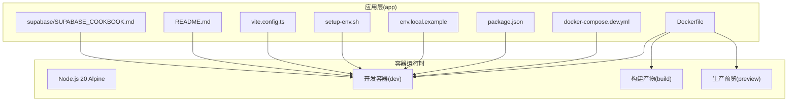
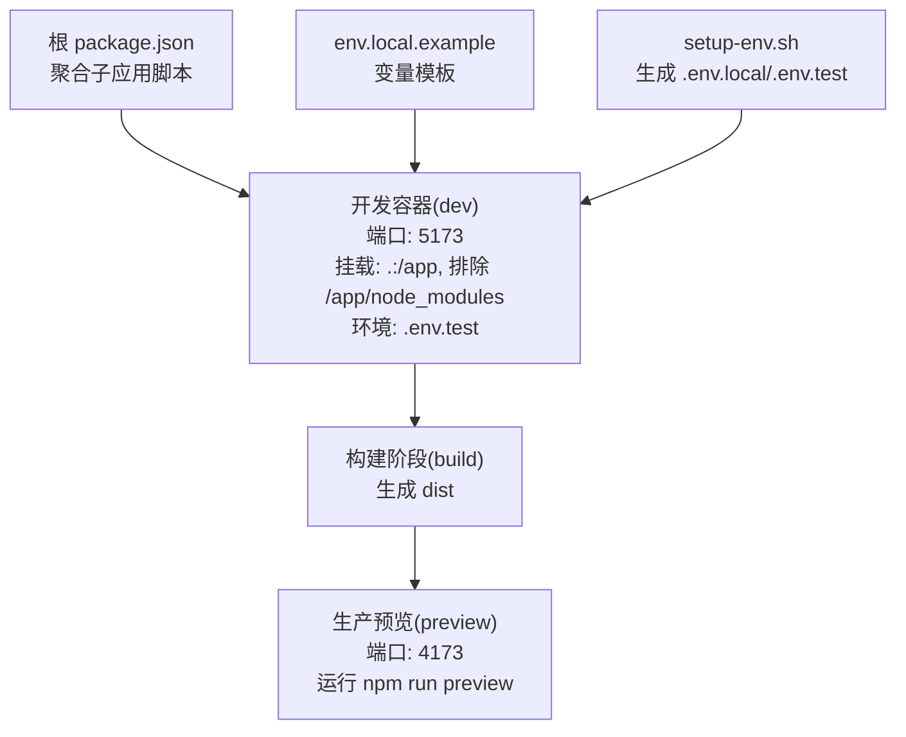
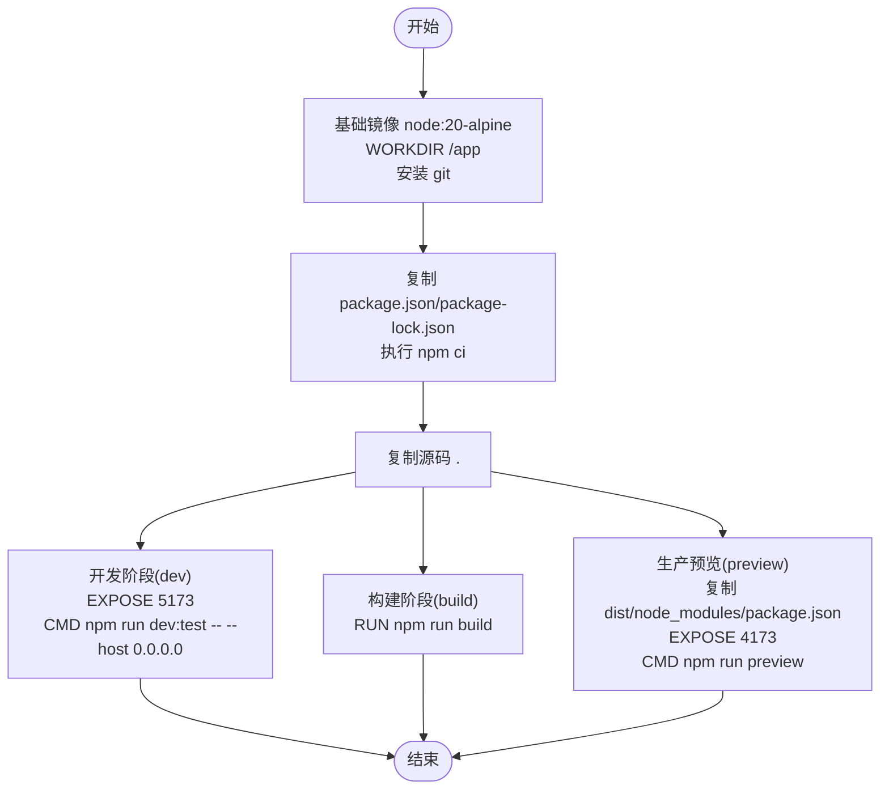
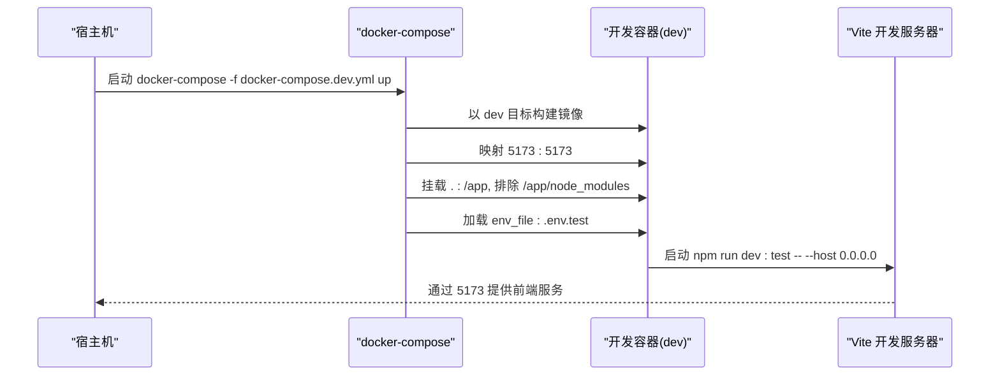
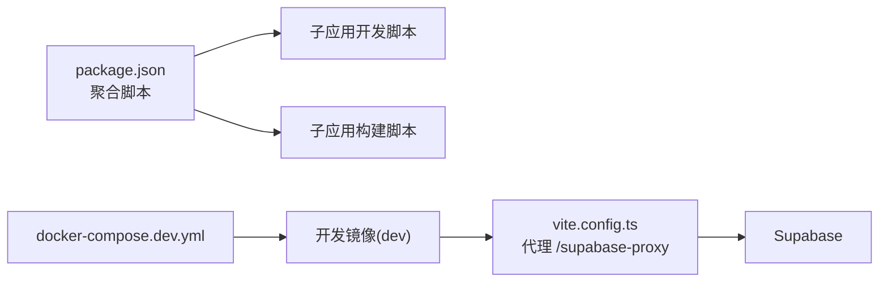

# 容器化部署

<cite>
**本文引用的文件**
- [Dockerfile](file://app/Dockerfile)
- [docker-compose.dev.yml](file://app/docker-compose.dev.yml)
- [package.json](file://package.json)
- [env.local.example](file://app/env.local.example)
- [setup-env.sh](file://app/setup-env.sh)
- [vite.config.ts](file://app/vite.config.ts)
- [README.md](file://app/README.md)
- [ALIYUN-DEPLOY.md](file://ALIYUN-DEPLOY.md)
- [SUPABASE_COOKBOOK.md](file://app/supabase/SUPABASE_COOKBOOK.md)
</cite>

## 目录
1. [简介](#简介)
2. [项目结构](#项目结构)
3. [核心组件](#核心组件)
4. [架构总览](#架构总览)
5. [详细组件分析](#详细组件分析)
6. [依赖关系分析](#依赖关系分析)
7. [性能考量](#性能考量)
8. [故障排查指南](#故障排查指南)
9. [结论](#结论)
10. [附录](#附录)

## 简介
本章节面向希望以容器化方式部署 OPC-Starter 的团队与个人，提供从 Dockerfile 构建配置、镜像构建命令、容器运行参数，到 docker-compose 开发环境编排、网络与卷挂载、环境变量与端口映射、数据持久化策略的完整说明。同时给出容器部署最佳实践（镜像优化、多阶段构建、安全配置），以及容器调试、日志查看与性能监控的运维指南。

## 项目结构
OPC-Starter 采用根工作区 + 子应用 app 的组织方式，容器化部署主要围绕 app 子目录进行。关键容器化相关文件如下：
- Dockerfile：定义多阶段构建（基础镜像、开发、构建产物、生产预览）。
- docker-compose.dev.yml：开发环境编排，暴露前端开发端口、挂载源码与 node_modules。
- package.json：根脚本聚合，便于在宿主机统一触发子应用脚本。
- env.local.example 与 setup-env.sh：提供环境变量模板与一键生成脚本。
- vite.config.ts：开发服务器代理、构建优化等，影响容器内开发体验。
- README.md：应用侧开发与运行说明。
- ALIYUN-DEPLOY.md：云托管部署指南，包含前端构建与部署流程。
- SUPABASE_COOKBOOK.md：Supabase 边缘函数与环境变量说明。

图表来源
- [Dockerfile:1-33](file://app/Dockerfile#L1-L33)
- [docker-compose.dev.yml:1-16](file://app/docker-compose.dev.yml#L1-L16)
- [package.json:1-23](file://package.json#L1-L23)
- [env.local.example:1-44](file://app/env.local.example#L1-L44)
- [setup-env.sh:1-121](file://app/setup-env.sh#L1-L121)
- [vite.config.ts:1-77](file://app/vite.config.ts#L1-L77)
- [README.md:1-101](file://app/README.md#L1-L101)
- [SUPABASE_COOKBOOK.md:1-82](file://app/supabase/SUPABASE_COOKBOOK.md#L1-L82)

章节来源
- [Dockerfile:1-33](file://app/Dockerfile#L1-L33)
- [docker-compose.dev.yml:1-16](file://app/docker-compose.dev.yml#L1-L16)
- [package.json:1-23](file://package.json#L1-L23)
- [env.local.example:1-44](file://app/env.local.example#L1-L44)
- [setup-env.sh:1-121](file://app/setup-env.sh#L1-L121)
- [vite.config.ts:1-77](file://app/vite.config.ts#L1-L77)
- [README.md:1-101](file://app/README.md#L1-L101)
- [ALIYUN-DEPLOY.md:1-620](file://ALIYUN-DEPLOY.md#L1-L620)
- [SUPABASE_COOKBOOK.md:1-82](file://app/supabase/SUPABOOK.md#L1-L82)

## 核心组件
- 多阶段 Dockerfile
  - 基础镜像：基于 node:20-alpine，工作目录 /app，安装 git，复制依赖文件并执行 npm ci，再复制源码。
  - 开发阶段(dev)：暴露 5173 端口，启动命令 npm run dev:test 并监听 0.0.0.0。
  - 构建阶段(build)：执行 npm run build 生成 dist。
  - 生产预览(preview)：复制 dist、node_modules、package.json，暴露 4173 端口，启动 npm run preview。
- docker-compose 开发编排
  - 服务 app：以 dev 目标构建；端口映射 5173:5173；挂载当前目录到 /app，排除 node_modules。
  - 环境文件：加载 .env.test。
- 环境变量与脚本
  - env.local.example 提供 Supabase 与 OSS、MSW、日志级别等变量模板。
  - setup-env.sh 一键生成 .env.local 与 .env.test，支持 Supabase 模式与 MSW 模式。
  - package.json 聚合子应用脚本，便于在根目录统一执行。
- Vite 开发服务器与代理
  - vite.config.ts 配置开发服务器代理 /supabase-proxy，将请求转发到 VITE_SUPABASE_URL，便于跨域调试。

章节来源
- [Dockerfile:1-33](file://app/Dockerfile#L1-L33)
- [docker-compose.dev.yml:1-16](file://app/docker-compose.dev.yml#L1-L16)
- [env.local.example:1-44](file://app/env.local.example#L1-L44)
- [setup-env.sh:1-121](file://app/setup-env.sh#L1-L121)
- [package.json:1-23](file://package.json#L1-L23)
- [vite.config.ts:1-77](file://app/vite.config.ts#L1-L77)

## 架构总览
容器化部署围绕“开发容器 + 构建产物 + 生产预览”三层展开，开发阶段通过 docker-compose 将宿主机源码挂载到容器，实现热更新；构建阶段生成静态产物；生产预览阶段以轻量 Node 服务预览产物。

图表来源
- [Dockerfile:16-33](file://app/Dockerfile#L16-L33)
- [docker-compose.dev.yml:4-16](file://app/docker-compose.dev.yml#L4-L16)
- [package.json:5-21](file://package.json#L5-L21)
- [env.local.example:1-44](file://app/env.local.example#L1-L44)
- [setup-env.sh:69-87](file://app/setup-env.sh#L69-L87)

章节来源
- [Dockerfile:16-33](file://app/Dockerfile#L16-L33)
- [docker-compose.dev.yml:4-16](file://app/docker-compose.dev.yml#L4-L16)
- [package.json:5-21](file://package.json#L5-L21)
- [env.local.example:1-44](file://app/env.local.example#L1-L44)
- [setup-env.sh:69-87](file://app/setup-env.sh#L69-L87)

## 详细组件分析

### Dockerfile 多阶段构建流程
- 基础层：安装 git，复制依赖文件并执行 npm ci，随后复制源码。
- 开发阶段(dev)：暴露 5173，启动命令监听 0.0.0.0，适配容器网络。
- 构建阶段(build)：执行 npm run build 生成 dist。
- 生产预览(preview)：复制 dist、node_modules、package.json，暴露 4173，启动 npm run preview。

图表来源
- [Dockerfile:1-33](file://app/Dockerfile#L1-L33)

章节来源
- [Dockerfile:1-33](file://app/Dockerfile#L1-L33)

### docker-compose 开发环境编排
- 服务 app：以 dev 目标构建，端口映射 5173:5173，挂载当前目录到 /app，排除 node_modules。
- 环境文件：加载 .env.test，用于 MSW Mock 模式。

图表来源
- [docker-compose.dev.yml:4-16](file://app/docker-compose.dev.yml#L4-L16)
- [Dockerfile:16-19](file://app/Dockerfile#L16-L19)

章节来源
- [docker-compose.dev.yml:1-16](file://app/docker-compose.dev.yml#L1-L16)
- [Dockerfile:16-19](file://app/Dockerfile#L16-L19)

### 环境变量与端口映射
- 环境变量模板：env.local.example 提供 Supabase URL/Key、OSS 加速、MSW 开关、日志级别等。
- 一键生成：setup-env.sh 支持生成 .env.local 与 .env.test，分别对应真实后端与 MSW Mock。
- 端口映射：
  - 开发容器：5173（Vite 开发服务器）。
  - 生产预览：4173（npm run preview）。
- Vite 代理：vite.config.ts 将 /supabase-proxy 代理到 VITE_SUPABASE_URL，便于容器内调试。

章节来源
- [env.local.example:1-44](file://app/env.local.example#L1-L44)
- [setup-env.sh:69-87](file://app/setup-env.sh#L69-L87)
- [vite.config.ts:20-39](file://app/vite.config.ts#L20-L39)

### 数据持久化策略
- 开发阶段：通过卷挂载将宿主机源码目录映射到容器 /app，实现代码热更新；node_modules 通过匿名卷排除，避免宿主机污染。
- 生产阶段：dist 产物由生产预览镜像复制，不依赖宿主机卷；如需持久化日志或缓存，建议在容器外挂载专用卷并调整应用日志输出路径。

章节来源
- [docker-compose.dev.yml:11-13](file://app/docker-compose.dev.yml#L11-L13)
- [Dockerfile:22-32](file://app/Dockerfile#L22-L32)

### 容器内运行参数与命令
- 开发容器(dev)：CMD ["npm", "run", "dev:test", "--", "--host", "0.0.0.0"]，监听 0.0.0.0 以允许外部访问。
- 构建阶段(build)：RUN ["npm", "run", "build"]，生成 dist。
- 生产预览(preview)：CMD ["npm", "run", "preview"]，监听 4173。

章节来源
- [Dockerfile:16-33](file://app/Dockerfile#L16-L33)

### 与 Supabase 边缘函数的集成
- Edge Function 环境变量：ALIYUN_BAILIAN_API_KEY 通过 Supabase Secrets 注入；SUPABASE_URL、SUPABASE_ANON_KEY、SUPABASE_SERVICE_ROLE_KEY 由 Supabase 自动注入。
- Vite 代理：开发时通过 /supabase-proxy 将请求转发到 Supabase，便于容器内调试。

章节来源
- [ALIYUN-DEPLOY.md:380-389](file://ALIYUN-DEPLOY.md#L380-L389)
- [vite.config.ts:20-39](file://app/vite.config.ts#L20-L39)

## 依赖关系分析
- 根脚本聚合：package.json 将子应用脚本聚合到根命名空间，便于统一执行。
- 开发依赖：MSW 与 Faker 等仅在开发/测试环境使用，不在生产构建中打包。
- 代理链路：Vite 开发服务器代理 /supabase-proxy 到 Supabase，容器内调试时保持一致行为。

图表来源
- [package.json:5-21](file://package.json#L5-L21)
- [vite.config.ts:20-39](file://app/vite.config.ts#L20-L39)
- [docker-compose.dev.yml:4-16](file://app/docker-compose.dev.yml#L4-L16)

章节来源
- [package.json:5-21](file://package.json#L5-L21)
- [vite.config.ts:20-39](file://app/vite.config.ts#L20-L39)
- [docker-compose.dev.yml:4-16](file://app/docker-compose.dev.yml#L4-L16)

## 性能考量
- 多阶段构建：分离依赖安装、构建与预览阶段，减少最终镜像体积，提升缓存命中率。
- 依赖安装优化：使用 npm ci 并缓存 node_modules，结合 Docker 层缓存策略。
- 构建优化：Vite 配置中对 vendor 包进行手动分包与 CSS 代码分割，降低首屏体积。
- 端口与网络：开发容器监听 0.0.0.0，便于容器外部访问；生产预览使用 4173，避免与宿主机冲突。
- 日志与监控：建议在容器外集中收集日志，结合应用日志级别控制输出量。

章节来源
- [Dockerfile:9-11](file://app/Dockerfile#L9-L11)
- [vite.config.ts:40-70](file://app/vite.config.ts#L40-L70)

## 故障排查指南
- 容器无法访问开发服务
  - 确认容器监听地址为 0.0.0.0（Dockerfile dev CMD 已设置）。
  - 检查端口映射 5173:5173 是否冲突。
- 环境变量未生效
  - 确认 .env.test/.env.local 已正确生成与加载。
  - 确认 VITE_SUPABASE_URL/VITE_SUPABASE_ANON_KEY 配置正确。
- 代理请求失败
  - 检查 vite.config.ts 中 /supabase-proxy 代理配置与 VITE_SUPABASE_URL 一致性。
- 生产预览端口占用
  - 修改 Dockerfile EXPOSE 4173 或宿主机映射端口。
- 日志查看
  - 开发容器：查看容器标准输出日志。
  - Supabase 边缘函数：参考云托管部署文档中的日志查看方式。

章节来源
- [Dockerfile:16-19](file://app/Dockerfile#L16-L19)
- [docker-compose.dev.yml:9-10](file://app/docker-compose.dev.yml#L9-L10)
- [env.local.example:7-9](file://app/env.local.example#L7-L9)
- [vite.config.ts:20-39](file://app/vite.config.ts#L20-L39)
- [ALIYUN-DEPLOY.md:593-598](file://ALIYUN-DEPLOY.md#L593-L598)

## 结论
通过多阶段 Dockerfile 与 docker-compose 开发编排，OPC-Starter 能在容器环境中高效地进行前端开发与预览。配合环境变量模板与一键生成脚本，可快速完成开发与测试环境配置。生产预览阶段以轻量 Node 服务承载构建产物，便于快速验证。建议在生产部署时结合云托管方案与安全最佳实践，确保服务稳定与安全。

## 附录
- 镜像构建命令示例（基于当前仓库结构）
  - 开发镜像：docker build -f app/Dockerfile -t opc-starter-app:dev --target dev .
  - 生产预览镜像：docker build -f app/Dockerfile -t opc-starter-app:preview --target preview .
- 容器运行示例
  - 开发容器：docker run -it --rm -p 5173:5173 -v .:/app -v /app/node_modules opc-starter-app:dev
  - 生产预览：docker run -it --rm -p 4173:4173 opc-starter-app:preview
- 环境变量与脚本
  - 一键生成 .env.local 与 .env.test：bash app/setup-env.sh
  - 根脚本聚合：npm run dev/build/test 等（通过 package.json 聚合）

章节来源
- [Dockerfile:16-33](file://app/Dockerfile#L16-L33)
- [docker-compose.dev.yml:4-16](file://app/docker-compose.dev.yml#L4-L16)
- [setup-env.sh:1-121](file://app/setup-env.sh#L1-L121)
- [package.json:5-21](file://package.json#L5-L21)