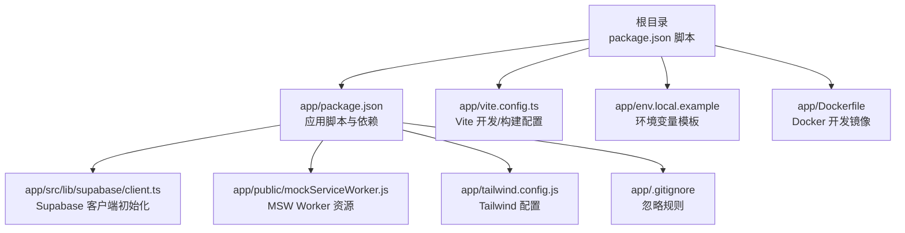
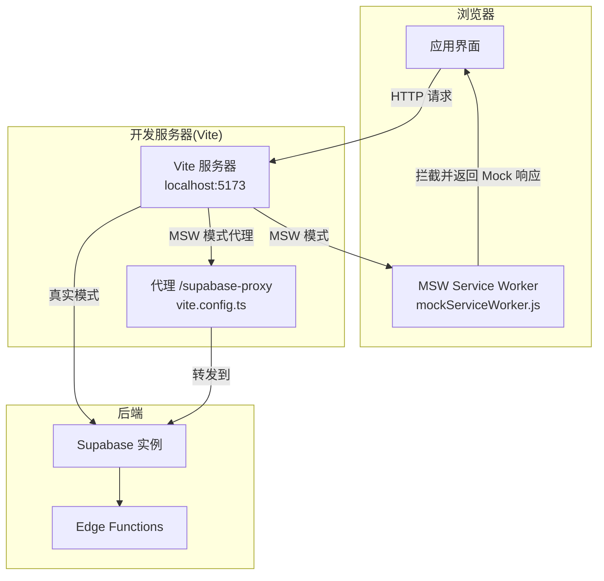
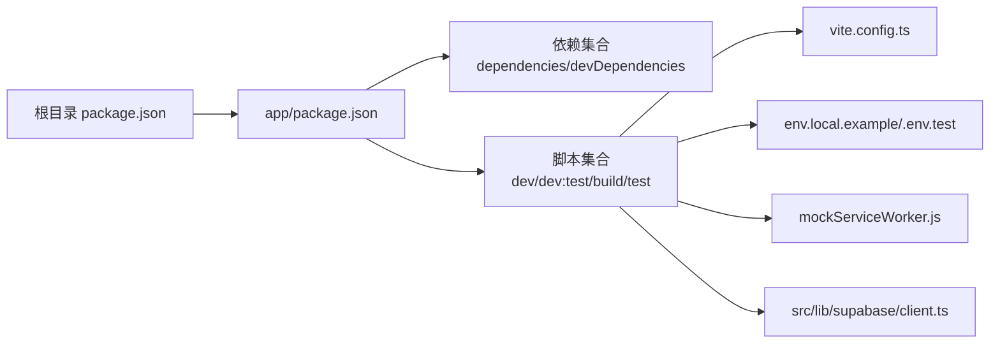

# 本地部署

<cite>
**本文引用的文件**
- [package.json](file://package.json)
- [app/package.json](file://app/package.json)
- [app/env.local.example](file://app/env.local.example)
- [app/vite.config.ts](file://app/vite.config.ts)
- [app/.gitignore](file://app/.gitignore)
- [app/tailwind.config.js](file://app/tailwind.config.js)
- [app/setup-env.sh](file://app/setup-env.sh)
- [app/Dockerfile](file://app/Dockerfile)
- [app/public/mockServiceWorker.js](file://app/public/mockServiceWorker.js)
- [app/src/lib/supabase/client.ts](file://app/src/lib/supabase/client.ts)
- [README.md](file://README.md)
</cite>

## 目录
1. [简介](#简介)
2. [项目结构](#项目结构)
3. [核心组件](#核心组件)
4. [架构总览](#架构总览)
5. [详细组件分析](#详细组件分析)
6. [依赖关系分析](#依赖关系分析)
7. [性能考虑](#性能考虑)
8. [故障排查指南](#故障排查指南)
9. [结论](#结论)
10. [附录](#附录)

## 简介
本文件面向本地开发与部署场景，提供从零搭建开发环境、配置环境变量、启动开发服务器、启用 MSW Mock、以及常见问题排查的完整指南。项目采用 React 19 + TypeScript + Vite + Tailwind CSS + Supabase 技术栈，并提供两种开发模式：
- 真实 Supabase 模式：连接真实后端，适合需要认证、存储、实时能力的集成测试。
- MSW Mock 模式：无需真实后端，通过浏览器 Service Worker 拦截网络请求，快速迭代与回归。

## 项目结构
- 根目录提供聚合脚本，统一调用 app 子项目的 npm scripts，便于在工作区根目录直接运行开发、构建、测试等命令。
- app 目录为实际应用工程，包含 Vite 配置、环境变量模板、Dockerfile、Tailwind 配置、Mock Service Worker 资源、Supabase 客户端初始化等。

图表来源
- [package.json:1-23](file://package.json#L1-L23)
- [app/package.json:1-141](file://app/package.json#L1-L141)
- [app/vite.config.ts:1-77](file://app/vite.config.ts#L1-L77)
- [app/env.local.example:1-44](file://app/env.local.example#L1-L44)
- [app/Dockerfile:1-33](file://app/Dockerfile#L1-L33)
- [app/public/mockServiceWorker.js:1-336](file://app/public/mockServiceWorker.js#L1-L336)
- [app/src/lib/supabase/client.ts:1-34](file://app/src/lib/supabase/client.ts#L1-L34)
- [app/tailwind.config.js:1-39](file://app/tailwind.config.js#L1-L39)
- [app/.gitignore:1-32](file://app/.gitignore#L1-L32)

章节来源
- [package.json:1-23](file://package.json#L1-L23)
- [app/package.json:1-141](file://app/package.json#L1-L141)
- [app/vite.config.ts:1-77](file://app/vite.config.ts#L1-L77)
- [app/env.local.example:1-44](file://app/env.local.example#L1-L44)
- [app/Dockerfile:1-33](file://app/Dockerfile#L1-L33)
- [app/public/mockServiceWorker.js:1-336](file://app/public/mockServiceWorker.js#L1-L336)
- [app/src/lib/supabase/client.ts:1-34](file://app/src/lib/supabase/client.ts#L1-L34)
- [app/tailwind.config.js:1-39](file://app/tailwind.config.js#L1-L39)
- [app/.gitignore:1-32](file://app/.gitignore#L1-L32)

## 核心组件
- 开发脚本与工作区代理
  - 根目录 package.json 将 dev/build/lint/test 等命令转发给 app 子项目，便于在根目录直接运行。
- 应用脚本与依赖
  - app/package.json 提供 dev/dev:test/build/test 等脚本，以及 MSW 与测试相关依赖。
- 环境变量模板
  - app/env.local.example 提供 Supabase、阿里云 OSS、MSW、日志级别等配置项示例。
- Vite 配置
  - app/vite.config.ts 定义代理、别名、构建优化、依赖预构建等。
- Tailwind 配置
  - app/tailwind.config.js 定义内容扫描路径与动画扩展。
- Docker 开发镜像
  - app/Dockerfile 提供基于 Node.js 20 Alpine 的开发镜像，支持 MSW Mock 模式。
- Mock Service Worker
  - app/public/mockServiceWorker.js 为浏览器注入的 Service Worker 资源，配合 MSW 使用。
- Supabase 客户端初始化
  - app/src/lib/supabase/client.ts 根据环境变量选择真实或代理路径，保证 MSW 可拦截请求。
- 环境配置脚本
  - app/setup-env.sh 自动生成 .env.local 与 .env.test，支持一键切换模式。

章节来源
- [package.json:5-21](file://package.json#L5-L21)
- [app/package.json:26-47](file://app/package.json#L26-L47)
- [app/env.local.example:1-44](file://app/env.local.example#L1-L44)
- [app/vite.config.ts:1-77](file://app/vite.config.ts#L1-L77)
- [app/tailwind.config.js:1-39](file://app/tailwind.config.js#L1-L39)
- [app/Dockerfile:1-33](file://app/Dockerfile#L1-L33)
- [app/public/mockServiceWorker.js:1-336](file://app/public/mockServiceWorker.js#L1-L336)
- [app/src/lib/supabase/client.ts:1-34](file://app/src/lib/supabase/client.ts#L1-L34)
- [app/setup-env.sh:1-121](file://app/setup-env.sh#L1-L121)

## 架构总览
下图展示本地开发的两种模式及其关键组件交互：

图表来源
- [app/vite.config.ts:20-38](file://app/vite.config.ts#L20-L38)
- [app/public/mockServiceWorker.js:90-158](file://app/public/mockServiceWorker.js#L90-L158)
- [app/src/lib/supabase/client.ts:10-16](file://app/src/lib/supabase/client.ts#L10-L16)

## 详细组件分析

### 环境变量与配置文件
- .env.local.example
  - 提供 Supabase URL/Anon Key、阿里云 OSS 加速、MSW 开关、日志级别等键位示例。
- .env.test（由 setup-env.sh 生成）
  - 在 MSW 模式下启用 Mock 数据与代理路径，便于测试与回归。
- .gitignore
  - 忽略 node_modules、dist、.env.test、.env.dev 等文件，避免误提交。

章节来源
- [app/env.local.example:1-44](file://app/env.local.example#L1-L44)
- [app/setup-env.sh:69-86](file://app/setup-env.sh#L69-L86)
- [app/.gitignore:13-31](file://app/.gitignore#L13-L31)

### 开发服务器与代理
- Vite 开发服务器
  - 默认监听 5173 端口，支持热重载与按需构建。
- 代理配置
  - /supabase-proxy 将请求转发到 VITE_SUPABASE_URL，便于 MSW 拦截同源请求。
- 依赖预构建与构建优化
  - 优化依赖预构建列表，手动拆分 vendor chunk，提升缓存与加载效率。

章节来源
- [app/vite.config.ts:20-38](file://app/vite.config.ts#L20-L38)
- [app/vite.config.ts:40-75](file://app/vite.config.ts#L40-L75)

### MSW Mock 机制
- Service Worker 注入
  - 通过 public/mockServiceWorker.js 注入浏览器，拦截 fetch 请求。
- 模式开关
  - VITE_ENABLE_MSW=true 启用 MSW；客户端根据该开关决定使用代理路径或真实 URL。
- Worker 生命周期
  - 安装、激活、消息通道、请求拦截与响应回传，均在 mockServiceWorker.js 中实现。

章节来源
- [app/public/mockServiceWorker.js:14-88](file://app/public/mockServiceWorker.js#L14-L88)
- [app/public/mockServiceWorker.js:202-269](file://app/public/mockServiceWorker.js#L202-L269)
- [app/src/lib/supabase/client.ts:10-16](file://app/src/lib/supabase/client.ts#L10-L16)

### Supabase 客户端初始化
- 模式判断
  - 依据 VITE_ENABLE_MSW 决定使用真实 URL 还是本地代理路径。
- 会话处理
  - 在非 MSW 模式下启用自动刷新 Token、检测 URL 会话；在 MSW 模式下禁用以避免真实请求。
- 环境变量缺失提示
  - 若未配置真实 Supabase，控制台输出提示，认证功能降级。

章节来源
- [app/src/lib/supabase/client.ts:10-33](file://app/src/lib/supabase/client.ts#L10-L33)

### 环境配置脚本
- 自动化生成
  - 一键生成 .env.local 与 .env.test，支持三种模式组合。
- 使用建议
  - 推荐优先使用 MSW Mock 模式进行快速开发，再在需要时切换真实 Supabase 模式。

章节来源
- [app/setup-env.sh:1-121](file://app/setup-env.sh#L1-L121)

### Docker 开发镜像
- 多阶段构建
  - dev 阶段以 MSW Mock 模式运行，暴露 5173 端口。
  - build 阶段执行构建，preview 阶段提供生产预览。
- 适用场景
  - 在容器内快速启动开发环境，无需本地安装 Node.js。

章节来源
- [app/Dockerfile:1-33](file://app/Dockerfile#L1-L33)

## 依赖关系分析
- 脚本依赖
  - 根目录脚本依赖 app/package.json 的 dev/build/test 等子脚本。
- 运行时依赖
  - app/package.json 的 dependencies 与 devDependencies 明确了 React、TypeScript、Vite、Tailwind、Supabase、MSW 等核心依赖。
- 构建与测试
  - MSW 与测试工具位于 devDependencies，不参与生产构建，减少体积。

图表来源
- [package.json:5-21](file://package.json#L5-L21)
- [app/package.json:48-121](file://app/package.json#L48-L121)
- [app/vite.config.ts:1-77](file://app/vite.config.ts#L1-L77)
- [app/env.local.example:1-44](file://app/env.local.example#L1-L44)
- [app/public/mockServiceWorker.js:1-336](file://app/public/mockServiceWorker.js#L1-L336)
- [app/src/lib/supabase/client.ts:1-34](file://app/src/lib/supabase/client.ts#L1-L34)

章节来源
- [package.json:5-21](file://package.json#L5-L21)
- [app/package.json:48-121](file://app/package.json#L48-L121)

## 性能考虑
- 依赖预构建与分包
  - 通过 optimizeDeps.include 与 manualChunks 将常用库拆分为独立 chunk，提升缓存命中率与首屏性能。
- 构建优化
  - 启用 CSS 分割、Terser 压缩、合理设置 chunkSizeWarningLimit，平衡包体大小与加载性能。
- 本地开发
  - 使用 MSW Mock 模式可避免真实后端延迟，提高迭代速度；必要时再切换真实 Supabase 模式进行集成验证。

章节来源
- [app/vite.config.ts:72-75](file://app/vite.config.ts#L72-L75)
- [app/vite.config.ts:42-69](file://app/vite.config.ts#L42-L69)

## 故障排查指南
- npm install 失败（ECONNRESET）
  - 若 package-lock.json 引用不可达镜像源，删除后重装并指定官方 registry。
- 浏览器白屏或 ERR_NAME_NOT_RESOLVED
  - 可能是 localStorage 中残留过期 Token 导致尝试连接 placeholder.supabase.co。清理站点数据后刷新页面。
- WebSocket 连接警告（MSW 模式）
  - 由于未配置对应 Mock Handler，Realtime WebSocket 会产生警告，属预期行为，不影响功能。
- 端口占用或代理异常
  - 确认 5173 端口可用；检查 vite.config.ts 中代理配置是否正确指向 VITE_SUPABASE_URL。
- 环境变量未生效
  - 确保 .env.local/.env.test 文件存在且键名正确；重启开发服务器使变更生效。

章节来源
- [README.md:83-112](file://README.md#L83-L112)
- [app/vite.config.ts:20-38](file://app/vite.config.ts#L20-L38)

## 结论
通过本指南，你可以：
- 快速完成本地开发环境搭建，选择 MSW Mock 或真实 Supabase 模式。
- 正确配置环境变量与代理，启用热重载与调试。
- 在开发模式下灵活启用 MSW、调整日志级别等特殊配置。
- 遇到常见问题时，按章节来源定位并解决。

## 附录

### 环境要求与安装步骤
- 环境要求
  - Node.js >= 20.x，npm >= 10.x。
- 安装步骤
  - 克隆仓库后在 app 目录安装依赖。
  - 推荐先以 MSW Mock 模式启动，再按需切换真实 Supabase 模式。

章节来源
- [README.md:50-71](file://README.md#L50-L71)

### 环境变量配置清单
- 必填项（真实 Supabase 模式）
  - VITE_SUPABASE_URL
  - VITE_SUPABASE_ANON_KEY
- 可选项
  - VITE_OSS_ACCELERATE_ENABLED/VITE_OSS_ACCELERATE_DOMAIN（阿里云 OSS 传输加速）
  - VITE_DASHSCOPE_API_KEY（可选，用于 Agent LLM）
- 开发模式开关
  - VITE_ENABLE_MSW（MSW 模式开关）
  - VITE_LOG_LEVEL（日志级别）

章节来源
- [app/env.local.example:7-29](file://app/env.local.example#L7-L29)

### 开发服务器启动与访问
- MSW Mock 模式
  - 在 app 目录执行 dev:test 脚本，或在根目录执行 npm run dev:test。
- 真实 Supabase 模式
  - 在 app 目录执行 dev 脚本，或在根目录执行 npm run dev。
- 访问地址
  - 默认 http://localhost:5173。

章节来源
- [README.md:29-48](file://README.md#L29-L48)
- [app/package.json:27-28](file://app/package.json#L27-L28)

### 热重载与调试技巧
- 热重载
  - Vite 默认启用，修改代码后浏览器自动刷新。
- 调试建议
  - 在 MSW 模式下，可通过浏览器 Network 面板观察拦截与 Mock 响应；在真实模式下关注 Supabase Realtime WebSocket 行为。

章节来源
- [app/public/mockServiceWorker.js:90-158](file://app/public/mockServiceWorker.js#L90-L158)

### 特殊配置选项
- MSW Mock 启用
  - VITE_ENABLE_MSW=true 启用；客户端据此选择代理路径。
- 日志级别
  - VITE_LOG_LEVEL=debug/info/error 等，可在代码中按需使用。
- 代理路径
  - /supabase-proxy 仅在 MSW 模式下生效，确保同源拦截。

章节来源
- [app/env.local.example:25-29](file://app/env.local.example#L25-L29)
- [app/src/lib/supabase/client.ts:10-16](file://app/src/lib/supabase/client.ts#L10-L16)
- [app/vite.config.ts:20-38](file://app/vite.config.ts#L20-L38)