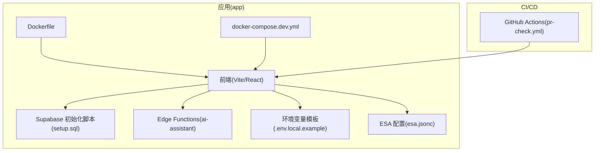
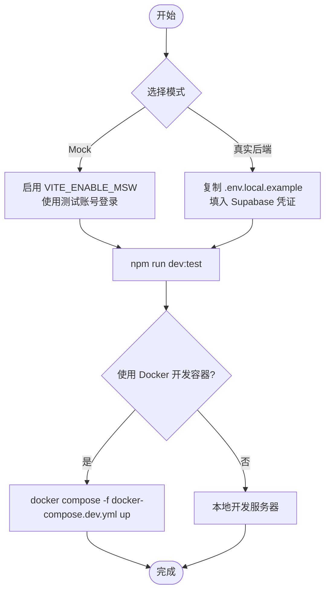
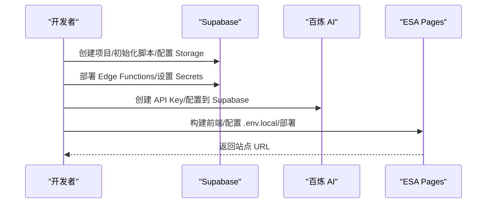
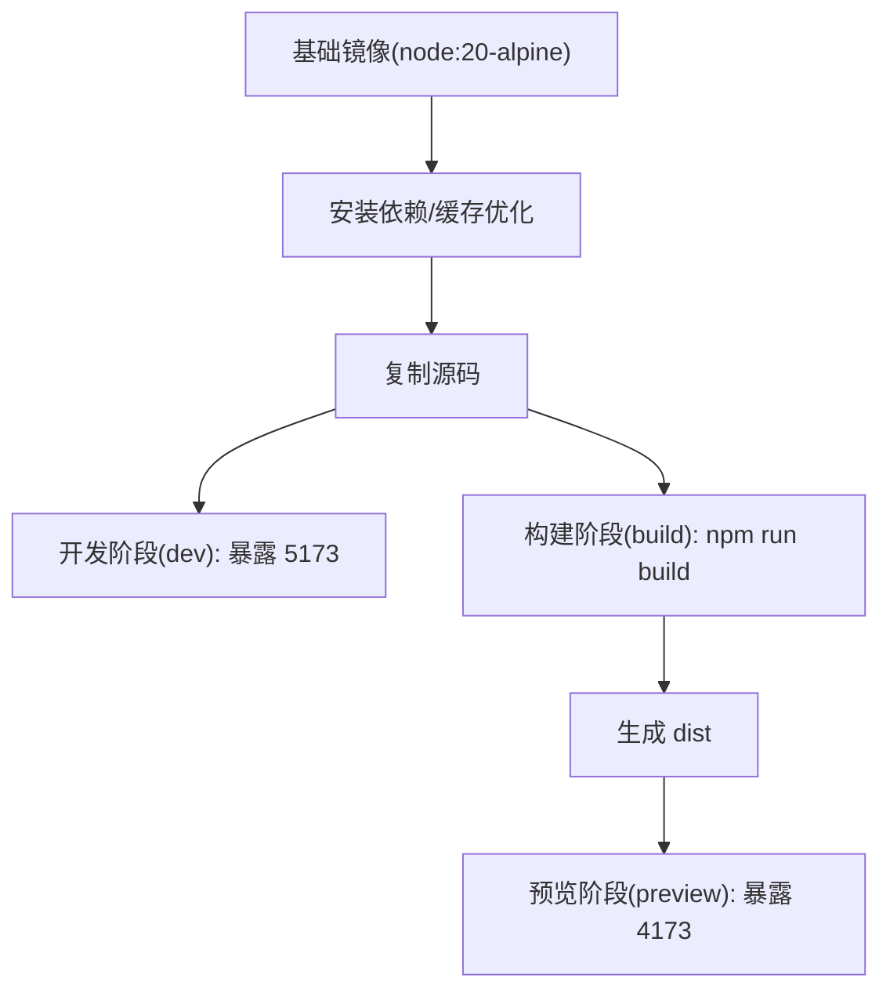
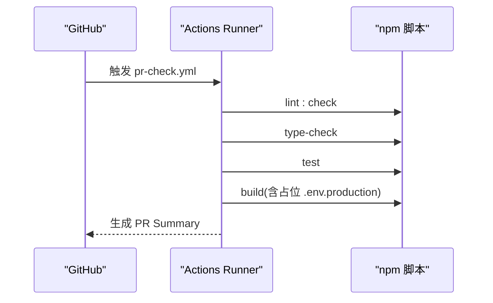
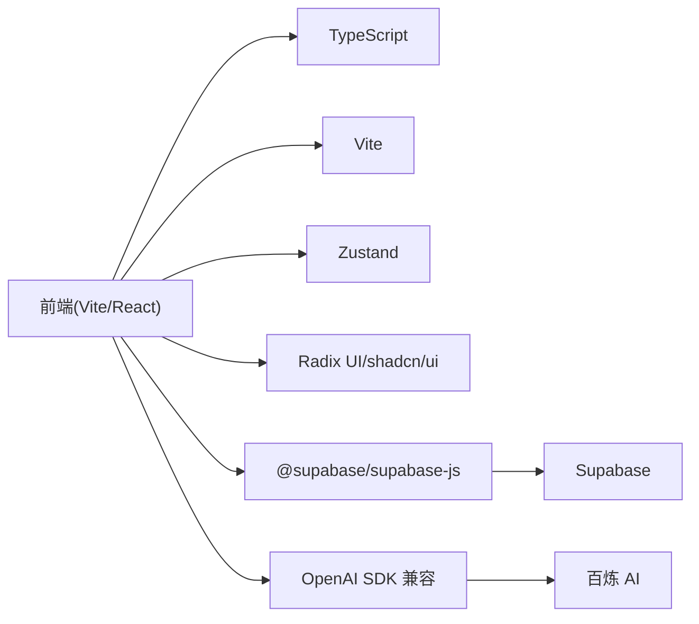

# 部署指南

<cite>
**本文引用的文件**
- [ALIYUN-DEPLOY.md](file://ALIYUN-DEPLOY.md)
- [Dockerfile](file://app/Dockerfile)
- [docker-compose.dev.yml](file://app/docker-compose.dev.yml)
- [env.local.example](file://app/env.local.example)
- [esa.jsonc](file://app/esa.jsonc)
- [setup.sql](file://app/supabase/setup.sql)
- [index.ts](file://app/supabase/functions/ai-assistant/index.ts)
- [pr-check.yml](file://.github/workflows/pr-check.yml)
- [vite.config.ts](file://app/vite.config.ts)
- [package.json](file://package.json)
- [README.md](file://README.md)
- [Architecture.md](file://docs/Architecture.md)
</cite>

## 目录
1. [简介](#简介)
2. [项目结构](#项目结构)
3. [核心组件](#核心组件)
4. [架构总览](#架构总览)
5. [详细组件分析](#详细组件分析)
6. [依赖分析](#依赖分析)
7. [性能考虑](#性能考虑)
8. [故障排除指南](#故障排除指南)
9. [结论](#结论)
10. [附录](#附录)

## 简介
本指南面向不同规模与需求的部署场景，覆盖本地开发、云平台托管、容器化部署以及基于 GitHub Actions 的 CI/CD 流水线配置。重点围绕 OPC-Starter 的前端（React/Vite）、Supabase 后端（Auth/Storage/Realtime/Edge Functions）与阿里云 ESA Pages 前端静态托管、百炼 AI（通义千问）集成进行说明。同时提供环境变量管理、静态资源处理、SSL 证书配置、监控与日志、性能优化与故障排除等运维最佳实践。

## 项目结构
- 应用位于 app/ 目录，包含前端源码、Supabase 初始化脚本、Edge Functions、Dockerfile、docker-compose 开发环境、ESLint/Vitest/Cypress 等配置。
- 根目录提供 npm 脚本代理，便于在仓库根目录直接运行前端命令。
- 文档目录 docs/ 提供架构与设计说明，便于理解部署涉及的技术栈与数据流。



图表来源
- [vite.config.ts:1-77](file://app/vite.config.ts#L1-L77)
- [setup.sql:1-505](file://app/supabase/setup.sql#L1-L505)
- [index.ts:1-116](file://app/supabase/functions/ai-assistant/index.ts#L1-L116)
- [Dockerfile:1-33](file://app/Dockerfile#L1-L33)
- [docker-compose.dev.yml:1-16](file://app/docker-compose.dev.yml#L1-L16)
- [env.local.example:1-44](file://app/env.local.example#L1-L44)
- [esa.jsonc:1-11](file://app/esa.jsonc#L1-L11)
- [pr-check.yml:1-132](file://.github/workflows/pr-check.yml#L1-L132)

章节来源
- [README.md:1-220](file://README.md#L1-L220)
- [package.json:1-23](file://package.json#L1-L23)

## 核心组件
- 前端应用（React 19 + Vite 7 + Tailwind CSS 4.1），支持 MSW Mock 模式与真实 Supabase 模式，具备路由、状态管理、数据服务层与 Agent Studio。
- Supabase 后端（Auth + Storage + Realtime + Edge Functions），提供数据库初始化脚本、组织架构与 Agent 表结构、RLS 策略与 Edge Function（ai-assistant）。
- 阿里云 ESA Pages 前端静态托管，配合 CDN 加速与 HTTPS 证书。
- 百炼 AI（通义千问）作为 Agent LLM 提供商，通过 Edge Function 的 OpenAI SDK 兼容接口调用。
- CI/CD：GitHub Actions 工作流对 Lint/Type/单元测试/构建进行检查。

章节来源
- [Architecture.md:1-282](file://docs/Architecture.md#L1-L282)
- [setup.sql:1-505](file://app/supabase/setup.sql#L1-L505)
- [index.ts:1-116](file://app/supabase/functions/ai-assistant/index.ts#L1-L116)
- [pr-check.yml:1-132](file://.github/workflows/pr-check.yml#L1-L132)

## 架构总览
OPC-Starter 采用“前端静态托管 + BaaS 后端 + AI 服务”的云原生架构。前端通过 Vite 构建，部署到 ESA Pages；后端以 Supabase 为核心，提供认证、存储、实时订阅与边缘函数；AI 服务通过百炼 API 提供通义千问能力，Edge Function 作为网关与工具执行器。

```mermaid
graph TB
Browser["浏览器"]
ESA["ESA Pages(静态托管/CDN)"]
Vite["Vite 构建产物(dist)"]
Supabase["Supabase(BaaS)<br/>Auth/Storage/Realtime/Edge Functions"]
AI["百炼 AI(Qwen-Plus)"]
Browser --> ESA
ESA --> Vite
Vite --> Supabase
Vite --> AI
Supabase <- --> AI
```

图表来源
- [ALIYUN-DEPLOY.md:26-52](file://ALIYUN-DEPLOY.md#L26-L52)
- [esa.jsonc:1-11](file://app/esa.jsonc#L1-L11)
- [index.ts:1-116](file://app/supabase/functions/ai-assistant/index.ts#L1-L116)

## 详细组件分析

### 本地部署与开发环境
- MSW Mock 模式：无需真实 Supabase 即可运行，适合 AI 工具快速启动与回归测试。可通过环境变量开启并使用测试账号登录。
- 真实 Supabase 模式：复制环境变量模板，填入 Supabase URL 与匿名 Key 后启动开发服务器。
- 开发容器：提供 docker-compose 开发环境，挂载源码与 node_modules，暴露 5173 端口，使用 .env.test 作为环境变量文件。



图表来源
- [README.md:23-71](file://README.md#L23-L71)
- [docker-compose.dev.yml:1-16](file://app/docker-compose.dev.yml#L1-L16)
- [env.local.example:1-44](file://app/env.local.example#L1-L44)

章节来源
- [README.md:23-71](file://README.md#L23-L71)
- [docker-compose.dev.yml:1-16](file://app/docker-compose.dev.yml#L1-L16)
- [env.local.example:1-44](file://app/env.local.example#L1-L44)

### 阿里云全托管部署（ESA Pages + Supabase + 百炼 AI）
- Supabase 数据库：创建项目、执行初始化脚本、配置 Storage Bucket、记录 API 凭证、部署 Edge Functions 并设置 Secrets。
- 百炼 AI API：开通服务、创建 API Key、在 Supabase Edge Functions 中配置 ALIYUN_BAILIAN_API_KEY。
- 前端部署：安装 ESA CLI、登录、配置 .env.local、构建项目、部署到 ESA Pages。
- 自定义域名与 HTTPS：在 ESA 控制台添加域名、配置 DNS CNAME、在 Supabase 更新认证回调 URL。
- 安全最佳实践：最小权限的 RAM 用户、定期轮转密钥、启用 MFA、RLS 策略审计。



图表来源
- [ALIYUN-DEPLOY.md:102-151](file://ALIYUN-DEPLOY.md#L102-L151)
- [setup.sql:1-505](file://app/supabase/setup.sql#L1-L505)
- [index.ts:34-52](file://app/supabase/functions/ai-assistant/index.ts#L34-L52)
- [env.local.example:7-9](file://app/env.local.example#L7-L9)
- [esa.jsonc:1-11](file://app/esa.jsonc#L1-L11)

章节来源
- [ALIYUN-DEPLOY.md:102-151](file://ALIYUN-DEPLOY.md#L102-L151)

### Docker 容器化部署
- 多阶段 Dockerfile：基础镜像、依赖层缓存优化、开发阶段（暴露 5173）、构建阶段（生成 dist）、生产预览阶段（基于 node:alpine 运行预览）。
- docker-compose.dev.yml：开发容器编排，映射 5173 端口，挂载源码与 node_modules，使用 .env.test。
- 镜像构建与运行：先构建多阶段镜像，再在预览阶段运行 npm run preview，暴露 4173 端口。



图表来源
- [Dockerfile:1-33](file://app/Dockerfile#L1-L33)
- [docker-compose.dev.yml:1-16](file://app/docker-compose.dev.yml#L1-L16)

章节来源
- [Dockerfile:1-33](file://app/Dockerfile#L1-L33)
- [docker-compose.dev.yml:1-16](file://app/docker-compose.dev.yml#L1-L16)

### CI/CD 流水线（GitHub Actions）
- 触发条件：针对 app/** 与 pr-check.yml 的 PR/Push。
- 任务分解：
  - Lint 与类型检查：在 app 目录执行 ESLint 与 TypeScript 类型检查。
  - 单元测试：在 app 目录执行 npm test。
  - 构建检查：在 app 目录安装依赖、创建占位 .env.production、执行 npm run build 并统计 dist 输出大小。
  - PR 总结：汇总各阶段结果，输出到 GitHub 步骤摘要。
- 建议扩展：增加 E2E 测试（Cypress）与安全扫描（Secret Scanning、SAST）。



图表来源
- [pr-check.yml:1-132](file://.github/workflows/pr-check.yml#L1-L132)

章节来源
- [.github/workflows/pr-check.yml:1-132](file://.github/workflows/pr-check.yml#L1-L132)

### 环境变量管理
- 前端环境变量（.env.local）：Supabase URL/Key、OSS 加速开关与域名、MSW 开关、日志级别等。
- Edge Functions Secrets：百炼 API Key 与 Supabase 自动注入的 URL/Key/Service Role Key。
- 构建占位：CI 中使用占位 .env.production 保证构建阶段不会因缺少真实密钥失败。

章节来源
- [env.local.example:7-44](file://app/env.local.example#L7-L44)
- [index.ts:34-52](file://app/supabase/functions/ai-assistant/index.ts#L34-L52)
- [pr-check.yml:96-101](file://.github/workflows/pr-check.yml#L96-L101)

### 静态资源处理与前端构建
- Vite 配置：别名 @ 指向 src；开发代理 /supabase-proxy 指向 Supabase；生产构建启用手动分包、CSS 代码分割、Terser 压缩、禁用 sourcemap。
- ESA 配置：指定 dist 目录与单页应用 404 处理策略；开发端口 18080。

章节来源
- [vite.config.ts:1-77](file://app/vite.config.ts#L1-L77)
- [esa.jsonc:1-11](file://app/esa.jsonc#L1-L11)

### SSL 证书与自定义域名
- ESA Pages 支持自动申请免费证书或上传自有证书；域名解析通过 CNAME 指向 ESA 提供地址。
- 若使用自定义域名，需在 Supabase 更新认证站点 URL 与重定向地址。

章节来源
- [ALIYUN-DEPLOY.md:400-430](file://ALIYUN-DEPLOY.md#L400-L430)

### 数据库与 RLS 策略
- 初始化脚本创建 profiles、organizations、organization_members、agent_threads/messages/actions 等表，并配置 RLS 策略与触发器，确保数据隔离与一致性。
- Edge Function 通过 Supabase 客户端鉴权，结合 RLS 保障数据访问安全。

章节来源
- [setup.sql:118-438](file://app/supabase/setup.sql#L118-L438)
- [index.ts:48-62](file://app/supabase/functions/ai-assistant/index.ts#L48-L62)

## 依赖分析
- 前端依赖：React 19、TypeScript 5.9、Vite 7、Tailwind CSS 4.1、Zustand、Zod、Radix UI/shadcn/ui 组件体系。
- 后端依赖：Supabase 客户端、Edge Functions 运行时、OpenAI SDK 兼容模式。
- CI 依赖：Node.js 20、npm 缓存、actions/checkout 与 actions/setup-node。



图表来源
- [Architecture.md:9-21](file://docs/Architecture.md#L9-L21)
- [index.ts:10-20](file://app/supabase/functions/ai-assistant/index.ts#L10-L20)

章节来源
- [Architecture.md:9-21](file://docs/Architecture.md#L9-L21)

## 性能考虑
- 构建优化：Vite 生产构建启用手动分包、CSS 代码分割、Terser 压缩；合理设置 chunkSizeWarningLimit。
- 静态托管：ESA Pages 全球 CDN 加速，减少首屏加载时间。
- 数据访问：IndexedDB 缓存 + Supabase Realtime，降低网络往返与后端压力。
- AI 调用：Edge Function 作为网关，结合 SSE 流式响应，提升交互体验。

章节来源
- [vite.config.ts:40-77](file://app/vite.config.ts#L40-L77)
- [ALIYUN-DEPLOY.md:28-62](file://ALIYUN-DEPLOY.md#L28-L62)

## 故障排除指南
- ESA 部署失败：检查登录状态、构建产物、esa.jsonc 配置。
- AI 助手无响应：查看 Edge Function 日志、确认 Secrets、测试百炼 API 连通性。
- 登录/认证失败：核对前端 .env.local 与 Supabase URL/Key、检查浏览器控制台 CORS 错误。
- 数据库连接错误：确认 Supabase 项目状态、RLS 策略、Anon Key 匹配。

章节来源
- [ALIYUN-DEPLOY.md:492-553](file://ALIYUN-DEPLOY.md#L492-L553)

## 结论
OPC-Starter 提供从本地开发到云托管的一体化部署方案。通过 ESA Pages 静态托管、Supabase BaaS 与百炼 AI 的组合，可实现低成本、高扩展的全托管架构。配合 Docker 容器化与 GitHub Actions CI/CD，能够稳定地交付高质量前端应用。建议在生产环境中遵循最小权限、定期轮转密钥、启用 HTTPS 与 RLS 策略等安全最佳实践，并持续关注构建体积与用户体验优化。

## 附录
- 快速开始（MSW 模式）：克隆仓库、安装依赖、启用 VITE_ENABLE_MSW、访问 http://localhost:5173。
- 真实后端模式：复制 .env.local.example、填入 Supabase 凭证、执行 npm run dev。
- 根目录脚本：在仓库根目录可直接运行 dev/test/build/lint 等命令。

章节来源
- [README.md:23-71](file://README.md#L23-L71)
- [package.json:5-21](file://package.json#L5-L21)