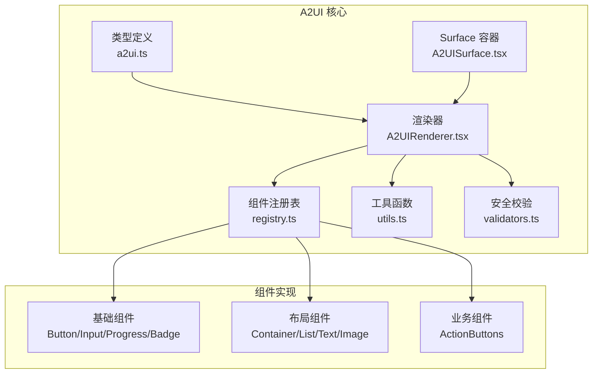
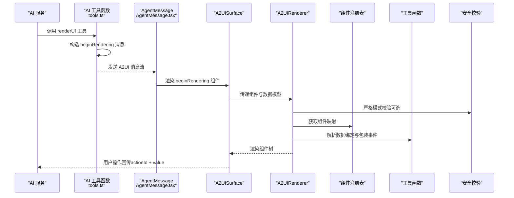
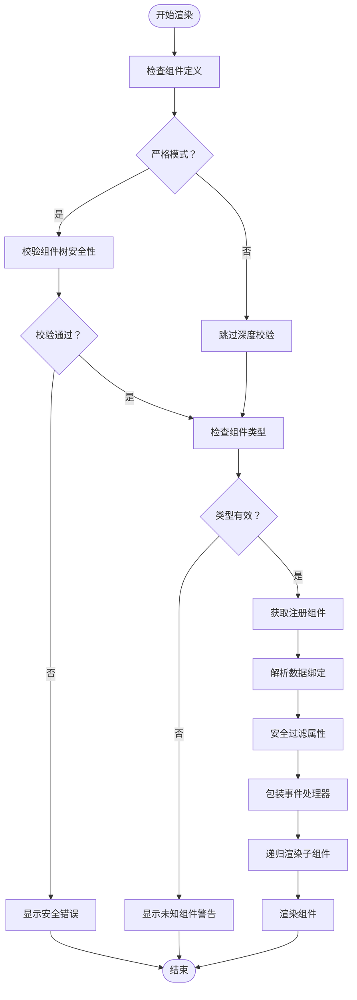
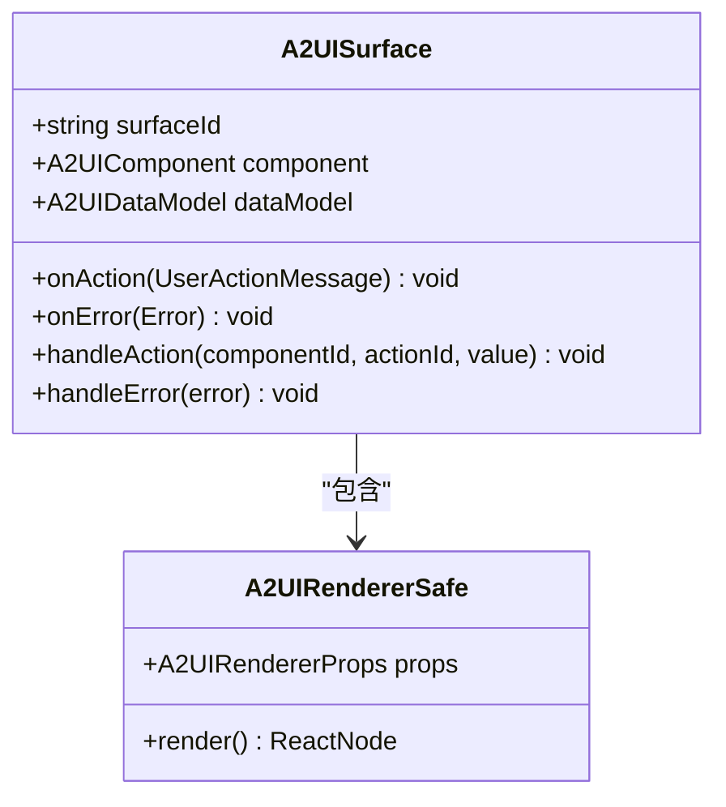
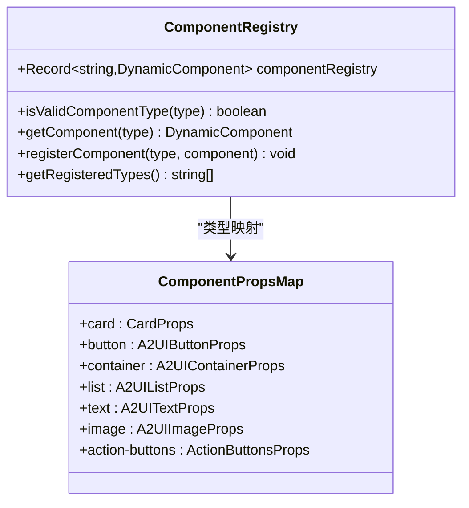
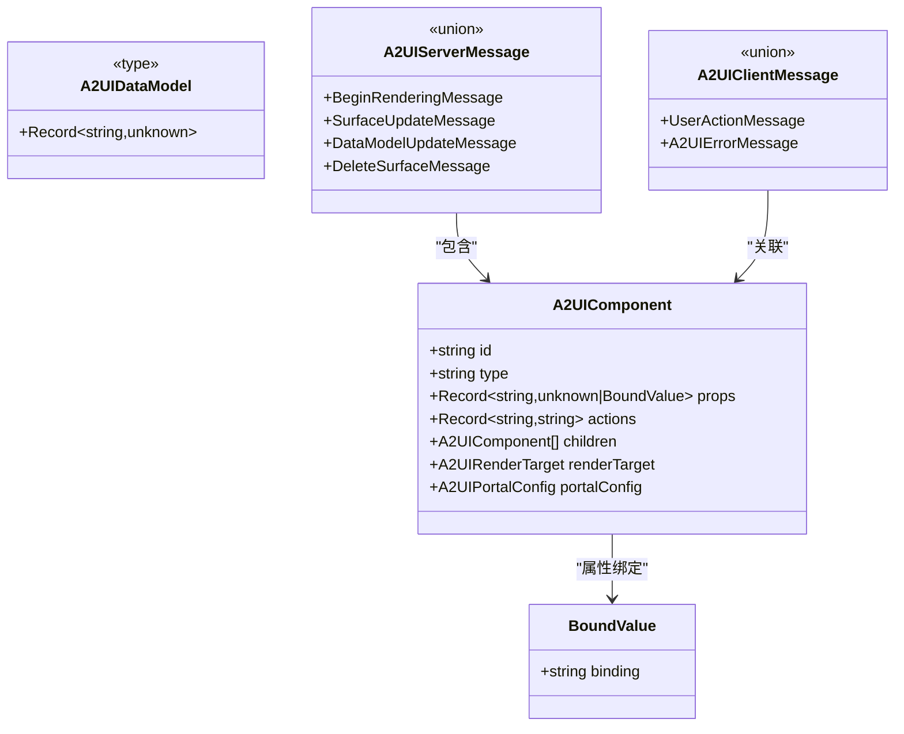
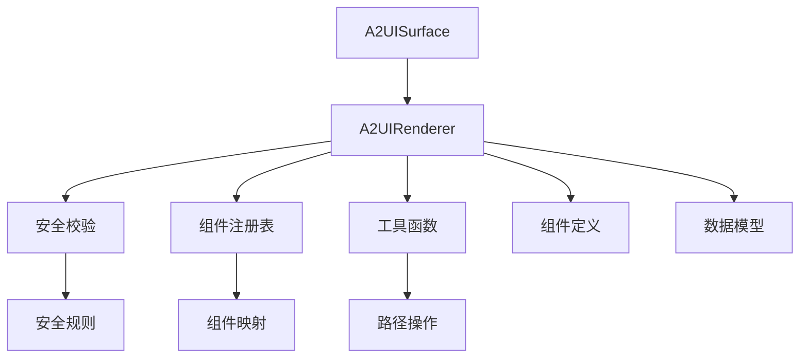

# A2UI 动态渲染系统

<cite>
**本文档引用的文件**
- [a2ui.ts](file://app/src/types/a2ui.ts)
- [A2UIRenderer.tsx](file://app/src/components/agent/a2ui/A2UIRenderer.tsx)
- [A2UISurface.tsx](file://app/src/components/agent/a2ui/A2UISurface.tsx)
- [registry.ts](file://app/src/components/agent/a2ui/registry.ts)
- [utils.ts](file://app/src/components/agent/a2ui/utils.ts)
- [validators.ts](file://app/src/components/agent/a2ui/validators.ts)
- [index.ts](file://app/src/components/agent/a2ui/index.ts)
- [A2UIButton.tsx](file://app/src/components/agent/a2ui/components/A2UIButton.tsx)
- [A2UIContainer.tsx](file://app/src/components/agent/a2ui/components/A2UIContainer.tsx)
- [A2UIRenderer.test.tsx](file://app/src/components/agent/a2ui/__tests__/A2UIRenderer.test.tsx)
- [utils.test.ts](file://app/src/components/agent/a2ui/__tests__/utils.test.ts)
- [AgentMessage.tsx](file://app/src/components/agent/AgentMessage.tsx)
- [tools.ts](file://app/supabase/functions/ai-assistant/tools.ts)
- [useAgentStore.ts](file://app/src/stores/useAgentStore.ts)
</cite>

## 目录
1. [简介](#简介)
2. [项目结构](#项目结构)
3. [核心组件](#核心组件)
4. [架构概览](#架构概览)
5. [详细组件分析](#详细组件分析)
6. [依赖关系分析](#依赖关系分析)
7. [性能考虑](#性能考虑)
8. [故障排除指南](#故障排除指南)
9. [结论](#结论)
10. [附录](#附录)

## 简介
A2UI（Agent-to-UI）是 OPC-Starter 中基于 AI 驱动的动态界面渲染系统。它通过标准化的组件协议，实现 AI 生成界面、动态组件渲染与用户交互的完整闭环。系统核心理念包括：
- 协议驱动：以统一的 A2UI 协议描述组件树、数据模型与交互事件
- 动态渲染：将 AI 返回的 JSON 组件树递归渲染为 React 组件
- 安全优先：严格的属性校验与安全过滤，防止 XSS 等安全风险
- 可扩展性：组件注册表支持内置组件与自定义组件扩展
- 事件解耦：通过 actions 映射实现事件处理与渲染层分离

## 项目结构
A2UI 系统位于应用前端的智能体组件目录中，采用按功能分层的组织方式：
- 类型定义：统一的 A2UI 协议类型与组件接口
- 核心渲染：渲染器与 Surface 容器负责组件树渲染与事件传播
- 组件注册：集中管理可渲染组件映射与扩展点
- 工具函数：数据绑定解析、事件包装、路径操作等实用工具
- 安全校验：组件属性安全校验与危险属性过滤
- 业务组件：布局、基础与业务组件的具体实现

**图表来源**
- [a2ui.ts:1-231](file://app/src/types/a2ui.ts#L1-L231)
- [A2UIRenderer.tsx:1-244](file://app/src/components/agent/a2ui/A2UIRenderer.tsx#L1-L244)
- [A2UISurface.tsx:1-112](file://app/src/components/agent/a2ui/A2UISurface.tsx#L1-L112)
- [registry.ts:1-129](file://app/src/components/agent/a2ui/registry.ts#L1-L129)

**章节来源**
- [a2ui.ts:1-231](file://app/src/types/a2ui.ts#L1-L231)
- [index.ts:1-55](file://app/src/components/agent/a2ui/index.ts#L1-L55)

## 核心组件
A2UI 系统的核心由以下组件构成：

- A2UIRenderer：递归渲染组件树，解析数据绑定，包装事件处理器，执行安全校验
- A2UISurface：管理单个 Surface 的渲染状态，封装用户操作消息
- 组件注册表：维护组件类型到 React 组件的映射，支持自定义组件注册
- 工具函数：提供数据绑定解析、事件包装、路径操作等能力
- 安全校验：校验组件属性安全性，过滤危险属性并提供错误信息

**章节来源**
- [A2UIRenderer.tsx:74-171](file://app/src/components/agent/a2ui/A2UIRenderer.tsx#L74-L171)
- [A2UISurface.tsx:12-81](file://app/src/components/agent/a2ui/A2UISurface.tsx#L12-L81)
- [registry.ts:75-129](file://app/src/components/agent/a2ui/registry.ts#L75-L129)
- [utils.ts:84-132](file://app/src/components/agent/a2ui/utils.ts#L84-L132)
- [validators.ts:74-111](file://app/src/components/agent/a2ui/validators.ts#L74-L111)

## 架构概览
A2UI 的整体架构遵循“协议驱动 + 渲染解耦 + 安全优先”的设计原则。AI 通过标准化消息协议发送组件定义与数据模型，前端渲染器负责解析与渲染，用户交互通过事件映射回传给 AI。

**图表来源**
- [tools.ts:79-113](file://app/supabase/functions/ai-assistant/tools.ts#L79-L113)
- [AgentMessage.tsx:85-113](file://app/src/components/agent/AgentMessage.tsx#L85-L113)
- [A2UISurface.tsx:38-63](file://app/src/components/agent/a2ui/A2UISurface.tsx#L38-L63)
- [A2UIRenderer.tsx:96-171](file://app/src/components/agent/a2ui/A2UIRenderer.tsx#L96-L171)
- [validators.ts:74-111](file://app/src/components/agent/a2ui/validators.ts#L74-L111)
- [registry.ts:109-111](file://app/src/components/agent/a2ui/registry.ts#L109-L111)
- [utils.ts:84-132](file://app/src/components/agent/a2ui/utils.ts#L84-L132)

## 详细组件分析

### A2UIRenderer 渲染器
A2UIRenderer 是系统的核心渲染组件，负责将 A2UI 组件定义递归渲染为 React 组件。其处理流程包括：
- 安全校验：在严格模式下对组件树进行深度校验，识别危险属性与非法类型
- 组件类型检查：验证组件类型是否在注册表中，未知类型显示警告
- 数据绑定解析：根据绑定路径从数据模型中提取值，支持嵌套路径与数组索引
- 事件包装：将 actions 映射转换为 React 事件处理器，确保事件名称规范
- 子组件递归：对每个子组件重复上述步骤，构建完整的组件树
- 错误边界：提供安全渲染包装器，捕获渲染异常并友好提示

**图表来源**
- [A2UIRenderer.tsx:96-171](file://app/src/components/agent/a2ui/A2UIRenderer.tsx#L96-L171)
- [validators.ts:74-111](file://app/src/components/agent/a2ui/validators.ts#L74-L111)
- [utils.ts:84-102](file://app/src/components/agent/a2ui/utils.ts#L84-L102)

**章节来源**
- [A2UIRenderer.tsx:14-171](file://app/src/components/agent/a2ui/A2UIRenderer.tsx#L14-L171)

### A2UISurface Surface 容器
A2UISurface 作为单个渲染 Surface 的容器，负责：
- 用户操作封装：将组件事件转换为标准化的 UserActionMessage
- 渲染错误处理：捕获渲染异常并回调错误处理函数
- 状态管理：维护组件树与数据模型，支持占位符渲染
- 事件传播：将用户操作消息回传给上层组件或 AI 服务

**图表来源**
- [A2UISurface.tsx:12-81](file://app/src/components/agent/a2ui/A2UISurface.tsx#L12-L81)

**章节来源**
- [A2UISurface.tsx:27-81](file://app/src/components/agent/a2ui/A2UISurface.tsx#L27-L81)

### 组件注册表系统
组件注册表集中管理可渲染组件的映射关系，支持：
- 内置组件：基础 UI 组件（Card、Button、Input、Progress、Badge）、布局组件（Container、List、Text、Image）与业务组件（ActionButtons）
- 类型安全：通过 ComponentPropsMap 确保组件属性类型安全
- 扩展机制：registerComponent 提供自定义组件注册能力
- 查询接口：isValidComponentType 与 getComponent 提供类型校验与组件获取

**图表来源**
- [registry.ts:47-97](file://app/src/components/agent/a2ui/registry.ts#L47-L97)

**章节来源**
- [registry.ts:75-129](file://app/src/components/agent/a2ui/registry.ts#L75-L129)

### 工具函数与安全校验
工具函数模块提供渲染所需的核心能力：
- 数据绑定：getByPath/setByPath/deleteByPath 支持嵌套路径操作
- 事件包装：wrapActions 将 actions 映射转换为 React 事件处理器
- 深度合并：deepMerge 实现对象深度合并
- 安全校验：validateComponent/sanitizeProps 检测并过滤危险属性

安全校验策略包括：
- 危险属性黑名单：DOM 事件处理器、dangerouslySetInnerHTML、javascript: 协议等
- 白名单机制：特定组件允许的 URL 属性（如 image 的 src）
- 函数类型过滤：阻止函数类型属性注入
- 递归校验：对组件树进行深度安全检查

**章节来源**
- [utils.ts:16-172](file://app/src/components/agent/a2ui/utils.ts#L16-L172)
- [validators.ts:74-179](file://app/src/components/agent/a2ui/validators.ts#L74-L179)

### A2UI 协议与类型定义
A2UI 协议定义了 AI 与前端之间的通信标准：
- 组件定义：包含 id、type、props、actions、children、renderTarget、portalConfig
- 数据模型：用于组件属性绑定的状态对象
- 消息类型：beginRendering、surfaceUpdate、dataModelUpdate、deleteSurface（服务端消息）与 userAction、error（客户端消息）
- 组件类型：内置基础组件、布局组件与业务组件的枚举定义

**图表来源**
- [a2ui.ts:45-167](file://app/src/types/a2ui.ts#L45-L167)

**章节来源**
- [a2ui.ts:15-231](file://app/src/types/a2ui.ts#L15-L231)

### 业务组件实现
系统提供了多种业务组件以满足不同场景需求：
- A2UIButton：包装 shadcn Button，支持 text 属性与 children 的兼容
- A2UIContainer：通用容器组件，支持 flex 与 grid 布局配置
- ActionButtons：业务操作按钮集合，支持多按钮组合与事件处理

**章节来源**
- [A2UIButton.tsx:10-26](file://app/src/components/agent/a2ui/components/A2UIButton.tsx#L10-L26)
- [A2UIContainer.tsx:9-80](file://app/src/components/agent/a2ui/components/A2UIContainer.tsx#L9-L80)

## 依赖关系分析
A2UI 系统内部依赖关系清晰，职责分离明确：

**图表来源**
- [A2UIRenderer.tsx:9-11](file://app/src/components/agent/a2ui/A2UIRenderer.tsx#L9-L11)
- [registry.ts:35-42](file://app/src/components/agent/a2ui/registry.ts#L35-L42)
- [utils.ts:7-8](file://app/src/components/agent/a2ui/utils.ts#L7-L8)
- [validators.ts:7-8](file://app/src/components/agent/a2ui/validators.ts#L7-L8)

**章节来源**
- [A2UIRenderer.tsx:1-244](file://app/src/components/agent/a2ui/A2UIRenderer.tsx#L1-L244)
- [registry.ts:1-129](file://app/src/components/agent/a2ui/registry.ts#L1-L129)

## 性能考虑
- 渲染优化：A2UIRenderer 使用 useMemo 缓存安全校验结果，避免重复计算
- 递归渲染：通过组件树的深度优先遍历实现高效渲染，同时支持错误边界隔离
- 数据绑定：路径解析采用线性扫描，复杂度为 O(n)，其中 n 为路径段数
- 事件处理：事件处理器通过包装函数创建，避免每次渲染重新绑定
- 安全过滤：在非严格模式下进行属性过滤，减少不必要的深度校验开销

## 故障排除指南
常见问题与解决方案：
- 未知组件类型：检查组件类型是否在注册表中，确认大小写与拼写
- 数据绑定错误：验证绑定路径是否存在，确保数据模型结构正确
- 事件处理失效：确认 actions 映射格式正确，事件名称转换逻辑符合预期
- 安全校验失败：检查组件属性是否包含危险值，必要时调整为安全的替代方案
- 渲染异常：利用错误边界捕获异常，查看控制台日志定位具体组件

**章节来源**
- [A2UIRenderer.tsx:121-131](file://app/src/components/agent/a2ui/A2UIRenderer.tsx#L121-L131)
- [validators.ts:58-68](file://app/src/components/agent/a2ui/validators.ts#L58-L68)

## 结论
A2UI 动态渲染系统通过标准化协议、安全校验与可扩展架构，实现了 AI 驱动的动态界面生成与交互。其核心优势包括：
- 协议驱动的组件定义，便于 AI 生成与前端渲染的一致性
- 严格的安全校验机制，保障系统安全性
- 清晰的组件注册与扩展机制，支持业务定制化需求
- 完善的工具函数与错误处理，提升开发体验与稳定性

## 附录

### 渲染流程详解
A2UI 的完整渲染流程包括：
1. AI 生成组件树并通过 renderUI 工具发送 beginRendering 消息
2. AgentMessage 接收消息并创建 A2UISurface
3. A2UISurface 调用 A2UIRendererSafe 进行安全渲染
4. A2UIRenderer 解析组件类型、数据绑定与事件映射
5. 递归渲染子组件并构建完整的 DOM 树
6. 用户交互通过事件映射回传给 AI 服务

**章节来源**
- [tools.ts:79-113](file://app/supabase/functions/ai-assistant/tools.ts#L79-L113)
- [AgentMessage.tsx:85-113](file://app/src/components/agent/AgentMessage.tsx#L85-L113)
- [A2UISurface.tsx:38-81](file://app/src/components/agent/a2ui/A2UISurface.tsx#L38-L81)
- [A2UIRenderer.tsx:96-171](file://app/src/components/agent/a2ui/A2UIRenderer.tsx#L96-L171)

### 开发指南与扩展示例
- 自定义组件注册：使用 registerComponent(type, component) 将新组件加入注册表
- 组件属性类型安全：通过 ComponentPropsMap 确保类型一致性
- 事件处理最佳实践：使用 actions 映射而非直接绑定 React 事件处理器
- 安全开发规范：避免使用危险属性，遵循白名单机制
- 测试策略：利用现有测试用例模式编写单元测试，覆盖数据绑定、事件处理与错误边界

**章节来源**
- [registry.ts:115-121](file://app/src/components/agent/a2ui/registry.ts#L115-L121)
- [A2UIRenderer.test.tsx:1-456](file://app/src/components/agent/a2ui/__tests__/A2UIRenderer.test.tsx#L1-L456)
- [utils.test.ts:1-125](file://app/src/components/agent/a2ui/__tests__/utils.test.ts#L1-L125)