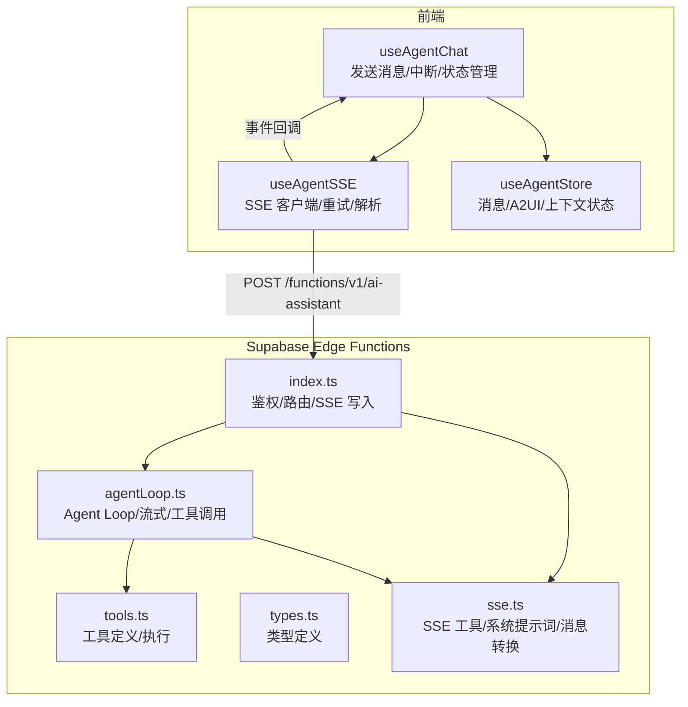
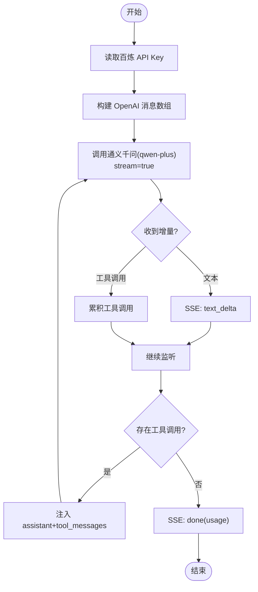
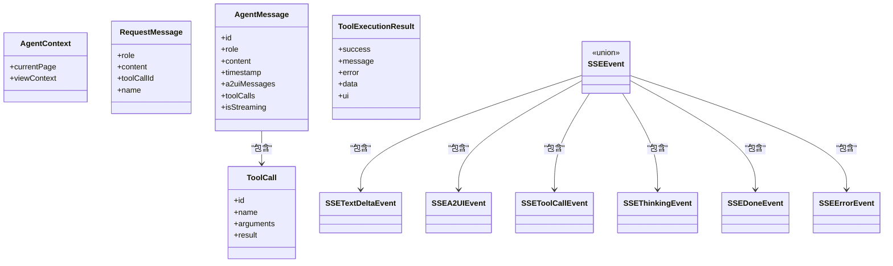
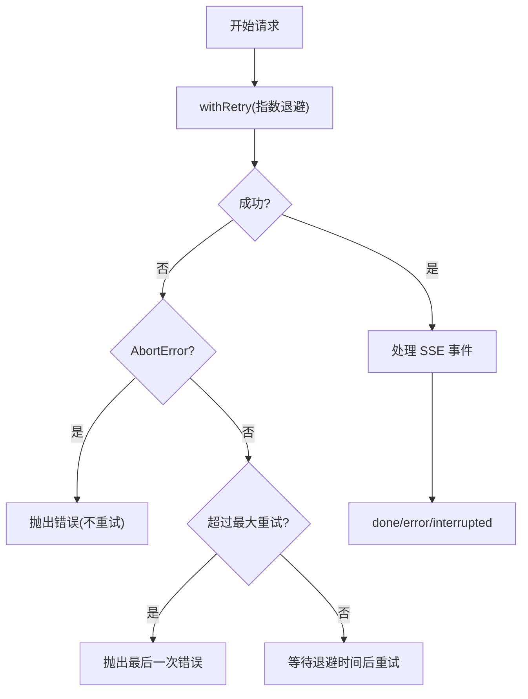
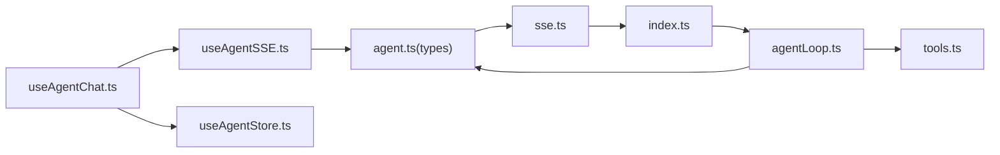

# AI 服务集成

<cite>
**本文引用的文件**
- [index.ts](file://app/supabase/functions/ai-assistant/index.ts)
- [agentLoop.ts](file://app/supabase/functions/ai-assistant/agentLoop.ts)
- [types.ts](file://app/supabase/functions/ai-assistant/types.ts)
- [tools.ts](file://app/supabase/functions/ai-assistant/tools.ts)
- [sse.ts](file://app/supabase/functions/ai-assistant/sse.ts)
- [useAgentChat.ts](file://app/src/hooks/useAgentChat.ts)
- [useAgentSSE.ts](file://app/src/lib/agent/sseClient.ts)
- [useAgentStore.ts](file://app/src/stores/useAgentStore.ts)
- [agent.ts](file://app/src/types/agent.ts)
- [ai.ts](file://app/src/types/ai.ts)
- [env.local.example](file://app/env.local.example)
- [ALIYUN-DEPLOY.md](file://ALIYUN-DEPLOY.md)
</cite>

## 目录
1. [引言](#引言)
2. [项目结构](#项目结构)
3. [核心组件](#核心组件)
4. [架构总览](#架构总览)
5. [详细组件分析](#详细组件分析)
6. [依赖关系分析](#依赖关系分析)
7. [性能考量](#性能考量)
8. [故障排查指南](#故障排查指南)
9. [结论](#结论)
10. [附录](#附录)

## 引言
本文件面向 OPC-Starter 的 AI 服务集成，聚焦通义千问 Qwen-Plus 通过阿里云百炼兼容模式接入的实现细节，涵盖：
- 通义千问 API 的集成方式（认证、请求参数、响应处理）
- Agent Loop 多轮对话循环（上下文维护、历史记录管理、工具调用协调、最终响应生成）
- AI 服务类型定义体系（消息格式、工具定义、响应结构）
- 提示词工程最佳实践（系统提示词、用户提示词、工具调用提示词）
- 错误处理与重试机制（网络异常、限流、降级策略）
- 配置指南与性能优化建议

## 项目结构
AI 服务由“前端 React Hook + SSE 客户端”与“Supabase Edge Functions（Deno）”两部分组成：
- 前端负责构建消息历史、触发 SSE、接收流式事件、执行工具调用、渲染 A2UI 界面
- 后端 Edge Function 负责鉴权、构造系统提示词、调用通义千问、执行工具、通过 SSE 回传事件



**图表来源**
- [index.ts:22-113](file://app/supabase/functions/ai-assistant/index.ts#L22-L113)
- [agentLoop.ts:21-137](file://app/supabase/functions/ai-assistant/agentLoop.ts#L21-L137)
- [tools.ts:10-77](file://app/supabase/functions/ai-assistant/tools.ts#L10-L77)
- [sse.ts:41-179](file://app/supabase/functions/ai-assistant/sse.ts#L41-L179)
- [useAgentChat.ts:47-377](file://app/src/hooks/useAgentChat.ts#L47-L377)
- [useAgentSSE.ts:246-481](file://app/src/lib/agent/sseClient.ts#L246-L481)
- [useAgentStore.ts:60-343](file://app/src/stores/useAgentStore.ts#L60-L343)

**章节来源**
- [index.ts:1-116](file://app/supabase/functions/ai-assistant/index.ts#L1-L116)
- [agentLoop.ts:1-138](file://app/supabase/functions/ai-assistant/agentLoop.ts#L1-L138)
- [tools.ts:1-191](file://app/supabase/functions/ai-assistant/tools.ts#L1-L191)
- [sse.ts:1-180](file://app/supabase/functions/ai-assistant/sse.ts#L1-L180)
- [useAgentChat.ts:1-380](file://app/src/hooks/useAgentChat.ts#L1-L380)
- [useAgentSSE.ts:1-484](file://app/src/lib/agent/sseClient.ts#L1-L484)
- [useAgentStore.ts:1-482](file://app/src/stores/useAgentStore.ts#L1-L482)

## 核心组件
- 后端入口与鉴权
  - 读取百炼 API Key，校验 Authorization 头，基于 Supabase JS SDK 获取当前用户，构造 SSE Writer，将消息转为 OpenAI 兼容格式并交由 Agent Loop 处理
- Agent Loop 多轮循环
  - 使用 OpenAI SDK 兼容模式调用通义千问，开启流式返回；累积文本增量与工具调用；遇到工具调用时注入 assistant+tool_messages，再次调用模型；统计 token 使用量；支持中断与最大迭代限制
- 工具系统
  - 定义三类工具：页面导航、获取上下文、渲染 A2UI；工具调用统一通过 processToolCall 处理，返回富结果（包含 UI 组件、上下文、建议下一步等）
- SSE 工具
  - 提供 CORS/事件流头部、SSE 写入器、消息格式转换（RequestMessage → OpenAI Message）、工具调用累积、构建 assistant+tool_calls 消息、系统提示词构建
- 前端集成
  - useAgentChat：构建消息历史、触发 SSE、处理文本增量、A2UI、工具调用、完成/错误/中断事件；支持 H2A 异步转向（中断即终止）
  - useAgentSSE：封装 fetch + SSE 解析、自动重试、AbortController 控制、工具结果回传
  - useAgentStore：Zustand 管理消息、Surface、Portal、上下文与 UI 状态

**章节来源**
- [index.ts:34-113](file://app/supabase/functions/ai-assistant/index.ts#L34-L113)
- [agentLoop.ts:21-137](file://app/supabase/functions/ai-assistant/agentLoop.ts#L21-L137)
- [tools.ts:10-191](file://app/supabase/functions/ai-assistant/tools.ts#L10-L191)
- [sse.ts:26-179](file://app/supabase/functions/ai-assistant/sse.ts#L26-L179)
- [useAgentChat.ts:47-377](file://app/src/hooks/useAgentChat.ts#L47-L377)
- [useAgentSSE.ts:246-481](file://app/src/lib/agent/sseClient.ts#L246-L481)
- [useAgentStore.ts:60-343](file://app/src/stores/useAgentStore.ts#L60-L343)

## 架构总览
下面的序列图展示了从用户输入到最终响应的关键流程，包括工具调用与 A2UI 渲染：

```mermaid
sequenceDiagram
participant UI as "用户界面"
participant Hook as "useAgentChat"
participant SSE as "useAgentSSE"
participant Edge as "Edge Function(index.ts)"
participant Loop as "Agent Loop(agentLoop.ts)"
participant LLM as "通义千问(Qwen-Plus)"
participant Tools as "工具(tools.ts)"
participant Store as "useAgentStore"
UI->>Hook : 输入消息
Hook->>Store : 创建用户消息/占位助手消息
Hook->>SSE : sendMessage(消息历史, 上下文)
SSE->>Edge : POST /functions/v1/ai-assistant
Edge->>Loop : runAgentLoop(OpenAI 消息, SSEWriter)
Loop->>LLM : chat.completions.create(stream=true)
LLM-->>Loop : text_delta / tool_calls
Loop-->>SSE : 写入 text_delta / tool_call 事件
SSE-->>Hook : onTextDelta/onToolCall 回调
Hook->>Tools : executeToolCall(工具调用)
Tools-->>Hook : 工具执行结果(含 UI 组件?)
Hook->>SSE : sendToolResult(追加 tool 消息)
SSE->>Edge : 再次请求
Edge->>Loop : 继续循环
Loop-->>SSE : done(usage)/error/interrupted
SSE-->>Hook : onDone/onError/onInterrupted
Hook->>Store : 更新消息/状态
```

**图表来源**
- [useAgentChat.ts:299-377](file://app/src/hooks/useAgentChat.ts#L299-L377)
- [useAgentSSE.ts:369-463](file://app/src/lib/agent/sseClient.ts#L369-L463)
- [index.ts:82-100](file://app/supabase/functions/ai-assistant/index.ts#L82-L100)
- [agentLoop.ts:42-131](file://app/supabase/functions/ai-assistant/agentLoop.ts#L42-L131)
- [tools.ts:161-190](file://app/supabase/functions/ai-assistant/tools.ts#L161-L190)
- [useAgentStore.ts:148-332](file://app/src/stores/useAgentStore.ts#L148-L332)

## 详细组件分析

### 通义千问 Qwen-Plus 集成
- 认证与密钥
  - 后端通过环境变量读取百炼 API Key；前端通过 Supabase 获取访问令牌并附加到 Authorization 头
- 请求参数
  - 模型：qwen-plus
  - 消息格式：OpenAI 兼容的消息数组（system + user/assistant/tool）
  - 工具：OpenAI Function Call 格式（TOOLS）
  - 流式：开启流式返回并包含 usage
- 响应处理
  - SSE 事件：text_delta、a2ui、tool_call、done、error
  - 前端解析并分发到对应回调，逐步更新 UI 与消息历史



**图表来源**
- [agentLoop.ts:42-131](file://app/supabase/functions/ai-assistant/agentLoop.ts#L42-L131)
- [sse.ts:41-106](file://app/supabase/functions/ai-assistant/sse.ts#L41-L106)

**章节来源**
- [index.ts:34-113](file://app/supabase/functions/ai-assistant/index.ts#L34-L113)
- [agentLoop.ts:16-49](file://app/supabase/functions/ai-assistant/agentLoop.ts#L16-L49)
- [sse.ts:41-106](file://app/supabase/functions/ai-assistant/sse.ts#L41-L106)

### Agent Loop 多轮对话循环
- 上下文维护
  - 前端将 AgentContext（当前页面、视图上下文）随请求发送；后端构建系统提示词并注入 system 消息
- 历史记录管理
  - 前端构建完整消息历史（含系统消息摘要），后端按 OpenAI 格式转换
- 工具调用协调
  - 后端累积工具调用参数，注入 assistant+tool_messages，再次调用模型；工具执行结果以 tool 消息回填
- 最终响应生成
  - 无工具调用时，输出 done 事件并携带 token usage；支持中断与最大迭代限制

```mermaid
sequenceDiagram
participant Front as "前端(useAgentChat)"
participant SSE as "useAgentSSE"
participant Func as "Edge Function"
participant Loop as "Agent Loop"
participant Tools as "工具执行"
Front->>SSE : 构建消息历史 + 上下文
SSE->>Func : POST 请求
Func->>Loop : runAgentLoop
Loop->>Loop : 流式接收 text_delta
Loop->>Loop : 累积 tool_calls
Loop->>Tools : processToolCall(...)
Tools-->>Loop : 工具结果
Loop->>Loop : 注入 tool 消息并再次调用
Loop-->>SSE : done/error/interrupted
SSE-->>Front : 回调处理
```

**图表来源**
- [useAgentChat.ts:345-367](file://app/src/hooks/useAgentChat.ts#L345-L367)
- [agentLoop.ts:83-131](file://app/supabase/functions/ai-assistant/agentLoop.ts#L83-L131)
- [tools.ts:161-190](file://app/supabase/functions/ai-assistant/tools.ts#L161-L190)

**章节来源**
- [useAgentChat.ts:345-367](file://app/src/hooks/useAgentChat.ts#L345-L367)
- [agentLoop.ts:21-137](file://app/supabase/functions/ai-assistant/agentLoop.ts#L21-L137)

### 类型定义系统
- 消息与上下文
  - RequestMessage、AgentContext、AgentMessage、AgentMessageRole
- SSE 事件
  - text_delta、a2ui、tool_call、thinking、done、error
- 工具
  - ToolCall、ToolExecutionResult、AgentTool（OpenAI Function Schema）
- 前端 Store
  - AgentState/AgentActions，包含消息、Surface、Portal、上下文与 UI 状态



**图表来源**
- [agent.ts:29-148](file://app/src/types/agent.ts#L29-L148)
- [agent.ts:154-221](file://app/src/types/agent.ts#L154-L221)

**章节来源**
- [agent.ts:1-349](file://app/src/types/agent.ts#L1-L349)
- [types.ts:7-55](file://app/supabase/functions/ai-assistant/types.ts#L7-L55)

### 提示词工程最佳实践
- 系统提示词设计
  - 明确角色定位、风格与语言；介绍平台功能与页面；列出可用工具；给出交互规则与示例
- 用户提示词处理
  - 将上下文摘要作为 system 消息注入；结合当前页面与团队信息增强相关性
- 工具调用提示词
  - 工具定义采用 OpenAI Function Schema，确保参数类型与必填项清晰；工具执行结果回填后再次推理

**章节来源**
- [sse.ts:108-179](file://app/supabase/functions/ai-assistant/sse.ts#L108-L179)
- [useAgentChat.ts:349-356](file://app/src/hooks/useAgentChat.ts#L349-L356)

### 错误处理与重试机制
- 网络异常
  - 前端 useAgentSSE 提供 withRetry，指数退避重试，最多 3 次；对 AbortError 不重试
- API 限流与降级
  - 后端 Agent Loop 捕获 LLM 调用错误并上报 error 事件；达到最大迭代次数发出超时提示
- 中断与清理
  - H2A 异步转向：用户中断后立即停止流式输出，标记消息为中断状态，不保存进度



**图表来源**
- [useAgentSSE.ts:205-237](file://app/src/lib/agent/sseClient.ts#L205-L237)
- [agentLoop.ts:124-136](file://app/supabase/functions/ai-assistant/agentLoop.ts#L124-L136)

**章节来源**
- [useAgentSSE.ts:29-34](file://app/src/lib/agent/sseClient.ts#L29-L34)
- [useAgentSSE.ts:205-237](file://app/src/lib/agent/sseClient.ts#L205-L237)
- [agentLoop.ts:124-136](file://app/supabase/functions/ai-assistant/agentLoop.ts#L124-L136)

## 依赖关系分析
- 前端依赖
  - useAgentChat 依赖 useAgentSSE、useToolExecutor、useAgentStore、useAgentContext
  - useAgentSSE 依赖 Supabase 客户端获取访问令牌，调用 Edge Function 网关
- 后端依赖
  - index.ts 依赖 sse.ts、agentLoop.ts；agentLoop.ts 依赖 tools.ts 与 OpenAI SDK 兼容模式
- 类型依赖
  - 前端 agent.ts 与后端 types.ts 保持一致的消息与工具定义契约



**图表来源**
- [useAgentChat.ts:10-13](file://app/src/hooks/useAgentChat.ts#L10-L13)
- [useAgentSSE.ts:9-22](file://app/src/lib/agent/sseClient.ts#L9-L22)
- [agent.ts:1-10](file://app/src/types/agent.ts#L1-L10)
- [index.ts:12-19](file://app/supabase/functions/ai-assistant/index.ts#L12-L19)
- [agentLoop.ts:7-14](file://app/supabase/functions/ai-assistant/agentLoop.ts#L7-L14)
- [tools.ts:7-8](file://app/supabase/functions/ai-assistant/tools.ts#L7-L8)
- [sse.ts:7-11](file://app/supabase/functions/ai-assistant/sse.ts#L7-L11)

**章节来源**
- [useAgentChat.ts:10-13](file://app/src/hooks/useAgentChat.ts#L10-L13)
- [useAgentSSE.ts:9-22](file://app/src/lib/agent/sseClient.ts#L9-L22)
- [agent.ts:1-10](file://app/src/types/agent.ts#L1-L10)
- [index.ts:12-19](file://app/supabase/functions/ai-assistant/index.ts#L12-L19)
- [agentLoop.ts:7-14](file://app/supabase/functions/ai-assistant/agentLoop.ts#L7-L14)
- [tools.ts:7-8](file://app/supabase/functions/ai-assistant/tools.ts#L7-L8)
- [sse.ts:7-11](file://app/supabase/functions/ai-assistant/sse.ts#L7-L11)

## 性能考量
- 流式传输
  - 后端开启 stream=true 并 include_usage，前端即时渲染文本增量，降低感知延迟
- 工具调用批处理
  - Agent Loop 一次性累积多个工具调用，减少往返次数
- 重试与中断
  - 前端指数退避重试，用户可随时中断，避免资源浪费
- 建议
  - 控制消息长度与上下文深度，合理使用 system 消息摘要
  - 对高频工具调用增加前端缓存与去抖
  - 监控 token 使用与成本，必要时切换更经济的模型

[本节为通用指导，无需具体文件分析]

## 故障排查指南
- 常见错误与定位
  - 未配置百炼 API Key：后端读取环境变量失败，返回错误
  - 缺少 Authorization 头：后端拒绝请求
  - 用户未授权：Supabase getUser 失败
  - messages 为空：后端返回 400
  - LLM 调用错误：Agent Loop 捕获并上报 error 事件
  - 达到最大迭代次数：后端返回超时提示
- 前端重试与中断
  - useAgentSSE 提供自动重试与手动中断；useAgentChat 支持 H2A 异步转向
- 环境变量与部署
  - 前端参考 env.local.example；后端在 Supabase Dashboard → Edge Functions → Secrets 配置 ALIYUN_BAILIAN_API_KEY

**章节来源**
- [index.ts:34-113](file://app/supabase/functions/ai-assistant/index.ts#L34-L113)
- [agentLoop.ts:124-136](file://app/supabase/functions/ai-assistant/agentLoop.ts#L124-L136)
- [useAgentSSE.ts:205-237](file://app/src/lib/agent/sseClient.ts#L205-L237)
- [useAgentChat.ts:280-294](file://app/src/hooks/useAgentChat.ts#L280-L294)
- [env.local.example:37-38](file://app/env.local.example#L37-L38)
- [ALIYUN-DEPLOY.md:217-219](file://ALIYUN-DEPLOY.md#L217-L219)

## 结论
OPC-Starter 的 AI 服务集成以“前端流式交互 + 后端 Agent Loop + 通义千问兼容模式”为核心，通过标准化类型定义与 SSE 事件协议，实现了稳定的多轮对话与工具调用闭环。配合完善的错误处理、重试与中断机制，能够在真实生产环境中提供可靠的用户体验。

[本节为总结，无需具体文件分析]

## 附录
- 配置清单
  - 前端 Supabase 凭证：VITE_SUPABASE_URL、VITE_SUPABASE_ANON_KEY
  - 后端百炼密钥：ALIYUN_BAILIAN_API_KEY（Supabase Secrets）
- 部署要点
  - Edge Function 部署与密钥配置参考 ALIYUN-DEPLOY.md

**章节来源**
- [env.local.example:8-9](file://app/env.local.example#L8-L9)
- [env.local.example:37-38](file://app/env.local.example#L37-L38)
- [ALIYUN-DEPLOY.md:214-219](file://ALIYUN-DEPLOY.md#L214-L219)