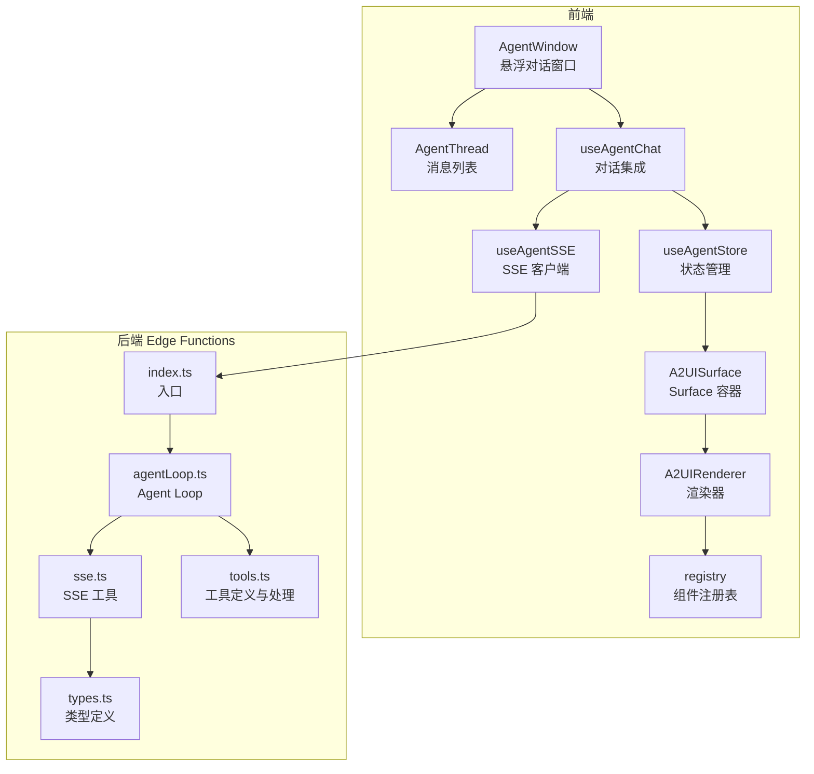
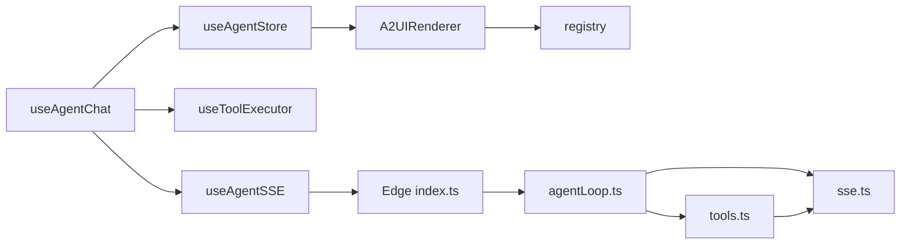
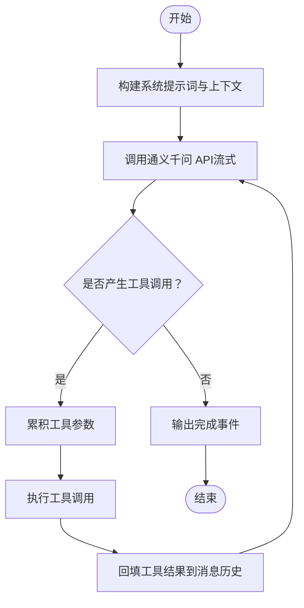
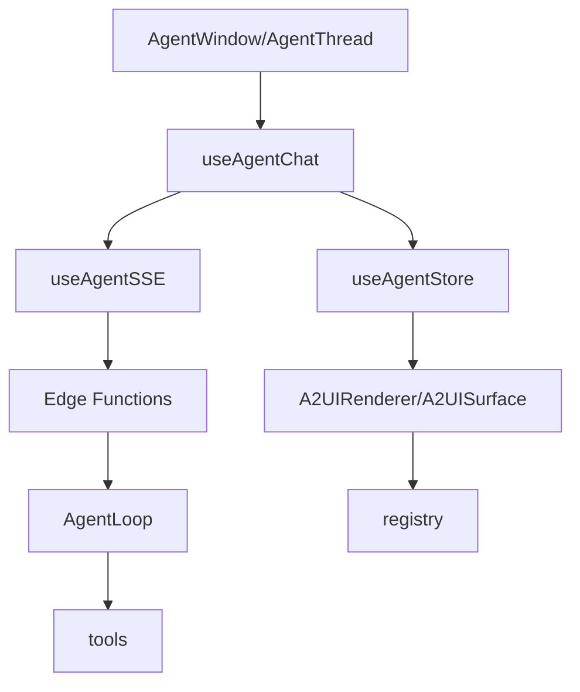

# Agent 系统架构

<cite>
**本文引用的文件**
- [app/supabase/functions/ai-assistant/index.ts](file://app/supabase/functions/ai-assistant/index.ts)
- [app/supabase/functions/ai-assistant/sse.ts](file://app/supabase/functions/ai-assistant/sse.ts)
- [app/supabase/functions/ai-assistant/tools.ts](file://app/supabase/functions/ai-assistant/tools.ts)
- [app/supabase/functions/ai-assistant/agentLoop.ts](file://app/supabase/functions/ai-assistant/agentLoop.ts)
- [app/supabase/functions/ai-assistant/types.ts](file://app/supabase/functions/ai-assistant/types.ts)
- [app/src/lib/agent/sseClient.ts](file://app/src/lib/agent/sseClient.ts)
- [app/src/lib/agent/toolExecutor.ts](file://app/src/lib/agent/toolExecutor.ts)
- [app/src/hooks/useAgentChat.ts](file://app/src/hooks/useAgentChat.ts)
- [app/src/stores/useAgentStore.ts](file://app/src/stores/useAgentStore.ts)
- [app/src/components/agent/AgentWindow.tsx](file://app/src/components/agent/AgentWindow.tsx)
- [app/src/components/agent/AgentThread.tsx](file://app/src/components/agent/AgentThread.tsx)
- [app/src/components/agent/a2ui/A2UIRenderer.tsx](file://app/src/components/agent/a2ui/A2UIRenderer.tsx)
- [app/src/components/agent/a2ui/A2UISurface.tsx](file://app/src/components/agent/a2ui/A2UISurface.tsx)
- [app/src/components/agent/a2ui/registry.ts](file://app/src/components/agent/a2ui/registry.ts)
</cite>

## 目录
1. [引言](#引言)
2. [项目结构](#项目结构)
3. [核心组件](#核心组件)
4. [架构总览](#架构总览)
5. [详细组件分析](#详细组件分析)
6. [依赖关系分析](#依赖关系分析)
7. [性能考量](#性能考量)
8. [故障排查指南](#故障排查指南)
9. [结论](#结论)
10. [附录](#附录)

## 引言
本文件为 OPC-Starter 的 Agent 系统架构文档，聚焦于 Agent Studio 的整体设计与实现，涵盖前端 Agent 组件层与后端 Edge Functions 层的协同机制；深入解释 SSE（Server-Sent Events）流式通信的实现原理（连接建立、消息传输、断线重连等）；阐述工具链执行架构（工具注册、参数传递、执行顺序控制、错误处理）；说明 A2UI 动态渲染系统的设计思路（组件注册表、渲染器机制、界面生成流程）；介绍 AI 服务集成方式（通义千问 API 的调用、提示词工程、响应解析）。同时提供 Agent 工作流程图与组件交互图，帮助读者快速理解系统全貌。

## 项目结构
- 后端 Edge Functions（Supabase Edge Functions）位于 app/supabase/functions/ai-assistant，负责接收前端请求、构建系统提示词、调用通义千问 API、执行 Agent Loop、通过 SSE 流式返回文本增量、工具调用与 A2UI 渲染指令。
- 前端位于 app/src，包含：
  - Agent 窗口与消息列表组件（AgentWindow、AgentThread）
  - SSE 客户端 Hook（useAgentSSE），负责与后端建立 SSE 连接、解析事件、重试与中断
  - 对话集成 Hook（useAgentChat），整合 SSE、工具执行与状态管理
  - 状态管理（useAgentStore），维护会话、消息、Surface、Portal 等状态
  - A2UI 动态渲染系统（A2UIRenderer、A2UISurface、registry），负责将服务端下发的组件树动态渲染为 React 组件



图表来源
- [app/src/components/agent/AgentWindow.tsx:1-243](file://app/src/components/agent/AgentWindow.tsx#L1-L243)
- [app/src/components/agent/AgentThread.tsx:1-183](file://app/src/components/agent/AgentThread.tsx#L1-L183)
- [app/src/hooks/useAgentChat.ts:1-380](file://app/src/hooks/useAgentChat.ts#L1-L380)
- [app/src/lib/agent/sseClient.ts:1-484](file://app/src/lib/agent/sseClient.ts#L1-L484)
- [app/src/stores/useAgentStore.ts:1-482](file://app/src/stores/useAgentStore.ts#L1-L482)
- [app/src/components/agent/a2ui/A2UIRenderer.tsx:1-244](file://app/src/components/agent/a2ui/A2UIRenderer.tsx#L1-L244)
- [app/src/components/agent/a2ui/A2UISurface.tsx:1-112](file://app/src/components/agent/a2ui/A2UISurface.tsx#L1-L112)
- [app/src/components/agent/a2ui/registry.ts:1-129](file://app/src/components/agent/a2ui/registry.ts#L1-L129)
- [app/supabase/functions/ai-assistant/index.ts:1-116](file://app/supabase/functions/ai-assistant/index.ts#L1-L116)
- [app/supabase/functions/ai-assistant/agentLoop.ts:1-138](file://app/supabase/functions/ai-assistant/agentLoop.ts#L1-L138)
- [app/supabase/functions/ai-assistant/sse.ts:1-180](file://app/supabase/functions/ai-assistant/sse.ts#L1-L180)
- [app/supabase/functions/ai-assistant/tools.ts:1-191](file://app/supabase/functions/ai-assistant/tools.ts#L1-L191)
- [app/supabase/functions/ai-assistant/types.ts:1-55](file://app/supabase/functions/ai-assistant/types.ts#L1-L55)

章节来源
- [app/supabase/functions/ai-assistant/index.ts:1-116](file://app/supabase/functions/ai-assistant/index.ts#L1-L116)
- [app/src/lib/agent/sseClient.ts:1-484](file://app/src/lib/agent/sseClient.ts#L1-L484)
- [app/src/hooks/useAgentChat.ts:1-380](file://app/src/hooks/useAgentChat.ts#L1-L380)
- [app/src/stores/useAgentStore.ts:1-482](file://app/src/stores/useAgentStore.ts#L1-L482)
- [app/src/components/agent/a2ui/A2UIRenderer.tsx:1-244](file://app/src/components/agent/a2ui/A2UIRenderer.tsx#L1-L244)
- [app/src/components/agent/a2ui/A2UISurface.tsx:1-112](file://app/src/components/agent/a2ui/A2UISurface.tsx#L1-L112)
- [app/src/components/agent/a2ui/registry.ts:1-129](file://app/src/components/agent/a2ui/registry.ts#L1-L129)

## 核心组件
- 后端 Edge Functions 入口与路由
  - 入口文件负责鉴权、构造系统提示词、将消息转换为 OpenAI 兼容格式、启动 Agent Loop，并通过 SSE 写出事件流。
- Agent Loop
  - 调用通义千问 API，开启流式响应；累积文本增量与工具调用；将工具调用结果回填至消息历史，继续推理直至完成或达到最大迭代。
- SSE 工具
  - 提供 CORS/SSE 头、SSEWriter、消息格式转换、工具调用累积与组装、系统提示词构建。
- 工具定义与处理
  - 定义可用工具（导航、获取上下文、渲染 UI），处理工具调用并返回富结果；对 renderUI 特殊处理，向前端推送 A2UI 指令。
- 前端 SSE 客户端
  - 建立与后端的 SSE 连接，解析事件类型，支持自动重试与手动中断；将事件分发给 useAgentChat。
- 对话集成 Hook
  - 整合 SSE、工具执行、状态管理与 A2UI 消息处理；支持 H2A 异步转向（用户中断）。
- 状态管理
  - 维护会话、消息、Surface、Portal 等状态；处理用户在 A2UI 上的操作并反馈到后端。
- A2UI 渲染系统
  - 组件注册表、渲染器、Surface 容器；根据 renderTarget 将组件渲染到对话内或 Portal 区域。

章节来源
- [app/supabase/functions/ai-assistant/index.ts:22-113](file://app/supabase/functions/ai-assistant/index.ts#L22-L113)
- [app/supabase/functions/ai-assistant/agentLoop.ts:21-137](file://app/supabase/functions/ai-assistant/agentLoop.ts#L21-L137)
- [app/supabase/functions/ai-assistant/sse.ts:26-179](file://app/supabase/functions/ai-assistant/sse.ts#L26-L179)
- [app/supabase/functions/ai-assistant/tools.ts:10-191](file://app/supabase/functions/ai-assistant/tools.ts#L10-L191)
- [app/src/lib/agent/sseClient.ts:246-481](file://app/src/lib/agent/sseClient.ts#L246-L481)
- [app/src/hooks/useAgentChat.ts:47-377](file://app/src/hooks/useAgentChat.ts#L47-L377)
- [app/src/stores/useAgentStore.ts:60-343](file://app/src/stores/useAgentStore.ts#L60-L343)
- [app/src/components/agent/a2ui/A2UIRenderer.tsx:91-171](file://app/src/components/agent/a2ui/A2UIRenderer.tsx#L91-L171)
- [app/src/components/agent/a2ui/A2UISurface.tsx:30-81](file://app/src/components/agent/a2ui/A2UISurface.tsx#L30-L81)
- [app/src/components/agent/a2ui/registry.ts:75-121](file://app/src/components/agent/a2ui/registry.ts#L75-L121)

## 架构总览
Agent Studio 采用“前端组件层 + 后端 Edge Functions 层”的分层架构：
- 前端负责用户交互、SSE 连接、消息渲染、A2UI 动态渲染与状态管理；
- 后端负责 AI 推理、工具调用、SSE 流式输出与上下文构建；
- 两者通过 SSE 事件流进行解耦协作，支持断线重连与中断控制。

```mermaid
sequenceDiagram
participant User as "用户"
participant Window as "AgentWindow"
participant Chat as "useAgentChat"
participant SSE as "useAgentSSE"
participant Edge as "Edge Functions(index)"
participant Loop as "AgentLoop"
participant Tools as "tools"
participant SSEW as "SSEWriter"
User->>Window : 打开对话窗口
Window->>Chat : 触发发送消息
Chat->>SSE : 建立 SSE 连接并发送消息历史+上下文
SSE->>Edge : POST /functions/v1/ai-assistant
Edge->>Loop : runAgentLoop(messages, sse)
Loop->>Loop : 调用通义千问 API流式
Loop->>SSEW : 写入 text_delta
SSEW-->>SSE : 事件流
SSE-->>Chat : onTextDelta
Chat-->>Window : 更新消息内容
Loop->>SSEW : 写入 tool_call / a2ui
SSEW-->>SSE : 事件流
SSE-->>Chat : onToolCall / onA2UI
Chat->>Tools : 执行工具调用
Tools-->>SSEW : 返回富结果/触发 UI 渲染
Loop->>Loop : 将工具结果回填消息历史
Loop-->>SSEW : 写入 done
SSEW-->>SSE : 事件流
SSE-->>Chat : onDone
Chat-->>Window : 完成渲染
```

图表来源
- [app/src/hooks/useAgentChat.ts:260-274](file://app/src/hooks/useAgentChat.ts#L260-L274)
- [app/src/lib/agent/sseClient.ts:311-362](file://app/src/lib/agent/sseClient.ts#L311-L362)
- [app/supabase/functions/ai-assistant/index.ts:82-100](file://app/supabase/functions/ai-assistant/index.ts#L82-L100)
- [app/supabase/functions/ai-assistant/agentLoop.ts:42-131](file://app/supabase/functions/ai-assistant/agentLoop.ts#L42-L131)
- [app/supabase/functions/ai-assistant/sse.ts:26-39](file://app/supabase/functions/ai-assistant/sse.ts#L26-L39)
- [app/supabase/functions/ai-assistant/tools.ts:161-190](file://app/supabase/functions/ai-assistant/tools.ts#L161-L190)

## 详细组件分析

### 后端 Edge Functions：入口与路由
- 鉴权与初始化
  - 读取环境变量与 Authorization 头，创建 Supabase 客户端并校验用户身份。
- 请求体解析与校验
  - 校验 messages 是否存在，记录请求上下文与线程 ID。
- SSE 流创建与事件写出
  - 构造 TransformStream 与 SSEWriter，将 text_delta、tool_call、a2ui、done、error 等事件写入流。
- 错误处理
  - 捕获请求级与处理级异常，统一返回 JSON 错误或 SSE error 事件。

章节来源
- [app/supabase/functions/ai-assistant/index.ts:22-113](file://app/supabase/functions/ai-assistant/index.ts#L22-L113)

### 后端 Edge Functions：Agent Loop
- LLM 调用与流式处理
  - 使用通义千问兼容模式调用 qwen-plus，开启流式与 usage 统计。
- 文本增量与工具调用累积
  - 累积 content 与工具调用参数，按迭代周期回填消息历史。
- 工具调用执行与回填
  - 解析工具参数，调用 processToolCall，将工具结果以 tool 角色消息回填。
- 完成与中断
  - 输出 done 事件并携带 token 使用统计；若达到最大迭代次数或被中断，输出相应事件。

章节来源
- [app/supabase/functions/ai-assistant/agentLoop.ts:21-137](file://app/supabase/functions/ai-assistant/agentLoop.ts#L21-L137)

### 后端 Edge Functions：SSE 工具与系统提示词
- SSEWriter
  - 将事件封装为 event/data 格式写入流，支持 close。
- 消息转换
  - 将内部消息转换为 OpenAI 兼容格式，支持 tool 角色消息。
- 工具调用累积
  - 将流式工具调用参数按索引累积，最终组装为完整工具调用。
- 系统提示词构建
  - 基于 AgentContext 与页面上下文生成系统提示词，声明可用工具与交互规则。

章节来源
- [app/supabase/functions/ai-assistant/sse.ts:26-179](file://app/supabase/functions/ai-assistant/sse.ts#L26-L179)

### 后端 Edge Functions：工具定义与处理
- 工具清单
  - 定义 navigateToPage、getCurrentContext、renderUI 三种工具，声明参数与枚举值。
- 工具调用处理
  - 对 renderUI 特殊处理：写入 a2ui 事件并返回富结果；对其他工具返回富结果并标记 executed。
- 导航与上下文
  - 导航工具返回目标页面名称；上下文工具返回当前页面与视图上下文。

章节来源
- [app/supabase/functions/ai-assistant/tools.ts:10-191](file://app/supabase/functions/ai-assistant/tools.ts#L10-L191)

### 前端：SSE 客户端（useAgentSSE）
- 连接与鉴权
  - 通过 Supabase 获取 Access Token，向 /functions/v1/ai-assistant 发起 POST 请求。
- 事件解析
  - 解析 text_delta、a2ui、tool_call、thinking、done、error 等事件类型。
- 重试与中断
  - 支持指数退避重试与 AbortController 中断；暴露 retryCount 与 error。
- 工具结果回传
  - 提供 sendToolResult 方法，将工具执行结果追加到消息历史并重新发起请求。

章节来源
- [app/src/lib/agent/sseClient.ts:246-481](file://app/src/lib/agent/sseClient.ts#L246-L481)

### 前端：对话集成（useAgentChat）
- 状态与上下文
  - 维护 isStreaming、error、retryCount；生成上下文摘要作为系统消息。
- 事件处理
  - 文本增量：累积并更新助手消息内容；A2UI：累积并调用 A2UI 消息处理器；工具调用：累积并等待执行；完成：标记结束并执行待处理工具调用。
- 中断与错误
  - 支持 H2A 异步转向（用户中断），中断后不再保存进度；错误时更新消息内容并设置错误状态。
- 与工具执行器集成
  - 调用 useToolExecutor 执行工具调用，处理返回的 UI 组件并更新消息。

章节来源
- [app/src/hooks/useAgentChat.ts:47-377](file://app/src/hooks/useAgentChat.ts#L47-L377)

### 前端：状态管理（useAgentStore）
- 会话管理
  - 创建/加载/清空会话；持久化 lastAgentThreadId。
- 消息管理
  - 追加与更新消息；支持流式状态切换。
- Surface 与 Portal
  - 维护当前 Surface 与 Portal 内容、目标与数据模型；根据 renderTarget 将组件渲染到 inline 或 Portal。
- 用户操作
  - 处理用户在 A2UI 上的操作，调用 A2UI Action Handler 并生成通知消息。

章节来源
- [app/src/stores/useAgentStore.ts:60-482](file://app/src/stores/useAgentStore.ts#L60-L482)

### 前端：A2UI 动态渲染系统
- 组件注册表
  - 维护 A2UI 组件类型到 React 组件的映射，支持基础 UI、布局与业务组件。
- 渲染器（A2UIRenderer）
  - 递归渲染组件树；进行安全校验与 props 绑定；包装事件处理器；提供错误边界。
- Surface 容器（A2UISurface）
  - 接收用户操作消息并转发；处理渲染错误回调；为空时显示占位符。
- 消息处理
  - 根据消息类型（beginRendering、surfaceUpdate、dataModelUpdate、deleteSurface）更新 Surface 或 Portal。

章节来源
- [app/src/components/agent/a2ui/registry.ts:75-121](file://app/src/components/agent/a2ui/registry.ts#L75-L121)
- [app/src/components/agent/a2ui/A2UIRenderer.tsx:91-171](file://app/src/components/agent/a2ui/A2UIRenderer.tsx#L91-L171)
- [app/src/components/agent/a2ui/A2UISurface.tsx:30-81](file://app/src/components/agent/a2ui/A2UISurface.tsx#L30-L81)
- [app/src/stores/useAgentStore.ts:358-459](file://app/src/stores/useAgentStore.ts#L358-L459)

### 前端：Agent 组件层
- AgentWindow
  - 可拖拽、可最小化的悬浮窗口；打开时检查并恢复上次会话；提供清空对话、开始新对话等操作。
- AgentThread
  - 渲染消息列表，支持自动滚动；空状态显示上下文感知的推荐按钮。

章节来源
- [app/src/components/agent/AgentWindow.tsx:36-241](file://app/src/components/agent/AgentWindow.tsx#L36-L241)
- [app/src/components/agent/AgentThread.tsx:19-183](file://app/src/components/agent/AgentThread.tsx#L19-L183)

## 依赖关系分析
- 前端依赖
  - useAgentChat 依赖 useAgentSSE、useToolExecutor、useAgentStore、useAgentContext。
  - useAgentSSE 依赖 supabase 客户端与后端 Edge Functions。
  - A2UI 渲染依赖注册表与 Surface 容器。
- 后端依赖
  - index 依赖 agentLoop、sse 工具与类型定义。
  - agentLoop 依赖 OpenAI SDK、tools 与 sse 工具。
  - tools 依赖 sse 工具与类型定义。



图表来源
- [app/src/hooks/useAgentChat.ts:10-83](file://app/src/hooks/useAgentChat.ts#L10-L83)
- [app/src/lib/agent/sseClient.ts:246-481](file://app/src/lib/agent/sseClient.ts#L246-L481)
- [app/src/lib/agent/toolExecutor.ts:39-64](file://app/src/lib/agent/toolExecutor.ts#L39-L64)
- [app/src/stores/useAgentStore.ts:358-459](file://app/src/stores/useAgentStore.ts#L358-L459)
- [app/src/components/agent/a2ui/A2UIRenderer.tsx:9-11](file://app/src/components/agent/a2ui/A2UIRenderer.tsx#L9-L11)
- [app/src/components/agent/a2ui/registry.ts:35-97](file://app/src/components/agent/a2ui/registry.ts#L35-L97)
- [app/supabase/functions/ai-assistant/index.ts:19-20](file://app/supabase/functions/ai-assistant/index.ts#L19-L20)
- [app/supabase/functions/ai-assistant/agentLoop.ts:7-14](file://app/supabase/functions/ai-assistant/agentLoop.ts#L7-L14)
- [app/supabase/functions/ai-assistant/sse.ts:7-11](file://app/supabase/functions/ai-assistant/sse.ts#L7-L11)
- [app/supabase/functions/ai-assistant/tools.ts:7-8](file://app/supabase/functions/ai-assistant/tools.ts#L7-L8)

章节来源
- [app/src/hooks/useAgentChat.ts:10-83](file://app/src/hooks/useAgentChat.ts#L10-L83)
- [app/src/lib/agent/sseClient.ts:246-481](file://app/src/lib/agent/sseClient.ts#L246-L481)
- [app/src/lib/agent/toolExecutor.ts:39-64](file://app/src/lib/agent/toolExecutor.ts#L39-L64)
- [app/src/stores/useAgentStore.ts:358-459](file://app/src/stores/useAgentStore.ts#L358-L459)
- [app/src/components/agent/a2ui/A2UIRenderer.tsx:9-11](file://app/src/components/agent/a2ui/A2UIRenderer.tsx#L9-L11)
- [app/src/components/agent/a2ui/registry.ts:35-97](file://app/src/components/agent/a2ui/registry.ts#L35-L97)
- [app/supabase/functions/ai-assistant/index.ts:19-20](file://app/supabase/functions/ai-assistant/index.ts#L19-L20)
- [app/supabase/functions/ai-assistant/agentLoop.ts:7-14](file://app/supabase/functions/ai-assistant/agentLoop.ts#L7-L14)
- [app/supabase/functions/ai-assistant/sse.ts:7-11](file://app/supabase/functions/ai-assistant/sse.ts#L7-L11)
- [app/supabase/functions/ai-assistant/tools.ts:7-8](file://app/supabase/functions/ai-assistant/tools.ts#L7-L8)

## 性能考量
- 流式传输
  - 后端启用流式响应与 usage 统计，前端按增量更新，降低首屏延迟。
- 工具调用累积
  - 通过 Map 按索引累积工具参数，避免重复解析，提升工具调用处理效率。
- 重试策略
  - 指数退避重试，限制最大重试次数与最大延迟，平衡可靠性与资源消耗。
- 断线重连
  - 前端在 SSE 连接中断时自动重试，结合 AbortController 控制并发请求。
- A2UI 渲染
  - 严格模式下进行组件校验，非严格模式进行 props 过滤，兼顾安全性与性能。

## 故障排查指南
- 常见错误与定位
  - 未配置 API Key：后端读取环境变量失败，需检查 ALIYUN_BAILIAN_API_KEY。
  - 未授权访问：后端校验 Authorization 头失败，需确保前端正确获取并携带 Access Token。
  - 请求体缺失：messages 为空导致 400，需确保消息历史与上下文正确传递。
  - LLM 调用错误：Agent Loop 捕获并写出 error 事件，前端 onError 回调可查看具体错误。
  - 工具参数解析失败：工具参数 JSON 解析异常，检查工具调用参数完整性。
- 重试与中断
  - 前端 withRetry 提供自动重试，可通过 retryCount 观察重试次数；AbortController 支持用户中断。
- A2UI 渲染问题
  - 未知组件类型：注册表未找到对应组件，检查组件类型与注册表映射。
  - 安全校验失败：严格模式下组件校验失败，检查组件 props 与行为。

章节来源
- [app/supabase/functions/ai-assistant/index.ts:34-62](file://app/supabase/functions/ai-assistant/index.ts#L34-L62)
- [app/supabase/functions/ai-assistant/agentLoop.ts:124-130](file://app/supabase/functions/ai-assistant/agentLoop.ts#L124-L130)
- [app/src/lib/agent/sseClient.ts:205-237](file://app/src/lib/agent/sseClient.ts#L205-L237)
- [app/src/components/agent/a2ui/A2UIRenderer.tsx:100-119](file://app/src/components/agent/a2ui/A2UIRenderer.tsx#L100-L119)

## 结论
OPC-Starter 的 Agent 系统通过前后端清晰的职责划分与 SSE 流式通信实现了高效的智能对话体验。后端以 Edge Functions 为核心，利用通义千问 API 与工具链实现多轮推理与动态 UI 生成；前端通过 SSE 客户端与状态管理实现流畅的交互与渲染。A2UI 动态渲染系统提供了灵活的界面生成能力，配合工具链与上下文感知，能够满足多样化的业务场景需求。

## 附录
- Agent 工作流程图（概念性）


- 组件交互图（概念性）
