# SSE 流式通信机制

<cite>
**本文档引用的文件**
- [app/supabase/functions/ai-assistant/index.ts](file://app/supabase/functions/ai-assistant/index.ts)
- [app/supabase/functions/ai-assistant/sse.ts](file://app/supabase/functions/ai-assistant/sse.ts)
- [app/supabase/functions/ai-assistant/types.ts](file://app/supabase/functions/ai-assistant/types.ts)
- [app/src/lib/agent/sseClient.ts](file://app/src/lib/agent/sseClient.ts)
- [app/src/types/agent.ts](file://app/src/types/agent.ts)
- [app/src/hooks/useAgentChat.ts](file://app/src/hooks/useAgentChat.ts)
- [app/src/lib/agent/toolExecutor.ts](file://app/src/lib/agent/toolExecutor.ts)
- [app/src/lib/agent/__tests__/sseClient.test.ts](file://app/src/lib/agent/__tests__/sseClient.test.ts)
</cite>

## 目录
1. [引言](#引言)
2. [项目结构](#项目结构)
3. [核心组件](#核心组件)
4. [架构概览](#架构概览)
5. [详细组件分析](#详细组件分析)
6. [依赖关系分析](#依赖关系分析)
7. [性能考虑](#性能考虑)
8. [故障排除指南](#故障排除指南)
9. [结论](#结论)

## 引言

OPC-Starter 项目实现了基于 Server-Sent Events (SSE) 的流式通信机制，为前端应用提供了实时的 AI 助手交互体验。该机制通过 Edge Functions 实现，支持文本增量输出、工具调用、A2UI 界面渲染等多种事件类型，为用户提供流畅的对话体验。

## 项目结构

SSE 通信机制涉及前后端两个主要部分：

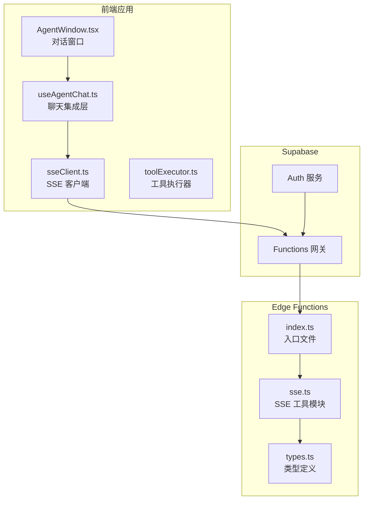

**图表来源**
- [app/src/components/agent/AgentWindow.tsx:1-243](file://app/src/components/agent/AgentWindow.tsx#L1-L243)
- [app/src/hooks/useAgentChat.ts:1-380](file://app/src/hooks/useAgentChat.ts#L1-L380)
- [app/src/lib/agent/sseClient.ts:1-484](file://app/src/lib/agent/sseClient.ts#L1-L484)
- [app/supabase/functions/ai-assistant/index.ts:1-116](file://app/supabase/functions/ai-assistant/index.ts#L1-L116)

**章节来源**
- [app/src/lib/agent/sseClient.ts:1-484](file://app/src/lib/agent/sseClient.ts#L1-L484)
- [app/supabase/functions/ai-assistant/index.ts:1-116](file://app/supabase/functions/ai-assistant/index.ts#L1-L116)

## 核心组件

### SSE 事件类型定义

系统定义了六种核心 SSE 事件类型：

| 事件类型 | 描述 | 数据结构 | 用途 |
|---------|------|----------|------|
| `text_delta` | 文本增量事件 | `{ content: string }` | 实时显示对话内容 |
| `a2ui` | A2UI 界面事件 | `A2UIServerMessage` | 生成交互式界面组件 |
| `tool_call` | 工具调用事件 | `{ id: string, name: string, arguments: object }` | 触发后端工具执行 |
| `thinking` | 思考过程事件 | `{ content: string }` | 显示 AI 的推理过程 |
| `done` | 完成事件 | `{ usage?: { prompt_tokens: number, completion_tokens: number } }` | 标识对话结束 |
| `error` | 错误事件 | `{ message: string, code?: string }` | 错误状态通知 |

### SSE 客户端配置

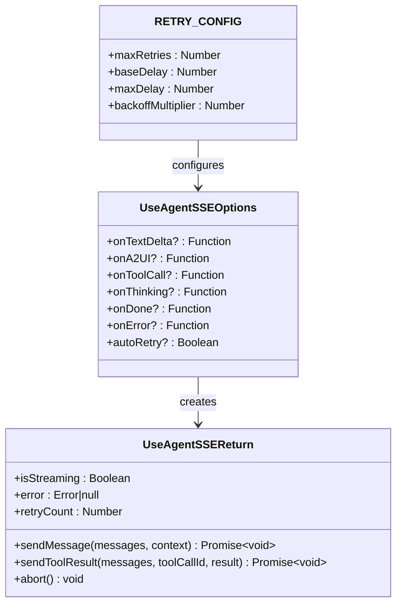

**图表来源**
- [app/src/lib/agent/sseClient.ts:49-82](file://app/src/lib/agent/sseClient.ts#L49-L82)
- [app/src/lib/agent/sseClient.ts:29-34](file://app/src/lib/agent/sseClient.ts#L29-L34)

**章节来源**
- [app/src/types/agent.ts:155-221](file://app/src/types/agent.ts#L155-L221)
- [app/src/lib/agent/sseClient.ts:29-82](file://app/src/lib/agent/sseClient.ts#L29-L82)

## 架构概览

SSE 通信采用客户端-服务器端双向流式架构：

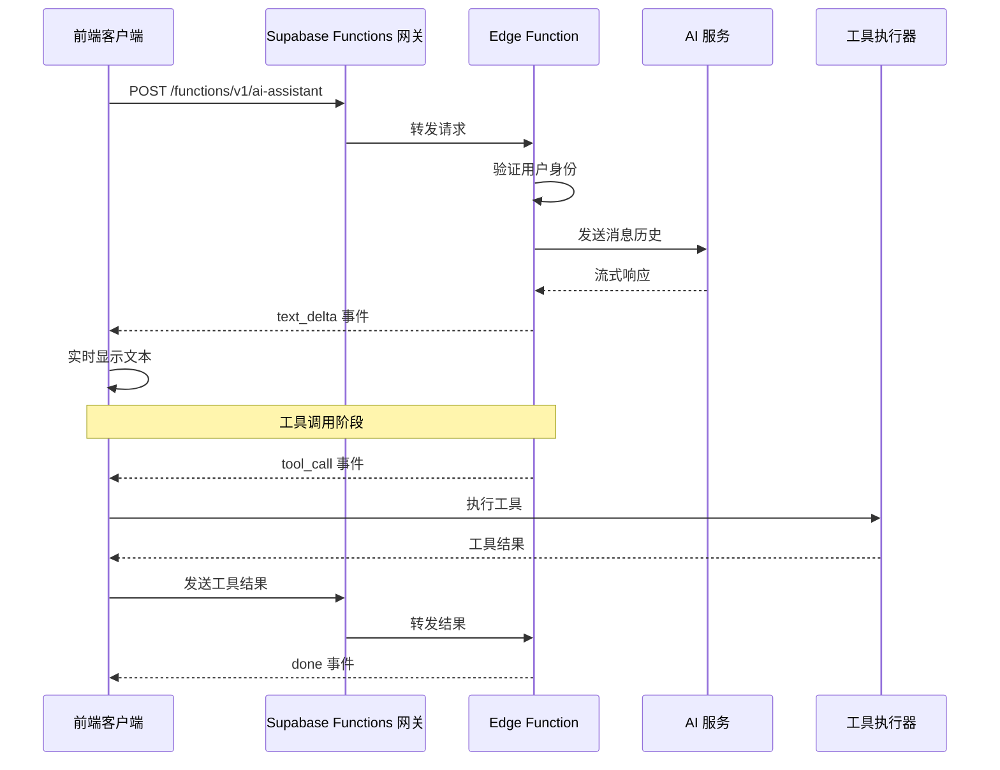

**图表来源**
- [app/src/lib/agent/sseClient.ts:311-410](file://app/src/lib/agent/sseClient.ts#L311-L410)
- [app/supabase/functions/ai-assistant/index.ts:82-98](file://app/supabase/functions/ai-assistant/index.ts#L82-L98)

## 详细组件分析

### 前端 SSE 客户端实现

#### 连接管理机制

前端 SSE 客户端实现了完整的连接生命周期管理：

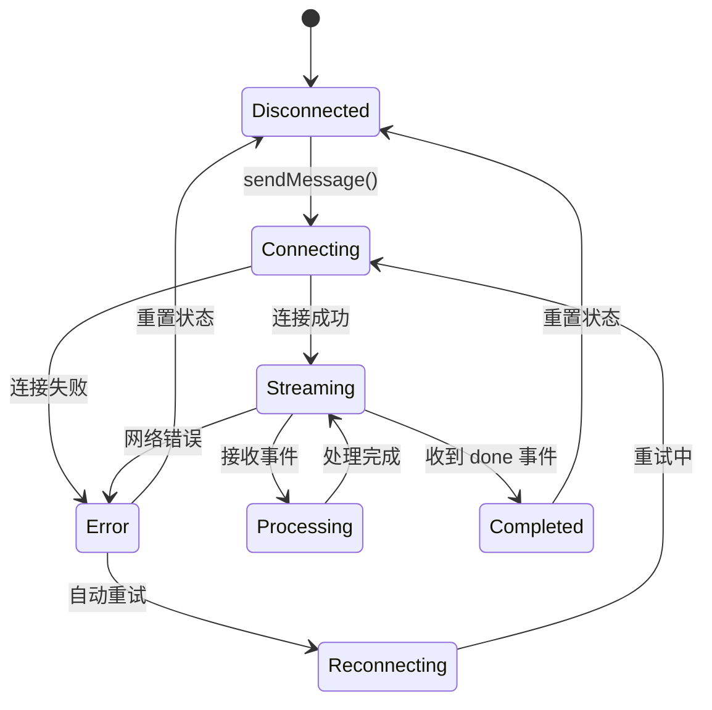

**图表来源**
- [app/src/lib/agent/sseClient.ts:246-481](file://app/src/lib/agent/sseClient.ts#L246-L481)

#### 事件解析器

事件解析器负责将原始 SSE 数据转换为结构化事件对象：

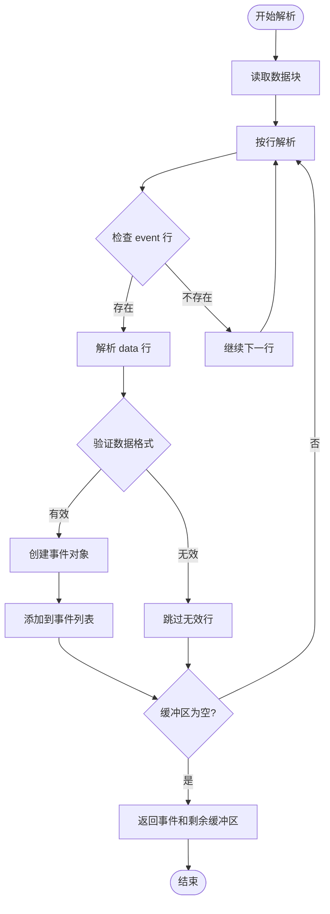

**图表来源**
- [app/src/lib/agent/sseClient.ts:152-198](file://app/src/lib/agent/sseClient.ts#L152-L198)

**章节来源**
- [app/src/lib/agent/sseClient.ts:86-198](file://app/src/lib/agent/sseClient.ts#L86-L198)

### Edge Functions 服务器端实现

#### SSE 写入器

服务器端使用专门的写入器来格式化和发送 SSE 事件：

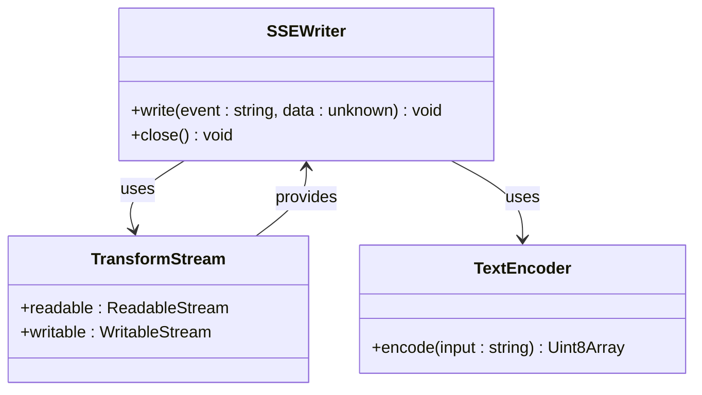

**图表来源**
- [app/supabase/functions/ai-assistant/sse.ts:26-39](file://app/supabase/functions/ai-assistant/sse.ts#L26-L39)

#### CORS 和响应头配置

服务器端设置了完整的 CORS 支持和 SSE 特定的响应头：

| 响应头 | 值 | 作用 |
|--------|-----|------|
| `Content-Type` | `text/event-stream` | 指定 SSE 内容类型 |
| `Cache-Control` | `no-cache` | 禁用缓存 |
| `Connection` | `keep-alive` | 维持长连接 |
| `Access-Control-Allow-Origin` | `*` | 允许跨域访问 |
| `Access-Control-Allow-Headers` | `authorization, x-client-info, apikey, content-type` | 允许的头部字段 |
| `Access-Control-Allow-Methods` | `POST, OPTIONS` | 允许的 HTTP 方法 |

**章节来源**
- [app/supabase/functions/ai-assistant/sse.ts:13-24](file://app/supabase/functions/ai-assistant/sse.ts#L13-L24)
- [app/supabase/functions/ai-assistant/index.ts:22-32](file://app/supabase/functions/ai-assistant/index.ts#L22-L32)

### 工具执行集成

#### 工具调用流程

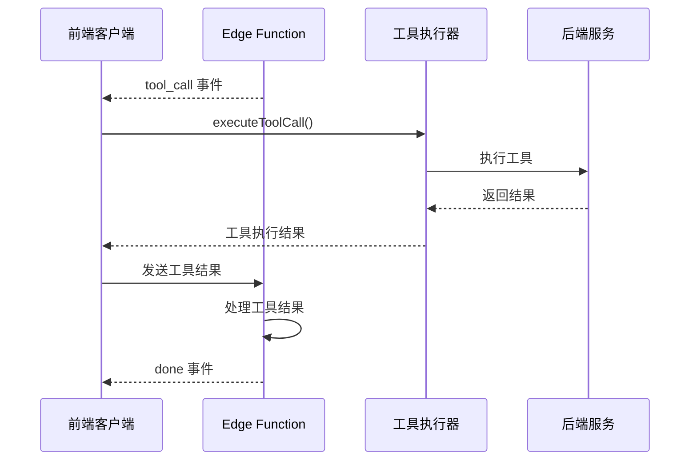

**图表来源**
- [app/src/hooks/useAgentChat.ts:137-219](file://app/src/hooks/useAgentChat.ts#L137-L219)
- [app/src/lib/agent/toolExecutor.ts:40-63](file://app/src/lib/agent/toolExecutor.ts#L40-L63)

**章节来源**
- [app/src/hooks/useAgentChat.ts:137-219](file://app/src/hooks/useAgentChat.ts#L137-L219)
- [app/src/lib/agent/toolExecutor.ts:1-67](file://app/src/lib/agent/toolExecutor.ts#L1-L67)

## 依赖关系分析

### 组件耦合度

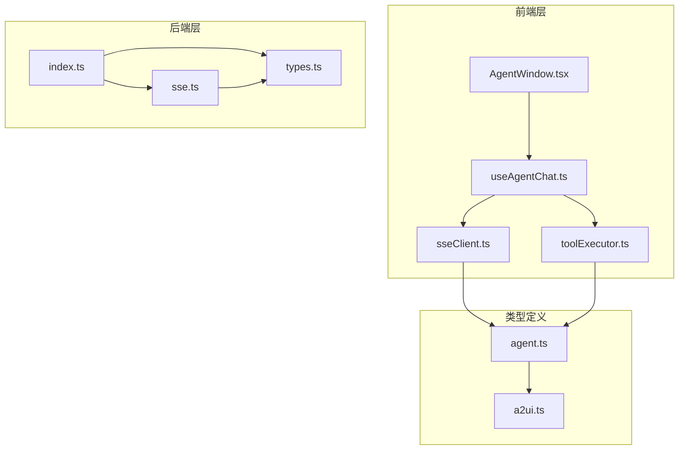

**图表来源**
- [app/src/lib/agent/sseClient.ts:10-22](file://app/src/lib/agent/sseClient.ts#L10-L22)
- [app/src/hooks/useAgentChat.ts:10-15](file://app/src/hooks/useAgentChat.ts#L10-L15)
- [app/supabase/functions/ai-assistant/index.ts:12-20](file://app/supabase/functions/ai-assistant/index.ts#L12-L20)

### 数据流映射

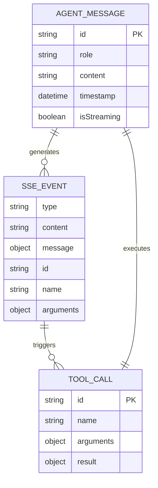

**图表来源**
- [app/src/types/agent.ts:94-115](file://app/src/types/agent.ts#L94-L115)
- [app/src/types/agent.ts:155-221](file://app/src/types/agent.ts#L155-L221)

**章节来源**
- [app/src/types/agent.ts:1-349](file://app/src/types/agent.ts#L1-L349)

## 性能考虑

### 连接优化策略

1. **连接池管理**: 使用 AbortController 管理并发连接，避免资源泄漏
2. **缓冲区优化**: 实现高效的事件缓冲和解析机制
3. **内存管理**: 及时释放不再使用的事件和工具调用数据
4. **网络优化**: 实现指数退避重试机制，避免过度请求

### 错误处理策略

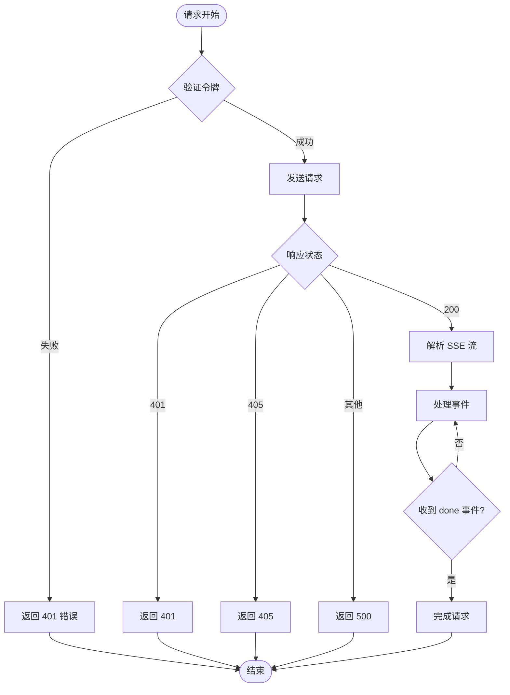

**图表来源**
- [app/supabase/functions/ai-assistant/index.ts:40-62](file://app/supabase/functions/ai-assistant/index.ts#L40-L62)
- [app/supabase/functions/ai-assistant/index.ts:82-98](file://app/supabase/functions/ai-assistant/index.ts#L82-L98)

## 故障排除指南

### 常见问题诊断

#### 连接失败问题

| 问题症状 | 可能原因 | 解决方案 |
|----------|----------|----------|
| 401 未授权 | 缺少或过期的访问令牌 | 检查 Supabase 认证状态 |
| 405 方法不允许 | 使用了错误的 HTTP 方法 | 确保使用 POST 请求 |
| 500 服务器错误 | Edge Function 配置错误 | 检查环境变量设置 |
| 连接超时 | 网络不稳定 | 实现自动重试机制 |

#### 事件处理问题

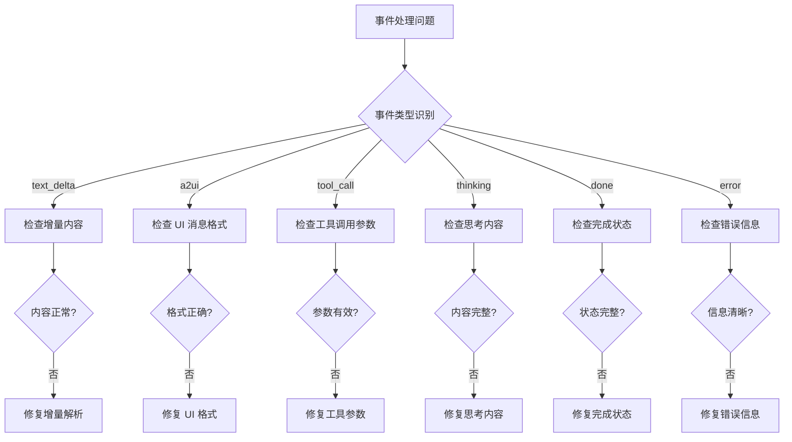

**图表来源**
- [app/src/lib/agent/sseClient.ts:92-144](file://app/src/lib/agent/sseClient.ts#L92-L144)

**章节来源**
- [app/src/lib/agent/sseClient.ts:205-237](file://app/src/lib/agent/sseClient.ts#L205-L237)
- [app/src/lib/agent/__tests__/sseClient.test.ts:314-355](file://app/src/lib/agent/__tests__/sseClient.test.ts#L314-L355)

### 调试技巧

1. **启用详细日志**: 在开发环境中启用详细的控制台日志
2. **事件监控**: 监控不同事件类型的触发频率和数据量
3. **性能分析**: 使用浏览器开发者工具分析网络请求和内存使用
4. **错误追踪**: 实现全局错误处理器捕获未处理的异常

## 结论

OPC-Starter 的 SSE 流式通信机制通过精心设计的前后端架构，实现了高效、可靠的实时对话体验。该机制具有以下特点：

1. **完整的事件支持**: 支持文本增量、A2UI 界面、工具调用、思考过程等多种事件类型
2. **健壮的错误处理**: 实现了完善的连接管理和错误恢复机制
3. **灵活的扩展性**: 通过工具执行器支持自定义业务逻辑
4. **优秀的用户体验**: 提供流畅的实时交互和及时的状态反馈

该实现为类似的应用场景提供了良好的参考模板，展示了如何在现代 Web 应用中有效利用 SSE 技术构建实时通信功能。