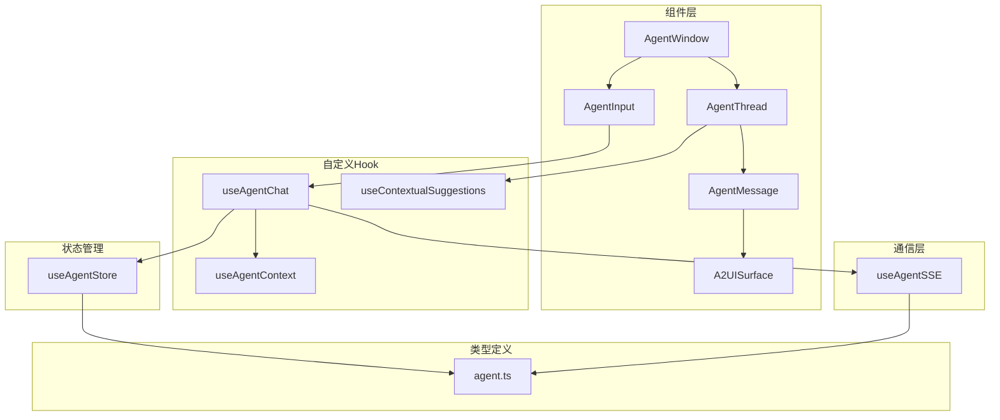
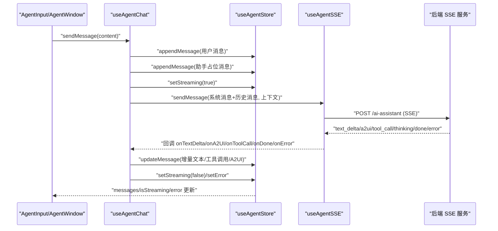
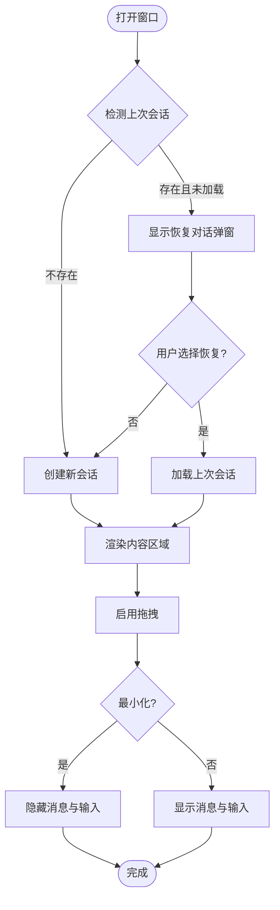
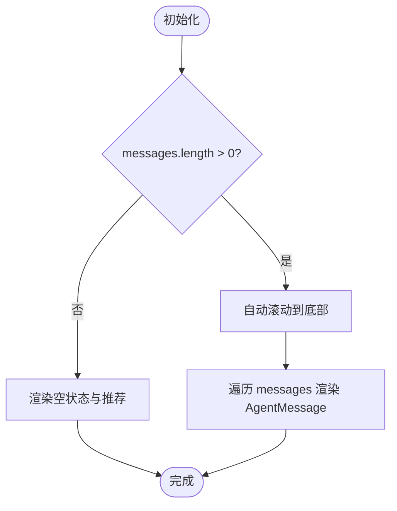
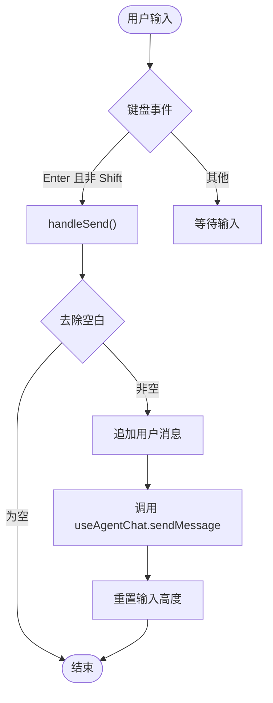
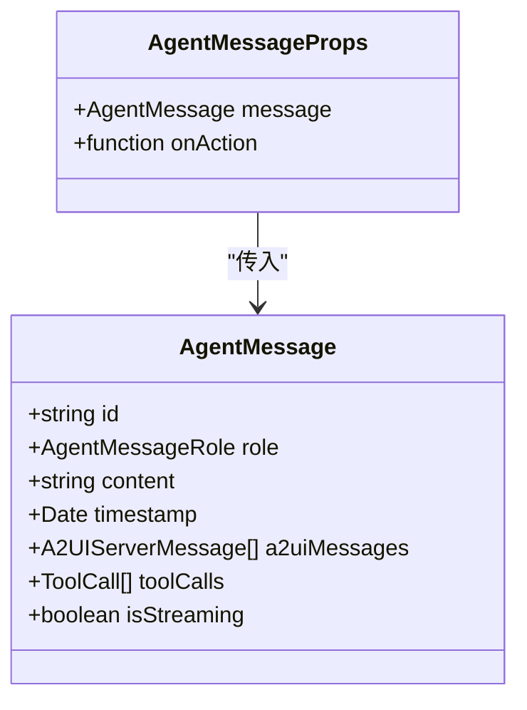
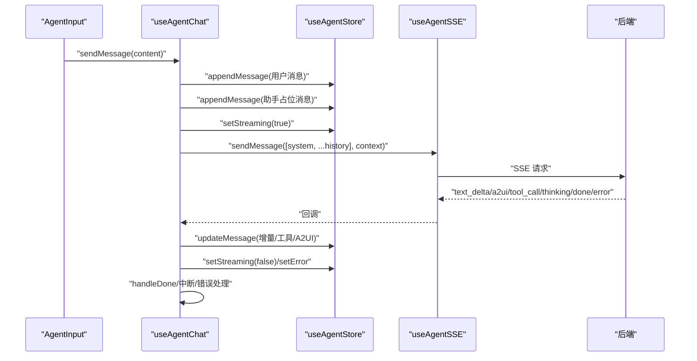
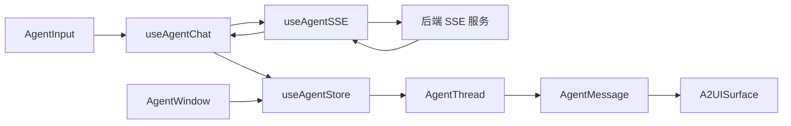
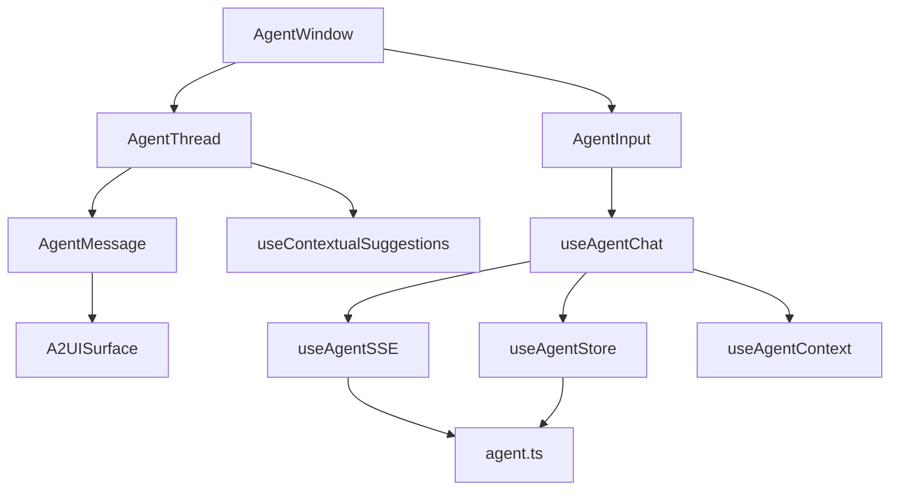

# 前端 Agent 组件层

<cite>
**本文引用的文件**
- [AgentWindow.tsx](file://app/src/components/agent/AgentWindow.tsx)
- [AgentThread.tsx](file://app/src/components/agent/AgentThread.tsx)
- [AgentInput.tsx](file://app/src/components/agent/AgentInput.tsx)
- [AgentMessage.tsx](file://app/src/components/agent/AgentMessage.tsx)
- [useAgentChat.ts](file://app/src/hooks/useAgentChat.ts)
- [useAgentStore.ts](file://app/src/stores/useAgentStore.ts)
- [agent.ts](file://app/src/types/agent.ts)
- [sseClient.ts](file://app/src/lib/agent/sseClient.ts)
- [useAgentContext.ts](file://app/src/hooks/useAgentContext.ts)
- [A2UISurface.tsx](file://app/src/components/agent/a2ui/A2UISurface.tsx)
- [useContextualSuggestions.ts](file://app/src/hooks/useContextualSuggestions.ts)
</cite>

## 目录
1. [简介](#简介)
2. [项目结构](#项目结构)
3. [核心组件](#核心组件)
4. [架构总览](#架构总览)
5. [组件详细分析](#组件详细分析)
6. [依赖关系分析](#依赖关系分析)
7. [性能考量](#性能考量)
8. [故障排查指南](#故障排查指南)
9. [结论](#结论)
10. [附录](#附录)

## 简介
本文件面向 OPC-Starter 前端 Agent 组件层，聚焦以下关键组件与能力：
- AgentWindow 悬浮对话框：窗口管理、拖拽、最小化、恢复对话、清空对话等
- AgentThread 对话历史：消息列表渲染、自动滚动、空状态与上下文感知推荐
- AgentInput 输入组件：文本输入、快捷键、上下文提示、发送/中断控制
- AgentMessage 消息渲染：角色区分、富文本、A2UI Surface 渲染、工具调用、时间戳
- useAgentChat 自定义 Hook：状态管理、SSE 流式通信、工具执行、中断与重试、消息历史构建
- 组件间通信与数据流：从 UI 到 Hook、Store、SSE、后端再到 Store 的完整链路

## 项目结构
Agent 组件位于 app/src/components/agent 下，配合 hooks、stores、types、lib 等模块协同工作。核心文件如下：
- 组件层：AgentWindow、AgentThread、AgentInput、AgentMessage、A2UISurface
- 自定义 Hook：useAgentChat、useAgentContext、useContextualSuggestions
- 状态管理：useAgentStore（Zustand + persist）
- 类型定义：agent.ts（消息、上下文、工具、SSE 事件等）
- 通信层：sseClient.ts（SSE 客户端封装）

图表来源
- [AgentWindow.tsx:36-242](file://app/src/components/agent/AgentWindow.tsx#L36-L242)
- [AgentThread.tsx:19-55](file://app/src/components/agent/AgentThread.tsx#L19-L55)
- [AgentInput.tsx:34-211](file://app/src/components/agent/AgentInput.tsx#L34-L211)
- [AgentMessage.tsx:24-148](file://app/src/components/agent/AgentMessage.tsx#L24-L148)
- [useAgentChat.ts:47-377](file://app/src/hooks/useAgentChat.ts#L47-L377)
- [useAgentStore.ts:60-343](file://app/src/stores/useAgentStore.ts#L60-L343)
- [agent.ts:88-306](file://app/src/types/agent.ts#L88-L306)
- [sseClient.ts:246-481](file://app/src/lib/agent/sseClient.ts#L246-L481)
- [useAgentContext.ts:37-54](file://app/src/hooks/useAgentContext.ts#L37-L54)
- [useContextualSuggestions.ts:44-66](file://app/src/hooks/useContextualSuggestions.ts#L44-L66)

章节来源
- [AgentWindow.tsx:1-243](file://app/src/components/agent/AgentWindow.tsx#L1-L243)
- [AgentThread.tsx:1-183](file://app/src/components/agent/AgentThread.tsx#L1-L183)
- [AgentInput.tsx:1-211](file://app/src/components/agent/AgentInput.tsx#L1-L211)
- [AgentMessage.tsx:1-177](file://app/src/components/agent/AgentMessage.tsx#L1-L177)
- [useAgentChat.ts:1-380](file://app/src/hooks/useAgentChat.ts#L1-L380)
- [useAgentStore.ts:1-482](file://app/src/stores/useAgentStore.ts#L1-L482)
- [agent.ts:1-349](file://app/src/types/agent.ts#L1-L349)
- [sseClient.ts:1-484](file://app/src/lib/agent/sseClient.ts#L1-L484)
- [useAgentContext.ts:1-89](file://app/src/hooks/useAgentContext.ts#L1-L89)
- [A2UISurface.tsx:1-112](file://app/src/components/agent/a2ui/A2UISurface.tsx#L1-L112)
- [useContextualSuggestions.ts:1-67](file://app/src/hooks/useContextualSuggestions.ts#L1-L67)

## 核心组件
- AgentWindow：悬浮对话框容器，负责窗口尺寸、拖拽、最小化、恢复对话、清空对话、标题栏按钮等
- AgentThread：对话历史渲染，自动滚动至底部，空状态显示上下文感知推荐
- AgentInput：输入框，支持 Enter 发送、Shift+Enter 换行、上下文提示、发送/中断控制
- AgentMessage：消息气泡渲染，支持用户/助手/系统消息、A2UI Surface、工具调用、时间戳
- useAgentChat：核心 Hook，整合 SSE、工具执行、状态管理、中断与重试、消息历史构建
- useAgentStore：Zustand Store，管理会话、消息、Surface、Portal、上下文、UI 状态
- 类型系统：agent.ts 定义消息、上下文、工具、SSE 事件等类型
- SSE 客户端：sseClient.ts 封装 SSE 连接、事件解析、重试、中断

章节来源
- [AgentWindow.tsx:36-242](file://app/src/components/agent/AgentWindow.tsx#L36-L242)
- [AgentThread.tsx:19-55](file://app/src/components/agent/AgentThread.tsx#L19-L55)
- [AgentInput.tsx:34-211](file://app/src/components/agent/AgentInput.tsx#L34-L211)
- [AgentMessage.tsx:24-148](file://app/src/components/agent/AgentMessage.tsx#L24-L148)
- [useAgentChat.ts:47-377](file://app/src/hooks/useAgentChat.ts#L47-L377)
- [useAgentStore.ts:60-343](file://app/src/stores/useAgentStore.ts#L60-L343)
- [agent.ts:88-306](file://app/src/types/agent.ts#L88-L306)
- [sseClient.ts:246-481](file://app/src/lib/agent/sseClient.ts#L246-L481)

## 架构总览
Agent 组件层采用“组件 + Hook + Store + 类型 + 通信”的分层设计：
- 组件层负责 UI 与交互
- Hook 层负责业务逻辑与状态协调
- Store 层负责全局状态持久化与共享
- 类型层确保数据结构一致性
- 通信层负责与后端 SSE 服务交互

图表来源
- [useAgentChat.ts:299-367](file://app/src/hooks/useAgentChat.ts#L299-L367)
- [useAgentStore.ts:148-164](file://app/src/stores/useAgentStore.ts#L148-L164)
- [sseClient.ts:369-410](file://app/src/lib/agent/sseClient.ts#L369-L410)
- [agent.ts:150-221](file://app/src/types/agent.ts#L150-L221)

## 组件详细分析

### AgentWindow 悬浮对话框
- 窗口尺寸与初始定位：根据屏幕尺寸计算右下角初始位置，并监听窗口大小变化动态调整
- 拖拽功能：基于 react-draggable，限制在父容器内拖拽，拖拽过程中实时更新位置
- 最小化/展开：切换窗口高度宽度，最小化时隐藏消息列表与输入框
- 恢复对话：首次打开时检测上次会话 ID，弹出恢复对话确认框；支持新建对话
- 清空对话：确认后清空当前会话并创建新会话
- 标题栏按钮：清空对话、最小化/展开、关闭
- 内容区域：最小化状态下不渲染；展开时渲染 AgentThread 与 AgentInput

图表来源
- [AgentWindow.tsx:71-124](file://app/src/components/agent/AgentWindow.tsx#L71-L124)

章节来源
- [AgentWindow.tsx:36-242](file://app/src/components/agent/AgentWindow.tsx#L36-L242)

### AgentThread 对话历史
- 自动滚动：每次消息变化或流式输出时，滚动到底部
- 空状态：无消息时渲染上下文感知推荐，包含当前页面、选中照片数量、空状态提示
- 推荐按钮：点击后通过 useAgentChat.sendMessage 发送建议内容，支持导航提示
- 消息渲染：遍历 messages，每个消息交由 AgentMessage 渲染

图表来源
- [AgentThread.tsx:27-55](file://app/src/components/agent/AgentThread.tsx#L27-L55)

章节来源
- [AgentThread.tsx:19-183](file://app/src/components/agent/AgentThread.tsx#L19-L183)

### AgentInput 输入组件
- 文本输入：受控组件，自动高度调整，最大高度限制
- 快捷键：Enter 发送（Shift+Enter 换行），防止默认行为
- 上下文提示：显示已选照片数量
- 推荐提示词：预留扩展点（当前为空数组）
- 发送/中断：根据 isStreaming 控制按钮状态；发送时清空输入并重置高度；中断调用 abort
- 状态提示：显示错误与重试次数

图表来源
- [AgentInput.tsx:69-98](file://app/src/components/agent/AgentInput.tsx#L69-L98)

章节来源
- [AgentInput.tsx:34-211](file://app/src/components/agent/AgentInput.tsx#L34-L211)

### AgentMessage 消息渲染
- 角色区分：用户、助手、系统（错误）、工具
- 头像与样式：根据角色设置背景色与图标
- 文本内容：支持流式输出光标动画；无内容时显示“思考中”
- A2UI Surface：仅渲染 beginRendering 且包含有效 component 的消息
- 工具调用：展示工具名称与执行结果状态
- 时间戳：当天仅显示时间，跨日显示日期与时间

图表来源
- [AgentMessage.tsx:14-20](file://app/src/components/agent/AgentMessage.tsx#L14-L20)
- [agent.ts:88-105](file://app/src/types/agent.ts#L88-L105)

章节来源
- [AgentMessage.tsx:24-177](file://app/src/components/agent/AgentMessage.tsx#L24-L177)
- [agent.ts:88-105](file://app/src/types/agent.ts#L88-L105)

### useAgentChat 自定义 Hook
- 状态管理：isStreaming、isAborted、error、retryCount；通过 useAgentStore 管理
- 会话管理：createThread、appendMessage、updateMessage、setStreaming、setError
- 上下文：useAgentContext 生成上下文摘要，作为系统消息加入消息历史
- SSE 集成：useAgentSSE 提供 sendMessage/sendToolResult、isStreaming、abort、error、retryCount
- 流式处理：handleTextDelta 累积文本增量；handleA2UI 累积 A2UI 消息并更新 Store；handleToolCall 累积工具调用
- 完成与错误：handleDone 标记完成、执行工具调用并更新结果；handleError 标记完成并设置错误
- 中断：abort 创建 AbortController，调用 SSE abort 并触发中断处理
- 消息历史：构建系统消息（上下文摘要）+ 历史消息，发送给 SSE

图表来源
- [useAgentChat.ts:299-367](file://app/src/hooks/useAgentChat.ts#L299-L367)
- [useAgentStore.ts:148-164](file://app/src/stores/useAgentStore.ts#L148-L164)
- [sseClient.ts:369-410](file://app/src/lib/agent/sseClient.ts#L369-L410)

章节来源
- [useAgentChat.ts:47-377](file://app/src/hooks/useAgentChat.ts#L47-L377)

### 组件间通信与数据流
- AgentInput -> useAgentChat.sendMessage -> useAgentSSE.sendMessage -> 后端 SSE
- useAgentSSE 回调 -> useAgentChat 处理 -> useAgentStore.updateMessage -> AgentThread/AgentMessage 渲染
- AgentMessage -> A2UISurface 渲染 -> 用户操作回调 -> useAgentStore.handleUserAction -> 通知消息
- AgentWindow -> useAgentStore.create/load/clearThread -> 会话状态

图表来源
- [AgentInput.tsx:34-211](file://app/src/components/agent/AgentInput.tsx#L34-L211)
- [useAgentChat.ts:299-367](file://app/src/hooks/useAgentChat.ts#L299-L367)
- [useAgentStore.ts:148-164](file://app/src/stores/useAgentStore.ts#L148-L164)
- [AgentThread.tsx:19-55](file://app/src/components/agent/AgentThread.tsx#L19-L55)
- [AgentMessage.tsx:24-148](file://app/src/components/agent/AgentMessage.tsx#L24-L148)
- [A2UISurface.tsx:30-81](file://app/src/components/agent/a2ui/A2UISurface.tsx#L30-L81)
- [AgentWindow.tsx:36-124](file://app/src/components/agent/AgentWindow.tsx#L36-L124)

## 依赖关系分析
- 组件依赖：AgentWindow 依赖 AgentThread、AgentInput；AgentThread 依赖 AgentMessage；AgentMessage 依赖 A2UISurface
- Hook 依赖：useAgentChat 依赖 useAgentSSE、useAgentStore、useAgentContext；AgentThread 依赖 useContextualSuggestions
- Store 依赖：useAgentStore 依赖 agent.ts 类型；useAgentStore.useA2UIMessageHandler 处理 A2UI 消息
- 通信依赖：useAgentSSE 依赖 supabase 会话令牌与后端函数网关

图表来源
- [AgentWindow.tsx:13-16](file://app/src/components/agent/AgentWindow.tsx#L13-L16)
- [AgentThread.tsx:8-14](file://app/src/components/agent/AgentThread.tsx#L8-L14)
- [AgentInput.tsx:8-14](file://app/src/components/agent/AgentInput.tsx#L8-L14)
- [AgentMessage.tsx:8-12](file://app/src/components/agent/AgentMessage.tsx#L8-L12)
- [useAgentChat.ts:8-14](file://app/src/hooks/useAgentChat.ts#L8-L14)
- [useAgentStore.ts:8-24](file://app/src/stores/useAgentStore.ts#L8-L24)
- [agent.ts:7-22](file://app/src/types/agent.ts#L7-L22)
- [sseClient.ts:8-22](file://app/src/lib/agent/sseClient.ts#L8-L22)

章节来源
- [AgentWindow.tsx:1-243](file://app/src/components/agent/AgentWindow.tsx#L1-L243)
- [AgentThread.tsx:1-183](file://app/src/components/agent/AgentThread.tsx#L1-L183)
- [AgentInput.tsx:1-211](file://app/src/components/agent/AgentInput.tsx#L1-L211)
- [AgentMessage.tsx:1-177](file://app/src/components/agent/AgentMessage.tsx#L1-L177)
- [useAgentChat.ts:1-380](file://app/src/hooks/useAgentChat.ts#L1-L380)
- [useAgentStore.ts:1-482](file://app/src/stores/useAgentStore.ts#L1-L482)
- [agent.ts:1-349](file://app/src/types/agent.ts#L1-L349)
- [sseClient.ts:1-484](file://app/src/lib/agent/sseClient.ts#L1-L484)

## 性能考量
- 消息渲染优化：AgentThread 使用 ref 滚动到底部，避免不必要的重渲染
- 输入框自适应高度：仅在输入变化时调整，限制最大高度减少布局抖动
- Store 状态粒度：useAgentStore 将 isStreaming、error 等状态与消息分离，降低渲染范围
- SSE 重试策略：指数退避与最大重试次数，避免频繁失败导致 UI 卡顿
- A2UI 渲染安全：A2UISurface 对 component 做防御性检查，避免空组件导致异常

## 故障排查指南
- 无法发送消息
  - 检查 isStreaming 状态，确保未处于流式输出
  - 查看 error 与 retryCount，确认是否为网络或后端错误
  - 确认 useAgentContext 同步是否正常
- 流式输出卡住
  - 查看 useAgentSSE 的 isStreaming 与 error
  - 检查 SSE 事件解析与回调链路
- A2UI 组件不显示
  - 确认 A2UI 消息类型为 beginRendering 且包含有效 component
  - 检查 useAgentStore.useA2UIMessageHandler 的路由逻辑（inline/main-area/fullscreen/split）
- 中断无效
  - 确认 AbortController 是否正确创建与调用 abort
  - 检查 handleInterrupted 是否被触发

章节来源
- [useAgentChat.ts:242-259](file://app/src/hooks/useAgentChat.ts#L242-L259)
- [useAgentStore.ts:358-459](file://app/src/stores/useAgentStore.ts#L358-L459)
- [sseClient.ts:468-471](file://app/src/lib/agent/sseClient.ts#L468-L471)

## 结论
Agent 组件层通过清晰的分层设计与完善的类型系统，实现了从 UI 到后端的完整对话链路。AgentWindow 提供友好的交互体验，AgentThread 与 AgentMessage 确保消息渲染的准确性与可读性，AgentInput 提升输入效率，useAgentChat 作为中枢协调 Store、SSE 与工具执行，形成稳定可靠的对话系统。

## 附录
- 类型参考：agent.ts 中定义了 AgentMessage、AgentContext、ToolCall、SSE 事件等核心类型
- 上下文生成：generateContextSummary 将页面信息汇总为系统消息，指导 AI 行为
- A2UI Surface：A2UISurface 安全渲染组件树，支持用户操作回调

章节来源
- [agent.ts:88-306](file://app/src/types/agent.ts#L88-L306)
- [useAgentContext.ts:73-89](file://app/src/hooks/useAgentContext.ts#L73-L89)
- [A2UISurface.tsx:30-81](file://app/src/components/agent/a2ui/A2UISurface.tsx#L30-L81)