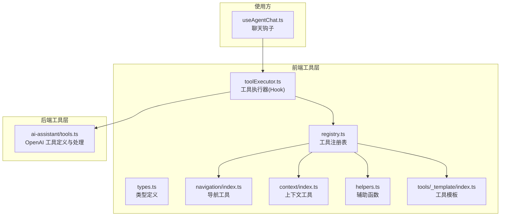
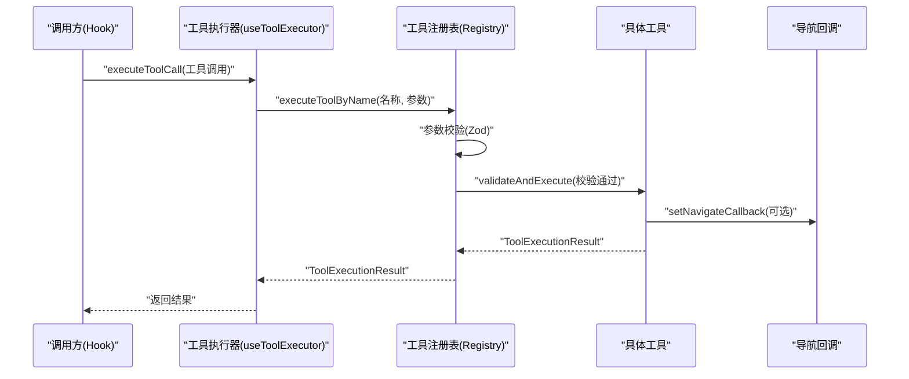
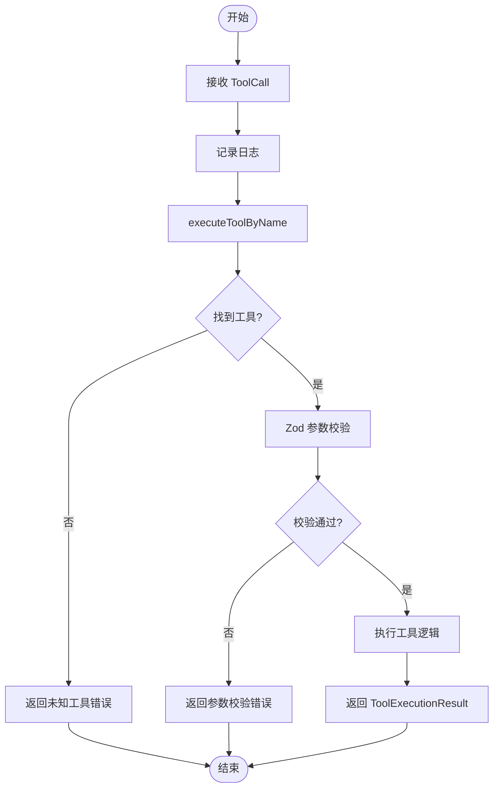
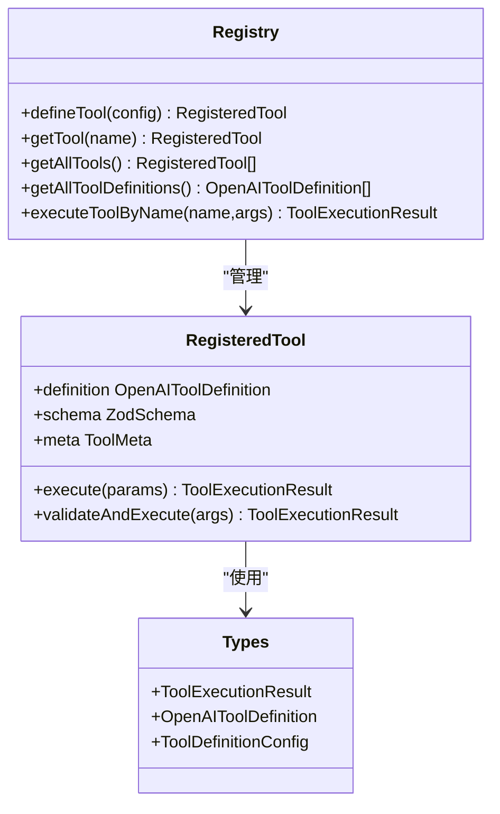
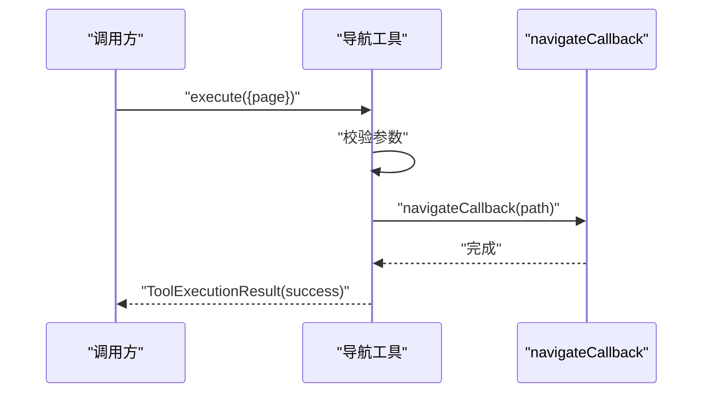
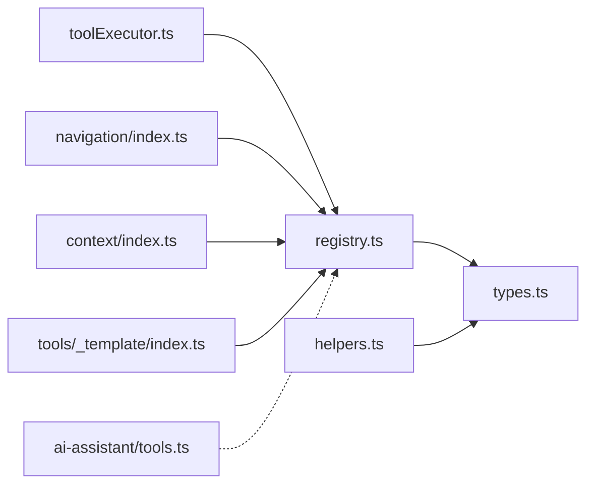

# 工具执行系统

<cite>
**本文引用的文件**
- [app/src/lib/agent/toolExecutor.ts](file://app/src/lib/agent/toolExecutor.ts)
- [app/src/lib/agent/__tests__/toolExecutor.test.ts](file://app/src/lib/agent/__tests__/toolExecutor.test.ts)
- [app/supabase/functions/ai-assistant/tools.ts](file://app/supabase/functions/ai-assistant/tools.ts)
- [app/src/lib/agent/tools/index.ts](file://app/src/lib/agent/tools/index.ts)
- [app/src/lib/agent/tools/registry.ts](file://app/src/lib/agent/tools/registry.ts)
- [app/src/lib/agent/tools/types.ts](file://app/src/lib/agent/tools/types.ts)
- [app/src/lib/agent/tools/navigation/index.ts](file://app/src/lib/agent/tools/navigation/index.ts)
- [app/src/lib/agent/tools/context/index.ts](file://app/src/lib/agent/tools/context/index.ts)
- [app/src/lib/agent/tools/helpers.ts](file://app/src/lib/agent/tools/helpers.ts)
- [app/src/lib/agent/tools/_template/index.ts](file://app/src/lib/agent/tools/_template/index.ts)
- [app/src/hooks/useAgentChat.ts](file://app/src/hooks/useAgentChat.ts)
</cite>

## 目录
1. [简介](#简介)
2. [项目结构](#项目结构)
3. [核心组件](#核心组件)
4. [架构总览](#架构总览)
5. [详细组件分析](#详细组件分析)
6. [依赖关系分析](#依赖关系分析)
7. [性能考量](#性能考量)
8. [故障排查指南](#故障排查指南)
9. [结论](#结论)
10. [附录](#附录)

## 简介
本文件系统性阐述 OPC-Starter 的工具执行系统，重点覆盖以下方面：
- 工具链执行架构的设计理念：工具注册、参数传递、执行顺序控制、结果聚合
- Tool Executor 工具执行器的核心能力：工具调用调度、并发控制、错误捕获、超时处理
- 工具注册表的实现：工具定义规范、参数验证、类型安全
- 工具执行流程：工具发现、参数解析、执行调用、结果处理
- 工具间依赖关系管理：前置条件检查、依赖注入、执行顺序优化
- 工具开发指南与最佳实践

该系统采用“注册表 + Hook 调度”的分层设计，前端工具通过统一注册表集中管理，并由工具执行器进行调用与结果聚合；同时保留与后端 AI 助手工具定义（OpenAI Function Calling）的兼容性。

## 项目结构
围绕工具执行系统的关键文件分布如下：
- 前端工具执行器与导出入口：app/src/lib/agent/toolExecutor.ts、app/src/lib/agent/tools/index.ts
- 工具注册表与类型定义：app/src/lib/agent/tools/registry.ts、app/src/lib/agent/tools/types.ts
- 具体工具实现：app/src/lib/agent/tools/navigation/index.ts、app/src/lib/agent/tools/context/index.ts、app/src/lib/agent/tools/helpers.ts、app/src/lib/agent/tools/_template/index.ts
- 后端 AI 助手工具定义：app/supabase/functions/ai-assistant/tools.ts
- 使用示例与集成点：app/src/hooks/useAgentChat.ts
- 单元测试：app/src/lib/agent/__tests__/toolExecutor.test.ts

**图表来源**
- [app/src/lib/agent/toolExecutor.ts:1-67](file://app/src/lib/agent/toolExecutor.ts#L1-L67)
- [app/src/lib/agent/tools/index.ts:1-11](file://app/src/lib/agent/tools/index.ts#L1-L11)
- [app/src/lib/agent/tools/registry.ts:1-82](file://app/src/lib/agent/tools/registry.ts#L1-L82)
- [app/src/lib/agent/tools/types.ts:1-44](file://app/src/lib/agent/tools/types.ts#L1-L44)
- [app/src/lib/agent/tools/navigation/index.ts:1-71](file://app/src/lib/agent/tools/navigation/index.ts#L1-L71)
- [app/src/lib/agent/tools/context/index.ts:1-6](file://app/src/lib/agent/tools/context/index.ts#L1-L6)
- [app/src/lib/agent/tools/helpers.ts:1-49](file://app/src/lib/agent/tools/helpers.ts#L1-L49)
- [app/src/lib/agent/tools/_template/index.ts:1-31](file://app/src/lib/agent/tools/_template/index.ts#L1-L31)
- [app/supabase/functions/ai-assistant/tools.ts:1-191](file://app/supabase/functions/ai-assistant/tools.ts#L1-L191)
- [app/src/hooks/useAgentChat.ts:10,82](file://app/src/hooks/useAgentChat.ts#L10,L82)

**章节来源**
- [app/src/lib/agent/toolExecutor.ts:1-67](file://app/src/lib/agent/toolExecutor.ts#L1-L67)
- [app/src/lib/agent/tools/index.ts:1-11](file://app/src/lib/agent/tools/index.ts#L1-L11)
- [app/src/lib/agent/tools/registry.ts:1-82](file://app/src/lib/agent/tools/registry.ts#L1-L82)
- [app/src/lib/agent/tools/types.ts:1-44](file://app/src/lib/agent/tools/types.ts#L1-L44)
- [app/src/lib/agent/tools/navigation/index.ts:1-71](file://app/src/lib/agent/tools/navigation/index.ts#L1-L71)
- [app/src/lib/agent/tools/context/index.ts:1-6](file://app/src/lib/agent/tools/context/index.ts#L1-L6)
- [app/src/lib/agent/tools/helpers.ts:1-49](file://app/src/lib/agent/tools/helpers.ts#L1-L49)
- [app/src/lib/agent/tools/_template/index.ts:1-31](file://app/src/lib/agent/tools/_template/index.ts#L1-L31)
- [app/supabase/functions/ai-assistant/tools.ts:1-191](file://app/supabase/functions/ai-assistant/tools.ts#L1-L191)
- [app/src/hooks/useAgentChat.ts:10,82](file://app/src/hooks/useAgentChat.ts#L10,L82)

## 核心组件
- 工具执行器（useToolExecutor）
  - 提供单次与批量工具调用接口，负责日志记录与结果聚合
  - 将工具调用委托给工具注册表，实现解耦与统一入口
- 工具注册表（defineTool/getTool/getAllTools/executeToolByName）
  - 以 Zod Schema 进行参数校验，生成 OpenAI 兼容的函数定义
  - 通过 Map 存储工具，按名称检索与执行
- 工具类型体系（ToolExecutionResult/OpenAI 工具定义/RegisteredTool）
  - 规范工具返回值结构，统一错误与成功路径
  - 支持 UI 组件返回，便于前端 A2UI 渲染
- 具体工具实现
  - 导航工具：基于回调进行页面跳转
  - 上下文工具：提供当前应用上下文信息
  - 辅助函数：封装成功/失败/UI 结果构造
  - 工具模板：新工具开发的参考骨架

**章节来源**
- [app/src/lib/agent/toolExecutor.ts:15-64](file://app/src/lib/agent/toolExecutor.ts#L15-L64)
- [app/src/lib/agent/tools/registry.ts:14-82](file://app/src/lib/agent/tools/registry.ts#L14-L82)
- [app/src/lib/agent/tools/types.ts:7-44](file://app/src/lib/agent/tools/types.ts#L7-L44)
- [app/src/lib/agent/tools/navigation/index.ts:9-71](file://app/src/lib/agent/tools/navigation/index.ts#L9-L71)
- [app/src/lib/agent/tools/context/index.ts:1-6](file://app/src/lib/agent/tools/context/index.ts#L1-L6)
- [app/src/lib/agent/tools/helpers.ts:8-49](file://app/src/lib/agent/tools/helpers.ts#L8-L49)
- [app/src/lib/agent/tools/_template/index.ts:1-31](file://app/src/lib/agent/tools/_template/index.ts#L1-L31)

## 架构总览
工具执行系统采用“注册表 + Hook 调度 + 类型安全 + OpenAI 兼容”的架构设计：
- 注册表负责工具的声明、校验与执行包装
- 工具执行器通过 Hook 暴露统一调用接口，支持批量执行与结果映射
- 工具返回值统一为 ToolExecutionResult，支持 UI 组件返回
- 与后端 AI 助手工具定义保持一致的函数调用格式，便于跨端协作

**图表来源**
- [app/src/lib/agent/toolExecutor.ts:39-63](file://app/src/lib/agent/toolExecutor.ts#L39-L63)
- [app/src/lib/agent/tools/registry.ts:34-78](file://app/src/lib/agent/tools/registry.ts#L34-L78)
- [app/src/lib/agent/tools/navigation/index.ts:13-71](file://app/src/lib/agent/tools/navigation/index.ts#L13-L71)

## 详细组件分析

### 工具执行器（useToolExecutor）
- 职责
  - 单次工具调用：记录日志并委托注册表执行
  - 批量工具调用：顺序执行并聚合为 Map，键为调用 ID
  - 可用工具列表：从注册表提取工具元数据（名称、描述、分类）
- 并发控制
  - 当前实现为串行顺序执行，保证确定性与一致性
  - 如需并发，可在批量执行中引入 Promise.all 或受限并发策略
- 错误捕获
  - 未知工具与参数校验失败均返回标准化错误
- 超时处理
  - 当前未内置超时机制，建议在具体工具实现中增加超时控制或在调用侧包裹超时逻辑

**图表来源**
- [app/src/lib/agent/toolExecutor.ts:40-63](file://app/src/lib/agent/toolExecutor.ts#L40-L63)
- [app/src/lib/agent/tools/registry.ts:34-78](file://app/src/lib/agent/tools/registry.ts#L34-L78)

**章节来源**
- [app/src/lib/agent/toolExecutor.ts:39-64](file://app/src/lib/agent/toolExecutor.ts#L39-L64)
- [app/src/lib/agent/__tests__/toolExecutor.test.ts:18-84](file://app/src/lib/agent/__tests__/toolExecutor.test.ts#L18-L84)

### 工具注册表（defineTool/executeToolByName）
- 工具定义规范
  - 必填字段：名称、描述、分类、参数 Schema、执行函数
  - 参数 Schema 使用 Zod，自动转换为 OpenAI JSON Schema
- 参数验证与类型安全
  - validateAndExecute 在执行前进行严格参数校验，失败即返回错误
  - 返回值统一为 ToolExecutionResult，确保上层处理一致性
- 工具查询与导出
  - getTool：按名称获取工具
  - getAllTools/getAllToolDefinitions：批量导出工具清单
  - executeToolByName：按名称执行工具（含未知工具兜底）

**图表来源**
- [app/src/lib/agent/tools/registry.ts:14-82](file://app/src/lib/agent/tools/registry.ts#L14-L82)
- [app/src/lib/agent/tools/types.ts:7-44](file://app/src/lib/agent/tools/types.ts#L7-L44)

**章节来源**
- [app/src/lib/agent/tools/registry.ts:14-82](file://app/src/lib/agent/tools/registry.ts#L14-L82)
- [app/src/lib/agent/tools/types.ts:7-44](file://app/src/lib/agent/tools/types.ts#L7-L44)
- [app/src/lib/agent/tools/_template/index.ts:8-31](file://app/src/lib/agent/tools/_template/index.ts#L8-L31)

### 导航工具（navigation）
- 功能概述
  - 通过 setNavigateCallback 注入导航回调，执行时根据目标页面映射到路由并触发跳转
  - 对不支持的页面类型进行校验与错误提示
- 设计要点
  - 分离“工具定义”与“实际导航”，便于测试与替换
  - 返回结构包含导航目标与页面名，便于上层记录与追踪

**图表来源**
- [app/src/lib/agent/tools/navigation/index.ts:21-71](file://app/src/lib/agent/tools/navigation/index.ts#L21-L71)

**章节来源**
- [app/src/lib/agent/tools/navigation/index.ts:9-71](file://app/src/lib/agent/tools/navigation/index.ts#L9-L71)

### 上下文工具（context）
- 功能概述
  - 提供当前应用上下文信息（如当前页面、视图上下文等）
  - 与后端 AI 助手工具中的 getCurrentContext 保持语义一致

**章节来源**
- [app/src/lib/agent/tools/context/index.ts:1-6](file://app/src/lib/agent/tools/context/index.ts#L1-L6)
- [app/supabase/functions/ai-assistant/tools.ts:30-41](file://app/supabase/functions/ai-assistant/tools.ts#L30-L41)

### 辅助函数（helpers）
- 功能概述
  - createSuccessResult/createErrorResult/createUIResult：统一构造工具执行结果
  - 简化工具实现中的返回值构造逻辑，提升一致性与可维护性

**章节来源**
- [app/src/lib/agent/tools/helpers.ts:8-49](file://app/src/lib/agent/tools/helpers.ts#L8-L49)

### 工具模板（_template）
- 功能概述
  - 新工具开发的参考模板，包含参数 Schema、执行逻辑与 UI 组件返回示例
  - 展示如何使用 defineTool 完成工具注册与导出

**章节来源**
- [app/src/lib/agent/tools/_template/index.ts:1-31](file://app/src/lib/agent/tools/_template/index.ts#L1-L31)

### 后端 AI 助手工具（OpenAI Function Calling）
- 功能概述
  - 定义可用工具的 OpenAI 函数调用格式（名称、描述、参数 Schema）
  - 处理工具调用请求，区分 renderUI 等特殊工具，输出富结果（RichToolResult）
- 设计要点
  - 与前端注册表的工具定义保持一致的函数命名与参数结构
  - 支持 UI 渲染指令与工具执行结果的分离输出

**章节来源**
- [app/supabase/functions/ai-assistant/tools.ts:10-77](file://app/supabase/functions/ai-assistant/tools.ts#L10-L77)
- [app/supabase/functions/ai-assistant/tools.ts:161-191](file://app/supabase/functions/ai-assistant/tools.ts#L161-L191)

## 依赖关系分析
- 组件耦合
  - 工具执行器仅依赖注册表与类型定义，耦合度低，易于扩展
  - 具体工具通过 defineTool 与注册表解耦，便于独立开发与测试
- 外部依赖
  - Zod 用于参数校验与 JSON Schema 生成
  - zod-to-json-schema 用于将 Zod Schema 转换为 OpenAI 兼容格式
- 潜在循环依赖
  - 当前模块结构清晰，无明显循环依赖风险

**图表来源**
- [app/src/lib/agent/toolExecutor.ts:8-13](file://app/src/lib/agent/toolExecutor.ts#L8-L13)
- [app/src/lib/agent/tools/index.ts:6-11](file://app/src/lib/agent/tools/index.ts#L6-L11)
- [app/src/lib/agent/tools/registry.ts:5-14](file://app/src/lib/agent/tools/registry.ts#L5-L14)
- [app/src/lib/agent/tools/types.ts:4-6](file://app/src/lib/agent/tools/types.ts#L4-L6)
- [app/src/lib/agent/tools/navigation/index.ts:6-7](file://app/src/lib/agent/tools/navigation/index.ts#L6-L7)
- [app/src/lib/agent/tools/context/index.ts:5](file://app/src/lib/agent/tools/context/index.ts#L5)
- [app/src/lib/agent/tools/helpers.ts:6](file://app/src/lib/agent/tools/helpers.ts#L6)
- [app/src/lib/agent/tools/_template/index.ts:5-7](file://app/src/lib/agent/tools/_template/index.ts#L5-L7)
- [app/supabase/functions/ai-assistant/tools.ts:7-8](file://app/supabase/functions/ai-assistant/tools.ts#L7-L8)

**章节来源**
- [app/src/lib/agent/toolExecutor.ts:8-13](file://app/src/lib/agent/toolExecutor.ts#L8-L13)
- [app/src/lib/agent/tools/index.ts:6-11](file://app/src/lib/agent/tools/index.ts#L6-L11)
- [app/src/lib/agent/tools/registry.ts:5-14](file://app/src/lib/agent/tools/registry.ts#L5-L14)
- [app/src/lib/agent/tools/types.ts:4-6](file://app/src/lib/agent/tools/types.ts#L4-L6)
- [app/src/lib/agent/tools/navigation/index.ts:6-7](file://app/src/lib/agent/tools/navigation/index.ts#L6-L7)
- [app/src/lib/agent/tools/context/index.ts:5](file://app/src/lib/agent/tools/context/index.ts#L5)
- [app/src/lib/agent/tools/helpers.ts:6](file://app/src/lib/agent/tools/helpers.ts#L6)
- [app/src/lib/agent/tools/_template/index.ts:5-7](file://app/src/lib/agent/tools/_template/index.ts#L5-L7)
- [app/supabase/functions/ai-assistant/tools.ts:7-8](file://app/supabase/functions/ai-assistant/tools.ts#L7-L8)

## 性能考量
- 参数校验开销
  - Zod 校验在每次工具调用前执行，建议在工具参数复杂度较高时考虑缓存校验结果或简化 Schema
- 批量执行策略
  - 当前为串行执行，若工具数量较多且相互独立，可考虑引入并发限制（如并发数 N）以提升吞吐
- 日志与调试
  - 工具执行器包含日志输出，便于定位问题；生产环境可按需关闭或降级
- UI 渲染
  - 导航工具与 UI 工具返回 UI 组件时，注意避免频繁重渲染，建议在上层做必要的去抖与合并

## 故障排查指南
- 未知工具
  - 现象：返回“未知工具”错误
  - 排查：确认工具是否通过 defineTool 正确注册，名称是否一致
- 参数校验失败
  - 现象：返回“参数验证失败”错误
  - 排查：核对调用参数与 Zod Schema，确认必填项与类型
- 导航未初始化
  - 现象：导航工具返回“导航服务未初始化”
  - 排查：确认是否已通过 setNavigateCallback 注入回调
- 工具执行异常
  - 现象：工具内部抛错导致失败
  - 排查：在工具 execute 中捕获异常并返回标准化错误

**章节来源**
- [app/src/lib/agent/__tests__/toolExecutor.test.ts:44-84](file://app/src/lib/agent/__tests__/toolExecutor.test.ts#L44-L84)
- [app/src/lib/agent/tools/navigation/index.ts:28-71](file://app/src/lib/agent/tools/navigation/index.ts#L28-L71)
- [app/src/lib/agent/tools/registry.ts:34-43](file://app/src/lib/agent/tools/registry.ts#L34-L43)

## 结论
OPC-Starter 的工具执行系统以“注册表 + Hook 调度 + 类型安全 + OpenAI 兼容”为核心，实现了工具的统一注册、参数校验、执行与结果聚合。当前实现强调确定性与可维护性，适合在复杂业务场景中逐步引入并发与超时控制等高级特性。通过工具模板与辅助函数，开发者可以快速构建高质量的工具并保持一致的返回结构与用户体验。

## 附录

### 工具开发指南与最佳实践
- 使用 defineTool 定义工具
  - 明确定义参数 Schema（必填/可选、类型、枚举），确保参数校验覆盖全面
  - 为工具提供清晰的描述与分类，便于工具列表展示与检索
- 执行逻辑设计
  - 在 execute 中进行幂等与边界检查，必要时加入超时与重试策略
  - 返回 ToolExecutionResult，优先使用辅助函数构造成功/失败/UI 结果
- UI 集成
  - 若工具需要 UI 交互，返回 ui 字段并确保组件 id 唯一
  - 与前端 A2UI 渲染协议保持一致，避免跨端不兼容
- 导航与外部依赖
  - 导航类工具通过 setNavigateCallback 注入回调，避免直接依赖路由库
  - 对外部依赖（如网络、数据库）进行隔离与错误包装
- 测试与验证
  - 为工具编写单元测试，覆盖正常路径、参数校验失败、异常分支
  - 使用工具模板作为起点，减少重复工作

**章节来源**
- [app/src/lib/agent/tools/_template/index.ts:1-31](file://app/src/lib/agent/tools/_template/index.ts#L1-L31)
- [app/src/lib/agent/tools/helpers.ts:8-49](file://app/src/lib/agent/tools/helpers.ts#L8-L49)
- [app/src/lib/agent/tools/navigation/index.ts:13-71](file://app/src/lib/agent/tools/navigation/index.ts#L13-L71)
- [app/src/lib/agent/tools/registry.ts:16-56](file://app/src/lib/agent/tools/registry.ts#L16-L56)