# 技术栈说明

<cite>
**本文引用的文件**
- [package.json](file://package.json)
- [app/package.json](file://app/package.json)
- [app/vite.config.ts](file://app/vite.config.ts)
- [app/tailwind.config.js](file://app/tailwind.config.js)
- [app/tsconfig.json](file://app/tsconfig.json)
- [app/tsconfig.app.json](file://app/tsconfig.app.json)
- [app/postcss.config.js](file://app/postcss.config.js)
- [app/src/lib/supabase/client.ts](file://app/src/lib/supabase/client.ts)
- [app/src/stores/useAuthStore.ts](file://app/src/stores/useAuthStore.ts)
- [app/src/types/validation.ts](file://app/src/types/validation.ts)
- [app/supabase/functions/ai-assistant/index.ts](file://app/supabase/functions/ai-assistant/index.ts)
- [app/env.local.example](file://app/env.local.example)
- [app/src/main.tsx](file://app/src/main.tsx)
- [app/src/App.tsx](file://app/src/App.tsx)
</cite>

## 目录
1. [引言](#引言)
2. [项目结构](#项目结构)
3. [核心组件](#核心组件)
4. [架构总览](#架构总览)
5. [详细组件分析](#详细组件分析)
6. [依赖关系分析](#依赖关系分析)
7. [性能考量](#性能考量)
8. [故障排查指南](#故障排查指南)
9. [结论](#结论)
10. [附录](#附录)

## 引言
本技术栈说明面向 OPC-Starter 项目，系统性阐述前端与后端技术栈、状态管理、类型校验与 AI 集成方案，并给出版本对照与升级建议。目标是帮助开发者快速理解技术选型原因、兼容性与集成方式，以及如何进行版本演进与迁移。

## 项目结构
OPC-Starter 采用“根工作区 + 子应用”的组织方式：
- 根目录通过脚本代理子应用的开发、构建与测试流程
- 子应用位于 app/，包含前端工程、Supabase 边缘函数与相关配置

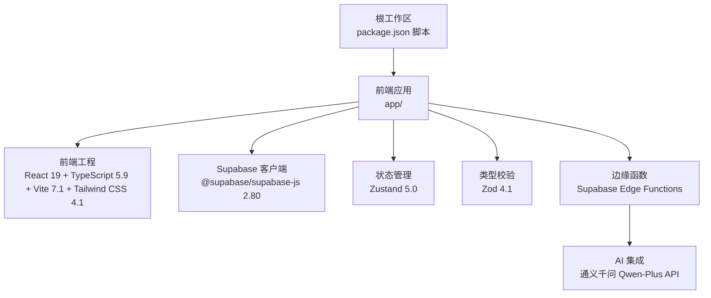

图表来源
- [package.json:1-23](file://package.json#L1-L23)
- [app/package.json:1-141](file://app/package.json#L1-L141)

章节来源
- [package.json:1-23](file://package.json#L1-L23)
- [app/package.json:1-141](file://app/package.json#L1-L141)

## 核心组件
- 前端技术栈
  - React 19.1.1：最新稳定版，具备并发特性与更优的渲染模型
  - TypeScript 5.9.x：严格类型系统，提升开发体验与可维护性
  - Vite 7.1.x：极速开发与构建工具链，支持按需预构建与模块联邦
  - Tailwind CSS 4.1：原子化样式框架，结合 PostCSS 与 @tailwindcss/postcss
- 后端技术栈
  - Supabase 2.80：数据库、认证、实时订阅与边缘函数一体化平台
  - Edge Functions：基于 Deno 的无服务器运行时，部署与调用便捷
- 状态管理
  - Zustand 5.0：轻量、高性能的状态容器，支持中间件持久化与异步逻辑
- 类型校验
  - Zod 4.1：编译期与运行时双重校验，Schema 驱动的表单与 API 参数校验
- AI 集成
  - 通义千问 Qwen-Plus API：通过 Supabase Edge Functions 提供 SSE 流式对话能力

章节来源
- [app/package.json:48-85](file://app/package.json#L48-L85)
- [app/package.json:86-121](file://app/package.json#L86-L121)
- [app/vite.config.ts:1-77](file://app/vite.config.ts#L1-L77)
- [app/tailwind.config.js:1-39](file://app/tailwind.config.js#L1-L39)
- [app/postcss.config.js:1-6](file://app/postcss.config.js#L1-L6)
- [app/src/lib/supabase/client.ts:1-34](file://app/src/lib/supabase/client.ts#L1-L34)
- [app/src/stores/useAuthStore.ts:1-173](file://app/src/stores/useAuthStore.ts#L1-L173)
- [app/src/types/validation.ts:1-86](file://app/src/types/validation.ts#L1-L86)
- [app/supabase/functions/ai-assistant/index.ts:1-116](file://app/supabase/functions/ai-assistant/index.ts#L1-L116)

## 架构总览
OPC-Starter 的整体架构围绕“前端 SPA + Supabase 后端 + Edge Functions + AI 服务”展开。前端通过 Supabase 客户端与后端交互，Edge Functions 作为 AI 代理层，统一接入通义千问 API，实现流式响应与上下文感知。

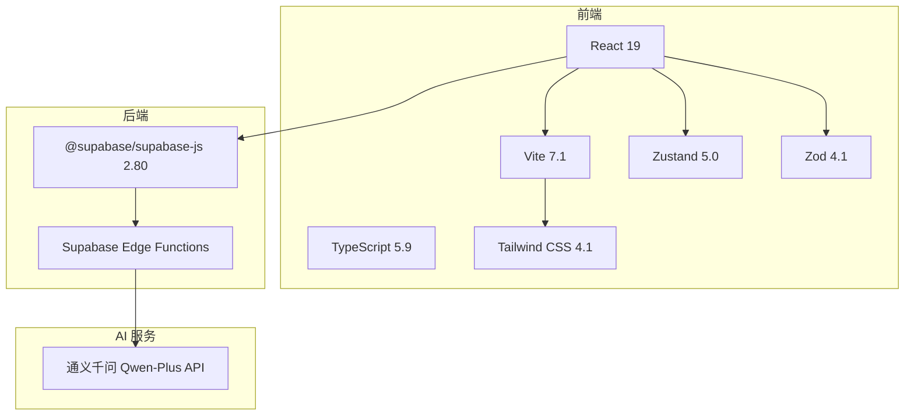

图表来源
- [app/package.json:48-85](file://app/package.json#L48-L85)
- [app/supabase/functions/ai-assistant/index.ts:1-116](file://app/supabase/functions/ai-assistant/index.ts#L1-L116)

## 详细组件分析

### 前端构建与打包（Vite 7.1）
- 依赖预构建与手动分包：对 React 生态、UI 组件库、状态管理与工具库进行独立 chunk，降低首包体积与缓存命中成本
- 构建优化：启用 CSS 分割、Terser 压缩、禁用 sourcemap（生产），并设置合理的 chunkSize 警告阈值
- 代理配置：通过 /supabase-proxy 将 Supabase 请求代理到真实后端，便于本地开发与 MSW 拦截

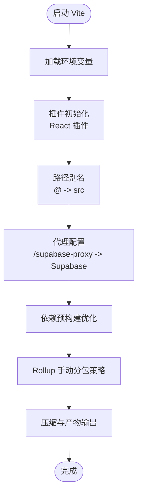

图表来源
- [app/vite.config.ts:1-77](file://app/vite.config.ts#L1-L77)

章节来源
- [app/vite.config.ts:1-77](file://app/vite.config.ts#L1-L77)

### 样式体系（Tailwind CSS 4.1 + PostCSS）
- 使用 @tailwindcss/postcss 作为 PostCSS 插件，结合 Tailwind v4 配置扩展动画与关键帧
- 内容扫描范围覆盖 HTML 与 TSX 文件，确保按需生成样式

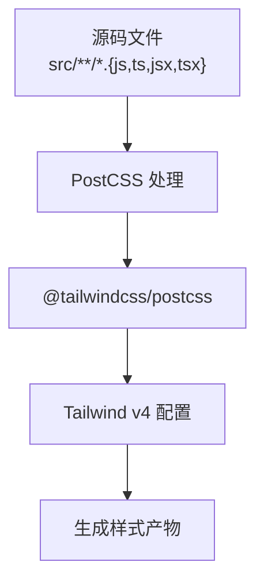

图表来源
- [app/tailwind.config.js:1-39](file://app/tailwind.config.js#L1-L39)
- [app/postcss.config.js:1-6](file://app/postcss.config.js#L1-L6)

章节来源
- [app/tailwind.config.js:1-39](file://app/tailwind.config.js#L1-L39)
- [app/postcss.config.js:1-6](file://app/postcss.config.js#L1-L6)

### 类型系统（TypeScript 5.9）
- 采用多配置分层：tsconfig.json 引用 tsconfig.app.json 与 tsconfig.node.json
- app 配置启用严格模式、ES2022 目标、React JSX 与 bundler 模式解析，确保类型检查与构建一致性

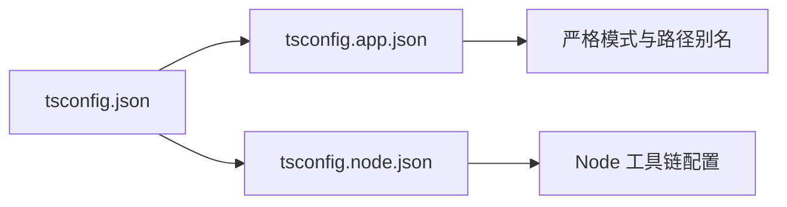

图表来源
- [app/tsconfig.json:1-14](file://app/tsconfig.json#L1-L14)
- [app/tsconfig.app.json:1-38](file://app/tsconfig.app.json#L1-L38)

章节来源
- [app/tsconfig.json:1-14](file://app/tsconfig.json#L1-L14)
- [app/tsconfig.app.json:1-38](file://app/tsconfig.app.json#L1-L38)

### 状态管理（Zustand 5.0）
- 使用 create 与 persist 中间件实现认证状态的本地持久化与异步初始化
- 与 Supabase 认证事件联动，自动更新用户态与鉴权标志位

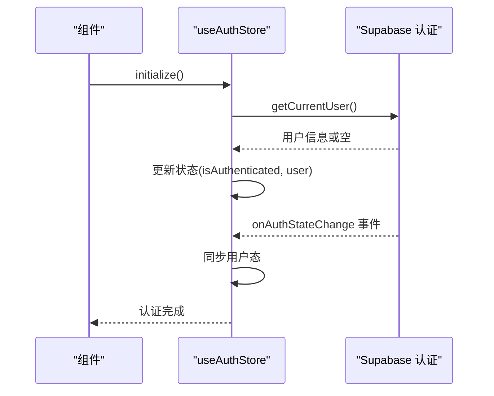

图表来源
- [app/src/stores/useAuthStore.ts:1-173](file://app/src/stores/useAuthStore.ts#L1-L173)
- [app/src/lib/supabase/client.ts:1-34](file://app/src/lib/supabase/client.ts#L1-L34)

章节来源
- [app/src/stores/useAuthStore.ts:1-173](file://app/src/stores/useAuthStore.ts#L1-L173)
- [app/src/lib/supabase/client.ts:1-34](file://app/src/lib/supabase/client.ts#L1-L34)

### 类型校验（Zod 4.1）
- 使用 Zod Schema 对表单输入进行编译期与运行时校验，保证数据一致性
- 提供头像上传与图片尺寸的辅助校验函数，统一错误返回格式

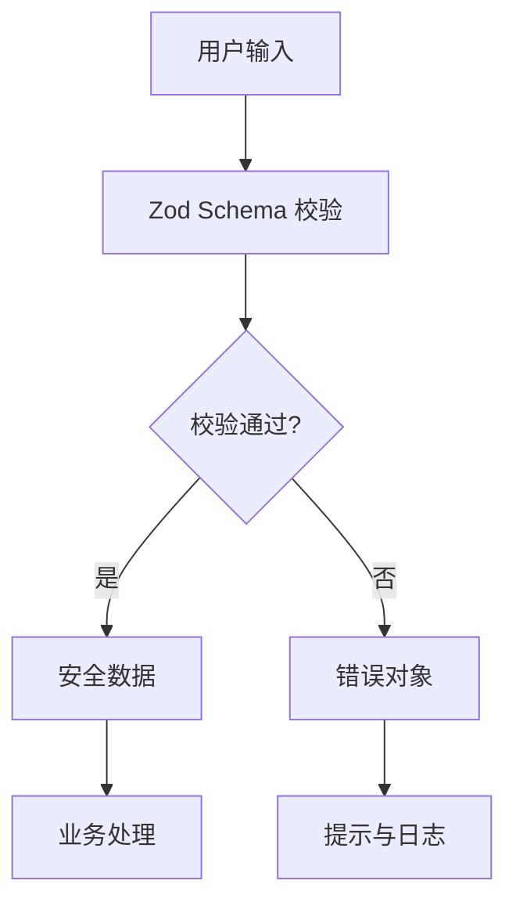

图表来源
- [app/src/types/validation.ts:1-86](file://app/src/types/validation.ts#L1-L86)

章节来源
- [app/src/types/validation.ts:1-86](file://app/src/types/validation.ts#L1-L86)

### Supabase 客户端与开发模式（@supabase/supabase-js 2.80）
- 在 MSW 模式下通过 /supabase-proxy 代理请求，确保 Service Worker 可拦截，避免跨域问题
- 非 MSW 模式下读取环境变量进行初始化；缺失关键变量时记录警告，保障功能降级可用

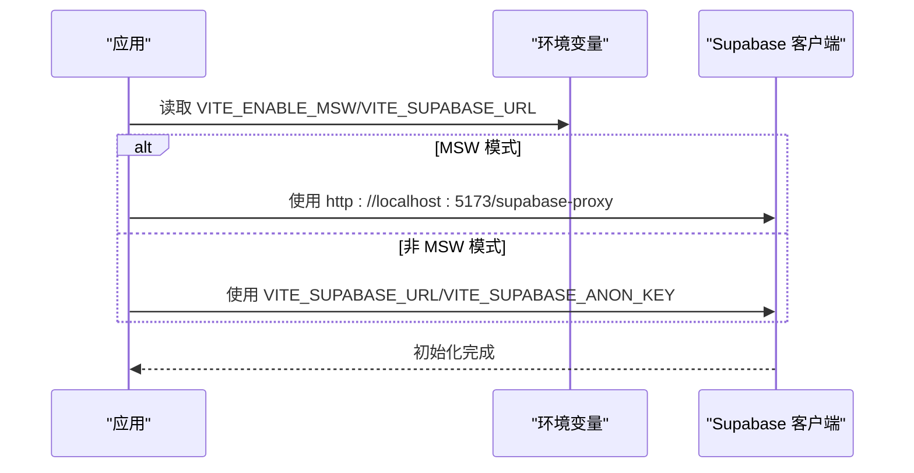

图表来源
- [app/src/lib/supabase/client.ts:1-34](file://app/src/lib/supabase/client.ts#L1-L34)
- [app/env.local.example:1-44](file://app/env.local.example#L1-L44)

章节来源
- [app/src/lib/supabase/client.ts:1-34](file://app/src/lib/supabase/client.ts#L1-L34)
- [app/env.local.example:1-44](file://app/env.local.example#L1-L44)

### Edge Functions 与 AI 集成（通义千问 Qwen-Plus）
- Edge 函数入口负责 CORS、鉴权与 SSE 流式响应
- 通过系统提示词与消息转换适配 OpenAI 协议，调用 Agent Loop 实现多轮对话与上下文管理
- 使用阿里云百炼 API Key 与 Supabase 凭证进行用户鉴权与上下文绑定

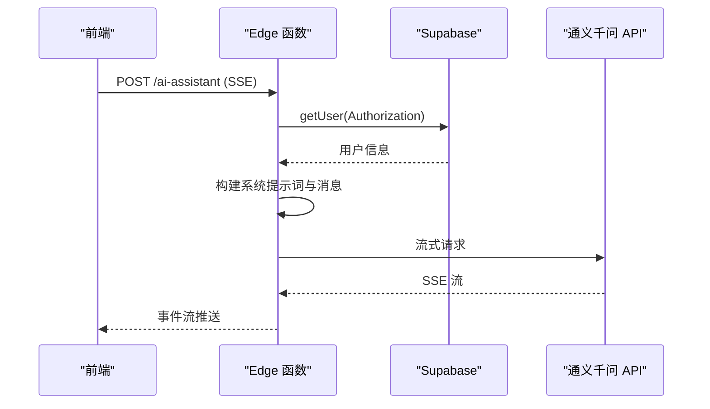

图表来源
- [app/supabase/functions/ai-assistant/index.ts:1-116](file://app/supabase/functions/ai-assistant/index.ts#L1-L116)

章节来源
- [app/supabase/functions/ai-assistant/index.ts:1-116](file://app/supabase/functions/ai-assistant/index.ts#L1-L116)

### 应用初始化与生命周期
- 初始化顺序：主题 → MSW（开发+Mock）→ 认证 → 数据服务（非 Mock）→ 渲染
- 保证 MSW 在认证前启动，避免真实 Supabase 请求导致白屏

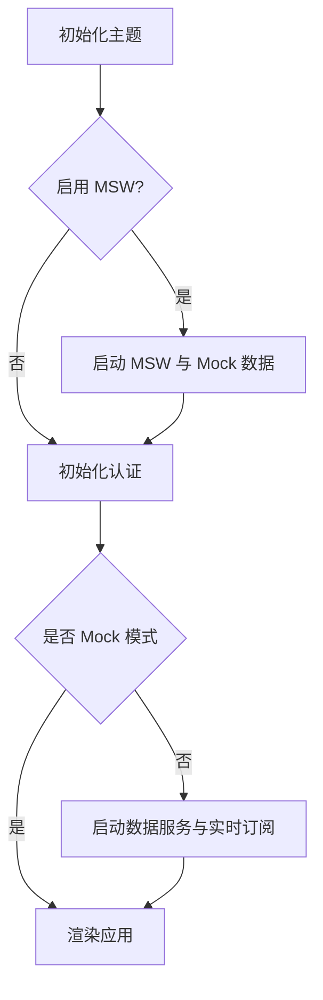

图表来源
- [app/src/main.tsx:1-78](file://app/src/main.tsx#L1-L78)

章节来源
- [app/src/main.tsx:1-78](file://app/src/main.tsx#L1-L78)
- [app/src/App.tsx:1-18](file://app/src/App.tsx#L1-L18)

## 依赖关系分析
- 前端依赖
  - React 19 + React Router DOM 7：路由与组件生态
  - Zustand 5 与 axios：状态管理与网络请求
  - date-fns、idb、lucide-react：工具与图标
  - Radix UI 组件库：无障碍与可组合 UI
- 开发依赖
  - Vite 7、TypeScript 5.9、Tailwind CSS 4.1、ESLint 9、Prettier、Vitest、Cypress
- 后端依赖
  - @supabase/supabase-js 2.80：客户端 SDK
  - Edge Functions：无服务器运行时与 Supabase 集成

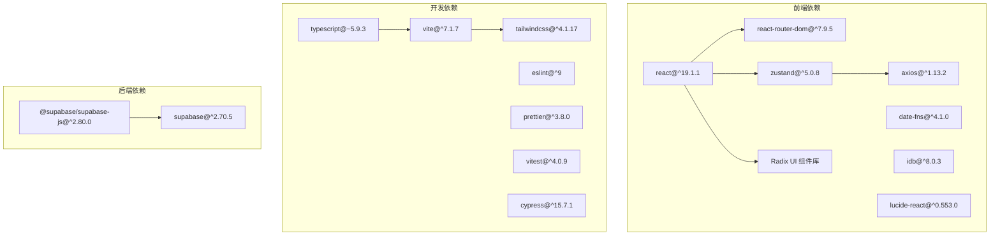

图表来源
- [app/package.json:48-85](file://app/package.json#L48-L85)
- [app/package.json:86-121](file://app/package.json#L86-L121)

章节来源
- [app/package.json:48-85](file://app/package.json#L48-L85)
- [app/package.json:86-121](file://app/package.json#L86-L121)

## 性能考量
- 构建优化
  - 手动分包策略减少重复依赖与首屏体积
  - CSS 分割与按需样式生成，避免全局样式膨胀
  - 生产环境关闭 sourcemap，减小产物体积
- 运行时优化
  - Zustand 5 无样板代码，状态更新局部化，减少重渲染
  - Zod Schema 编译期校验，运行时最小开销
  - Edge Functions 无冷启动影响，SSE 流式响应降低延迟
- 网络与缓存
  - MSW Mock 模式下代理请求，便于拦截与离线模拟
  - Supabase 持久化会话与自动刷新令牌，优化用户体验

## 故障排查指南
- 环境变量缺失
  - 现象：认证功能不可用或控制台警告
  - 措施：复制 env.local.example 为 .env.local 并填入 VITE_SUPABASE_URL、VITE_SUPABASE_ANON_KEY
- MSW 模式请求跨域
  - 现象：请求未被拦截或跨域报错
  - 措施：确认 VITE_ENABLE_MSW=true 且使用 /supabase-proxy 代理路径
- Edge 函数鉴权失败
  - 现象：401 未授权或缺少 API Key
  - 措施：在 Supabase Dashboard → Edge Functions → Secrets 配置 ALIYUN_BAILIAN_API_KEY
- 构建体积过大
  - 现象：chunkSize 警告
  - 措施：检查手动分包策略与第三方库引入，必要时调整依赖或拆分逻辑

章节来源
- [app/env.local.example:1-44](file://app/env.local.example#L1-L44)
- [app/src/lib/supabase/client.ts:1-34](file://app/src/lib/supabase/client.ts#L1-L34)
- [app/supabase/functions/ai-assistant/index.ts:1-116](file://app/supabase/functions/ai-assistant/index.ts#L1-L116)
- [app/vite.config.ts:40-70](file://app/vite.config.ts#L40-L70)

## 结论
OPC-Starter 以现代前端技术栈为基础，结合 Supabase 与 Edge Functions 实现低代码后端与 AI 集成，Zustand 与 Zod 提升状态管理与类型安全，Tailwind CSS 与 Vite 7 保障开发体验与性能表现。该技术栈适合快速迭代与规模化团队协作。

## 附录

### 版本对照表
- 前端
  - React：19.1.1
  - TypeScript：5.9.x
  - Vite：7.1.x
  - Tailwind CSS：4.1.x
  - Zustand：5.0.x
  - Zod：4.1.x
- 后端
  - Supabase 客户端：2.80.x
  - Edge Functions：基于 Deno（运行时版本见函数入口注释）

章节来源
- [app/package.json:48-85](file://app/package.json#L48-L85)
- [app/supabase/functions/ai-assistant/index.ts:1-116](file://app/supabase/functions/ai-assistant/index.ts#L1-L116)

### 升级指南
- TypeScript 5.9 → 5.9.x
  - 保持严格模式与 bundler 解析配置不变
  - 更新 tsconfig.app.json 的 lib 与 target，确保 DOM 与 ES2022 兼容
- Vite 7.1 → 7.1.x
  - 关注 optimizeDeps.include 与 manualChunks 配置，避免重复打包
  - 如启用新插件，注意与现有 PostCSS/Tailwind 配置兼容
- Tailwind CSS 4.1 → 4.1.x
  - 保持 content 扫描与 @theme 自定义一致
  - 新增动画需在 theme.extend 中集中管理
- Zustand 5.0 → 5.0.x
  - persist 中间件配置保持不变；如需迁移，请遵循官方迁移说明
- Zod 4.1 → 4.1.x
  - Schema 定义保持向后兼容；新增校验规则时注意错误消息一致性
- Supabase 客户端 2.80 → 2.80.x
  - 保持 createClient 初始化参数不变；关注认证与实时订阅 API 变更
- Edge Functions
  - 保持 Deno 运行时与 OpenAI 兼容消息格式；更新 API Key 管理与权限控制

章节来源
- [app/tsconfig.app.json:1-38](file://app/tsconfig.app.json#L1-L38)
- [app/vite.config.ts:1-77](file://app/vite.config.ts#L1-L77)
- [app/tailwind.config.js:1-39](file://app/tailwind.config.js#L1-L39)
- [app/src/stores/useAuthStore.ts:1-173](file://app/src/stores/useAuthStore.ts#L1-L173)
- [app/src/types/validation.ts:1-86](file://app/src/types/validation.ts#L1-L86)
- [app/src/lib/supabase/client.ts:1-34](file://app/src/lib/supabase/client.ts#L1-L34)
- [app/supabase/functions/ai-assistant/index.ts:1-116](file://app/supabase/functions/ai-assistant/index.ts#L1-L116)