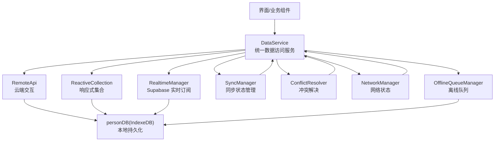
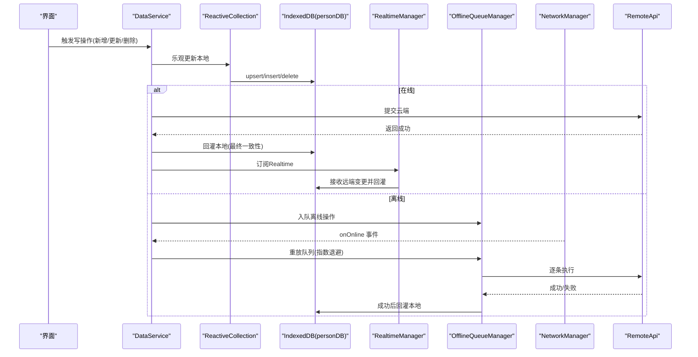
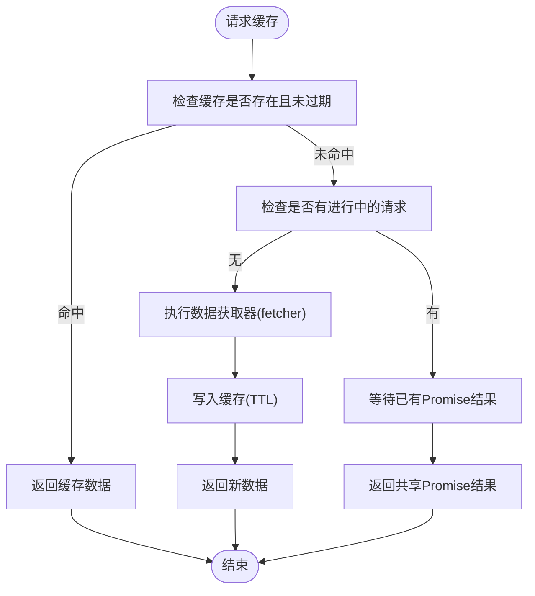
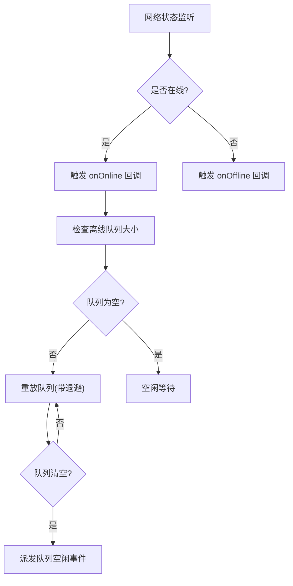
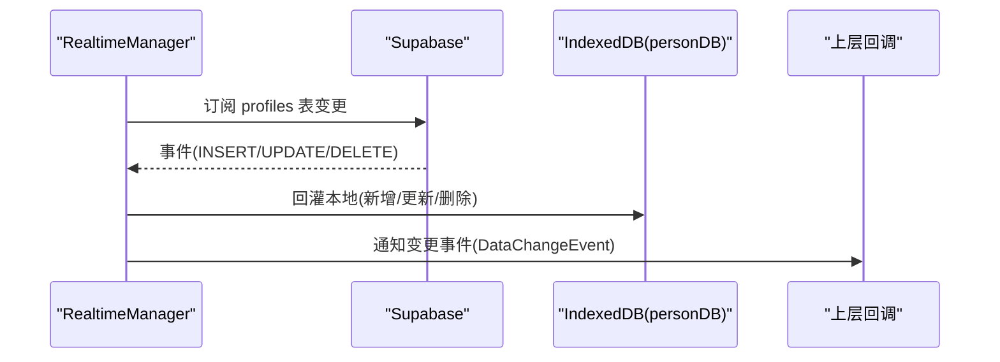
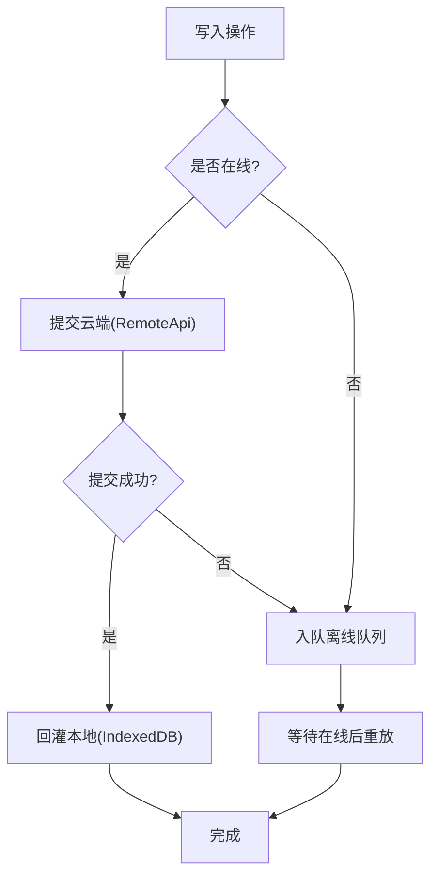
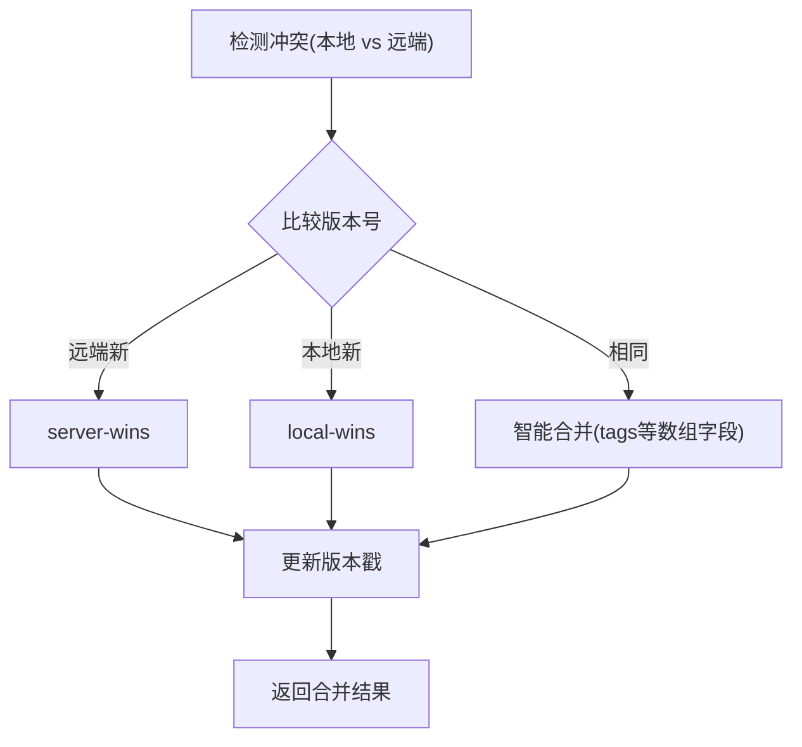
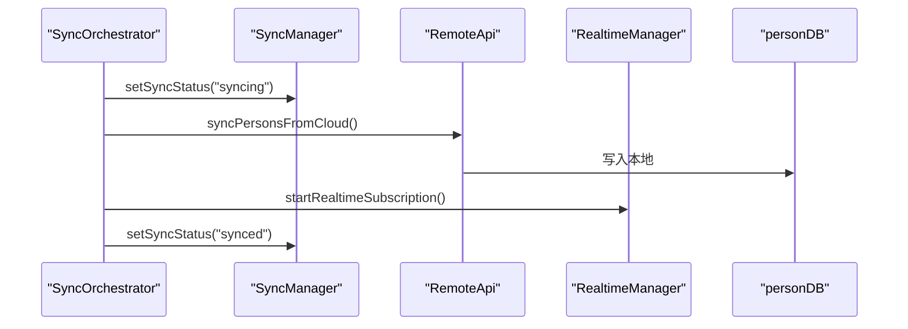
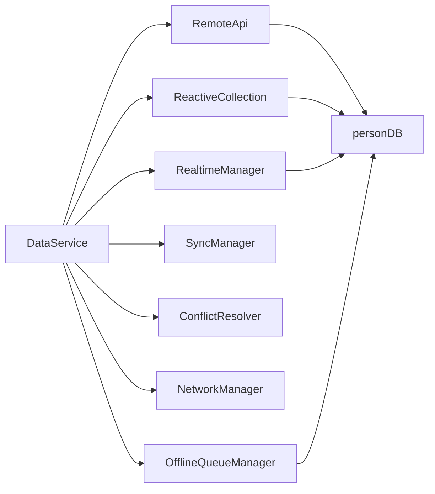

# Cache + Realtime 数据流模式

<cite>
**本文引用的文件**
- [app/src/services/data/DataService.ts](file://app/src/services/data/DataService.ts)
- [app/src/services/cache/memoryCache.ts](file://app/src/services/cache/memoryCache.ts)
- [app/src/services/data/realtime/realtimeManager.ts](file://app/src/services/data/realtime/realtimeManager.ts)
- [app/src/services/data/network/networkManager.ts](file://app/src/services/data/network/networkManager.ts)
- [app/src/services/data/sync/syncManager.ts](file://app/src/services/data/sync/syncManager.ts)
- [app/src/services/data/offline-queue/offlineQueueManager.ts](file://app/src/services/data/offline-queue/offlineQueueManager.ts)
- [app/src/services/data/conflict/conflictResolver.ts](file://app/src/services/data/conflict/conflictResolver.ts)
- [app/src/services/data/sync/syncOrchestrator.ts](file://app/src/services/data/sync/syncOrchestrator.ts)
- [app/src/services/data/remote/remoteApi.ts](file://app/src/services/data/remote/remoteApi.ts)
- [app/src/services/db/personDB.ts](file://app/src/services/db/personDB.ts)
- [app/src/lib/reactive/ReactiveCollection.ts](file://app/src/lib/reactive/ReactiveCollection.ts)
- [app/src/lib/reactive/types.ts](file://app/src/lib/reactive/types.ts)
</cite>

## 目录
1. [简介](#简介)
2. [项目结构](#项目结构)
3. [核心组件](#核心组件)
4. [架构总览](#架构总览)
5. [详细组件分析](#详细组件分析)
6. [依赖关系分析](#依赖关系分析)
7. [性能考量](#性能考量)
8. [故障排查指南](#故障排查指南)
9. [结论](#结论)

## 简介
本文件系统性阐述 OPC-Starter 的 Cache + Realtime 数据流模式，围绕“100% 本地读取、乐观更新写入、Realtime 同步”的核心设计原则，深入解析以下关键能力：
- CacheManager 的缓存策略、版本控制与失效机制
- 网络状态检测与处理：在线/离线判断、异常处理、自动重连
- 完整数据流：从 UI 触发写入，到离线队列、云端同步、Realtime 实时回灌的全流程
- 关键时序与数据流图，帮助读者快速掌握典型场景下的行为路径

## 项目结构
该模式涉及三层：应用层（DataService）、数据层（IndexedDB + 内存缓存）、实时层（Supabase Realtime）。下图给出与本文相关的模块关系映射。

图表来源
- [app/src/services/data/DataService.ts:71-419](file://app/src/services/data/DataService.ts#L71-L419)
- [app/src/lib/reactive/ReactiveCollection.ts:16-256](file://app/src/lib/reactive/ReactiveCollection.ts#L16-L256)
- [app/src/services/data/realtime/realtimeManager.ts:22-122](file://app/src/services/data/realtime/realtimeManager.ts#L22-L122)
- [app/src/services/data/network/networkManager.ts:19-73](file://app/src/services/data/network/networkManager.ts#L19-L73)
- [app/src/services/data/sync/syncManager.ts:14-48](file://app/src/services/data/sync/syncManager.ts#L14-L48)
- [app/src/services/data/offline-queue/offlineQueueManager.ts:24-168](file://app/src/services/data/offline-queue/offlineQueueManager.ts#L24-L168)
- [app/src/services/data/conflict/conflictResolver.ts:69-137](file://app/src/services/data/conflict/conflictResolver.ts#L69-L137)
- [app/src/services/data/remote/remoteApi.ts:21-164](file://app/src/services/data/remote/remoteApi.ts#L21-L164)
- [app/src/services/db/personDB.ts:11-115](file://app/src/services/db/personDB.ts#L11-L115)

章节来源
- [app/src/services/data/DataService.ts:11-419](file://app/src/services/data/DataService.ts#L11-L419)

## 核心组件
- DataService：统一入口，协调 Realtime、离线队列、同步编排、冲突解决、网络状态与远程 API。
- ReactiveCollection：将本地/远程适配器包装为可观察集合，支持查询、乐观更新与变更监听。
- RealtimeManager：基于 Supabase Realtime 订阅，接收 INSERT/UPDATE/DELETE 事件并回灌本地 IndexedDB。
- OfflineQueueManager：在网络离线时缓存写操作，恢复在线后按序重放并带指数退避重试。
- SyncManager：维护同步状态机（idle/syncing/synced/error），并向外部广播状态变化。
- ConflictResolver：在版本冲突时选择 server-wins/local-wins/merge/latest 等策略。
- NetworkManager：封装浏览器 online/offline 事件，向 DataService 传递网络状态。
- RemoteApi：封装与 Supabase 的云端交互，负责全量/增量同步与单条 CRUD。
- personDB：IndexedDB 访问层，提供人员数据的本地持久化。

章节来源
- [app/src/services/data/DataService.ts:71-419](file://app/src/services/data/DataService.ts#L71-L419)
- [app/src/lib/reactive/ReactiveCollection.ts:16-256](file://app/src/lib/reactive/ReactiveCollection.ts#L16-L256)
- [app/src/services/data/realtime/realtimeManager.ts:22-122](file://app/src/services/data/realtime/realtimeManager.ts#L22-L122)
- [app/src/services/data/offline-queue/offlineQueueManager.ts:24-168](file://app/src/services/data/offline-queue/offlineQueueManager.ts#L24-L168)
- [app/src/services/data/sync/syncManager.ts:14-48](file://app/src/services/data/sync/syncManager.ts#L14-L48)
- [app/src/services/data/conflict/conflictResolver.ts:69-137](file://app/src/services/data/conflict/conflictResolver.ts#L69-L137)
- [app/src/services/data/network/networkManager.ts:19-73](file://app/src/services/data/network/networkManager.ts#L19-L73)
- [app/src/services/data/remote/remoteApi.ts:21-164](file://app/src/services/data/remote/remoteApi.ts#L21-L164)
- [app/src/services/db/personDB.ts:11-115](file://app/src/services/db/personDB.ts#L11-L115)

## 架构总览
Cache + Realtime 数据流模式遵循如下原则：
- 读：优先从本地 IndexedDB 返回，确保 100% 本地读取，降低延迟与带宽消耗。
- 写：先乐观更新本地（ReactiveCollection），再异步提交云端；成功后再回灌本地，失败则通过离线队列重试。
- 实时：通过 Supabase Realtime 接收远端变更，自动回灌本地，保持多端一致。
- 缓存：内存缓存用于存放不常变数据（如组织树、用户资料），支持 TTL、批量失效与基于 Realtime 的自动失效。

图表来源
- [app/src/services/data/DataService.ts:324-414](file://app/src/services/data/DataService.ts#L324-L414)
- [app/src/lib/reactive/ReactiveCollection.ts:141-234](file://app/src/lib/reactive/ReactiveCollection.ts#L141-L234)
- [app/src/services/data/realtime/realtimeManager.ts:34-93](file://app/src/services/data/realtime/realtimeManager.ts#L34-L93)
- [app/src/services/data/offline-queue/offlineQueueManager.ts:49-143](file://app/src/services/data/offline-queue/offlineQueueManager.ts#L49-L143)
- [app/src/services/data/network/networkManager.ts:32-49](file://app/src/services/data/network/networkManager.ts#L32-L49)
- [app/src/services/data/remote/remoteApi.ts:133-153](file://app/src/services/data/remote/remoteApi.ts#L133-L153)

## 详细组件分析

### CacheManager（内存缓存）工作原理
- 设计目标：减少 API 请求，提升读取性能；对不频繁变化的数据（组织树、用户资料）提供短期缓存。
- 关键特性：
  - TTL 过期控制（默认 5 分钟，组织树 10 分钟，用户资料 5 分钟）
  - 并发去抖：同一 key 的并发请求共享同一 Promise，避免重复拉取
  - 主动失效：支持按前缀批量删除、按键删除、清空全部
  - 自动失效：监听 dataservice:*-change 事件，自动失效相关缓存键
- 数据结构与复杂度：
  - Map 存储，get/set/删除均为平均 O(1)
  - 批量删除遍历键集合，复杂度 O(n)
- 版本控制与失效：
  - 通过事件驱动的失效策略，结合业务变更（组织/资料）触发缓存失效，保证一致性

图表来源
- [app/src/services/cache/memoryCache.ts:46-110](file://app/src/services/cache/memoryCache.ts#L46-L110)

章节来源
- [app/src/services/cache/memoryCache.ts:14-192](file://app/src/services/cache/memoryCache.ts#L14-L192)

### 网络状态检测与处理
- 在线/离线判断：基于浏览器 online/offline 事件，封装为 NetworkManager，向 DataService 广播状态变化
- 离线写入：当网络断开时，写操作被入队至 localStorage，等待恢复在线后重放
- 自动重连与退避：重放过程采用最多 3 次重试，失败后指数退避（上限 30 秒），避免风暴重试
- 队列空闲通知：队列清空时派发自定义事件，便于 UI 或其他模块感知

图表来源
- [app/src/services/data/network/networkManager.ts:32-49](file://app/src/services/data/network/networkManager.ts#L32-L49)
- [app/src/services/data/DataService.ts:153-171](file://app/src/services/data/DataService.ts#L153-L171)
- [app/src/services/data/offline-queue/offlineQueueManager.ts:104-143](file://app/src/services/data/offline-queue/offlineQueueManager.ts#L104-L143)

章节来源
- [app/src/services/data/network/networkManager.ts:19-73](file://app/src/services/data/network/networkManager.ts#L19-L73)
- [app/src/services/data/DataService.ts:151-183](file://app/src/services/data/DataService.ts#L151-L183)
- [app/src/services/data/offline-queue/offlineQueueManager.ts:24-168](file://app/src/services/data/offline-queue/offlineQueueManager.ts#L24-L168)

### Realtime 同步机制
- 订阅范围：针对 profiles 表的 INSERT/UPDATE/DELETE 事件，统一转换为 DataChangeEvent 并回灌本地 IndexedDB
- 回灌策略：收到事件后立即更新本地存储，随后回调上层（如 ReactiveCollection），保证 UI 即时刷新
- 清理与幂等：支持取消订阅与清理，避免重复订阅；对重复事件具备幂等处理（插入时若已存在则转为更新）

图表来源
- [app/src/services/data/realtime/realtimeManager.ts:34-93](file://app/src/services/data/realtime/realtimeManager.ts#L34-L93)
- [app/src/services/db/personDB.ts:31-103](file://app/src/services/db/personDB.ts#L31-L103)

章节来源
- [app/src/services/data/realtime/realtimeManager.ts:22-122](file://app/src/services/data/realtime/realtimeManager.ts#L22-L122)
- [app/src/services/db/personDB.ts:11-115](file://app/src/services/db/personDB.ts#L11-L115)

### 写入流程与乐观更新
- 乐观更新：ReactiveCollection 在本地插入/更新后立即对外发出变更，随后尝试提交云端
- 写入决策：在线时先提交云端，成功后再回灌本地；离线时直接入队离线队列
- 失败回滚：云端失败时，本地保持乐观状态，等待后续重试或用户干预
- 临时 ID：插入时生成临时 ID，云端成功后替换为真实 ID 并移除临时记录

图表来源
- [app/src/lib/reactive/ReactiveCollection.ts:141-179](file://app/src/lib/reactive/ReactiveCollection.ts#L141-L179)
- [app/src/services/data/DataService.ts:335-414](file://app/src/services/data/DataService.ts#L335-L414)
- [app/src/services/data/remote/remoteApi.ts:133-153](file://app/src/services/data/remote/remoteApi.ts#L133-L153)
- [app/src/services/data/offline-queue/offlineQueueManager.ts:49-62](file://app/src/services/data/offline-queue/offlineQueueManager.ts#L49-L62)

章节来源
- [app/src/lib/reactive/ReactiveCollection.ts:16-256](file://app/src/lib/reactive/ReactiveCollection.ts#L16-L256)
- [app/src/services/data/DataService.ts:324-414](file://app/src/services/data/DataService.ts#L324-L414)

### 冲突检测与解决
- 冲突来源：本地与云端版本不一致（如本地先更新，云端后更新，或反之）
- 解决策略：
  - 版本比较：以 version 字段作为依据，远端版本新则 server-wins，本地新则 local-wins
  - 相同版本：对数组字段（如 tags）执行智能合并（merge/keep-left/keep-right/longer）
  - 默认策略：相同版本时优先远端
- 统计与复位：记录 total/serverWins/localWins/merged 数量，支持复位

图表来源
- [app/src/services/data/conflict/conflictResolver.ts:77-116](file://app/src/services/data/conflict/conflictResolver.ts#L77-L116)

章节来源
- [app/src/services/data/conflict/conflictResolver.ts:69-137](file://app/src/services/data/conflict/conflictResolver.ts#L69-L137)

### 同步编排与状态管理
- SyncManager：维护同步状态机（idle/syncing/synced/error），并支持订阅状态变化
- SyncOrchestrator：
  - 初始同步：在线且用户已登录时，全量拉取云端数据并启动 Realtime 订阅
  - 增量同步：周期性（默认 5 分钟）对比本地与云端差异，执行新增/更新/删除
  - 强制全量：清空本地后重新执行初始同步
- 状态传播：通过 SyncManager 将状态广播给上层组件

图表来源
- [app/src/services/data/sync/syncOrchestrator.ts:37-86](file://app/src/services/data/sync/syncOrchestrator.ts#L37-L86)
- [app/src/services/data/sync/syncManager.ts:23-27](file://app/src/services/data/sync/syncManager.ts#L23-L27)
- [app/src/services/data/remote/remoteApi.ts:111-131](file://app/src/services/data/remote/remoteApi.ts#L111-L131)
- [app/src/services/data/realtime/realtimeManager.ts:95-106](file://app/src/services/data/realtime/realtimeManager.ts#L95-L106)

章节来源
- [app/src/services/data/sync/syncManager.ts:14-48](file://app/src/services/data/sync/syncManager.ts#L14-L48)
- [app/src/services/data/sync/syncOrchestrator.ts:34-210](file://app/src/services/data/sync/syncOrchestrator.ts#L34-L210)

## 依赖关系分析
- 组件耦合与内聚：
  - DataService 对外聚合多个子系统，内聚度高，职责清晰
  - ReactiveCollection 仅依赖 LocalAdapter/RemoteAdapter 接口，耦合度低，便于替换适配器
  - RealtimeManager/OfflineQueueManager/SyncManager 独立性强，通过回调与事件解耦
- 外部依赖：
  - Supabase Realtime 与 REST API
  - 浏览器 online/offline 事件
  - IndexedDB（通过 personDB 封装）
- 循环依赖：
  - 未发现循环依赖；各模块通过函数工厂与回调进行协作

图表来源
- [app/src/services/data/DataService.ts:76-109](file://app/src/services/data/DataService.ts#L76-L109)
- [app/src/lib/reactive/ReactiveCollection.ts:27-47](file://app/src/lib/reactive/ReactiveCollection.ts#L27-L47)
- [app/src/services/data/realtime/realtimeManager.ts:22-32](file://app/src/services/data/realtime/realtimeManager.ts#L22-L32)
- [app/src/services/data/offline-queue/offlineQueueManager.ts:24-26](file://app/src/services/data/offline-queue/offlineQueueManager.ts#L24-L26)
- [app/src/services/data/sync/syncManager.ts:14-17](file://app/src/services/data/sync/syncManager.ts#L14-L17)
- [app/src/services/data/conflict/conflictResolver.ts:69-75](file://app/src/services/data/conflict/conflictResolver.ts#L69-L75)
- [app/src/services/data/network/networkManager.ts:19-22](file://app/src/services/data/network/networkManager.ts#L19-L22)
- [app/src/services/data/remote/remoteApi.ts:21-21](file://app/src/services/data/remote/remoteApi.ts#L21-L21)
- [app/src/services/db/personDB.ts:11-17](file://app/src/services/db/personDB.ts#L11-L17)

章节来源
- [app/src/services/data/DataService.ts:71-131](file://app/src/services/data/DataService.ts#L71-L131)

## 性能考量
- 本地优先读取：ReactiveCollection 与 personDB 提供即时读取，显著降低首屏与滚动延迟
- 写入优化：乐观更新减少等待时间；批量写入（如 addPersons）利用事务提升吞吐
- 离线重放：指数退避避免风暴重试，保障网络恢复后的稳定性
- 缓存命中：MemoryCache 的 TTL 与并发去抖减少重复请求，提高冷启动性能
- 增量同步：周期性增量同步避免全量拉取，降低带宽与 CPU 开销

## 故障排查指南
- 写入失败
  - 现象：写入后未落库或未回传
  - 排查：检查 NetworkManager 是否处于离线状态；查看 OfflineQueueManager 队列是否堆积；确认 RemoteApi 提交是否报错
  - 处置：触发队列重放；必要时调用 forceFullSync 清空本地后重建
- 实时不同步
  - 现象：云端变更未反映到本地
  - 排查：确认 RealtimeManager 是否已订阅；检查 Supabase 订阅通道是否正常；查看 personDB 回灌日志
  - 处置：重启订阅；检查 transformSupabasePerson 与冲突解决逻辑
- 冲突过多
  - 现象：冲突统计持续上升
  - 排查：确认 ConflictResolver 策略是否合理；检查 tags 等数组字段合并逻辑
  - 处置：调整策略或引导用户选择合并/覆盖
- 网络抖动
  - 现象：频繁掉线/重连导致队列积压
  - 排查：查看 NetworkManager 事件频率；确认 OfflineQueueManager 退避参数
  - 处置：优化退避策略；增加队列监控与告警

章节来源
- [app/src/services/data/network/networkManager.ts:32-49](file://app/src/services/data/network/networkManager.ts#L32-L49)
- [app/src/services/data/offline-queue/offlineQueueManager.ts:104-143](file://app/src/services/data/offline-queue/offlineQueueManager.ts#L104-L143)
- [app/src/services/data/realtime/realtimeManager.ts:52-86](file://app/src/services/data/realtime/realtimeManager.ts#L52-L86)
- [app/src/services/data/conflict/conflictResolver.ts:77-116](file://app/src/services/data/conflict/conflictResolver.ts#L77-L116)

## 结论
OPC-Starter 的 Cache + Realtime 数据流模式通过“本地优先 + 乐观写入 + Realtime 回灌 + 离线队列 + 冲突解决”的组合拳，实现了高性能、高可用、强一致的混合数据架构。MemoryCache 与 ReactiveCollection 提升读取体验，Realtime 保障多端一致，OfflineQueueManager 与 SyncOrchestrator 解决网络不确定性，ConflictResolver 则在版本冲突时提供可控的合并策略。整体方案既满足离线场景需求，又能在在线状态下提供近实时的用户体验。