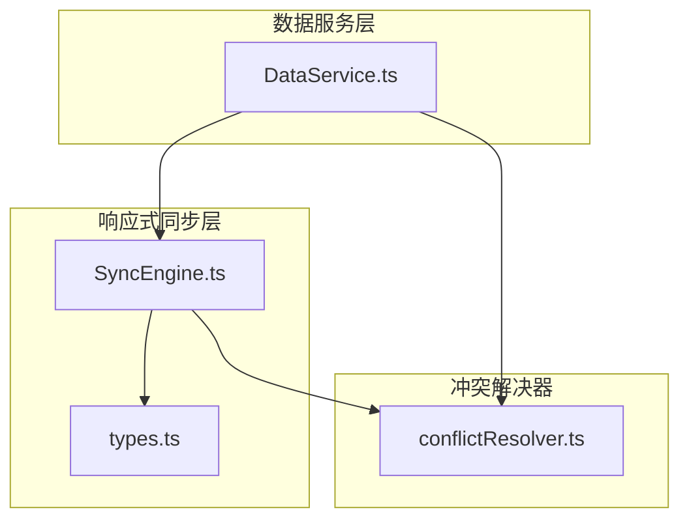
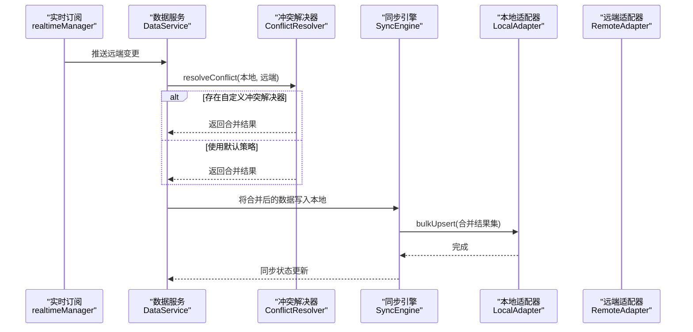
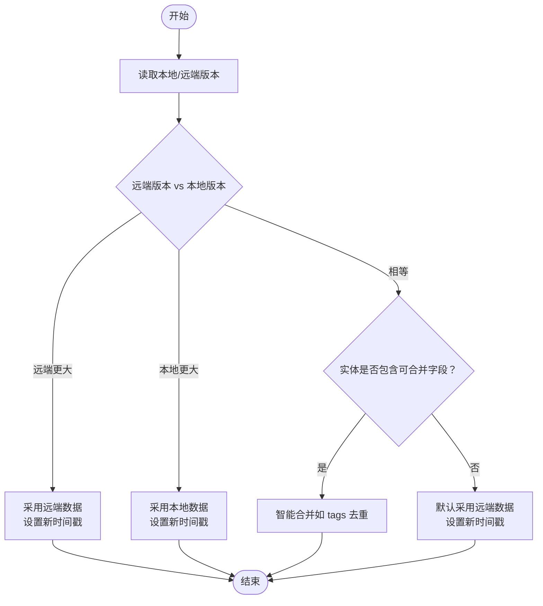
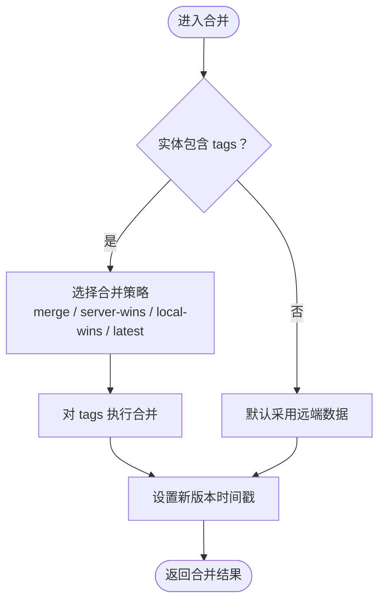
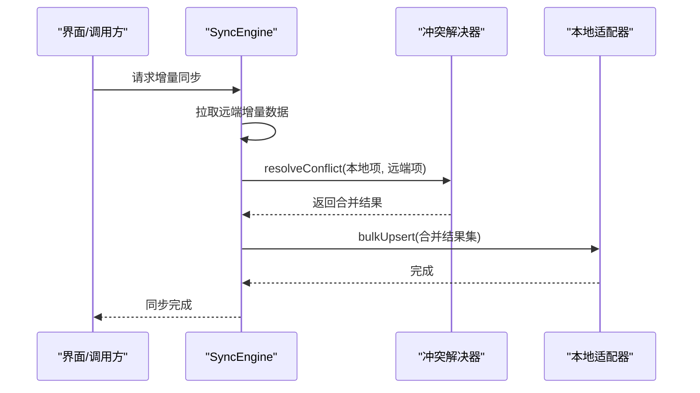
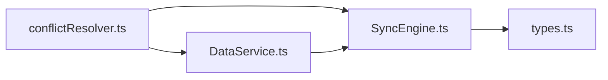

# 冲突解决机制

<cite>
**本文引用的文件**
- [conflictResolver.ts](file://app/src/services/data/conflict/conflictResolver.ts)
- [SyncEngine.ts](file://app/src/lib/reactive/SyncEngine.ts)
- [types.ts](file://app/src/lib/reactive/types.ts)
- [DataService.ts](file://app/src/services/data/DataService.ts)
- [SyncEngine.test.ts](file://app/src/lib/reactive/__tests__/SyncEngine.test.ts)
</cite>

## 目录
1. [简介](#简介)
2. [项目结构](#项目结构)
3. [核心组件](#核心组件)
4. [架构总览](#架构总览)
5. [详细组件分析](#详细组件分析)
6. [依赖关系分析](#依赖关系分析)
7. [性能考量](#性能考量)
8. [故障排查指南](#故障排查指南)
9. [结论](#结论)
10. [附录](#附录)

## 简介
本文件系统性阐述 OPC-Starter 中的冲突解决机制，覆盖冲突检测算法、版本比较与时间戳处理、冲突类型识别、合并策略设计、自动化流程（自动合并、人工干预、回滚）、以及可配置与自定义策略的实现方式。目标是帮助开发者在理解现有实现的基础上，安全地扩展或替换冲突解决逻辑。

## 项目结构
冲突解决机制主要分布在以下模块：
- 通用冲突解决器：提供统一的冲突检测与合并策略
- 双向同步引擎：负责增量同步过程中的冲突解析
- 数据服务层：对外暴露冲突统计与重置能力，并在实时订阅中注入冲突解决器
- 类型定义：约束冲突解决器签名与适配器接口

图表来源
- [DataService.ts:76-109](file://app/src/services/data/DataService.ts#L76-L109)
- [SyncEngine.ts:24-47](file://app/src/lib/reactive/SyncEngine.ts#L24-L47)
- [types.ts:73-84](file://app/src/lib/reactive/types.ts#L73-L84)
- [conflictResolver.ts:69-136](file://app/src/services/data/conflict/conflictResolver.ts#L69-L136)

章节来源
- [DataService.ts:71-117](file://app/src/services/data/DataService.ts#L71-L117)
- [SyncEngine.ts:24-47](file://app/src/lib/reactive/SyncEngine.ts#L24-L47)
- [types.ts:73-84](file://app/src/lib/reactive/types.ts#L73-L84)
- [conflictResolver.ts:69-136](file://app/src/services/data/conflict/conflictResolver.ts#L69-L136)

## 核心组件
- 冲突解决器（ConflictResolver）
  - 职责：根据版本号比较决定采用远端/本地/合并策略；记录冲突统计；支持自定义策略注入
  - 关键接口：resolveConflict、getConflictStats、resetConflictStats
  - 默认策略：基于版本号的远端优先；当实体包含特定字段（如 tags）时进行“智能合并”
- 同步引擎（SyncEngine）
  - 职责：管理初始/增量同步、离线队列、在线状态切换；在 deltaSync 时对本地与远端数据逐条冲突解析
  - 关键接口：initialSync、deltaSync、queueOperation、processQueue、resolveConflict
  - 默认冲突解析：对指定字段（如 tags、participants）执行集合去重合并
- 数据服务（DataService）
  - 职责：封装网络、离线队列、同步编排、实时订阅；在实时订阅回调中调用冲突解决器
  - 关键接口：subscribePersons、getSyncStats、getConflictStats、resetConflictStats

章节来源
- [conflictResolver.ts:17-21](file://app/src/services/data/conflict/conflictResolver.ts#L17-L21)
- [SyncEngine.ts:24-47](file://app/src/lib/reactive/SyncEngine.ts#L24-L47)
- [DataService.ts:76-109](file://app/src/services/data/DataService.ts#L76-L109)

## 架构总览
下图展示了从实时订阅到冲突解析再到本地存储的整体流程：

图表来源
- [DataService.ts:83-87](file://app/src/services/data/DataService.ts#L83-L87)
- [conflictResolver.ts:77-116](file://app/src/services/data/conflict/conflictResolver.ts#L77-L116)
- [SyncEngine.ts:93-101](file://app/src/lib/reactive/SyncEngine.ts#L93-L101)

## 详细组件分析

### 冲突检测与版本比较
- 版本比较逻辑
  - 以对象的 version 字段作为版本依据；若缺失则视为 0
  - 当远端版本大于本地版本：采用远端数据（远端优先）
  - 当本地版本大于远端版本：保留本地数据（本地优先）
  - 当版本相等：进入合并阶段
- 时间戳处理
  - 在每次冲突解决后，新生成的数据会设置当前时间戳（用于后续排序与审计）
- 冲突类型识别
  - 远端优先：远端版本较新
  - 本地优先：本地版本较新
  - 合并：版本相同，通常发生在双方均未更新或同时更新的场景

图表来源
- [conflictResolver.ts:89-115](file://app/src/services/data/conflict/conflictResolver.ts#L89-L115)

章节来源
- [conflictResolver.ts:89-115](file://app/src/services/data/conflict/conflictResolver.ts#L89-L115)

### 合并策略设计
- 策略类型
  - 远端优先（server-wins）：直接采用远端数据
  - 本地优先（local-wins）：直接采用本地数据
  - 智能合并（merge）：对数组字段（如 tags）执行去重合并
  - 最新长度优先（latest）：在数组字段上按长度选择更长的一方
- 针对数组字段的合并
  - 对于包含 tags 等数组字段的实体，智能合并会根据默认策略对数组进行去重合并
  - 若未显式传入自定义策略，则默认采用“智能合并”策略
- 默认行为
  - 当版本相等且无特殊字段时，默认采用远端数据

图表来源
- [conflictResolver.ts:23-40](file://app/src/services/data/conflict/conflictResolver.ts#L23-L40)
- [conflictResolver.ts:42-67](file://app/src/services/data/conflict/conflictResolver.ts#L42-L67)
- [conflictResolver.ts:104-115](file://app/src/services/data/conflict/conflictResolver.ts#L104-L115)

章节来源
- [conflictResolver.ts:23-67](file://app/src/services/data/conflict/conflictResolver.ts#L23-L67)
- [conflictResolver.ts:104-115](file://app/src/services/data/conflict/conflictResolver.ts#L104-L115)

### 自动化流程与人工干预
- 自动合并
  - 在增量同步过程中，若检测到冲突，系统将自动根据版本比较与合并策略生成最终数据
  - 合并后的数据通过本地适配器批量写入
- 人工干预
  - 支持在创建同步引擎时注入自定义冲突解决器，以满足业务特定的合并需求
  - 测试用例验证了自定义冲突解决器的注入与调用
- 回滚机制
  - 当前实现未提供显式的“回滚”操作；可通过重新触发同步或删除本地冲突数据后等待远端覆盖的方式间接实现

图表来源
- [SyncEngine.ts:75-118](file://app/src/lib/reactive/SyncEngine.ts#L75-L118)
- [SyncEngine.ts:187-211](file://app/src/lib/reactive/SyncEngine.ts#L187-L211)

章节来源
- [SyncEngine.ts:75-118](file://app/src/lib/reactive/SyncEngine.ts#L75-L118)
- [SyncEngine.ts:187-211](file://app/src/lib/reactive/SyncEngine.ts#L187-L211)
- [SyncEngine.test.ts:275-296](file://app/src/lib/reactive/__tests__/SyncEngine.test.ts#L275-L296)

### 冲突统计与监控
- 冲突统计指标
  - total：总冲突次数
  - serverWins：远端优先的冲突次数
  - localWins：本地优先的冲突次数
  - merged：合并的冲突次数
- 数据服务集成
  - 数据服务层提供获取与重置冲突统计的方法，并在同步状态中汇总冲突统计

章节来源
- [conflictResolver.ts:10-15](file://app/src/services/data/conflict/conflictResolver.ts#L10-L15)
- [conflictResolver.ts:118-129](file://app/src/services/data/conflict/conflictResolver.ts#L118-L129)
- [DataService.ts:280-322](file://app/src/services/data/DataService.ts#L280-L322)

### 配置选项与自定义策略
- 同步引擎配置
  - 支持通过构造函数注入自定义冲突解决器
  - 支持设置最大重试次数、同步状态变更回调等
- 冲突解决器接口
  - 签名：(local: T, remote: T) => T
  - 可在自定义实现中加入业务规则（如字段优先级、用户干预提示等）

章节来源
- [types.ts:73-84](file://app/src/lib/reactive/types.ts#L73-L84)
- [SyncEngine.test.ts:275-296](file://app/src/lib/reactive/__tests__/SyncEngine.test.ts#L275-L296)

## 依赖关系分析
- 冲突解决器被数据服务与同步引擎共同依赖
- 同步引擎在增量同步时对每条记录调用冲突解决器
- 数据服务在实时订阅回调中注入冲突解决器，确保实时数据一致性

图表来源
- [DataService.ts:76-109](file://app/src/services/data/DataService.ts#L76-L109)
- [SyncEngine.ts:24-47](file://app/src/lib/reactive/SyncEngine.ts#L24-L47)
- [types.ts:73-84](file://app/src/lib/reactive/types.ts#L73-L84)

章节来源
- [DataService.ts:76-109](file://app/src/services/data/DataService.ts#L76-L109)
- [SyncEngine.ts:24-47](file://app/src/lib/reactive/SyncEngine.ts#L24-L47)
- [types.ts:73-84](file://app/src/lib/reactive/types.ts#L73-L84)

## 性能考量
- 版本比较为 O(1) 操作，整体开销极低
- 智能合并对数组字段执行去重，复杂度近似 O(n+m)，其中 n、m 为两数组长度
- 建议在实体设计中尽量减少不必要的大数组字段参与冲突合并，以降低合并成本
- 批量写入（bulkUpsert）优于逐条写入，有助于提升同步吞吐

## 故障排查指南
- 冲突统计异常
  - 使用数据服务提供的 getConflictStats 获取当前统计，必要时调用 resetConflictStats 清空统计
- 自定义冲突解决器未生效
  - 确认已正确注入到 SyncEngine 构造参数中，并确保 resolveConflict 方法签名与类型定义一致
- 增量同步未触发合并
  - 检查实体是否包含可合并字段（如 tags），以及版本号是否相等
- 实时订阅冲突未处理
  - 确认 DataService 在实时订阅回调中调用了冲突解决器

章节来源
- [DataService.ts:280-322](file://app/src/services/data/DataService.ts#L280-L322)
- [SyncEngine.test.ts:275-296](file://app/src/lib/reactive/__tests__/SyncEngine.test.ts#L275-L296)

## 结论
OPC-Starter 的冲突解决机制以“版本号优先、智能合并兜底”为核心设计，既保证了数据一致性，又为业务定制提供了灵活的扩展点。通过在同步引擎中注入自定义冲突解决器，团队可以在不破坏默认行为的前提下，实现更精细的合并策略与人工干预流程。

## 附录
- 关键实现路径参考
  - 冲突检测与合并：[conflictResolver.ts:77-116](file://app/src/services/data/conflict/conflictResolver.ts#L77-L116)
  - 默认智能合并逻辑：[conflictResolver.ts:42-67](file://app/src/services/data/conflict/conflictResolver.ts#L42-L67)
  - 增量同步中的冲突解析：[SyncEngine.ts:93-101](file://app/src/lib/reactive/SyncEngine.ts#L93-L101)
  - 自定义冲突解决器注入示例：[SyncEngine.test.ts:275-296](file://app/src/lib/reactive/__tests__/SyncEngine.test.ts#L275-L296)
  - 冲突统计接口：[DataService.ts:280-322](file://app/src/services/data/DataService.ts#L280-L322)