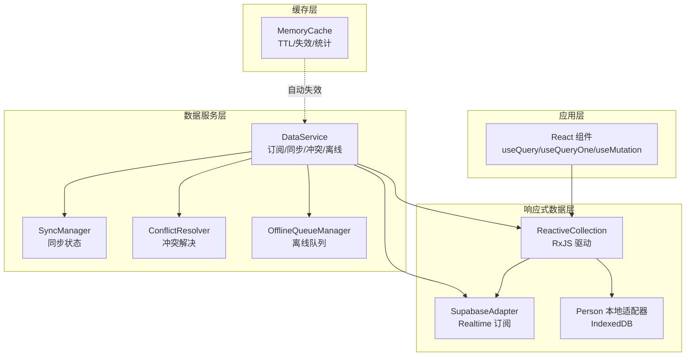
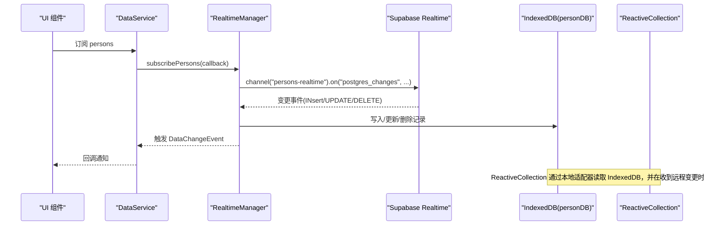
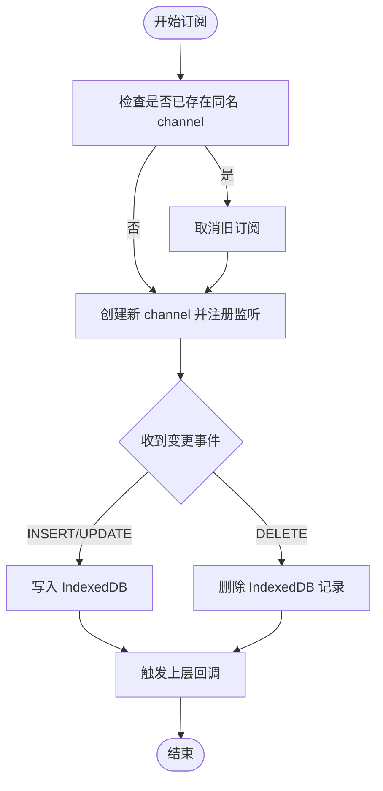
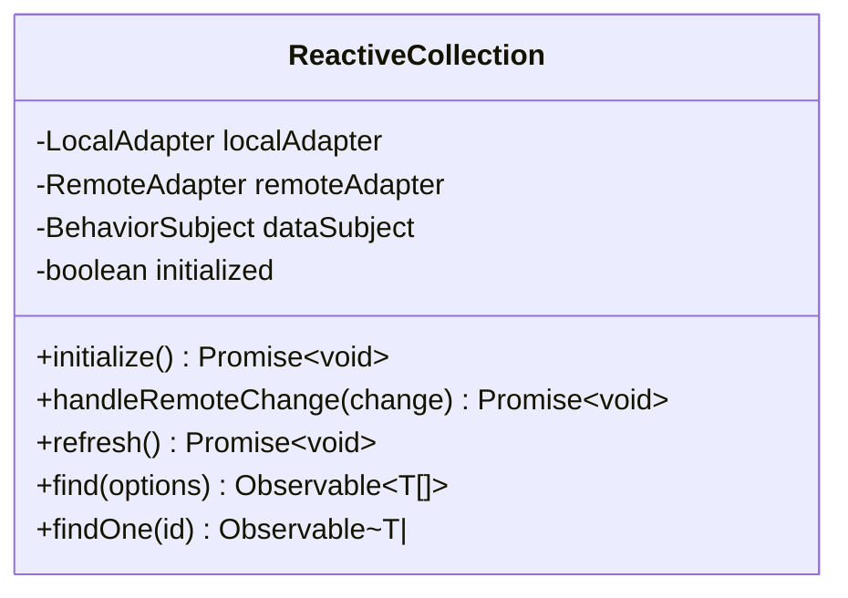
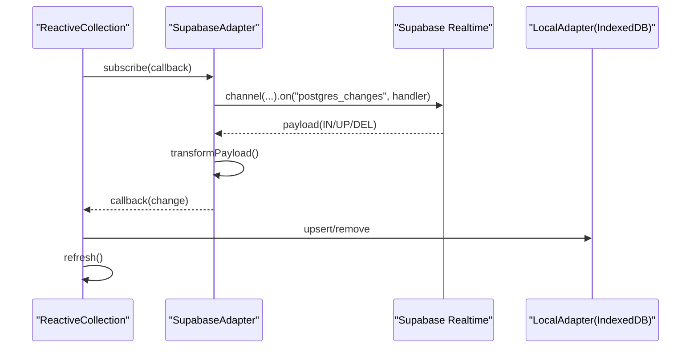
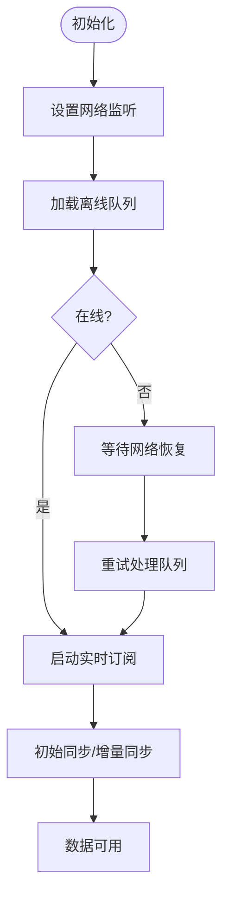
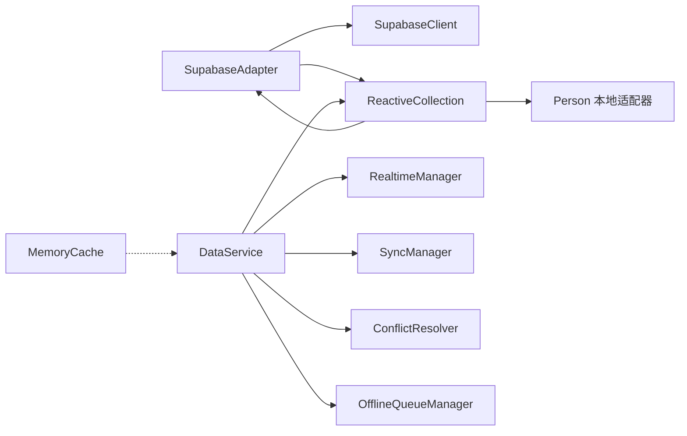

# 实时订阅系统

<cite>
**本文档引用的文件**
- [realtimeManager.ts](file://app/src/services/data/realtime/realtimeManager.ts)
- [SupabaseAdapter.ts](file://app/src/lib/reactive/adapters/SupabaseAdapter.ts)
- [ReactiveCollection.ts](file://app/src/lib/reactive/ReactiveCollection.ts)
- [personAdapter.ts](file://app/src/services/data/adapters/personAdapter.ts)
- [DataService.ts](file://app/src/services/data/DataService.ts)
- [memoryCache.ts](file://app/src/services/cache/memoryCache.ts)
- [conflictResolver.ts](file://app/src/services/data/conflict/conflictResolver.ts)
- [offlineQueueManager.ts](file://app/src/services/data/offline-queue/offlineQueueManager.ts)
- [syncManager.ts](file://app/src/services/data/sync/syncManager.ts)
- [index.ts](file://app/src/lib/reactive/index.ts)
- [hooks/index.ts](file://app/src/lib/reactive/hooks/index.ts)
</cite>

## 目录
1. [简介](#简介)
2. [项目结构](#项目结构)
3. [核心组件](#核心组件)
4. [架构总览](#架构总览)
5. [详细组件分析](#详细组件分析)
6. [依赖关系分析](#依赖关系分析)
7. [性能考量](#性能考量)
8. [故障排查指南](#故障排查指南)
9. [结论](#结论)
10. [附录](#附录)

## 简介
本文件面向 OPC-Starter 的实时订阅系统，聚焦 Supabase Realtime 订阅的实现机制，涵盖连接建立、订阅管理、事件监听、变更事件处理流程（数据变更检测、增量同步、冲突预防）、以及实时数据的本地缓存策略（缓存更新、失效处理、性能优化）。同时提供最佳实践与常见问题解决方案，帮助开发者在复杂网络环境下实现稳定、高效的实时数据同步。

## 项目结构
实时订阅系统围绕以下模块协同工作：
- 数据服务层：统一入口，负责订阅生命周期管理、初始同步、增量同步、冲突解决与离线队列处理
- 响应式数据层：基于 RxJS 的 ReactiveCollection，桥接本地/远程适配器，实现变更事件的本地应用与 UI 订阅
- 适配器层：SupabaseAdapter 提供 Supabase Realtime 订阅能力；Person 本地适配器对接 IndexedDB
- 缓存层：内存缓存配合实时事件自动失效，提升读性能与一致性
- 离线与冲突：离线队列保障网络异常时的写入可靠性；冲突解决器保证多源数据一致性

图表来源
- [DataService.ts:71-131](file://app/src/services/data/DataService.ts#L71-L131)
- [ReactiveCollection.ts:16-47](file://app/src/lib/reactive/ReactiveCollection.ts#L16-L47)
- [SupabaseAdapter.ts:11-19](file://app/src/lib/reactive/adapters/SupabaseAdapter.ts#L11-L19)
- [personAdapter.ts:12-46](file://app/src/services/data/adapters/personAdapter.ts#L12-L46)
- [memoryCache.ts:20-178](file://app/src/services/cache/memoryCache.ts#L20-L178)

章节来源
- [DataService.ts:71-131](file://app/src/services/data/DataService.ts#L71-L131)
- [ReactiveCollection.ts:16-47](file://app/src/lib/reactive/ReactiveCollection.ts#L16-L47)
- [SupabaseAdapter.ts:11-19](file://app/src/lib/reactive/adapters/SupabaseAdapter.ts#L11-L19)
- [personAdapter.ts:12-46](file://app/src/services/data/adapters/personAdapter.ts#L12-L46)
- [memoryCache.ts:20-178](file://app/src/services/cache/memoryCache.ts#L20-L178)

## 核心组件
- DataService：统一数据访问入口，协调订阅、同步、冲突与离线队列，提供 persons 集合的响应式访问
- RealtimeManager：封装 Supabase Realtime 订阅，接收变更事件并更新 IndexedDB
- ReactiveCollection：RxJS 驱动的响应式集合，订阅远程变更并应用到本地存储
- SupabaseAdapter：实现 RemoteAdapter 接口，提供基于 Supabase Realtime 的订阅能力
- Person 本地适配器：将 IndexedDB 封装为 LocalAdapter，供 ReactiveCollection 使用
- MemoryCache：内存缓存，支持 TTL、批量失效与基于实时事件的自动失效
- ConflictResolver：冲突检测与解决，支持多种合并策略
- OfflineQueueManager：离线写入队列，保障网络异常时的数据一致性
- SyncManager：同步状态管理，提供状态变更通知

章节来源
- [DataService.ts:71-131](file://app/src/services/data/DataService.ts#L71-L131)
- [realtimeManager.ts:22-121](file://app/src/services/data/realtime/realtimeManager.ts#L22-L121)
- [ReactiveCollection.ts:16-93](file://app/src/lib/reactive/ReactiveCollection.ts#L16-L93)
- [SupabaseAdapter.ts:11-151](file://app/src/lib/reactive/adapters/SupabaseAdapter.ts#L11-L151)
- [personAdapter.ts:12-46](file://app/src/services/data/adapters/personAdapter.ts#L12-L46)
- [memoryCache.ts:20-178](file://app/src/services/cache/memoryCache.ts#L20-L178)
- [conflictResolver.ts:69-136](file://app/src/services/data/conflict/conflictResolver.ts#L69-L136)
- [offlineQueueManager.ts:24-167](file://app/src/services/data/offline-queue/offlineQueueManager.ts#L24-L167)
- [syncManager.ts:14-47](file://app/src/services/data/sync/syncManager.ts#L14-L47)

## 架构总览
实时订阅系统采用“本地优先 + 实时订阅 + 离线回放”的设计：
- 读：优先从 IndexedDB（本地）读取，保证低延迟
- 写：先写 Supabase（权威），成功后再更新本地 IndexedDB
- 订阅：通过 Supabase Realtime 订阅核心表（如 profiles），实时推送变更到本地 IndexedDB
- 冲突：当本地与远端存在版本差异时，使用冲突解决器进行合并或择优
- 离线：网络异常时写入离线队列，恢复在线后重放

图表来源
- [DataService.ts:187-214](file://app/src/services/data/DataService.ts#L187-L214)
- [realtimeManager.ts:34-93](file://app/src/services/data/realtime/realtimeManager.ts#L34-L93)
- [ReactiveCollection.ts:43-75](file://app/src/lib/reactive/ReactiveCollection.ts#L43-L75)

章节来源
- [DataService.ts:187-214](file://app/src/services/data/DataService.ts#L187-L214)
- [realtimeManager.ts:34-93](file://app/src/services/data/realtime/realtimeManager.ts#L34-L93)
- [ReactiveCollection.ts:43-75](file://app/src/lib/reactive/ReactiveCollection.ts#L43-L75)

## 详细组件分析

### RealtimeManager：Supabase Realtime 订阅管理
- 订阅建立：为指定表（如 profiles）创建 Realtime channel，监听 postgres_changes 事件
- 事件处理：根据事件类型（INSERT/UPDATE/DELETE）更新 IndexedDB，并触发上层回调
- 生命周期管理：提供 subscribePersons/subscribeAll/cleanup，支持重复订阅时的去重与清理
- 与 DataService 协作：作为 DataService 的子模块，负责核心表的实时订阅与本地落库

图表来源
- [realtimeManager.ts:34-93](file://app/src/services/data/realtime/realtimeManager.ts#L34-L93)

章节来源
- [realtimeManager.ts:22-121](file://app/src/services/data/realtime/realtimeManager.ts#L22-L121)

### ReactiveCollection：响应式集合与变更应用
- 初始化：从本地适配器加载初始数据，设置数据流
- 远程订阅：若配置了 RemoteAdapter，则订阅变更事件
- 变更应用：根据 INSERT/UPDATE/DELETE 类型对本地数据进行 upsert/remove，并刷新数据流
- 查询与订阅：提供 find/findOne 等查询方法，返回 Observable 供 UI 订阅

图表来源
- [ReactiveCollection.ts:16-93](file://app/src/lib/reactive/ReactiveCollection.ts#L16-L93)

章节来源
- [ReactiveCollection.ts:16-93](file://app/src/lib/reactive/ReactiveCollection.ts#L16-L93)

### SupabaseAdapter：Supabase 实时订阅适配器
- 订阅接口：为任意表创建独立 channel，监听 postgres_changes 事件
- 事件转换：将 Supabase payload 转换为统一的 Change<T> 结构（INSERT/UPDATE/DELETE）
- 生命周期：返回取消订阅函数，支持移除 channel
- 与 ReactiveCollection 集成：作为 RemoteAdapter，驱动 ReactiveCollection 的本地变更应用

图表来源
- [SupabaseAdapter.ts:98-150](file://app/src/lib/reactive/adapters/SupabaseAdapter.ts#L98-L150)
- [ReactiveCollection.ts:43-75](file://app/src/lib/reactive/ReactiveCollection.ts#L43-L75)

章节来源
- [SupabaseAdapter.ts:98-150](file://app/src/lib/reactive/adapters/SupabaseAdapter.ts#L98-L150)
- [ReactiveCollection.ts:43-75](file://app/src/lib/reactive/ReactiveCollection.ts#L43-L75)

### Person 本地适配器：IndexedDB 本地存储
- 功能：将 IndexedDB 的 Person 数据封装为 LocalAdapter 接口
- 方法：findAll/findOne/query/upsert/bulkUpsert/remove/clear
- 作用：为 ReactiveCollection 提供本地数据源，支撑实时订阅后的本地读取

章节来源
- [personAdapter.ts:12-46](file://app/src/services/data/adapters/personAdapter.ts#L12-L46)

### DataService：统一数据访问与实时编排
- 订阅管理：对外暴露 subscribePersons/subscribeAll/cleanup，内部委托 RealtimeManager
- 初始同步：通过 SyncOrchestrator 完成首次全量同步
- 增量同步：提供 incrementalSync，结合冲突解决器与离线队列实现高效增量
- 离线队列：在网络异常时缓存写操作，恢复在线后重放
- 冲突解决：在写入与订阅场景中调用冲突解决器，确保数据一致性

图表来源
- [DataService.ts:128-171](file://app/src/services/data/DataService.ts#L128-L171)
- [DataService.ts:201-224](file://app/src/services/data/DataService.ts#L201-L224)

章节来源
- [DataService.ts:71-131](file://app/src/services/data/DataService.ts#L71-L131)
- [DataService.ts:187-214](file://app/src/services/data/DataService.ts#L187-L214)
- [DataService.ts:201-224](file://app/src/services/data/DataService.ts#L201-L224)

### 冲突解决器：冲突检测与合并
- 策略：支持 server-wins、local-wins、merge、latest 等策略
- 逻辑：比较本地与远端版本号，决定保留哪一方或进行智能合并
- 统计：记录冲突总数、服务端胜出次数、本地胜出次数与合并次数

章节来源
- [conflictResolver.ts:69-136](file://app/src/services/data/conflict/conflictResolver.ts#L69-L136)

### 离线队列管理器：离线优先写入
- 功能：在网络不可用时缓存写操作到 localStorage，恢复在线后按序重放
- 重试：最多重试 3 次，指数退避，避免频繁重试造成压力
- 状态：提供队列统计、加载/保存、清空等能力

章节来源
- [offlineQueueManager.ts:24-167](file://app/src/services/data/offline-queue/offlineQueueManager.ts#L24-L167)

### 内存缓存：实时失效与性能优化
- 设计：支持 TTL、批量失效、并发请求去重、统计接口
- 自动失效：监听 dataservice:*-change 事件，按业务域自动清理相关缓存键
- 适用场景：组织树、用户资料等相对稳定的实体

章节来源
- [memoryCache.ts:20-178](file://app/src/services/cache/memoryCache.ts#L20-L178)

## 依赖关系分析
- ReactiveCollection 依赖 LocalAdapter（Person 本地适配器）与可选的 RemoteAdapter（SupabaseAdapter）
- DataService 依赖 RealtimeManager、SyncManager、ConflictResolver、OfflineQueueManager
- SupabaseAdapter 依赖 SupabaseClient 与 RealtimeChannel
- MemoryCache 与 DataService 通过事件通信实现自动失效

图表来源
- [index.ts:5-8](file://app/src/lib/reactive/index.ts#L5-L8)
- [DataService.ts:83-109](file://app/src/services/data/DataService.ts#L83-L109)
- [memoryCache.ts:180-191](file://app/src/services/cache/memoryCache.ts#L180-L191)

章节来源
- [index.ts:5-8](file://app/src/lib/reactive/index.ts#L5-L8)
- [DataService.ts:83-109](file://app/src/services/data/DataService.ts#L83-L109)
- [memoryCache.ts:180-191](file://app/src/services/cache/memoryCache.ts#L180-L191)

## 性能考量
- 读性能：优先本地 IndexedDB，减少网络往返；ReactiveCollection 以 RxJS 流形式推送增量更新
- 写性能：先写 Supabase，成功后再更新本地，避免重复网络请求
- 订阅粒度：按表维度订阅，避免过度订阅导致的带宽与 CPU 压力
- 缓存策略：MemoryCache 配置合理 TTL，热点数据短 TTL，稳定数据长 TTL；自动失效降低陈旧数据风险
- 离线回放：离线队列按序重放，避免并发写入造成的抖动
- UI 订阅：useQuery/useQueryOne/useMutation 提供细粒度订阅，避免不必要的重渲染

## 故障排查指南
- 订阅未生效
  - 检查 RealtimeManager 是否正确创建 channel 并注册监听
  - 确认 Supabase 表权限与 Realtime 配置
  - 查看控制台日志确认事件是否到达
- 本地数据不同步
  - 检查 ReactiveCollection 是否正确订阅远程变更
  - 确认本地适配器 upsert/remove 是否正常执行
  - 核对 IndexedDB 是否成功写入
- 冲突导致数据异常
  - 检查冲突解决器策略与版本号字段
  - 关注冲突统计，定位高频冲突场景
- 离线写入未重放
  - 检查离线队列是否持久化到 localStorage
  - 确认网络恢复后是否触发队列处理
  - 查看重试次数与指数退避逻辑
- 缓存脏读
  - 确认 dataservice:*-change 事件是否正确触发
  - 检查 MemoryCache 的自动失效逻辑与键前缀

章节来源
- [realtimeManager.ts:52-86](file://app/src/services/data/realtime/realtimeManager.ts#L52-L86)
- [ReactiveCollection.ts:56-75](file://app/src/lib/reactive/ReactiveCollection.ts#L56-L75)
- [conflictResolver.ts:77-116](file://app/src/services/data/conflict/conflictResolver.ts#L77-L116)
- [offlineQueueManager.ts:64-102](file://app/src/services/data/offline-queue/offlineQueueManager.ts#L64-L102)
- [memoryCache.ts:180-191](file://app/src/services/cache/memoryCache.ts#L180-L191)

## 结论
OPC-Starter 的实时订阅系统通过“本地优先 + 实时订阅 + 离线回放 + 冲突解决”的组合，实现了在复杂网络环境下的高可用与高性能数据同步。Supabase Realtime 提供可靠的变更事件通道，ReactiveCollection 与适配器层确保变更被正确应用到本地存储，MemoryCache 与 SyncManager 提升了读性能与状态可见性。配合冲突解决器与离线队列，系统在离线、弱网、并发写入等场景下仍能保持数据一致性与用户体验。

## 附录
- 最佳实践
  - 为每个核心表单独建立订阅，避免广播风暴
  - 对热点数据设置较短 TTL，对稳定数据设置较长 TTL
  - 在 UI 层使用细粒度订阅，避免全局重渲染
  - 明确冲突解决策略，必要时引入版本号字段
  - 离线队列仅存放写操作，读操作始终走本地缓存
- 常见问题
  - 订阅重复：RealtimeManager 已内置去重逻辑，无需手动处理
  - 事件丢失：检查 Supabase Realtime 配置与网络稳定性
  - 内存泄漏：确保在组件卸载时调用取消订阅函数
  - 缓存膨胀：定期清理过期缓存与批量失效