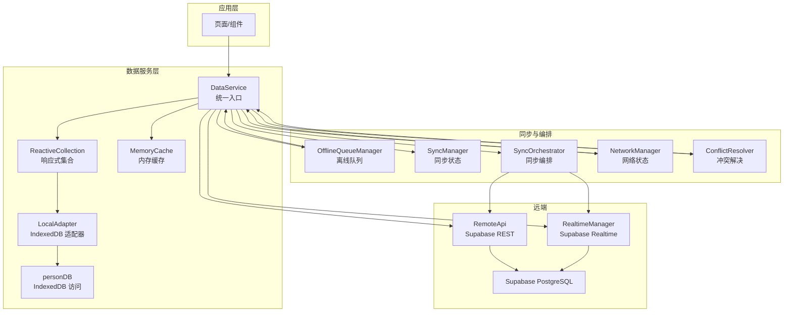
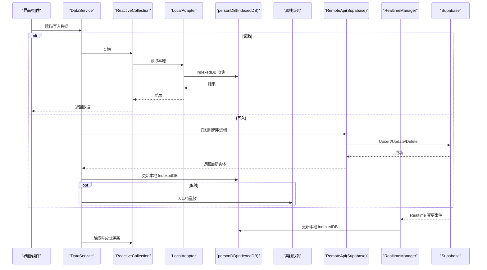
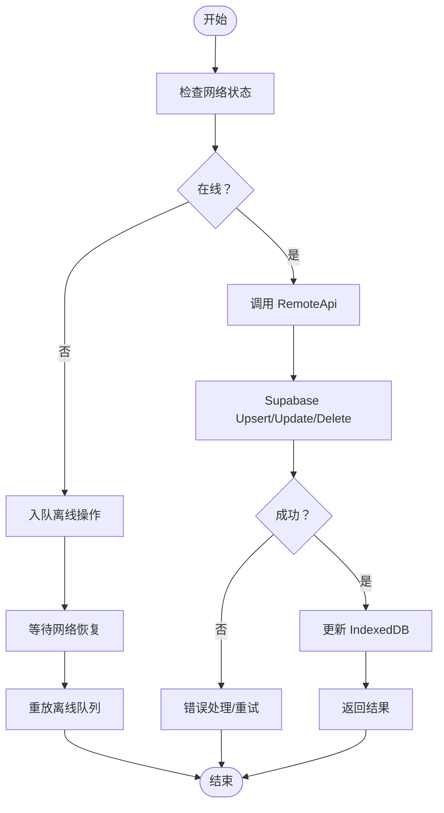
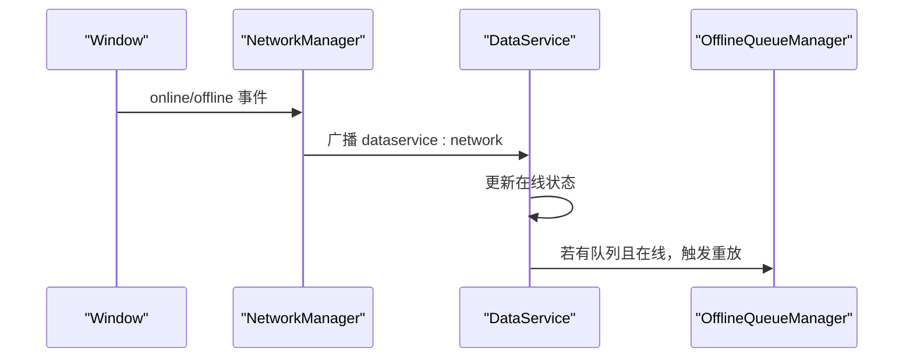
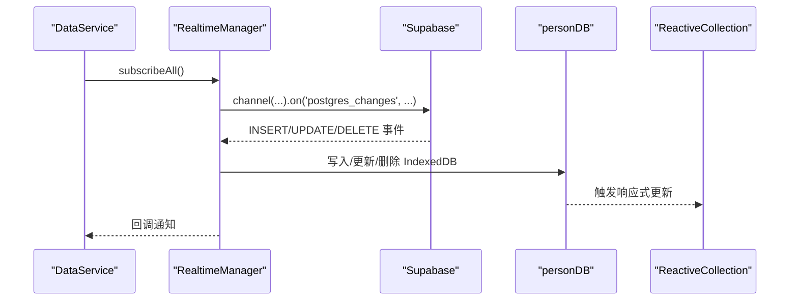
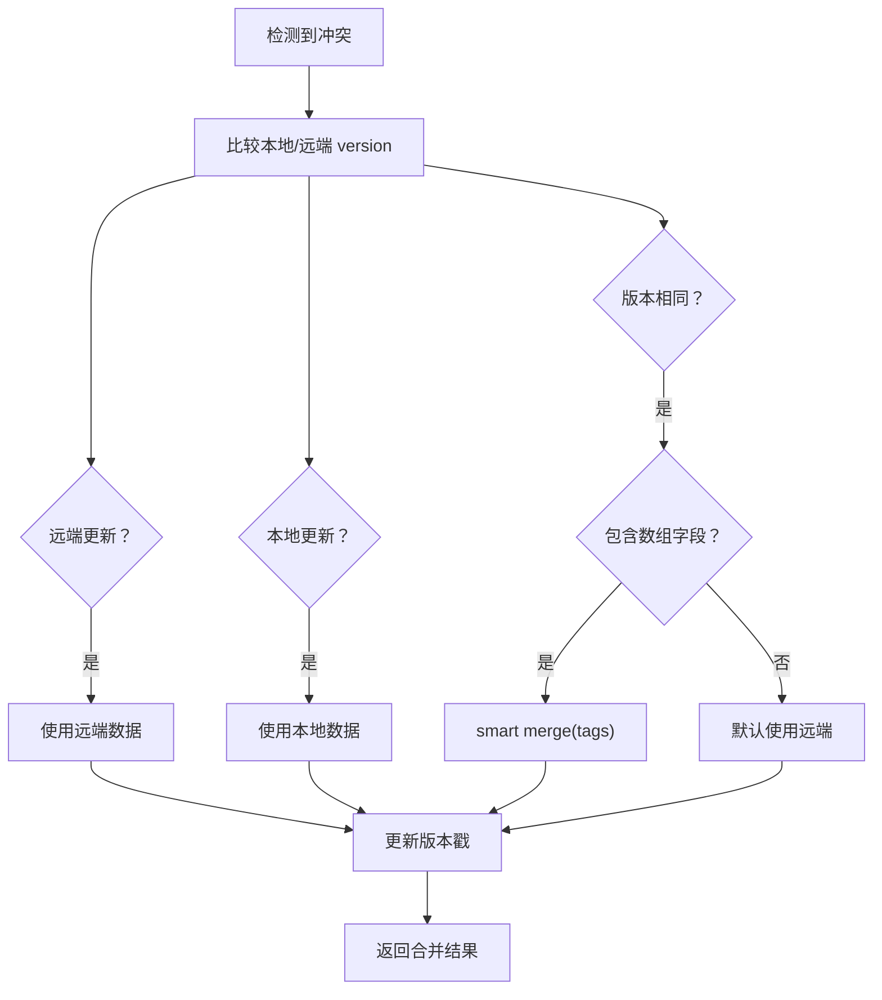
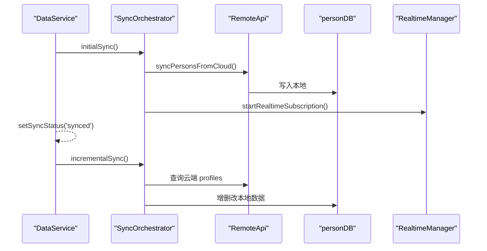
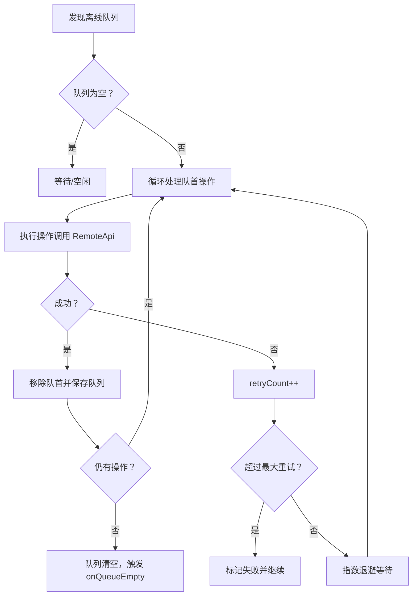
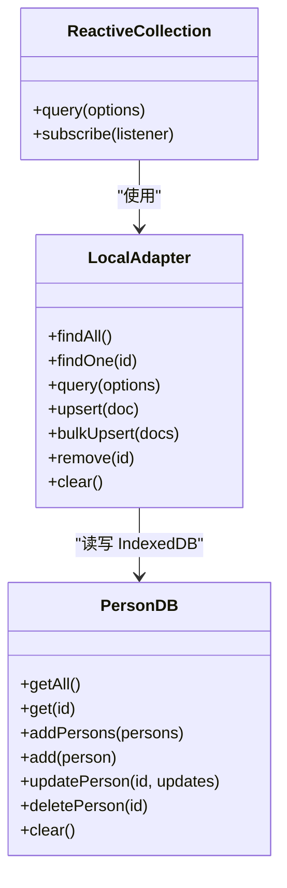
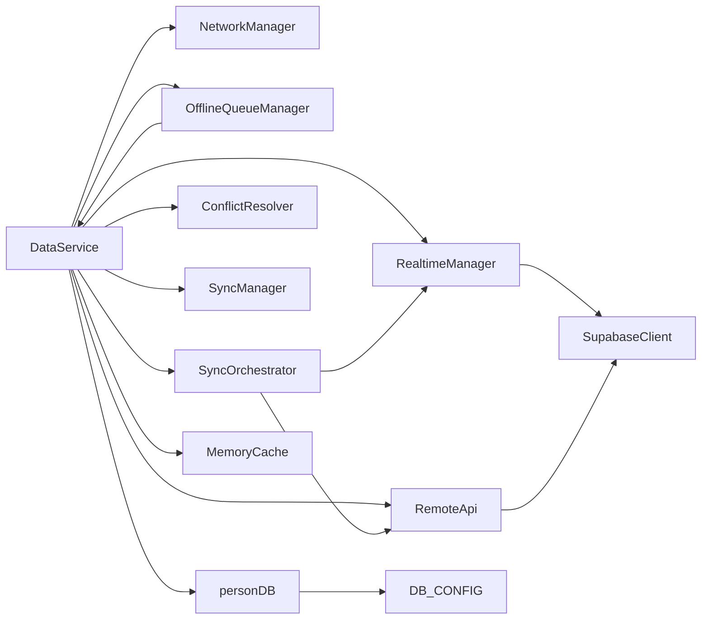

# 数据流设计

<cite>
**本文引用的文件**
- [app/src/services/data/DataService.ts](file://app/src/services/data/DataService.ts)
- [app/src/services/db/personDB.ts](file://app/src/services/db/personDB.ts)
- [app/src/services/cache/memoryCache.ts](file://app/src/services/cache/memoryCache.ts)
- [app/src/services/data/adapters/personAdapter.ts](file://app/src/services/data/adapters/personAdapter.ts)
- [app/src/services/data/realtime/realtimeManager.ts](file://app/src/services/data/realtime/realtimeManager.ts)
- [app/src/services/data/offline-queue/offlineQueueManager.ts](file://app/src/services/data/offline-queue/offlineQueueManager.ts)
- [app/src/services/data/sync/syncManager.ts](file://app/src/services/data/sync/syncManager.ts)
- [app/src/services/data/network/networkManager.ts](file://app/src/services/data/network/networkManager.ts)
- [app/src/services/data/sync/syncOrchestrator.ts](file://app/src/services/data/sync/syncOrchestrator.ts)
- [app/src/services/data/conflict/conflictResolver.ts](file://app/src/services/data/conflict/conflictResolver.ts)
- [app/src/services/data/remote/remoteApi.ts](file://app/src/services/data/remote/remoteApi.ts)
- [app/src/lib/reactive/index.ts](file://app/src/lib/reactive/index.ts)
- [app/src/config/constants.ts](file://app/src/config/constants.ts)
</cite>

## 目录
1. [引言](#引言)
2. [项目结构](#项目结构)
3. [核心组件](#核心组件)
4. [架构总览](#架构总览)
5. [详细组件分析](#详细组件分析)
6. [依赖关系分析](#依赖关系分析)
7. [性能考量](#性能考量)
8. [故障排查指南](#故障排查指南)
9. [结论](#结论)
10. [附录](#附录)

## 引言
本文件面向 OPC-Starter 的数据流设计，系统性阐述“缓存 + 实时”数据流模式的设计原理与实现机制。重点覆盖：
- 本地缓存（IndexedDB）与远程数据库（Supabase PostgreSQL）之间的数据同步策略
- 乐观更新、冲突检测与解决机制
- 网络状态管理：在线/离线检测、异常处理、重连机制
- 实时数据同步：Supabase Realtime 订阅、变更事件处理、增量同步
- 数据流向图与时序图，展示典型读写与同步流程

## 项目结构
围绕数据服务的核心模块由以下层次构成：
- 顶层统一入口：DataService（单例）
- 本地存储层：IndexedDB（personDB）
- 适配器层：LocalAdapter（ReactiveCollection 与 IndexedDB 的桥接）
- 远端交互层：Remote API（Supabase REST/UPSERT）
- 实时订阅层：Realtime Manager（Supabase Realtime）
- 离线队列层：Offline Queue Manager（localStorage 缓存待同步操作）
- 冲突解决层：Conflict Resolver（版本比较与合并策略）
- 同步编排层：Sync Orchestrator（初始同步、增量同步、强制全量同步）
- 网络状态层：Network Manager（online/offline 事件监听与广播）
- 缓存层：MemoryCache（短期内存缓存，配合 Realtime 自动失效）

图表来源
- [app/src/services/data/DataService.ts:71-131](file://app/src/services/data/DataService.ts#L71-L131)
- [app/src/services/db/personDB.ts:11-115](file://app/src/services/db/personDB.ts#L11-L115)
- [app/src/services/data/adapters/personAdapter.ts:12-46](file://app/src/services/data/adapters/personAdapter.ts#L12-L46)
- [app/src/services/data/remote/remoteApi.ts:21-163](file://app/src/services/data/remote/remoteApi.ts#L21-L163)
- [app/src/services/data/realtime/realtimeManager.ts:22-121](file://app/src/services/data/realtime/realtimeManager.ts#L22-L121)
- [app/src/services/data/offline-queue/offlineQueueManager.ts:24-167](file://app/src/services/data/offline-queue/offlineQueueManager.ts#L24-L167)
- [app/src/services/data/sync/syncManager.ts:14-47](file://app/src/services/data/sync/syncManager.ts#L14-L47)
- [app/src/services/data/sync/syncOrchestrator.ts:34-209](file://app/src/services/data/sync/syncOrchestrator.ts#L34-L209)
- [app/src/services/data/network/networkManager.ts:19-72](file://app/src/services/data/network/networkManager.ts#L19-L72)
- [app/src/services/data/conflict/conflictResolver.ts:69-136](file://app/src/services/data/conflict/conflictResolver.ts#L69-L136)
- [app/src/services/cache/memoryCache.ts:20-178](file://app/src/services/cache/memoryCache.ts#L20-L178)

章节来源
- [app/src/services/data/DataService.ts:11-419](file://app/src/services/data/DataService.ts#L11-L419)
- [app/src/config/constants.ts:50-60](file://app/src/config/constants.ts#L50-L60)

## 核心组件
- DataService（单例）：统一协调读写、离线队列、实时订阅、同步编排、网络状态与冲突解决；对外暴露 ReactiveCollection 与同步状态查询。
- personDB：IndexedDB 访问封装，提供批量/单条 CRUD。
- LocalAdapter：将 IndexedDB 映射为 ReactiveCollection 的本地适配器。
- RemoteApi：与 Supabase 交互，负责 Upsert/Select/Update/Delete 以及云端数据转换。
- RealtimeManager：订阅 Supabase Realtime，接收 INSERT/UPDATE/DELETE 事件并更新本地 IndexedDB。
- OfflineQueueManager：在离线状态下缓存写操作，恢复在线后重放并带指数退避重试。
- SyncManager：维护同步状态与回调通知。
- SyncOrchestrator：控制初始同步、增量同步与强制全量同步，并记录最近一次全量同步时间。
- NetworkManager：监听 online/offline 事件并向 DataService 广播。
- ConflictResolver：基于版本号的冲突检测与多策略合并。
- MemoryCache：短期内存缓存，结合 Realtime 事件自动失效。

章节来源
- [app/src/services/data/DataService.ts:71-419](file://app/src/services/data/DataService.ts#L71-L419)
- [app/src/services/db/personDB.ts:11-115](file://app/src/services/db/personDB.ts#L11-L115)
- [app/src/services/data/adapters/personAdapter.ts:12-46](file://app/src/services/data/adapters/personAdapter.ts#L12-L46)
- [app/src/services/data/remote/remoteApi.ts:21-163](file://app/src/services/data/remote/remoteApi.ts#L21-L163)
- [app/src/services/data/realtime/realtimeManager.ts:22-121](file://app/src/services/data/realtime/realtimeManager.ts#L22-L121)
- [app/src/services/data/offline-queue/offlineQueueManager.ts:24-167](file://app/src/services/data/offline-queue/offlineQueueManager.ts#L24-L167)
- [app/src/services/data/sync/syncManager.ts:14-47](file://app/src/services/data/sync/syncManager.ts#L14-L47)
- [app/src/services/data/sync/syncOrchestrator.ts:34-209](file://app/src/services/data/sync/syncOrchestrator.ts#L34-L209)
- [app/src/services/data/network/networkManager.ts:19-72](file://app/src/services/data/network/networkManager.ts#L19-L72)
- [app/src/services/data/conflict/conflictResolver.ts:69-136](file://app/src/services/data/conflict/conflictResolver.ts#L69-L136)
- [app/src/services/cache/memoryCache.ts:20-178](file://app/src/services/cache/memoryCache.ts#L20-L178)

## 架构总览
下图展示 Cache + Realtime 数据流模式的整体交互：

图表来源
- [app/src/services/data/DataService.ts:326-414](file://app/src/services/data/DataService.ts#L326-L414)
- [app/src/services/data/remote/remoteApi.ts:64-109](file://app/src/services/data/remote/remoteApi.ts#L64-L109)
- [app/src/services/data/realtime/realtimeManager.ts:34-93](file://app/src/services/data/realtime/realtimeManager.ts#L34-L93)
- [app/src/services/db/personDB.ts:48-111](file://app/src/services/db/personDB.ts#L48-L111)

## 详细组件分析

### 读写与缓存策略
- 读优先：ReactiveCollection 通过 LocalAdapter 从 IndexedDB 读取，保证低延迟。
- 写优先：先写 Supabase（权威），成功后再更新 IndexedDB（缓存），确保一致性。
- 乐观更新：UI 层可先局部更新视图，若远端失败再回滚或提示重试。
- 缓存层：MemoryCache 提供短期缓存（如组织树、用户资料），支持 TTL、并发去重与自动失效。

图表来源
- [app/src/services/data/DataService.ts:335-414](file://app/src/services/data/DataService.ts#L335-L414)
- [app/src/services/data/remote/remoteApi.ts:64-109](file://app/src/services/data/remote/remoteApi.ts#L64-L109)
- [app/src/services/data/offline-queue/offlineQueueManager.ts:49-102](file://app/src/services/data/offline-queue/offlineQueueManager.ts#L49-L102)

章节来源
- [app/src/services/data/DataService.ts:326-414](file://app/src/services/data/DataService.ts#L326-L414)
- [app/src/services/cache/memoryCache.ts:46-110](file://app/src/services/cache/memoryCache.ts#L46-L110)

### 网络状态管理
- 监听 window.online/offline，设置在线标志并广播自定义事件。
- 在线回调触发离线队列重放与增量同步；离线时仅入队不执行。
- 提供 isOnline/checkOnline/getNetworkStatus 等便捷查询。

图表来源
- [app/src/services/data/network/networkManager.ts:32-49](file://app/src/services/data/network/networkManager.ts#L32-L49)
- [app/src/services/data/DataService.ts:153-171](file://app/src/services/data/DataService.ts#L153-L171)
- [app/src/services/data/offline-queue/offlineQueueManager.ts:104-143](file://app/src/services/data/offline-queue/offlineQueueManager.ts#L104-L143)

章节来源
- [app/src/services/data/network/networkManager.ts:19-72](file://app/src/services/data/network/networkManager.ts#L19-L72)
- [app/src/services/data/DataService.ts:151-183](file://app/src/services/data/DataService.ts#L151-L183)

### 实时数据同步（Supabase Realtime）
- 订阅 profiles 表的 postgres_changes 事件，处理 INSERT/UPDATE/DELETE。
- 将远端变更转换为本地实体并写入 IndexedDB，随后通过 ReactiveCollection 通知 UI。
- 提供 subscribePersons/subscribeAll/cleanup 管理订阅生命周期。

图表来源
- [app/src/services/data/realtime/realtimeManager.ts:34-93](file://app/src/services/data/realtime/realtimeManager.ts#L34-L93)
- [app/src/services/data/DataService.ts:187-214](file://app/src/services/data/DataService.ts#L187-L214)

章节来源
- [app/src/services/data/realtime/realtimeManager.ts:22-121](file://app/src/services/data/realtime/realtimeManager.ts#L22-L121)
- [app/src/services/data/DataService.ts:185-214](file://app/src/services/data/DataService.ts#L185-L214)

### 冲突检测与解决
- 冲突依据：实体的 version 字段（时间戳）比较。
- 策略：
  - 远端版本新：server-wins
  - 本地版本新：local-wins
  - 版本相同：对数组字段（如 tags）执行 smart merge 或默认 prefer remote
- 统计：记录 total/serverWins/localWins/merged，便于监控与调试。

图表来源
- [app/src/services/data/conflict/conflictResolver.ts:77-116](file://app/src/services/data/conflict/conflictResolver.ts#L77-L116)

章节来源
- [app/src/services/data/conflict/conflictResolver.ts:69-136](file://app/src/services/data/conflict/conflictResolver.ts#L69-L136)

### 同步编排（初始/增量/强制全量）
- 初始同步：在线且用户已登录时，拉取云端数据写入本地，完成后启动 Realtime 订阅。
- 增量同步：周期性（默认 5 分钟）对比本地与云端 ID 集合，执行新增/删除/更新。
- 强制全量：清空本地后重新执行初始同步。

图表来源
- [app/src/services/data/sync/syncOrchestrator.ts:37-86](file://app/src/services/data/sync/syncOrchestrator.ts#L37-L86)
- [app/src/services/data/sync/syncOrchestrator.ts:88-189](file://app/src/services/data/sync/syncOrchestrator.ts#L88-L189)
- [app/src/services/data/remote/remoteApi.ts:111-131](file://app/src/services/data/remote/remoteApi.ts#L111-L131)

章节来源
- [app/src/services/data/sync/syncOrchestrator.ts:34-209](file://app/src/services/data/sync/syncOrchestrator.ts#L34-L209)
- [app/src/services/data/remote/remoteApi.ts:21-163](file://app/src/services/data/remote/remoteApi.ts#L21-L163)

### 离线队列与重放
- 离线时所有写操作入队（localStorage 持久化），恢复在线后按序重放。
- 指数退避重试（最大 3 次），失败达到阈值后放弃并标记失败。
- 队列清空时触发自定义事件，供上层 UI 或业务逻辑感知。

图表来源
- [app/src/services/data/offline-queue/offlineQueueManager.ts:64-143](file://app/src/services/data/offline-queue/offlineQueueManager.ts#L64-L143)
- [app/src/services/data/DataService.ts:242-278](file://app/src/services/data/DataService.ts#L242-L278)

章节来源
- [app/src/services/data/offline-queue/offlineQueueManager.ts:24-167](file://app/src/services/data/offline-queue/offlineQueueManager.ts#L24-L167)
- [app/src/services/data/DataService.ts:226-278](file://app/src/services/data/DataService.ts#L226-L278)

### 适配器与响应式集合
- LocalAdapter 将 IndexedDB 的 CRUD 映射为 ReactiveCollection 所需接口。
- ReactiveCollection 与 LocalAdapter 配合，实现本地数据的响应式查询与变更通知。
- 通过 DB_CONFIG 定义 Store 名称，确保索引与事务正确使用。

图表来源
- [app/src/services/data/adapters/personAdapter.ts:12-46](file://app/src/services/data/adapters/personAdapter.ts#L12-L46)
- [app/src/services/db/personDB.ts:11-115](file://app/src/services/db/personDB.ts#L11-L115)
- [app/src/lib/reactive/index.ts:5-22](file://app/src/lib/reactive/index.ts#L5-L22)
- [app/src/config/constants.ts:53-59](file://app/src/config/constants.ts#L53-L59)

章节来源
- [app/src/services/data/adapters/personAdapter.ts:12-46](file://app/src/services/data/adapters/personAdapter.ts#L12-L46)
- [app/src/services/db/personDB.ts:11-115](file://app/src/services/db/personDB.ts#L11-L115)
- [app/src/lib/reactive/index.ts:5-22](file://app/src/lib/reactive/index.ts#L5-L22)
- [app/src/config/constants.ts:53-59](file://app/src/config/constants.ts#L53-L59)

## 依赖关系分析
- DataService 作为中枢，依赖 NetworkManager、OfflineQueueManager、SyncOrchestrator、RealtimeManager、RemoteApi、ConflictResolver、SyncManager。
- RealtimeManager 依赖 SupabaseClient 与本地转换函数。
- OfflineQueueManager 依赖 localStorage 与执行回调（DataService.executeOperation）。
- SyncOrchestrator 依赖 RemoteApi 与 RealtimeManager。
- personDB 依赖 DB_CONFIG 与 IndexedDB 实例。
- MemoryCache 依赖窗口事件监听，自动失效组织与用户资料缓存。

图表来源
- [app/src/services/data/DataService.ts:76-109](file://app/src/services/data/DataService.ts#L76-L109)
- [app/src/services/data/realtime/realtimeManager.ts:22-24](file://app/src/services/data/realtime/realtimeManager.ts#L22-L24)
- [app/src/services/data/offline-queue/offlineQueueManager.ts:24-26](file://app/src/services/data/offline-queue/offlineQueueManager.ts#L24-L26)
- [app/src/services/data/sync/syncOrchestrator.ts:34-34](file://app/src/services/data/sync/syncOrchestrator.ts#L34-L34)
- [app/src/services/data/remote/remoteApi.ts:21-21](file://app/src/services/data/remote/remoteApi.ts#L21-L21)
- [app/src/services/db/personDB.ts:7-9](file://app/src/services/db/personDB.ts#L7-L9)
- [app/src/config/constants.ts:53-59](file://app/src/config/constants.ts#L53-L59)
- [app/src/services/cache/memoryCache.ts:181-191](file://app/src/services/cache/memoryCache.ts#L181-L191)

章节来源
- [app/src/services/data/DataService.ts:71-131](file://app/src/services/data/DataService.ts#L71-L131)
- [app/src/services/data/realtime/realtimeManager.ts:22-33](file://app/src/services/data/realtime/realtimeManager.ts#L22-L33)
- [app/src/services/data/offline-queue/offlineQueueManager.ts:24-47](file://app/src/services/data/offline-queue/offlineQueueManager.ts#L24-L47)
- [app/src/services/data/sync/syncOrchestrator.ts:34-34](file://app/src/services/data/sync/syncOrchestrator.ts#L34-L34)
- [app/src/services/data/remote/remoteApi.ts:21-21](file://app/src/services/data/remote/remoteApi.ts#L21-L21)
- [app/src/services/db/personDB.ts:7-9](file://app/src/services/db/personDB.ts#L7-L9)
- [app/src/config/constants.ts:53-59](file://app/src/config/constants.ts#L53-L59)
- [app/src/services/cache/memoryCache.ts:181-191](file://app/src/services/cache/memoryCache.ts#L181-L191)

## 性能考量
- 读路径：ReactiveCollection + LocalAdapter + IndexedDB，避免每次网络往返，提升首屏与滚动性能。
- 写路径：在线优先直连 Supabase，失败回滚；离线时立即落本地并异步重放，保障用户体验。
- 增量同步：定期对比 ID 集合，减少全量传输与解析成本。
- 冲突合并：基于版本号的快速判定，数组字段采用高效合并策略。
- 内存缓存：对静态/低频变更数据进行短期缓存，降低重复请求与计算开销。

## 故障排查指南
- 离线队列堆积：检查队列大小与失败操作，确认网络恢复后是否触发重放。
- 实时订阅未生效：确认订阅是否被取消、频道名称是否一致、Supabase 事件是否到达。
- 冲突过多：查看冲突统计，评估合并策略是否合理，必要时调整策略或增加版本字段。
- 增量同步无效：确认时间间隔、云端数据是否变更、本地 ID 集合是否正确构建。
- 网络状态异常：检查 online/offline 事件监听是否注册，CustomEvent 是否被正确派发。

章节来源
- [app/src/services/data/DataService.ts:291-307](file://app/src/services/data/DataService.ts#L291-L307)
- [app/src/services/data/offline-queue/offlineQueueManager.ts:104-143](file://app/src/services/data/offline-queue/offlineQueueManager.ts#L104-L143)
- [app/src/services/data/realtime/realtimeManager.ts:95-114](file://app/src/services/data/realtime/realtimeManager.ts#L95-L114)
- [app/src/services/data/sync/syncOrchestrator.ts:88-189](file://app/src/services/data/sync/syncOrchestrator.ts#L88-L189)
- [app/src/services/data/network/networkManager.ts:32-49](file://app/src/services/data/network/networkManager.ts#L32-L49)

## 结论
OPC-Starter 的数据流设计以“缓存优先 + 实时同步”为核心，结合离线队列与冲突解决机制，在保证数据一致性的同时最大化用户体验。通过清晰的模块边界与编排层，系统实现了高可用、可扩展且易于维护的数据通路。

## 附录
- 关键常量：IndexedDB 名称与 Store 名称定义于 DB_CONFIG，确保跨模块一致。
- 响应式导出：ReactiveCollection、SyncEngine、Adapter 与 Hooks 由 lib/reactive 统一导出，便于 UI 层使用。

章节来源
- [app/src/config/constants.ts:53-59](file://app/src/config/constants.ts#L53-L59)
- [app/src/lib/reactive/index.ts:5-22](file://app/src/lib/reactive/index.ts#L5-L22)