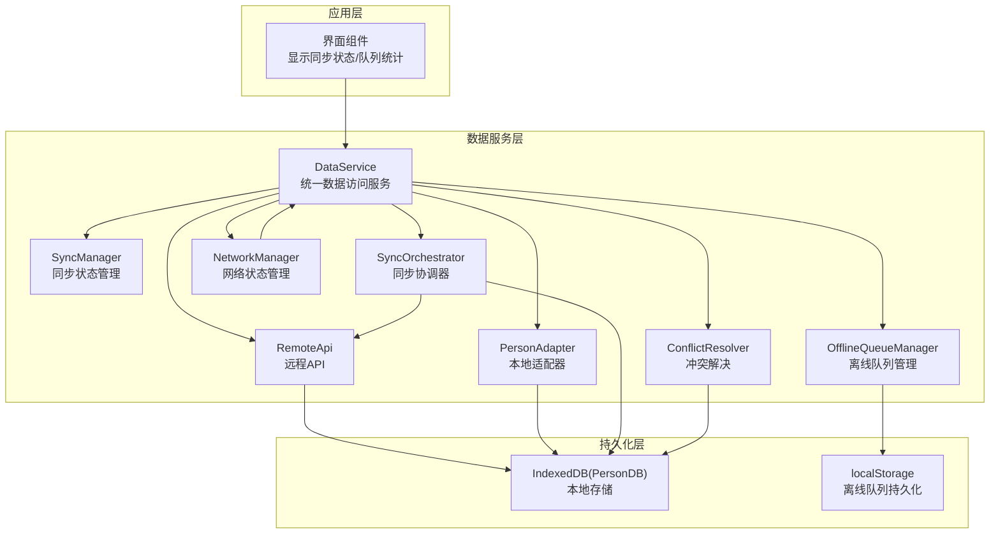
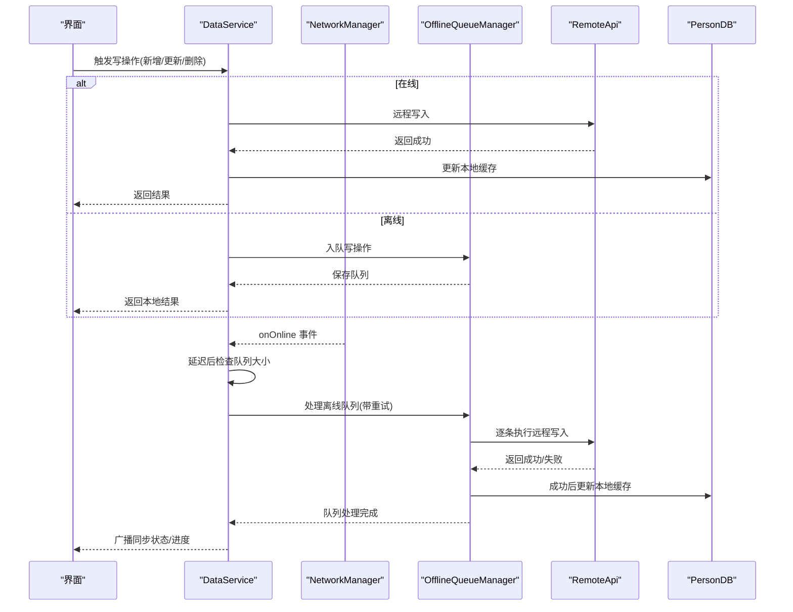
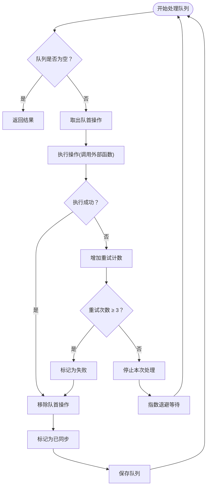
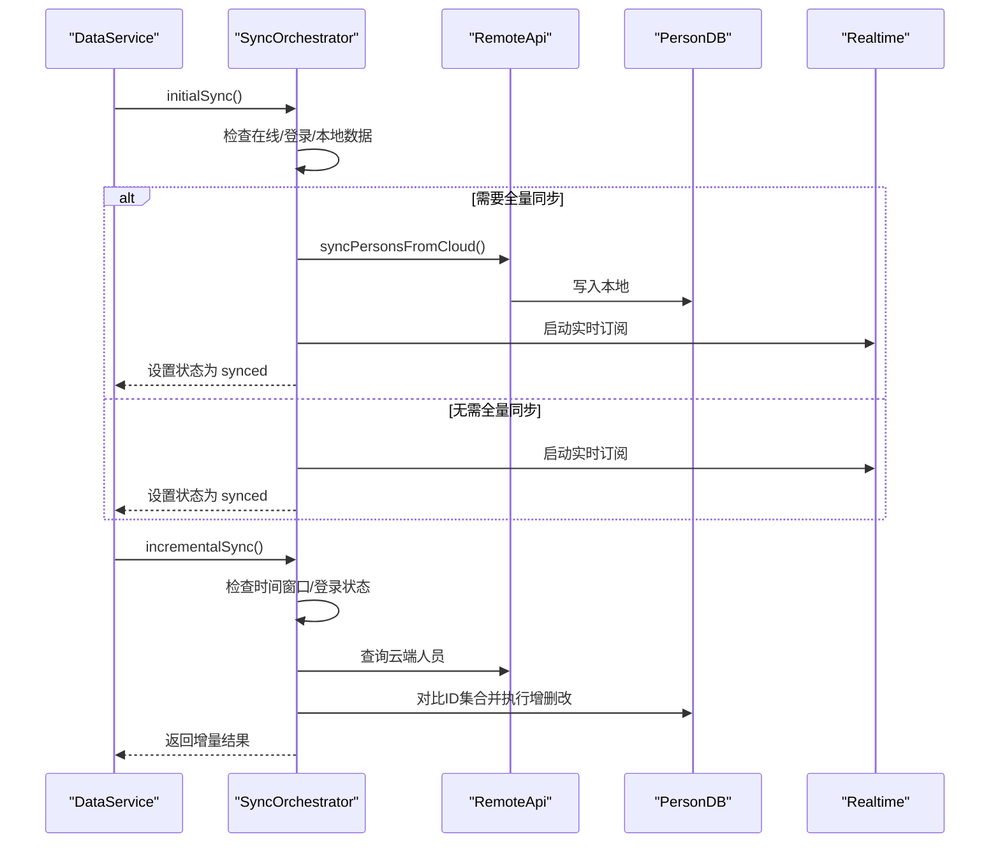
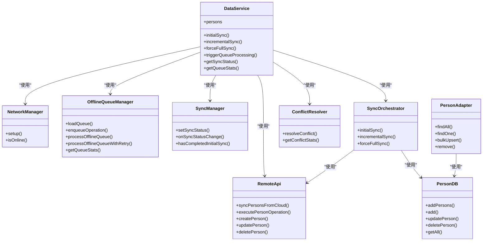

# 离线同步机制

<cite>
**本文档引用的文件**
- [app/src/services/data/DataService.ts](file://app/src/services/data/DataService.ts)
- [app/src/services/data/offline-queue/offlineQueueManager.ts](file://app/src/services/data/offline-queue/offlineQueueManager.ts)
- [app/src/services/data/sync/syncManager.ts](file://app/src/services/data/sync/syncManager.ts)
- [app/src/services/data/sync/syncOrchestrator.ts](file://app/src/services/data/sync/syncOrchestrator.ts)
- [app/src/services/data/network/networkManager.ts](file://app/src/services/data/network/networkManager.ts)
- [app/src/services/data/conflict/conflictResolver.ts](file://app/src/services/data/conflict/conflictResolver.ts)
- [app/src/services/data/remote/remoteApi.ts](file://app/src/services/data/remote/remoteApi.ts)
- [app/src/services/db/personDB.ts](file://app/src/services/db/personDB.ts)
- [app/src/services/data/adapters/personAdapter.ts](file://app/src/services/data/adapters/personAdapter.ts)
</cite>

## 目录
1. [简介](#简介)
2. [项目结构](#项目结构)
3. [核心组件](#核心组件)
4. [架构总览](#架构总览)
5. [详细组件分析](#详细组件分析)
6. [依赖关系分析](#依赖关系分析)
7. [性能考虑](#性能考虑)
8. [故障排查指南](#故障排查指南)
9. [结论](#结论)
10. [附录](#附录)

## 简介
本文件系统性阐述 OPC-Starter 的离线同步机制，重点覆盖以下方面：
- 离线队列的设计原理与实现细节：队列创建、维护、持久化、重试与回退策略
- 同步协调器的工作流程：触发条件、并发控制、错误处理与状态管理
- 离线数据的持久化策略：IndexedDB 与本地适配器、序列化与存储优化、恢复机制
- 离线场景下的数据一致性保障方案与最佳实践

## 项目结构
围绕离线同步的关键模块分布如下：
- 数据服务层：统一入口，负责网络监听、离线队列编排、同步协调、冲突解决与远程交互
- 离线队列管理：基于 localStorage 的写操作队列，支持重试、失败回退与队列清空事件
- 同步管理：跟踪同步状态与进度，向 UI 层广播状态变化
- 同步协调器：控制初始全量同步、增量同步与实时订阅的生命周期
- 网络管理：监听浏览器在线/离线事件，驱动队列处理与同步流程
- 冲突解决：提供多策略合并，确保本地与云端数据一致
- 远程 API：封装 Supabase 交互，负责云端写入与全量/增量同步
- 本地数据库：基于 IndexedDB 的 personDB，提供高性能本地持久化
- 本地适配器：将 IndexedDB 封装为 ReactiveCollection 可用的本地适配器接口

图表来源
- [app/src/services/data/DataService.ts:71-131](file://app/src/services/data/DataService.ts#L71-L131)
- [app/src/services/data/offline-queue/offlineQueueManager.ts:24-47](file://app/src/services/data/offline-queue/offlineQueueManager.ts#L24-L47)
- [app/src/services/data/sync/syncManager.ts:14-37](file://app/src/services/data/sync/syncManager.ts#L14-L37)
- [app/src/services/data/sync/syncOrchestrator.ts:34-86](file://app/src/services/data/sync/syncOrchestrator.ts#L34-L86)
- [app/src/services/data/network/networkManager.ts:19-67](file://app/src/services/data/network/networkManager.ts#L19-L67)
- [app/src/services/data/conflict/conflictResolver.ts:69-135](file://app/src/services/data/conflict/conflictResolver.ts#L69-L135)
- [app/src/services/data/remote/remoteApi.ts:21-162](file://app/src/services/data/remote/remoteApi.ts#L21-L162)
- [app/src/services/db/personDB.ts:11-114](file://app/src/services/db/personDB.ts#L11-L114)
- [app/src/services/data/adapters/personAdapter.ts:12-46](file://app/src/services/data/adapters/personAdapter.ts#L12-L46)

章节来源
- [app/src/services/data/DataService.ts:1-419](file://app/src/services/data/DataService.ts#L1-L419)

## 核心组件
- DataService：统一数据访问服务，聚合网络管理、离线队列、同步协调、冲突解决与远程 API，负责读写路径选择与状态广播
- OfflineQueueManager：基于 localStorage 的离线队列，支持入队、出队、持久化、带指数退避的重试与失败回退
- SyncManager：维护同步状态与进度，提供状态变更回调
- SyncOrchestrator：控制初始全量同步、增量同步与实时订阅，包含触发条件与错误处理
- NetworkManager：监听在线/离线事件，触发队列处理与状态切换
- ConflictResolver：提供多策略冲突解决，记录冲突统计
- RemoteApi：封装 Supabase 交互，负责云端写入与全量/增量同步
- PersonDB：IndexedDB 访问层，提供高性能本地持久化
- PersonAdapter：将 IndexedDB 封装为 ReactiveCollection 本地适配器

章节来源
- [app/src/services/data/DataService.ts:71-131](file://app/src/services/data/DataService.ts#L71-L131)
- [app/src/services/data/offline-queue/offlineQueueManager.ts:24-167](file://app/src/services/data/offline-queue/offlineQueueManager.ts#L24-L167)
- [app/src/services/data/sync/syncManager.ts:14-47](file://app/src/services/data/sync/syncManager.ts#L14-L47)
- [app/src/services/data/sync/syncOrchestrator.ts:34-209](file://app/src/services/data/sync/syncOrchestrator.ts#L34-L209)
- [app/src/services/data/network/networkManager.ts:19-72](file://app/src/services/data/network/networkManager.ts#L19-L72)
- [app/src/services/data/conflict/conflictResolver.ts:69-136](file://app/src/services/data/conflict/conflictResolver.ts#L69-L136)
- [app/src/services/data/remote/remoteApi.ts:21-163](file://app/src/services/data/remote/remoteApi.ts#L21-L163)
- [app/src/services/db/personDB.ts:11-114](file://app/src/services/db/personDB.ts#L11-L114)
- [app/src/services/data/adapters/personAdapter.ts:12-46](file://app/src/services/data/adapters/personAdapter.ts#L12-L46)

## 架构总览
离线同步遵循“离线优先写入、在线后重放”的设计原则：
- 读操作优先走本地 IndexedDB，保证低延迟
- 写操作在在线时先写云端权威源，成功后再更新本地缓存；离线时写入本地队列
- 网络恢复后，离线队列按序重放，失败的操作进行有限次重试
- 同步协调器负责初始全量同步、周期性增量同步与实时订阅
- 冲突解决器在实时订阅与增量同步中解决版本冲突

图表来源
- [app/src/services/data/DataService.ts:153-171](file://app/src/services/data/DataService.ts#L153-L171)
- [app/src/services/data/offline-queue/offlineQueueManager.ts:104-143](file://app/src/services/data/offline-queue/offlineQueueManager.ts#L104-L143)
- [app/src/services/data/remote/remoteApi.ts:133-153](file://app/src/services/data/remote/remoteApi.ts#L133-L153)
- [app/src/services/db/personDB.ts:22-43](file://app/src/services/db/personDB.ts#L22-L43)

## 详细组件分析

### 离线队列管理器（OfflineQueueManager）
- 设计目标
  - 在网络不可用时缓存写操作到 localStorage，恢复在线后按顺序重放
  - 支持失败重试与失败回退，避免无限阻塞
- 关键能力
  - 队列加载/保存：从 localStorage 恢复队列，持久化当前状态
  - 入队：记录时间戳与重试次数，追加到队尾
  - 出队与执行：逐条调用外部执行函数，成功则移除，失败则增加重试计数
  - 重试机制：最多 3 次重试，失败超过阈值则放弃并标记失败
  - 指数退避：失败重试采用指数增长延迟，最大不超过 30 秒
  - 并发保护：防止重复处理同一队列
  - 队列清空事件：当队列为空时触发自定义事件，供上层处理
- 错误处理
  - 队列加载失败时清空内存队列并记录日志
  - 保存失败时记录日志，不影响运行
  - 处理中断：若网络断开，立即停止处理并等待下次恢复

图表来源
- [app/src/services/data/offline-queue/offlineQueueManager.ts:64-143](file://app/src/services/data/offline-queue/offlineQueueManager.ts#L64-L143)

章节来源
- [app/src/services/data/offline-queue/offlineQueueManager.ts:24-167](file://app/src/services/data/offline-queue/offlineQueueManager.ts#L24-L167)

### 同步协调器（SyncOrchestrator）
- 触发条件
  - 初始全量同步：在线且已登录，且本地无历史数据或已完成初始同步
  - 增量同步：在线且距离上次全量同步超过 5 分钟，且本地存在数据
  - 实时订阅：在初始同步完成后启动
- 并发控制
  - 通过 SyncManager 管理同步状态，避免重复同步
  - 增量同步仅在满足时间窗口与登录状态后执行
- 错误处理
  - 初始同步失败时设置状态为 error，并抛出异常
  - 增量同步失败时记录错误并返回零结果
- 生命周期
  - initialSync：检查在线/登录状态，执行全量同步，设置初始完成标志，启动实时订阅
  - incrementalSync：计算时间窗口，对比本地与云端 ID 集合，执行新增/删除/更新
  - forceFullSync：清空本地数据并重新执行 initialSync

图表来源
- [app/src/services/data/sync/syncOrchestrator.ts:37-86](file://app/src/services/data/sync/syncOrchestrator.ts#L37-L86)
- [app/src/services/data/sync/syncOrchestrator.ts:88-189](file://app/src/services/data/sync/syncOrchestrator.ts#L88-L189)

章节来源
- [app/src/services/data/sync/syncOrchestrator.ts:34-209](file://app/src/services/data/sync/syncOrchestrator.ts#L34-L209)

### 同步状态管理（SyncManager）
- 职责
  - 维护同步状态（idle/syncing/synced/error）
  - 记录初始同步完成标志
  - 提供状态变更回调，通知订阅者
- 使用方式
  - DataService 通过 setSyncStatus 广播状态与进度
  - UI 通过 onSyncStatusChange 订阅状态变化

章节来源
- [app/src/services/data/sync/syncManager.ts:14-47](file://app/src/services/data/sync/syncManager.ts#L14-L47)

### 网络状态管理（NetworkManager）
- 职责
  - 监听浏览器 online/offline 事件
  - 通过自定义事件广播网络状态变化
  - 为 DataService 提供 isOnline 查询
- 与队列处理联动
  - onOnline 回调中延迟触发队列处理，避免网络抖动导致的误判

章节来源
- [app/src/services/data/network/networkManager.ts:19-72](file://app/src/services/data/network/networkManager.ts#L19-L72)

### 冲突解决（ConflictResolver）
- 策略
  - 版本比较：根据 version 字段决定 server-wins 或 local-wins
  - 相同版本：对可合并字段（如 tags）执行智能合并，否则默认 server-wins
- 统计
  - 记录 total/serverWins/localWins/merged 数量，便于监控与审计
- 与实时订阅集成
  - 在实时订阅回调中调用冲突解决，确保本地与云端一致

章节来源
- [app/src/services/data/conflict/conflictResolver.ts:69-136](file://app/src/services/data/conflict/conflictResolver.ts#L69-L136)

### 远程 API（RemoteApi）
- 能力
  - 全量同步：从 profiles 表查询并写入本地
  - 写操作：create/update/delete，统一转换为云端 upsert/update/delete
  - 数据转换：将 Supabase 行转换为本地 Person 结构
- 与队列协作
  - 离线队列中的写操作通过 executePersonOperation 调用远程 API

章节来源
- [app/src/services/data/remote/remoteApi.ts:21-163](file://app/src/services/data/remote/remoteApi.ts#L21-L163)

### 本地数据库与适配器（PersonDB 与 PersonAdapter）
- PersonDB
  - 基于 IndexedDB，提供批量插入、单条更新/删除、按索引查询等
  - 在 add 时若主键冲突自动转为 put 更新，保证幂等
- PersonAdapter
  - 将 PersonDB 封装为 ReactiveCollection 的 LocalAdapter 接口
  - 支持 findAll/findOne/query/upsert/bulkUpsert/remove/clear

章节来源
- [app/src/services/db/personDB.ts:11-114](file://app/src/services/db/personDB.ts#L11-L114)
- [app/src/services/data/adapters/personAdapter.ts:12-46](file://app/src/services/data/adapters/personAdapter.ts#L12-L46)

## 依赖关系分析
- 组件耦合
  - DataService 是核心协调者，依赖 NetworkManager、OfflineQueueManager、SyncManager、SyncOrchestrator、RemoteApi、ConflictResolver
  - OfflineQueueManager 依赖外部执行函数与标记函数，解耦具体业务
  - SyncOrchestrator 依赖 RemoteApi 与 PersonDB，负责同步流程编排
  - PersonAdapter 依赖 PersonDB，为 ReactiveCollection 提供本地数据源
- 外部依赖
  - 浏览器原生 API：localStorage、IndexedDB、window online/offline 事件
  - Supabase 客户端：用于云端读写与实时订阅

图表来源
- [app/src/services/data/DataService.ts:71-131](file://app/src/services/data/DataService.ts#L71-L131)
- [app/src/services/data/sync/syncOrchestrator.ts:34-86](file://app/src/services/data/sync/syncOrchestrator.ts#L34-L86)
- [app/src/services/data/adapters/personAdapter.ts:12-46](file://app/src/services/data/adapters/personAdapter.ts#L12-L46)

## 性能考虑
- 读性能
  - 读操作直接命中 IndexedDB，避免网络往返
  - ReactiveCollection 通过本地适配器提供高效查询与响应式更新
- 写性能
  - 在线写入：先云端后本地，减少回放成本
  - 离线写入：本地队列异步重放，避免阻塞 UI
- 存储优化
  - IndexedDB 批量写入（addPersons）提升吞吐
  - localStorage 队列按需持久化，避免频繁 IO
- 重试与退避
  - 指数退避降低云端压力，提高成功率
  - 最大重试次数限制避免无限阻塞
- 增量同步
  - 基于时间窗口与 ID 集合对比，减少不必要的全量同步

## 故障排查指南
- 离线队列无法恢复
  - 检查 localStorage 是否被清理或存储空间不足
  - 查看队列加载日志，确认 JSON 解析是否异常
- 队列处理卡住
  - 检查是否存在网络断开导致的提前退出
  - 确认 isProcessingQueue 并发标志是否被意外置位
- 写操作失败
  - 查看重试次数与最终失败原因
  - 确认 RemoteApi 的云端错误信息与权限状态
- 同步状态异常
  - 检查 SyncManager 的状态广播与回调注册
  - 确认 SyncOrchestrator 的触发条件（在线/登录/时间窗口）
- 冲突过多
  - 通过 getConflictStats 监控冲突分布
  - 调整冲突解决策略或优化业务写入节奏

章节来源
- [app/src/services/data/offline-queue/offlineQueueManager.ts:28-39](file://app/src/services/data/offline-queue/offlineQueueManager.ts#L28-L39)
- [app/src/services/data/sync/syncManager.ts:19-37](file://app/src/services/data/sync/syncManager.ts#L19-L37)
- [app/src/services/data/sync/syncOrchestrator.ts:37-86](file://app/src/services/data/sync/syncOrchestrator.ts#L37-L86)
- [app/src/services/data/conflict/conflictResolver.ts:118-129](file://app/src/services/data/conflict/conflictResolver.ts#L118-L129)

## 结论
OPC-Starter 的离线同步机制通过“离线优先写入 + 在线后重放”的策略，在保证用户体验的同时实现了数据一致性与可靠性。核心优势包括：
- 明确的读写路径与状态管理
- 健壮的离线队列与指数退避重试
- 可观测的同步状态与冲突统计
- 基于 IndexedDB 的高性能本地持久化
建议在生产环境中结合业务特性进一步完善：
- 队列容量与过期策略
- 冲突解决策略的可配置化
- 更细粒度的并发控制与批处理

## 附录
- 最佳实践
  - 写操作一律通过 DataService 统一入口，避免绕过队列
  - UI 订阅同步状态，及时反馈用户
  - 定期清理过期队列与冲突统计
  - 在弱网环境下合理设置重试参数与退避上限
- 常见问题
  - 队列积压：检查网络状态与重试上限，必要时手动触发队列处理
  - 冲突激增：检查实时订阅与增量同步的触发频率
  - 本地数据不同步：确认初始同步是否完成与云端权限