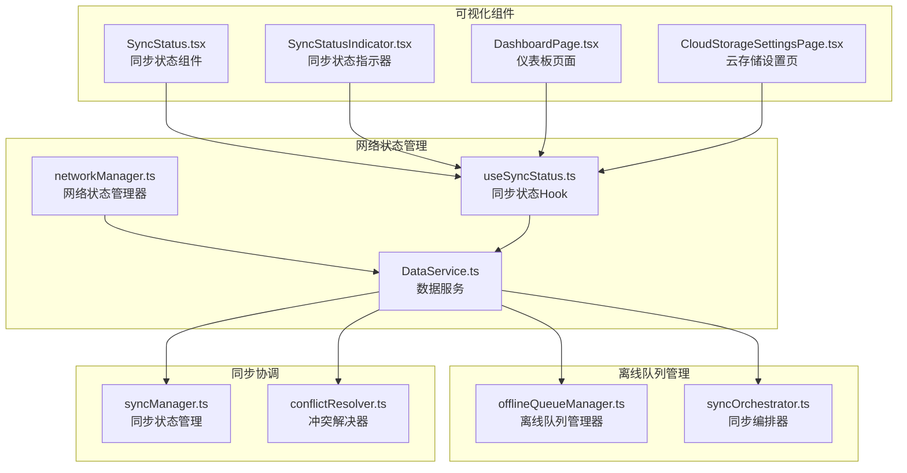
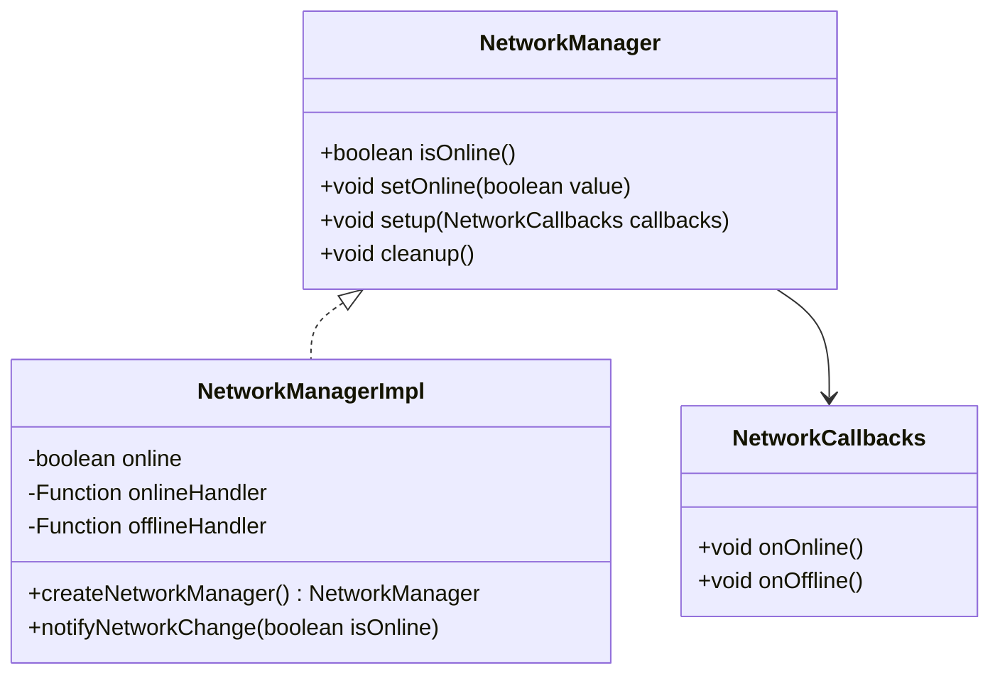
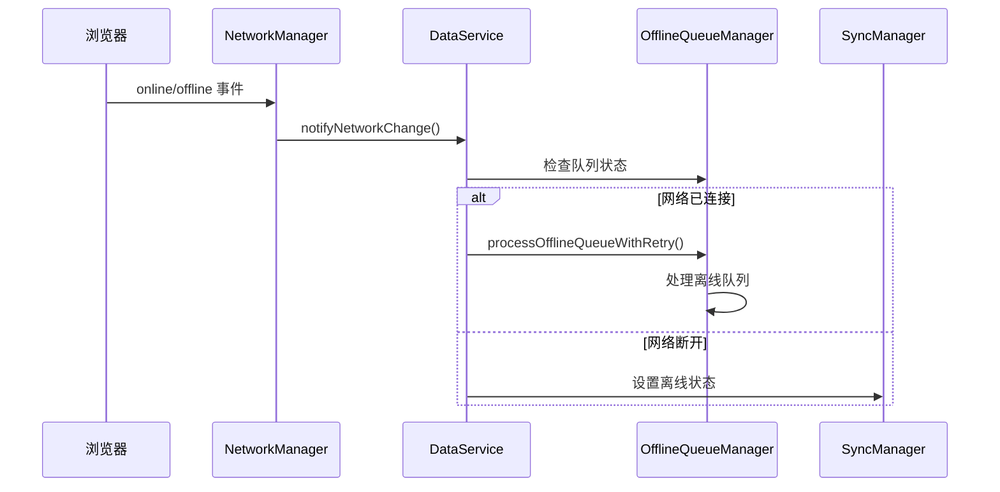
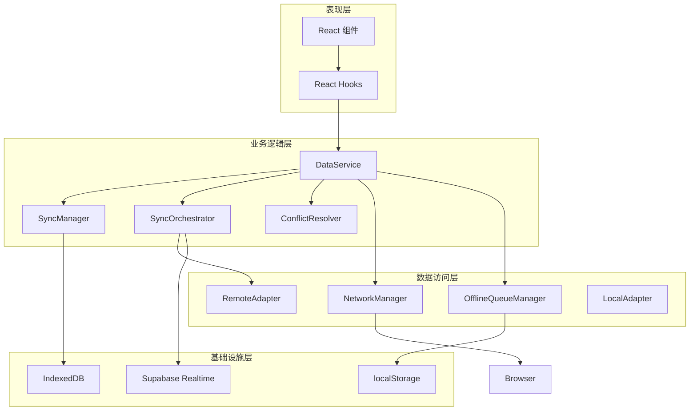
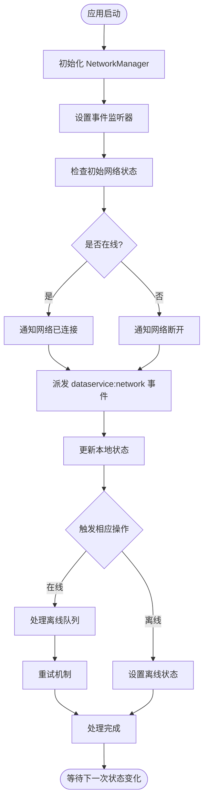
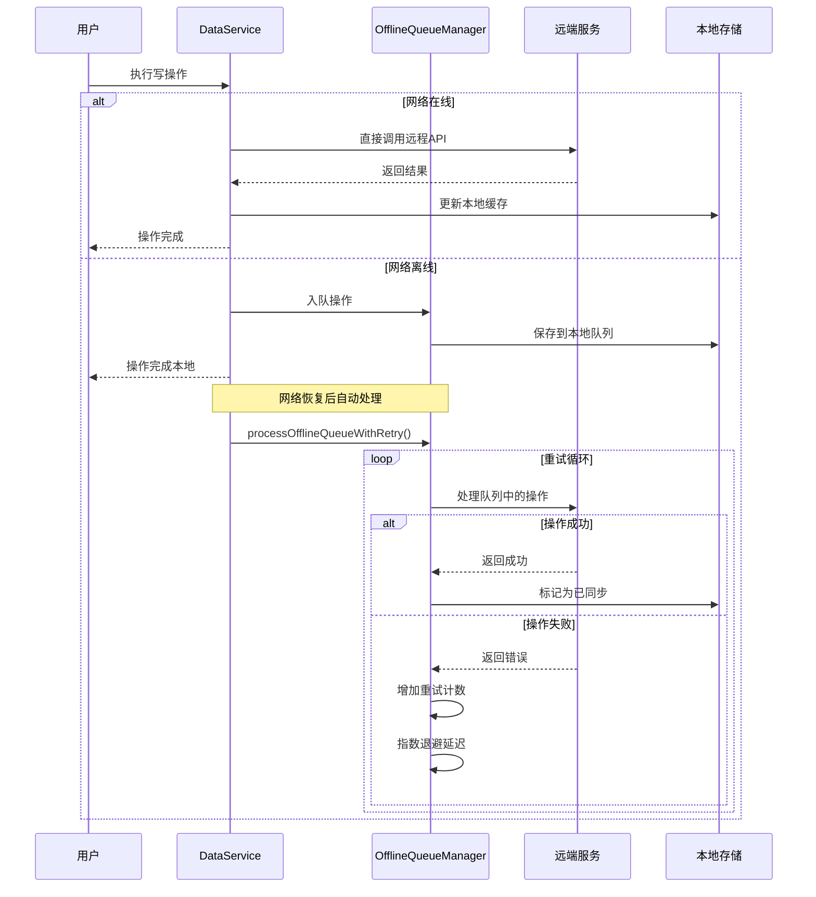
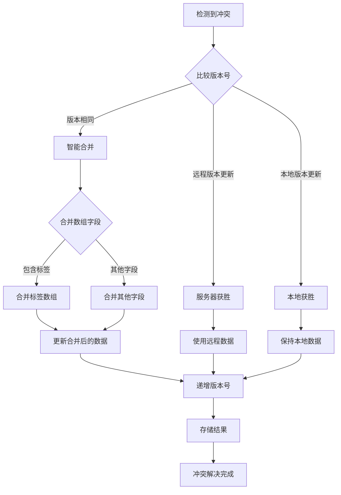
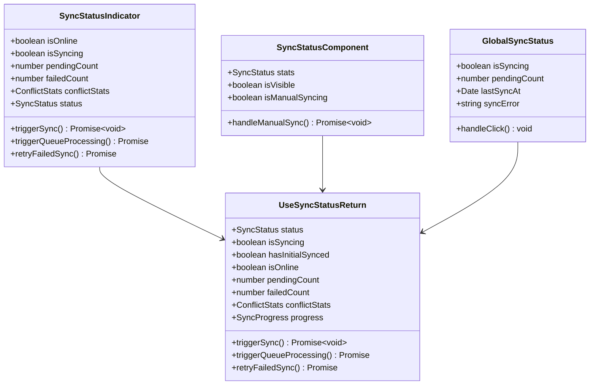
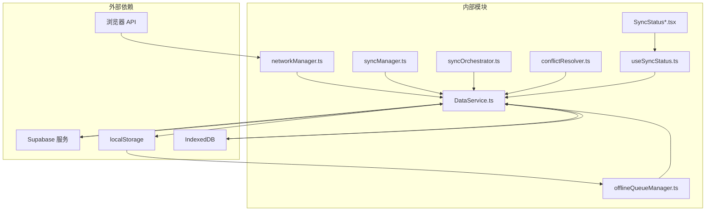
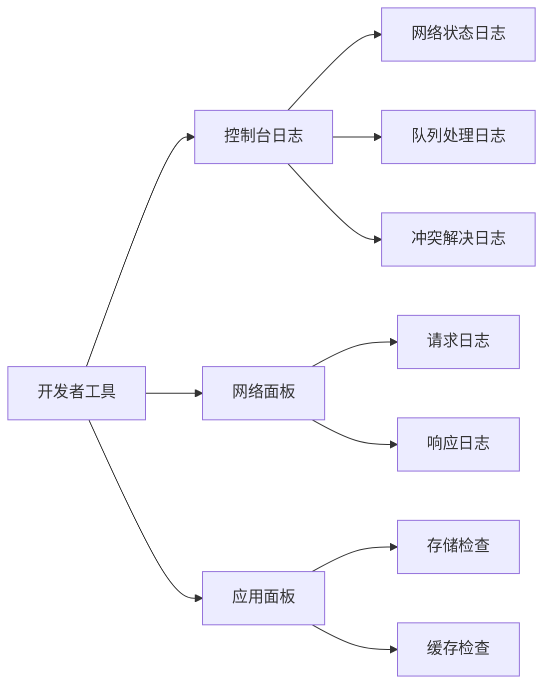

# 网络状态管理

<cite>
**本文档引用的文件**
- [networkManager.ts](file://app/src/services/data/network/networkManager.ts)
- [DataService.ts](file://app/src/services/data/DataService.ts)
- [offlineQueueManager.ts](file://app/src/services/data/offline-queue/offlineQueueManager.ts)
- [useSyncStatus.ts](file://app/src/hooks/useSyncStatus.ts)
- [syncManager.ts](file://app/src/services/data/sync/syncManager.ts)
- [syncOrchestrator.ts](file://app/src/services/data/sync/syncOrchestrator.ts)
- [conflictResolver.ts](file://app/src/services/data/conflict/conflictResolver.ts)
- [SyncStatus.tsx](file://app/src/components/business/SyncStatus.tsx)
- [SyncStatusIndicator.tsx](file://app/src/components/business/SyncStatusIndicator.tsx)
- [DashboardPage.tsx](file://app/src/pages/DashboardPage.tsx)
- [CloudStorageSettingsPage.tsx](file://app/src/pages/CloudStorageSettingsPage.tsx)
- [SyncEngine.ts](file://app/src/lib/reactive/SyncEngine.ts)
</cite>

## 目录
1. [简介](#简介)
2. [项目结构](#项目结构)
3. [核心组件](#核心组件)
4. [架构概览](#架构概览)
5. [详细组件分析](#详细组件分析)
6. [依赖关系分析](#依赖关系分析)
7. [性能考虑](#性能考虑)
8. [故障排除指南](#故障排除指南)
9. [结论](#结论)

## 简介

OPC-Starter 的网络状态管理系统是一个完整的离线优先数据同步解决方案，实现了在线/离线状态检测、网络质量评估、连接稳定性检测等功能。该系统通过多层架构设计，确保在网络异常情况下仍能提供良好的用户体验。

系统的核心特性包括：
- 实时网络状态监控和通知
- 离线队列管理和重试机制
- 冲突检测和解决策略
- 可视化的同步状态展示
- 自动化的数据同步协调

## 项目结构

网络状态管理相关的代码主要分布在以下目录结构中：

**图表来源**
- [networkManager.ts:1-73](file://app/src/services/data/network/networkManager.ts#L1-L73)
- [DataService.ts:1-419](file://app/src/services/data/DataService.ts#L1-L419)

**章节来源**
- [networkManager.ts:1-73](file://app/src/services/data/network/networkManager.ts#L1-L73)
- [DataService.ts:1-419](file://app/src/services/data/DataService.ts#L1-L419)

## 核心组件

### 网络状态管理器

网络状态管理器是整个系统的基础组件，负责监听浏览器的在线/离线状态变化并提供统一的接口。

**图表来源**
- [networkManager.ts:7-17](file://app/src/services/data/network/networkManager.ts#L7-L17)

### 数据服务层

数据服务作为中央协调器，整合了所有网络状态管理相关的功能模块。

**图表来源**
- [DataService.ts:153-171](file://app/src/services/data/DataService.ts#L153-L171)
- [networkManager.ts:32-49](file://app/src/services/data/network/networkManager.ts#L32-L49)

**章节来源**
- [networkManager.ts:19-72](file://app/src/services/data/network/networkManager.ts#L19-L72)
- [DataService.ts:71-131](file://app/src/services/data/DataService.ts#L71-L131)

## 架构概览

OPC-Starter 的网络状态管理采用分层架构设计，确保各组件职责清晰、耦合度低：

**图表来源**
- [DataService.ts:76-109](file://app/src/services/data/DataService.ts#L76-L109)
- [offlineQueueManager.ts:24-167](file://app/src/services/data/offline-queue/offlineQueueManager.ts#L24-L167)

## 详细组件分析

### 网络状态检测机制

网络状态检测基于浏览器的 `navigator.onLine` 属性和 `online/offline` 事件，实现了高可靠性的状态监控。

**图表来源**
- [networkManager.ts:32-49](file://app/src/services/data/network/networkManager.ts#L32-L49)
- [DataService.ts:153-171](file://app/src/services/data/DataService.ts#L153-L171)

### 离线队列处理策略

离线队列管理器实现了智能的队列处理和重试机制，确保数据的一致性和可靠性。

**图表来源**
- [offlineQueueManager.ts:104-143](file://app/src/services/data/offline-queue/offlineQueueManager.ts#L104-L143)
- [DataService.ts:232-278](file://app/src/services/data/DataService.ts#L232-L278)

### 冲突检测与解决

系统实现了智能的冲突检测和解决机制，确保多设备间的数据一致性。

**图表来源**
- [conflictResolver.ts:77-116](file://app/src/services/data/conflict/conflictResolver.ts#L77-L116)

**章节来源**
- [networkManager.ts:1-73](file://app/src/services/data/network/networkManager.ts#L1-L73)
- [offlineQueueManager.ts:1-168](file://app/src/services/data/offline-queue/offlineQueueManager.ts#L1-L168)
- [conflictResolver.ts:1-136](file://app/src/services/data/conflict/conflictResolver.ts#L1-L136)

### 同步状态可视化展示

系统提供了多层次的同步状态可视化组件，满足不同场景下的用户反馈需求。

**图表来源**
- [useSyncStatus.ts:20-43](file://app/src/hooks/useSyncStatus.ts#L20-L43)
- [SyncStatus.tsx:17-44](file://app/src/components/business/SyncStatus.tsx#L17-L44)

**章节来源**
- [useSyncStatus.ts:63-188](file://app/src/hooks/useSyncStatus.ts#L63-L188)
- [SyncStatus.tsx:17-171](file://app/src/components/business/SyncStatus.tsx#L17-L171)
- [SyncStatusIndicator.tsx:25-267](file://app/src/components/business/SyncStatusIndicator.tsx#L25-L267)

## 依赖关系分析

网络状态管理系统的依赖关系呈现清晰的层次结构：

**图表来源**
- [DataService.ts:18-24](file://app/src/services/data/DataService.ts#L18-L24)
- [offlineQueueManager.ts:30-46](file://app/src/services/data/offline-queue/offlineQueueManager.ts#L30-L46)

**章节来源**
- [DataService.ts:1-419](file://app/src/services/data/DataService.ts#L1-L419)

## 性能考虑

### 网络状态检测优化

系统采用了高效的网络状态检测机制，避免了频繁的状态查询：

- 使用浏览器原生的 `online/offline` 事件，减少轮询开销
- 缓存当前网络状态，避免重复计算
- 实现防抖机制，防止状态抖动

### 离线队列处理优化

离线队列管理器实现了多项性能优化策略：

- **指数退避重试**：失败时采用 2^n 的延迟策略，最多不超过 30 秒
- **批量处理**：队列中的操作按顺序批量处理，减少数据库操作次数
- **内存管理**：实现队列状态的持久化，应用重启后可恢复处理

### 冲突解决优化

冲突解决机制采用了智能算法：

- **版本比较**：基于版本号进行冲突判断，避免不必要的数据比较
- **字段级合并**：只对冲突字段进行合并，提高处理效率
- **缓存统计**：维护冲突统计信息，便于性能监控和优化

## 故障排除指南

### 常见问题诊断

#### 网络状态不准确
**症状**：网络状态与实际不符
**排查步骤**：
1. 检查浏览器控制台是否有网络事件日志
2. 验证 `navigator.onLine` 的返回值
3. 确认 `online/offline` 事件是否正常触发

#### 离线队列无法处理
**症状**：离线操作无法同步到服务器
**排查步骤**：
1. 检查队列中操作的格式是否正确
2. 验证网络连接状态
3. 查看重试计数和错误日志

#### 冲突解决异常
**症状**：数据冲突导致同步失败
**排查步骤**：
1. 检查冲突统计数据
2. 验证冲突解决策略配置
3. 查看具体冲突记录

### 调试工具

系统提供了多种调试工具帮助开发者诊断问题：

**章节来源**
- [useSyncStatus.ts:118-156](file://app/src/hooks/useSyncStatus.ts#L118-L156)

## 结论

OPC-Starter 的网络状态管理系统通过精心设计的架构和实现，为用户提供了可靠的离线优先数据同步体验。系统的主要优势包括：

1. **高可靠性**：多重状态检测和重试机制确保数据传输的可靠性
2. **良好用户体验**：实时的状态反馈和自动化的处理减少了用户的干预
3. **可扩展性**：模块化的架构设计便于功能扩展和定制
4. **性能优化**：智能的缓存策略和批处理机制提高了系统性能

该系统为类似的应用场景提供了一个完整的参考实现，开发者可以根据具体需求进行定制和扩展。