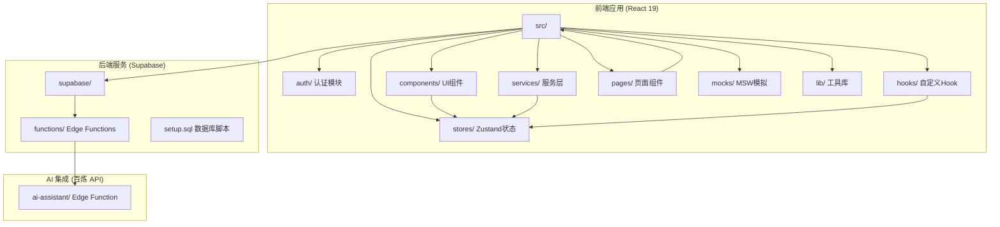
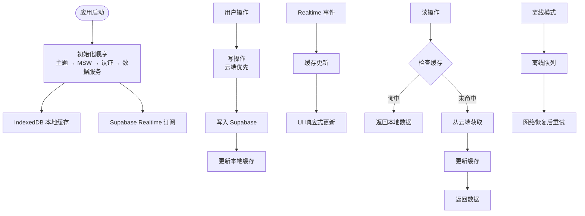
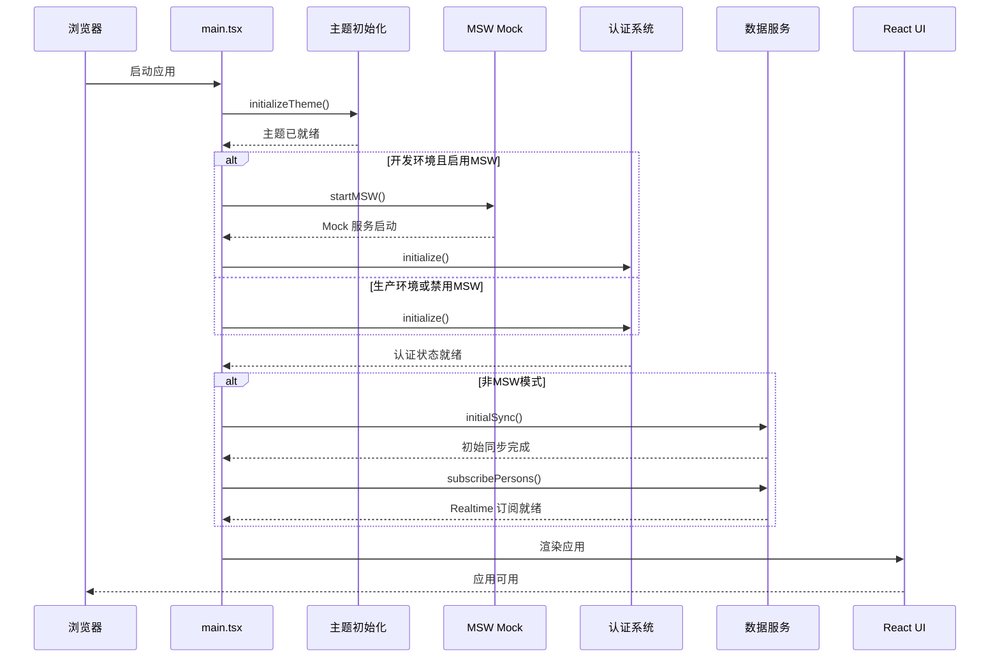
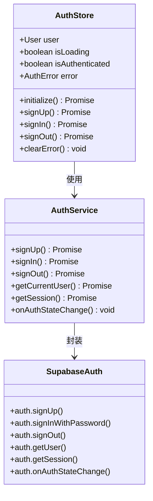
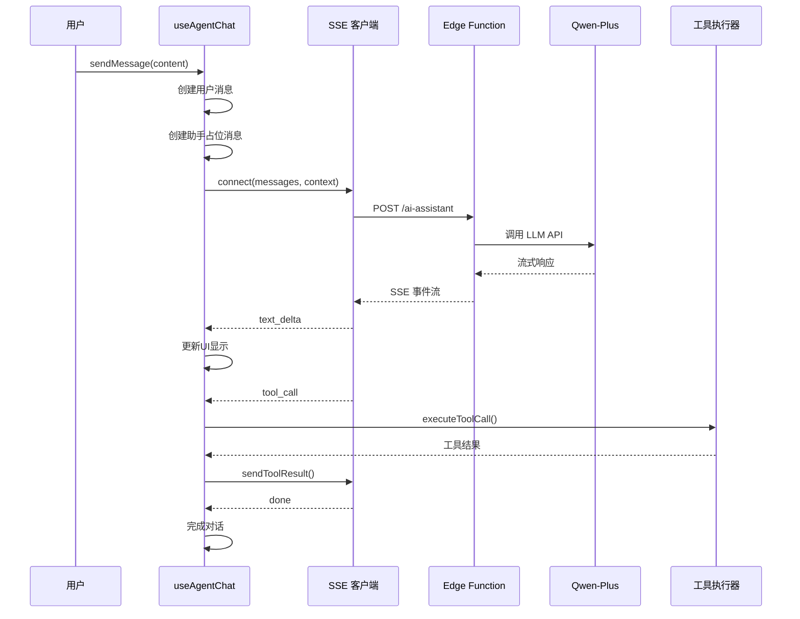
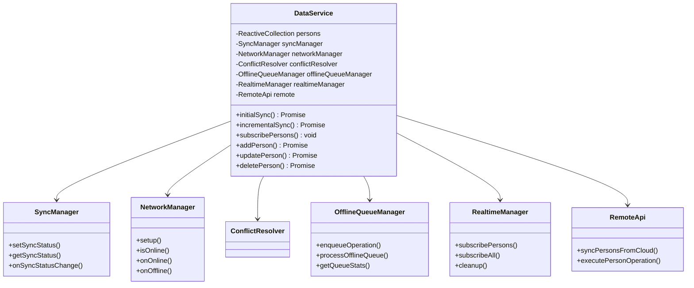
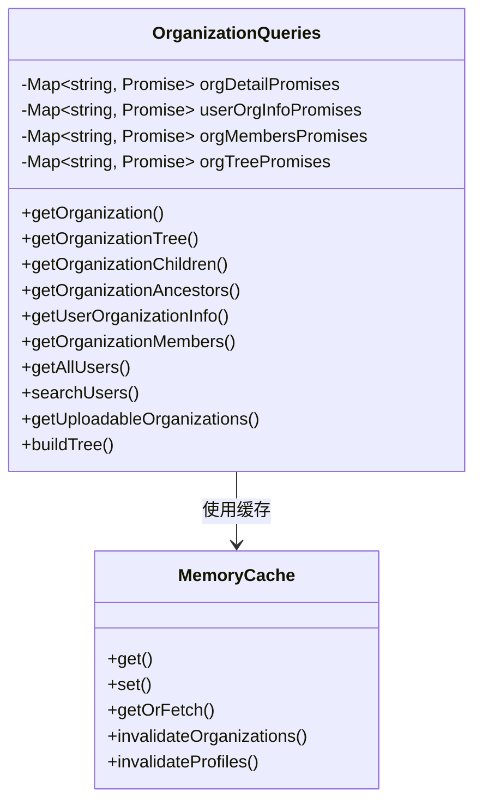
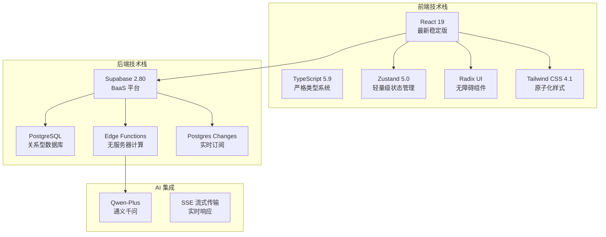

# 整体架构概览

<cite>
**本文档引用的文件**
- [package.json](file://app/package.json)
- [main.tsx](file://app/src/main.tsx)
- [App.tsx](file://app/src/App.tsx)
- [Architecture.md](file://docs/Architecture.md)
- [setup.sql](file://app/supabase/setup.sql)
- [index.ts](file://app/supabase/functions/ai-assistant/index.ts)
- [useAuthStore.ts](file://app/src/stores/useAuthStore.ts)
- [auth.ts](file://app/src/lib/supabase/auth.ts)
- [DataService.ts](file://app/src/services/data/DataService.ts)
- [organizationQueries.ts](file://app/src/services/organization/organizationQueries.ts)
- [useAgentChat.ts](file://app/src/hooks/useAgentChat.ts)
- [sseClient.ts](file://app/src/lib/agent/sseClient.ts)
- [memoryCache.ts](file://app/src/services/cache/memoryCache.ts)
- [vite.config.ts](file://app/vite.config.ts)
</cite>

## 目录
1. [引言](#引言)
2. [项目结构](#项目结构)
3. [核心组件](#核心组件)
4. [架构总览](#架构总览)
5. [详细组件分析](#详细组件分析)
6. [依赖关系分析](#依赖关系分析)
7. [性能考量](#性能考量)
8. [故障排查指南](#故障排查指南)
9. [结论](#结论)

## 引言
OPC-Starter 是一个面向个人公司的 AI 友好型 React 起步模板，专为使用 Cursor、Qoder 等 AI 编码工具的开发者设计。系统采用三层架构：前端 React 应用层、后端 Supabase 服务层、AI 集成层（百炼 Qwen-Plus），结合 Cache + Realtime 的数据流设计，实现高性能、低延迟、强一致性的数据体验。

## 项目结构
项目采用按功能域划分的模块化组织方式，前端应用位于 app/ 目录，后端 Supabase 脚本位于 app/supabase/ 目录，架构文档位于 docs/ 目录。



**图表来源**
- [Architecture.md:160-196](file://docs/Architecture.md#L160-L196)
- [package.json:1-141](file://app/package.json#L1-L141)

**章节来源**
- [Architecture.md:160-196](file://docs/Architecture.md#L160-L196)
- [package.json:1-141](file://app/package.json#L1-L141)

## 核心组件
系统围绕四大核心模块构建：

### 认证系统 (Auth)
- 基于 Supabase Auth 的用户认证
- Zustand 状态管理，支持持久化存储
- 缓存机制减少重复请求
- 路由守卫保护受保护资源

### 组织架构 (Organization)
- 多层级组织结构 (ltree)
- 角色权限管理 (admin/manager/member)
- RLS 策略保护数据安全
- 实时同步与缓存管理

### Agent Studio
- SSE 流式通信客户端
- 工具执行器与注册表
- A2UI 动态渲染系统
- 上下文管理与消息流

### 数据同步层 (DataService)
- Cache + Realtime 数据流原则
- 离线队列与冲突解决
- Reactive Collection 响应式集合
- IndexedDB 本地存储

**章节来源**
- [useAuthStore.ts:1-173](file://app/src/stores/useAuthStore.ts#L1-L173)
- [organizationQueries.ts:1-333](file://app/src/services/organization/organizationQueries.ts#L1-L333)
- [useAgentChat.ts:1-380](file://app/src/hooks/useAgentChat.ts#L1-L380)
- [DataService.ts:1-419](file://app/src/services/data/DataService.ts#L1-L419)

## 架构总览
系统采用三层架构模式，每层职责明确、耦合度低。

```mermaid
graph TB
subgraph "前端层 (React 19)"
UI[UI 组件层<br/>Zustand Store<br/>React Hooks]
DS[DataService 统一数据访问]
AC[Agent Chat 集成]
end
subgraph "后端层 (Supabase)"
AUTH[Auth 认证服务]
DB[(PostgreSQL)<br/>RLS 策略]
RT[Realtime 订阅]
ST[Storage 存储]
end
subgraph "AI 层 (百炼 API)"
QWEN[Qwen-Plus Agent]
EDGE[Edge Function]
end
UI --> DS
UI --> AC
DS --> AUTH
DS --> DB
DS --> RT
AC --> EDGE
EDGE --> QWEN
AUTH --> DB
RT --> UI
```

**图表来源**
- [Architecture.md:22-39](file://docs/Architecture.md#L22-L39)
- [main.tsx:23-74](file://app/src/main.tsx#L23-L74)
- [index.ts:22-113](file://app/supabase/functions/ai-assistant/index.ts#L22-L113)

### Cache + Realtime 数据流设计原则
系统采用"读本地、写云端、实时同步"的设计模式：



**图表来源**
- [DataService.ts:4-10](file://app/src/services/data/DataService.ts#L4-L10)
- [main.tsx:23-74](file://app/src/main.tsx#L23-L74)

**章节来源**
- [Architecture.md:131-158](file://docs/Architecture.md#L131-L158)
- [DataService.ts:1-419](file://app/src/services/data/DataService.ts#L1-L419)

## 详细组件分析

### 前端应用初始化流程
应用启动遵循严格的初始化顺序，确保各服务正确加载。



**图表来源**
- [main.tsx:23-74](file://app/src/main.tsx#L23-L74)

**章节来源**
- [main.tsx:1-78](file://app/src/main.tsx#L1-L78)
- [App.tsx:1-18](file://app/src/App.tsx#L1-L18)

### 认证系统架构
基于 Zustand 的轻量级状态管理，结合 Supabase Auth 实现完整的用户生命周期管理。



**图表来源**
- [useAuthStore.ts:24-172](file://app/src/stores/useAuthStore.ts#L24-L172)
- [auth.ts:29-119](file://app/src/lib/supabase/auth.ts#L29-L119)

**章节来源**
- [useAuthStore.ts:1-173](file://app/src/stores/useAuthStore.ts#L1-L173)
- [auth.ts:1-120](file://app/src/lib/supabase/auth.ts#L1-L120)

### Agent 对话集成流程
Agent Studio 通过 SSE 实现流式通信，支持工具调用和 A2UI 渲染。



**图表来源**
- [useAgentChat.ts:299-376](file://app/src/hooks/useAgentChat.ts#L299-L376)
- [sseClient.ts:369-410](file://app/src/lib/agent/sseClient.ts#L369-L410)
- [index.ts:85-98](file://app/supabase/functions/ai-assistant/index.ts#L85-L98)

**章节来源**
- [useAgentChat.ts:1-380](file://app/src/hooks/useAgentChat.ts#L1-L380)
- [sseClient.ts:1-484](file://app/src/lib/agent/sseClient.ts#L1-L484)
- [index.ts:1-116](file://app/supabase/functions/ai-assistant/index.ts#L1-L116)

### 数据服务层架构
DataService 作为统一数据访问层，实现了复杂的同步机制。



**图表来源**
- [DataService.ts:71-131](file://app/src/services/data/DataService.ts#L71-L131)

**章节来源**
- [DataService.ts:1-419](file://app/src/services/data/DataService.ts#L1-L419)

### 组织查询服务
专门的只读查询服务，提供组织树、成员列表等功能。



**图表来源**
- [organizationQueries.ts:17-50](file://app/src/services/organization/organizationQueries.ts#L17-L50)

**章节来源**
- [organizationQueries.ts:1-333](file://app/src/services/organization/organizationQueries.ts#L1-L333)
- [memoryCache.ts:1-192](file://app/src/services/cache/memoryCache.ts#L1-L192)

## 依赖关系分析

### 技术栈选型
系统采用业界成熟的技术组合，每个技术都有明确的选型理由：



**图表来源**
- [Architecture.md:9-21](file://docs/Architecture.md#L9-L21)
- [package.json:48-84](file://app/package.json#L48-L84)

### 关键依赖关系
- **React 19**：提供最新的 React 特性，包括并发特性、改进的 Suspense 等
- **Supabase**：一体化后端服务，包含认证、数据库、存储、实时功能
- **Zustand**：相比 Redux 更轻量，适合中小型应用的状态管理
- **MSW**：开发环境下的 Mock 服务，提高开发效率和测试可靠性

**章节来源**
- [Architecture.md:9-21](file://docs/Architecture.md#L9-L21)
- [package.json:48-84](file://app/package.json#L48-L84)

## 性能考量
系统在多个层面考虑性能优化：

### 构建优化
- 代码分割：手动配置 vendor chunks，分离 React、UI 组件、状态管理和工具库
- 依赖预构建：优化开发服务器启动速度
- 压缩配置：生产环境启用 Terser 压缩

### 数据访问优化
- 读本地缓存：100% 本地读取，提升响应速度
- 写云端更新：乐观更新 + 离线队列，保证数据一致性
- 实时同步：Supabase Realtime 订阅，最小化延迟

### 缓存策略
- 内存缓存：组织树 10 分钟 TTL，用户资料 5 分钟 TTL
- 并发去重：防止重复请求
- 自动失效：监听 Realtime 事件自动清理缓存

## 故障排查指南

### 常见问题诊断
1. **认证失败**
   - 检查 Supabase 配置是否正确
   - 确认网络连接正常
   - 查看浏览器控制台错误信息

2. **数据不同步**
   - 检查网络状态
   - 查看离线队列状态
   - 确认 Realtime 订阅是否正常

3. **Agent 对话异常**
   - 检查 Edge Function 日志
   - 确认 AI API 密钥配置
   - 查看 SSE 连接状态

### 调试工具
- 浏览器开发者工具：监控网络请求和实时事件
- 控制台日志：查看详细的错误信息和调试信息
- Zustand DevTools：监控状态变化
- Supabase Dashboard：查看数据库和实时订阅状态

**章节来源**
- [main.tsx:29-63](file://app/src/main.tsx#L29-L63)
- [DataService.ts:246-262](file://app/src/services/data/DataService.ts#L246-L262)

## 结论
OPC-Starter 通过精心设计的三层架构和 Cache + Realtime 数据流，为个人公司提供了一个高性能、可扩展的 AI 友好型应用框架。系统的技术选型合理，模块化设计清晰，既满足了开发效率的需求，又保证了运行时的性能表现。通过本文档的架构概览，开发者可以快速理解系统的整体设计，并在此基础上进行功能扩展和定制开发。