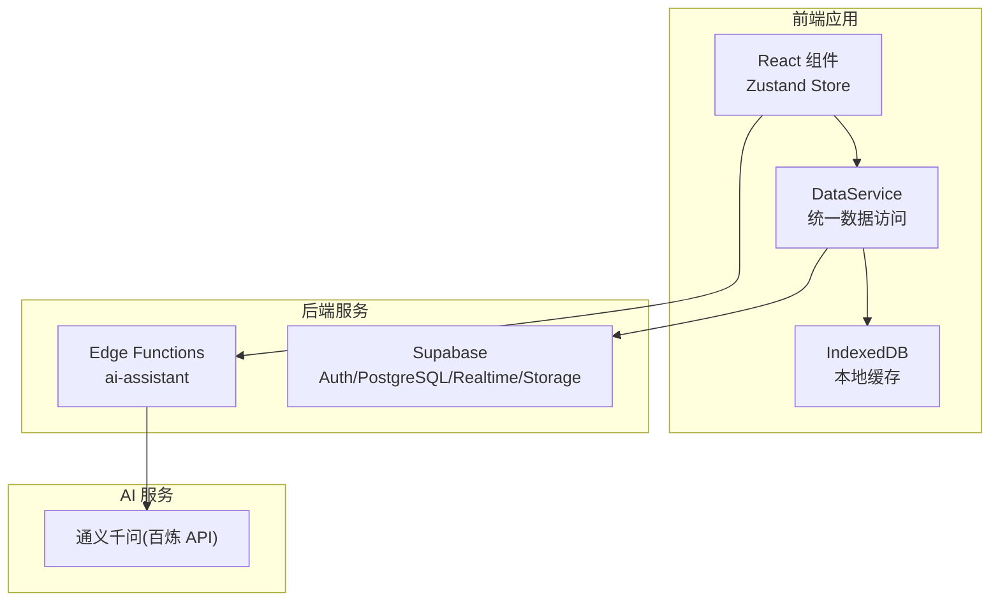
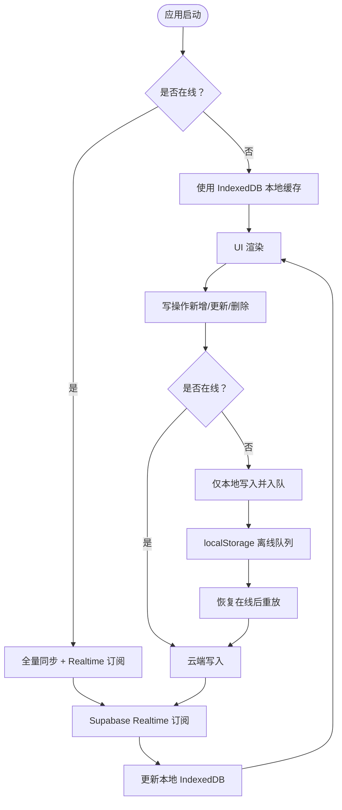
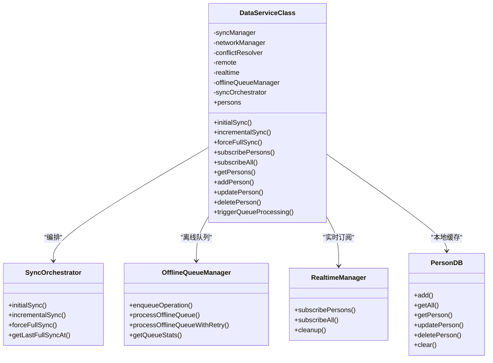
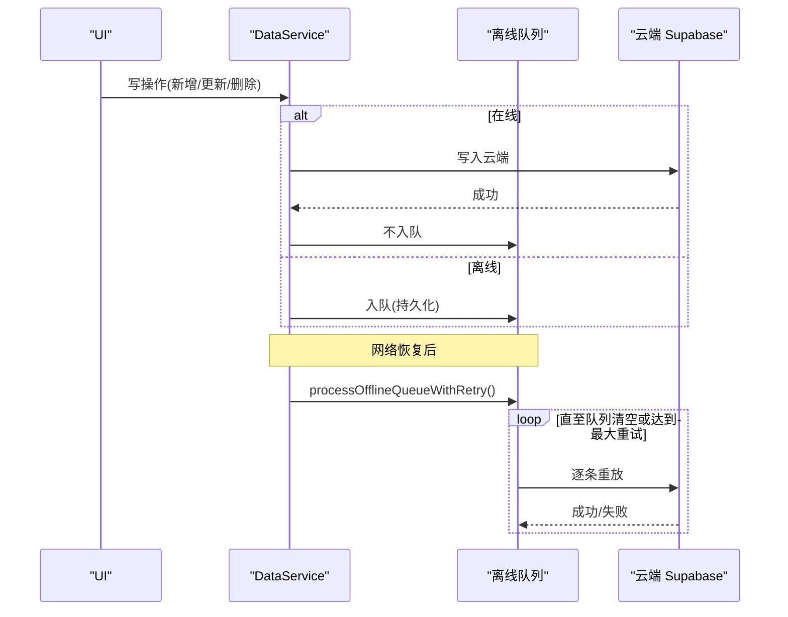
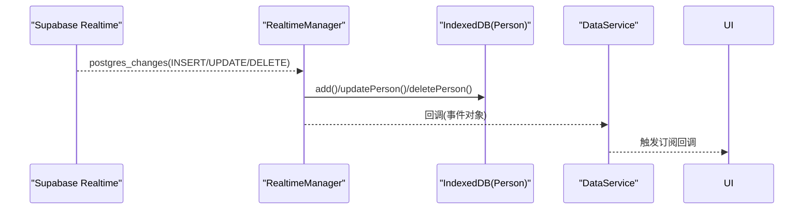
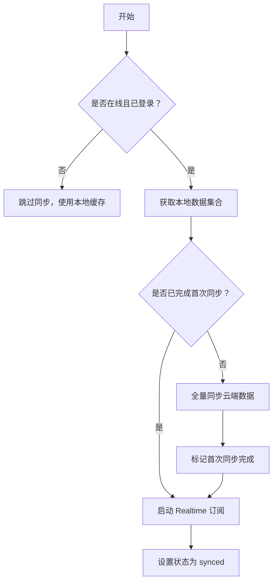
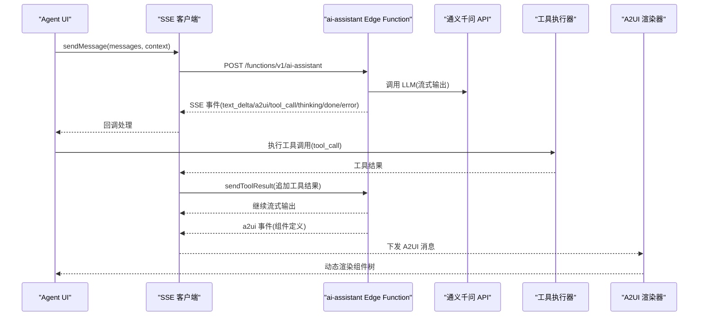
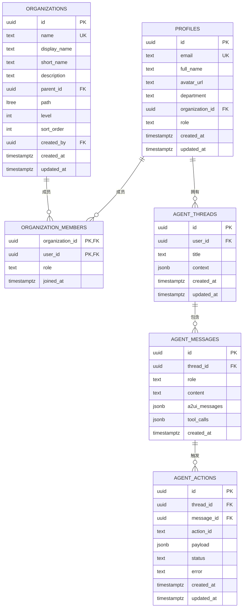
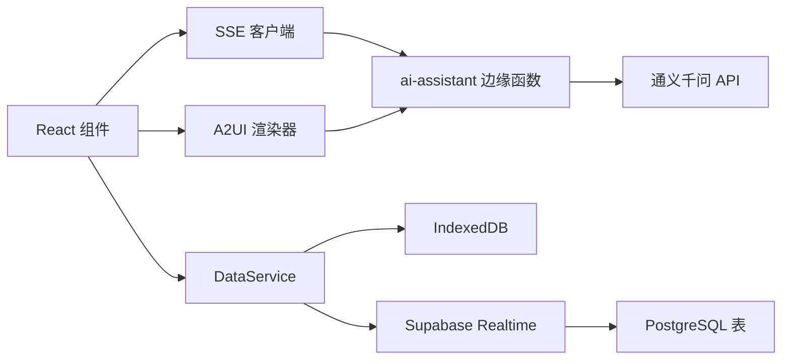

# 架构设计

<cite>
**本文引用的文件**
- [package.json](file://app/package.json)
- [README.md](file://app/README.md)
- [架构文档](file://docs/Architecture.md)
- [DataService.ts](file://app/src/services/data/DataService.ts)
- [realtimeManager.ts](file://app/src/services/data/realtime/realtimeManager.ts)
- [offlineQueueManager.ts](file://app/src/services/data/offline-queue/offlineQueueManager.ts)
- [syncOrchestrator.ts](file://app/src/services/data/sync/syncOrchestrator.ts)
- [personDB.ts](file://app/src/services/db/personDB.ts)
- [index.ts](file://app/supabase/functions/ai-assistant/index.ts)
- [sseClient.ts](file://app/src/lib/agent/sseClient.ts)
- [toolExecutor.ts](file://app/src/lib/agent/toolExecutor.ts)
- [registry.ts](file://app/src/lib/agent/tools/registry.ts)
- [A2UIRenderer.tsx](file://app/src/components/agent/a2ui/A2UIRenderer.tsx)
- [setup.sql](file://app/supabase/setup.sql)
</cite>

## 目录
1. [简介](#简介)
2. [项目结构](#项目结构)
3. [核心组件](#核心组件)
4. [架构总览](#架构总览)
5. [详细组件分析](#详细组件分析)
6. [依赖关系分析](#依赖关系分析)
7. [性能考量](#性能考量)
8. [故障排查指南](#故障排查指南)
9. [结论](#结论)
10. [附录](#附录)

## 简介
OPC-Starter 是一个面向“一人公司”的 AI 友好型 React 脚手架，围绕“离线优先 + 实时同步”的数据流设计，结合 Supabase 提供的身份认证、数据库、实时订阅与边缘函数能力，并通过 SSE 流式通信与 A2UI 动态渲染实现 Agent Studio 的交互体验。其目标是在弱网与离线环境下仍能提供流畅的用户体验，同时在在线状态下实现与云端的高效同步。

## 项目结构
应用采用“前端 React + Supabase 后端 + AI 边缘函数”的三层架构：
- 前端层：React 19 + TypeScript + Zustand 状态管理 + Tailwind CSS UI
- 数据层：IndexedDB 本地缓存 + Supabase Realtime 实时订阅 + 离线队列重放
- AI 层：Supabase Edge Functions（ai-assistant）承载 Agent 循环与工具链执行，前端通过 SSE 与之通信

图表来源
- [架构文档:22-39](file://docs/Architecture.md#L22-L39)
- [package.json:48-84](file://app/package.json#L48-L84)
- [README.md:40-70](file://app/README.md#L40-L70)

章节来源
- [架构文档:1-282](file://docs/Architecture.md#L1-L282)
- [README.md:1-101](file://app/README.md#L1-L101)

## 核心组件
- 认证系统：基于 Supabase Auth，提供 JWT 管理与会话持久化
- 组织架构：支持多层级组织结构与 RLS 权限控制
- Agent Studio：SSE 流式通信 + 工具链执行 + A2UI 动态渲染
- 数据同步层（DataService）：离线优先 + Realtime 订阅 + 冲突解决 + 离线队列

章节来源
- [架构文档:43-129](file://docs/Architecture.md#L43-L129)

## 架构总览
OPC-Starter 的核心数据流遵循“Cache + Realtime”原则：
- 读：优先从 IndexedDB 本地缓存读取，确保低延迟
- 写：乐观更新本地缓存，随后通过 Supabase Realtime 与云端保持最终一致
- 同步：首次进入应用时进行全量同步；之后以增量同步与 Realtime 订阅维持一致性

图表来源
- [架构文档:131-158](file://docs/Architecture.md#L131-L158)
- [DataService.ts:1-419](file://app/src/services/data/DataService.ts#L1-L419)
- [realtimeManager.ts:1-122](file://app/src/services/data/realtime/realtimeManager.ts#L1-L122)
- [offlineQueueManager.ts:1-168](file://app/src/services/data/offline-queue/offlineQueueManager.ts#L1-L168)
- [syncOrchestrator.ts:1-210](file://app/src/services/data/sync/syncOrchestrator.ts#L1-L210)

## 详细组件分析

### 数据服务层（DataService）
DataService 是统一的数据访问入口，负责协调本地 IndexedDB、云端 Supabase、Realtime 订阅、离线队列与冲突解决：
- 读：直接从 IndexedDB 获取数据，保证快速响应
- 写：在线时先写云端，成功后再更新本地；离线时仅写本地并入队
- 同步：首次进入应用时进行全量同步，随后定期增量同步并开启 Realtime 订阅
- 离线队列：在网络恢复后自动重放，支持指数退避与最大重试次数
- 冲突解决：基于版本号或时间戳策略进行冲突合并或覆盖

图表来源
- [DataService.ts:71-419](file://app/src/services/data/DataService.ts#L71-L419)
- [syncOrchestrator.ts:34-210](file://app/src/services/data/sync/syncOrchestrator.ts#L34-L210)
- [offlineQueueManager.ts:24-168](file://app/src/services/data/offline-queue/offlineQueueManager.ts#L24-L168)
- [realtimeManager.ts:22-122](file://app/src/services/data/realtime/realtimeManager.ts#L22-L122)
- [personDB.ts:11-115](file://app/src/services/db/personDB.ts#L11-L115)

章节来源
- [DataService.ts:1-419](file://app/src/services/data/DataService.ts#L1-L419)

### 离线队列与重放机制
离线队列采用 localStorage 存储，支持：
- 操作入队：记录操作类型、实体类型、ID、数据与时间戳
- 顺序重放：按 FIFO 顺序执行，失败时指数退避并最多重试若干次
- 队列清空事件：当队列为空时触发自定义事件，便于 UI 或其他模块感知

图表来源
- [offlineQueueManager.ts:104-143](file://app/src/services/data/offline-queue/offlineQueueManager.ts#L104-L143)
- [DataService.ts:242-278](file://app/src/services/data/DataService.ts#L242-L278)

章节来源
- [offlineQueueManager.ts:1-168](file://app/src/services/data/offline-queue/offlineQueueManager.ts#L1-L168)

### Realtime 订阅与本地同步
Supabase Realtime 订阅监听 profiles 表的变更，将 INSERT/UPDATE/DELETE 映射到 IndexedDB 的对应操作，并触发上层回调：
- 订阅建立：首次进入应用或恢复在线后建立订阅
- 事件处理：根据 eventType 决定 add/update/delete
- 冲突处理：通过冲突解决器合并本地与远程数据

图表来源
- [realtimeManager.ts:34-93](file://app/src/services/data/realtime/realtimeManager.ts#L34-L93)
- [DataService.ts:187-214](file://app/src/services/data/DataService.ts#L187-L214)

章节来源
- [realtimeManager.ts:1-122](file://app/src/services/data/realtime/realtimeManager.ts#L1-L122)

### 增量同步与全量同步
- 全量同步：首次进入应用或强制刷新时，从云端拉取全部数据并写入本地
- 增量同步：周期性对比本地与云端 ID 集合，删除本地多余项，补充云端新增项
- 启动 Realtime：在同步完成后启动订阅，确保后续变更实时生效

图表来源
- [syncOrchestrator.ts:37-86](file://app/src/services/data/sync/syncOrchestrator.ts#L37-L86)

章节来源
- [syncOrchestrator.ts:1-210](file://app/src/services/data/sync/syncOrchestrator.ts#L1-L210)

### Agent Studio：SSE 流式通信与 A2UI 渲染
- SSE 客户端：连接 ai-assistant 边缘函数，解析 text_delta、a2ui、tool_call、thinking、done、error 等事件
- 工具执行：前端工具注册表定义工具元数据与参数校验，后端 Agent 循环按需调用
- A2UI 渲染：将后端下发的 JSON 组件树解析为 React 组件，支持绑定、动作包装与安全校验

图表来源
- [index.ts:22-113](file://app/supabase/functions/ai-assistant/index.ts#L22-L113)
- [sseClient.ts:246-484](file://app/src/lib/agent/sseClient.ts#L246-L484)
- [toolExecutor.ts:39-67](file://app/src/lib/agent/toolExecutor.ts#L39-L67)
- [registry.ts:16-78](file://app/src/lib/agent/tools/registry.ts#L16-L78)
- [A2UIRenderer.tsx:91-171](file://app/src/components/agent/a2ui/A2UIRenderer.tsx#L91-L171)

章节来源
- [index.ts:1-116](file://app/supabase/functions/ai-assistant/index.ts#L1-L116)
- [sseClient.ts:1-484](file://app/src/lib/agent/sseClient.ts#L1-L484)
- [toolExecutor.ts:1-67](file://app/src/lib/agent/toolExecutor.ts#L1-L67)
- [registry.ts:1-83](file://app/src/lib/agent/tools/registry.ts#L1-L83)
- [A2UIRenderer.tsx:1-244](file://app/src/components/agent/a2ui/A2UIRenderer.tsx#L1-L244)

### 数据库 Schema 与 RLS
Supabase 数据库包含用户资料、组织架构、成员关系以及 Agent 会话相关表，并通过 RLS 策略限制访问范围。组织查询通过辅助函数与 ltree 路径实现层级遍历，确保用户只能访问其可访问的组织节点。

图表来源
- [setup.sql:122-437](file://app/supabase/setup.sql#L122-L437)

章节来源
- [setup.sql:1-505](file://app/supabase/setup.sql#L1-L505)

## 依赖关系分析
- 前端依赖：React 19、TypeScript 5.9、Vite 7、Tailwind CSS 4.1、Supabase JS、Zustand、Zod、RxJS、Dexie/IDB 等
- 后端依赖：Supabase Edge Functions（Deno 环境）、通义千问百炼 API
- 关键耦合点：SSE 客户端与 ai-assistant 边缘函数之间的协议；DataService 与 Supabase Realtime 的事件映射；A2UI 渲染器与后端组件定义的契约

图表来源
- [package.json:48-84](file://app/package.json#L48-L84)
- [index.ts:10-21](file://app/supabase/functions/ai-assistant/index.ts#L10-L21)
- [sseClient.ts:317-327](file://app/src/lib/agent/sseClient.ts#L317-L327)
- [DataService.ts:12-24](file://app/src/services/data/DataService.ts#L12-L24)

章节来源
- [package.json:1-141](file://app/package.json#L1-L141)

## 性能考量
- 读性能：本地 IndexedDB 优先，减少网络往返，提升首屏与滚动性能
- 写性能：乐观更新 + 离线队列，避免阻塞 UI；批量写入可通过事务优化
- 实时性：Supabase Realtime 订阅确保变更即时反映；增量同步降低云端压力
- 网络鲁棒性：指数退避重试、最大重试次数、队列持久化，保障弱网与离线场景
- 安全性：RLS 策略限制数据访问；A2UI 严格模式下的安全校验与错误边界
- 可扩展性：模块化工具注册表、可插拔的适配器与同步编排器，便于新增实体与功能

## 故障排查指南
- 离线队列堆积：检查队列统计与失败操作，确认网络恢复后是否自动重放
- Realtime 不生效：确认订阅是否建立、事件回调是否正确处理、本地 IndexedDB 是否更新
- SSE 连接失败：检查 Supabase 凭据、边缘函数权限、CORS 设置与重试配置
- 冲突频繁：检查冲突解决策略与版本字段，必要时调整合并规则
- A2UI 渲染异常：启用严格模式进行安全校验，查看错误边界输出

章节来源
- [offlineQueueManager.ts:64-102](file://app/src/services/data/offline-queue/offlineQueueManager.ts#L64-L102)
- [realtimeManager.ts:34-93](file://app/src/services/data/realtime/realtimeManager.ts#L34-L93)
- [sseClient.ts:205-237](file://app/src/lib/agent/sseClient.ts#L205-L237)
- [A2UIRenderer.tsx:186-232](file://app/src/components/agent/a2ui/A2UIRenderer.tsx#L186-L232)

## 结论
OPC-Starter 通过“离线优先 + Realtime 实时同步”的设计，在弱网与离线环境下依然能提供流畅的用户体验。前端以 React/Zustand 为核心，后端依托 Supabase 的认证、数据库、实时订阅与边缘函数能力，配合 SSE 流式通信与 A2UI 动态渲染，构建出可扩展、可维护的 AI 友好型应用骨架。该架构在性能、可靠性与安全性之间取得良好平衡，适合快速迭代与规模化演进。

## 附录
- 扩展新页面：在 pages 目录创建组件，配置路由与布局入口
- 扩展新数据实体：定义类型、创建适配器、创建 Zustand Store、更新数据库 Schema
- 添加新 Agent 工具：在后端工具定义并在前端注册表中注册，确保参数校验与执行逻辑一致

章节来源
- [架构文档:260-282](file://docs/Architecture.md#L260-L282)