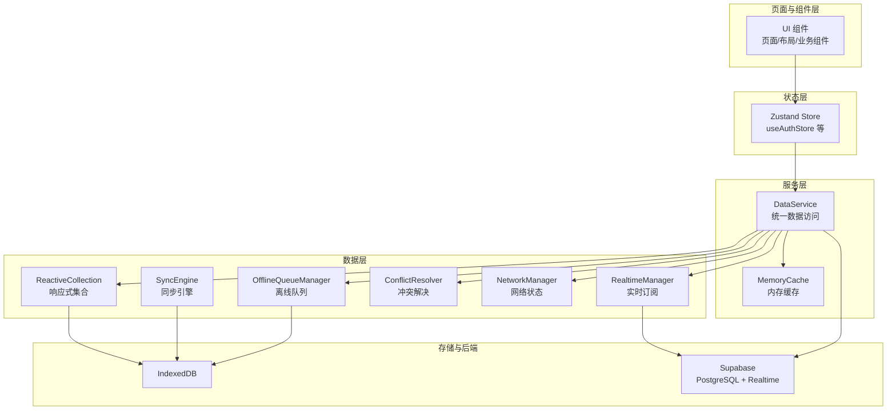
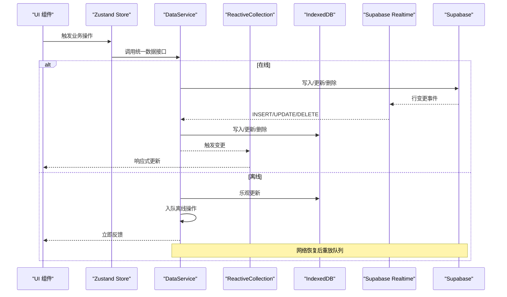
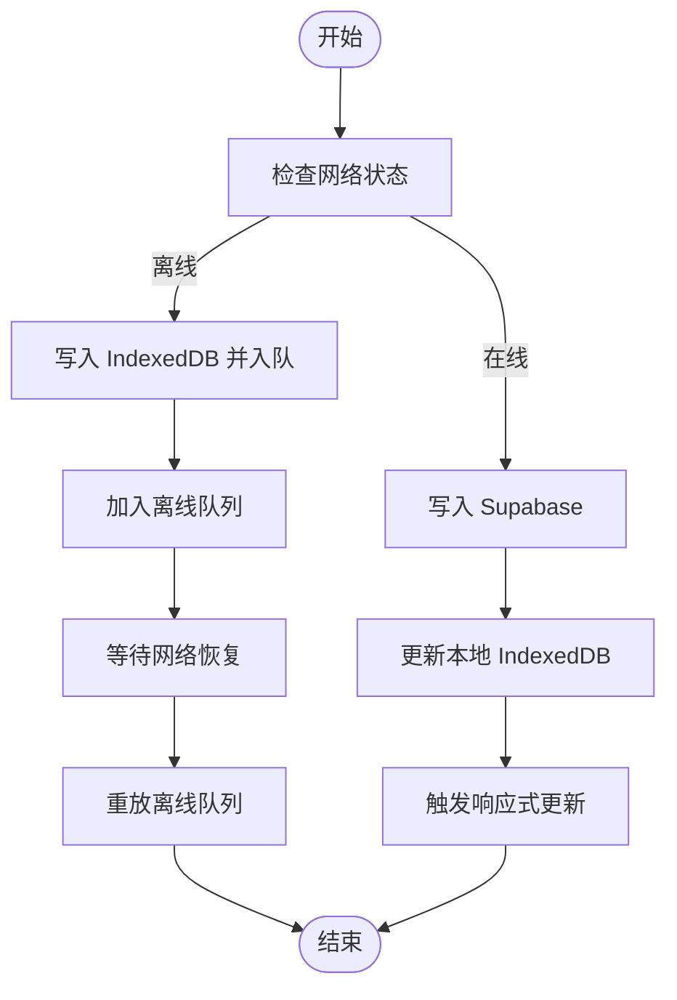
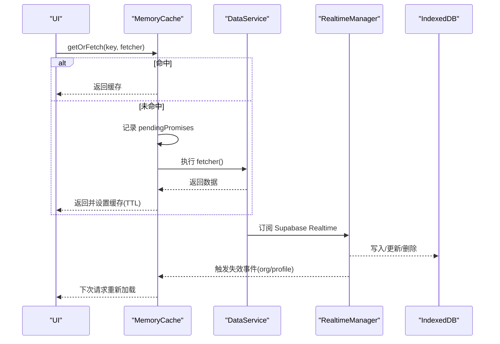
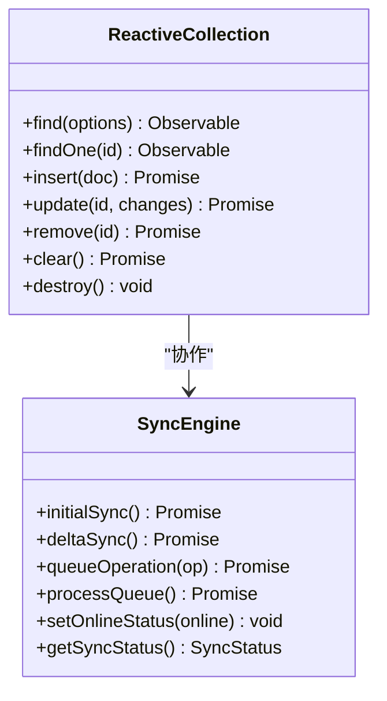
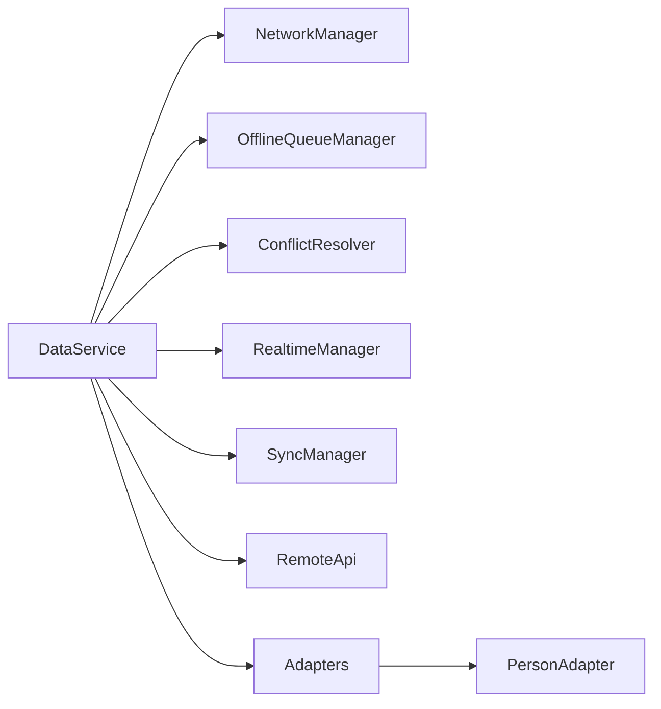
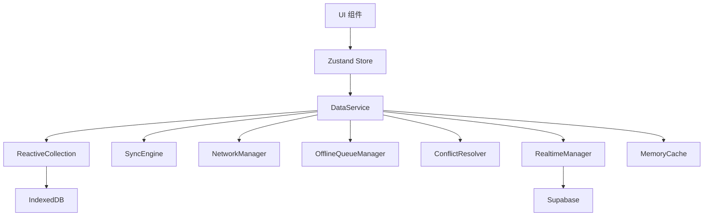

# 设计原则

<cite>
**本文引用的文件**
- [app/src/services/data/DataService.ts](file://app/src/services/data/DataService.ts)
- [app/src/services/cache/memoryCache.ts](file://app/src/services/cache/memoryCache.ts)
- [app/src/lib/reactive/index.ts](file://app/src/lib/reactive/index.ts)
- [app/src/lib/reactive/ReactiveCollection.ts](file://app/src/lib/reactive/ReactiveCollection.ts)
- [app/src/lib/reactive/SyncEngine.ts](file://app/src/lib/reactive/SyncEngine.ts)
- [app/src/services/data/network/networkManager.ts](file://app/src/services/data/network/networkManager.ts)
- [app/src/services/data/conflict/conflictResolver.ts](file://app/src/services/data/conflict/conflictResolver.ts)
- [app/src/services/data/offline-queue/offlineQueueManager.ts](file://app/src/services/data/offline-queue/offlineQueueManager.ts)
- [app/src/services/data/realtime/realtimeManager.ts](file://app/src/services/data/realtime/realtimeManager.ts)
- [app/src/services/data/adapters/personAdapter.ts](file://app/src/services/data/adapters/personAdapter.ts)
- [app/src/stores/useAuthStore.ts](file://app/src/stores/useAuthStore.ts)
- [docs/Architecture.md](file://docs/Architecture.md)
</cite>

## 目录
1. [引言](#引言)
2. [项目结构](#项目结构)
3. [核心组件](#核心组件)
4. [架构总览](#架构总览)
5. [详细组件分析](#详细组件分析)
6. [依赖关系分析](#依赖关系分析)
7. [性能考量](#性能考量)
8. [故障排查指南](#故障排查指南)
9. [结论](#结论)
10. [附录](#附录)

## 引言
本设计原则文档面向 OPC-Starter 项目，系统阐述其核心设计思想与架构理念，包括“离线优先”、“Cache + Realtime 数据流”、“响应式设计”、“模块化架构”等，并结合实际代码实现解析这些原则的应用场景与落地方式。同时给出设计原则之间的权衡取舍，以及观察者模式、工厂模式等设计模式在项目中的具体体现，最后提供实施指南与最佳实践建议。

## 项目结构
OPC-Starter 采用“页面/组件层 → 状态层 → 服务层 → 数据层”的清晰分层，配合响应式数据层与统一数据访问服务，形成以用户为中心的高效数据通路。核心模块包括：
- 认证与状态：Zustand Store 管理用户会话与 UI 状态
- 数据服务：DataService 作为统一入口，协调缓存、离线队列、冲突解决、实时订阅与网络状态
- 响应式数据层：ReactiveCollection + SyncEngine 提供本地与远程的统一视图与变更传播
- 缓存层：MemoryCache 提供内存级缓存与 TTL、自动失效
- 实时层：Supabase Realtime 订阅，驱动本地数据库与 UI 的即时更新

图表来源
- [docs/Architecture.md:131-158](file://docs/Architecture.md#L131-L158)
- [app/src/services/data/DataService.ts:71-131](file://app/src/services/data/DataService.ts#L71-L131)
- [app/src/lib/reactive/ReactiveCollection.ts:16-47](file://app/src/lib/reactive/ReactiveCollection.ts#L16-L47)
- [app/src/lib/reactive/SyncEngine.ts:24-47](file://app/src/lib/reactive/SyncEngine.ts#L24-L47)
- [app/src/services/cache/memoryCache.ts:20-41](file://app/src/services/cache/memoryCache.ts#L20-L41)
- [app/src/services/data/network/networkManager.ts:19-72](file://app/src/services/data/network/networkManager.ts#L19-L72)
- [app/src/services/data/offline-queue/offlineQueueManager.ts:24-47](file://app/src/services/data/offline-queue/offlineQueueManager.ts#L24-L47)
- [app/src/services/data/conflict/conflictResolver.ts:69-136](file://app/src/services/data/conflict/conflictResolver.ts#L69-L136)
- [app/src/services/data/realtime/realtimeManager.ts:22-121](file://app/src/services/data/realtime/realtimeManager.ts#L22-L121)

章节来源
- [docs/Architecture.md:160-196](file://docs/Architecture.md#L160-L196)

## 核心组件
- 统一数据访问服务（DataService）：集中封装读写、离线队列、实时订阅、冲突解决、网络状态与同步编排，对外暴露一致的 API。
- 响应式数据层（ReactiveCollection + SyncEngine）：将本地与远程数据抽象为可观察集合，支持查询、变更与冲突合并。
- 缓存层（MemoryCache）：对不频繁变化的数据进行内存缓存，支持 TTL、并发去重与基于 Realtime 的自动失效。
- 网络状态管理（NetworkManager）：监听在线/离线事件，触发队列处理与状态广播。
- 离线队列（OfflineQueueManager）：在网络不可用时缓存写操作，恢复在线后按序重放。
- 冲突解决（ConflictResolver）：提供多种合并策略，确保数据一致性。
- 实时订阅（RealtimeManager）：订阅 Supabase Realtime，驱动本地 IndexedDB 与 UI 即时更新。
- 认证状态（useAuthStore）：基于 Zustand 的认证状态管理，持久化与事件监听。

章节来源
- [app/src/services/data/DataService.ts:71-419](file://app/src/services/data/DataService.ts#L71-L419)
- [app/src/lib/reactive/ReactiveCollection.ts:16-256](file://app/src/lib/reactive/ReactiveCollection.ts#L16-L256)
- [app/src/lib/reactive/SyncEngine.ts:24-250](file://app/src/lib/reactive/SyncEngine.ts#L24-L250)
- [app/src/services/cache/memoryCache.ts:20-192](file://app/src/services/cache/memoryCache.ts#L20-L192)
- [app/src/services/data/network/networkManager.ts:19-72](file://app/src/services/data/network/networkManager.ts#L19-L72)
- [app/src/services/data/offline-queue/offlineQueueManager.ts:24-168](file://app/src/services/data/offline-queue/offlineQueueManager.ts#L24-L168)
- [app/src/services/data/conflict/conflictResolver.ts:69-136](file://app/src/services/data/conflict/conflictResolver.ts#L69-L136)
- [app/src/services/data/realtime/realtimeManager.ts:22-121](file://app/src/services/data/realtime/realtimeManager.ts#L22-L121)
- [app/src/stores/useAuthStore.ts:24-173](file://app/src/stores/useAuthStore.ts#L24-L173)

## 架构总览
OPC-Starter 的数据流遵循“Cache + Realtime”范式：读取优先本地（IndexedDB），写入采用乐观更新（先本地再云端），通过 Supabase Realtime 订阅实现近实时同步；网络状态变化驱动离线队列处理与状态广播，最终达到“离线优先、强一致”的用户体验。

图表来源
- [docs/Architecture.md:131-158](file://docs/Architecture.md#L131-L158)
- [app/src/services/data/DataService.ts:326-414](file://app/src/services/data/DataService.ts#L326-L414)
- [app/src/services/data/realtime/realtimeManager.ts:34-93](file://app/src/services/data/realtime/realtimeManager.ts#L34-L93)
- [app/src/services/data/network/networkManager.ts:32-49](file://app/src/services/data/network/networkManager.ts#L32-L49)
- [app/src/services/data/offline-queue/offlineQueueManager.ts:64-102](file://app/src/services/data/offline-queue/offlineQueueManager.ts#L64-L102)

## 详细组件分析

### 离线优先设计
- 读取：优先从 IndexedDB 返回，保证首屏与弱网体验
- 写入：在线时先写 Supabase，成功后再更新本地；离线时先写本地并入队，恢复在线后重放
- 乐观更新：UI 立即反映用户输入，网络成功后与服务端对齐，失败时回滚
- 网络监听：通过 NetworkManager 监听 online/offline，自动触发队列处理与状态广播

图表来源
- [app/src/services/data/DataService.ts:350-414](file://app/src/services/data/DataService.ts#L350-L414)
- [app/src/services/data/network/networkManager.ts:32-49](file://app/src/services/data/network/networkManager.ts#L32-L49)
- [app/src/services/data/offline-queue/offlineQueueManager.ts:64-143](file://app/src/services/data/offline-queue/offlineQueueManager.ts#L64-L143)

章节来源
- [app/src/services/data/DataService.ts:153-183](file://app/src/services/data/DataService.ts#L153-L183)
- [app/src/services/data/network/networkManager.ts:19-72](file://app/src/services/data/network/networkManager.ts#L19-L72)
- [app/src/services/data/offline-queue/offlineQueueManager.ts:24-168](file://app/src/services/data/offline-queue/offlineQueueManager.ts#L24-L168)

### Cache + Realtime 数据流
- 读：MemoryCache 命中优先，未命中则加载并缓存；并发请求共享同一 Promise，避免重复请求
- 写：乐观更新本地，同时通过 Supabase Realtime 订阅接收远端变更，自动刷新本地
- 失效：基于 Realtime 事件（如组织/资料变更）自动批量失效相关缓存键
- 一致性：ConflictResolver 在版本冲突时按策略合并，确保最终一致

图表来源
- [app/src/services/cache/memoryCache.ts:81-110](file://app/src/services/cache/memoryCache.ts#L81-L110)
- [app/src/services/cache/memoryCache.ts:180-191](file://app/src/services/cache/memoryCache.ts#L180-L191)
- [app/src/services/data/realtime/realtimeManager.ts:34-93](file://app/src/services/data/realtime/realtimeManager.ts#L34-L93)
- [app/src/services/data/DataService.ts:83-101](file://app/src/services/data/DataService.ts#L83-L101)

章节来源
- [app/src/services/cache/memoryCache.ts:20-192](file://app/src/services/cache/memoryCache.ts#L20-L192)
- [app/src/services/data/realtime/realtimeManager.ts:22-121](file://app/src/services/data/realtime/realtimeManager.ts#L22-L121)
- [app/src/services/data/conflict/conflictResolver.ts:69-136](file://app/src/services/data/conflict/conflictResolver.ts#L69-L136)

### 响应式设计
- ReactiveCollection：将本地/远程适配器包装为可观察集合，支持查询、排序、过滤、插入/更新/删除与变更监听
- SyncEngine：负责初始同步、增量同步、离线队列处理与冲突解决，维持本地与远程的一致性
- Hooks：useQuery/useMutation/useSyncStatus 等，简化在组件中对数据的订阅与变更

图表来源
- [app/src/lib/reactive/ReactiveCollection.ts:16-256](file://app/src/lib/reactive/ReactiveCollection.ts#L16-L256)
- [app/src/lib/reactive/SyncEngine.ts:24-250](file://app/src/lib/reactive/SyncEngine.ts#L24-L250)
- [app/src/lib/reactive/index.ts:5-22](file://app/src/lib/reactive/index.ts#L5-L22)

章节来源
- [app/src/lib/reactive/ReactiveCollection.ts:16-256](file://app/src/lib/reactive/ReactiveCollection.ts#L16-L256)
- [app/src/lib/reactive/SyncEngine.ts:24-250](file://app/src/lib/reactive/SyncEngine.ts#L24-L250)
- [app/src/lib/reactive/index.ts:5-22](file://app/src/lib/reactive/index.ts#L5-L22)

### 模块化架构
- 服务层解耦：DataService 通过依赖注入的方式组合 NetworkManager、OfflineQueueManager、ConflictResolver、RealtimeManager、SyncManager 等子模块，职责单一、易于测试与替换
- 适配器模式：LocalAdapter/RemoteAdapter 抽象不同存储与数据源，ReactiveCollection 仅依赖适配器接口，便于扩展新实体
- 工厂函数：createXxx(...) 形式的工厂函数统一创建与配置模块，降低耦合度

图表来源
- [app/src/services/data/DataService.ts:76-109](file://app/src/services/data/DataService.ts#L76-L109)
- [app/src/services/data/adapters/personAdapter.ts:12-46](file://app/src/services/data/adapters/personAdapter.ts#L12-L46)

章节来源
- [app/src/services/data/DataService.ts:71-131](file://app/src/services/data/DataService.ts#L71-L131)
- [app/src/services/data/adapters/personAdapter.ts:12-46](file://app/src/services/data/adapters/personAdapter.ts#L12-L46)

### 设计模式应用实例
- 观察者模式：NetworkManager 通过自定义事件广播网络状态变化；RealtimeManager 订阅 Supabase 事件并通过回调通知上层；MemoryCache 监听 dataservice:* 事件自动失效缓存
- 工厂模式：createNetworkManager/createOfflineQueueManager/createConflictResolver/createRealtimeManager/createSyncManager 等工厂函数，集中创建与配置模块实例
- 适配器模式：PersonAdapter 将 IndexedDB 封装为 LocalAdapter 接口，ReactiveCollection 通过适配器屏蔽底层差异

章节来源
- [app/src/services/data/network/networkManager.ts:24-49](file://app/src/services/data/network/networkManager.ts#L24-L49)
- [app/src/services/data/realtime/realtimeManager.ts:34-93](file://app/src/services/data/realtime/realtimeManager.ts#L34-L93)
- [app/src/services/cache/memoryCache.ts:180-191](file://app/src/services/cache/memoryCache.ts#L180-L191)
- [app/src/services/data/offline-queue/offlineQueueManager.ts:24-47](file://app/src/services/data/offline-queue/offlineQueueManager.ts#L24-L47)
- [app/src/services/data/conflict/conflictResolver.ts:69-136](file://app/src/services/data/conflict/conflictResolver.ts#L69-L136)
- [app/src/services/data/adapters/personAdapter.ts:12-46](file://app/src/services/data/adapters/personAdapter.ts#L12-L46)

## 依赖关系分析
- 组件与状态：UI 通过 Zustand Store 间接依赖 DataService，保持 UI 与数据访问的解耦
- 数据服务内部：DataService 依赖多个子模块，形成高内聚、低耦合的组合体
- 响应式层：ReactiveCollection 依赖 LocalAdapter/RemoteAdapter，SyncEngine 负责调度与冲突解决
- 缓存与实时：MemoryCache 与 RealtimeManager 通过事件解耦，实现自动失效与数据一致性

图表来源
- [app/src/stores/useAuthStore.ts:24-173](file://app/src/stores/useAuthStore.ts#L24-L173)
- [app/src/services/data/DataService.ts:76-109](file://app/src/services/data/DataService.ts#L76-L109)
- [app/src/lib/reactive/ReactiveCollection.ts:16-47](file://app/src/lib/reactive/ReactiveCollection.ts#L16-L47)
- [app/src/lib/reactive/SyncEngine.ts:24-47](file://app/src/lib/reactive/SyncEngine.ts#L24-L47)
- [app/src/services/cache/memoryCache.ts:180-191](file://app/src/services/cache/memoryCache.ts#L180-L191)
- [app/src/services/data/realtime/realtimeManager.ts:22-121](file://app/src/services/data/realtime/realtimeManager.ts#L22-L121)

章节来源
- [app/src/services/data/DataService.ts:71-131](file://app/src/services/data/DataService.ts#L71-L131)
- [app/src/lib/reactive/index.ts:5-22](file://app/src/lib/reactive/index.ts#L5-L22)

## 性能考量
- 读性能：Cache + Realtime 使读取 100% 走本地，显著降低延迟；MemoryCache 提供 TTL 与并发去重，减少重复请求
- 写性能：乐观更新立即反馈，离线队列异步重放，避免阻塞 UI；批量写入通过队列顺序执行，降低冲突概率
- 实时性：Supabase Realtime 订阅实现近实时同步，减少轮询成本
- 内存占用：MemoryCache 支持 TTL 与批量失效，避免长期驻留无效数据
- 网络抖动：指数退避与最大重试次数控制，避免风暴式重试

## 故障排查指南
- 离线队列堆积：检查 NetworkManager 是否正确监听 online/offline；确认 processOfflineQueueWithRetry 是否被触发；查看队列统计与失败操作
- 实时同步异常：确认 Supabase Realtime 订阅是否建立；检查 transformSupabasePerson 与冲突解决回调；验证 IndexedDB 写入日志
- 冲突过多：调整 ConflictResolver 策略；优化 UI 交互减少并发修改；记录冲突统计并定位热点字段
- 缓存不一致：确认 dataservice:* 事件是否触发；检查 MemoryCache 的失效逻辑；验证 TTL 设置是否合理
- 认证状态异常：检查 useAuthStore 的初始化与 onAuthStateChange 回调；确认持久化字段是否正确

章节来源
- [app/src/services/data/offline-queue/offlineQueueManager.ts:104-143](file://app/src/services/data/offline-queue/offlineQueueManager.ts#L104-L143)
- [app/src/services/data/realtime/realtimeManager.ts:34-93](file://app/src/services/data/realtime/realtimeManager.ts#L34-L93)
- [app/src/services/data/conflict/conflictResolver.ts:77-116](file://app/src/services/data/conflict/conflictResolver.ts#L77-L116)
- [app/src/services/cache/memoryCache.ts:180-191](file://app/src/services/cache/memoryCache.ts#L180-L191)
- [app/src/stores/useAuthStore.ts:35-60](file://app/src/stores/useAuthStore.ts#L35-L60)

## 结论
OPC-Starter 通过“离线优先 + Cache + Realtime + 响应式 + 模块化”的设计组合，在保证用户体验的同时兼顾了数据一致性与可维护性。离线队列与乐观更新提升了健壮性，MemoryCache 与 Supabase Realtime 提升了性能与实时性，ReactiveCollection 与 SyncEngine 保障了复杂场景下的数据一致性，而工厂化与适配器模式则让架构具备良好的扩展性与可演进性。

## 附录
- 实施指南
  - 新增实体：在 types 中定义类型 → 在 adapters 中创建 LocalAdapter → 在 stores 中创建 Store → 在 DataService 中注册订阅与适配器
  - 新增 Agent 工具：后端在 Edge Functions 中定义工具 → 前端在工具注册表中注册 → 在 A2UI 中渲染
  - 新增页面：在 pages 中创建组件 → 在 routes 中注册 → 在主布局中添加导航入口
- 最佳实践
  - 读操作一律走本地，写操作采用乐观更新并入队离线
  - 使用 MemoryCache 缓存不频繁变化的数据，合理设置 TTL
  - 通过 Realtime 事件驱动缓存失效，避免陈旧数据
  - 冲突解决采用“版本比较 + 字段级合并”，必要时提供用户干预入口
  - 使用工厂函数与适配器模式隔离依赖，便于单元测试与替换