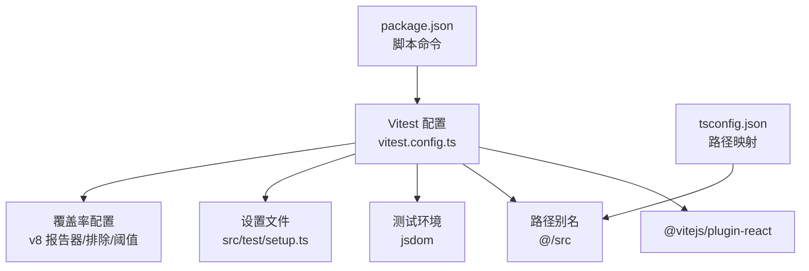
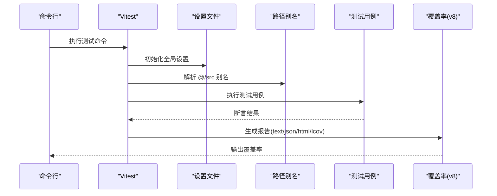
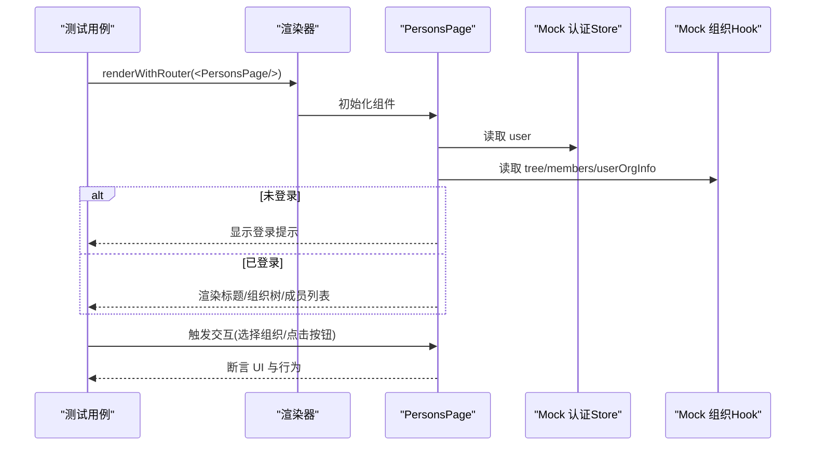
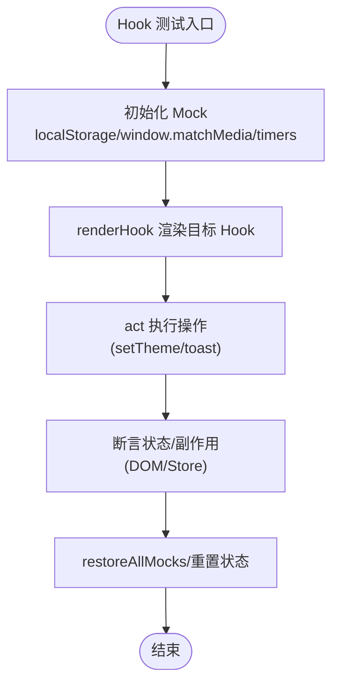
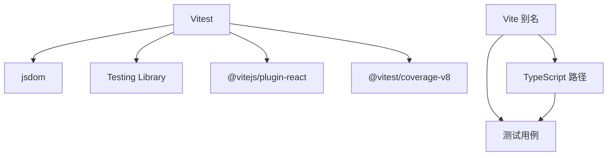

# 单元测试

<cite>
**本文引用的文件**
- [vitest.config.ts](file://app/vitest.config.ts)
- [package.json](file://app/package.json)
- [tsconfig.json](file://app/tsconfig.json)
- [setup.ts](file://app/src/test/setup.ts)
- [testUtils.tsx](file://app/src/test/testUtils.tsx)
- [useTheme.test.ts](file://app/src/hooks/__tests__/useTheme.test.ts)
- [useToast.test.ts](file://app/src/hooks/__tests__/useToast.test.ts)
- [PersonsPage.test.tsx](file://app/src/pages/__tests__/PersonsPage.test.tsx)
- [dateFormatter.test.ts](file://app/src/utils/__tests__/dateFormatter.test.ts)
- [DataService.test.ts](file://app/src/services/data/DataService.test.ts)
- [useAuthStore.test.ts](file://app/src/stores/__tests__/useAuthStore.test.ts)
- [agentSuggestions.test.ts](file://app/src/config/__tests__/agentSuggestions.test.ts)
- [error.test.ts](file://app/src/types/__tests__/error.test.ts)
- [downloadHelper.test.ts](file://app/src/utils/__tests__/downloadHelper.test.ts)
</cite>

## 目录
1. [简介](#简介)
2. [项目结构](#项目结构)
3. [核心组件](#核心组件)
4. [架构总览](#架构总览)
5. [详细组件分析](#详细组件分析)
6. [依赖分析](#依赖分析)
7. [性能考虑](#性能考虑)
8. [故障排查指南](#故障排查指南)
9. [结论](#结论)
10. [附录](#附录)

## 简介
本文件系统性梳理基于 Vitest 的单元测试体系，覆盖测试环境与插件配置（jsdom、@vitejs/plugin-react）、路径别名、测试设置文件、覆盖率配置（报告器、排除规则、包含范围、阈值）、测试用例编写范式（组件测试、Hook 测试、工具函数测试、服务层测试）、异步测试与 Mock 策略、断言方法与最佳实践，以及测试运行命令与调试技巧。

## 项目结构
- 测试运行由 Vitest 驱动，使用 jsdom 作为 DOM 环境，通过 @vitejs/plugin-react 支持 React 组件与 JSX。
- 路径别名通过 Vite 与 TypeScript 双重配置实现，统一使用 @/src 作为根路径别名，便于在测试中引用源码模块。
- 测试设置文件用于全局注入测试工具与 polyfill，确保 jsdom 环境下的行为一致性。
- 覆盖率配置采用 v8 提供商，输出 text、json、html、lcov 四种报告器，并设定包含与排除规则及阈值。

**图示来源**
- [vitest.config.ts:1-40](file://app/vitest.config.ts#L1-L40)
- [package.json:26-46](file://app/package.json#L26-L46)
- [tsconfig.json:7-12](file://app/tsconfig.json#L7-L12)

**章节来源**
- [vitest.config.ts:1-40](file://app/vitest.config.ts#L1-L40)
- [package.json:26-46](file://app/package.json#L26-L46)
- [tsconfig.json:7-12](file://app/tsconfig.json#L7-L12)

## 核心组件
- 测试框架与环境
  - Vitest：提供测试运行、断言、Mock、覆盖率等能力。
  - jsdom：在 Node 环境模拟浏览器 DOM API，支持组件渲染与交互测试。
- 插件与别名
  - @vitejs/plugin-react：支持 JSX/TSX 编译与热更新。
  - 路径别名：Vite 与 TypeScript 同时配置 @/src，统一模块引用。
- 设置文件
  - 注入 @testing-library/jest-dom，补充 jsdom 缺失的 Blob.arrayBuffer polyfill。
- 覆盖率
  - v8 提供商，报告器：text、json、html、lcov；包含 src/**/*.{ts,tsx}；排除 node_modules、src/test、src/mocks、*.d.ts、*.config.*、dist、cypress、public 等；阈值：lines、functions、branches、statements ≥ 25/18。

**章节来源**
- [vitest.config.ts:12-39](file://app/vitest.config.ts#L12-L39)
- [setup.ts:1-16](file://app/src/test/setup.ts#L1-L16)
- [tsconfig.json:7-12](file://app/tsconfig.json#L7-L12)

## 架构总览
下图展示测试执行的关键流程：Vitest 读取配置 → 加载设置文件 → 解析别名 → 运行测试 → 产出覆盖率报告。

**图示来源**
- [vitest.config.ts:12-39](file://app/vitest.config.ts#L12-L39)
- [setup.ts:1-16](file://app/src/test/setup.ts#L1-L16)
- [package.json:36-40](file://app/package.json#L36-L40)

## 详细组件分析

### 测试环境与插件配置
- 环境：environment: 'jsdom'，确保 DOM API 可用，适合组件与 Hook 测试。
- 插件：plugins: [@vitejs/plugin-react()]，支持 React 组件编译。
- 路径别名：resolve.alias.@ 与 tsconfig.paths 均指向 src，保证测试与源码一致。
- 设置文件：setupFiles: ['./src/test/setup.ts']，注入 jest-dom 与 Blob.polyfill。

**章节来源**
- [vitest.config.ts:5-11](file://app/vitest.config.ts#L5-L11)
- [vitest.config.ts:12-15](file://app/vitest.config.ts#L12-L15)
- [tsconfig.json:7-12](file://app/tsconfig.json#L7-L12)
- [setup.ts:1-16](file://app/src/test/setup.ts#L1-L16)

### 覆盖率配置
- 提供商：provider: 'v8'
- 报告器：reporter: ['text','json','html','lcov']
- 排除：node_modules、src/test、src/mocks、**/*.d.ts、**/*.config.*、**/mockData、dist、cypress、public
- 包含：include: ['src/**/*.{ts,tsx}']
- 阈值：lines ≥ 25、functions ≥ 25、branches ≥ 18、statements ≥ 25

**章节来源**
- [vitest.config.ts:16-37](file://app/vitest.config.ts#L16-L37)

### 测试设置文件
- 注入 @testing-library/jest-dom，扩展 expect 的匹配器。
- 为 jsdom 补充 Blob.prototype.arrayBuffer，避免部分浏览器 API 在 Node 环境缺失导致的测试失败。

**章节来源**
- [setup.ts:1-16](file://app/src/test/setup.ts#L1-L16)

### 路径别名配置
- Vite 层：resolve.alias.@ 指向 ./src。
- TypeScript 层：compilerOptions.paths.@/* 指向 src/*。
- 作用：在测试中统一使用 @/xxx 引用源码模块，提升可读性与可维护性。

**章节来源**
- [vitest.config.ts:7-11](file://app/vitest.config.ts#L7-L11)
- [tsconfig.json:7-12](file://app/tsconfig.json#L7-L12)

### 组件测试示例：PersonsPage
- 目标：验证页面在不同用户态、组织态、加载态、错误态下的渲染与交互。
- Mock 策略：
  - Mock 认证 Store 与组织 Hook，控制用户信息与组织树数据。
  - Mock 子组件，确保渲染稳定可控。
- 断言要点：
  - 登录态/未登录态提示。
  - 标题与描述文案存在性。
  - 加载态与错误态文案。
  - 组织树节点渲染与交互。
  - 成员列表与角色权限控制。
  - 初始化时调用 loadTree 与 getUserOrgInfo。

**图示来源**
- [PersonsPage.test.tsx:1-211](file://app/src/pages/__tests__/PersonsPage.test.tsx#L1-L211)
- [testUtils.tsx:18-36](file://app/src/test/testUtils.tsx#L18-L36)

**章节来源**
- [PersonsPage.test.tsx:1-211](file://app/src/pages/__tests__/PersonsPage.test.tsx#L1-L211)
- [testUtils.tsx:18-36](file://app/src/test/testUtils.tsx#L18-L36)

### Hook 测试示例：useTheme 与 useToast
- useTheme：验证主题切换、localStorage 写入、DOM 类名变更、系统偏好监听。
- useToast：验证 Toast 添加/移除、快捷方法、定时器推进与自动消失。
- Mock 策略：使用 vi.spyOn Storage.prototype 与 window.matchMedia；使用 vi.useFakeTimers 控制时间推进。

**图示来源**
- [useTheme.test.ts:12-112](file://app/src/hooks/__tests__/useTheme.test.ts#L12-L112)
- [useToast.test.ts:10-131](file://app/src/hooks/__tests__/useToast.test.ts#L10-L131)

**章节来源**
- [useTheme.test.ts:12-112](file://app/src/hooks/__tests__/useTheme.test.ts#L12-L112)
- [useToast.test.ts:10-131](file://app/src/hooks/__tests__/useToast.test.ts#L10-L131)

### 工具函数测试示例：dateFormatter 与 downloadHelper
- dateFormatter：验证日期格式化、相对时间、标签生成等函数在不同输入下的行为。
- downloadHelper：验证 Blob 下载、Base64 下载、Base64 转 Blob 的行为，Mock URL.createObjectURL/revolve 与 DOM API。
- Mock 策略：使用 vi.spyOn 替换全局 API；使用 vi.useFakeTimers 控制相对时间基准。

**章节来源**
- [dateFormatter.test.ts:16-121](file://app/src/utils/__tests__/dateFormatter.test.ts#L16-L121)
- [downloadHelper.test.ts:9-100](file://app/src/utils/__tests__/downloadHelper.test.ts#L9-L100)

### 服务层测试示例：DataService
- 目标：验证数据服务的同步状态、网络事件响应、集合访问、单例模式、Observable API、冲突统计与队列处理。
- Mock 策略：动态导入并 vi.mock Supabase 客户端、IndexedDB 存储、OSS 工具；使用自定义 navigator.onLine polyfill 与事件派发。
- 异步处理：使用 beforeEach 重置状态与 Mock，动态导入模块以确保每次测试独立实例。

**章节来源**
- [DataService.test.ts:1-328](file://app/src/services/data/DataService.test.ts#L1-L328)

### 状态管理测试示例：useAuthStore
- 目标：验证认证状态初始化、登录/注册/登出流程、错误处理与状态清理。
- Mock 策略：vi.mock 认证服务模块，分别控制 getCurrentUser/signIn/signUp/signOut/onAuthStateChange 的返回值与异常。

**章节来源**
- [useAuthStore.test.ts:1-182](file://app/src/stores/__tests__/useAuthStore.test.ts#L1-L182)

### 配置与工具类测试示例：agentSuggestions 与 error
- agentSuggestions：验证页面级与全局智能推荐配置的结构与内容。
- error：验证 AppError 构造、分类/严重性/可恢复性推断、序列化与转换工具。

**章节来源**
- [agentSuggestions.test.ts:1-144](file://app/src/config/__tests__/agentSuggestions.test.ts#L1-L144)
- [error.test.ts:1-181](file://app/src/types/__tests__/error.test.ts#L1-L181)

## 依赖分析
- 测试运行依赖
  - Vitest 与 jsdom：提供测试运行与 DOM 环境。
  - @vitejs/plugin-react：支持 React 组件编译。
  - @testing-library/react：提供渲染与查询工具。
  - @testing-library/jest-dom：扩展断言匹配器。
- 覆盖率依赖
  - @vitest/coverage-v8：v8 提供商。
- 路径别名依赖
  - Vite 与 TypeScript 双重配置，确保别名一致。

**图示来源**
- [vitest.config.ts:1-40](file://app/vitest.config.ts#L1-L40)
- [package.json:86-121](file://app/package.json#L86-L121)
- [tsconfig.json:7-12](file://app/tsconfig.json#L7-L12)

**章节来源**
- [vitest.config.ts:1-40](file://app/vitest.config.ts#L1-L40)
- [package.json:86-121](file://app/package.json#L86-L121)
- [tsconfig.json:7-12](file://app/tsconfig.json#L7-L12)

## 性能考虑
- 使用 jsdom 与 @vitejs/plugin-react 可在本地快速运行测试，避免真实浏览器开销。
- 覆盖率仅对 src/**/*.{ts,tsx} 生效，减少无关文件扫描与计算。
- 合理使用 vi.useFakeTimers 控制异步与定时器，避免真实等待影响测试速度。
- 通过 include/exclude 精准控制覆盖率范围，平衡准确性与性能。

## 故障排查指南
- jsdom 缺失 API 导致测试失败
  - 症状：Blob.arrayBuffer 或其他浏览器 API 报错。
  - 处理：确认已通过设置文件注入 polyfill。
  - 参考：[setup.ts:4-15](file://app/src/test/setup.ts#L4-L15)
- 路径别名无法解析
  - 症状：import '@/xxx' 报模块未找到。
  - 处理：检查 Vite 与 TypeScript 的别名配置是否一致。
  - 参考：[vitest.config.ts:7-11](file://app/vitest.config.ts#L7-L11)、[tsconfig.json:7-12](file://app/tsconfig.json#L7-L12)
- 覆盖率不更新或为空
  - 症状：覆盖率报告缺失或为 0。
  - 处理：确认 include/exclude 规则与实际文件路径一致；确保测试文件被 Vitest 执行。
  - 参考：[vitest.config.ts:16-37](file://app/vitest.config.ts#L16-L37)
- 异步测试不稳定
  - 症状：定时器或网络事件导致断言时机不确定。
  - 处理：使用 vi.useFakeTimers 控制时间；使用 vi.advanceTimersByTime 推进时间；确保事件循环稳定。
  - 参考：[useToast.test.ts:11-19](file://app/src/hooks/__tests__/useToast.test.ts#L11-L19)、[dateFormatter.test.ts:17-24](file://app/src/utils/__tests__/dateFormatter.test.ts#L17-L24)
- Mock 不生效或污染全局状态
  - 症状：跨测试间状态互相影响。
  - 处理：在 beforeEach 中 vi.clearAllMocks/vi.resetModules；在 afterEach 中 vi.restoreAllMocks。
  - 参考：[DataService.test.ts:191-203](file://app/src/services/data/DataService.test.ts#L191-L203)、[useAuthStore.test.ts:30-38](file://app/src/stores/__tests__/useAuthStore.test.ts#L30-L38)

**章节来源**
- [setup.ts:4-15](file://app/src/test/setup.ts#L4-L15)
- [vitest.config.ts:7-11](file://app/vitest.config.ts#L7-L11)
- [vitest.config.ts:16-37](file://app/vitest.config.ts#L16-L37)
- [useToast.test.ts:11-19](file://app/src/hooks/__tests__/useToast.test.ts#L11-L19)
- [dateFormatter.test.ts:17-24](file://app/src/utils/__tests__/dateFormatter.test.ts#L17-L24)
- [DataService.test.ts:191-203](file://app/src/services/data/DataService.test.ts#L191-L203)
- [useAuthStore.test.ts:30-38](file://app/src/stores/__tests__/useAuthStore.test.ts#L30-L38)

## 结论
本项目的 Vitest 单元测试体系以 jsdom 与 @vitejs/plugin-react 为基础，结合路径别名与全局设置文件，形成一致、可维护的测试环境。通过明确的覆盖率策略与阈值、完善的 Mock 与断言实践，覆盖组件、Hook、工具函数、服务层与状态管理等多维度场景。建议持续优化测试用例粒度与覆盖率阈值，保持测试稳定性与可读性。

## 附录

### 测试运行命令与调试技巧
- 常用命令
  - 运行全部测试：npm run test
  - 运行并生成覆盖率：npm run coverage
  - 监听模式运行测试：npm run test:watch
  - 指定目录运行：npm run test:tools 或 npm run coverage:tools
- 调试技巧
  - 使用 vitest.run 与 --coverage 生成报告。
  - 在测试中使用 console.log 或 Vitest 的日志输出进行定位。
  - 对异步逻辑使用 vi.useFakeTimers 与 vi.advanceTimersByTime 控制节奏。
  - 对网络/离线场景使用自定义 navigator.onLine polyfill 与事件派发。

**章节来源**
- [package.json:36-40](file://app/package.json#L36-L40)