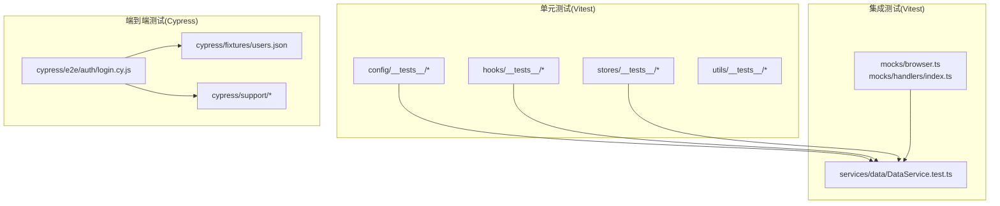
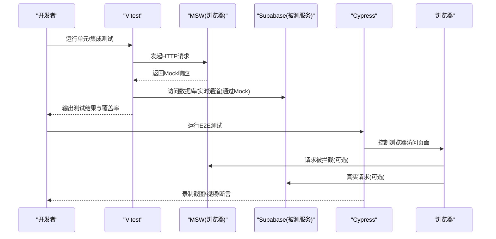
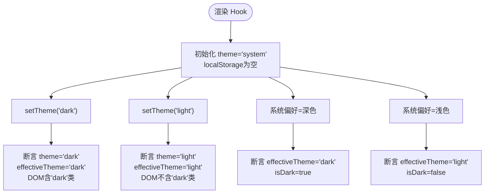
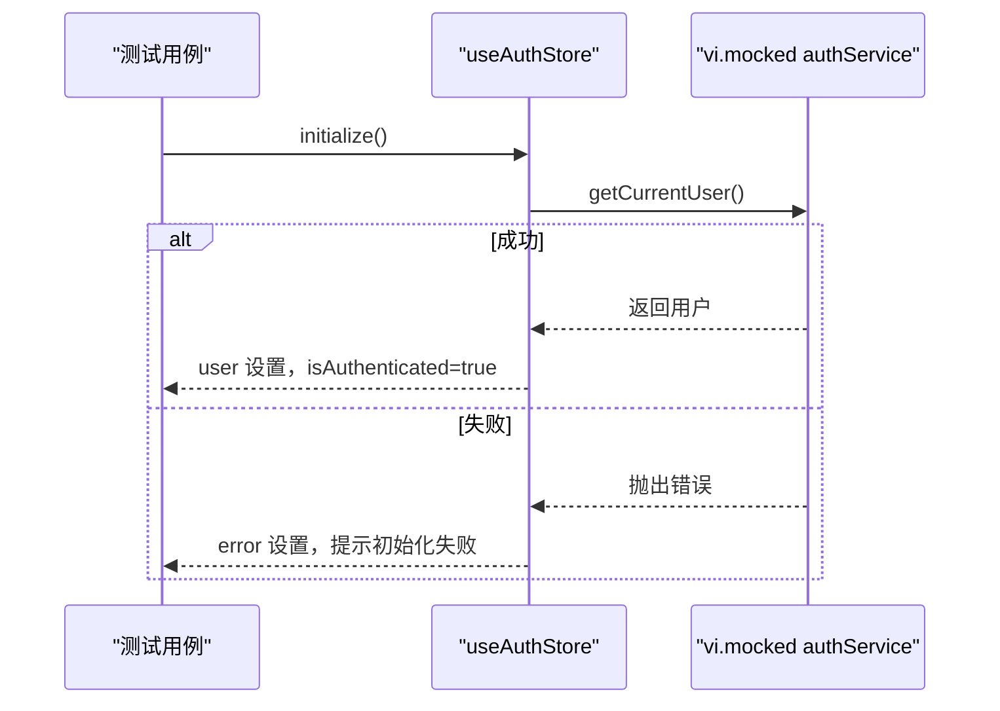
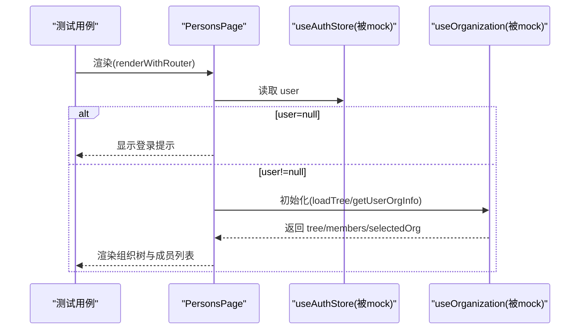
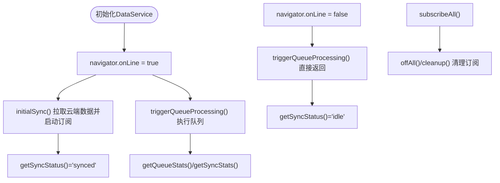
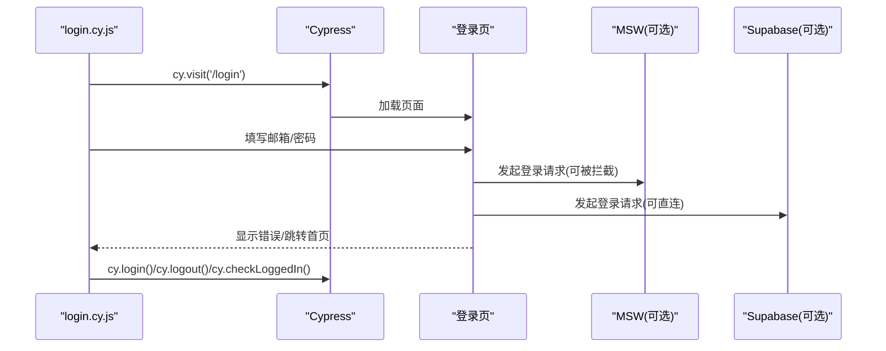
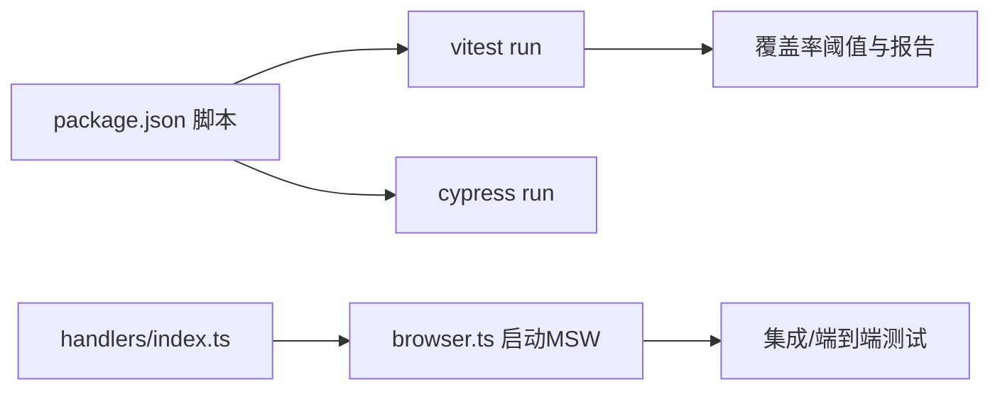

# 测试最佳实践

<cite>
**本文引用的文件**
- [app/vitest.config.ts](file://app/vitest.config.ts)
- [app/package.json](file://app/package.json)
- [app/src/test/setup.ts](file://app/src/test/setup.ts)
- [app/src/test/testUtils.tsx](file://app/src/test/testUtils.tsx)
- [app/src/config/__tests__/agentSuggestions.test.ts](file://app/src/config/__tests__/agentSuggestions.test.ts)
- [app/src/hooks/__tests__/useTheme.test.ts](file://app/src/hooks/__tests__/useTheme.test.ts)
- [app/src/stores/__tests__/useAuthStore.test.ts](file://app/src/stores/__tests__/useAuthStore.test.ts)
- [app/src/pages/__tests__/PersonsPage.test.tsx](file://app/src/pages/__tests__/PersonsPage.test.tsx)
- [app/src/services/data/DataService.test.ts](file://app/src/services/data/DataService.test.ts)
- [app/src/mocks/browser.ts](file://app/src/mocks/browser.ts)
- [app/src/mocks/handlers/index.ts](file://app/src/mocks/handlers/index.ts)
- [app/cypress.config.js](file://app/cypress.config.js)
- [app/cypress/e2e/auth/login.cy.js](file://app/cypress/e2e/auth/login.cy.js)
- [app/cypress/fixtures/users.json](file://app/cypress/fixtures/users.json)
- [app/cypress/support/commands.js](file://app/cypress/support/commands.js)
- [app/cypress/support/e2e.js](file://app/cypress/support/e2e.js)
</cite>

## 目录
1. [简介](#简介)
2. [项目结构](#项目结构)
3. [核心组件](#核心组件)
4. [架构总览](#架构总览)
5. [详细组件分析](#详细组件分析)
6. [依赖关系分析](#依赖关系分析)
7. [性能考量](#性能考量)
8. [故障排查指南](#故障排查指南)
9. [结论](#结论)
10. [附录](#附录)

## 简介
本文件系统化总结本项目的测试最佳实践，围绕测试金字塔（单元测试、集成测试、端到端测试）在项目中的落地方式展开，涵盖测试用例设计原则、Mock 数据管理策略、异步测试处理方法、覆盖率与质量标准、调试技巧与常见问题、以及性能优化与并行执行策略。内容基于仓库内现有配置与测试实现进行提炼，旨在帮助开发者在保证质量的同时提升测试效率。

## 项目结构
项目采用“分层+按功能模块”的组织方式，测试覆盖贯穿以下层次：
- 单元测试：位于各模块的 __tests__ 目录，如 hooks、stores、config、utils 等。
- 集成测试：通过 Vitest 运行，常配合 MSW（Mock Service Worker）模拟外部依赖。
- 端到端测试：基于 Cypress，覆盖真实用户场景与路由守卫、登录态等。

图表来源
- [app/src/config/__tests__/agentSuggestions.test.ts:1-144](file://app/src/config/__tests__/agentSuggestions.test.ts#L1-L144)
- [app/src/hooks/__tests__/useTheme.test.ts:1-112](file://app/src/hooks/__tests__/useTheme.test.ts#L1-L112)
- [app/src/stores/__tests__/useAuthStore.test.ts:1-182](file://app/src/stores/__tests__/useAuthStore.test.ts#L1-L182)
- [app/src/services/data/DataService.test.ts:1-328](file://app/src/services/data/DataService.test.ts#L1-L328)
- [app/src/mocks/browser.ts:1-41](file://app/src/mocks/browser.ts#L1-L41)
- [app/src/mocks/handlers/index.ts:1-28](file://app/src/mocks/handlers/index.ts#L1-L28)
- [app/cypress/e2e/auth/login.cy.js:1-238](file://app/cypress/e2e/auth/login.cy.js#L1-L238)
- [app/cypress/fixtures/users.json](file://app/cypress/fixtures/users.json)
- [app/cypress/support/commands.js](file://app/cypress/support/commands.js)
- [app/cypress/support/e2e.js](file://app/cypress/support/e2e.js)

章节来源
- [app/vitest.config.ts:1-40](file://app/vitest.config.ts#L1-L40)
- [app/package.json:26-46](file://app/package.json#L26-L46)
- [app/cypress.config.js:1-73](file://app/cypress.config.js#L1-L73)

## 核心组件
- 测试运行器与配置
  - Vitest：用于单元/集成测试，配置了 jsdom 环境、全局 setup、覆盖率阈值与排除规则。
  - Cypress：用于端到端测试，配置了基础 URL、视口、超时、重试、截图/视频等。
- 测试工具与辅助
  - setup.ts：为 jsdom 补齐 Blob.arrayBuffer polyfill，保证媒体类测试可用。
  - testUtils.tsx：提供路由包装器、数据工厂与通用渲染辅助，统一测试入口。
- Mock 体系
  - MSW：在浏览器侧拦截网络请求，集中管理 handlers 并支持开发环境启用。
  - fixtures：提供固定测试数据源，便于端到端测试复用。

章节来源
- [app/vitest.config.ts:12-39](file://app/vitest.config.ts#L12-L39)
- [app/cypress.config.js:15-72](file://app/cypress.config.js#L15-L72)
- [app/src/test/setup.ts:1-16](file://app/src/test/setup.ts#L1-L16)
- [app/src/test/testUtils.tsx:1-117](file://app/src/test/testUtils.tsx#L1-L117)
- [app/src/mocks/browser.ts:1-41](file://app/src/mocks/browser.ts#L1-L41)
- [app/src/mocks/handlers/index.ts:1-28](file://app/src/mocks/handlers/index.ts#L1-L28)

## 架构总览
测试架构由三层构成：单元测试（Vitest）、集成测试（Vitest + MSW）、端到端测试（Cypress）。数据流与交互如下：

图表来源
- [app/vitest.config.ts:12-39](file://app/vitest.config.ts#L12-L39)
- [app/src/mocks/browser.ts:1-41](file://app/src/mocks/browser.ts#L1-L41)
- [app/cypress.config.js:15-72](file://app/cypress.config.js#L15-L72)

## 详细组件分析

### 单元测试：useTheme Hook
- 设计要点
  - 使用 spy 替换 localStorage 与 matchMedia，隔离 DOM 依赖。
  - 通过 act 包裹状态变更，确保副作用稳定。
  - 断言主题切换对 DOM 类名的影响，验证“effectiveTheme”与“isDark”的一致性。
- 覆盖维度
  - 初始化默认值、显式设置 light/dark、system 模式下的系统偏好联动。
- 可读性与可维护性
  - beforeEach/afterEach 清理 mock，避免跨用例污染。
  - 使用明确的断言文案与分组描述，便于定位失败点。

图表来源
- [app/src/hooks/__tests__/useTheme.test.ts:1-112](file://app/src/hooks/__tests__/useTheme.test.ts#L1-L112)

章节来源
- [app/src/hooks/__tests__/useTheme.test.ts:1-112](file://app/src/hooks/__tests__/useTheme.test.ts#L1-L112)

### 单元测试：useAuthStore 状态管理
- 设计要点
  - vi.mock 导入路径级替换，隔离真实 authService。
  - 分组测试 initialize/signIn/signUp/signOut/clearError，覆盖成功/失败分支。
  - 断言 store 状态变化与副作用（error、loading、isAuthenticated）。
- 可读性与可维护性
  - beforeEach 清理状态与 mock，确保用例独立。
  - 使用具象的 mockUser 与错误对象，提高断言可读性。

图表来源
- [app/src/stores/__tests__/useAuthStore.test.ts:1-182](file://app/src/stores/__tests__/useAuthStore.test.ts#L1-L182)

章节来源
- [app/src/stores/__tests__/useAuthStore.test.ts:1-182](file://app/src/stores/__tests__/useAuthStore.test.ts#L1-L182)

### 单元测试：页面组件 PersonsPage
- 设计要点
  - 多处 vi.mock 组件与 store/hook，隔离复杂 UI。
  - 使用 renderWithRouter 与测试工具提供的 MemoryRouter 包装，确保路由行为一致。
  - 断言登录态、加载态、错误态、权限态与交互行为。
- 异步与交互
  - 使用 waitFor 等待异步渲染与状态更新。
  - 通过 data-testid 与 Testing Library 查询器精确断言。

图表来源
- [app/src/pages/__tests__/PersonsPage.test.tsx:1-211](file://app/src/pages/__tests__/PersonsPage.test.tsx#L1-L211)

章节来源
- [app/src/pages/__tests__/PersonsPage.test.tsx:1-211](file://app/src/pages/__tests__/PersonsPage.test.tsx#L1-L211)
- [app/src/test/testUtils.tsx:1-117](file://app/src/test/testUtils.tsx#L1-L117)

### 集成测试：DataService 同步与离线处理
- 设计要点
  - 通过 vi.mock 替换 supabase client、personDB、OSS 转换等依赖。
  - 模拟 navigator.onLine 与 online/offline 事件，验证同步状态机。
  - 断言队列统计、冲突统计、集合 API（Observable）与单例实例。
- 异步与可观测性
  - 使用 onSyncStatusChange 订阅状态变化，验证回调触发与清理。
  - 通过 channelHandlers 模拟 Realtime 事件，验证订阅/取消订阅。

图表来源
- [app/src/services/data/DataService.test.ts:1-328](file://app/src/services/data/DataService.test.ts#L1-L328)

章节来源
- [app/src/services/data/DataService.test.ts:1-328](file://app/src/services/data/DataService.test.ts#L1-L328)

### 端到端测试：登录流程
- 设计要点
  - Cypress 配置 baseUrl、视口、超时、重试、截图/视频。
  - 使用 fixtures 提供测试用户数据；通过自定义命令封装登录/登出。
  - 断言页面可见性、表单验证、错误提示、路由跳转与登录态持久化。
- 可靠性
  - setupNodeEvents 中打印关键配置与 MSW 状态，便于调试。
  - 重试配置在 CI 环境增强稳定性。

图表来源
- [app/cypress/e2e/auth/login.cy.js:1-238](file://app/cypress/e2e/auth/login.cy.js#L1-L238)
- [app/cypress.config.js:15-72](file://app/cypress.config.js#L15-L72)
- [app/cypress/fixtures/users.json](file://app/cypress/fixtures/users.json)
- [app/cypress/support/commands.js](file://app/cypress/support/commands.js)
- [app/cypress/support/e2e.js](file://app/cypress/support/e2e.js)

章节来源
- [app/cypress/e2e/auth/login.cy.js:1-238](file://app/cypress/e2e/auth/login.cy.js#L1-L238)
- [app/cypress.config.js:1-73](file://app/cypress.config.js#L1-L73)

## 依赖关系分析
- 测试运行脚本
  - package.json 定义了 test、coverage、test:watch、test:e2e 等脚本，统一入口。
- 覆盖率与报告
  - Vitest 配置开启 v8 provider，输出文本、JSON、HTML、LCov 报告，并设置行/函数/分支/语句阈值。
- Mock 体系
  - MSW 在浏览器侧统一拦截请求，handlers/index.ts 汇总多个处理器，注意 supabaseRestHandlers 的优先匹配顺序。

图表来源
- [app/package.json:26-46](file://app/package.json#L26-L46)
- [app/vitest.config.ts:16-39](file://app/vitest.config.ts#L16-L39)
- [app/src/mocks/handlers/index.ts:18-27](file://app/src/mocks/handlers/index.ts#L18-L27)
- [app/src/mocks/browser.ts:16-40](file://app/src/mocks/browser.ts#L16-L40)

章节来源
- [app/package.json:26-46](file://app/package.json#L26-L46)
- [app/vitest.config.ts:16-39](file://app/vitest.config.ts#L16-L39)
- [app/src/mocks/handlers/index.ts:1-28](file://app/src/mocks/handlers/index.ts#L1-L28)
- [app/src/mocks/browser.ts:1-41](file://app/src/mocks/browser.ts#L1-L41)

## 性能考量
- 测试执行策略
  - 单元测试：优先使用 Vitest 的内存快照与 jsdom，减少启动成本。
  - 集成测试：合理拆分模块测试，避免一次性加载过多依赖。
  - 端到端测试：利用重试机制与截图/视频记录失败场景，降低回归成本。
- 覆盖率与质量
  - 当前阈值：行 25、函数 25、分支 18、语句 25。建议结合业务关键路径逐步提升阈值。
- 并行与隔离
  - Vitest 默认并发执行，注意资源竞争（如 localStorage、navigator.onLine）需在 beforeEach 中重置。
  - Cypress 通过独立浏览器进程与 fixtures 隔离数据，适合端到端场景。

章节来源
- [app/vitest.config.ts:31-36](file://app/vitest.config.ts#L31-L36)
- [app/cypress.config.js:48-52](file://app/cypress.config.js#L48-L52)

## 故障排查指南
- 常见问题
  - jsdom 缺失 Blob.arrayBuffer：已在 setup.ts 中补丁，若仍报错检查 polyfill 是否生效。
  - MSW 未拦截：确认 browser.ts 已在应用启动阶段调用 startMSW，且 handlers 顺序正确。
  - Cypress 环境变量缺失：.env.test 未找到时会降级为默认配置，需确保 MSW 开关与凭据来源正确。
- 调试技巧
  - Vitest：使用 --reporter=verbose 输出详细日志；在测试中加入 console.log 辅助定位。
  - Cypress：开启 screenshotOnRunFailure 与视频录制；在 setupNodeEvents 中打印关键信息。
  - Mock：为每个 vi.mock 的模块添加最小化依赖，避免过度耦合。

章节来源
- [app/src/test/setup.ts:4-15](file://app/src/test/setup.ts#L4-L15)
- [app/src/mocks/browser.ts:16-40](file://app/src/mocks/browser.ts#L16-L40)
- [app/cypress.config.js:6-13](file://app/cypress.config.js#L6-L13)

## 结论
本项目在测试金字塔上形成了清晰的分层：单元测试聚焦逻辑与状态，集成测试通过 MSW 与依赖替换验证模块间协作，端到端测试覆盖真实用户路径。配合统一的测试工具与 Mock 策略、明确的覆盖率阈值与调试手段，能够在保证质量的前提下高效推进迭代。建议持续完善覆盖率阈值、拆分大型集成测试、引入更多真实环境下的端到端场景，以进一步提升测试有效性。

## 附录
- 测试金字塔与实施策略
  - 单元测试：占比约 70%，重点验证函数/Hook/Store 的纯逻辑与边界条件。
  - 集成测试：占比约 20%，验证模块间协作、Mock 依赖与异步流程。
  - 端到端测试：占比约 10%，验证用户旅程与路由/鉴权/登录态。
- 测试用例设计原则
  - 单一职责：每个用例聚焦一个行为或分支。
  - 可读性：使用明确的 describe/it 描述与断言文案。
  - 可维护性：统一的 setup/teardown、数据工厂与测试工具。
- Mock 数据管理
  - 固定数据：fixtures 与测试工具函数（如 createMock*）。
  - 状态隔离：beforeEach 清理 localStorage、navigator.onLine、channelHandlers 等。
  - 状态管理：store/hook 通过 vi.mock 隔离真实实现，便于断言副作用。
- 异步测试处理
  - Promise/async：使用 await 与 waitFor 等待异步完成。
  - RxJS Observable：通过 subscribe 订阅并断言回调触发。
  - 网络事件：通过事件派发与状态切换验证在线/离线流程。
- 覆盖率与质量标准
  - 当前行/函数/分支/语句阈值分别为 25/25/18/25，建议结合关键路径逐步提升。
- 性能优化与并行执行
  - 单元测试：充分利用 jsdom 与内存快照，减少 IO。
  - 集成测试：拆分大模块，避免重复初始化。
  - 端到端测试：合理设置重试与超时，优先关注关键路径。