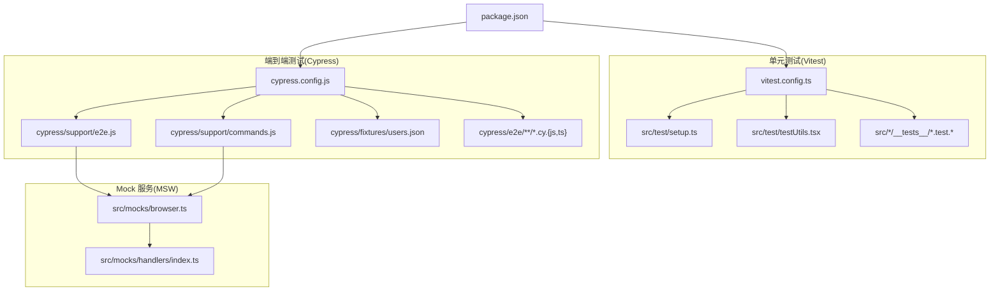
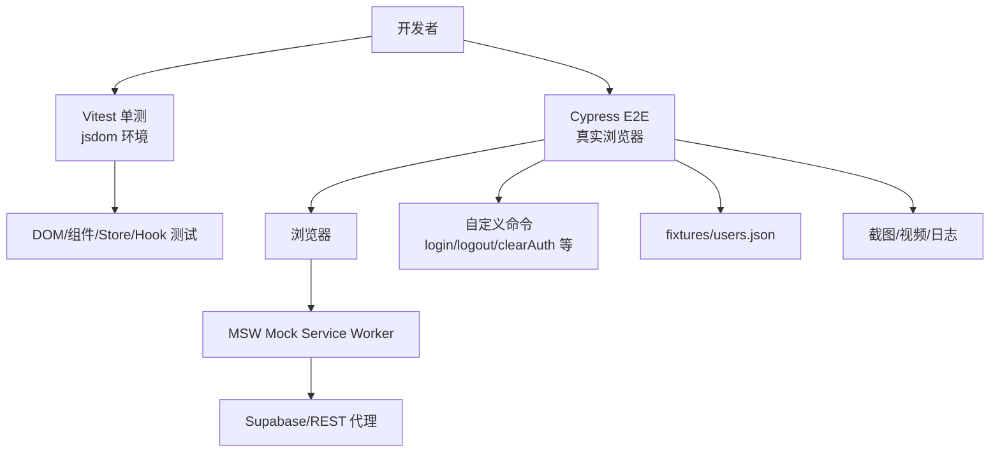
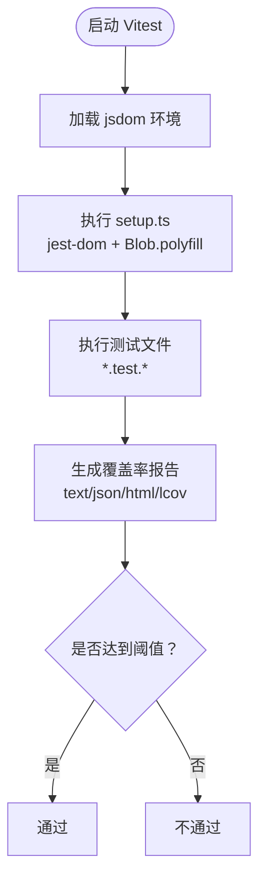
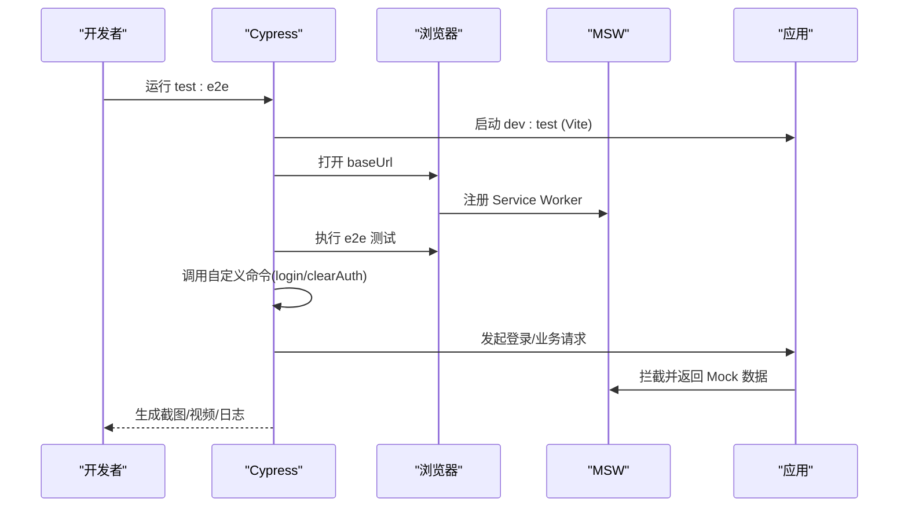
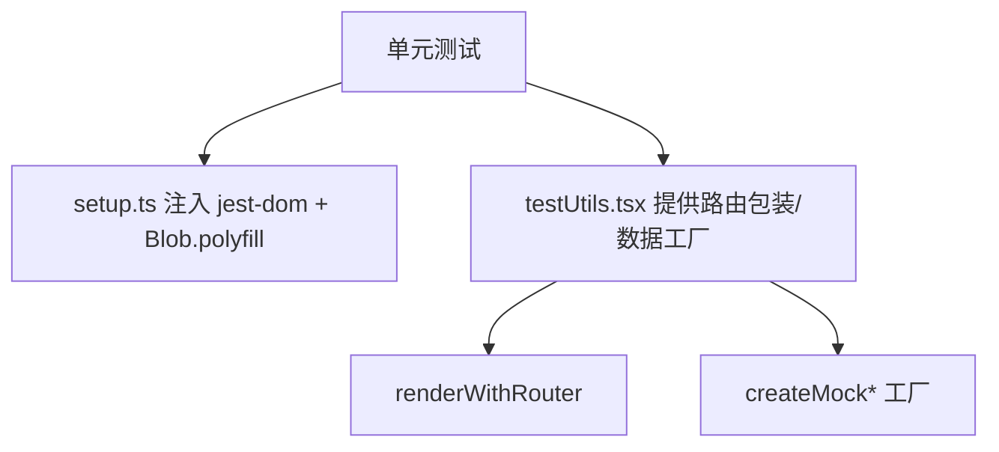
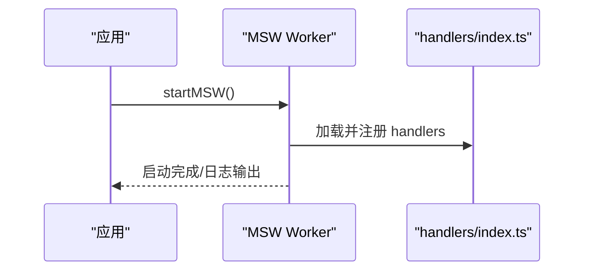
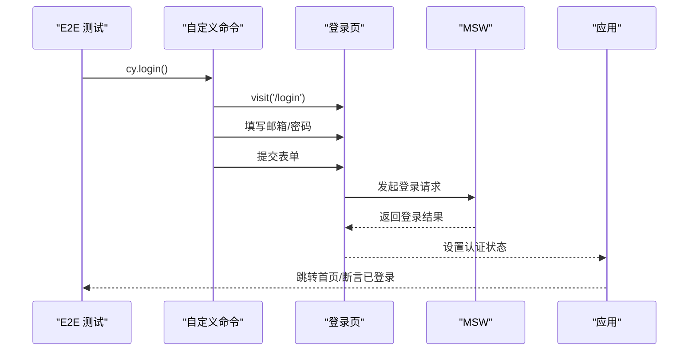
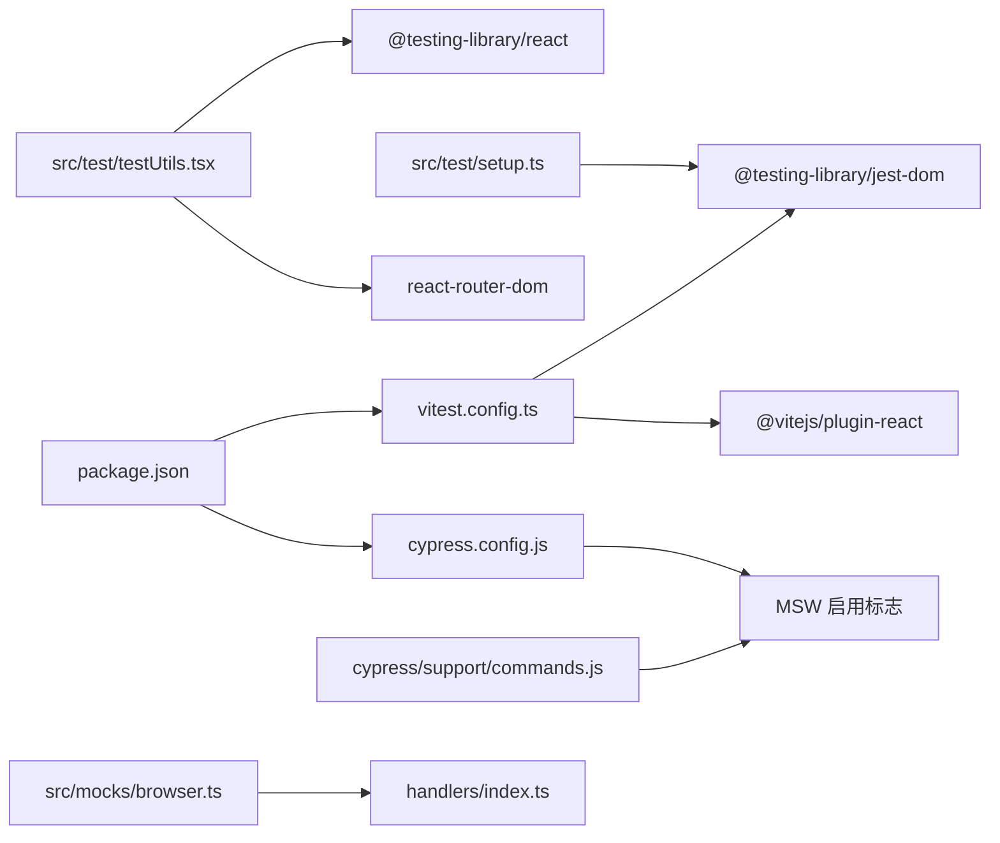

# 测试策略

<cite>
**本文引用的文件**
- [app/vitest.config.ts](file://app/vitest.config.ts)
- [app/cypress.config.js](file://app/cypress.config.js)
- [app/package.json](file://app/package.json)
- [app/src/test/setup.ts](file://app/src/test/setup.ts)
- [app/src/test/testUtils.tsx](file://app/src/test/testUtils.tsx)
- [app/src/mocks/browser.ts](file://app/src/mocks/browser.ts)
- [app/src/mocks/handlers/index.ts](file://app/src/mocks/handlers/index.ts)
- [app/cypress/fixtures/users.json](file://app/cypress/fixtures/users.json)
- [app/cypress/support/commands.js](file://app/cypress/support/commands.js)
- [app/cypress/support/e2e.js](file://app/cypress/support/e2e.js)
- [app/src/pages/__tests__/PersonsPage.test.tsx](file://app/src/pages/__tests__/PersonsPage.test.tsx)
- [app/src/hooks/__tests__/useTheme.test.ts](file://app/src/hooks/__tests__/useTheme.test.ts)
- [app/src/stores/__tests__/useAuthStore.test.ts](file://app/src/stores/__tests__/useAuthStore.test.ts)
- [app/cypress/e2e/auth/login.cy.js](file://app/cypress/e2e/auth/login.cy.js)
</cite>

## 目录
1. [简介](#简介)
2. [项目结构](#项目结构)
3. [核心组件](#核心组件)
4. [架构总览](#架构总览)
5. [详细组件分析](#详细组件分析)
6. [依赖关系分析](#依赖关系分析)
7. [性能考量](#性能考量)
8. [故障排查指南](#故障排查指南)
9. [结论](#结论)
10. [附录](#附录)

## 简介
本文件系统化阐述本项目的测试策略，覆盖基于 Vitest 的单元测试与基于 Cypress 的端到端测试（E2E），并结合仓库现有的 MSW（Mock Service Worker）与测试工具链，给出测试金字塔的应用建议、最佳实践、覆盖率与质量标准、示例路径与调试技巧，以及在持续集成中的自动化流程建议。

## 项目结构
本项目在前端应用 app/ 下同时具备完善的单元测试与端到端测试基础设施：
- 单元测试：Vitest 配置、测试工具与示例测试文件
- 端到端测试：Cypress 配置、支持脚本、自定义命令与示例用例
- Mock 服务：MSW 浏览器 Worker 与统一 handlers 索引
- 测试脚本：package.json 中的测试命令与 CI 友好脚本

图表来源
- [app/vitest.config.ts:1-40](file://app/vitest.config.ts#L1-L40)
- [app/cypress.config.js:1-73](file://app/cypress.config.js#L1-L73)
- [app/src/test/setup.ts:1-16](file://app/src/test/setup.ts#L1-L16)
- [app/src/test/testUtils.tsx:1-117](file://app/src/test/testUtils.tsx#L1-L117)
- [app/src/mocks/browser.ts:1-41](file://app/src/mocks/browser.ts#L1-L41)
- [app/src/mocks/handlers/index.ts:1-28](file://app/src/mocks/handlers/index.ts#L1-L28)
- [app/cypress/support/e2e.js:1-63](file://app/cypress/support/e2e.js#L1-L63)
- [app/cypress/support/commands.js:1-188](file://app/cypress/support/commands.js#L1-L188)
- [app/cypress/fixtures/users.json:1-12](file://app/cypress/fixtures/users.json#L1-L12)
- [app/package.json:26-46](file://app/package.json#L26-L46)

章节来源
- [app/vitest.config.ts:1-40](file://app/vitest.config.ts#L1-L40)
- [app/cypress.config.js:1-73](file://app/cypress.config.js#L1-L73)
- [app/package.json:26-46](file://app/package.json#L26-L46)

## 核心组件
- Vitest 单元测试配置与环境
  - 全局启用、jsdom 环境、别名解析、覆盖率报告与阈值、排除规则
  - 测试脚本：运行、覆盖率、按目录过滤
- Cypress 端到端测试配置
  - 基础 URL、视口、超时、重试、截图/视频、MSW 标识打印
  - 支持文件与自定义命令
- 测试工具与环境准备
  - setup.ts 注入 jest-dom 与 Blob.arrayBuffer polyfill
  - testUtils.tsx 提供路由包装、内存路由、数据工厂
- MSW Mock 服务
  - browser.ts 启动 worker 并输出启动日志
  - handlers/index.ts 统一聚合各模块 handlers，并对 REST 代理优先级排序
- 测试脚本与 CI 友好命令
  - package.json 中的 test、coverage、test:watch、test:e2e、cypress:* 等

章节来源
- [app/vitest.config.ts:12-39](file://app/vitest.config.ts#L12-L39)
- [app/src/test/setup.ts:1-16](file://app/src/test/setup.ts#L1-L16)
- [app/src/test/testUtils.tsx:18-36](file://app/src/test/testUtils.tsx#L18-L36)
- [app/src/mocks/browser.ts:16-40](file://app/src/mocks/browser.ts#L16-L40)
- [app/src/mocks/handlers/index.ts:22-27](file://app/src/mocks/handlers/index.ts#L22-L27)
- [app/cypress.config.js:15-72](file://app/cypress.config.js#L15-L72)
- [app/cypress/support/commands.js:10-25](file://app/cypress/support/commands.js#L10-L25)
- [app/cypress/support/e2e.js:22-39](file://app/cypress/support/e2e.js#L22-L39)
- [app/package.json:36-44](file://app/package.json#L36-L44)

## 架构总览
下图展示测试栈在不同层次的协作关系：单元测试通过 Vitest 在 jsdom 环境中运行；端到端测试通过 Cypress 驱动真实浏览器，借助 MSW 拦截并模拟后端 API；测试工具与自定义命令提升可维护性与一致性。

图表来源
- [app/vitest.config.ts:12-39](file://app/vitest.config.ts#L12-L39)
- [app/cypress.config.js:17-72](file://app/cypress.config.js#L17-L72)
- [app/src/mocks/browser.ts:16-40](file://app/src/mocks/browser.ts#L16-L40)
- [app/cypress/support/commands.js:35-75](file://app/cypress/support/commands.js#L35-L75)
- [app/cypress/fixtures/users.json:1-12](file://app/cypress/fixtures/users.json#L1-L12)

## 详细组件分析

### Vitest 单元测试配置与使用
- 环境与别名
  - 启用全局符号与 jsdom 环境，别名 @ 指向 src，便于模块导入
- 覆盖率
  - 报告器：text/json/html/lcov；排除 node_modules、src/test、src/mocks、类型声明、配置文件、dist、cypress、public 等
  - include 限定为 src/**/*.{ts,tsx}
  - 阈值：lines/functions/branches/statements ≥ 25/25/18/25
- 测试脚本
  - 运行：test、test:watch
  - 覆盖率：coverage、coverage:tools（按目录过滤）

图表来源
- [app/vitest.config.ts:12-39](file://app/vitest.config.ts#L12-L39)
- [app/src/test/setup.ts:1-16](file://app/src/test/setup.ts#L1-L16)

章节来源
- [app/vitest.config.ts:12-39](file://app/vitest.config.ts#L12-L39)
- [app/package.json:36-44](file://app/package.json#L36-L44)

### Cypress 端到端测试策略
- 基础配置
  - 基础 URL、视口、specPattern、supportFile、fixturesFolder、截图/视频、超时、重试（CI: runMode=2）
  - 打印 MSW 状态与凭证来源
- 支持文件与自定义命令
  - e2e.js：忽略 ResizeObserver 异常、beforeEach/afterEach 清理、visit 重写
  - commands.js：waitForMSW、login、logout、clearAuth、clearIndexedDB、waitForElement、checkLoggedIn/checkLoggedOut、waitForLoading
- 测试夹具
  - users.json 提供 testUser/invalidUser 凭证

图表来源
- [app/cypress.config.js:17-72](file://app/cypress.config.js#L17-L72)
- [app/cypress/support/e2e.js:22-39](file://app/cypress/support/e2e.js#L22-L39)
- [app/cypress/support/commands.js:35-75](file://app/cypress/support/commands.js#L35-L75)
- [app/src/mocks/browser.ts:16-40](file://app/src/mocks/browser.ts#L16-L40)

章节来源
- [app/cypress.config.js:15-72](file://app/cypress.config.js#L15-L72)
- [app/cypress/support/e2e.js:10-39](file://app/cypress/support/e2e.js#L10-L39)
- [app/cypress/support/commands.js:10-188](file://app/cypress/support/commands.js#L10-L188)
- [app/cypress/fixtures/users.json:1-12](file://app/cypress/fixtures/users.json#L1-L12)

### 测试工具与环境准备
- setup.ts
  - 注入 jest-dom 断言能力
  - 为 jsdom 补充 Blob.arrayBuffer polyfill，避免 ArrayBuffer 相关测试失败
- testUtils.tsx
  - RouterWrapper/MemoryRouterWrapper：支持路由测试与初始路由
  - renderWithRouter：统一封装路由渲染
  - 数据工厂：createMockPhoto/createMockPerson/createMockAlbum，支持字段覆盖

图表来源
- [app/src/test/setup.ts:1-16](file://app/src/test/setup.ts#L1-L16)
- [app/src/test/testUtils.tsx:18-36](file://app/src/test/testUtils.tsx#L18-L36)
- [app/src/test/testUtils.tsx:41-116](file://app/src/test/testUtils.tsx#L41-L116)

章节来源
- [app/src/test/setup.ts:1-16](file://app/src/test/setup.ts#L1-L16)
- [app/src/test/testUtils.tsx:18-116](file://app/src/test/testUtils.tsx#L18-L116)

### MSW Mock 服务与处理器
- browser.ts
  - 启动 worker，设置 onUnhandledRequest 警告、serviceWorker 路径、waitUntilReady
  - 输出启动日志与 handlers 就绪提示
- handlers/index.ts
  - 统一导出与合并 handlers，优先放置 supabaseRestHandlers，确保 REST 代理优先匹配

图表来源
- [app/src/mocks/browser.ts:16-40](file://app/src/mocks/browser.ts#L16-L40)
- [app/src/mocks/handlers/index.ts:12-27](file://app/src/mocks/handlers/index.ts#L12-L27)

章节来源
- [app/src/mocks/browser.ts:16-40](file://app/src/mocks/browser.ts#L16-L40)
- [app/src/mocks/handlers/index.ts:12-27](file://app/src/mocks/handlers/index.ts#L12-L27)

### 单元测试示例与最佳实践
- 页面组件测试（PersonsPage）
  - 使用 renderWithRouter 渲染带路由的页面
  - 通过 vi.mock 对 Store/Hook/子组件进行隔离测试
  - 使用 waitFor 验证异步状态与副作用
  - 示例路径：[app/src/pages/__tests__/PersonsPage.test.tsx:1-211](file://app/src/pages/__tests__/PersonsPage.test.tsx#L1-L211)
- Hook 测试（useTheme）
  - 通过 spy localStorage 与 matchMedia，验证主题切换与 DOM 类名变更
  - 示例路径：[app/src/hooks/__tests__/useTheme.test.ts:1-112](file://app/src/hooks/__tests__/useTheme.test.ts#L1-L112)
- Store 测试（useAuthStore）
  - 通过 vi.mock 对 authService 进行行为驱动测试，覆盖 initialize/signIn/signUp/signOut/clearError
  - 示例路径：[app/src/stores/__tests__/useAuthStore.test.ts:1-182](file://app/src/stores/__tests__/useAuthStore.test.ts#L1-L182)

章节来源
- [app/src/pages/__tests__/PersonsPage.test.tsx:1-211](file://app/src/pages/__tests__/PersonsPage.test.tsx#L1-L211)
- [app/src/hooks/__tests__/useTheme.test.ts:1-112](file://app/src/hooks/__tests__/useTheme.test.ts#L1-L112)
- [app/src/stores/__tests__/useAuthStore.test.ts:1-182](file://app/src/stores/__tests__/useAuthStore.test.ts#L1-L182)

### 端到端测试示例与最佳实践
- 登录流程测试（login.cy.js）
  - 页面可达性、表单验证、错误提示、登录后跳转、受保护页面访问、刷新与新标签页保持登录态
  - 自定义命令 login/logout/clearAuth 的使用
  - 示例路径：[app/cypress/e2e/auth/login.cy.js:1-238](file://app/cypress/e2e/auth/login.cy.js#L1-L238)

图表来源
- [app/cypress/e2e/auth/login.cy.js:74-94](file://app/cypress/e2e/auth/login.cy.js#L74-L94)
- [app/cypress/support/commands.js:35-75](file://app/cypress/support/commands.js#L35-L75)

章节来源
- [app/cypress/e2e/auth/login.cy.js:1-238](file://app/cypress/e2e/auth/login.cy.js#L1-L238)
- [app/cypress/support/commands.js:35-75](file://app/cypress/support/commands.js#L35-L75)

## 依赖关系分析
- Vitest 与测试工具
  - vitest.config.ts 依赖 @vitejs/plugin-react 与 jsdom；setup.ts 依赖 @testing-library/jest-dom
  - testUtils.tsx 依赖 @testing-library/react 与 react-router-dom
- Cypress 与 MSW
  - cypress.config.js 通过环境变量控制 MSW 启用；commands.js 提供 waitForMSW 与登录命令
  - browser.ts 作为 MSW Worker，在应用启动时自动初始化
- 测试脚本与 CI
  - package.json 提供 test、coverage、test:watch、test:e2e、cypress:* 等命令，配合 start-server-and-test 实现“先启动再测试”的 CI 流程

图表来源
- [app/vitest.config.ts:1-40](file://app/vitest.config.ts#L1-L40)
- [app/src/test/setup.ts:1-16](file://app/src/test/setup.ts#L1-L16)
- [app/src/test/testUtils.tsx:1-117](file://app/src/test/testUtils.tsx#L1-L117)
- [app/cypress.config.js:1-73](file://app/cypress.config.js#L1-L73)
- [app/cypress/support/commands.js:1-188](file://app/cypress/support/commands.js#L1-L188)
- [app/src/mocks/browser.ts:1-41](file://app/src/mocks/browser.ts#L1-L41)
- [app/src/mocks/handlers/index.ts:1-28](file://app/src/mocks/handlers/index.ts#L1-L28)
- [app/package.json:26-46](file://app/package.json#L26-L46)

章节来源
- [app/vitest.config.ts:1-40](file://app/vitest.config.ts#L1-L40)
- [app/cypress.config.js:1-73](file://app/cypress.config.js#L1-L73)
- [app/package.json:26-46](file://app/package.json#L26-L46)

## 性能考量
- 单元测试
  - 使用 jsdom 与最小化渲染，避免真实网络请求，提高执行速度
  - 通过 vi.mock 隔离外部依赖，减少 IO 与副作用
- 端到端测试
  - 合理设置超时与重试，避免 CI 时间过长
  - 使用 MSW 替代真实后端，降低网络抖动影响
- 覆盖率
  - 当前阈值为 25%/25%/18%/25%，建议在稳定期逐步提升，确保关键分支与语句被覆盖

## 故障排查指南
- jsdom 缺失 Blob.arrayBuffer
  - 症状：File/Blob 相关测试报错
  - 解决：确认 setup.ts 已注入 polyfill
  - 参考：[app/src/test/setup.ts:4-15](file://app/src/test/setup.ts#L4-L15)
- MSW 未生效或未拦截
  - 症状：请求直连真实后端
  - 排查：检查 cypress.config.js 是否启用 MSW 标志；确认 browser.ts 启动日志；确认 handlers 顺序（REST 代理优先）
  - 参考：
    - [app/cypress.config.js:62-67](file://app/cypress.config.js#L62-L67)
    - [app/src/mocks/browser.ts:16-40](file://app/src/mocks/browser.ts#L16-L40)
    - [app/src/mocks/handlers/index.ts:22-27](file://app/src/mocks/handlers/index.ts#L22-L27)
- ResizeObserver 异常导致测试中断
  - 症状：控制台异常阻断测试
  - 解决：e2e.js 中已忽略特定异常，必要时可扩展忽略规则
  - 参考：[app/cypress/support/e2e.js:10-19](file://app/cypress/support/e2e.js#L10-L19)
- 登录失败或跳转异常
  - 症状：登录后仍停留在登录页或出现错误提示
  - 排查：使用 cy.login() 命令与 fixtures 凭证；检查 MSW 是否拦截到登录请求；确认 baseUrl 与端口
  - 参考：
    - [app/cypress/e2e/auth/login.cy.js:74-94](file://app/cypress/e2e/auth/login.cy.js#L74-L94)
    - [app/cypress/support/commands.js:35-75](file://app/cypress/support/commands.js#L35-L75)
    - [app/cypress/fixtures/users.json:1-12](file://app/cypress/fixtures/users.json#L1-L12)

章节来源
- [app/src/test/setup.ts:4-15](file://app/src/test/setup.ts#L4-L15)
- [app/cypress.config.js:62-67](file://app/cypress.config.js#L62-L67)
- [app/src/mocks/browser.ts:16-40](file://app/src/mocks/browser.ts#L16-L40)
- [app/src/mocks/handlers/index.ts:22-27](file://app/src/mocks/handlers/index.ts#L22-L27)
- [app/cypress/support/e2e.js:10-19](file://app/cypress/support/e2e.js#L10-L19)
- [app/cypress/e2e/auth/login.cy.js:74-94](file://app/cypress/e2e/auth/login.cy.js#L74-L94)
- [app/cypress/support/commands.js:35-75](file://app/cypress/support/commands.js#L35-L75)
- [app/cypress/fixtures/users.json:1-12](file://app/cypress/fixtures/users.json#L1-L12)

## 结论
本项目已建立完善的测试基础设施：Vitest 提供快速、稳定的单元测试，Cypress 提供贴近真实用户场景的端到端测试，MSW 保障了前后端解耦与可重复性。建议在 CI 中按“单元测试优先、覆盖率达标、E2E 关键路径覆盖”的策略执行，并根据业务演进逐步提升覆盖率阈值与测试质量。

## 附录

### 测试金字塔应用建议
- 单元测试（基础层）
  - 比例：约 60%-70%
  - 覆盖：核心 Hook/Store/工具函数/纯函数
  - 要点：使用 vi.mock 隔离外部依赖，使用数据工厂构造输入
- 集成测试（中间层）
  - 比例：约 20%-25%
  - 覆盖：组件间通信、路由守卫、缓存/存储交互
  - 要点：使用 renderWithRouter 与 MemoryRouter，结合 MSW 返回预期数据
- 端到端测试（顶层）
  - 比例：约 15%-20%
  - 覆盖：关键用户旅程（登录/注册/主流程）、跨页面导航
  - 要点：使用自定义命令封装常用步骤，合理设置超时与重试

### 覆盖率与质量标准
- 当前阈值
  - 行数/函数/分支/语句：≥ 25/25/18/25
- 建议目标（稳定期）
  - 行数/函数/分支/语句：≥ 60/60/40/60
- 覆盖范围
  - include：src/**/*.{ts,tsx}
  - exclude：node_modules、src/test、src/mocks、类型声明、配置文件、dist、cypress、public

章节来源
- [app/vitest.config.ts:16-36](file://app/vitest.config.ts#L16-L36)

### 测试脚本与 CI 自动化
- 常用脚本
  - 单元测试：test、test:watch、coverage
  - 端到端：cypress:open、cypress:run、test:e2e、test:e2e:headless
- CI 建议流程
  - 安装依赖 → 启动 dev:test → 运行 Cypress → 生成覆盖率报告
  - 可参考 package.json 中的 test:e2e 命令组合

章节来源
- [app/package.json:36-44](file://app/package.json#L36-L44)