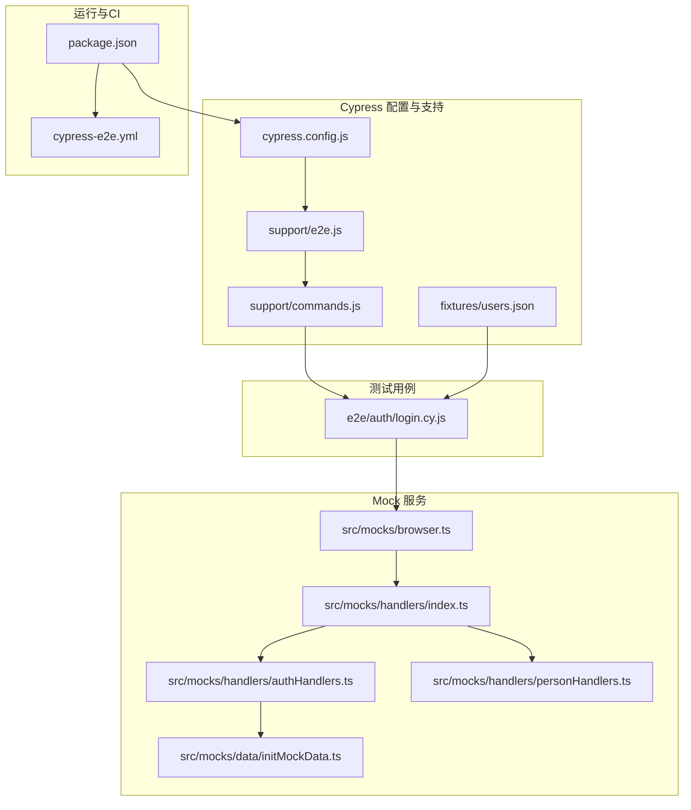
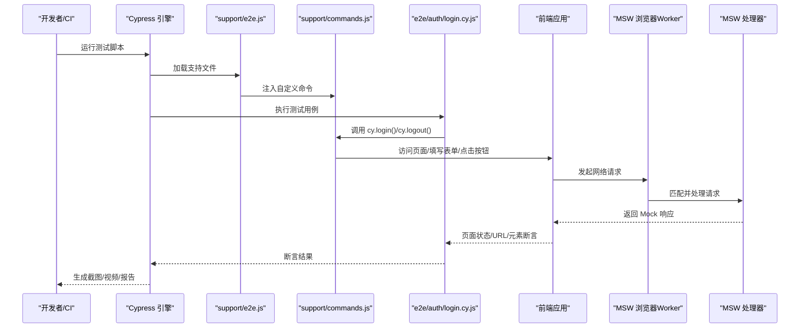
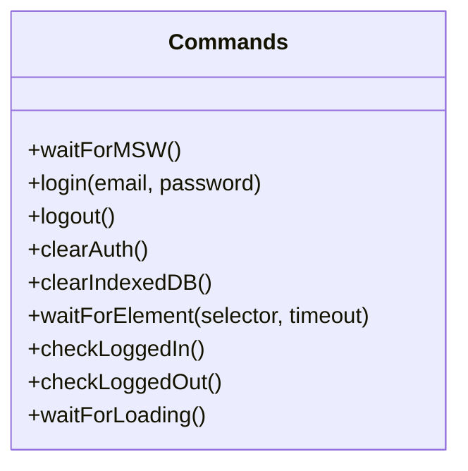
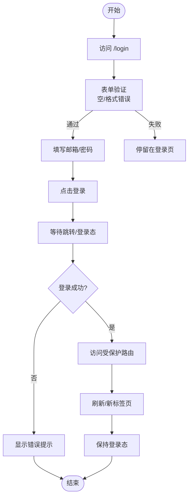
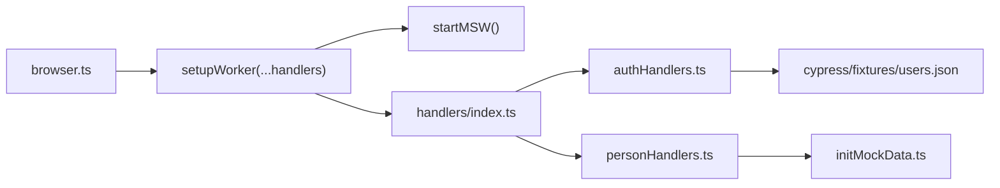
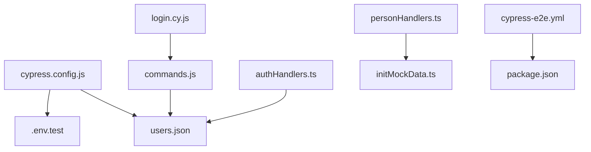

# 端到端测试

<cite>
**本文引用的文件**
- [cypress.config.js](file://app/cypress.config.js)
- [commands.js](file://app/cypress/support/commands.js)
- [e2e.js](file://app/cypress/support/e2e.js)
- [users.json](file://app/cypress/fixtures/users.json)
- [login.cy.js](file://app/cypress/e2e/auth/login.cy.js)
- [package.json](file://app/package.json)
- [browser.ts](file://app/src/mocks/browser.ts)
- [handlers/index.ts](file://app/src/mocks/handlers/index.ts)
- [authHandlers.ts](file://app/src/mocks/handlers/authHandlers.ts)
- [personHandlers.ts](file://app/src/mocks/handlers/personHandlers.ts)
- [initMockData.ts](file://app/src/mocks/data/initMockData.ts)
- [.gitignore](file://app/.gitignore)
- [cypress-e2e.yml](file://.github/workflows/cypress-e2e.yml)
</cite>

## 目录
1. [简介](#简介)
2. [项目结构](#项目结构)
3. [核心组件](#核心组件)
4. [架构总览](#架构总览)
5. [详细组件分析](#详细组件分析)
6. [依赖关系分析](#依赖关系分析)
7. [性能考虑](#性能考虑)
8. [故障排除指南](#故障排除指南)
9. [结论](#结论)
10. [附录](#附录)

## 简介
本文件系统化梳理基于 Cypress 的端到端测试体系，覆盖测试环境配置、浏览器与超时设置、测试夹具（fixtures）与数据管理、自定义命令扩展、用户流程测试示例（登录流程、受保护路由访问）、Mock 服务（MSW）集成、跨浏览器测试、报告与 CI/CD 集成、调试与故障排除，以及性能与可访问性测试最佳实践。目标是帮助不同技术背景的读者快速理解并高效维护本项目的 E2E 测试。

## 项目结构
围绕 Cypress 的测试目录组织如下：
- 配置层：cypress.config.js 定义基础 URL、视口、超时、重试、截图/视频、项目 ID、Node 事件钩子等
- 支持层：support/e2e.js 注入自定义命令、全局异常处理、beforeEach/afterEach 钩子、visit 重写
- 命令层：support/commands.js 定义 waitForMSW、login、logout、clearAuth、clearIndexedDB、waitForElement、checkLoggedIn、checkLoggedOut、waitForLoading 等可复用命令
- 夹具层：fixtures/users.json 提供测试用户凭证
- 测试层：e2e/auth/login.cy.js 编写登录流程与边界场景测试
- Mock 层：src/mocks/browser.ts、handlers/index.ts、handlers/authHandlers.ts、handlers/personHandlers.ts、data/initMockData.ts 提供 MSW 启动、请求拦截与数据初始化
- 运行脚本：package.json 中 test:e2e、cypress:open、cypress:run 等脚本
- CI/CD：.github/workflows/cypress-e2e.yml 配置 GitHub Actions 任务与工件上传
- 忽略规则：.gitignore 中对 cypress/screenshots、videos、downloads、.env.test 的忽略

**图表来源**
- [cypress.config.js:15-72](file://app/cypress.config.js#L15-L72)
- [e2e.js:1-62](file://app/cypress/support/e2e.js#L1-L62)
- [commands.js:1-188](file://app/cypress/support/commands.js#L1-L188)
- [users.json:1-12](file://app/cypress/fixtures/users.json#L1-L12)
- [login.cy.js:1-238](file://app/cypress/e2e/auth/login.cy.js#L1-L238)
- [browser.ts:1-40](file://app/src/mocks/browser.ts#L1-L40)
- [handlers/index.ts:1-28](file://app/src/mocks/handlers/index.ts#L1-L28)
- [authHandlers.ts:1-194](file://app/src/mocks/handlers/authHandlers.ts#L1-L194)
- [personHandlers.ts:1-46](file://app/src/mocks/handlers/personHandlers.ts#L1-L46)
- [initMockData.ts:1-53](file://app/src/mocks/data/initMockData.ts#L1-L53)
- [package.json:26-46](file://app/package.json#L26-L46)
- [cypress-e2e.yml:1-111](file://.github/workflows/cypress-e2e.yml#L1-L111)

**章节来源**
- [cypress.config.js:15-72](file://app/cypress.config.js#L15-L72)
- [e2e.js:1-62](file://app/cypress/support/e2e.js#L1-L62)
- [commands.js:1-188](file://app/cypress/support/commands.js#L1-L188)
- [users.json:1-12](file://app/cypress/fixtures/users.json#L1-L12)
- [login.cy.js:1-238](file://app/cypress/e2e/auth/login.cy.js#L1-L238)
- [browser.ts:1-40](file://app/src/mocks/browser.ts#L1-L40)
- [handlers/index.ts:1-28](file://app/src/mocks/handlers/index.ts#L1-L28)
- [authHandlers.ts:1-194](file://app/src/mocks/handlers/authHandlers.ts#L1-L194)
- [personHandlers.ts:1-46](file://app/src/mocks/handlers/personHandlers.ts#L1-L46)
- [initMockData.ts:1-53](file://app/src/mocks/data/initMockData.ts#L1-L53)
- [package.json:26-46](file://app/package.json#L26-L46)
- [.gitignore:26-30](file://app/.gitignore#L26-L30)
- [cypress-e2e.yml:1-111](file://.github/workflows/cypress-e2e.yml#L1-L111)

## 核心组件
- Cypress 配置中心：统一管理 baseUrl、视口、specPattern、supportFile、fixturesFolder、截图/视频、超时、重试、项目 ID、Node 事件钩子
- 支持文件：导入自定义命令、全局异常处理、beforeEach/afterEach 钩子、visit 重写
- 自定义命令库：登录、登出、认证状态清理、IndexedDB 清理、元素等待、登录态校验、加载等待等
- 测试夹具：users.json 提供测试用户凭证，供登录测试与 MSW 认证处理器使用
- MSW Mock：浏览器 worker 启动、请求拦截（认证、Supabase 代理、人员接口）、数据初始化
- 运行脚本与 CI：本地与 CI 的启动方式、浏览器矩阵、工件上传与报告

**章节来源**
- [cypress.config.js:15-72](file://app/cypress.config.js#L15-L72)
- [e2e.js:1-62](file://app/cypress/support/e2e.js#L1-L62)
- [commands.js:1-188](file://app/cypress/support/commands.js#L1-L188)
- [users.json:1-12](file://app/cypress/fixtures/users.json#L1-L12)
- [browser.ts:1-40](file://app/src/mocks/browser.ts#L1-L40)
- [authHandlers.ts:1-194](file://app/src/mocks/handlers/authHandlers.ts#L1-L194)
- [personHandlers.ts:1-46](file://app/src/mocks/handlers/personHandlers.ts#L1-L46)
- [initMockData.ts:1-53](file://app/src/mocks/data/initMockData.ts#L1-L53)
- [package.json:26-46](file://app/package.json#L26-L46)
- [cypress-e2e.yml:1-111](file://.github/workflows/cypress-e2e.yml#L1-L111)

## 架构总览
下图展示从测试运行到 Mock 服务拦截的关键路径，体现 Cypress 配置、命令、测试、MSW 的协同关系。

**图表来源**
- [e2e.js:1-62](file://app/cypress/support/e2e.js#L1-L62)
- [commands.js:1-188](file://app/cypress/support/commands.js#L1-L188)
- [login.cy.js:1-238](file://app/cypress/e2e/auth/login.cy.js#L1-L238)
- [browser.ts:1-40](file://app/src/mocks/browser.ts#L1-L40)
- [authHandlers.ts:1-194](file://app/src/mocks/handlers/authHandlers.ts#L1-L194)

## 详细组件分析

### Cypress 配置与环境设置
- 基础 URL、视口尺寸、测试文件匹配、支持文件、夹具目录、截图/视频、超时、重试、项目 ID、Node 事件钩子均在配置文件中集中管理
- 通过 dotenv 动态加载 .env.test，支持 MSW 开关与 Supabase 地址等变量
- 在 before:run 阶段打印关键配置信息，便于调试

**章节来源**
- [cypress.config.js:15-72](file://app/cypress.config.js#L15-L72)

### 支持文件与全局行为
- 导入自定义命令，统一在每个测试前清理 localStorage、cookies，并避免显式等待 MSW（由 visit 自动等待）
- 全局忽略 ResizeObserver 等不影响测试的异常
- 重写 visit，允许在页面加载前注入自定义逻辑
- 测试失败时自动截取全屏截图

**章节来源**
- [e2e.js:1-62](file://app/cypress/support/e2e.js#L1-L62)

### 自定义命令系统
- waitForMSW：简单等待并检查 Service Worker 支持
- login/logout：从夹具读取凭证或接收自定义参数；登录后断言 URL 与页面内容；登出清理认证状态
- clearAuth/clearIndexedDB：清理 localStorage、cookies、sessionStorage、IndexedDB
- waitForElement/checkLoggedIn/checkLoggedOut：等待元素可交互、校验登录状态
- waitForLoading：等待骨架屏/加载指示器消失

**图表来源**
- [commands.js:1-188](file://app/cypress/support/commands.js#L1-L188)

**章节来源**
- [commands.js:1-188](file://app/cypress/support/commands.js#L1-L188)

### 测试夹具与数据管理
- users.json 提供 testUser 与 invalidUser，用于登录测试与错误场景
- MSW 认证处理器从夹具读取凭证，模拟 Supabase 认证 API 行为
- 人员接口通过 IndexedDB 数据库提供数据，首次访问时可初始化 Mock 数据

**章节来源**
- [users.json:1-12](file://app/cypress/fixtures/users.json#L1-L12)
- [authHandlers.ts:1-194](file://app/src/mocks/handlers/authHandlers.ts#L1-L194)
- [personHandlers.ts:1-46](file://app/src/mocks/handlers/personHandlers.ts#L1-L46)
- [initMockData.ts:1-53](file://app/src/mocks/data/initMockData.ts#L1-L53)

### 用户流程测试示例：登录流程
- 登录页面访问：断言标题、表单元素、注册链接存在
- 未登录访问首页：自动重定向至登录页
- 表单验证：空表单、仅邮箱、邮箱格式错误等场景的浏览器原生验证
- 成功登录：输入凭证、点击登录、断言跳转与登录态
- 错误登录：错误密码/不存在邮箱，断言错误提示与仍处登录页
- 登录后页面跳转：访问受保护路由、刷新/新标签页保持登录态
- 自定义命令：cy.login()/cy.logout() 与连续登录登出
- 边界场景：登录中刷新、已登录访问登录页

**图表来源**
- [login.cy.js:1-238](file://app/cypress/e2e/auth/login.cy.js#L1-L238)

**章节来源**
- [login.cy.js:1-238](file://app/cypress/e2e/auth/login.cy.js#L1-L238)

### Mock 服务配置与数据初始化
- 浏览器 worker：在开发环境启动 MSW，等待 Service Worker 激活，输出启动日志
- 处理器索引：统一导出并合并 auth、supabase、person、agent 等 handlers，注意 supabaseRestHandlers 优先匹配
- 认证处理器：支持 token、user、logout、signup，匹配开发代理与生产域名，模拟登录/刷新/登出/注册
- 人员处理器：GET /api/persons、GET /api/persons/:id，结合 IndexedDB 数据库
- 数据初始化：首次访问时检查并初始化 Mock 人员数据，失败不中断应用运行

**图表来源**
- [browser.ts:1-40](file://app/src/mocks/browser.ts#L1-L40)
- [handlers/index.ts:1-28](file://app/src/mocks/handlers/index.ts#L1-L28)
- [authHandlers.ts:1-194](file://app/src/mocks/handlers/authHandlers.ts#L1-L194)
- [personHandlers.ts:1-46](file://app/src/mocks/handlers/personHandlers.ts#L1-L46)
- [users.json:1-12](file://app/cypress/fixtures/users.json#L1-L12)
- [initMockData.ts:1-53](file://app/src/mocks/data/initMockData.ts#L1-L53)

**章节来源**
- [browser.ts:1-40](file://app/src/mocks/browser.ts#L1-L40)
- [handlers/index.ts:1-28](file://app/src/mocks/handlers/index.ts#L1-L28)
- [authHandlers.ts:1-194](file://app/src/mocks/handlers/authHandlers.ts#L1-L194)
- [personHandlers.ts:1-46](file://app/src/mocks/handlers/personHandlers.ts#L1-L46)
- [users.json:1-12](file://app/cypress/fixtures/users.json#L1-L12)
- [initMockData.ts:1-53](file://app/src/mocks/data/initMockData.ts#L1-L53)

### 跨浏览器测试与 CI/CD 集成
- GitHub Actions 使用 cypress-io/github-action，支持多浏览器矩阵（当前配置为 chrome，注释掉 firefox/edge）
- 通过 npm run dev:test 启动应用，wait-on 等待端口可用
- 失败时上传 screenshots，始终上传 videos，生成测试摘要
- .env.test 在 CI 中动态生成，开启 MSW 并设置 placeholder Supabase 凭据

**章节来源**
- [cypress-e2e.yml:1-111](file://.github/workflows/cypress-e2e.yml#L1-L111)
- [package.json:26-46](file://app/package.json#L26-L46)
- [.gitignore:26-30](file://app/.gitignore#L26-L30)

## 依赖关系分析
- Cypress 配置依赖 .env.test 与 users.json
- 测试用例依赖自定义命令与夹具
- MSW 认证处理器依赖 users.json 与随机延迟配置
- 人员接口依赖 IndexedDB 数据库与初始化脚本
- CI 依赖 GitHub Actions 与 npm 脚本

**图表来源**
- [cypress.config.js:15-72](file://app/cypress.config.js#L15-L72)
- [login.cy.js:1-238](file://app/cypress/e2e/auth/login.cy.js#L1-L238)
- [commands.js:1-188](file://app/cypress/support/commands.js#L1-L188)
- [authHandlers.ts:1-194](file://app/src/mocks/handlers/authHandlers.ts#L1-L194)
- [personHandlers.ts:1-46](file://app/src/mocks/handlers/personHandlers.ts#L1-L46)
- [initMockData.ts:1-53](file://app/src/mocks/data/initMockData.ts#L1-L53)
- [cypress-e2e.yml:1-111](file://.github/workflows/cypress-e2e.yml#L1-L111)
- [package.json:26-46](file://app/package.json#L26-L46)

**章节来源**
- [cypress.config.js:15-72](file://app/cypress.config.js#L15-L72)
- [login.cy.js:1-238](file://app/cypress/e2e/auth/login.cy.js#L1-L238)
- [commands.js:1-188](file://app/cypress/support/commands.js#L1-L188)
- [authHandlers.ts:1-194](file://app/src/mocks/handlers/authHandlers.ts#L1-L194)
- [personHandlers.ts:1-46](file://app/src/mocks/handlers/personHandlers.ts#L1-L46)
- [initMockData.ts:1-53](file://app/src/mocks/data/initMockData.ts#L1-L53)
- [cypress-e2e.yml:1-111](file://.github/workflows/cypress-e2e.yml#L1-L111)
- [package.json:26-46](file://app/package.json#L26-L46)

## 性能考虑
- 超时与重试：合理设置 defaultCommandTimeout、pageLoadTimeout、requestTimeout；CI 中 runMode 重试 2 次，openMode 0 次，平衡稳定性与速度
- 视口与视频：1280x720 视口适配常见分辨率；videoCompression 控制视频体积
- Mock 延迟：MSW 使用随机延迟模拟真实网络，避免过度优化导致测试与真实体验偏差
- 数据初始化：仅在数据库为空时初始化，避免重复开销
- 并行与矩阵：CI 中可通过浏览器矩阵并行测试，缩短整体耗时

**章节来源**
- [cypress.config.js:43-52](file://app/cypress.config.js#L43-L52)
- [authHandlers.ts:60-112](file://app/src/mocks/handlers/authHandlers.ts#L60-L112)
- [personHandlers.ts:12-44](file://app/src/mocks/handlers/personHandlers.ts#L12-L44)
- [initMockData.ts:8-41](file://app/src/mocks/data/initMockData.ts#L8-L41)
- [cypress-e2e.yml:24-29](file://.github/workflows/cypress-e2e.yml#L24-L29)

## 故障排除指南
- 未找到 .env.test：配置文件会打印警告，提示需要创建 .env.test 或运行环境初始化脚本
- 浏览器不支持 Service Worker：waitForMSW 会记录警告，建议更换浏览器或启用相应支持
- ResizeObserver 异常：全局忽略策略允许测试继续执行，若出现其他异常请检查具体错误信息
- 测试失败截图：afterEach 自动截取失败用例全屏截图，便于定位问题
- MSW 启动失败：startMSW 捕获异常并抛出，检查浏览器控制台与网络面板
- 跳转/登录态异常：使用 cy.checkLoggedIn/cy.checkLoggedOut 辅助断言，确认 URL 与页面元素

**章节来源**
- [cypress.config.js:6-13](file://app/cypress.config.js#L6-L13)
- [e2e.js:10-19](file://app/cypress/support/e2e.js#L10-L19)
- [e2e.js:32-39](file://app/cypress/support/e2e.js#L32-L39)
- [commands.js:10-25](file://app/cypress/support/commands.js#L10-L25)
- [browser.ts:36-39](file://app/src/mocks/browser.ts#L36-L39)

## 结论
本项目的 Cypress E2E 测试体系以配置为中心、命令为基石、MSW 为 Mock 核心、CI 为保障，形成了稳定可靠的端到端测试闭环。通过规范化的夹具、命令与 Mock 处理器，既保证了测试的可维护性，也提升了测试效率与稳定性。建议在后续迭代中持续完善跨浏览器矩阵、增强可访问性测试与性能基准，并结合 Cypress Dashboard 进一步优化测试可视化与回归追踪。

## 附录

### 测试脚本与运行方式
- 本地开发：npm run dev:test 启动应用，npm run cypress:open 打开 Cypress GUI
- Headless 运行：npm run cypress:run 或 npm run test:e2e
- CI 运行：GitHub Actions 自动执行，支持多浏览器矩阵与工件上传

**章节来源**
- [package.json:26-46](file://app/package.json#L26-L46)
- [cypress-e2e.yml:57-75](file://.github/workflows/cypress-e2e.yml#L57-L75)

### 高级功能建议
- 跨浏览器测试：取消注释 firefox/edge，扩大浏览器矩阵
- 可访问性测试：引入 axe-core 或 Cypress-axe，在测试中增加无障碍断言
- 性能测试：结合 Lighthouse 或自定义性能指标采集，建立性能基线
- 报告与仪表盘：启用 Cypress Dashboard，记录分组与并行测试，提升回归可视化

[本节为通用建议，无需特定文件引用]