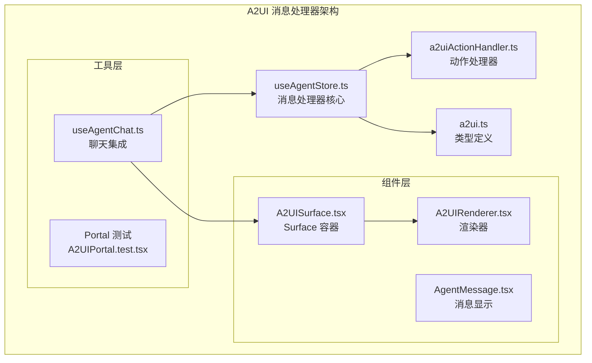
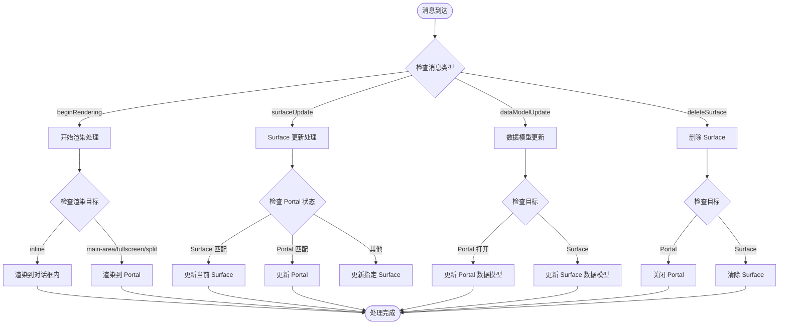
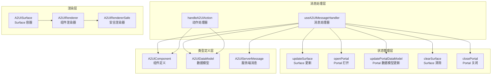
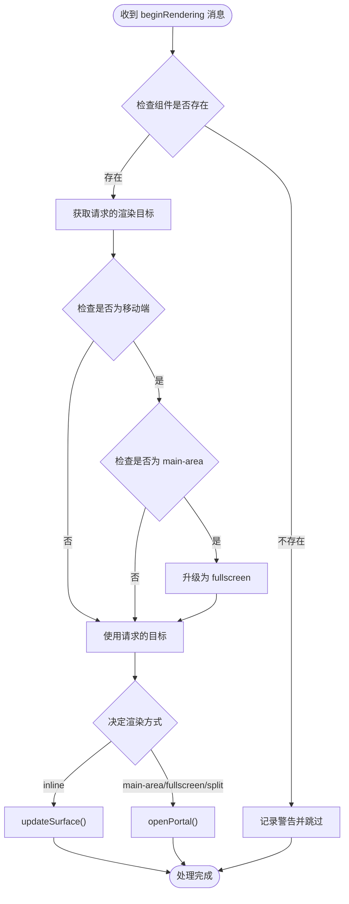
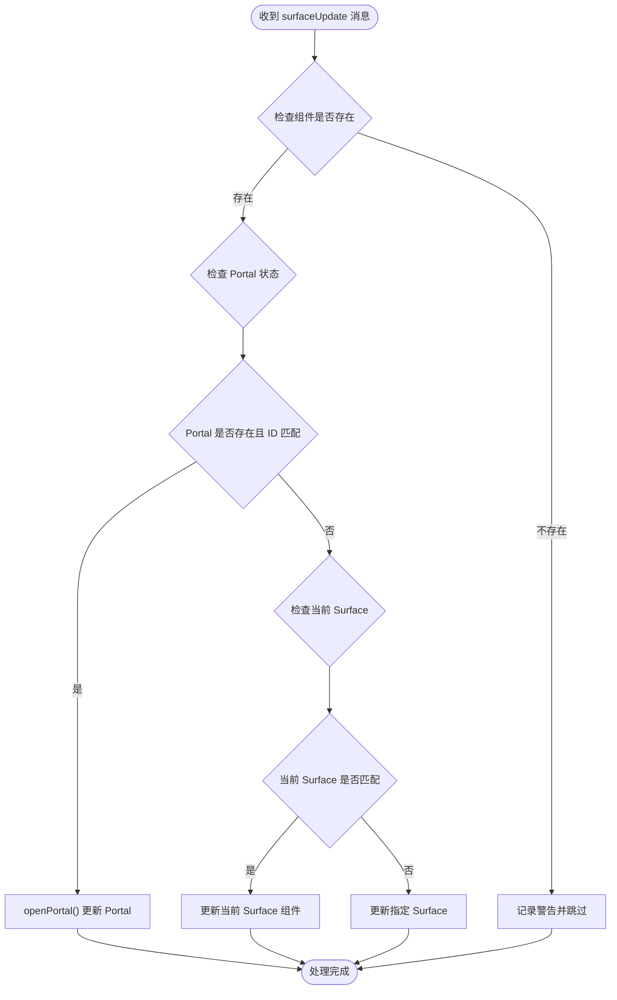
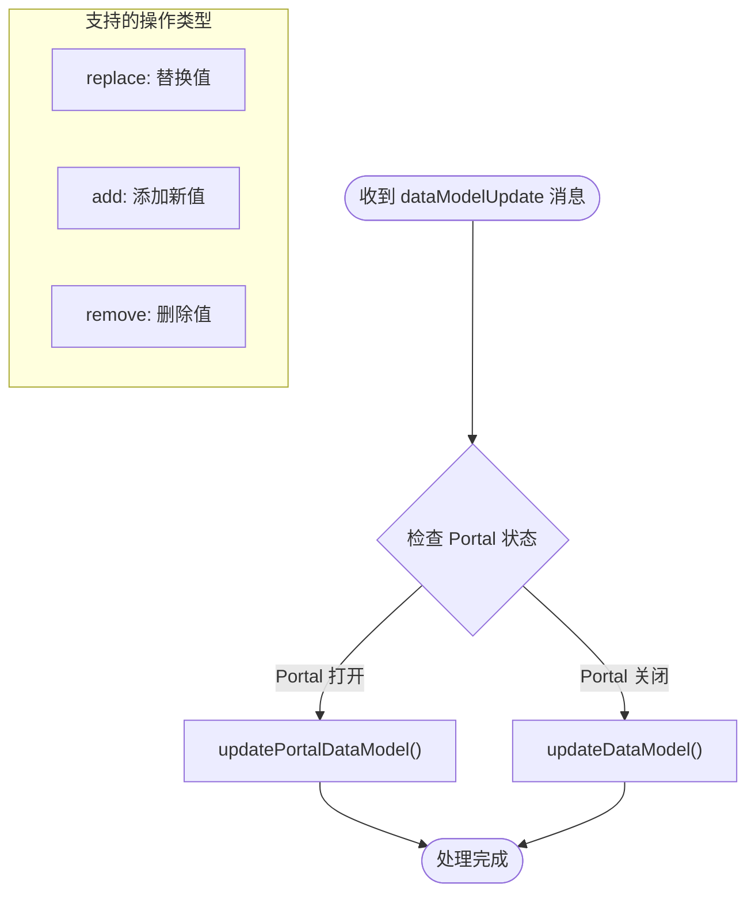
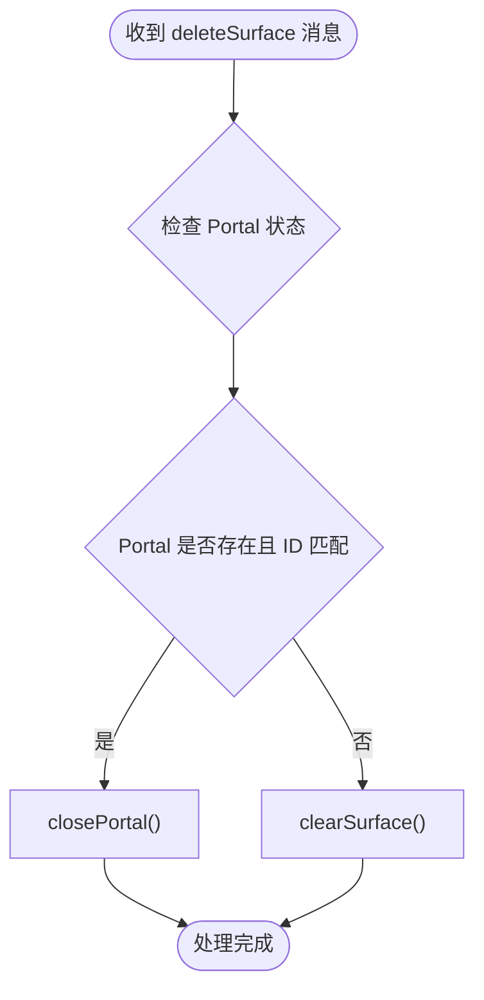
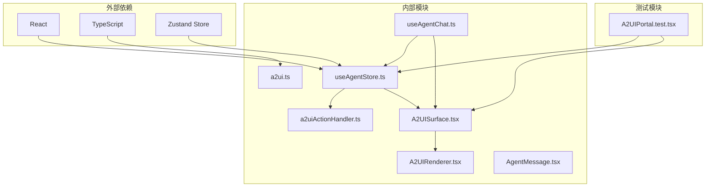

# A2UI 消息处理器

<cite>
**本文档引用的文件**
- [a2uiActionHandler.ts](file://app/src/lib/agent/a2uiActionHandler.ts)
- [useAgentStore.ts](file://app/src/stores/useAgentStore.ts)
- [a2ui.ts](file://app/src/types/a2ui.ts)
- [A2UISurface.tsx](file://app/src/components/agent/a2ui/A2UISurface.tsx)
- [A2UIRenderer.tsx](file://app/src/components/agent/a2ui/A2UIRenderer.tsx)
- [useAgentChat.ts](file://app/src/hooks/useAgentChat.ts)
- [AgentMessage.tsx](file://app/src/components/agent/AgentMessage.tsx)
- [A2UIPortal.test.tsx](file://app/src/components/agent/a2ui/__tests__/A2UIPortal.test.tsx)
</cite>

## 目录
1. [简介](#简介)
2. [项目结构](#项目结构)
3. [核心组件](#核心组件)
4. [架构概览](#架构概览)
5. [详细组件分析](#详细组件分析)
6. [依赖关系分析](#依赖关系分析)
7. [性能考虑](#性能考虑)
8. [故障排除指南](#故障排除指南)
9. [结论](#结论)

## 简介

A2UI（AI-to-UI）消息处理器是 OPC Starter 项目中用于处理 AI 驱动的动态 UI 渲染的核心组件。它实现了完整的 A2UI 协议，支持多种渲染目标和复杂的路由逻辑，能够根据不同的消息类型和渲染目标将 AI 生成的组件树渲染到应用的不同区域。

该系统通过 useA2UIMessageHandler Hook 提供统一的消息处理接口，支持 beginRendering、surfaceUpdate、dataModelUpdate 和 deleteSurface 四种主要消息类型，并针对移动端进行了特殊优化。

## 项目结构

A2UI 消息处理器位于应用的前端架构中，采用模块化设计，包含以下关键目录和文件：

**图表来源**
- [useAgentStore.ts:358-459](file://app/src/stores/useAgentStore.ts#L358-L459)
- [a2ui.ts:1-231](file://app/src/types/a2ui.ts#L1-L231)

**章节来源**
- [useAgentStore.ts:358-482](file://app/src/stores/useAgentStore.ts#L358-L482)
- [a2ui.ts:1-231](file://app/src/types/a2ui.ts#L1-L231)

## 核心组件

### useA2UIMessageHandler Hook

useA2UIMessageHandler 是 A2UI 消息处理器的核心，提供了统一的消息处理接口。该 Hook 返回一个 handleMessage 函数，负责处理所有 A2UI 服务端消息。

**图表来源**
- [useAgentStore.ts:368-456](file://app/src/stores/useAgentStore.ts#L368-L456)

### 渲染目标系统

A2UI 协议定义了四种渲染目标，每种目标都有特定的行为和用途：

| 渲染目标 | 描述 | 行为 |
|---------|------|------|
| inline | 默认：在对话消息内渲染 | 渲染到聊天对话框内部，适合小型交互组件 |
| main-area | 主内容区：覆盖当前页面内容 | 渲染到主内容区域，适合中等规模的界面 |
| fullscreen | 全屏模态：覆盖整个视口 | 渲染到全屏模式，适合大型界面或复杂操作 |
| split | 分屏：主内容区 + 对话框联动 | 同时显示主内容和对话框，适合需要上下文的场景 |

**章节来源**
- [a2ui.ts:15-20](file://app/src/types/a2ui.ts#L15-L20)
- [useAgentStore.ts:379-396](file://app/src/stores/useAgentStore.ts#L379-L396)

## 架构概览

A2UI 消息处理器采用分层架构设计，确保了良好的模块化和可维护性：

**图表来源**
- [useAgentStore.ts:358-459](file://app/src/stores/useAgentStore.ts#L358-L459)
- [a2uiActionHandler.ts:26-77](file://app/src/lib/agent/a2uiActionHandler.ts#L26-L77)

## 详细组件分析

### beginRendering 消息处理

beginRendering 消息是 A2UI 协议中最重要的一类消息，用于创建新的 Surface 并渲染初始组件。

#### 渲染目标决策逻辑

**图表来源**
- [useAgentStore.ts:370-397](file://app/src/stores/useAgentStore.ts#L370-L397)

#### 移动端适配策略

系统针对移动端设备进行了特殊优化，当检测到移动设备时，main-area 目标会自动升级为 fullscreen，确保更好的用户体验。

**章节来源**
- [useAgentStore.ts:379-383](file://app/src/stores/useAgentStore.ts#L379-L383)

### surfaceUpdate 消息处理

surfaceUpdate 消息用于替换现有 Surface 的组件树，具有复杂的路由逻辑来确定更新目标。

#### 路由决策流程

**图表来源**
- [useAgentStore.ts:400-427](file://app/src/stores/useAgentStore.ts#L400-L427)

#### Portal vs Surface 区分

系统通过比较消息中的组件 ID 和当前状态来区分 Portal 和 Surface 更新：
- **Portal 更新**：当 PortalContent 的 ID 与消息组件 ID 匹配时
- **Surface 更新**：当没有 Portal 或 ID 不匹配时，根据当前 Surface 状态决定

**章节来源**
- [useAgentStore.ts:407-426](file://app/src/stores/useAgentStore.ts#L407-L426)

### dataModelUpdate 消息处理

dataModelUpdate 消息用于对 Surface 的数据模型进行增量更新，支持 JSON Path 格式的路径和多种操作类型。

#### 更新目标选择逻辑

**图表来源**
- [useAgentStore.ts:430-440](file://app/src/stores/useAgentStore.ts#L430-L440)

#### 数据模型更新机制

系统支持三种基本操作：
- **replace**：替换指定路径的值
- **add**：在指定路径添加新值  
- **remove**：删除指定路径的值

**章节来源**
- [useAgentStore.ts:431-438](file://app/src/stores/useAgentStore.ts#L431-L438)

### deleteSurface 消息处理

deleteSurface 消息用于从渲染树中移除一个 Surface，具有 Portal 和 Surface 的区别处理。

#### 关闭逻辑决策

**图表来源**
- [useAgentStore.ts:442-451](file://app/src/stores/useAgentStore.ts#L442-L451)

#### Portal vs Surface 关闭

系统通过比较消息中的 surfaceId 和 PortalContent 的 ID 来决定关闭逻辑：
- **Portal 关闭**：当 PortalContent 的 ID 与消息中的 surfaceId 匹配时
- **Surface 清除**：当没有匹配的 Portal 时，清除当前 Surface

**章节来源**
- [useAgentStore.ts:444-449](file://app/src/stores/useAgentStore.ts#L444-L449)

### A2UIActionHandler 动作处理器

A2UIActionHandler 负责处理 A2UI 组件触发的各种用户操作，提供统一的动作处理接口。

#### 支持的动作类型

| 动作 ID | 功能描述 | 实现状态 |
|---------|----------|----------|
| navigation.dashboard | 导航到仪表板 | ✅ 已实现 |
| navigation.persons | 导航到人员页面 | ✅ 已实现 |
| navigation.profile | 导航到个人资料 | ✅ 已实现 |
| navigation.settings | 导航到设置页面 | ✅ 已实现 |
| navigation.cloudStorage | 导航到云存储设置 | ✅ 已实现 |
| photo.edit.* | 图片编辑相关操作 | ❌ 已移除 |
| navigation.search | 搜索功能 | ❌ 已移除 |

**章节来源**
- [a2uiActionHandler.ts:26-77](file://app/src/lib/agent/a2uiActionHandler.ts#L26-L77)

## 依赖关系分析

A2UI 消息处理器的依赖关系体现了清晰的分层架构：

**图表来源**
- [useAgentStore.ts:358-459](file://app/src/stores/useAgentStore.ts#L358-L459)
- [a2ui.ts:1-231](file://app/src/types/a2ui.ts#L1-L231)

### 组件耦合度分析

- **低耦合**：各组件职责明确，通过接口进行通信
- **高内聚**：相同功能的组件紧密协作，如渲染器和 Surface 容器
- **松散耦合**：消息处理器与具体组件实现解耦，通过类型定义进行约束

**章节来源**
- [useAgentStore.ts:358-459](file://app/src/stores/useAgentStore.ts#L358-L459)
- [a2ui.ts:53-68](file://app/src/types/a2ui.ts#L53-L68)

## 性能考虑

### 渲染性能优化

1. **组件缓存**：使用 React.memo 和 useMemo 优化渲染性能
2. **按需加载**：Portal 组件按需渲染，减少初始负载
3. **事件委托**：通过 A2UIRendererSafe 组件处理事件，避免重复绑定

### 内存管理

1. **及时清理**：deleteSurface 消息确保及时释放内存
2. **状态同步**：Portal 和 Surface 状态保持同步，避免内存泄漏
3. **错误边界**：A2UIRendererSafe 提供错误边界，防止渲染错误影响整体性能

### 移动端优化

1. **自动适配**：main-area 目标在移动端自动升级为 fullscreen
2. **响应式设计**：Portal 组件支持响应式布局
3. **触摸优化**：针对触摸设备优化交互体验

## 故障排除指南

### 常见问题及解决方案

#### 消息处理异常

**问题**：beginRendering 消息缺少 component 字段
**解决方案**：检查消息格式，确保 component 字段存在

**问题**：surfaceUpdate 消息处理失败
**解决方案**：验证组件 ID 匹配关系，检查当前 Surface 状态

#### 渲染问题

**问题**：Portal 无法正常关闭
**解决方案**：检查 surfaceId 匹配，确认 Portal 状态

**问题**：数据模型更新不生效
**解决方案**：验证 JSON Path 格式，检查操作类型

#### 性能问题

**问题**：渲染卡顿
**解决方案**：检查组件树复杂度，优化不必要的重新渲染

**章节来源**
- [useAgentStore.ts:374-377](file://app/src/stores/useAgentStore.ts#L374-L377)
- [useAgentStore.ts:402-405](file://app/src/stores/useAgentStore.ts#L402-L405)

### 调试技巧

1. **启用日志**：利用控制台输出跟踪消息处理流程
2. **状态检查**：定期检查 store 状态，确保状态一致性
3. **单元测试**：运行测试套件验证功能正确性

## 结论

A2UI 消息处理器是一个设计精良的动态 UI 渲染系统，具有以下特点：

1. **模块化设计**：清晰的分层架构，职责分离明确
2. **灵活的渲染目标**：支持多种渲染目标，适应不同场景需求
3. **完善的错误处理**：全面的防御性检查和错误处理机制
4. **移动端优化**：针对移动设备的特殊优化策略
5. **可扩展性**：基于类型定义的设计，便于功能扩展

该系统为 OPC Starter 项目提供了强大的 AI 驱动界面能力，能够支持复杂的交互场景和多样化的用户界面需求。通过合理的架构设计和完善的错误处理机制，确保了系统的稳定性和可靠性。