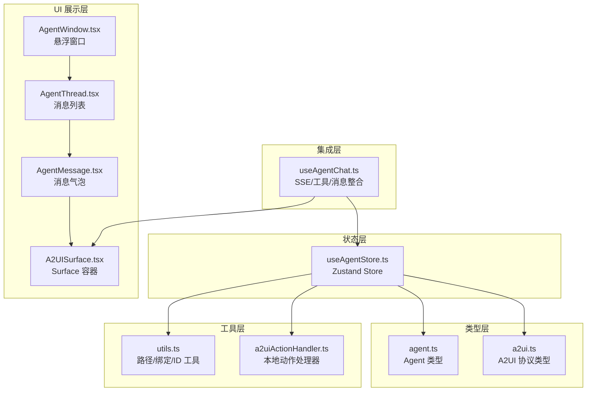
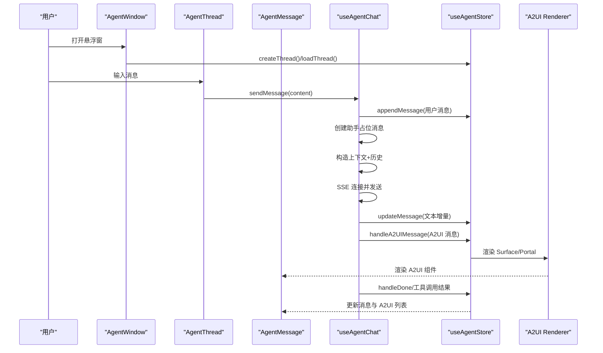
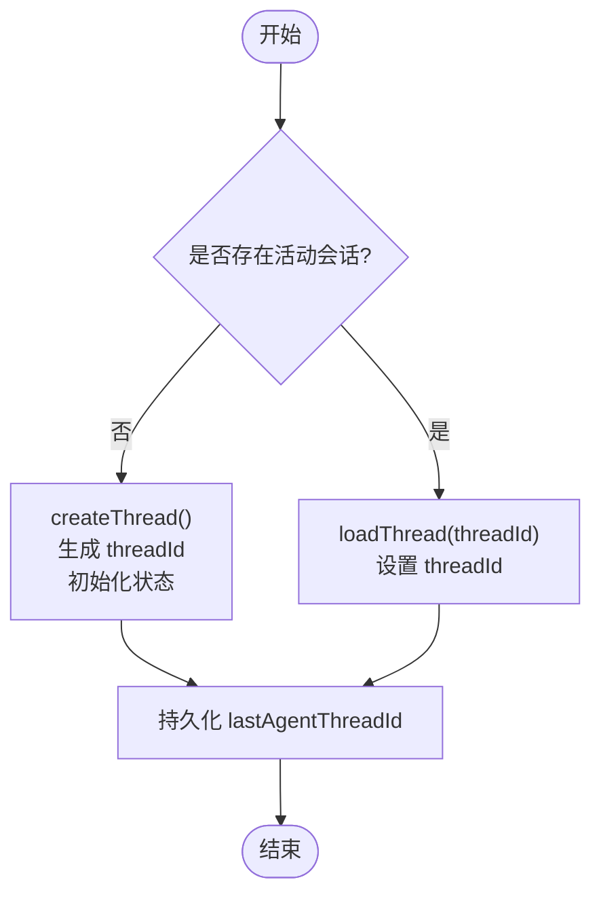
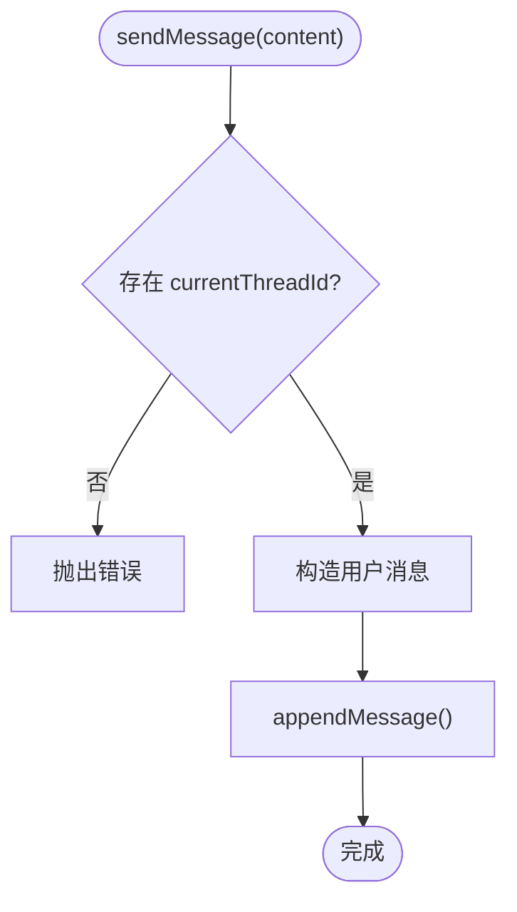
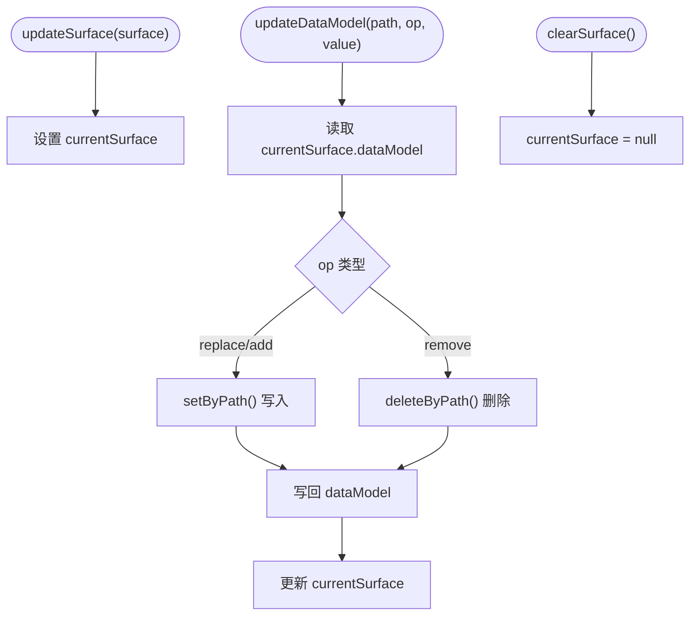
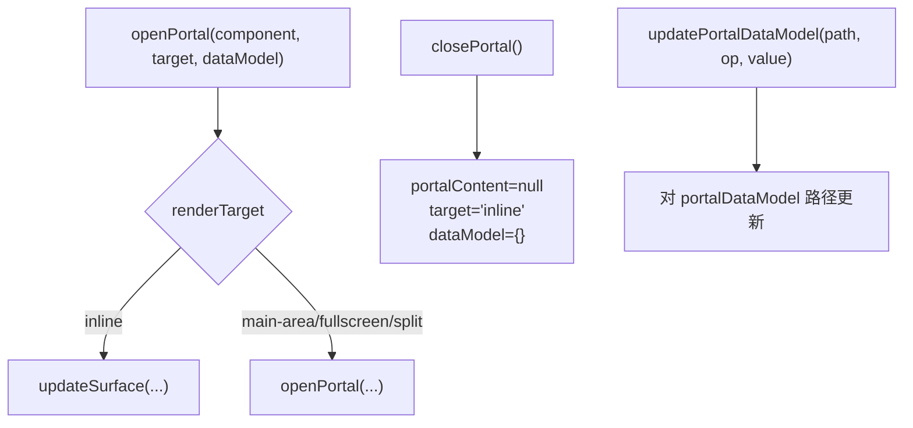
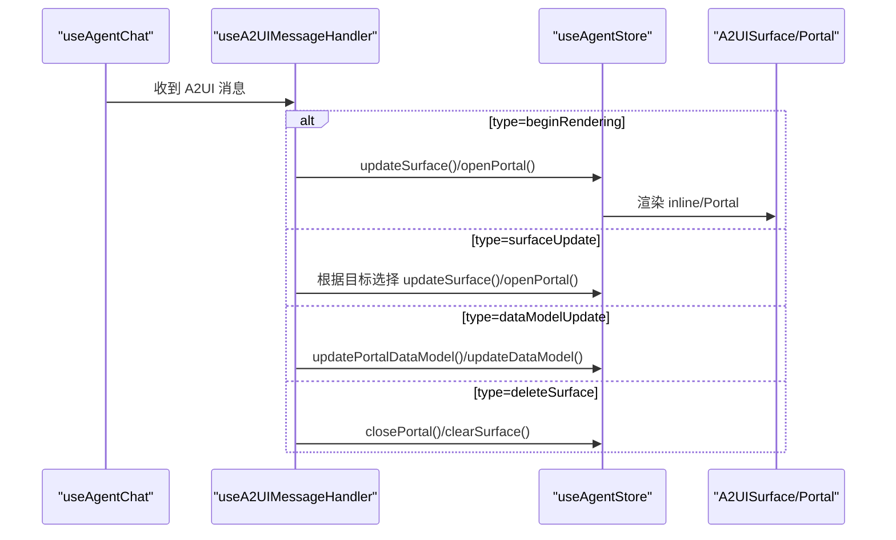
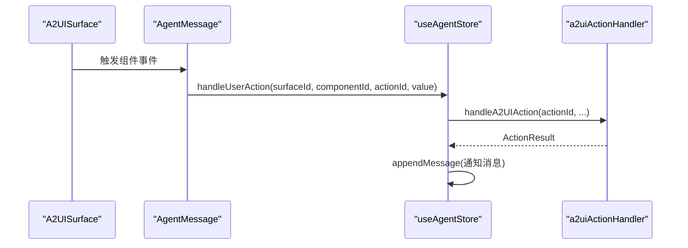
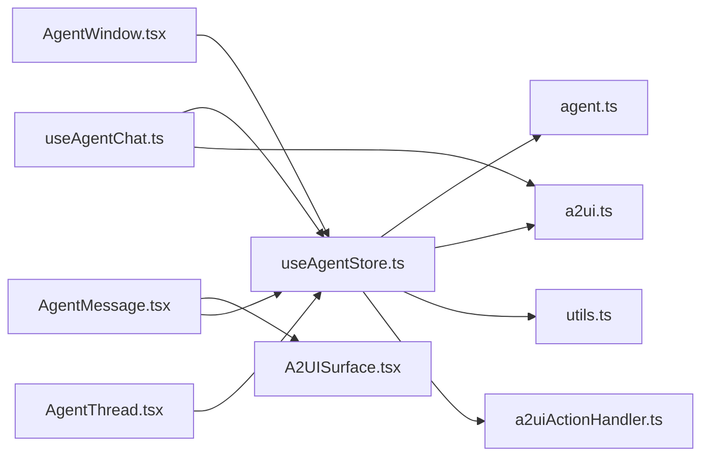

# Agent Store 状态管理

<cite>
**本文引用的文件**
- [useAgentStore.ts](file://app/src/stores/useAgentStore.ts)
- [agent.ts](file://app/src/types/agent.ts)
- [a2ui.ts](file://app/src/types/a2ui.ts)
- [utils.ts](file://app/src/components/agent/a2ui/utils.ts)
- [a2uiActionHandler.ts](file://app/src/lib/agent/a2uiActionHandler.ts)
- [AgentWindow.tsx](file://app/src/components/agent/AgentWindow.tsx)
- [AgentThread.tsx](file://app/src/components/agent/AgentThread.tsx)
- [AgentMessage.tsx](file://app/src/components/agent/AgentMessage.tsx)
- [A2UISurface.tsx](file://app/src/components/agent/a2ui/A2UISurface.tsx)
- [useAgentChat.ts](file://app/src/hooks/useAgentChat.ts)
</cite>

## 目录
1. [简介](#简介)
2. [项目结构](#项目结构)
3. [核心组件](#核心组件)
4. [架构总览](#架构总览)
5. [详细组件分析](#详细组件分析)
6. [依赖关系分析](#依赖关系分析)
7. [性能考量](#性能考量)
8. [故障排查指南](#故障排查指南)
9. [结论](#结论)
10. [附录](#附录)

## 简介
本文件系统性梳理 Agent Store 的状态管理实现，围绕会话管理、消息管理、Surface 管理、Portal 管理四大模块，结合 A2UI 消息处理（beginRendering、surfaceUpdate、dataModelUpdate 等）与用户操作链路，提供从架构到实现细节的全景说明，并给出使用示例与最佳实践。

## 项目结构
Agent Store 位于前端 Zustand 状态库中，配合 A2UI 协议类型、工具函数与组件渲染层协同工作。关键文件分布如下：
- 状态与动作：useAgentStore.ts
- 类型定义：agent.ts、a2ui.ts
- A2UI 工具：utils.ts
- A2UI 动作处理器：a2uiActionHandler.ts
- UI 容器与渲染：AgentWindow.tsx、AgentThread.tsx、AgentMessage.tsx、A2UISurface.tsx
- 对话集成层：useAgentChat.ts

图表来源
- [useAgentStore.ts:1-482](file://app/src/stores/useAgentStore.ts#L1-L482)
- [agent.ts:1-349](file://app/src/types/agent.ts#L1-L349)
- [a2ui.ts:1-231](file://app/src/types/a2ui.ts#L1-L231)
- [utils.ts:1-172](file://app/src/components/agent/a2ui/utils.ts#L1-L172)
- [a2uiActionHandler.ts:1-77](file://app/src/lib/agent/a2uiActionHandler.ts#L1-L77)
- [AgentWindow.tsx:1-243](file://app/src/components/agent/AgentWindow.tsx#L1-L243)
- [AgentThread.tsx:1-183](file://app/src/components/agent/AgentThread.tsx#L1-L183)
- [AgentMessage.tsx:1-177](file://app/src/components/agent/AgentMessage.tsx#L1-L177)
- [A2UISurface.tsx:1-112](file://app/src/components/agent/a2ui/A2UISurface.tsx#L1-L112)
- [useAgentChat.ts:1-380](file://app/src/hooks/useAgentChat.ts#L1-L380)

章节来源
- [useAgentStore.ts:1-482](file://app/src/stores/useAgentStore.ts#L1-L482)
- [agent.ts:1-349](file://app/src/types/agent.ts#L1-L349)
- [a2ui.ts:1-231](file://app/src/types/a2ui.ts#L1-L231)

## 核心组件
- Agent Store：统一管理会话、消息、Surface、Portal、UI 状态与上下文，提供持久化策略。
- A2UI 协议类型：定义渲染目标、组件树、消息类型与客户端/服务端消息格式。
- A2UI 工具：提供路径读写、绑定解析、ID 生成等基础能力。
- A2UI 动作处理器：将组件触发的动作路由到本地处理（如导航）。
- UI 组件：AgentWindow、AgentThread、AgentMessage、A2UISurface 将状态转化为可视化体验。
- useAgentChat：整合 SSE、工具执行与状态更新，形成完整的对话生命周期。

章节来源
- [useAgentStore.ts:60-343](file://app/src/stores/useAgentStore.ts#L60-L343)
- [a2ui.ts:76-167](file://app/src/types/a2ui.ts#L76-L167)
- [utils.ts:10-172](file://app/src/components/agent/a2ui/utils.ts#L10-L172)
- [a2uiActionHandler.ts:26-77](file://app/src/lib/agent/a2uiActionHandler.ts#L26-L77)
- [AgentWindow.tsx:36-242](file://app/src/components/agent/AgentWindow.tsx#L36-L242)
- [AgentThread.tsx:19-55](file://app/src/components/agent/AgentThread.tsx#L19-L55)
- [AgentMessage.tsx:24-148](file://app/src/components/agent/AgentMessage.tsx#L24-L148)
- [A2UISurface.tsx:30-81](file://app/src/components/agent/a2ui/A2UISurface.tsx#L30-L81)
- [useAgentChat.ts:47-377](file://app/src/hooks/useAgentChat.ts#L47-L377)

## 架构总览
Agent Store 采用 Zustand + persist 的组合，将会话、消息、Surface、Portal 等状态集中管理；useAgentChat 作为集成层，负责与后端 SSE 通信、累积消息与 A2UI 消息、执行工具调用并将结果回写到 Store；UI 层通过组件树渲染当前 Surface 或 Portal 内容。

图表来源
- [useAgentChat.ts:299-367](file://app/src/hooks/useAgentChat.ts#L299-L367)
- [useAgentStore.ts:358-459](file://app/src/stores/useAgentStore.ts#L358-L459)
- [AgentMessage.tsx:87-113](file://app/src/components/agent/AgentMessage.tsx#L87-L113)
- [A2UISurface.tsx:30-81](file://app/src/components/agent/a2ui/A2UISurface.tsx#L30-L81)

## 详细组件分析

### 会话管理
- 创建新会话：生成 threadId，清空消息与 Surface，持久化最近一次会话 ID。
- 加载已有会话：设置 currentThreadId，清空消息与 Surface，更新最近一次会话 ID。
- 清空会话：重置 threadId、消息、Surface，移除最近一次会话 ID。

图表来源
- [useAgentStore.ts:68-115](file://app/src/stores/useAgentStore.ts#L68-L115)

章节来源
- [useAgentStore.ts:68-115](file://app/src/stores/useAgentStore.ts#L68-L115)

### 消息管理
- 发送消息：校验活动会话，构造用户消息并追加；随后由集成层负责实际发送与流式更新。
- 追加消息：将新消息推入 messages。
- 更新消息：按 id 替换/合并消息字段（如内容、流式状态、A2UI 列表、工具调用）。

图表来源
- [useAgentStore.ts:119-146](file://app/src/stores/useAgentStore.ts#L119-L146)
- [useAgentChat.ts:300-367](file://app/src/hooks/useAgentChat.ts#L300-L367)

章节来源
- [useAgentStore.ts:119-164](file://app/src/stores/useAgentStore.ts#L119-L164)
- [useAgentChat.ts:94-132](file://app/src/hooks/useAgentChat.ts#L94-L132)

### Surface 管理
- 更新 Surface：设置 currentSurface（包含 id、component、dataModel）。
- 更新数据模型：基于 JSON Path 对 dataModel 进行 replace/add/remove。
- 清空 Surface：将 currentSurface 置空。

图表来源
- [useAgentStore.ts:168-208](file://app/src/stores/useAgentStore.ts#L168-L208)
- [utils.ts:41-76](file://app/src/components/agent/a2ui/utils.ts#L41-L76)

章节来源
- [useAgentStore.ts:168-208](file://app/src/stores/useAgentStore.ts#L168-L208)
- [utils.ts:41-76](file://app/src/components/agent/a2ui/utils.ts#L41-L76)

### Portal 管理
- 打开 Portal：根据 renderTarget 决定渲染位置（inline/main-area/fullscreen/split），并设置 portalContent、portalTarget、portalDataModel。
- 关闭 Portal：清空 portalContent，恢复默认 target 与空数据模型。
- 更新 Portal 数据模型：对 portalDataModel 进行路径式更新。

图表来源
- [useAgentStore.ts:215-259](file://app/src/stores/useAgentStore.ts#L215-L259)
- [useAgentStore.ts:358-459](file://app/src/stores/useAgentStore.ts#L358-L459)

章节来源
- [useAgentStore.ts:215-259](file://app/src/stores/useAgentStore.ts#L215-L259)
- [useAgentStore.ts:358-459](file://app/src/stores/useAgentStore.ts#L358-L459)

### A2UI 消息处理
- beginRendering：根据组件的 renderTarget 决定 inline 或 Portal 渲染；移动端对 main-area 自动升级为 fullscreen。
- surfaceUpdate：若目标组件匹配当前 Portal，则刷新 Portal；否则更新当前 Surface。
- dataModelUpdate：优先更新 Portal 数据模型，否则更新当前 Surface 的数据模型。
- deleteSurface：若被删除的是当前 Portal，则关闭 Portal，否则清空 Surface。

图表来源
- [useAgentStore.ts:358-459](file://app/src/stores/useAgentStore.ts#L358-L459)
- [useAgentChat.ts:114-132](file://app/src/hooks/useAgentChat.ts#L114-L132)

章节来源
- [useAgentStore.ts:358-459](file://app/src/stores/useAgentStore.ts#L358-L459)
- [useAgentChat.ts:114-132](file://app/src/hooks/useAgentChat.ts#L114-L132)

### 用户操作与动作处理
- 用户在 A2UI 组件上触发事件，A2UISurface 包装为 userAction 并传递给 onAction。
- AgentMessage 将 userAction 交由 onAction 回调（来自 useAgentChat）。
- Store 调用 a2uiActionHandler 将 actionId 路由到本地处理（如导航），必要时创建助手通知消息。

图表来源
- [A2UISurface.tsx:40-54](file://app/src/components/agent/a2ui/A2UISurface.tsx#L40-L54)
- [AgentMessage.tsx:99-110](file://app/src/components/agent/AgentMessage.tsx#L99-L110)
- [useAgentStore.ts:296-332](file://app/src/stores/useAgentStore.ts#L296-L332)
- [a2uiActionHandler.ts:26-77](file://app/src/lib/agent/a2uiActionHandler.ts#L26-L77)

章节来源
- [A2UISurface.tsx:40-54](file://app/src/components/agent/a2ui/A2UISurface.tsx#L40-L54)
- [AgentMessage.tsx:99-110](file://app/src/components/agent/AgentMessage.tsx#L99-L110)
- [useAgentStore.ts:296-332](file://app/src/stores/useAgentStore.ts#L296-L332)
- [a2uiActionHandler.ts:26-77](file://app/src/lib/agent/a2uiActionHandler.ts#L26-L77)

## 依赖关系分析
- Store 依赖类型定义（agent.ts、a2ui.ts）、工具函数（utils.ts）与动作处理器（a2uiActionHandler.ts）。
- UI 组件依赖 Store 与 A2UI 渲染器（A2UISurface）。
- useAgentChat 作为集成层，串联 Store、SSE、工具执行与 UI 渲染。

图表来源
- [useAgentStore.ts:10-25](file://app/src/stores/useAgentStore.ts#L10-L25)
- [agent.ts:7-8](file://app/src/types/agent.ts#L7-L8)
- [a2ui.ts:7-8](file://app/src/types/a2ui.ts#L7-L8)
- [utils.ts:7-8](file://app/src/components/agent/a2ui/utils.ts#L7-L8)
- [a2uiActionHandler.ts:1-12](file://app/src/lib/agent/a2uiActionHandler.ts#L1-L12)
- [useAgentChat.ts:10-15](file://app/src/hooks/useAgentChat.ts#L10-L15)
- [AgentMessage.tsx:10-12](file://app/src/components/agent/AgentMessage.tsx#L10-L12)
- [A2UISurface.tsx:8-9](file://app/src/components/agent/a2ui/A2UISurface.tsx#L8-L9)
- [AgentWindow.tsx:13-16](file://app/src/components/agent/AgentWindow.tsx#L13-L16)
- [AgentThread.tsx:10-13](file://app/src/components/agent/AgentThread.tsx#L10-L13)

章节来源
- [useAgentStore.ts:10-25](file://app/src/stores/useAgentStore.ts#L10-L25)
- [useAgentChat.ts:10-15](file://app/src/hooks/useAgentChat.ts#L10-L15)
- [AgentMessage.tsx:10-12](file://app/src/components/agent/AgentMessage.tsx#L10-L12)
- [A2UISurface.tsx:8-9](file://app/src/components/agent/a2ui/A2UISurface.tsx#L8-L9)
- [AgentWindow.tsx:13-16](file://app/src/components/agent/AgentWindow.tsx#L13-L16)
- [AgentThread.tsx:10-13](file://app/src/components/agent/AgentThread.tsx#L10-L13)

## 性能考量
- 状态粒度：Store 将会话、消息、Surface、Portal、UI 状态分离，避免无关重渲染。
- 持久化：仅持久化必要的字段（如 currentThreadId、isPanelOpen），减少存储压力。
- 路径更新：通过 setByPath/deleteByPath 进行局部数据模型更新，降低整体状态拷贝成本。
- 渲染目标优化：移动端 main-area 自动升级为 fullscreen，提升交互效率。
- 流式渲染：SSE 文本增量与 A2UI 消息累积，避免频繁重绘。

## 故障排查指南
- 无活动会话：发送消息前需确保 currentThreadId 存在，否则会抛错。
- A2UI 消息缺失：beginRendering/surfaceUpdate 缺少 component 时会记录警告并跳过。
- Portal 未更新：确认 renderTarget 与当前 portalContent 的匹配关系。
- 数据模型异常：检查 JSON Path 是否正确，必要时使用 setByPath 的自动创建逻辑。
- 动作未生效：核对 actionId 是否在 a2uiActionHandler 中注册，以及组件 actions 映射是否正确。

章节来源
- [useAgentStore.ts:125-127](file://app/src/stores/useAgentStore.ts#L125-L127)
- [useAgentStore.ts:374-377](file://app/src/stores/useAgentStore.ts#L374-L377)
- [useAgentStore.ts:402-405](file://app/src/stores/useAgentStore.ts#L402-L405)
- [utils.ts:41-56](file://app/src/components/agent/a2ui/utils.ts#L41-L56)
- [a2uiActionHandler.ts:33-73](file://app/src/lib/agent/a2uiActionHandler.ts#L33-L73)

## 结论
Agent Store 通过清晰的模块划分与完善的 A2UI 协议支持，实现了从会话、消息到动态 UI 的全链路状态管理。结合 useAgentChat 的集成能力，系统具备良好的扩展性与可维护性。建议在后续迭代中完善会话加载的后端对接与工具链路的可观测性。

## 附录

### 使用示例与最佳实践
- 创建新会话并开始对话
  - 调用 createThread() 获取 threadId，随后通过 useAgentChat.sendMessage() 发送消息。
  - 参考路径：[useAgentStore.ts:68-85](file://app/src/stores/useAgentStore.ts#L68-L85)、[useAgentChat.ts:299-367](file://app/src/hooks/useAgentChat.ts#L299-L367)
- 在消息中嵌入 A2UI 组件
  - 在助手消息中包含 a2uiMessages，AgentMessage 会渲染 A2UI Surface。
  - 参考路径：[AgentMessage.tsx:87-113](file://app/src/components/agent/AgentMessage.tsx#L87-L113)
- 动态更新数据模型
  - 使用 updateDataModel/updatePortalDataModel 对指定路径进行 replace/add/remove。
  - 参考路径：[useAgentStore.ts:178-201](file://app/src/stores/useAgentStore.ts#L178-L201)、[utils.ts:41-76](file://app/src/components/agent/a2ui/utils.ts#L41-L76)
- 处理用户操作
  - 在组件中触发事件，通过 A2UISurface 包装为 userAction，最终由 a2uiActionHandler 处理。
  - 参考路径：[A2UISurface.tsx:40-54](file://app/src/components/agent/a2ui/A2UISurface.tsx#L40-L54)、[a2uiActionHandler.ts:26-77](file://app/src/lib/agent/a2uiActionHandler.ts#L26-L77)