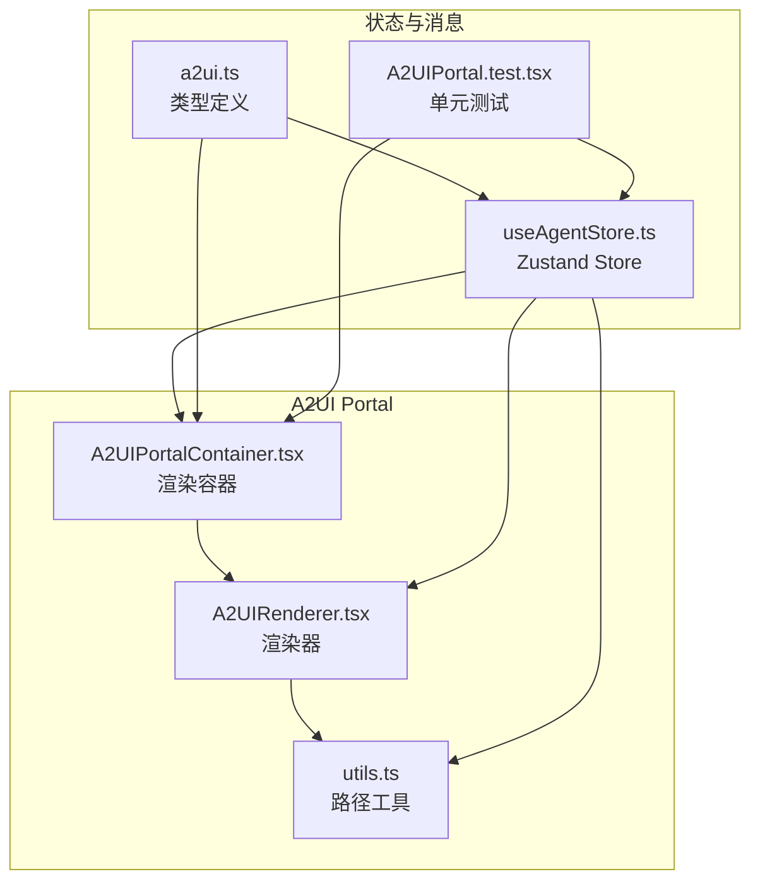
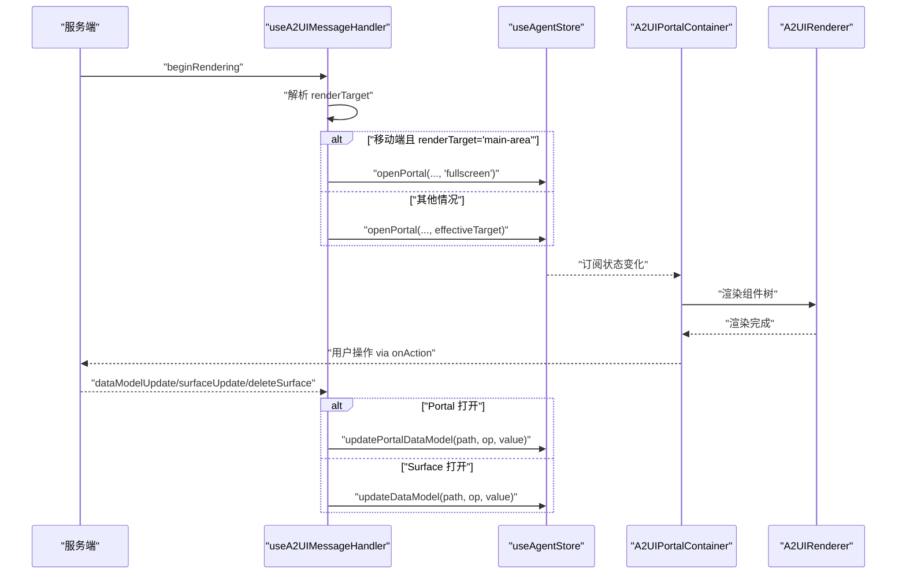
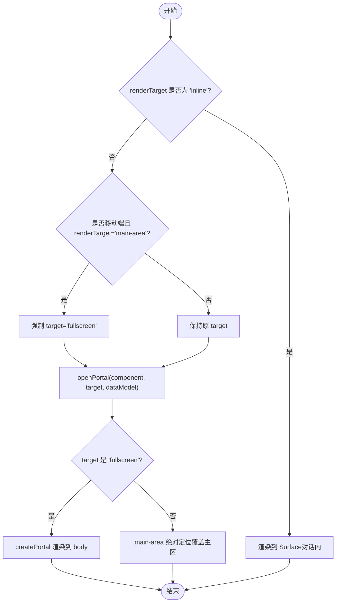
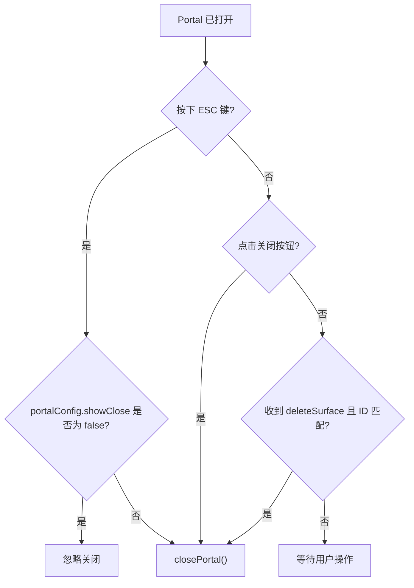
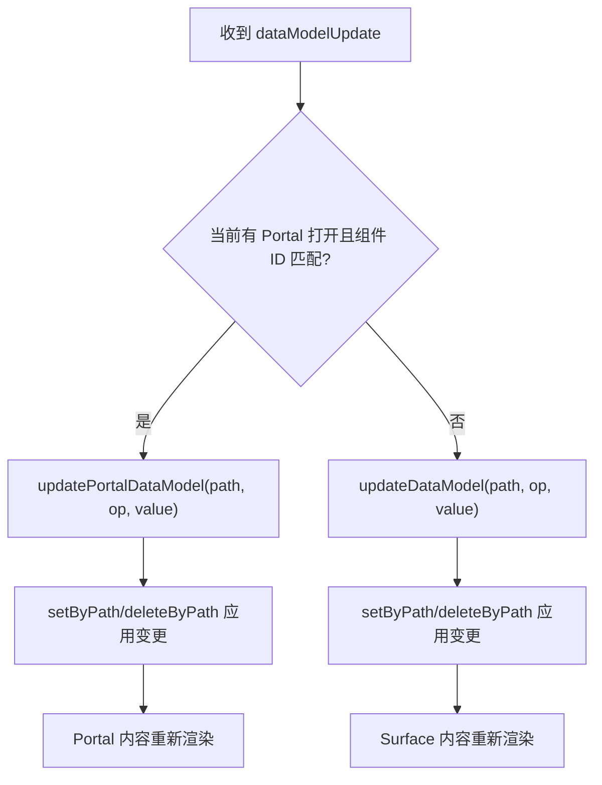
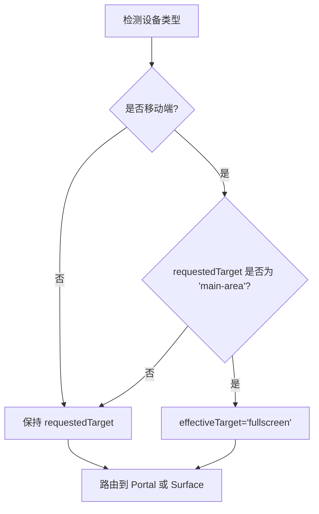
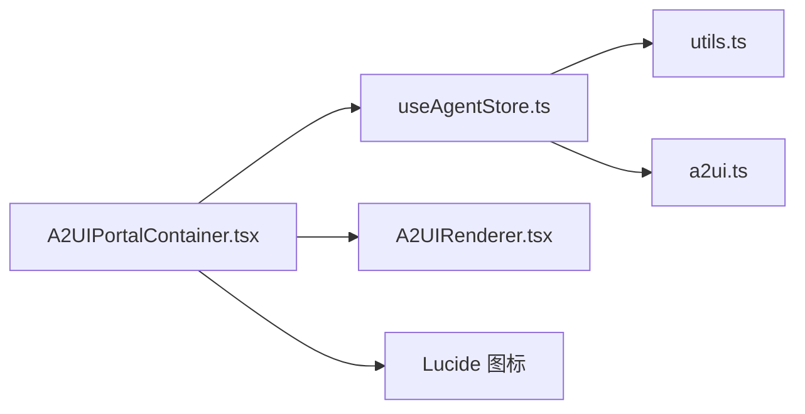

# Portal 管理

<cite>
**本文引用的文件**
- [A2UIPortalContainer.tsx](file://app/src/components/agent/a2ui/A2UIPortalContainer.tsx)
- [useAgentStore.ts](file://app/src/stores/useAgentStore.ts)
- [a2ui.ts](file://app/src/types/a2ui.ts)
- [utils.ts](file://app/src/components/agent/a2ui/utils.ts)
- [A2UIPortal.test.tsx](file://app/src/components/agent/a2ui/__tests__/A2UIPortal.test.tsx)
</cite>

## 目录
1. [简介](#简介)
2. [项目结构](#项目结构)
3. [核心组件](#核心组件)
4. [架构总览](#架构总览)
5. [详细组件分析](#详细组件分析)
6. [依赖关系分析](#依赖关系分析)
7. [性能考量](#性能考量)
8. [故障排查指南](#故障排查指南)
9. [结论](#结论)
10. [附录](#附录)

## 简介
本文件系统性阐述 Agent Store 中 Portal 管理的完整实现，围绕 openPortal、closePortal、updatePortalDataModel 三大方法展开，并深入解析 Portal 打开机制如何依据 renderTarget 参数选择渲染位置（inline、main-area、fullscreen、split），解释移动端适配逻辑（main-area 在移动端自动升级为 fullscreen），以及 Portal 数据模型更新如何沿用与 Surface 数据模型相同的路径式更新机制。同时提供 A2UI 组件中正确使用 Portal 的最佳实践与使用示例。

## 项目结构
Portal 管理涉及以下关键文件：
- A2UIPortalContainer.tsx：Portal 容器组件，负责根据目标类型渲染到主内容区或全屏模态，并处理键盘事件与用户动作。
- useAgentStore.ts：Zustand Store，包含 openPortal、closePortal、updatePortalDataModel 等方法，以及 useA2UIMessageHandler 的消息路由逻辑。
- a2ui.ts：A2UI 类型定义，包含 A2UIRenderTarget、A2UIPortalConfig、A2UIComponent 等。
- utils.ts：路径式数据模型操作工具（setByPath、deleteByPath），被 Portal 数据模型更新复用。
- A2UIPortal.test.tsx：单元测试，覆盖 Portal 渲染、关闭、背景样式、Store 集成与移动端适配。

**图表来源**
- [A2UIPortalContainer.tsx:1-167](file://app/src/components/agent/a2ui/A2UIPortalContainer.tsx#L1-L167)
- [useAgentStore.ts:1-482](file://app/src/stores/useAgentStore.ts#L1-L482)
- [a2ui.ts:1-231](file://app/src/types/a2ui.ts#L1-L231)
- [utils.ts:1-172](file://app/src/components/agent/a2ui/utils.ts#L1-L172)
- [A2UIPortal.test.tsx:1-346](file://app/src/components/agent/a2ui/__tests__/A2UIPortal.test.tsx#L1-L346)

**章节来源**
- [A2UIPortalContainer.tsx:1-167](file://app/src/components/agent/a2ui/A2UIPortalContainer.tsx#L1-L167)
- [useAgentStore.ts:1-482](file://app/src/stores/useAgentStore.ts#L1-L482)
- [a2ui.ts:1-231](file://app/src/types/a2ui.ts#L1-L231)
- [utils.ts:1-172](file://app/src/components/agent/a2ui/utils.ts#L1-L172)
- [A2UIPortal.test.tsx:1-346](file://app/src/components/agent/a2ui/__tests__/A2UIPortal.test.tsx#L1-L346)

## 核心组件
- Portal 容器组件（A2UIPortalContainer）
  - 根据 portalTarget 渲染到 main-area 或 fullscreen；inline 模式不渲染。
  - 提供 ESC 键关闭、关闭按钮、最小化占位等交互。
  - 通过 A2UIRenderer 渲染 Portal 内容，传递 dataModel 与 onAction 回调。
- Agent Store（useAgentStore）
  - 提供 openPortal、closePortal、updatePortalDataModel 三个核心方法。
  - useA2UIMessageHandler 负责根据 renderTarget 路由到 Surface 或 Portal，并处理数据模型更新与关闭逻辑。
  - isMobileDevice 与移动端适配逻辑：main-area 在移动端自动升级为 fullscreen。
- 类型与工具（a2ui.ts、utils.ts）
  - A2UIRenderTarget 定义渲染目标类型。
  - A2UIPortalConfig 定义 Portal 行为配置（关闭按钮、最小化、背景模式、标题等）。
  - setByPath、deleteByPath 支持路径式数据模型更新。

**章节来源**
- [A2UIPortalContainer.tsx:15-167](file://app/src/components/agent/a2ui/A2UIPortalContainer.tsx#L15-L167)
- [useAgentStore.ts:210-259](file://app/src/stores/useAgentStore.ts#L210-L259)
- [useAgentStore.ts:358-459](file://app/src/stores/useAgentStore.ts#L358-L459)
- [a2ui.ts:10-37](file://app/src/types/a2ui.ts#L10-L37)
- [utils.ts:41-76](file://app/src/components/agent/a2ui/utils.ts#L41-L76)

## 架构总览
Portal 管理的整体流程如下：
- 服务端下发 A2UI 消息（beginRendering/surfaceUpdate/dataModelUpdate/deleteSurface）。
- useA2UIMessageHandler 根据 renderTarget 决策：inline 走 Surface，否则走 Portal。
- Portal 打开时，A2UIPortalContainer 渲染到 main-area 或 fullscreen。
- 用户交互通过 onAction 回调进入 Store 的 handleUserAction，执行本地动作并反馈消息。
- 数据模型更新统一走路径式更新：Portal 走 updatePortalDataModel，Surface 走 updateDataModel。

**图表来源**
- [useAgentStore.ts:358-459](file://app/src/stores/useAgentStore.ts#L358-L459)
- [A2UIPortalContainer.tsx:21-167](file://app/src/components/agent/a2ui/A2UIPortalContainer.tsx#L21-L167)
- [a2ui.ts:76-134](file://app/src/types/a2ui.ts#L76-L134)

**章节来源**
- [useAgentStore.ts:358-459](file://app/src/stores/useAgentStore.ts#L358-L459)
- [A2UIPortalContainer.tsx:21-167](file://app/src/components/agent/a2ui/A2UIPortalContainer.tsx#L21-L167)

## 详细组件分析

### Portal 打开机制与渲染目标
- renderTarget 决策流程
  - inline：默认渲染到对话消息内（Surface）。
  - main-area/fullscreen/split：渲染到 Portal。
  - 移动端检测：若请求为 main-area，则强制改为 fullscreen。
- 渲染位置差异
  - main-area：绝对定位覆盖主内容区，提供顶部工具栏与关闭按钮。
  - fullscreen：通过 createPortal 渲染到 document.body，支持背景遮罩与点击关闭。
  - split：预留扩展，当前返回空。

**图表来源**
- [useAgentStore.ts:379-396](file://app/src/stores/useAgentStore.ts#L379-L396)
- [A2UIPortalContainer.tsx:68-155](file://app/src/components/agent/a2ui/A2UIPortalContainer.tsx#L68-L155)

**章节来源**
- [useAgentStore.ts:379-396](file://app/src/stores/useAgentStore.ts#L379-L396)
- [A2UIPortalContainer.tsx:68-155](file://app/src/components/agent/a2ui/A2UIPortalContainer.tsx#L68-L155)

### Portal 关闭机制
- ESC 键：当 Portal 打开且未显式禁用关闭时，按 ESC 关闭。
- 关闭按钮：点击关闭按钮触发 closePortal。
- 删除 Surface：当收到 deleteSurface 且匹配当前 Portal 的 surfaceId 时，自动关闭 Portal。

**图表来源**
- [A2UIPortalContainer.tsx:28-61](file://app/src/components/agent/a2ui/A2UIPortalContainer.tsx#L28-L61)
- [useAgentStore.ts:442-451](file://app/src/stores/useAgentStore.ts#L442-L451)

**章节来源**
- [A2UIPortalContainer.tsx:28-61](file://app/src/components/agent/a2ui/A2UIPortalContainer.tsx#L28-L61)
- [useAgentStore.ts:442-451](file://app/src/stores/useAgentStore.ts#L442-L451)

### Portal 数据模型更新
- 路径式更新机制
  - updatePortalDataModel 复用 setByPath、deleteByPath，支持 replace/add/remove 三种操作。
  - 与 Surface 的 updateDataModel 采用相同路径式更新策略，确保一致性。
- 更新路由
  - 当收到 dataModelUpdate 消息时，若当前有 Portal 打开且匹配组件 ID，则更新 Portal 数据模型；否则更新 Surface 数据模型。

**图表来源**
- [useAgentStore.ts:430-440](file://app/src/stores/useAgentStore.ts#L430-L440)
- [utils.ts:41-76](file://app/src/components/agent/a2ui/utils.ts#L41-L76)

**章节来源**
- [useAgentStore.ts:241-259](file://app/src/stores/useAgentStore.ts#L241-L259)
- [useAgentStore.ts:430-440](file://app/src/stores/useAgentStore.ts#L430-L440)
- [utils.ts:41-76](file://app/src/components/agent/a2ui/utils.ts#L41-L76)

### 移动端适配逻辑
- 适配规则：移动端（window.innerWidth < 768）时，main-area 自动升级为 fullscreen。
- 实现位置：useA2UIMessageHandler 在解析 renderTarget 后计算 effectiveTarget。
- 测试验证：单元测试通过模拟 window.innerWidth=375 验证 openPortal 接收 'fullscreen'。

**图表来源**
- [useAgentStore.ts:348-352](file://app/src/stores/useAgentStore.ts#L348-L352)
- [useAgentStore.ts:381-383](file://app/src/stores/useAgentStore.ts#L381-L383)
- [A2UIPortal.test.tsx:324-345](file://app/src/components/agent/a2ui/__tests__/A2UIPortal.test.tsx#L324-L345)

**章节来源**
- [useAgentStore.ts:348-383](file://app/src/stores/useAgentStore.ts#L348-L383)
- [A2UIPortal.test.tsx:324-345](file://app/src/components/agent/a2ui/__tests__/A2UIPortal.test.tsx#L324-L345)

### A2UI 组件中正确使用 Portal 的最佳实践
- 渲染目标选择
  - inline：适合轻量、可内嵌的内容，避免阻断主内容区。
  - main-area：适合需要覆盖主内容区但不需要全屏的场景（移动端将自动升级为 fullscreen）。
  - fullscreen：适合需要沉浸式体验的复杂表单、预览或编辑器。
  - split：预留扩展，当前未实现。
- Portal 配置建议
  - 显式设置 portalConfig.title 以提升可访问性。
  - 根据场景选择 backdrop（blur/dim/none），平衡视觉效果与可读性。
  - 合理使用 showClose/showMinimize，避免干扰用户操作。
- 数据模型更新
  - 使用路径式更新（如 'photos.0.metadata.location'）以精确控制局部状态。
  - 保持 Portal 与 Surface 的数据模型更新策略一致，便于维护。
- 用户交互
  - 通过 actions 映射事件到 actionId，交由 Store 的 handleUserAction 处理。
  - 提供明确的反馈消息（成功/失败），增强用户体验。

**章节来源**
- [a2ui.ts:10-37](file://app/src/types/a2ui.ts#L10-L37)
- [A2UIPortalContainer.tsx:105-155](file://app/src/components/agent/a2ui/A2UIPortalContainer.tsx#L105-L155)

## 依赖关系分析
- 组件耦合
  - A2UIPortalContainer 依赖 useAgentStore 的状态与方法，以及 A2UIRenderer。
  - useAgentStore 依赖 utils.ts 的路径式更新工具，并通过类型定义 a2ui.ts。
- 外部依赖
  - react-dom 的 createPortal 用于 fullscreen 渲染。
  - Lucide 图标库提供关闭与最小化图标。
- 潜在风险
  - split 目标尚未实现，需避免将其作为生产配置。
  - 路径式更新依赖点号分隔的字符串路径，需确保路径格式正确。

**图表来源**
- [A2UIPortalContainer.tsx:1-167](file://app/src/components/agent/a2ui/A2UIPortalContainer.tsx#L1-L167)
- [useAgentStore.ts:1-482](file://app/src/stores/useAgentStore.ts#L1-L482)
- [utils.ts:1-172](file://app/src/components/agent/a2ui/utils.ts#L1-L172)
- [a2ui.ts:1-231](file://app/src/types/a2ui.ts#L1-L231)

**章节来源**
- [A2UIPortalContainer.tsx:1-167](file://app/src/components/agent/a2ui/A2UIPortalContainer.tsx#L1-L167)
- [useAgentStore.ts:1-482](file://app/src/stores/useAgentStore.ts#L1-L482)
- [utils.ts:1-172](file://app/src/components/agent/a2ui/utils.ts#L1-L172)
- [a2ui.ts:1-231](file://app/src/types/a2ui.ts#L1-L231)

## 性能考量
- 渲染优化
  - main-area 与 fullscreen 的内容均通过 A2UIRenderer 递归渲染，建议避免过深的组件树与过多的绑定计算。
  - 使用 A2UIRendererSafe 的错误边界减少异常扩散，提高稳定性。
- 状态更新
  - 路径式更新仅修改目标路径，避免整体重渲染。
  - 避免频繁触发 updatePortalDataModel，可在用户输入过程中节流或防抖。
- 移动端适配
  - main-area 自动升级为 fullscreen 可减少布局抖动，但需注意 fullscreen 的层级与遮罩开销。

[本节为通用指导，不直接分析具体文件]

## 故障排查指南
- Portal 不显示
  - 检查 portalContent 是否为空或 renderTarget 是否为 'inline'。
  - 确认 A2UIPortalContainer 已挂载到应用根节点。
- ESC 键无效
  - 检查 portalConfig.showClose 是否被设为 false。
  - 确认键盘事件监听是否正常注册。
- 关闭按钮不生效
  - 确认 portalConfig.showClose 是否为 true。
  - 检查 closePortal 是否被外部逻辑覆盖。
- fullscreen 背景样式异常
  - 检查 portalConfig.backdrop 值是否为 blur/dim/none。
- 数据模型更新无效
  - 确认路径格式正确（点号分隔）。
  - 检查组件 ID 是否与当前 Portal 的组件 ID 匹配。
- 移动端 main-area 未升级为 fullscreen
  - 检查 window.innerWidth 是否小于 768。
  - 确认 renderTarget 请求是否为 'main-area'。

**章节来源**
- [A2UIPortalContainer.tsx:28-61](file://app/src/components/agent/a2ui/A2UIPortalContainer.tsx#L28-L61)
- [A2UIPortalContainer.tsx:105-155](file://app/src/components/agent/a2ui/A2UIPortalContainer.tsx#L105-L155)
- [useAgentStore.ts:430-440](file://app/src/stores/useAgentStore.ts#L430-L440)
- [A2UIPortal.test.tsx:324-345](file://app/src/components/agent/a2ui/__tests__/A2UIPortal.test.tsx#L324-L345)

## 结论
Portal 管理在 Agent Store 中实现了清晰的职责分离：消息路由由 useA2UIMessageHandler 负责，渲染与交互由 A2UIPortalContainer 负责，数据模型更新通过路径式工具统一处理。移动端适配逻辑确保了在小屏设备上的良好体验。遵循本文的最佳实践，可在 A2UI 组件中稳定地使用 Portal 功能。

[本节为总结性内容，不直接分析具体文件]

## 附录
- 使用示例（步骤说明）
  - 打开 Portal：调用 openPortal(component, 'main-area'/'fullscreen'/'inline'，可选 dataModel）。
  - 关闭 Portal：调用 closePortal。
  - 更新数据模型：调用 updatePortalDataModel('photos.0.url', 'replace', 'newUrl')。
  - 处理用户操作：在组件 actions 中映射事件到 actionId，Store 的 handleUserAction 会统一处理。
- 相关类型参考
  - A2UIRenderTarget：inline/main-area/fullscreen/split。
  - A2UIPortalConfig：showClose/showMinimize/backdrop/onClose/title。
  - A2UIComponent：id/type/props/actions/children/renderTarget/portalConfig。

**章节来源**
- [useAgentStore.ts:215-259](file://app/src/stores/useAgentStore.ts#L215-L259)
- [a2ui.ts:10-68](file://app/src/types/a2ui.ts#L10-L68)
- [A2UIPortal.test.tsx:255-307](file://app/src/components/agent/a2ui/__tests__/A2UIPortal.test.tsx#L255-L307)