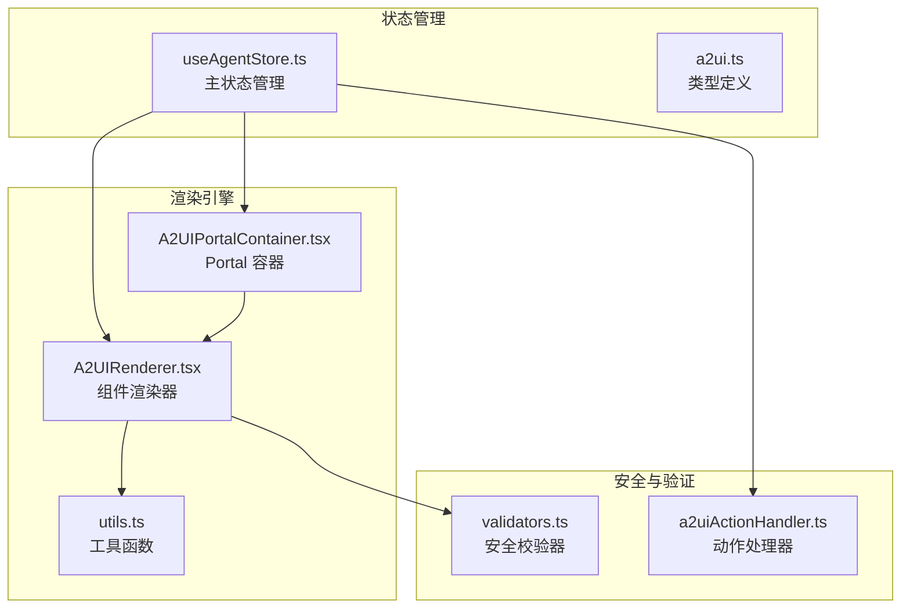
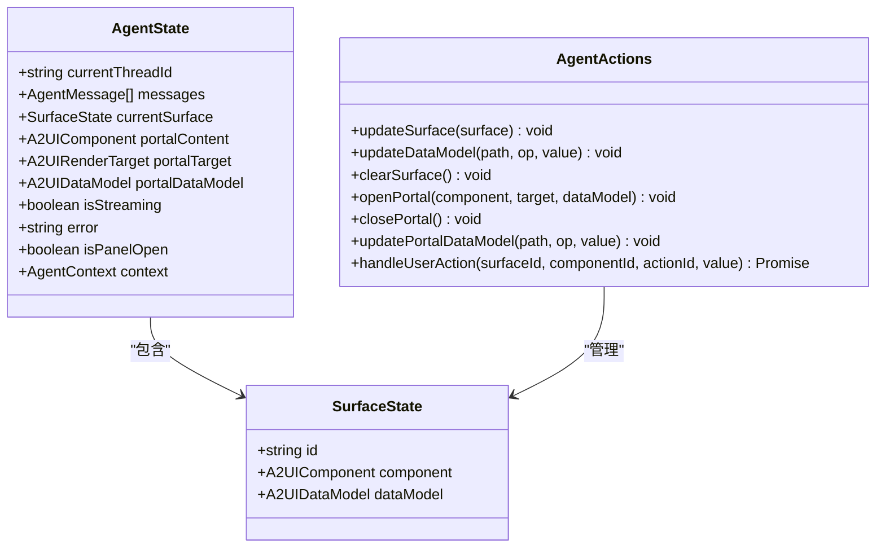
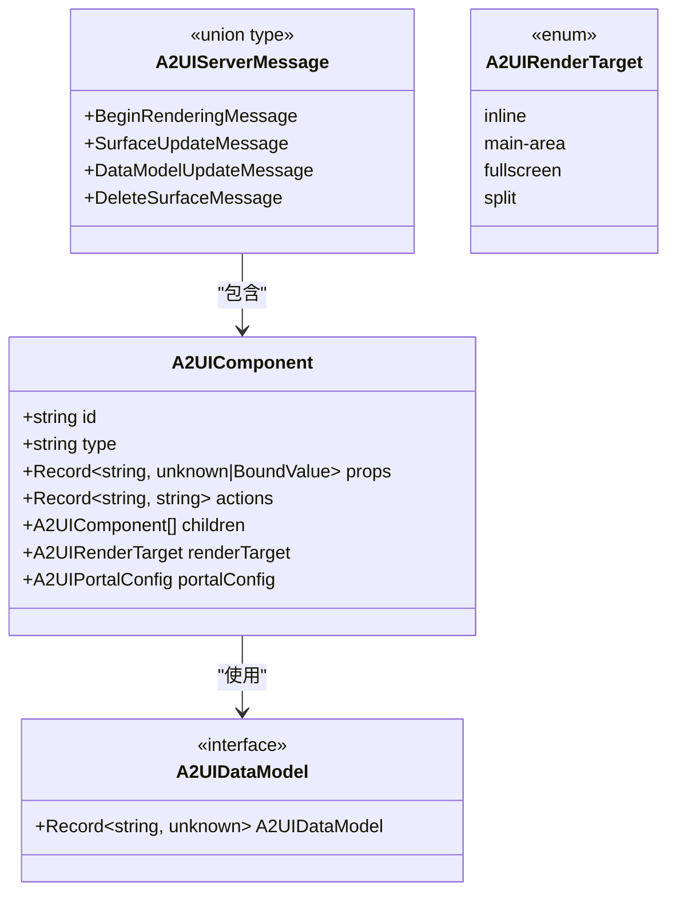
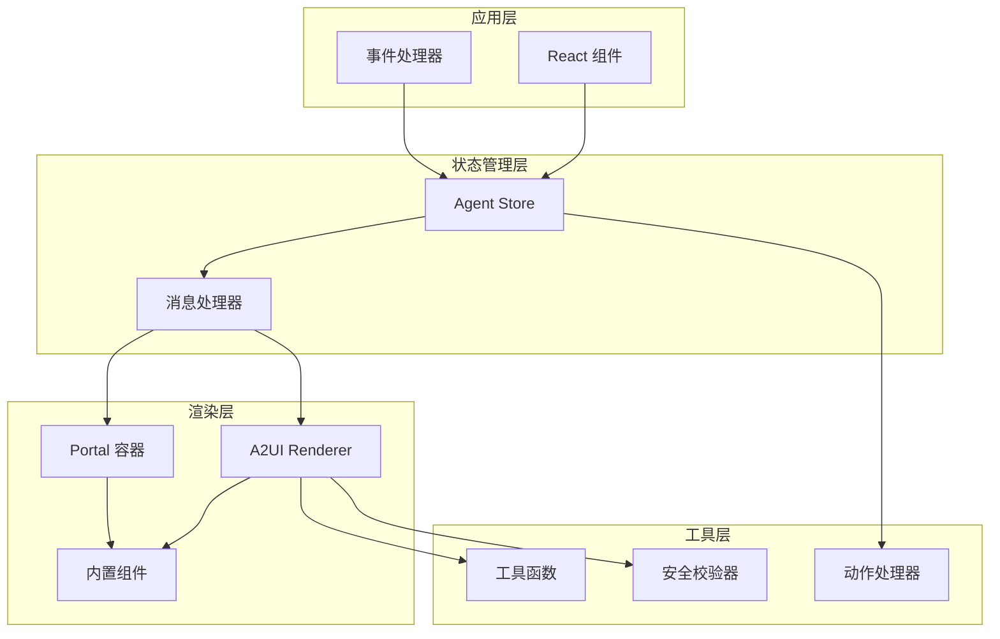
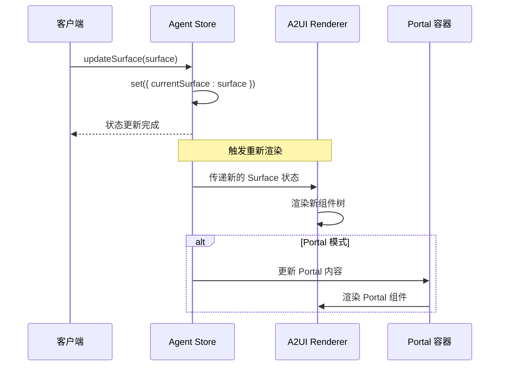
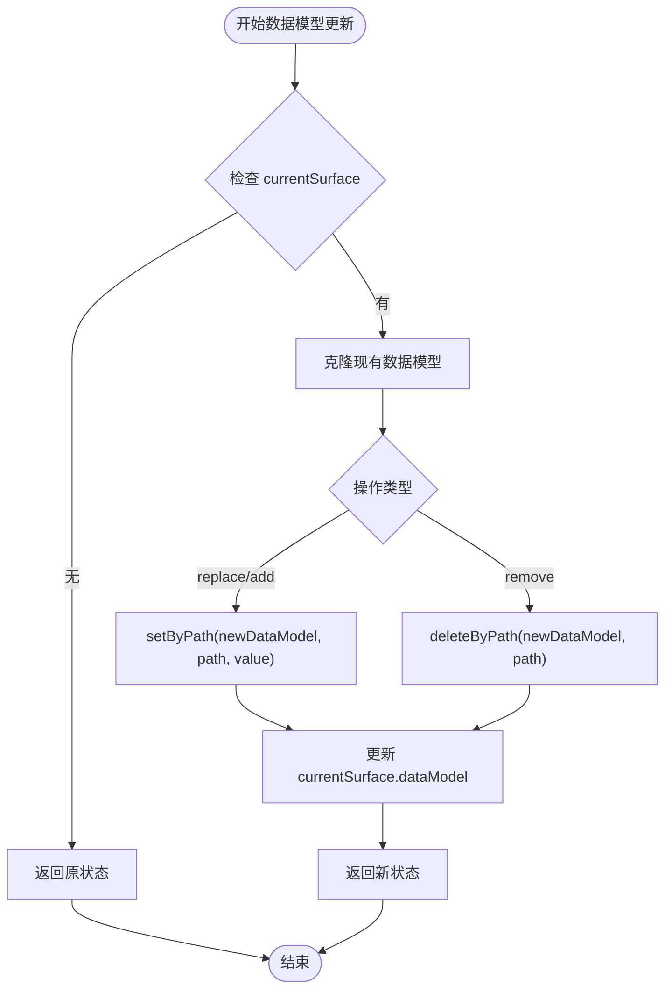
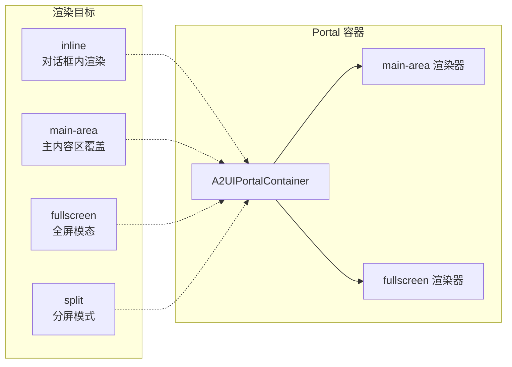
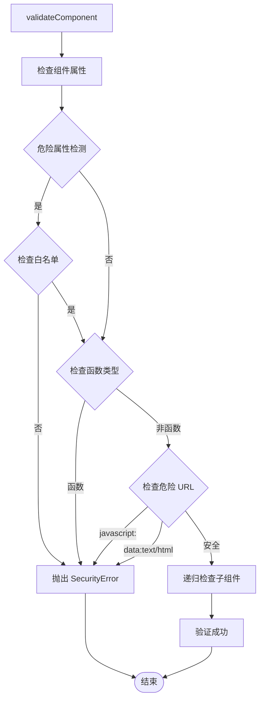
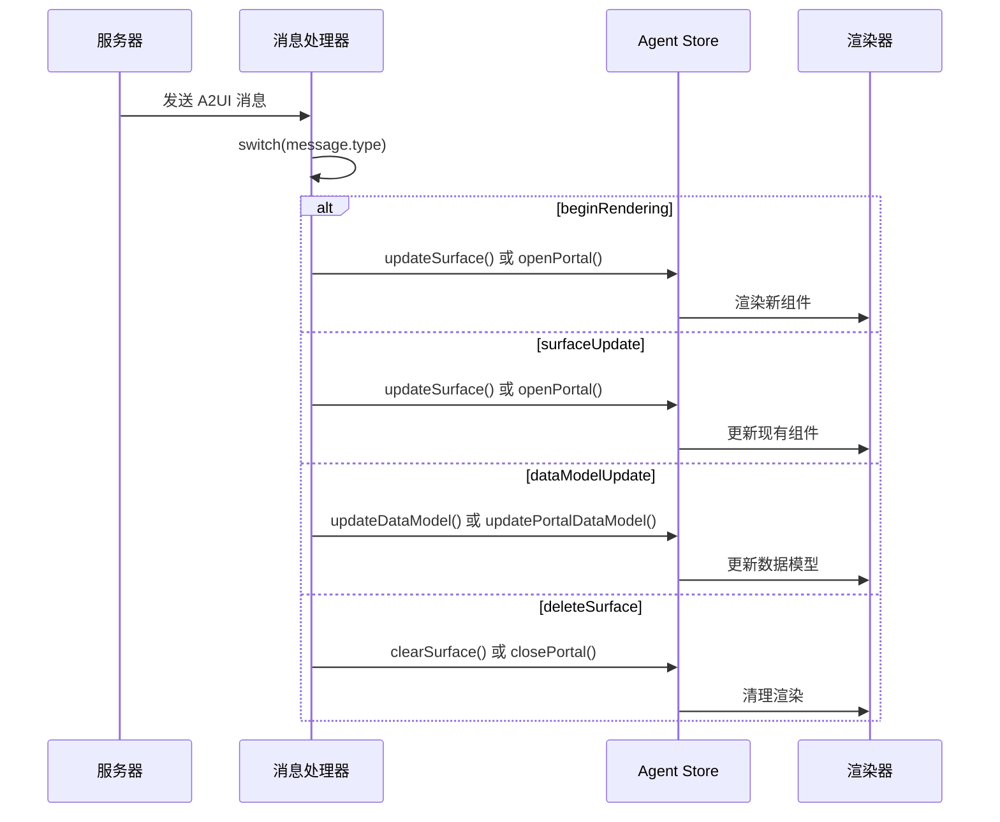
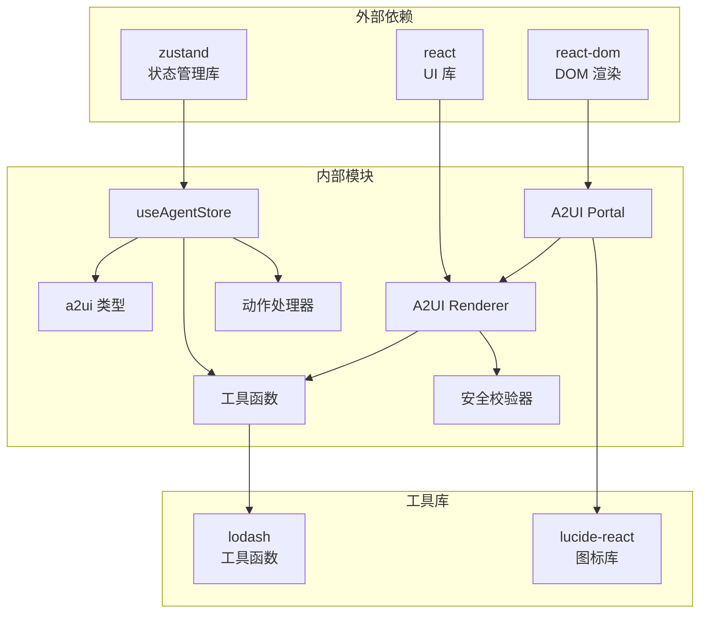

# Surface 管理

<cite>
**本文档引用的文件**
- [useAgentStore.ts](file://app/src/stores/useAgentStore.ts)
- [a2ui.ts](file://app/src/types/a2ui.ts)
- [utils.ts](file://app/src/components/agent/a2ui/utils.ts)
- [A2UIPortalContainer.tsx](file://app/src/components/agent/a2ui/A2UIPortalContainer.tsx)
- [A2UIRenderer.tsx](file://app/src/components/agent/a2ui/A2UIRenderer.tsx)
- [validators.ts](file://app/src/components/agent/a2ui/validators.ts)
- [a2uiActionHandler.ts](file://app/src/lib/agent/a2uiActionHandler.ts)
</cite>

## 目录
1. [简介](#简介)
2. [项目结构](#项目结构)
3. [核心组件](#核心组件)
4. [架构概览](#架构概览)
5. [详细组件分析](#详细组件分析)
6. [依赖关系分析](#依赖关系分析)
7. [性能考虑](#性能考虑)
8. [故障排除指南](#故障排除指南)
9. [结论](#结论)

## 简介

Surface 管理是 Agent Store 中的核心功能模块，负责管理 AI 驱动的动态 UI 渲染状态。该系统实现了基于 A2UI 协议的组件渲染机制，支持实时数据绑定、事件处理和状态管理。

本模块主要包含以下核心功能：
- Surface 更新机制：管理当前渲染的 A2UI 组件和数据模型
- 数据模型更新：支持路径式数据更新，包括 replace、add、remove 操作
- Portal 管理：控制组件在不同渲染目标中的显示方式
- 安全校验：确保组件渲染的安全性和稳定性

## 项目结构

Surface 管理功能分布在以下关键文件中：



**图表来源**
- [useAgentStore.ts:1-482](file://app/src/stores/useAgentStore.ts#L1-L482)
- [a2ui.ts:1-231](file://app/src/types/a2ui.ts#L1-L231)
- [A2UIRenderer.tsx:1-244](file://app/src/components/agent/a2ui/A2UIRenderer.tsx#L1-L244)

**章节来源**
- [useAgentStore.ts:1-482](file://app/src/stores/useAgentStore.ts#L1-L482)
- [a2ui.ts:1-231](file://app/src/types/a2ui.ts#L1-L231)

## 核心组件

### Agent Store 状态管理

Agent Store 提供了完整的状态管理能力，包括会话管理、消息处理和 Surface 管理。



**图表来源**
- [useAgentStore.ts:34-47](file://app/src/stores/useAgentStore.ts#L34-L47)
- [useAgentStore.ts:280-306](file://app/src/stores/useAgentStore.ts#L280-L306)
- [a2ui.ts:226-231](file://app/src/types/a2ui.ts#L226-L231)

### A2UI 协议类型定义

A2UI 协议定义了组件渲染的标准格式和消息类型：



**图表来源**
- [a2ui.ts:53-68](file://app/src/types/a2ui.ts#L53-L68)
- [a2ui.ts:74](file://app/src/types/a2ui.ts#L74)
- [a2ui.ts:129-134](file://app/src/types/a2ui.ts#L129-L134)
- [a2ui.ts:15-20](file://app/src/types/a2ui.ts#L15-L20)

**章节来源**
- [useAgentStore.ts:34-47](file://app/src/stores/useAgentStore.ts#L34-L47)
- [a2ui.ts:53-68](file://app/src/types/a2ui.ts#L53-L68)
- [a2ui.ts:129-134](file://app/src/types/a2ui.ts#L129-L134)

## 架构概览

Surface 管理系统的整体架构采用分层设计，确保了良好的可维护性和扩展性：



**图表来源**
- [useAgentStore.ts:358-459](file://app/src/stores/useAgentStore.ts#L358-L459)
- [A2UIRenderer.tsx:91-171](file://app/src/components/agent/a2ui/A2UIRenderer.tsx#L91-L171)
- [A2UIPortalContainer.tsx:21-167](file://app/src/components/agent/a2ui/A2UIPortalContainer.tsx#L21-L167)

## 详细组件分析

### Surface 更新机制

Surface 更新机制负责管理当前正在渲染的 A2UI 组件和相关数据模型。

#### updateSurface 方法

updateSurface 方法提供了直接更新当前 Surface 的能力：



**图表来源**
- [useAgentStore.ts:171-173](file://app/src/stores/useAgentStore.ts#L171-L173)
- [A2UIRenderer.tsx:166-170](file://app/src/components/agent/a2ui/A2UIRenderer.tsx#L166-L170)

#### 数据模型更新机制

数据模型更新功能支持三种操作类型：replace、add、remove，使用 setByPath 和 deleteByPath 工具函数实现路径式更新：



**图表来源**
- [useAgentStore.ts:178-201](file://app/src/stores/useAgentStore.ts#L178-L201)
- [utils.ts:41-76](file://app/src/components/agent/a2ui/utils.ts#L41-L76)

**章节来源**
- [useAgentStore.ts:171-201](file://app/src/stores/useAgentStore.ts#L171-L201)
- [utils.ts:41-76](file://app/src/components/agent/a2ui/utils.ts#L41-L76)

### Portal 管理系统

Portal 管理系统提供了灵活的组件渲染目标控制，支持 inline、main-area、fullscreen、split 四种渲染模式。

#### Portal 渲染目标



**图表来源**
- [a2ui.ts:15-20](file://app/src/types/a2ui.ts#L15-L20)
- [A2UIPortalContainer.tsx:68-155](file://app/src/components/agent/a2ui/A2UIPortalContainer.tsx#L68-L155)

#### Portal 数据模型更新

Portal 数据模型更新遵循与 Surface 相同的路径式更新机制：

**章节来源**
- [useAgentStore.ts:215-259](file://app/src/stores/useAgentStore.ts#L215-L259)
- [A2UIPortalContainer.tsx:21-66](file://app/src/components/agent/a2ui/A2UIPortalContainer.tsx#L21-L66)

### 安全性检查与防御性编程

系统实现了多层次的安全检查和防御性编程实践：

#### 安全校验器



**图表来源**
- [validators.ts:74-111](file://app/src/components/agent/a2ui/validators.ts#L74-L111)

#### 防御性编程实践

系统在多个层面实施了防御性编程：

1. **空值检查**：所有关键操作都包含 null/undefined 检查
2. **类型验证**：严格的 TypeScript 类型定义
3. **边界条件处理**：路径不存在时的安全删除
4. **错误隔离**：组件渲染错误的边界处理

**章节来源**
- [validators.ts:74-179](file://app/src/components/agent/a2ui/validators.ts#L74-L179)
- [A2UIRenderer.tsx:100-131](file://app/src/components/agent/a2ui/A2UIRenderer.tsx#L100-L131)

### A2UI 消息处理流程

系统实现了完整的 A2UI 消息处理机制，支持 beginRendering、surfaceUpdate、dataModelUpdate、deleteSurface 四种消息类型：



**图表来源**
- [useAgentStore.ts:358-459](file://app/src/stores/useAgentStore.ts#L358-L459)

**章节来源**
- [useAgentStore.ts:358-459](file://app/src/stores/useAgentStore.ts#L358-L459)

## 依赖关系分析

Surface 管理系统的依赖关系清晰明确，各模块职责分离：



**图表来源**
- [useAgentStore.ts:8-24](file://app/src/stores/useAgentStore.ts#L8-L24)
- [A2UIPortalContainer.tsx:7-13](file://app/src/components/agent/a2ui/A2UIPortalContainer.tsx#L7-L13)

**章节来源**
- [useAgentStore.ts:8-24](file://app/src/stores/useAgentStore.ts#L8-L24)
- [A2UIPortalContainer.tsx:7-13](file://app/src/components/agent/a2ui/A2UIPortalContainer.tsx#L7-L13)

## 性能考虑

### 渲染优化策略

1. **组件缓存**：使用 React.memo 和 useMemo 优化渲染性能
2. **增量更新**：仅更新发生变化的数据模型部分
3. **异步渲染**：大组件树采用异步渲染避免阻塞主线程
4. **虚拟滚动**：大量数据时使用虚拟滚动技术

### 状态管理优化

1. **状态分割**：将大型状态对象分割为独立的 store
2. **选择器模式**：使用 selector 函数减少不必要的重渲染
3. **批处理更新**：合并多个状态更新操作
4. **持久化策略**：仅持久化必要的状态数据

### 内存管理

1. **自动清理**：及时清理不再使用的组件引用
2. **垃圾回收**：定期清理内存泄漏风险
3. **资源监控**：监控内存使用情况并发出警告

## 故障排除指南

### 常见问题及解决方案

#### 组件渲染失败

**问题症状**：
- 组件显示空白或错误信息
- 控制台出现安全校验错误

**排查步骤**：
1. 检查组件类型是否在白名单中
2. 验证组件属性是否包含危险值
3. 确认数据模型路径是否存在

**解决方案**：
```typescript
// 使用安全渲染器
<A2UIRendererSafe 
  component={component} 
  dataModel={dataModel}
  onError={(error) => console.error('渲染错误:', error)}
/>
```

#### 数据模型更新失败

**问题症状**：
- 数据更新后界面没有变化
- 控制台出现路径解析错误

**排查步骤**：
1. 验证 JSON Path 格式是否正确
2. 检查目标路径是否存在
3. 确认操作类型是否匹配

**解决方案**：
```typescript
// 使用正确的路径格式
updateDataModel('photos.0.metadata.location', 'replace', '北京')

// 或者使用 add 操作添加新属性
updateDataModel('user.preferences.theme', 'add', 'dark')
```

#### Portal 显示异常

**问题症状**：
- Portal 无法打开或关闭
- Portal 内容显示不正确

**排查步骤**：
1. 检查 renderTarget 配置
2. 验证 Portal 组件的 portalConfig
3. 确认组件 ID 匹配

**解决方案**：
```typescript
// 正确的 Portal 打开方式
openPortal(component, 'fullscreen', dataModel)

// 设置 Portal 配置
const portalConfig = {
  title: '编辑器',
  showClose: true,
  backdrop: 'blur',
  onClose: 'portal.close'
}
```

**章节来源**
- [A2UIRenderer.tsx:186-243](file://app/src/components/agent/a2ui/A2UIRenderer.tsx#L186-L243)
- [validators.ts:58-68](file://app/src/components/agent/a2ui/validators.ts#L58-L68)

## 结论

Surface 管理系统是一个高度模块化的状态管理系统，具有以下特点：

### 核心优势

1. **模块化设计**：清晰的职责分离和接口定义
2. **安全性保障**：多层次的安全检查和错误处理
3. **灵活性**：支持多种渲染目标和组件类型
4. **性能优化**：合理的状态管理和渲染优化策略

### 技术亮点

1. **路径式数据更新**：使用 JSON Path 实现精确的数据模型更新
2. **安全渲染**：严格的组件校验和属性过滤机制
3. **响应式更新**：基于 Zustand 的高效状态管理
4. **Portal 支持**：灵活的多目标渲染能力

### 最佳实践建议

1. **使用类型安全**：充分利用 TypeScript 的类型系统
2. **实施安全检查**：在开发和生产环境中都启用安全校验
3. **优化性能**：合理使用 memo 和 selector 函数
4. **错误处理**：建立完善的错误处理和恢复机制

该系统为 AI 驱动的应用程序提供了强大的 UI 渲染和状态管理能力，是构建复杂交互界面的理想选择。