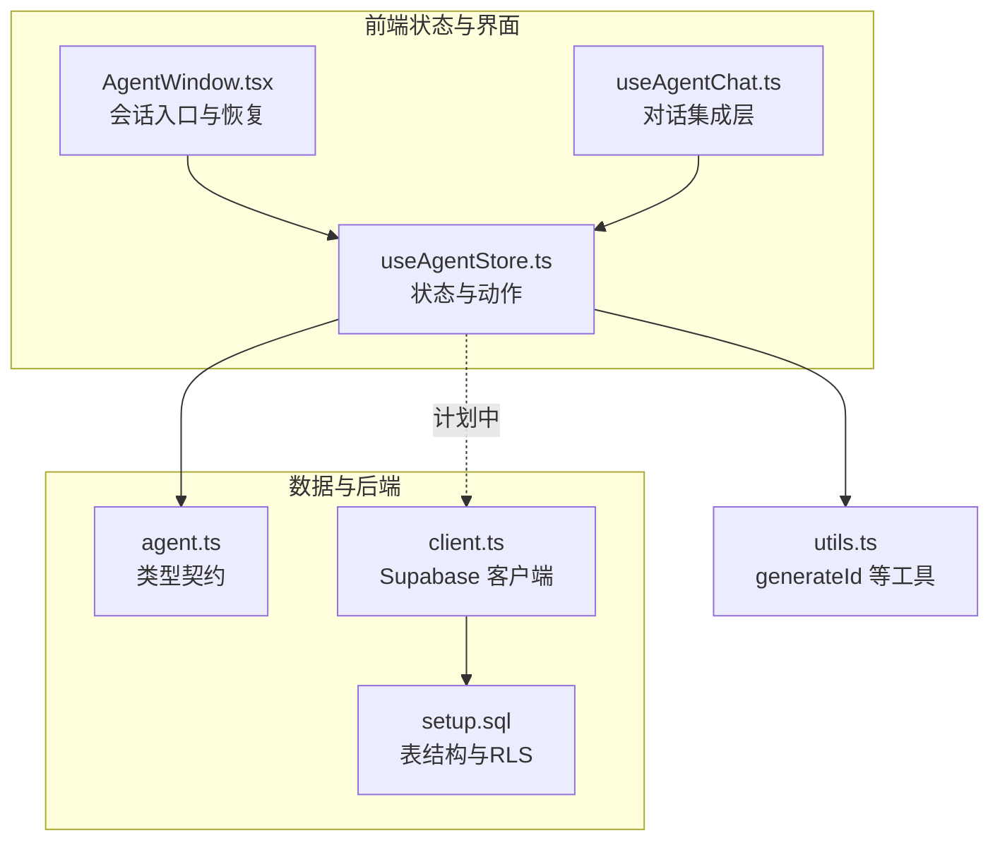
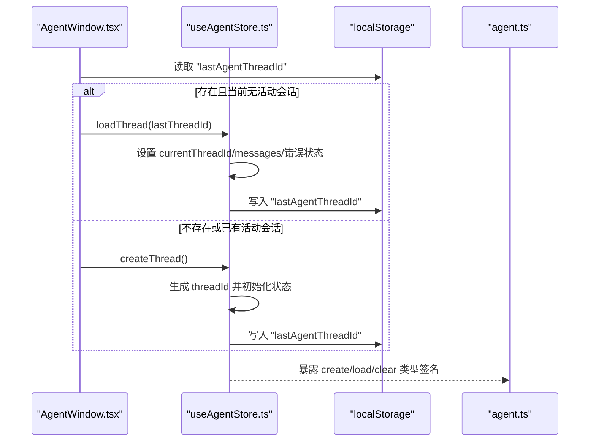
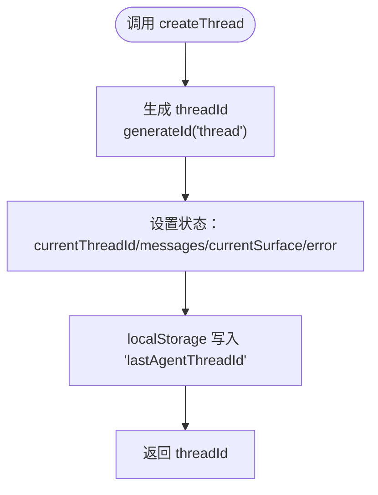
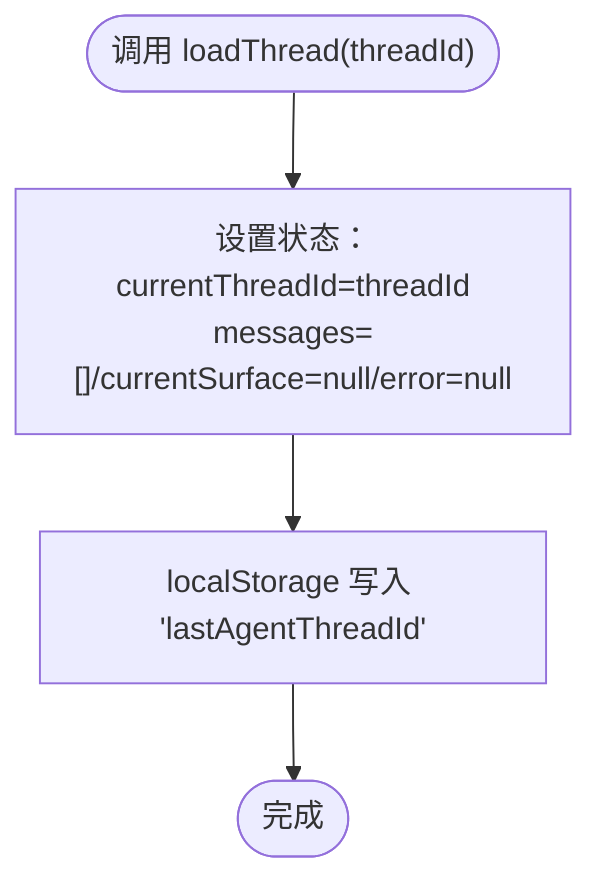
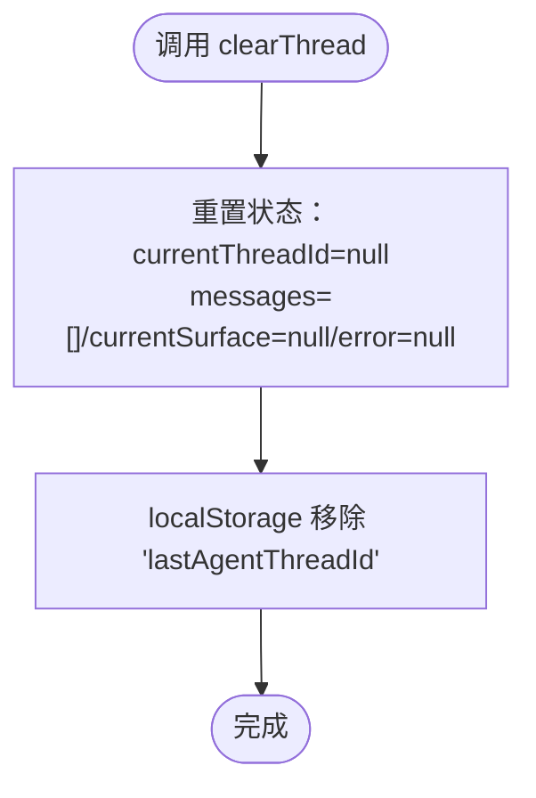
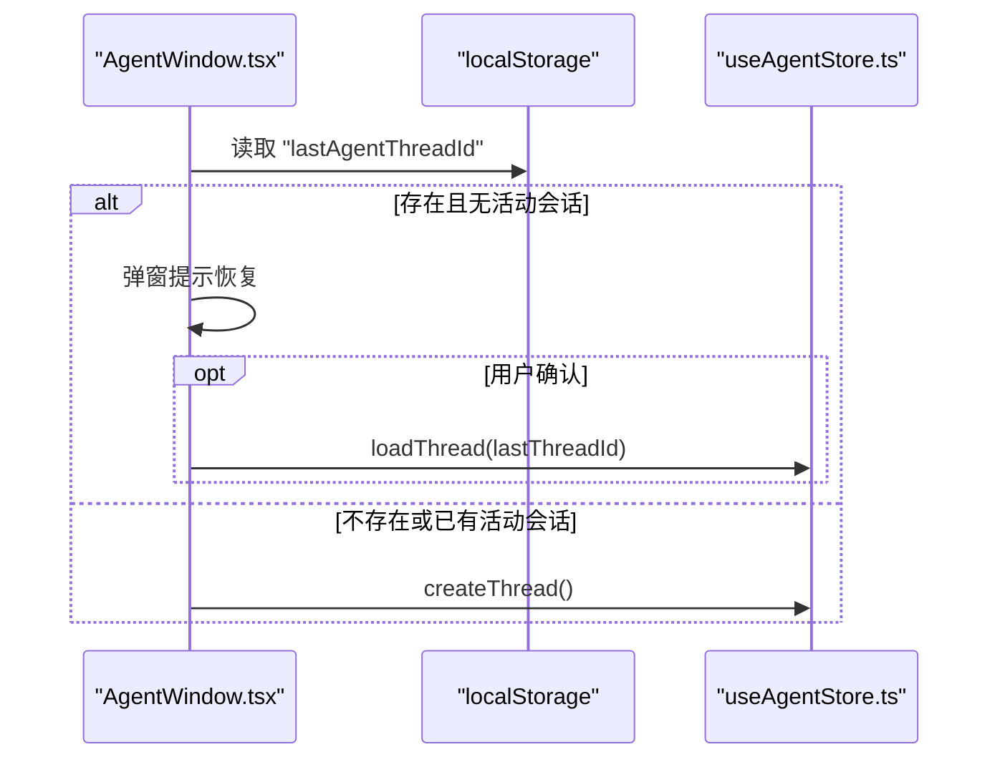
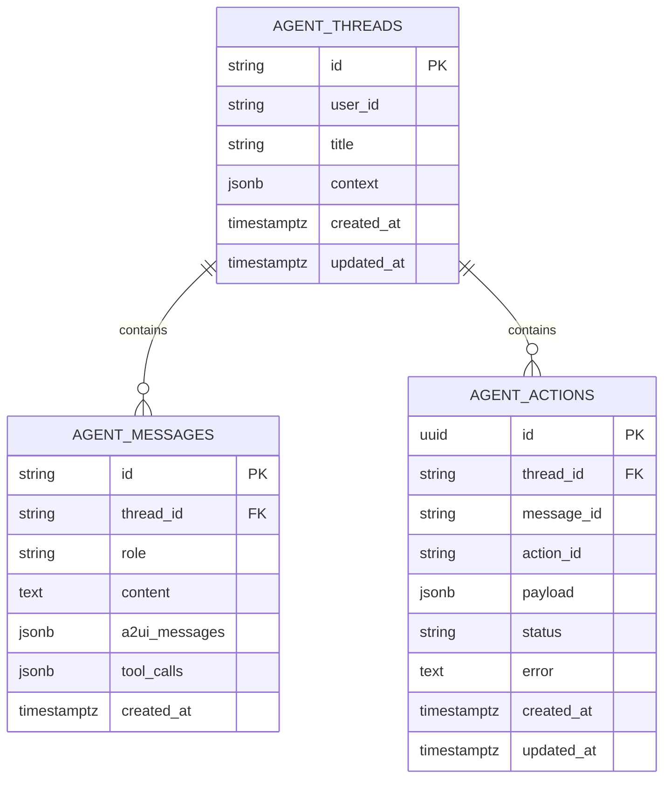
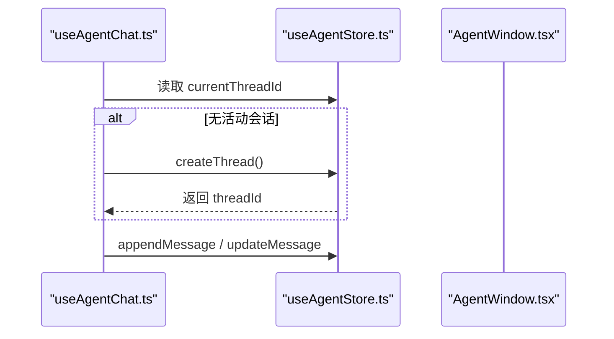
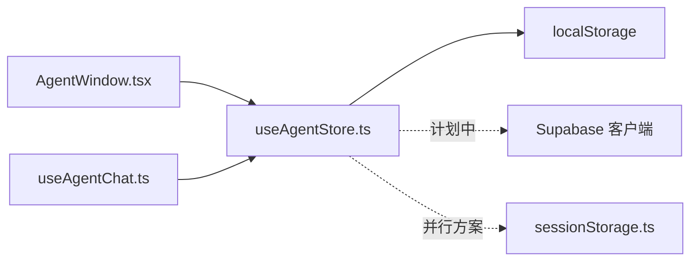

# 会话管理

<cite>
**本文引用的文件**
- [useAgentStore.ts](file://app/src/stores/useAgentStore.ts)
- [AgentWindow.tsx](file://app/src/components/agent/AgentWindow.tsx)
- [useAgentChat.ts](file://app/src/hooks/useAgentChat.ts)
- [agent.ts](file://app/src/types/agent.ts)
- [client.ts](file://app/src/lib/supabase/client.ts)
- [setup.sql](file://app/supabase/setup.sql)
- [utils.ts](file://app/src/components/agent/a2ui/utils.ts)
- [sessionStorage.ts](file://app/src/lib/agent/sessionStorage.ts)
</cite>

## 目录
1. [简介](#简介)
2. [项目结构](#项目结构)
3. [核心组件](#核心组件)
4. [架构总览](#架构总览)
5. [详细组件分析](#详细组件分析)
6. [依赖分析](#依赖分析)
7. [性能考虑](#性能考虑)
8. [故障排查指南](#故障排查指南)
9. [结论](#结论)
10. [附录](#附录)

## 简介
本文件系统性梳理 Agent Store 中的会话管理功能，聚焦 createThread、loadThread、clearThread 三大方法的实现细节与使用方式。内容涵盖：
- threadId 生成机制与命名规范
- 初始状态设置与 UI 即时反馈
- localStorage 持久化策略与“上次会话”恢复流程
- 从 Supabase 加载历史数据的接口设计与当前空状态实现
- 会话清理机制对全局状态与本地存储的重置
- 在组件中调用这些方法的最佳实践与常见问题

## 项目结构
围绕会话管理的关键文件与职责如下：
- stores/useAgentStore.ts：定义 Agent Store 的状态、动作与持久化策略，包含 createThread、loadThread、clearThread 的核心实现
- components/agent/AgentWindow.tsx：会话入口与恢复交互的 UI 容器，负责打开时检查“上次会话”并触发相应动作
- hooks/useAgentChat.ts：与 SSE/工具执行器集成的对话层，依赖 Store 的 createThread 等动作
- types/agent.ts：定义 AgentStore 的类型签名，包括 createThread、loadThread、clearThread 的对外契约
- lib/supabase/client.ts：Supabase 客户端初始化，为后续从 Supabase 加载/保存会话提供基础
- supabase/setup.sql：数据库表结构与 RLS 策略，支撑 agent_threads、agent_messages、agent_actions 的权限控制
- components/agent/a2ui/utils.ts：通用工具函数，包含 generateId，用于生成唯一标识
- lib/agent/sessionStorage.ts：基于 IndexedDB 的会话持久化方案（与 Supabase 并行存在）

**图表来源**
- [useAgentStore.ts:60-115](file://app/src/stores/useAgentStore.ts#L60-L115)
- [AgentWindow.tsx:36-120](file://app/src/components/agent/AgentWindow.tsx#L36-L120)
- [useAgentChat.ts:47-62](file://app/src/hooks/useAgentChat.ts#L47-L62)
- [agent.ts:268-272](file://app/src/types/agent.ts#L268-L272)
- [client.ts:8-33](file://app/src/lib/supabase/client.ts#L8-L33)
- [setup.sql:308-414](file://app/supabase/setup.sql#L308-L414)
- [utils.ts:169-171](file://app/src/components/agent/a2ui/utils.ts#L169-L171)

**章节来源**
- [useAgentStore.ts:60-115](file://app/src/stores/useAgentStore.ts#L60-L115)
- [AgentWindow.tsx:36-120](file://app/src/components/agent/AgentWindow.tsx#L36-L120)
- [useAgentChat.ts:47-62](file://app/src/hooks/useAgentChat.ts#L47-L62)
- [agent.ts:268-272](file://app/src/types/agent.ts#L268-L272)
- [client.ts:8-33](file://app/src/lib/supabase/client.ts#L8-L33)
- [setup.sql:308-414](file://app/supabase/setup.sql#L308-L414)
- [utils.ts:169-171](file://app/src/components/agent/a2ui/utils.ts#L169-L171)

## 核心组件
本节聚焦会话管理的三个核心动作及其行为特征。

- createThread：生成新的 threadId，初始化空会话状态，并将最新 threadId 写入 localStorage，便于下次自动恢复
- loadThread：接收 threadId，当前实现为空状态（无历史数据），随后同样更新 localStorage
- clearThread：清空当前会话状态，移除 localStorage 中的“上次会话”记录

上述动作均通过 Zustand 的 set/get 访问与更新状态；持久化策略采用 persist 中间件，仅持久化 currentThreadId 与面板开关状态，其余状态不持久化，避免污染本地存储。

**章节来源**
- [useAgentStore.ts:68-115](file://app/src/stores/useAgentStore.ts#L68-L115)
- [agent.ts:268-272](file://app/src/types/agent.ts#L268-L272)

## 架构总览
会话管理在整体架构中的位置如下：
- UI 层（AgentWindow）在窗口打开时检查 localStorage 中的“上次会话”，决定是否弹窗提示或直接创建新会话
- Store 层（useAgentStore）提供 create/load/clear 三类动作，负责状态与本地存储的同步
- 类型层（types/agent.ts）约束动作签名，保证调用方契约一致
- 数据层（Supabase）为未来加载/保存会话历史提供基础设施（当前为占位实现）

**图表来源**
- [AgentWindow.tsx:71-83](file://app/src/components/agent/AgentWindow.tsx#L71-L83)
- [useAgentStore.ts:68-115](file://app/src/stores/useAgentStore.ts#L68-L115)
- [agent.ts:268-272](file://app/src/types/agent.ts#L268-L272)

## 详细组件分析

### createThread：创建新会话
- threadId 生成：使用 generateId('thread') 生成带前缀的唯一标识，确保在多会话场景下的可区分性
- 初始状态：设置 currentThreadId、清空 messages、currentSurface、error，保证 UI 从干净状态开始
- 持久化：将最新 threadId 写入 localStorage 的 "lastAgentThreadId"，供恢复流程使用
- 返回值：返回新生成的 threadId，便于上层逻辑继续使用

**图表来源**
- [useAgentStore.ts:71-84](file://app/src/stores/useAgentStore.ts#L71-L84)
- [utils.ts:169-171](file://app/src/components/agent/a2ui/utils.ts#L169-L171)

**章节来源**
- [useAgentStore.ts:71-84](file://app/src/stores/useAgentStore.ts#L71-L84)
- [utils.ts:169-171](file://app/src/components/agent/a2ui/utils.ts#L169-L171)

### loadThread：加载已有会话
- 输入参数：threadId（字符串）
- 当前实现：设置 currentThreadId，初始化空状态（messages、currentSurface、error），随后更新 localStorage
- 未来扩展：注释中明确 TODO，计划从 Supabase 加载历史数据（agent_threads、agent_messages、agent_actions）

**图表来源**
- [useAgentStore.ts:90-101](file://app/src/stores/useAgentStore.ts#L90-L101)

**章节来源**
- [useAgentStore.ts:90-101](file://app/src/stores/useAgentStore.ts#L90-L101)

### clearThread：清空当前会话
- 动作：将 currentThreadId 置空，清空 messages、currentSurface、error
- 持久化：移除 localStorage 中的 "lastAgentThreadId"，避免下次自动恢复

**图表来源**
- [useAgentStore.ts:106-115](file://app/src/stores/useAgentStore.ts#L106-L115)

**章节来源**
- [useAgentStore.ts:106-115](file://app/src/stores/useAgentStore.ts#L106-L115)

### 会话恢复流程（UI 触发）
- AgentWindow 在窗口打开时读取 localStorage 的 "lastAgentThreadId"
- 若存在且当前无活动会话，则弹窗提示是否恢复；若无活动会话则直接创建新会话
- 恢复时调用 loadThread，新会话时调用 createThread

**图表来源**
- [AgentWindow.tsx:71-104](file://app/src/components/agent/AgentWindow.tsx#L71-L104)

**章节来源**
- [AgentWindow.tsx:71-104](file://app/src/components/agent/AgentWindow.tsx#L71-L104)

### 与 Supabase 的集成点
- 类型契约：agent.ts 定义了 agent_threads、agent_messages、agent_actions 的数据库行类型，为后续加载/保存提供数据模型
- 权限与安全：setup.sql 中为 agent_messages、agent_actions 设置了基于 agent_threads.user_id 的 RLS 策略，确保数据隔离
- 客户端：client.ts 初始化 Supabase 客户端，为后续从 Supabase 读取/写入会话数据提供基础

**图表来源**
- [agent.ts:313-348](file://app/src/types/agent.ts#L313-L348)
- [setup.sql:308-414](file://app/supabase/setup.sql#L308-L414)

**章节来源**
- [agent.ts:313-348](file://app/src/types/agent.ts#L313-L348)
- [setup.sql:308-414](file://app/supabase/setup.sql#L308-L414)
- [client.ts:8-33](file://app/src/lib/supabase/client.ts#L8-L33)

### 与对话集成层的协作
- useAgentChat 通过 useAgentStore 获取 createThread 等动作，并在发送消息前确保存在活动会话
- 当无活动会话时，调用 createThread 创建新会话，再继续消息发送流程

**图表来源**
- [useAgentChat.ts:57-62](file://app/src/hooks/useAgentChat.ts#L57-L62)
- [useAgentStore.ts:71-84](file://app/src/stores/useAgentStore.ts#L71-L84)

**章节来源**
- [useAgentChat.ts:57-62](file://app/src/hooks/useAgentChat.ts#L57-L62)
- [useAgentStore.ts:71-84](file://app/src/stores/useAgentStore.ts#L71-L84)

## 依赖分析
- 组件耦合
  - AgentWindow 依赖 useAgentStore 的 createThread、loadThread、clearThread 与 getLastThreadId
  - useAgentChat 依赖 useAgentStore 的状态与动作，用于消息发送与状态更新
- 外部依赖
  - localStorage：用于“上次会话”的持久化
  - Supabase：为后续加载/保存会话历史提供基础设施（当前为占位）
  - IndexedDB：另有独立的 sessionStorage.ts 提供会话持久化方案（与 Supabase 并行）

**图表来源**
- [AgentWindow.tsx:46-51](file://app/src/components/agent/AgentWindow.tsx#L46-L51)
- [useAgentChat.ts:55-62](file://app/src/hooks/useAgentChat.ts#L55-L62)
- [useAgentStore.ts:60-115](file://app/src/stores/useAgentStore.ts#L60-L115)
- [sessionStorage.ts:94-116](file://app/src/lib/agent/sessionStorage.ts#L94-L116)

**章节来源**
- [AgentWindow.tsx:46-51](file://app/src/components/agent/AgentWindow.tsx#L46-L51)
- [useAgentChat.ts:55-62](file://app/src/hooks/useAgentChat.ts#L55-L62)
- [useAgentStore.ts:60-115](file://app/src/stores/useAgentStore.ts#L60-L115)
- [sessionStorage.ts:94-116](file://app/src/lib/agent/sessionStorage.ts#L94-L116)

## 性能考虑
- 状态持久化范围：persist 仅持久化 currentThreadId 与面板开关，避免将大体量 messages 写入本地存储，降低 localStorage 压力
- 生成 ID：generateId 使用时间戳与随机串组合，冲突概率极低，满足高并发场景
- UI 即时反馈：create/load/clear 均在内存中快速更新，配合 localStorage 的异步写入，保证交互流畅
- 后续优化建议（基于现有结构）：
  - 将 messages 分页或压缩后再持久化（当前已存在 IndexedDB 方案）
  - 在 loadThread 中引入 Supabase 查询时增加缓存与去抖，避免重复请求

[本节为通用指导，不直接分析具体文件]

## 故障排查指南
- 无活动会话报错
  - 现象：调用 sendMessage 时抛出“无活动会话”
  - 原因：currentThreadId 为空
  - 处理：在发送消息前调用 createThread 或 loadThread，确保存在活动会话
  - 参考
    - [useAgentStore.ts:122-127](file://app/src/stores/useAgentStore.ts#L122-L127)
    - [useAgentChat.ts:122-127](file://app/src/hooks/useAgentChat.ts#L122-L127)

- “上次会话”未恢复
  - 现象：打开窗口未出现恢复提示或自动创建新会话
  - 排查：
    - 检查 localStorage 中是否存在 "lastAgentThreadId"
    - 确认当前无活动会话（currentThreadId 非空时不会触发恢复）
  - 参考
    - [AgentWindow.tsx:71-83](file://app/src/components/agent/AgentWindow.tsx#L71-L83)
    - [useAgentStore.ts:472-481](file://app/src/stores/useAgentStore.ts#L472-L481)

- 清空会话后仍显示历史
  - 现象：调用 clearThread 后刷新页面仍显示历史
  - 原因：clearThread 仅清空内存状态并移除 localStorage 的“上次会话”，不涉及 Supabase 历史
  - 处理：当前实现为空状态，未来需在 loadThread 中从 Supabase 加载真实历史
  - 参考
    - [useAgentStore.ts:106-115](file://app/src/stores/useAgentStore.ts#L106-L115)
    - [useAgentStore.ts:90-101](file://app/src/stores/useAgentStore.ts#L90-L101)

**章节来源**
- [useAgentStore.ts:122-127](file://app/src/stores/useAgentStore.ts#L122-L127)
- [useAgentChat.ts:122-127](file://app/src/hooks/useAgentChat.ts#L122-L127)
- [AgentWindow.tsx:71-83](file://app/src/components/agent/AgentWindow.tsx#L71-L83)
- [useAgentStore.ts:472-481](file://app/src/stores/useAgentStore.ts#L472-L481)
- [useAgentStore.ts:106-115](file://app/src/stores/useAgentStore.ts#L106-L115)
- [useAgentStore.ts:90-101](file://app/src/stores/useAgentStore.ts#L90-L101)

## 结论
- 当前实现以 localStorage 为核心，提供“上次会话”恢复与基本会话生命周期管理
- createThread、loadThread、clearThread 三者协同，形成完整的会话创建、加载与清理闭环
- Supabase 集成处于占位阶段，后续应完善 loadThread 的历史数据加载与消息回放
- 建议在 UI 层统一入口（如 AgentWindow）处理“上次会话”检测与恢复，避免分散逻辑

[本节为总结性内容，不直接分析具体文件]

## 附录

### 使用示例（在组件中调用）
- 在窗口打开时检查并恢复上次会话
  - 参考
    - [AgentWindow.tsx:71-104](file://app/src/components/agent/AgentWindow.tsx#L71-L104)
- 发送消息前确保有活动会话
  - 参考
    - [useAgentChat.ts:57-62](file://app/src/hooks/useAgentChat.ts#L57-L62)
    - [useAgentChat.ts:122-127](file://app/src/hooks/useAgentChat.ts#L122-L127)

### 最佳实践
- 在 UI 入口统一处理“上次会话”检测与恢复，避免在多个组件中重复逻辑
- 保持 create/load/clear 三者的幂等性与一致性，确保状态与本地存储同步
- 未来实现 loadThread 时，优先从 Supabase 加载，再回填到 Store，最后更新 localStorage

### 常见问题与解决方案
- 会话未恢复：确认 localStorage 中存在 "lastAgentThreadId" 且当前无活动会话
- 清空会话无效：clearThread 不会删除 Supabase 历史，需在 loadThread 中实现加载逻辑

**章节来源**
- [AgentWindow.tsx:71-104](file://app/src/components/agent/AgentWindow.tsx#L71-L104)
- [useAgentChat.ts:57-62](file://app/src/hooks/useAgentChat.ts#L57-L62)
- [useAgentChat.ts:122-127](file://app/src/hooks/useAgentChat.ts#L122-L127)