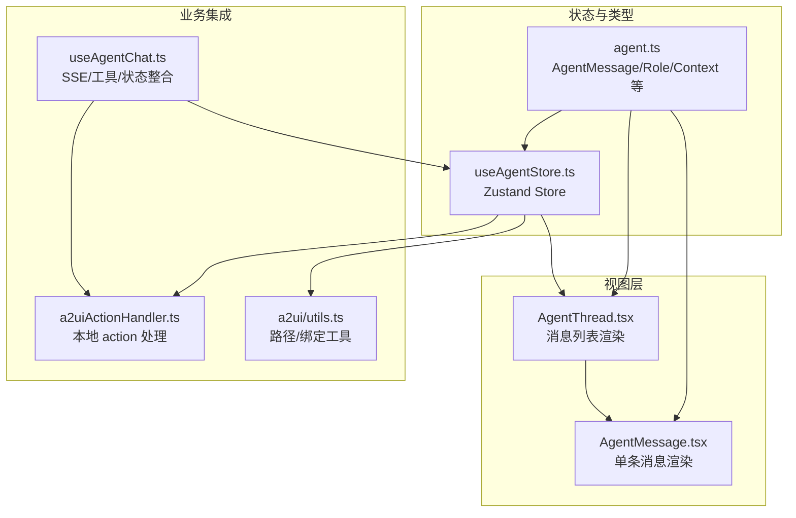
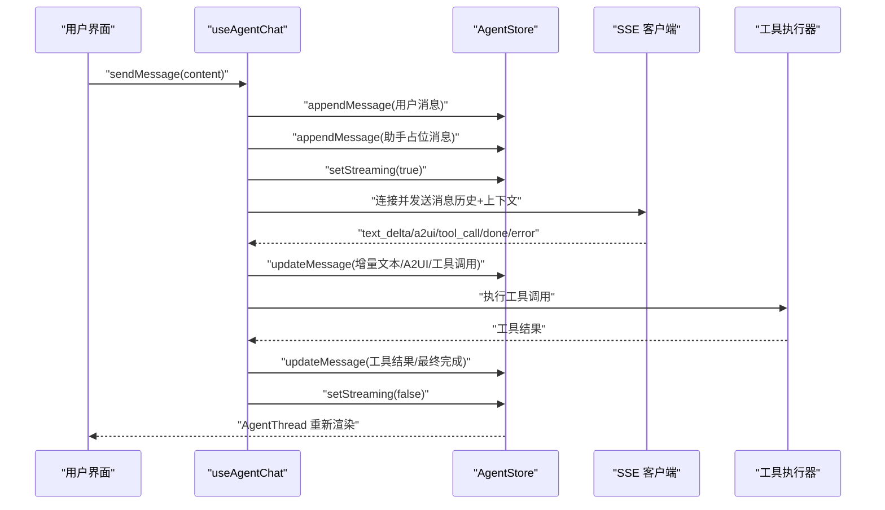
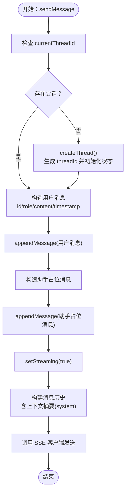
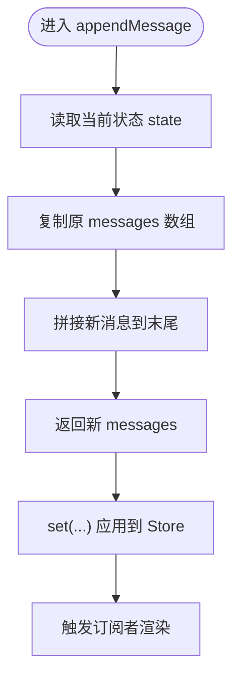
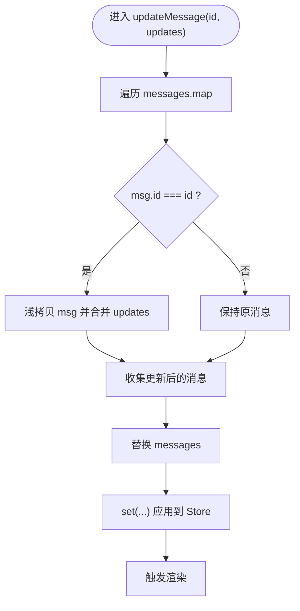
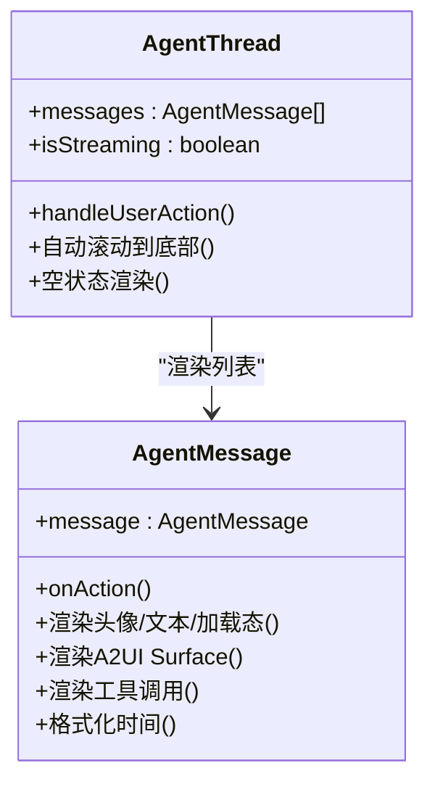
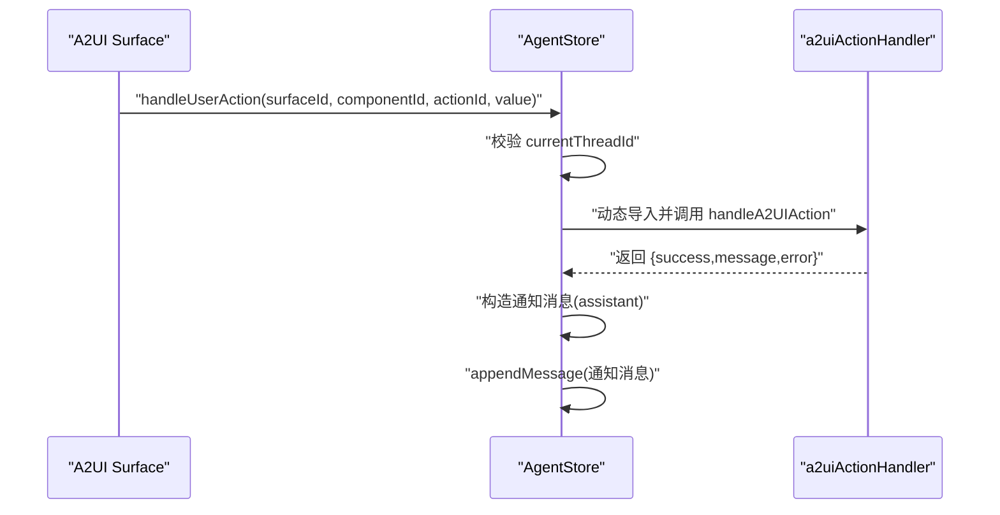
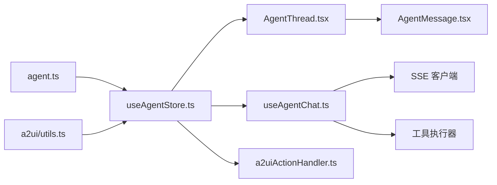

# 消息管理

<cite>
**本文引用的文件**
- [useAgentStore.ts](file://app/src/stores/useAgentStore.ts)
- [agent.ts](file://app/src/types/agent.ts)
- [AgentMessage.tsx](file://app/src/components/agent/AgentMessage.tsx)
- [AgentThread.tsx](file://app/src/components/agent/AgentThread.tsx)
- [useAgentChat.ts](file://app/src/hooks/useAgentChat.ts)
- [a2uiActionHandler.ts](file://app/src/lib/agent/a2uiActionHandler.ts)
- [utils.ts](file://app/src/components/agent/a2ui/utils.ts)
</cite>

## 目录
1. [简介](#简介)
2. [项目结构](#项目结构)
3. [核心组件](#核心组件)
4. [架构总览](#架构总览)
5. [详细组件分析](#详细组件分析)
6. [依赖关系分析](#依赖关系分析)
7. [性能考量](#性能考量)
8. [故障排查指南](#故障排查指南)
9. [结论](#结论)
10. [附录](#附录)

## 简介
本文件系统性阐述 Agent Store 中的消息管理实现，覆盖会话生命周期、消息发送、消息追加与消息更新三大核心能力。重点说明：
- sendMessage 的完整流程：用户消息创建、threadId 验证、消息追加、上下文注入与后续扩展点。
- appendMessage 的不可变更新策略：通过浅拷贝原数组并在末尾拼接新消息，确保状态更新可预测且高效。
- updateMessage 的按 ID 更新机制：基于消息 id 的映射更新，仅替换匹配项，其余保持不变，保证局部更新的确定性。

同时给出在 Agent 组件中使用这些方法的最佳实践与常见问题排查建议。

## 项目结构
围绕消息管理的关键文件与职责如下：
- 状态与动作定义：AgentStore（Zustand）集中管理会话、消息、Surface、Portal、UI 状态与动作。
- 类型定义：AgentMessage、AgentMessageRole、AgentContext 等类型约束消息结构与角色。
- 视图渲染：AgentThread 渲染消息列表；AgentMessage 渲染单条消息气泡与 A2UI Surface。
- 业务集成：useAgentChat 将 Store、SSE、工具执行器整合，驱动消息流式更新与工具调用结果回填。
- A2UI 交互：a2uiActionHandler 处理组件触发的本地 action，统一返回结果并可转化为通知消息。

图表来源
- [useAgentStore.ts:1-343](file://app/src/stores/useAgentStore.ts#L1-L343)
- [agent.ts:88-105](file://app/src/types/agent.ts#L88-L105)
- [AgentThread.tsx:19-55](file://app/src/components/agent/AgentThread.tsx#L19-L55)
- [AgentMessage.tsx:24-148](file://app/src/components/agent/AgentMessage.tsx#L24-L148)
- [useAgentChat.ts:47-377](file://app/src/hooks/useAgentChat.ts#L47-L377)
- [a2uiActionHandler.ts:26-76](file://app/src/lib/agent/a2uiActionHandler.ts#L26-L76)
- [utils.ts:169-171](file://app/src/components/agent/a2ui/utils.ts#L169-L171)

章节来源
- [useAgentStore.ts:1-343](file://app/src/stores/useAgentStore.ts#L1-L343)
- [agent.ts:88-105](file://app/src/types/agent.ts#L88-L105)
- [AgentThread.tsx:19-55](file://app/src/components/agent/AgentThread.tsx#L19-L55)
- [AgentMessage.tsx:24-148](file://app/src/components/agent/AgentMessage.tsx#L24-L148)
- [useAgentChat.ts:47-377](file://app/src/hooks/useAgentChat.ts#L47-L377)
- [a2uiActionHandler.ts:26-76](file://app/src/lib/agent/a2uiActionHandler.ts#L26-L76)
- [utils.ts:169-171](file://app/src/components/agent/a2ui/utils.ts#L169-L171)

## 核心组件
- AgentStore（Zustand）
  - 会话管理：createThread、loadThread、clearThread
  - 消息管理：sendMessage、appendMessage、updateMessage
  - Surface/Portal 管理：updateSurface、updateDataModel、openPortal、updatePortalDataModel、clearSurface、closePortal
  - 状态与上下文：setStreaming、setError、togglePanel、setContext
  - 用户操作：handleUserAction（结合 A2UI Action Handler）

- 类型系统
  - AgentMessage：包含 id、role、content、timestamp、a2uiMessages、toolCalls、isStreaming 等字段
  - AgentMessageRole：user、assistant、system、tool
  - AgentContext：当前页面、选中资源、视图上下文等

- 视图组件
  - AgentThread：渲染消息列表，自动滚动到底部，空状态时提供上下文感知建议
  - AgentMessage：渲染用户/助手/系统消息，支持流式输出光标、A2UI Surface、工具调用状态与时间戳

- 业务集成
  - useAgentChat：封装 SSE、工具执行器与 Store 的交互，负责消息历史构建、上下文摘要注入、流式增量更新、工具调用结果回填与错误处理
  - a2uiActionHandler：处理 A2UI 组件触发的本地 action，返回统一结果，便于转化为通知消息

章节来源
- [useAgentStore.ts:60-343](file://app/src/stores/useAgentStore.ts#L60-L343)
- [agent.ts:88-105](file://app/src/types/agent.ts#L88-L105)
- [AgentThread.tsx:19-55](file://app/src/components/agent/AgentThread.tsx#L19-L55)
- [AgentMessage.tsx:24-148](file://app/src/components/agent/AgentMessage.tsx#L24-L148)
- [useAgentChat.ts:47-377](file://app/src/hooks/useAgentChat.ts#L47-L377)
- [a2uiActionHandler.ts:26-76](file://app/src/lib/agent/a2uiActionHandler.ts#L26-L76)

## 架构总览
消息管理贯穿“状态层（Store）—集成层（useAgentChat）—视图层（AgentThread/AgentMessage）”三段式架构。Store 负责不可变状态更新与动作定义；useAgentChat 负责业务编排与事件驱动；视图层负责渲染与交互反馈。

图表来源
- [useAgentChat.ts:299-367](file://app/src/hooks/useAgentChat.ts#L299-L367)
- [useAgentStore.ts:119-164](file://app/src/stores/useAgentStore.ts#L119-L164)
- [AgentThread.tsx:19-55](file://app/src/components/agent/AgentThread.tsx#L19-L55)

## 详细组件分析

### sendMessage：消息发送流程
sendMessage 是对外暴露的入口，负责：
- 校验当前会话（threadId）是否存在，不存在则创建新会话
- 构造用户消息并立即追加到消息列表
- 通过 Store 的上下文 context 与消息历史参与后续的 SSE 请求（当前为占位实现，实际网络层在 AgentService/SSE 客户端中）

图表来源
- [useAgentStore.ts:119-146](file://app/src/stores/useAgentStore.ts#L119-L146)
- [useAgentChat.ts:299-367](file://app/src/hooks/useAgentChat.ts#L299-L367)

章节来源
- [useAgentStore.ts:119-146](file://app/src/stores/useAgentStore.ts#L119-L146)
- [useAgentChat.ts:299-367](file://app/src/hooks/useAgentChat.ts#L299-L367)

### appendMessage：不可变更新模式
appendMessage 采用不可变更新策略：
- 通过 set(state => ...) 返回一个新对象，其中 messages 为原数组的浅拷贝副本，并在末尾拼接新消息
- 该模式确保：
  - 状态更新可预测，便于调试与时间旅行
  - React/Zustand 能正确识别变更并触发渲染
  - 与 useAgentChat 的流式增量更新配合良好

图表来源
- [useAgentStore.ts:148-155](file://app/src/stores/useAgentStore.ts#L148-L155)

章节来源
- [useAgentStore.ts:148-155](file://app/src/stores/useAgentStore.ts#L148-L155)

### updateMessage：按 ID 更新消息
updateMessage 通过消息 id 精准定位并更新：
- 遍历 messages，对匹配 id 的消息进行浅拷贝并合并 updates
- 其余消息保持不变，实现局部不可变更新
- 在 useAgentChat 中被广泛用于：
  - 流式文本增量（text_delta）：累计内容并标记 isStreaming
  - A2UI 消息累积：将 beginRendering/surfaceUpdate/deleteSurface 等消息加入 a2uiMessages
  - 工具调用：记录 toolCalls 列表与结果
  - 完成/错误：停止流式、标记 isStreaming=false，并在必要时补充错误提示

图表来源
- [useAgentStore.ts:157-164](file://app/src/stores/useAgentStore.ts#L157-L164)
- [useAgentChat.ts:97-132](file://app/src/hooks/useAgentChat.ts#L97-L132)
- [useAgentChat.ts:137-152](file://app/src/hooks/useAgentChat.ts#L137-L152)
- [useAgentChat.ts:157-219](file://app/src/hooks/useAgentChat.ts#L157-L219)

章节来源
- [useAgentStore.ts:157-164](file://app/src/stores/useAgentStore.ts#L157-L164)
- [useAgentChat.ts:97-132](file://app/src/hooks/useAgentChat.ts#L97-L132)
- [useAgentChat.ts:137-152](file://app/src/hooks/useAgentChat.ts#L137-L152)
- [useAgentChat.ts:157-219](file://app/src/hooks/useAgentChat.ts#L157-L219)

### 视图渲染：AgentThread 与 AgentMessage
- AgentThread
  - 订阅 messages 与 isStreaming，自动滚动到底部
  - 空状态时渲染上下文感知的智能建议按钮，建议通过 useAgentChat.sendMessage 触发
- AgentMessage
  - 根据 role 渲染不同样式与图标
  - 支持流式输出光标动画与“思考中”占位
  - 渲染 A2UI Surface（仅 beginRendering 且 component 存在）
  - 展示工具调用名称与结果状态
  - 显示时间戳

图表来源
- [AgentThread.tsx:19-55](file://app/src/components/agent/AgentThread.tsx#L19-L55)
- [AgentMessage.tsx:24-148](file://app/src/components/agent/AgentMessage.tsx#L24-L148)

章节来源
- [AgentThread.tsx:19-55](file://app/src/components/agent/AgentThread.tsx#L19-L55)
- [AgentMessage.tsx:24-148](file://app/src/components/agent/AgentMessage.tsx#L24-L148)

### A2UI 交互与通知消息
- 用户在 A2UI Surface 上触发 action 时，AgentStore.handleUserAction 会：
  - 校验当前会话是否存在
  - 动态导入并调用 a2uiActionHandler 处理本地 action
  - 将结果转换为助手通知消息（含成功/失败提示），并通过 appendMessage 追加到消息列表

图表来源
- [useAgentStore.ts:296-332](file://app/src/stores/useAgentStore.ts#L296-L332)
- [a2uiActionHandler.ts:26-76](file://app/src/lib/agent/a2uiActionHandler.ts#L26-L76)

章节来源
- [useAgentStore.ts:296-332](file://app/src/stores/useAgentStore.ts#L296-L332)
- [a2uiActionHandler.ts:26-76](file://app/src/lib/agent/a2uiActionHandler.ts#L26-L76)

## 依赖关系分析
- Store 依赖类型定义（AgentMessage/Role/Context）与 A2UI 工具（路径/绑定）
- useAgentChat 依赖 Store 的动作与状态、SSE 客户端、工具执行器、上下文生成器
- 视图层依赖 Store 的状态与动作，实现渲染与交互
- A2UI 交互链路依赖 a2uiActionHandler 与 Store 的 handleUserAction

图表来源
- [agent.ts:88-105](file://app/src/types/agent.ts#L88-L105)
- [useAgentStore.ts:17-24](file://app/src/stores/useAgentStore.ts#L17-L24)
- [utils.ts:169-171](file://app/src/components/agent/a2ui/utils.ts#L169-L171)
- [AgentThread.tsx:10-14](file://app/src/components/agent/AgentThread.tsx#L10-L14)
- [AgentMessage.tsx:10-12](file://app/src/components/agent/AgentMessage.tsx#L10-L12)
- [useAgentChat.ts:10-15](file://app/src/hooks/useAgentChat.ts#L10-L15)
- [a2uiActionHandler.ts:26-76](file://app/src/lib/agent/a2uiActionHandler.ts#L26-L76)

章节来源
- [agent.ts:88-105](file://app/src/types/agent.ts#L88-L105)
- [useAgentStore.ts:17-24](file://app/src/stores/useAgentStore.ts#L17-L24)
- [utils.ts:169-171](file://app/src/components/agent/a2ui/utils.ts#L169-L171)
- [AgentThread.tsx:10-14](file://app/src/components/agent/AgentThread.tsx#L10-L14)
- [AgentMessage.tsx:10-12](file://app/src/components/agent/AgentMessage.tsx#L10-L12)
- [useAgentChat.ts:10-15](file://app/src/hooks/useAgentChat.ts#L10-L15)
- [a2uiActionHandler.ts:26-76](file://app/src/lib/agent/a2uiActionHandler.ts#L26-L76)

## 性能考量
- 不可变更新：appendMessage 与 updateMessage 均采用不可变更新，避免深层拷贝与大规模重渲染，提升渲染性能与可预测性。
- 按需渲染：AgentThread 仅在 messages 或 isStreaming 变化时滚动与重渲染；AgentMessage 仅渲染必要的子元素（如 A2UI Surface、工具调用）。
- 流式增量：useAgentChat 通过 text_delta 累积内容并局部更新，减少大对象替换带来的性能损耗。
- 事件驱动：SSE 事件按类型分发处理，避免阻塞主线程；工具调用异步执行，完成后回填结果。
- 建议
  - 控制消息数量上限，定期清理历史或分页加载
  - 对长文本与复杂 A2UI 结果进行懒渲染或虚拟化
  - 使用 React.memo 与 shallow 比较优化 AgentMessage 重渲染

## 故障排查指南
- 无活动会话导致发送失败
  - 现象：sendMessage 抛出“无活动会话”错误
  - 处理：先调用 createThread 获取 threadId，再发送消息
  - 参考
    - [useAgentStore.ts:125-127](file://app/src/stores/useAgentStore.ts#L125-L127)
    - [useAgentChat.ts:304-308](file://app/src/hooks/useAgentChat.ts#L304-L308)

- 流式输出卡顿或未更新
  - 现象：助手消息长时间无变化
  - 处理：确认 SSE 事件到达并触发 updateMessage；检查 isStreaming 标志与错误状态
  - 参考
    - [useAgentChat.ts:97-109](file://app/src/hooks/useAgentChat.ts#L97-L109)
    - [useAgentChat.ts:157-219](file://app/src/hooks/useAgentChat.ts#L157-L219)

- A2UI 消息未渲染
  - 现象：消息中包含 a2uiMessages，但界面未显示
  - 处理：仅 beginRendering 且 component 存在时才渲染；检查 renderTarget 与 Portal/Surface 切换
  - 参考
    - [AgentMessage.tsx:87-113](file://app/src/components/agent/AgentMessage.tsx#L87-L113)
    - [useAgentStore.ts:368-459](file://app/src/stores/useAgentStore.ts#L368-L459)

- 工具调用结果未回填
  - 现象：toolCalls 列表为空或结果缺失
  - 处理：确认 onToolCall 事件已累积并触发 updateMessage；检查工具执行器返回值
  - 参考
    - [useAgentChat.ts:137-152](file://app/src/hooks/useAgentChat.ts#L137-L152)
    - [useAgentChat.ts:172-214](file://app/src/hooks/useAgentChat.ts#L172-L214)

- 用户操作无响应
  - 现象：点击 A2UI 组件无任何反馈
  - 处理：确认 handleUserAction 被调用；检查 a2uiActionHandler 返回值；必要时追加通知消息
  - 参考
    - [useAgentStore.ts:296-332](file://app/src/stores/useAgentStore.ts#L296-L332)
    - [a2uiActionHandler.ts:33-73](file://app/src/lib/agent/a2uiActionHandler.ts#L33-L73)

章节来源
- [useAgentStore.ts:125-127](file://app/src/stores/useAgentStore.ts#L125-L127)
- [useAgentChat.ts:304-308](file://app/src/hooks/useAgentChat.ts#L304-L308)
- [useAgentChat.ts:97-109](file://app/src/hooks/useAgentChat.ts#L97-L109)
- [useAgentChat.ts:157-219](file://app/src/hooks/useAgentChat.ts#L157-L219)
- [AgentMessage.tsx:87-113](file://app/src/components/agent/AgentMessage.tsx#L87-L113)
- [useAgentStore.ts:368-459](file://app/src/stores/useAgentStore.ts#L368-L459)
- [useAgentChat.ts:137-152](file://app/src/hooks/useAgentChat.ts#L137-L152)
- [useAgentChat.ts:172-214](file://app/src/hooks/useAgentChat.ts#L172-L214)
- [useAgentStore.ts:296-332](file://app/src/stores/useAgentStore.ts#L296-L332)
- [a2uiActionHandler.ts:33-73](file://app/src/lib/agent/a2uiActionHandler.ts#L33-L73)

## 结论
Agent Store 的消息管理以不可变更新为核心，结合 useAgentChat 的事件驱动与流式增量更新，实现了高可维护性的对话状态管理。appendMessage 与 updateMessage 分别承担“追加新消息”和“按 ID 局部更新”的职责，二者协同保证了渲染效率与状态一致性。通过 A2UI 交互链路与通知消息机制，系统具备良好的可扩展性与用户体验。

## 附录
- 最佳实践
  - 在发送消息前确保 threadId 存在，必要时先 createThread
  - 使用 appendMessage 追加用户消息与助手占位消息，随后通过 updateMessage 回填增量内容与结果
  - 对于长文本与复杂 A2UI 结果，考虑懒渲染与虚拟化策略
  - 严格区分 role 与消息类型，避免将系统错误混入用户可见内容
  - 使用 A2UI 工具函数（路径/绑定）进行数据模型更新，保持不可变更新风格