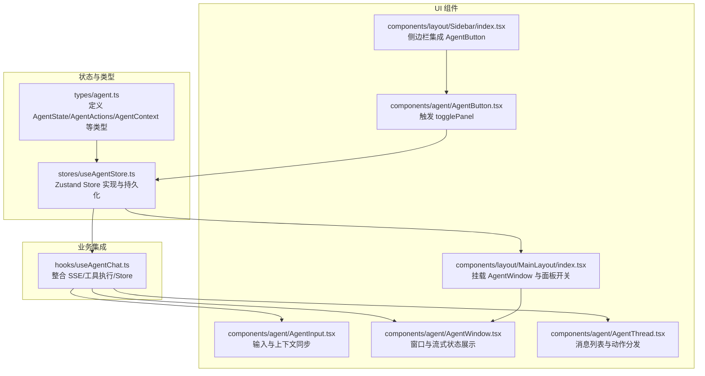
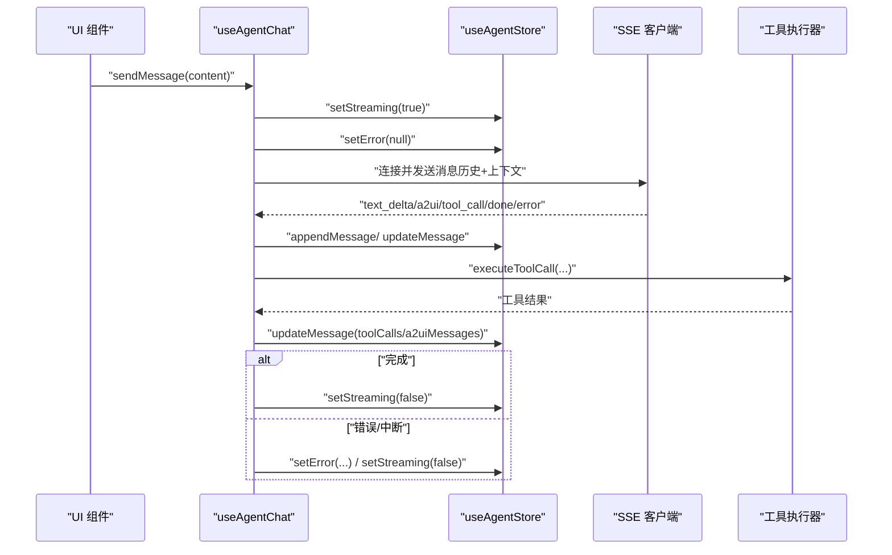
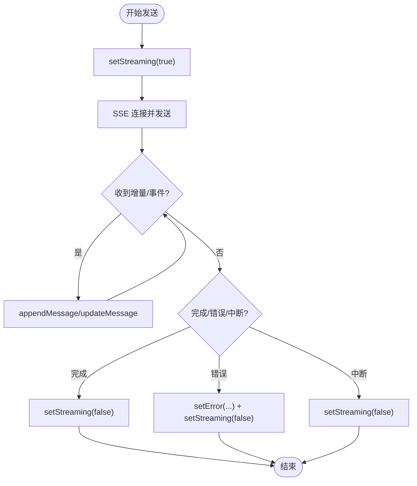
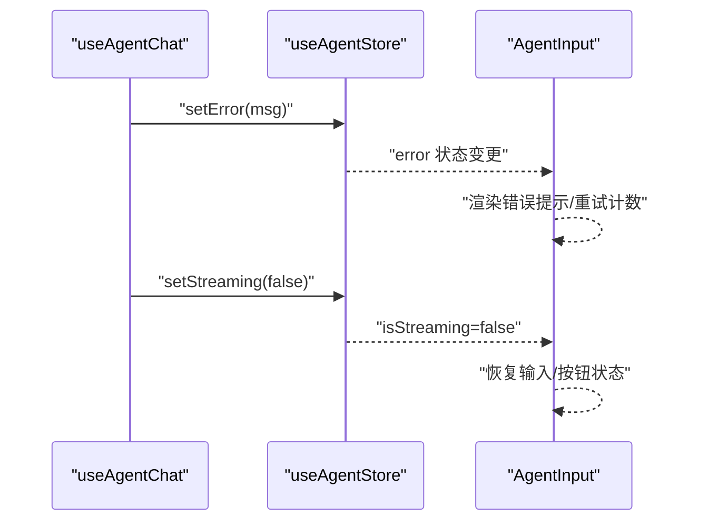
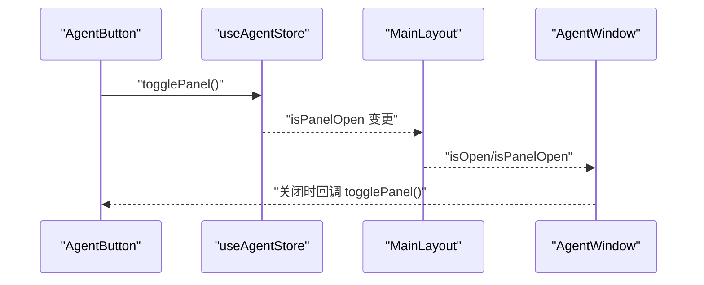
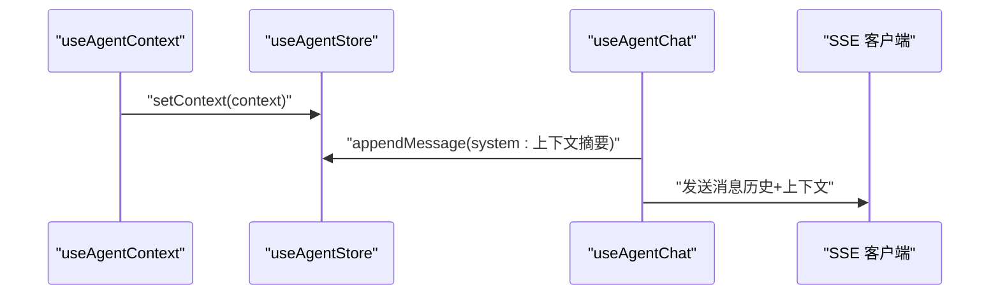
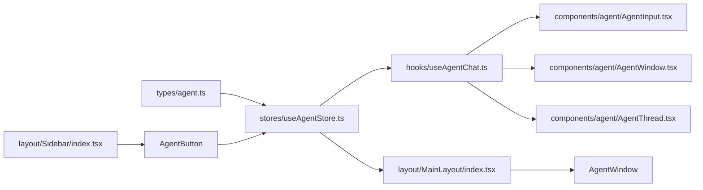

# 状态管理

<cite>
**本文引用的文件**
- [useAgentStore.ts](file://app/src/stores/useAgentStore.ts)
- [agent.ts](file://app/src/types/agent.ts)
- [useAgentChat.ts](file://app/src/hooks/useAgentChat.ts)
- [AgentInput.tsx](file://app/src/components/agent/AgentInput.tsx)
- [AgentWindow.tsx](file://app/src/components/agent/AgentWindow.tsx)
- [AgentThread.tsx](file://app/src/components/agent/AgentThread.tsx)
- [index.tsx](file://app/src/components/layout/MainLayout/index.tsx)
- [index.tsx](file://app/src/components/layout/Sidebar/index.tsx)
- [AgentButton.tsx](file://app/src/components/agent/AgentButton.tsx)
</cite>

## 目录
1. [简介](#简介)
2. [项目结构](#项目结构)
3. [核心组件](#核心组件)
4. [架构总览](#架构总览)
5. [详细组件分析](#详细组件分析)
6. [依赖关系分析](#依赖关系分析)
7. [性能考量](#性能考量)
8. [故障排查指南](#故障排查指南)
9. [结论](#结论)
10. [附录](#附录)

## 简介
本章节聚焦于 Agent Store 的状态管理功能，系统性梳理 setStreaming、setError、togglePanel、setContext 等关键方法的职责、实现与使用方式，并结合流式输出、错误状态、面板显示与上下文传递四个维度，给出可视化流程与时序图，帮助开发者在组件中正确使用这些状态管理方法，并掌握状态同步与副作用处理的最佳实践。

## 项目结构
围绕 Agent Store 的状态管理，相关代码分布在以下模块：
- 状态定义与 Store：stores/useAgentStore.ts、types/agent.ts
- 业务集成层：hooks/useAgentChat.ts
- UI 组件：components/agent/*、components/layout/*

**图表来源**
- [useAgentStore.ts:1-482](file://app/src/stores/useAgentStore.ts#L1-L482)
- [agent.ts:222-306](file://app/src/types/agent.ts#L222-L306)
- [useAgentChat.ts:47-380](file://app/src/hooks/useAgentChat.ts#L47-L380)
- [AgentInput.tsx:34-211](file://app/src/components/agent/AgentInput.tsx#L34-L211)
- [AgentWindow.tsx:36-243](file://app/src/components/agent/AgentWindow.tsx#L36-L243)
- [AgentThread.tsx:19-183](file://app/src/components/agent/AgentThread.tsx#L19-L183)
- [index.tsx:56-141](file://app/src/components/layout/MainLayout/index.tsx#L56-L141)
- [index.tsx:31-170](file://app/src/components/layout/Sidebar/index.tsx#L31-L170)
- [AgentButton.tsx:22-89](file://app/src/components/agent/AgentButton.tsx#L22-L89)

**章节来源**
- [useAgentStore.ts:1-482](file://app/src/stores/useAgentStore.ts#L1-L482)
- [agent.ts:222-306](file://app/src/types/agent.ts#L222-L306)

## 核心组件
本节对 Agent Store 的四大状态管理方法进行深入解析：setStreaming、setError、togglePanel、setContext。

- setStreaming
  - 作用：控制 AI 响应的流式渲染状态，影响 UI 的“思考中/在线”提示与输入禁用。
  - 实现：原子状态更新，简单赋值。
  - 使用：在发送消息前开启，在 SSE 完成/错误/中断后关闭。
- setError
  - 作用：记录并展示错误信息，配合重试计数与 UI 提示。
  - 实现：原子状态更新，支持置空。
  - 使用：SSE 错误事件或异常时设置；消息完成后清除。
- togglePanel
  - 作用：切换 Agent 窗口的显示/隐藏。
  - 实现：取反 isPanelOpen。
  - 使用：侧边栏按钮、主布局挂载点处触发。
- setContext
  - 作用：将当前应用上下文写入 Store，供 AI 会话携带。
  - 实现：原子状态更新。
  - 使用：useAgentContext 同步钩子中自动写入。

**章节来源**
- [useAgentStore.ts:263-289](file://app/src/stores/useAgentStore.ts#L263-L289)
- [useAgentChat.ts:55-62](file://app/src/hooks/useAgentChat.ts#L55-L62)
- [AgentInput.tsx:41-58](file://app/src/components/agent/AgentInput.tsx#L41-L58)
- [AgentButton.tsx:22-29](file://app/src/components/agent/AgentButton.tsx#L22-L29)
- [index.tsx:69-72](file://app/src/components/layout/MainLayout/index.tsx#L69-L72)

## 架构总览
Agent Store 采用 Zustand + persist 的组合，将对话、Surface/Portal、UI 状态与上下文集中管理。业务层通过 useAgentChat 将 SSE 事件、工具执行与 Store 状态打通，UI 层通过多个组件订阅 Store 状态并触发相应动作。

**图表来源**
- [useAgentChat.ts:299-377](file://app/src/hooks/useAgentChat.ts#L299-L377)
- [useAgentStore.ts:263-289](file://app/src/stores/useAgentStore.ts#L263-L289)

**章节来源**
- [useAgentChat.ts:47-380](file://app/src/hooks/useAgentChat.ts#L47-L380)
- [useAgentStore.ts:60-343](file://app/src/stores/useAgentStore.ts#L60-L343)

## 详细组件分析

### 流式输出状态管理（setStreaming）
- 功能要点
  - 在发送消息前开启 isStreaming，阻止重复提交与输入交互。
  - 在 SSE 完成、错误、中断三种分支统一关闭 isStreaming。
  - UI 层（AgentWindow）根据 isStreaming 更新状态文案与交互。
- 关键路径
  - 发送消息：useAgentChat.sendMessage -> setStreaming(true) -> SSE 连接。
  - 结束阶段：handleDone/handleError/handleInterrupted -> setStreaming(false)。
- UI 响应
  - AgentWindow 标题栏显示“思考中/在线”，输入区禁用/启用。
  - AgentInput 根据 isStreaming 切换发送/中断按钮。

**图表来源**
- [useAgentChat.ts:299-377](file://app/src/hooks/useAgentChat.ts#L299-L377)
- [AgentWindow.tsx:169-173](file://app/src/components/agent/AgentWindow.tsx#L169-L173)
- [AgentInput.tsx:173-194](file://app/src/components/agent/AgentInput.tsx#L173-L194)

**章节来源**
- [useAgentChat.ts:55-62](file://app/src/hooks/useAgentChat.ts#L55-L62)
- [useAgentChat.ts:214-258](file://app/src/hooks/useAgentChat.ts#L214-L258)
- [AgentWindow.tsx:47-51](file://app/src/components/agent/AgentWindow.tsx#L47-L51)

### 错误状态管理（setError）
- 功能要点
  - 在错误事件中设置错误信息与重试计数，UI 层据此展示提示。
  - 在消息完成或中断后清除错误状态。
- 关键路径
  - handleError -> setError(...) -> setStreaming(false)。
  - UI 层 AgentInput 根据 error.retryCount 与 error.message 展示不同提示。
- 最佳实践
  - 错误信息应包含可读性高的 message 字段。
  - 成功完成或用户主动中断后务必清除错误。

**图表来源**
- [useAgentChat.ts:224-240](file://app/src/hooks/useAgentChat.ts#L224-L240)
- [AgentInput.tsx:197-206](file://app/src/components/agent/AgentInput.tsx#L197-L206)

**章节来源**
- [useAgentChat.ts:224-240](file://app/src/hooks/useAgentChat.ts#L224-L240)
- [AgentInput.tsx:39-42](file://app/src/components/agent/AgentInput.tsx#L39-L42)

### 面板状态管理（togglePanel）
- 功能要点
  - 切换 isPanelOpen 控制 Agent 窗口显示/隐藏。
  - 主布局 MainLayout 将 isPanelOpen 与 togglePanel 传入 AgentWindow。
  - 侧边栏 Sidebar 中的 AgentButton 也调用 togglePanel。
- 关键路径
  - AgentButton.onClick -> togglePanel -> isPanelOpen 反转。
  - MainLayout 读取 isPanelOpen 并决定是否渲染 AgentWindow。
- 最佳实践
  - 面板状态应与用户习惯一致（如移动端默认隐藏，桌面端可常驻）。
  - 与持久化策略结合，确保刷新后状态一致。

**图表来源**
- [AgentButton.tsx:22-29](file://app/src/components/agent/AgentButton.tsx#L22-L29)
- [index.tsx:69-72](file://app/src/components/layout/MainLayout/index.tsx#L69-L72)
- [index.tsx:134-137](file://app/src/components/layout/Sidebar/index.tsx#L134-L137)

**章节来源**
- [AgentButton.tsx:22-29](file://app/src/components/agent/AgentButton.tsx#L22-L29)
- [index.tsx:69-72](file://app/src/components/layout/MainLayout/index.tsx#L69-L72)
- [index.tsx:134-137](file://app/src/components/layout/Sidebar/index.tsx#L134-L137)

### 上下文状态管理（setContext）
- 功能要点
  - useAgentContext 生成当前应用上下文（页面类型、视图模式等）。
  - useAgentContextSync 自动将上下文写入 Store 的 context 字段。
  - 发送消息时，将上下文摘要作为系统消息注入到 SSE 请求中。
- 关键路径
  - useAgentContext -> setContext -> Store.context。
  - useAgentChat.sendMessage -> 生成上下文摘要 -> appendMessage(system) -> SSE。
- 最佳实践
  - 上下文应尽量轻量、稳定，避免频繁变更导致消息历史膨胀。
  - 对敏感信息进行脱敏处理，不在上下文中传递。

**图表来源**
- [agent.ts:29-40](file://app/src/types/agent.ts#L29-L40)
- [useAgentContext.ts:37-54](file://app/src/hooks/useAgentContext.ts#L37-L54)
- [useAgentContext.ts:60-68](file://app/src/hooks/useAgentContext.ts#L60-L68)
- [useAgentChat.ts:349-366](file://app/src/hooks/useAgentChat.ts#L349-L366)

**章节来源**
- [agent.ts:29-40](file://app/src/types/agent.ts#L29-L40)
- [useAgentContext.ts:37-54](file://app/src/hooks/useAgentContext.ts#L37-L54)
- [useAgentContext.ts:60-68](file://app/src/hooks/useAgentContext.ts#L60-L68)
- [useAgentChat.ts:349-366](file://app/src/hooks/useAgentChat.ts#L349-L366)

## 依赖关系分析
- Store 类型与实现
  - AgentState/AgentActions 定义了所有状态字段与方法签名，确保类型安全。
  - Zustand 的 create + persist 提供状态持久化与高效订阅。
- 业务集成层
  - useAgentChat 作为桥接层，协调 SSE、工具执行与 Store，保证状态一致性。
- UI 层
  - 多个组件通过选择器订阅 Store，形成松耦合的状态消费方。
  - Portal/Surface 管理与 A2UI 消息处理在 Store 内部完成，UI 仅负责渲染。

**图表来源**
- [agent.ts:222-306](file://app/src/types/agent.ts#L222-L306)
- [useAgentStore.ts:60-343](file://app/src/stores/useAgentStore.ts#L60-L343)
- [useAgentChat.ts:47-380](file://app/src/hooks/useAgentChat.ts#L47-L380)
- [AgentInput.tsx:34-211](file://app/src/components/agent/AgentInput.tsx#L34-L211)
- [AgentWindow.tsx:36-243](file://app/src/components/agent/AgentWindow.tsx#L36-L243)
- [AgentThread.tsx:19-183](file://app/src/components/agent/AgentThread.tsx#L19-L183)
- [index.tsx:56-141](file://app/src/components/layout/MainLayout/index.tsx#L56-L141)
- [index.tsx:31-170](file://app/src/components/layout/Sidebar/index.tsx#L31-L170)
- [AgentButton.tsx:22-89](file://app/src/components/agent/AgentButton.tsx#L22-L89)

**章节来源**
- [useAgentStore.ts:60-343](file://app/src/stores/useAgentStore.ts#L60-L343)
- [useAgentChat.ts:47-380](file://app/src/hooks/useAgentChat.ts#L47-L380)

## 性能考量
- 订阅粒度
  - UI 组件按需订阅最小状态片段，避免无关重渲染。
  - Store 内部使用浅拷贝与不可变更新，降低渲染成本。
- 流式渲染
  - 通过 isStreaming 控制输入交互，减少无效请求。
  - SSE 事件增量更新消息内容，避免全量替换。
- 持久化
  - 仅持久化必要字段（如当前会话与面板开关），减小存储压力。
- 工具执行
  - 工具调用异步执行，完成后批量更新消息，避免频繁状态变更。

## 故障排查指南
- 流式状态未关闭
  - 现象：输入区一直禁用，UI 显示“思考中”。
  - 排查：确认 handleDone/handleError/handleInterrupted 是否被调用，是否调用了 setStreaming(false)。
- 错误信息不消失
  - 现象：错误提示持续存在。
  - 排查：确认消息完成后是否调用 setError(null)，或在成功分支中清除。
- 面板无法显示/隐藏
  - 现象：点击按钮无反应。
  - 排查：确认 togglePanel 是否被正确绑定到按钮 onClick，MainLayout 是否传入 isOpen/isPanelOpen。
- 上下文未生效
  - 现象：AI 未感知当前页面/视图。
  - 排查：确认 useAgentContextSync 是否执行，setContext 是否被调用；SSE 发送前是否包含系统消息。

**章节来源**
- [useAgentChat.ts:214-258](file://app/src/hooks/useAgentChat.ts#L214-L258)
- [AgentInput.tsx:197-206](file://app/src/components/agent/AgentInput.tsx#L197-L206)
- [AgentButton.tsx:22-29](file://app/src/components/agent/AgentButton.tsx#L22-L29)
- [useAgentContext.ts:60-68](file://app/src/hooks/useAgentContext.ts#L60-L68)
- [useAgentChat.ts:349-366](file://app/src/hooks/useAgentChat.ts#L349-L366)

## 结论
Agent Store 通过 setStreaming、setError、togglePanel、setContext 四大方法，实现了对流式输出、错误状态、界面面板与上下文传递的精细化控制。结合 useAgentChat 的事件驱动与 UI 组件的订阅式渲染，形成了高内聚、低耦合的状态管理体系。遵循本文提供的最佳实践与排障建议，可在复杂交互场景中保持状态一致性与用户体验的稳定性。

## 附录
- 使用示例（路径指引）
  - 在输入组件中同步上下文：[AgentInput.tsx:55-58](file://app/src/components/agent/AgentInput.tsx#L55-L58)
  - 在聊天 Hook 中设置流式状态：[useAgentChat.ts:342-343](file://app/src/hooks/useAgentChat.ts#L342-L343)
  - 在聊天 Hook 中设置错误状态：[useAgentChat.ts:236-237](file://app/src/hooks/useAgentChat.ts#L236-L237)
  - 在按钮组件中切换面板：[AgentButton.tsx:22-29](file://app/src/components/agent/AgentButton.tsx#L22-L29)
  - 在主布局中挂载窗口：[index.tsx:136-138](file://app/src/components/layout/MainLayout/index.tsx#L136-L138)