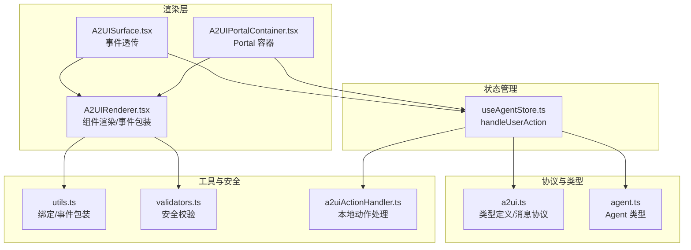
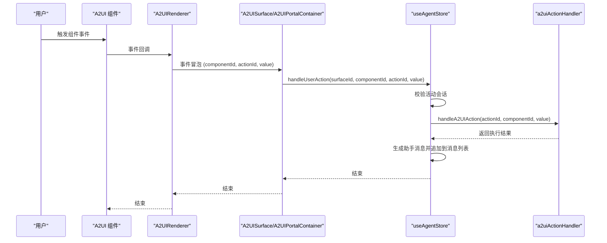
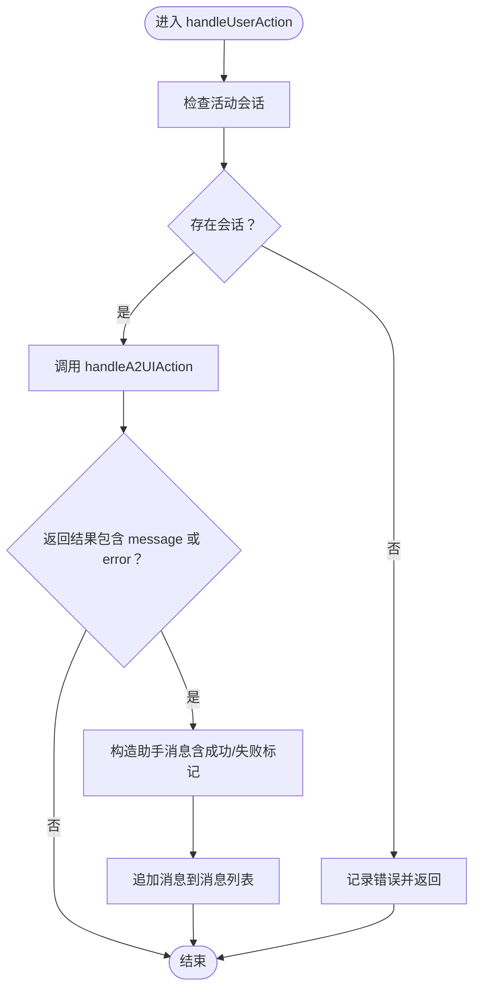
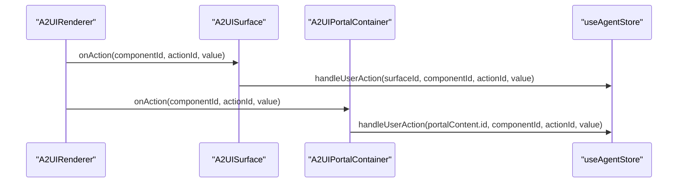
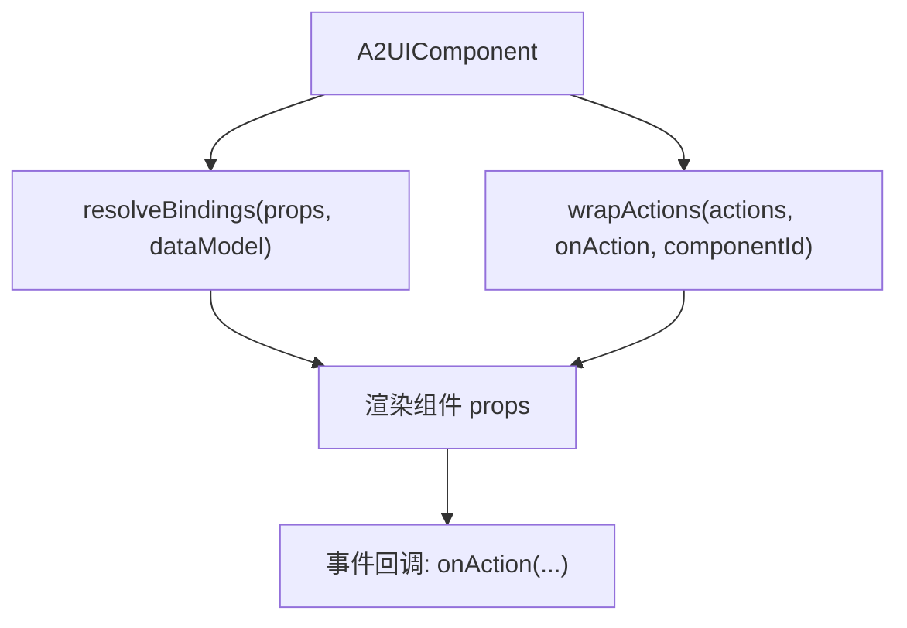
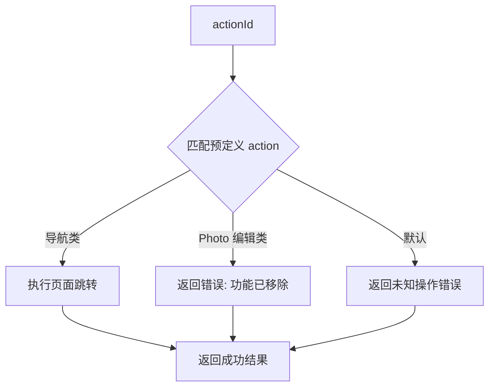
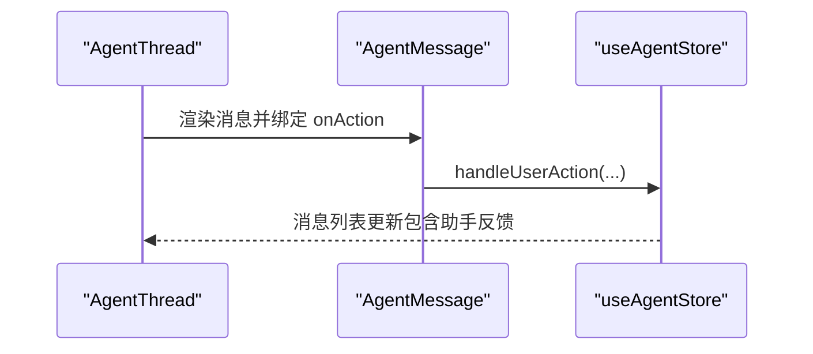
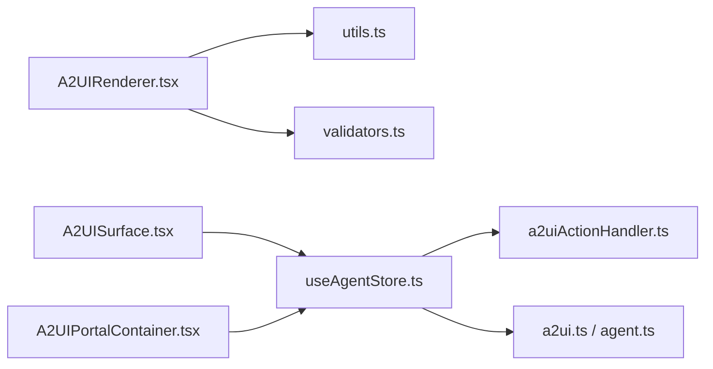

# 用户操作处理

<cite>
**本文档引用的文件**
- [useAgentStore.ts](file://app/src/stores/useAgentStore.ts)
- [A2UISurface.tsx](file://app/src/components/agent/a2ui/A2UISurface.tsx)
- [A2UIPortalContainer.tsx](file://app/src/components/agent/a2ui/A2UIPortalContainer.tsx)
- [A2UIRenderer.tsx](file://app/src/components/agent/a2ui/A2UIRenderer.tsx)
- [a2uiActionHandler.ts](file://app/src/lib/agent/a2uiActionHandler.ts)
- [utils.ts](file://app/src/components/agent/a2ui/utils.ts)
- [validators.ts](file://app/src/components/agent/a2ui/validators.ts)
- [a2ui.ts](file://app/src/types/a2ui.ts)
- [agent.ts](file://app/src/types/agent.ts)
- [AgentThread.tsx](file://app/src/components/agent/AgentThread.tsx)
</cite>

## 目录
1. [简介](#简介)
2. [项目结构](#项目结构)
3. [核心组件](#核心组件)
4. [架构总览](#架构总览)
5. [详细组件分析](#详细组件分析)
6. [依赖关系分析](#依赖关系分析)
7. [性能考虑](#性能考虑)
8. [故障排除指南](#故障排除指南)
9. [结论](#结论)
10. [附录](#附录)

## 简介
本文件聚焦于 Agent Store 中 handleUserAction 方法的完整实现，系统性阐述用户在 A2UI 组件上触发的各种操作如何被处理。内容涵盖：
- 活动会话状态验证
- 操作日志记录
- A2UI Action Handler 的本地操作执行
- 操作结果的消息通知生成
- 用户操作与 AI 会话的集成方式
- 通过助手消息向用户反馈操作结果
- 在 A2UI 组件中正确绑定用户操作事件的使用示例与最佳实践

## 项目结构
围绕用户操作处理的关键模块分布如下：
- 状态管理：Agent Store（Zustand）负责会话、消息、Surface/Portal 状态与用户操作处理
- 渲染层：A2UI Surface/Portal 容器负责渲染组件树与事件冒泡
- 协议与类型：A2UI 类型定义与消息协议
- 安全与工具：组件校验、数据绑定解析、事件包装等

**图表来源**
- [useAgentStore.ts:295-332](file://app/src/stores/useAgentStore.ts#L295-L332)
- [A2UISurface.tsx:30-81](file://app/src/components/agent/a2ui/A2UISurface.tsx#L30-L81)
- [A2UIPortalContainer.tsx:21-66](file://app/src/components/agent/a2ui/A2UIPortalContainer.tsx#L21-L66)
- [A2UIRenderer.tsx:91-171](file://app/src/components/agent/a2ui/A2UIRenderer.tsx#L91-L171)
- [a2ui.ts:141-167](file://app/src/types/a2ui.ts#L141-L167)
- [agent.ts:299-306](file://app/src/types/agent.ts#L299-L306)
- [utils.ts:84-132](file://app/src/components/agent/a2ui/utils.ts#L84-L132)
- [validators.ts:74-111](file://app/src/components/agent/a2ui/validators.ts#L74-L111)
- [a2uiActionHandler.ts:26-74](file://app/src/lib/agent/a2uiActionHandler.ts#L26-L74)

**章节来源**
- [useAgentStore.ts:295-332](file://app/src/stores/useAgentStore.ts#L295-L332)
- [A2UISurface.tsx:30-81](file://app/src/components/agent/a2ui/A2UISurface.tsx#L30-L81)
- [A2UIPortalContainer.tsx:21-66](file://app/src/components/agent/a2ui/A2UIPortalContainer.tsx#L21-L66)
- [A2UIRenderer.tsx:91-171](file://app/src/components/agent/a2ui/A2UIRenderer.tsx#L91-L171)
- [a2ui.ts:141-167](file://app/src/types/a2ui.ts#L141-L167)
- [agent.ts:299-306](file://app/src/types/agent.ts#L299-L306)
- [utils.ts:84-132](file://app/src/components/agent/a2ui/utils.ts#L84-L132)
- [validators.ts:74-111](file://app/src/components/agent/a2ui/validators.ts#L74-L111)
- [a2uiActionHandler.ts:26-74](file://app/src/lib/agent/a2uiActionHandler.ts#L26-L74)

## 核心组件
- Agent Store 的 handleUserAction：统一处理用户在 A2UI 上的操作，验证会话状态，调用 Action Handler 执行本地操作，并根据结果生成助手消息通知。
- A2UI Surface/Portal：负责将组件树渲染到对话内或覆盖区域，并向上冒泡用户操作事件。
- A2UI Renderer：递归渲染组件，解析数据绑定，包装事件处理器，进行安全校验。
- A2UI Action Handler：根据 actionId 路由到具体本地处理逻辑（如导航跳转）。
- 工具与安全：数据绑定解析、事件包装、安全校验与降级处理。

**章节来源**
- [useAgentStore.ts:295-332](file://app/src/stores/useAgentStore.ts#L295-L332)
- [A2UISurface.tsx:30-81](file://app/src/components/agent/a2ui/A2UISurface.tsx#L30-L81)
- [A2UIPortalContainer.tsx:21-66](file://app/src/components/agent/a2ui/A2UIPortalContainer.tsx#L21-L66)
- [A2UIRenderer.tsx:91-171](file://app/src/components/agent/a2ui/A2UIRenderer.tsx#L91-L171)
- [a2uiActionHandler.ts:26-74](file://app/src/lib/agent/a2uiActionHandler.ts#L26-L74)
- [utils.ts:84-132](file://app/src/components/agent/a2ui/utils.ts#L84-L132)
- [validators.ts:74-111](file://app/src/components/agent/a2ui/validators.ts#L74-L111)

## 架构总览
用户操作处理的整体流程如下：

**图表来源**
- [A2UIRenderer.tsx:151-153](file://app/src/components/agent/a2ui/A2UIRenderer.tsx#L151-L153)
- [A2UISurface.tsx:40-54](file://app/src/components/agent/a2ui/A2UISurface.tsx#L40-L54)
- [A2UIPortalContainer.tsx:54-61](file://app/src/components/agent/a2ui/A2UIPortalContainer.tsx#L54-L61)
- [useAgentStore.ts:296-332](file://app/src/stores/useAgentStore.ts#L296-L332)
- [a2uiActionHandler.ts:26-74](file://app/src/lib/agent/a2uiActionHandler.ts#L26-L74)

## 详细组件分析

### handleUserAction 方法实现详解
- 会话状态验证：若无活动会话，直接记录错误并返回，避免在无上下文的情况下执行操作。
- 日志记录：打印操作详情，便于调试与审计。
- Action Handler 调用：异步加载并调用本地动作处理器，传入 actionId、componentId、value。
- 结果处理：根据返回的执行结果生成助手消息（成功带成功标记，失败带错误标记），并追加到消息列表。

**图表来源**
- [useAgentStore.ts:296-332](file://app/src/stores/useAgentStore.ts#L296-L332)

**章节来源**
- [useAgentStore.ts:296-332](file://app/src/stores/useAgentStore.ts#L296-L332)

### A2UI Surface 与 Portal 的事件冒泡
- A2UISurface：接收组件树与数据模型，封装 handleAction，将用户操作以 UserActionMessage 形式向上抛出。
- A2UIPortalContainer：根据 portalTarget 渲染到主内容区或全屏模态；拦截关闭动作并调用 store 的 handleUserAction。

**图表来源**
- [A2UISurface.tsx:40-54](file://app/src/components/agent/a2ui/A2UISurface.tsx#L40-L54)
- [A2UIPortalContainer.tsx:54-61](file://app/src/components/agent/a2ui/A2UIPortalContainer.tsx#L54-L61)
- [useAgentStore.ts:296-332](file://app/src/stores/useAgentStore.ts#L296-L332)

**章节来源**
- [A2UISurface.tsx:30-81](file://app/src/components/agent/a2ui/A2UISurface.tsx#L30-L81)
- [A2UIPortalContainer.tsx:21-66](file://app/src/components/agent/a2ui/A2UIPortalContainer.tsx#L21-L66)

### A2UI Renderer 的事件包装与数据绑定
- 事件包装：wrapActions 将组件 actions 映射转换为 React 事件处理器，确保事件名格式正确（如 click → onClick），并将组件 ID、actionId、value 透传给上层。
- 数据绑定：resolveBindings 将 props 中的绑定表达式解析为实际值，支持嵌套路径访问。
- 安全校验：validateComponent/sanitizeProps 在严格模式与非严格模式下分别进行深度校验或安全降级过滤。

**图表来源**
- [A2UIRenderer.tsx:145-153](file://app/src/components/agent/a2ui/A2UIRenderer.tsx#L145-L153)
- [utils.ts:84-132](file://app/src/components/agent/a2ui/utils.ts#L84-L132)
- [validators.ts:74-111](file://app/src/components/agent/a2ui/validators.ts#L74-L111)

**章节来源**
- [A2UIRenderer.tsx:91-171](file://app/src/components/agent/a2ui/A2UIRenderer.tsx#L91-L171)
- [utils.ts:84-132](file://app/src/components/agent/a2ui/utils.ts#L84-L132)
- [validators.ts:74-111](file://app/src/components/agent/a2ui/validators.ts#L74-L111)

### A2UI Action Handler 的本地操作执行
- 导航类 action：根据 actionId 路由到对应页面跳转，返回成功消息。
- 已移除功能：Photo 编辑相关 action 统一返回错误，提示功能已移除。
- 未知 action：记录警告并返回错误消息。

**图表来源**
- [a2uiActionHandler.ts:26-74](file://app/src/lib/agent/a2uiActionHandler.ts#L26-L74)

**章节来源**
- [a2uiActionHandler.ts:26-74](file://app/src/lib/agent/a2uiActionHandler.ts#L26-L74)

### 用户操作与 AI 会话的集成
- 会话上下文：handleUserAction 依赖 currentThreadId 作为操作上下文，确保所有操作都在有效会话中执行。
- 助手消息反馈：无论操作成功与否，都会生成一条助手消息，通过 appendMessage 追加到消息列表，形成“AI 响应”式的用户反馈。
- 事件链路：AgentThread 将消息渲染为 AgentMessage，并将 onAction 绑定到 store 的 handleUserAction，形成闭环。

**图表来源**
- [AgentThread.tsx:46-47](file://app/src/components/agent/AgentThread.tsx#L46-L47)
- [useAgentStore.ts:296-332](file://app/src/stores/useAgentStore.ts#L296-L332)

**章节来源**
- [AgentThread.tsx:19-55](file://app/src/components/agent/AgentThread.tsx#L19-L55)
- [useAgentStore.ts:296-332](file://app/src/stores/useAgentStore.ts#L296-L332)

## 依赖关系分析
- 组件耦合与内聚
  - A2UIRenderer 与 utils/validators 高内聚，负责渲染与安全。
  - A2UISurface/A2UIPortalContainer 与 store 低耦合，仅通过 onAction 与 handleUserAction 交互。
  - store 与 actionHandler 松耦合，通过动态导入实现职责分离。
- 外部依赖与集成点
  - 浏览器环境：Action Handler 中的页面跳转依赖 window.location。
  - 类型系统：a2ui.ts/agent.ts 提供强类型约束，保障跨模块一致性。

**图表来源**
- [A2UIRenderer.tsx:91-171](file://app/src/components/agent/a2ui/A2UIRenderer.tsx#L91-L171)
- [utils.ts:84-132](file://app/src/components/agent/a2ui/utils.ts#L84-L132)
- [validators.ts:74-111](file://app/src/components/agent/a2ui/validators.ts#L74-L111)
- [A2UISurface.tsx:30-81](file://app/src/components/agent/a2ui/A2UISurface.tsx#L30-L81)
- [A2UIPortalContainer.tsx:21-66](file://app/src/components/agent/a2ui/A2UIPortalContainer.tsx#L21-L66)
- [useAgentStore.ts:296-332](file://app/src/stores/useAgentStore.ts#L296-L332)
- [a2uiActionHandler.ts:26-74](file://app/src/lib/agent/a2uiActionHandler.ts#L26-L74)
- [a2ui.ts:141-167](file://app/src/types/a2ui.ts#L141-L167)
- [agent.ts:299-306](file://app/src/types/agent.ts#L299-L306)

**章节来源**
- [A2UIRenderer.tsx:91-171](file://app/src/components/agent/a2ui/A2UIRenderer.tsx#L91-L171)
- [A2UISurface.tsx:30-81](file://app/src/components/agent/a2ui/A2UISurface.tsx#L30-L81)
- [A2UIPortalContainer.tsx:21-66](file://app/src/components/agent/a2ui/A2UIPortalContainer.tsx#L21-L66)
- [useAgentStore.ts:296-332](file://app/src/stores/useAgentStore.ts#L296-L332)
- [a2uiActionHandler.ts:26-74](file://app/src/lib/agent/a2uiActionHandler.ts#L26-L74)
- [a2ui.ts:141-167](file://app/src/types/a2ui.ts#L141-L167)
- [agent.ts:299-306](file://app/src/types/agent.ts#L299-L306)

## 性能考虑
- 渲染性能
  - A2UIRenderer 使用 useMemo 缓存安全校验结果，减少重复计算。
  - 严格模式与非严格模式的区分，平衡安全性与性能。
- 事件处理
  - wrapActions 仅在组件初始化时生成事件处理器，避免每次渲染都创建新函数。
- 状态更新
  - store 使用局部状态更新，避免不必要的重渲染。
- I/O 与网络
  - handleUserAction 为本地操作，不涉及网络请求；若后续扩展为远程调用，需考虑并发控制与错误重试。

## 故障排除指南
- 无活动会话
  - 现象：handleUserAction 直接返回，控制台输出错误日志。
  - 排查：确认 currentThreadId 是否存在；确保在会话创建后才触发操作。
- 未知组件类型
  - 现象：渲染警告组件，提示未知组件类型与 ID。
  - 排查：检查组件 type 是否在内置类型列表中；确认组件注册。
- 安全校验失败
  - 现象：显示安全错误组件，提示危险属性或函数类型。
  - 排查：移除危险 props（如 onClick、dangerouslySetInnerHTML 等）；仅允许白名单组件的特定属性。
- 事件未触发
  - 现象：点击按钮无响应。
  - 排查：确认 actions 映射正确；检查事件名是否被 wrapActions 正确转换（如 click → onClick）。
- 导航失败
  - 现象：导航类 action 返回错误。
  - 排查：确认 actionId 是否为已支持的导航类型；检查页面路由配置。

**章节来源**
- [useAgentStore.ts:296-332](file://app/src/stores/useAgentStore.ts#L296-L332)
- [A2UIRenderer.tsx:134-143](file://app/src/components/agent/a2ui/A2UIRenderer.tsx#L134-L143)
- [validators.ts:74-111](file://app/src/components/agent/a2ui/validators.ts#L74-L111)
- [utils.ts:111-132](file://app/src/components/agent/a2ui/utils.ts#L111-L132)
- [a2uiActionHandler.ts:26-74](file://app/src/lib/agent/a2uiActionHandler.ts#L26-L74)

## 结论
handleUserAction 通过严格的会话验证、清晰的事件冒泡与安全校验，实现了用户在 A2UI 组件上的本地操作处理闭环。结合助手消息反馈，用户能够获得即时、一致的交互体验。未来可在保持现有安全与类型约束的前提下，按需扩展远程操作能力，并完善错误恢复与重试策略。

## 附录

### 使用示例：在 A2UI 组件中绑定用户操作事件
- 在组件定义中添加 actions 字段，将事件名映射到 actionId（例如 click → "navigation.dashboard"）。
- 在渲染层通过 wrapActions 自动生成事件处理器，确保事件名格式正确。
- 在 Surface/Portal 容器中，将 onAction 透传至 store 的 handleUserAction，完成从 UI 到状态管理的链路。

**章节来源**
- [A2UIRenderer.tsx:151-153](file://app/src/components/agent/a2ui/A2UIRenderer.tsx#L151-L153)
- [utils.ts:111-132](file://app/src/components/agent/a2ui/utils.ts#L111-L132)
- [A2UISurface.tsx:40-54](file://app/src/components/agent/a2ui/A2UISurface.tsx#L40-L54)
- [A2UIPortalContainer.tsx:54-61](file://app/src/components/agent/a2ui/A2UIPortalContainer.tsx#L54-L61)

### 用户交互设计最佳实践
- 明确的反馈：所有操作均应通过助手消息进行反馈，确保用户感知到操作结果。
- 事件命名规范：遵循事件名到处理器的约定（如 click → onClick），避免重复前缀。
- 数据绑定安全：仅使用受控的绑定路径，避免直接暴露内部状态。
- 错误处理：对未知组件与安全校验失败提供明确的提示与降级处理。

### 错误处理策略
- 严格模式：遇到安全问题立即中断渲染并显示错误组件。
- 非严格模式：进行安全降级过滤，继续渲染但记录警告。
- 未知 action：统一返回错误消息，避免静默失败。

**章节来源**
- [validators.ts:143-178](file://app/src/components/agent/a2ui/validators.ts#L143-L178)
- [A2UIRenderer.tsx:128-131](file://app/src/components/agent/a2ui/A2UIRenderer.tsx#L128-L131)
- [a2uiActionHandler.ts:70-73](file://app/src/lib/agent/a2uiActionHandler.ts#L70-L73)