# Zustand Store 设计

<cite>
**本文档引用的文件**
- [useAuthStore.ts](file://app/src/stores/useAuthStore.ts)
- [useProfileStore.ts](file://app/src/stores/useProfileStore.ts)
- [useUIStore.ts](file://app/src/stores/useUIStore.ts)
- [useAgentStore.ts](file://app/src/stores/useAgentStore.ts)
- [useToast.ts](file://app/src/hooks/useToast.ts)
- [LoginForm.tsx](file://app/src/auth/components/LoginForm.tsx)
- [ProfilePage.tsx](file://app/src/pages/ProfilePage.tsx)
- [toaster.tsx](file://app/src/components/ui/toaster.tsx)
- [useAuthStore.test.ts](file://app/src/stores/__tests__/useAuthStore.test.ts)
- [useProfileStore.test.ts](file://app/src/stores/__tests__/useProfileStore.test.ts)
- [useUIStore.test.ts](file://app/src/stores/__tests__/useUIStore.test.ts)
- [auth.ts](file://app/src/types/auth.ts)
- [user.ts](file://app/src/types/user.ts)
</cite>

## 目录
1. [引言](#引言)
2. [项目结构](#项目结构)
3. [核心组件](#核心组件)
4. [架构概览](#架构概览)
5. [详细组件分析](#详细组件分析)
6. [依赖关系分析](#依赖关系分析)
7. [性能考虑](#性能考虑)
8. [故障排除指南](#故障排除指南)
9. [结论](#结论)
10. [附录](#附录)

## 引言

本文件系统性地介绍了基于 Zustand 的轻量级状态管理方案设计与实现。Zustand 作为现代 React 应用的状态管理解决方案，以其简洁的 API、灵活的中间件支持和优秀的 TypeScript 集成而广受欢迎。本项目通过四个核心 Store（认证、用户资料、UI 状态、AI 助手）展示了完整的状态管理模式，涵盖 Store 创建、状态结构设计、动作函数定义、初始化流程、中间件使用、状态更新机制以及组合模式。

本设计强调以下原则：
- **单一职责**：每个 Store 管理特定领域的状态，避免状态耦合
- **不可变更新**：通过 setState 的函数式更新确保状态一致性
- **异步处理**：统一的错误处理和加载状态管理
- **持久化策略**：选择性持久化关键状态，减少存储负担
- **乐观更新**：提升用户体验的即时反馈机制
- **组合模式**：Store 间通过动作调用实现协作

## 项目结构

项目采用按功能模块划分的目录结构，Store 文件集中位于 `app/src/stores/` 目录下，配合相应的类型定义、测试文件和使用示例：

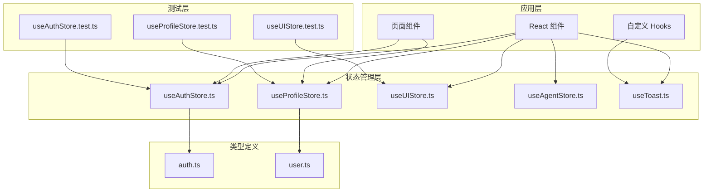

**图表来源**
- [useAuthStore.ts:1-173](file://app/src/stores/useAuthStore.ts#L1-L173)
- [useProfileStore.ts:1-205](file://app/src/stores/useProfileStore.ts#L1-L205)
- [useUIStore.ts:1-105](file://app/src/stores/useUIStore.ts#L1-L105)
- [useAgentStore.ts:1-482](file://app/src/stores/useAgentStore.ts#L1-L482)
- [useToast.ts:1-77](file://app/src/hooks/useToast.ts#L1-L77)

**章节来源**
- [useAuthStore.ts:1-173](file://app/src/stores/useAuthStore.ts#L1-L173)
- [useProfileStore.ts:1-205](file://app/src/stores/useProfileStore.ts#L1-L205)
- [useUIStore.ts:1-105](file://app/src/stores/useUIStore.ts#L1-L105)
- [useAgentStore.ts:1-482](file://app/src/stores/useAgentStore.ts#L1-L482)
- [useToast.ts:1-77](file://app/src/hooks/useToast.ts#L1-L77)

## 核心组件

本项目的核心状态管理组件包括四个 Store，每个都针对特定业务领域进行设计：

### 认证状态管理 Store
负责用户认证生命周期管理，包括初始化、登录、注册、登出等操作，并集成持久化存储。

### 用户资料状态管理 Store  
管理用户个人信息和头像相关状态，实现乐观更新和错误回滚机制。

### UI 状态管理 Store
提供全局 UI 状态管理，包括加载状态、模态框、Toast 通知等通用 UI 组件状态。

### AI 助手状态管理 Store
复杂的多状态管理，包括会话管理、消息处理、Surface 渲染、Portal 管理等。

**章节来源**
- [useAuthStore.ts:10-22](file://app/src/stores/useAuthStore.ts#L10-L22)
- [useProfileStore.ts:10-26](file://app/src/stores/useProfileStore.ts#L10-L26)
- [useUIStore.ts:34-49](file://app/src/stores/useUIStore.ts#L34-L49)
- [useAgentStore.ts:29-47](file://app/src/stores/useAgentStore.ts#L29-L47)

## 架构概览

Zustand Store 架构采用分层设计，通过中间件增强功能，通过动作函数实现状态更新：

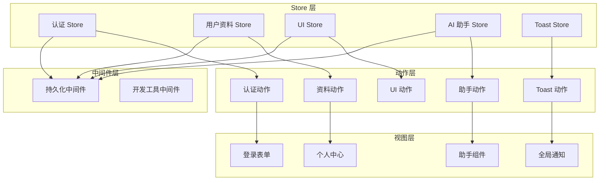

**图表来源**
- [useAuthStore.ts:24-172](file://app/src/stores/useAuthStore.ts#L24-L172)
- [useProfileStore.ts:36-204](file://app/src/stores/useProfileStore.ts#L36-L204)
- [useUIStore.ts:51-104](file://app/src/stores/useUIStore.ts#L51-L104)
- [useAgentStore.ts:60-343](file://app/src/stores/useAgentStore.ts#L60-L343)
- [useToast.ts:28-59](file://app/src/hooks/useToast.ts#L28-L59)

## 详细组件分析

### 认证状态管理 Store

#### 状态结构设计
认证 Store 定义了完整的认证状态结构，包括用户信息、加载状态、认证状态和错误信息：

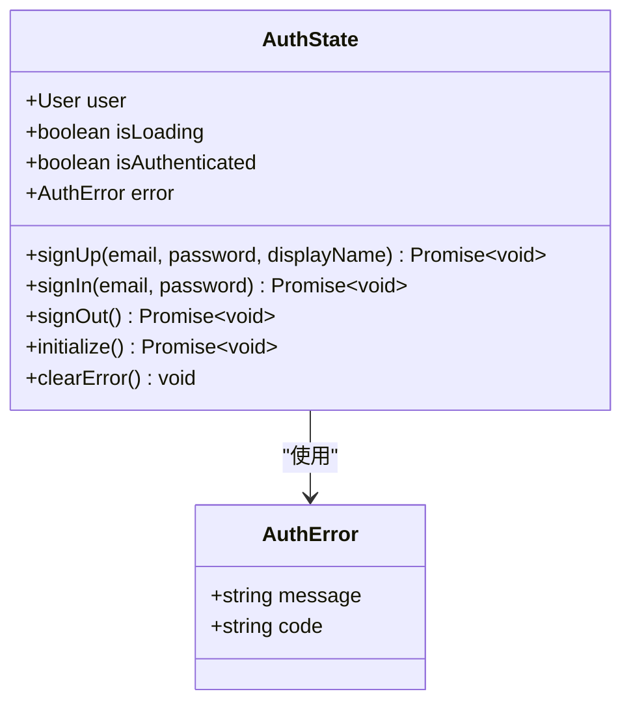

**图表来源**
- [useAuthStore.ts:10-22](file://app/src/stores/useAuthStore.ts#L10-L22)
- [auth.ts:17-20](file://app/src/types/auth.ts#L17-L20)

#### 初始化流程
认证 Store 的初始化流程包含用户状态检测和事件监听：

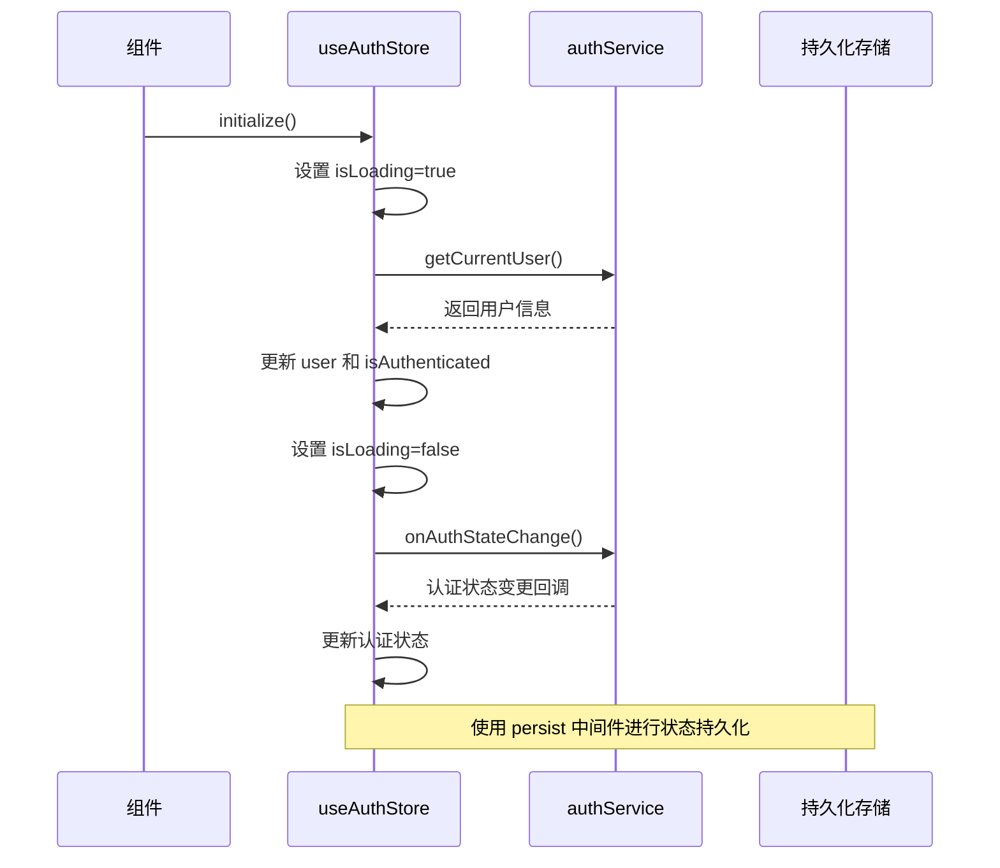

**图表来源**
- [useAuthStore.ts:35-60](file://app/src/stores/useAuthStore.ts#L35-L60)
- [useAuthStore.ts:46-51](file://app/src/stores/useAuthStore.ts#L46-L51)

#### 异步更新机制
认证 Store 统一处理异步操作的加载状态和错误处理：

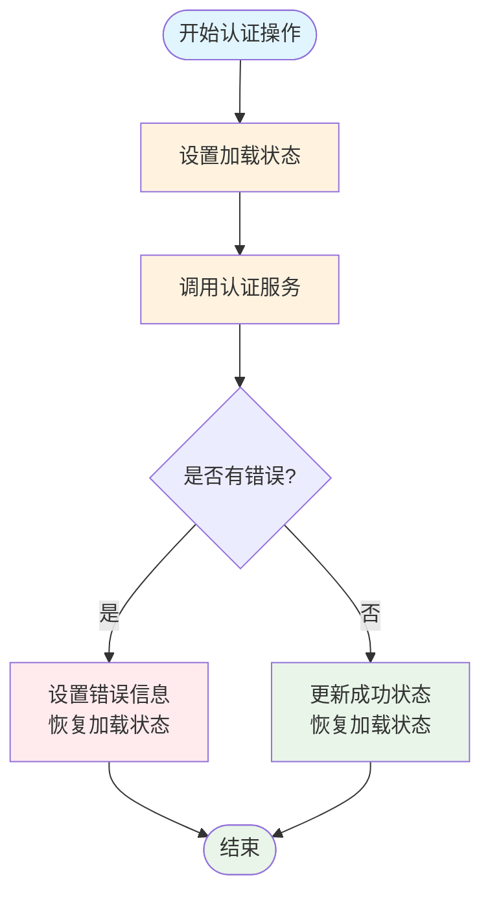

**图表来源**
- [useAuthStore.ts:65-95](file://app/src/stores/useAuthStore.ts#L65-L95)
- [useAuthStore.ts:100-126](file://app/src/stores/useAuthStore.ts#L100-L126)
- [useAuthStore.ts:131-157](file://app/src/stores/useAuthStore.ts#L131-L157)

**章节来源**
- [useAuthStore.ts:24-172](file://app/src/stores/useAuthStore.ts#L24-L172)
- [useAuthStore.test.ts:29-72](file://app/src/stores/__tests__/useAuthStore.test.ts#L29-L72)

### 用户资料状态管理 Store

#### 乐观更新模式
用户资料 Store 实现了乐观更新模式，提升用户体验：

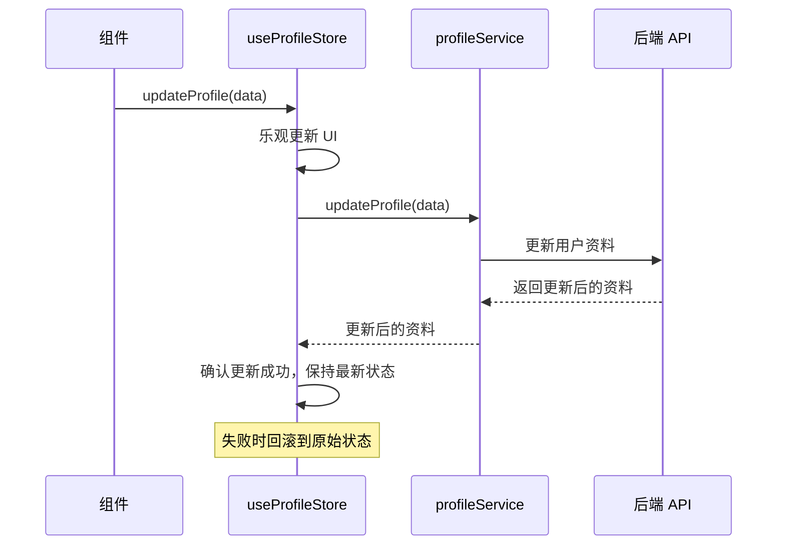

**图表来源**
- [useProfileStore.ts:58-92](file://app/src/stores/useProfileStore.ts#L58-L92)

#### 头像上传流程
头像上传实现了进度模拟和错误处理：

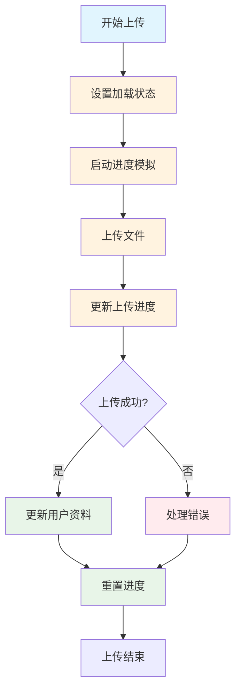

**图表来源**
- [useProfileStore.ts:97-145](file://app/src/stores/useProfileStore.ts#L97-L145)

**章节来源**
- [useProfileStore.ts:36-204](file://app/src/stores/useProfileStore.ts#L36-L204)
- [useProfileStore.test.ts:68-99](file://app/src/stores/__tests__/useProfileStore.test.ts#L68-L99)

### UI 状态管理 Store

#### 纯状态操作
UI Store 提供了简单的状态操作，不涉及异步逻辑：

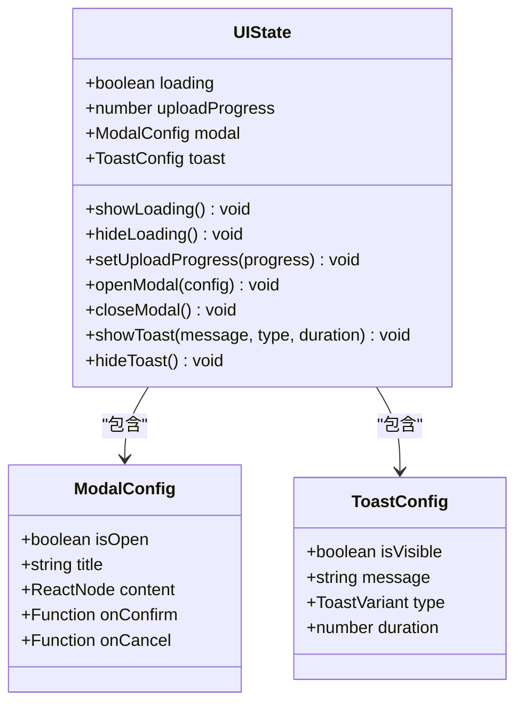

**图表来源**
- [useUIStore.ts:34-49](file://app/src/stores/useUIStore.ts#L34-L49)
- [useUIStore.ts:13-29](file://app/src/stores/useUIStore.ts#L13-L29)

**章节来源**
- [useUIStore.ts:51-104](file://app/src/stores/useUIStore.ts#L51-L104)
- [useUIStore.test.ts:9-32](file://app/src/stores/__tests__/useUIStore.test.ts#L9-L32)

### AI 助手状态管理 Store

#### 复杂状态管理
AI 助手 Store 是最复杂的 Store，管理多种状态和操作：

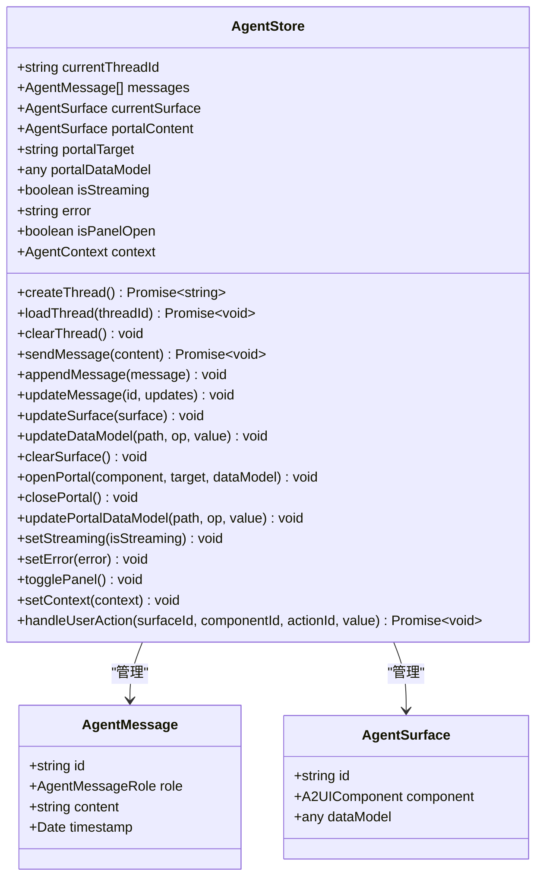

**图表来源**
- [useAgentStore.ts:29-47](file://app/src/stores/useAgentStore.ts#L29-L47)
- [useAgentStore.ts:10-24](file://app/src/stores/useAgentStore.ts#L10-L24)

#### A2UI 消息处理
AI 助手 Store 实现了完整的 A2UI 消息处理机制：

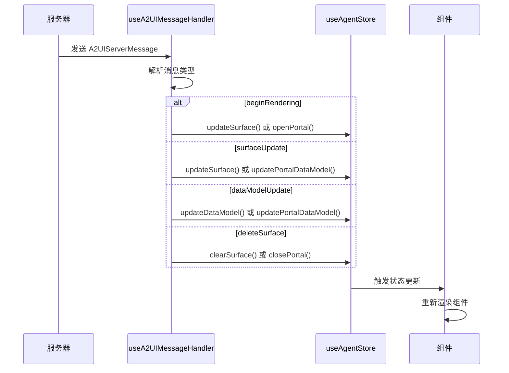

**图表来源**
- [useAgentStore.ts:358-459](file://app/src/stores/useAgentStore.ts#L358-L459)

**章节来源**
- [useAgentStore.ts:60-343](file://app/src/stores/useAgentStore.ts#L60-L343)

### Toast 通知系统

#### 基于 Zustand 的全局通知
Toast 系统提供了完整的全局通知管理：

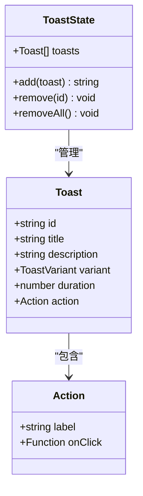

**图表来源**
- [useToast.ts:21-26](file://app/src/hooks/useToast.ts#L21-L26)
- [useToast.ts:9-19](file://app/src/hooks/useToast.ts#L9-L19)

**章节来源**
- [useToast.ts:28-59](file://app/src/hooks/useToast.ts#L28-L59)

## 依赖关系分析

Zustand Store 之间的依赖关系体现了清晰的分层架构：

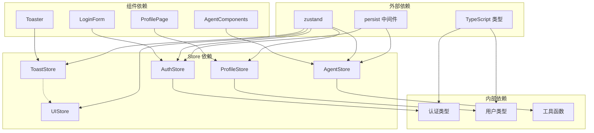

**图表来源**
- [useAuthStore.ts:4-8](file://app/src/stores/useAuthStore.ts#L4-L8)
- [useProfileStore.ts:6-8](file://app/src/stores/useProfileStore.ts#L6-L8)
- [useAgentStore.ts:8-24](file://app/src/stores/useAgentStore.ts#L8-L24)
- [useToast.ts](file://app/src/hooks/useToast.ts#L5)

**章节来源**
- [LoginForm.tsx](file://app/src/auth/components/LoginForm.tsx#L6)
- [ProfilePage.tsx:8-9](file://app/src/pages/ProfilePage.tsx#L8-L9)
- [toaster.tsx](file://app/src/components/ui/toaster.tsx#L7)

## 性能考虑

### 状态选择性持久化
认证 Store 和 Agent Store 使用 `persist` 中间件进行选择性持久化，只保存必要的状态：

- **认证 Store**：仅持久化用户信息和认证状态
- **Agent Store**：持久化会话 ID 和面板状态

### 乐观更新优化
用户资料 Store 的乐观更新减少了用户等待时间，提升了用户体验。

### 内存管理
- 使用 `set` 函数式更新避免不必要的重渲染
- 合理的错误处理和状态清理
- 及时清理定时器和订阅

## 故障排除指南

### 常见问题及解决方案

#### 认证状态初始化失败
**症状**：应用启动时认证状态异常
**解决方案**：
1. 检查 `authService.getCurrentUser()` 是否正常返回
2. 验证 `persist` 中间件配置
3. 查看控制台错误日志

#### 用户资料更新失败
**症状**：资料更新后状态回滚
**解决方案**：
1. 确认后端 API 响应格式
2. 检查网络请求状态
3. 验证错误处理逻辑

#### Toast 通知不显示
**症状**：调用 `toast()` 函数但无显示
**解决方案**：
1. 确认 `Toaster` 组件已正确渲染
2. 检查 `useToastStore` 的状态
3. 验证通知持续时间设置

**章节来源**
- [useAuthStore.test.ts:62-72](file://app/src/stores/__tests__/useAuthStore.test.ts#L62-L72)
- [useProfileStore.test.ts:87-99](file://app/src/stores/__tests__/useProfileStore.test.ts#L87-L99)
- [useUIStore.test.ts:87-95](file://app/src/stores/__tests__/useUIStore.test.ts#L87-L95)

## 结论

本项目展示了基于 Zustand 的完整状态管理解决方案，通过四个精心设计的 Store 实现了认证、用户资料、UI 状态和 AI 助手的全面管理。该设计具有以下优势：

1. **模块化设计**：每个 Store 职责明确，便于维护和扩展
2. **类型安全**：完整的 TypeScript 类型定义确保类型安全
3. **异步处理**：统一的异步操作处理模式
4. **用户体验**：乐观更新和加载状态管理提升用户体验
5. **可测试性**：完善的单元测试覆盖关键功能

建议在实际项目中：
- 保持 Store 的单一职责原则
- 合理使用中间件，避免过度复杂化
- 建立统一的错误处理和日志记录机制
- 定期审查和优化状态结构

## 附录

### Store 创建最佳实践

#### 基础 Store 创建
```typescript
// 使用 create 创建 Store
export const useStore = create<StateType>()(
  // 可选：添加中间件
  persist(
    (set, get) => ({
      // 初始状态
      count: 0,
      // 动作函数
      increment: () => set((state) => ({ count: state.count + 1 })),
    }),
    {
      name: 'store-name',
      partialize: (state) => ({ /* 选择性持久化的字段 */ }),
    }
  )
)
```

#### 异步动作设计
```typescript
// 异步动作的标准模式
asyncAction: async (param) => {
  set({ loading: true, error: null })
  try {
    const result = await apiCall(param)
    set({ data: result, loading: false })
  } catch (error) {
    set({ 
      error: error.message, 
      loading: false 
    })
  }
}
```

#### 状态选择性更新
```typescript
// 使用函数式 set 进行精确更新
set((state) => ({
  nested: {
    ...state.nested,
    field: newValue
  }
}))
```