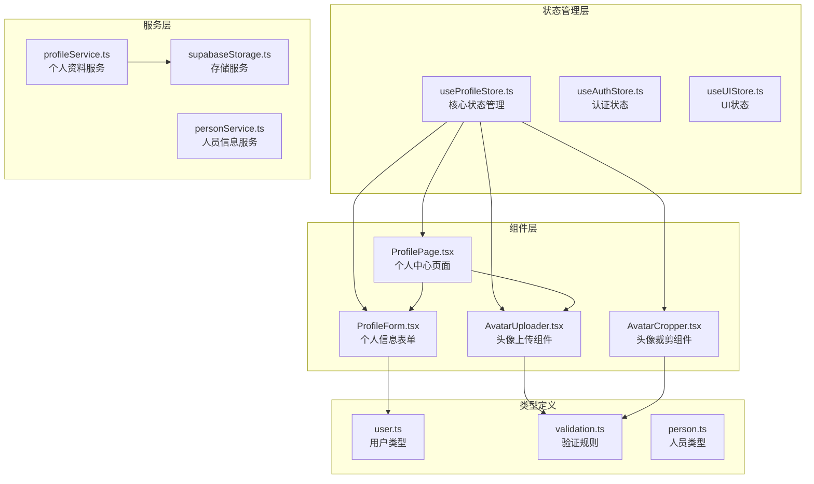
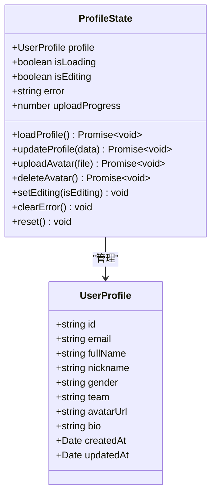
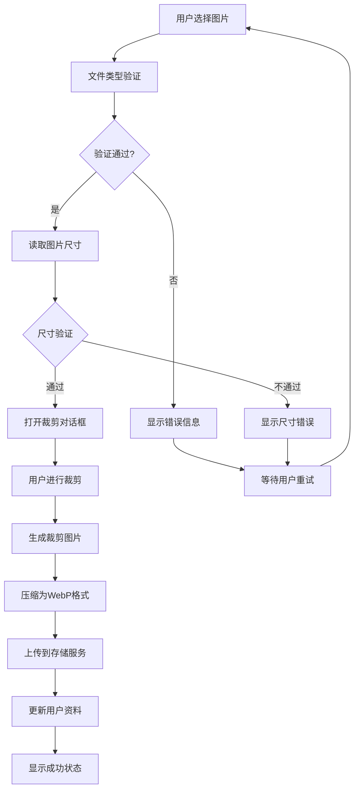
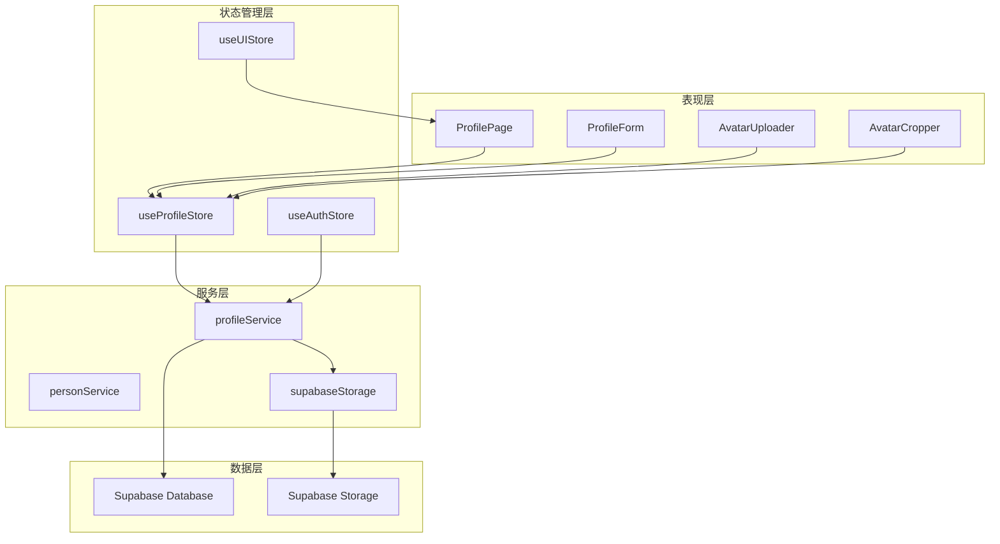
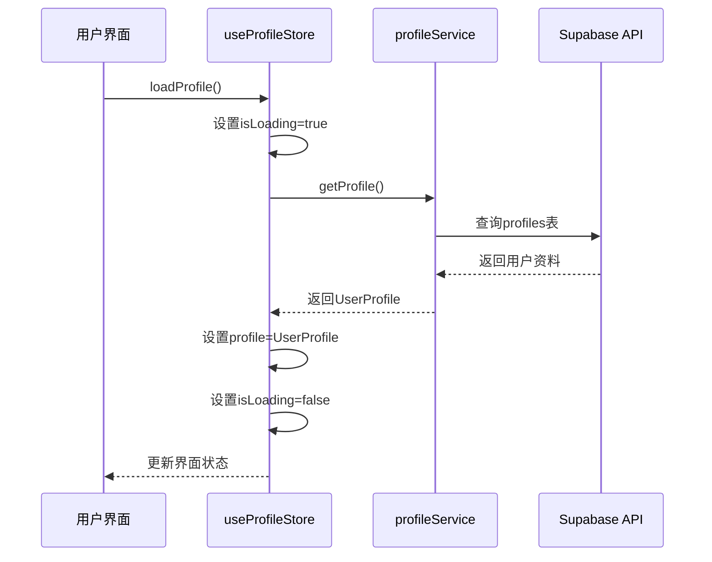
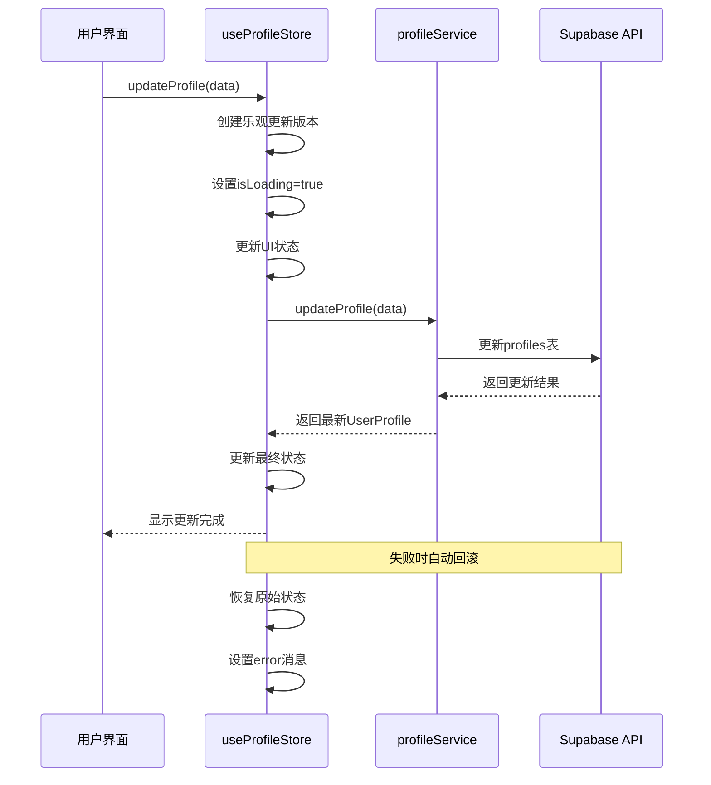
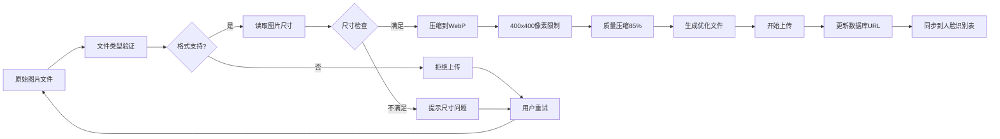
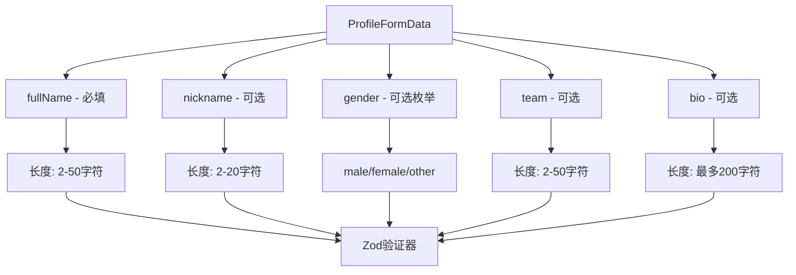
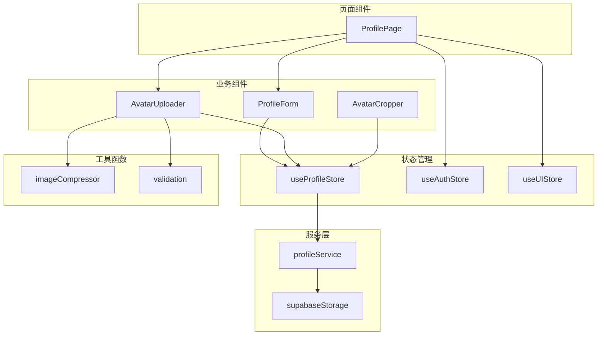
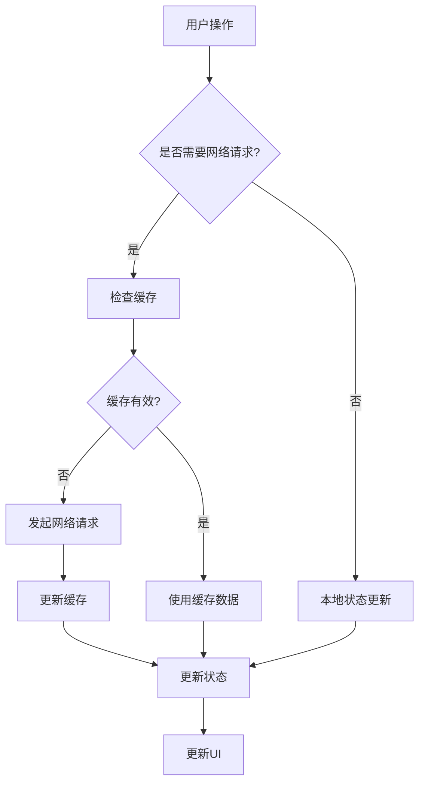

# 个人资料 Store 状态管理

<cite>
**本文档引用的文件**
- [useProfileStore.ts](file://app/src/stores/useProfileStore.ts)
- [ProfileForm.tsx](file://app/src/components/business/ProfileForm.tsx)
- [ProfilePage.tsx](file://app/src/pages/ProfilePage.tsx)
- [profileService.ts](file://app/src/services/api/profileService.ts)
- [user.ts](file://app/src/types/user.ts)
- [validation.ts](file://app/src/types/validation.ts)
- [AvatarUploader.tsx](file://app/src/components/business/AvatarUploader.tsx)
- [AvatarCropper.tsx](file://app/src/components/business/AvatarCropper.tsx)
- [imageCompressor.ts](file://app/src/utils/imageCompressor.ts)
- [supabaseStorage.ts](file://app/src/services/storage/supabaseStorage.ts)
- [useProfileStore.test.ts](file://app/src/stores/__tests__/useProfileStore.test.ts)
- [ProfilePage.test.tsx](file://app/src/pages/__tests__/ProfilePage.test.tsx)
</cite>

## 目录
1. [简介](#简介)
2. [项目结构](#项目结构)
3. [核心组件](#核心组件)
4. [架构概览](#架构概览)
5. [详细组件分析](#详细组件分析)
6. [依赖关系分析](#依赖关系分析)
7. [性能考虑](#性能考虑)
8. [故障排除指南](#故障排除指南)
9. [结论](#结论)

## 简介

个人资料 Store 状态管理系统是 OPC-Starter 项目中的核心功能模块，负责管理用户个人信息和头像的完整生命周期。该系统采用现代化的状态管理模式，结合乐观更新、实时验证、头像处理等高级特性，为用户提供流畅的个人资料管理体验。

系统基于 Zustand 状态管理库构建，实现了完整的 CRUD 操作、数据验证、错误处理和用户体验优化。通过与 Supabase 的深度集成，系统支持云端同步、实时更新和持久化存储。

## 项目结构

个人资料状态管理相关的文件组织结构如下：

**图表来源**
- [useProfileStore.ts:1-205](file://app/src/stores/useProfileStore.ts#L1-L205)
- [ProfilePage.tsx:1-182](file://app/src/pages/ProfilePage.tsx#L1-L182)

**章节来源**
- [useProfileStore.ts:1-205](file://app/src/stores/useProfileStore.ts#L1-L205)
- [ProfilePage.tsx:1-182](file://app/src/pages/ProfilePage.tsx#L1-L182)

## 核心组件

### 状态管理器 (useProfileStore)

useProfileStore 是整个个人资料系统的核心状态管理器，基于 Zustand 构建，提供了完整的状态管理和业务逻辑处理。

#### 状态结构

**图表来源**
- [useProfileStore.ts:10-34](file://app/src/stores/useProfileStore.ts#L10-L34)
- [user.ts:5-16](file://app/src/types/user.ts#L5-L16)

#### 主要功能特性

1. **乐观更新机制**: 在更新用户资料时立即更新 UI，提升用户体验
2. **错误回滚**: 更新失败时自动回滚到原始状态
3. **进度跟踪**: 实时显示头像上传进度
4. **状态清理**: 提供完整的状态重置功能

**章节来源**
- [useProfileStore.ts:36-204](file://app/src/stores/useProfileStore.ts#L36-L204)

### 个人信息表单 (ProfileForm)

ProfileForm 组件使用 react-hook-form 和 Zod 验证框架，实现了完整的表单数据绑定和实时验证功能。

#### 表单字段设计

| 字段名 | 类型 | 必填 | 验证规则 | 描述 |
|--------|------|------|----------|------|
| fullName | string | 是 | 2-50字符 | 真实姓名 |
| nickname | string | 否 | 2-20字符 | 花名 |
| gender | enum | 否 | male/female/other | 性别 |
| team | string | 否 | 2-50字符 | 所在团队 |
| bio | string | 否 | 最多200字符 | 个人简介 |

**章节来源**
- [ProfileForm.tsx:22-249](file://app/src/components/business/ProfileForm.tsx#L22-L249)
- [validation.ts:11-27](file://app/src/types/validation.ts#L11-L27)

### 头像上传系统

头像上传系统提供了完整的图片处理和上传流程，包括文件验证、尺寸检查、裁剪和压缩功能。

#### 头像处理流程

**图表来源**
- [AvatarUploader.tsx:30-59](file://app/src/components/business/AvatarUploader.tsx#L30-L59)
- [AvatarCropper.tsx:48-101](file://app/src/components/business/AvatarCropper.tsx#L48-L101)

**章节来源**
- [AvatarUploader.tsx:18-258](file://app/src/components/business/AvatarUploader.tsx#L18-L258)
- [AvatarCropper.tsx:32-172](file://app/src/components/business/AvatarCropper.tsx#L32-L172)

## 架构概览

个人资料系统的整体架构采用分层设计，确保了良好的可维护性和扩展性。

**图表来源**
- [ProfilePage.tsx:8-15](file://app/src/pages/ProfilePage.tsx#L8-L15)
- [useProfileStore.ts:6-8](file://app/src/stores/useProfileStore.ts#L6-L8)
- [profileService.ts:6-9](file://app/src/services/api/profileService.ts#L6-L9)

### 数据流设计

系统采用单向数据流设计，确保状态变更的可预测性和可追踪性：

1. **用户交互** → **组件事件** → **Store Action** → **Service Call** → **API 请求** → **状态更新**
2. **异步操作** → **Loading 状态** → **结果处理** → **最终状态**

**章节来源**
- [profileService.ts:14-89](file://app/src/services/api/profileService.ts#L14-L89)
- [useProfileStore.ts:42-52](file://app/src/stores/useProfileStore.ts#L42-L52)

## 详细组件分析

### 状态管理实现

#### 加载个人资料流程

**图表来源**
- [useProfileStore.ts:42-52](file://app/src/stores/useProfileStore.ts#L42-L52)
- [profileService.ts:14-89](file://app/src/services/api/profileService.ts#L14-L89)

#### 乐观更新机制

系统实现了智能的乐观更新策略，在更新用户资料时立即反映到 UI，同时异步与服务器同步：

**图表来源**
- [useProfileStore.ts:58-92](file://app/src/stores/useProfileStore.ts#L58-L92)
- [profileService.ts:94-135](file://app/src/services/api/profileService.ts#L94-L135)

**章节来源**
- [useProfileStore.ts:58-92](file://app/src/stores/useProfileStore.ts#L58-L92)

### 头像上传处理

#### 图片压缩和优化

系统集成了智能的图片压缩和优化功能：

**图表来源**
- [profileService.ts:140-199](file://app/src/services/api/profileService.ts#L140-L199)
- [imageCompressor.ts:19-93](file://app/src/utils/imageCompressor.ts#L19-L93)

#### 存储服务集成

系统使用 Supabase Storage 作为云端存储解决方案：

| 功能特性 | 实现细节 | 安全性 |
|----------|----------|--------|
| 文件上传 | 自动缓存控制(3600秒) | 基于用户权限 |
| 文件删除 | 支持批量删除 | 访问令牌验证 |
| 公开链接 | 自动生成 | CDN加速 |
| 临时链接 | 支持签名URL | 时效性控制 |
| 文件列表 | 支持目录浏览 | 权限过滤 |

**章节来源**
- [supabaseStorage.ts:33-63](file://app/src/services/storage/supabaseStorage.ts#L33-L63)
- [profileService.ts:204-257](file://app/src/services/api/profileService.ts#L204-L257)

### 数据验证系统

#### 表单验证规则

系统采用 Zod 进行类型安全的表单验证：

**图表来源**
- [validation.ts:11-27](file://app/src/types/validation.ts#L11-L27)

#### 文件验证规则

头像文件验证确保了上传文件的质量和安全性：

| 验证项目 | 规则 | 限制 |
|----------|------|------|
| 文件类型 | JPEG/PNG/WebP | 仅支持三种格式 |
| 文件大小 | ≤ 5MB | 防止大文件占用 |
| 图片尺寸 | ≥ 200x200像素 | 确保清晰度 |
| 扩展名 | .jpg/.jpeg/.png/.webp | 文件类型匹配 |

**章节来源**
- [validation.ts:34-86](file://app/src/types/validation.ts#L34-L86)

## 依赖关系分析

### 组件依赖图

**图表来源**
- [ProfilePage.tsx:8-15](file://app/src/pages/ProfilePage.tsx#L8-L15)
- [ProfileForm.tsx:11-16](file://app/src/components/business/ProfileForm.tsx#L11-L16)
- [AvatarUploader.tsx:8-12](file://app/src/components/business/AvatarUploader.tsx#L8-L12)

### 外部依赖

系统的主要外部依赖包括：

1. **Zustand**: 轻量级状态管理库
2. **react-hook-form**: 表单处理和验证
3. **Zod**: 类型安全验证
4. **Supabase**: 云端数据库和存储
5. **react-easy-crop**: 图片裁剪功能

**章节来源**
- [useProfileStore.ts:6](file://app/src/stores/useProfileStore.ts#L6)
- [ProfileForm.tsx:6-16](file://app/src/components/business/ProfileForm.tsx#L6-L16)

## 性能考虑

### 状态更新优化

系统采用了多种性能优化策略：

1. **局部状态更新**: 使用 Zustand 的细粒度状态更新
2. **条件渲染**: 基于状态变化的组件重渲染优化
3. **防抖处理**: 表单输入的防抖处理减少不必要的更新
4. **内存管理**: 及时清理定时器和事件监听器

### 网络请求优化

### 图片处理优化

1. **WebP 格式**: 提供更好的压缩效果
2. **尺寸限制**: 自动限制最大尺寸避免过大文件
3. **质量控制**: 85% 质量平衡清晰度和文件大小
4. **渐进式加载**: 支持图片懒加载和预加载

## 故障排除指南

### 常见问题及解决方案

#### 加载失败问题

**症状**: 个人信息加载失败，显示错误信息

**可能原因**:
1. 网络连接不稳定
2. 用户未登录
3. 数据库查询异常

**解决方案**:
1. 检查网络连接状态
2. 确认用户认证状态
3. 查看控制台错误日志

#### 更新失败问题

**症状**: 个人信息更新后状态回滚

**可能原因**:
1. 服务器响应超时
2. 数据验证失败
3. 网络中断

**解决方案**:
1. 检查服务器状态
2. 验证表单数据格式
3. 重试操作

#### 头像上传失败

**症状**: 头像上传过程中断

**可能原因**:
1. 文件格式不支持
2. 文件大小超出限制
3. 存储服务异常

**解决方案**:
1. 检查文件格式和大小
2. 确认存储服务可用性
3. 重新尝试上传

**章节来源**
- [useProfileStore.ts:47-51](file://app/src/stores/useProfileStore.ts#L47-L51)
- [profileService.ts:131-134](file://app/src/services/api/profileService.ts#L131-L134)

### 调试技巧

1. **启用开发模式**: 使用 React DevTools 监控状态变化
2. **日志记录**: 在关键节点添加详细的日志输出
3. **单元测试**: 编写全面的测试用例覆盖各种场景
4. **错误边界**: 实现全局错误边界捕获未处理异常

**章节来源**
- [useProfileStore.test.ts:44-66](file://app/src/stores/__tests__/useProfileStore.test.ts#L44-L66)
- [ProfilePage.test.tsx:89-106](file://app/src/pages/__tests__/ProfilePage.test.tsx#L89-L106)

## 结论

个人资料 Store 状态管理系统展现了现代前端应用的最佳实践，通过精心设计的状态管理、完善的错误处理和优秀的用户体验，为用户提供了可靠的个人资料管理功能。

### 主要优势

1. **状态管理**: 基于 Zustand 的轻量级但功能强大的状态管理
2. **用户体验**: 乐观更新、实时验证、进度反馈等特性
3. **数据安全**: 完善的验证规则和错误处理机制
4. **性能优化**: 智能缓存、图片压缩、渐进式加载等优化
5. **可维护性**: 清晰的分层架构和全面的测试覆盖

### 技术亮点

- **乐观更新**: 提升用户感知性能
- **智能验证**: 前端和后端双重验证保障数据质量
- **云端集成**: 与 Supabase 的深度集成提供可靠的服务支持
- **图片处理**: 完整的图片压缩、裁剪和优化流程
- **错误恢复**: 完善的错误处理和状态回滚机制

该系统为类似的应用场景提供了优秀的参考模板，展示了如何构建高性能、易维护的前端状态管理系统。