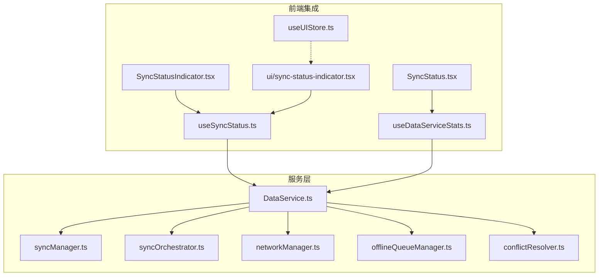
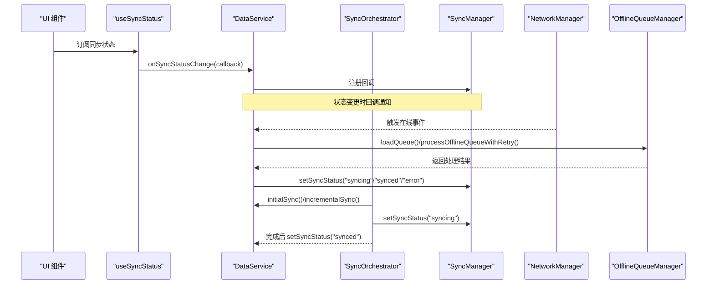
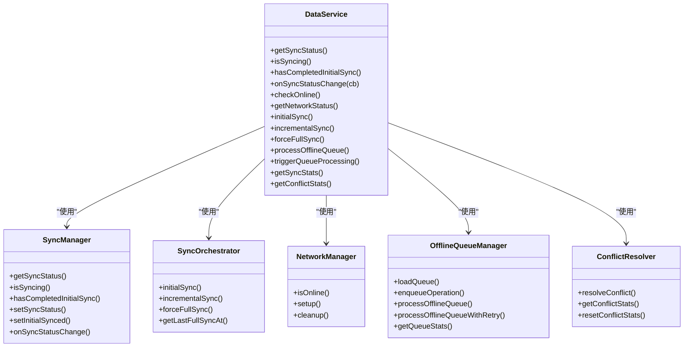

# 数据服务状态管理

<cite>
**本文引用的文件**
- [app/src/services/data/DataService.ts](file://app/src/services/data/DataService.ts)
- [app/src/services/data/sync/syncManager.ts](file://app/src/services/data/sync/syncManager.ts)
- [app/src/services/data/sync/syncOrchestrator.ts](file://app/src/services/data/sync/syncOrchestrator.ts)
- [app/src/services/data/network/networkManager.ts](file://app/src/services/data/network/networkManager.ts)
- [app/src/services/data/offline-queue/offlineQueueManager.ts](file://app/src/services/data/offline-queue/offlineQueueManager.ts)
- [app/src/services/data/conflict/conflictResolver.ts](file://app/src/services/data/conflict/conflictResolver.ts)
- [app/src/hooks/useSyncStatus.ts](file://app/src/hooks/useSyncStatus.ts)
- [app/src/hooks/useDataServiceStats.ts](file://app/src/hooks/useDataServiceStats.ts)
- [app/src/components/business/SyncStatus.tsx](file://app/src/components/business/SyncStatus.tsx)
- [app/src/components/business/SyncStatusIndicator.tsx](file://app/src/components/business/SyncStatusIndicator.tsx)
- [app/src/components/ui/sync-status-indicator.tsx](file://app/src/components/ui/sync-status-indicator.tsx)
- [app/src/stores/useUIStore.ts](file://app/src/stores/useUIStore.ts)
</cite>

## 目录
1. [简介](#简介)
2. [项目结构](#项目结构)
3. [核心组件](#核心组件)
4. [架构总览](#架构总览)
5. [详细组件分析](#详细组件分析)
6. [依赖关系分析](#依赖关系分析)
7. [性能考量](#性能考量)
8. [故障排查指南](#故障排查指南)
9. [结论](#结论)
10. [附录](#附录)

## 简介
本文件系统性梳理 OPC-Starter 中的数据服务状态管理机制，覆盖加载状态、错误状态、同步状态的跟踪与处理；解释全局加载指示、组件级加载状态、异步操作状态的管理；阐述错误捕获、错误分类与恢复策略；介绍同步状态监控（数据同步进度、网络状态、离线状态）的实时跟踪；说明状态统计与分析（性能指标、使用统计、错误日志）的收集与展示；并总结最佳实践（状态设计模式、性能优化、用户体验提升）。文末提供具体代码示例路径与使用指南。

## 项目结构
围绕数据服务状态管理的关键目录与文件如下：
- 服务层：DataService 作为统一入口，协调同步管理器、网络管理器、离线队列、冲突解决器与实时订阅。
- 管理模块：syncManager、syncOrchestrator、networkManager、offlineQueueManager、conflictResolver。
- 前端集成：useSyncStatus、useDataServiceStats、多个 UI 组件（SyncStatus、SyncStatusIndicator 等）。
- UI 状态：useUIStore（全局加载、上传进度、模态框、Toast 等）。

图表来源
- [app/src/services/data/DataService.ts:71-419](file://app/src/services/data/DataService.ts#L71-L419)
- [app/src/services/data/sync/syncManager.ts:14-47](file://app/src/services/data/sync/syncManager.ts#L14-L47)
- [app/src/services/data/sync/syncOrchestrator.ts:34-209](file://app/src/services/data/sync/syncOrchestrator.ts#L34-L209)
- [app/src/services/data/network/networkManager.ts:19-72](file://app/src/services/data/network/networkManager.ts#L19-L72)
- [app/src/services/data/offline-queue/offlineQueueManager.ts:24-167](file://app/src/services/data/offline-queue/offlineQueueManager.ts#L24-L167)
- [app/src/services/data/conflict/conflictResolver.ts:69-136](file://app/src/services/data/conflict/conflictResolver.ts#L69-L136)
- [app/src/hooks/useSyncStatus.ts:63-185](file://app/src/hooks/useSyncStatus.ts#L63-L185)
- [app/src/hooks/useDataServiceStats.ts:13-26](file://app/src/hooks/useDataServiceStats.ts#L13-L26)
- [app/src/components/business/SyncStatus.tsx:17-149](file://app/src/components/business/SyncStatus.tsx#L17-L149)
- [app/src/components/business/SyncStatusIndicator.tsx:107-266](file://app/src/components/business/SyncStatusIndicator.tsx#L107-L266)
- [app/src/components/ui/sync-status-indicator.tsx:25-210](file://app/src/components/ui/sync-status-indicator.tsx#L25-L210)
- [app/src/stores/useUIStore.ts:51-104](file://app/src/stores/useUIStore.ts#L51-L104)

章节来源
- [app/src/services/data/DataService.ts:112-131](file://app/src/services/data/DataService.ts#L112-L131)
- [app/src/hooks/useSyncStatus.ts:63-157](file://app/src/hooks/useSyncStatus.ts#L63-L157)
- [app/src/hooks/useDataServiceStats.ts:13-26](file://app/src/hooks/useDataServiceStats.ts#L13-L26)

## 核心组件
- DataService：单例服务，聚合所有子管理器，暴露统一接口（同步状态查询、网络状态、离线队列、冲突统计、人物 CRUD 等）。
- syncManager：维护同步状态（idle/syncing/synced/error）与初始同步完成标记，提供订阅回调能力。
- syncOrchestrator：编排初始同步与增量同步，设置状态、记录最后全量同步时间、启动实时订阅。
- networkManager：监听浏览器在线/离线事件，广播自定义事件，驱动离线队列处理。
- offlineQueueManager：持久化写操作队列（localStorage），支持重试、失败标记、队列清空事件。
- conflictResolver：基于版本号与字段策略的冲突解决与统计。
- Hooks：useSyncStatus、useDataServiceStats 将状态接入 React 组件。
- UI 组件：SyncStatus、SyncStatusIndicator、ui/sync-status-indicator 展示状态与进度，结合 useUIStore 管理全局加载与上传进度。

章节来源
- [app/src/services/data/DataService.ts:71-150](file://app/src/services/data/DataService.ts#L71-L150)
- [app/src/services/data/sync/syncManager.ts:14-47](file://app/src/services/data/sync/syncManager.ts#L14-L47)
- [app/src/services/data/sync/syncOrchestrator.ts:34-86](file://app/src/services/data/sync/syncOrchestrator.ts#L34-L86)
- [app/src/services/data/network/networkManager.ts:19-72](file://app/src/services/data/network/networkManager.ts#L19-L72)
- [app/src/services/data/offline-queue/offlineQueueManager.ts:24-143](file://app/src/services/data/offline-queue/offlineQueueManager.ts#L24-L143)
- [app/src/services/data/conflict/conflictResolver.ts:69-136](file://app/src/services/data/conflict/conflictResolver.ts#L69-L136)
- [app/src/hooks/useSyncStatus.ts:63-185](file://app/src/hooks/useSyncStatus.ts#L63-L185)
- [app/src/hooks/useDataServiceStats.ts:13-26](file://app/src/hooks/useDataServiceStats.ts#L13-L26)
- [app/src/components/business/SyncStatus.tsx:17-149](file://app/src/components/business/SyncStatus.tsx#L17-L149)
- [app/src/components/business/SyncStatusIndicator.tsx:107-266](file://app/src/components/business/SyncStatusIndicator.tsx#L107-L266)
- [app/src/components/ui/sync-status-indicator.tsx:25-210](file://app/src/components/ui/sync-status-indicator.tsx#L25-L210)
- [app/src/stores/useUIStore.ts:51-104](file://app/src/stores/useUIStore.ts#L51-L104)

## 架构总览
DataService 作为中枢，通过依赖注入的方式组合各子模块，并通过事件与回调向 UI 层推送状态变化。网络状态变化触发离线队列处理；同步状态变化通过回调与订阅传播；冲突解决贯穿读写与增量同步过程。

图表来源
- [app/src/services/data/DataService.ts:153-171](file://app/src/services/data/DataService.ts#L153-L171)
- [app/src/services/data/sync/syncManager.ts:23-37](file://app/src/services/data/sync/syncManager.ts#L23-L37)
- [app/src/services/data/sync/syncOrchestrator.ts:37-86](file://app/src/services/data/sync/syncOrchestrator.ts#L37-L86)
- [app/src/services/data/network/networkManager.ts:32-49](file://app/src/services/data/network/networkManager.ts#L32-L49)
- [app/src/services/data/offline-queue/offlineQueueManager.ts:104-143](file://app/src/services/data/offline-queue/offlineQueueManager.ts#L104-L143)

## 详细组件分析

### DataService：统一数据访问与状态中枢
- 职责
  - 维护 ReactiveCollection 与适配器，提供人物读写接口。
  - 协调同步管理器、网络管理器、冲突解决器、离线队列与远程 API。
  - 暴露同步状态查询、网络状态查询、队列统计、冲突统计、手动触发同步与队列处理。
- 关键点
  - 初始化时注册网络监听与加载离线队列。
  - 在线时优先写入云端并回写本地缓存；离线时写入本地并入队离线队列。
  - 通过 CustomEvent 广播网络状态、队列清空、冲突等事件，供 UI 与 Hook 订阅。

章节来源
- [app/src/services/data/DataService.ts:112-131](file://app/src/services/data/DataService.ts#L112-L131)
- [app/src/services/data/DataService.ts:153-183](file://app/src/services/data/DataService.ts#L153-L183)
- [app/src/services/data/DataService.ts:228-278](file://app/src/services/data/DataService.ts#L228-L278)
- [app/src/services/data/DataService.ts:291-307](file://app/src/services/data/DataService.ts#L291-L307)

### syncManager：同步状态与回调中心
- 职责
  - 维护当前同步状态与“是否完成初始同步”标记。
  - 提供 setSyncStatus 与 onSyncStatusChange，统一向外广播状态变化。
- 设计要点
  - 回调集合去重注册，避免重复订阅。
  - 与外部依赖（如 UI Hook）解耦，仅通过回调传递状态。

章节来源
- [app/src/services/data/sync/syncManager.ts:14-47](file://app/src/services/data/sync/syncManager.ts#L14-L47)

### syncOrchestrator：同步流程编排
- 职责
  - initialSync：在线且已登录时进行全量同步，完成后启动实时订阅并标记初始同步完成。
  - incrementalSync：周期性增量同步，对比本地与云端差异，执行新增/更新/删除。
  - 记录 lastFullSyncAt，控制同步频率。
- 错误处理
  - 捕获异常并置为 error 状态，向上抛出以便上层处理。

章节来源
- [app/src/services/data/sync/syncOrchestrator.ts:37-86](file://app/src/services/data/sync/syncOrchestrator.ts#L37-L86)
- [app/src/services/data/sync/syncOrchestrator.ts:88-189](file://app/src/services/data/sync/syncOrchestrator.ts#L88-L189)
- [app/src/services/data/sync/syncOrchestrator.ts:191-201](file://app/src/services/data/sync/syncOrchestrator.ts#L191-L201)

### networkManager：网络状态监听与广播
- 职责
  - 监听 online/offline 事件，维护在线状态。
  - 广播自定义事件 dataservice:network，携带 isOnline 与时间戳。
- 与 DataService 的协作
  - DataService 在线回调中触发离线队列处理，确保网络恢复后自动重放。

章节来源
- [app/src/services/data/network/networkManager.ts:32-49](file://app/src/services/data/network/networkManager.ts#L32-L49)
- [app/src/services/data/network/networkManager.ts:24-30](file://app/src/services/data/network/networkManager.ts#L24-L30)

### offlineQueueManager：离线写入与重放
- 职责
  - 将写操作序列化存储于 localStorage，形成离线队列。
  - 提供入队、顺序处理、带退避的重试、失败标记与队列清空事件。
- 重试策略
  - 失败操作最多重试固定次数，超过阈值则放弃并标记失败。
  - 指数退避延迟，最大上限控制重试节奏。

章节来源
- [app/src/services/data/offline-queue/offlineQueueManager.ts:49-102](file://app/src/services/data/offline-queue/offlineQueueManager.ts#L49-L102)
- [app/src/services/data/offline-queue/offlineQueueManager.ts:104-143](file://app/src/services/data/offline-queue/offlineQueueManager.ts#L104-L143)

### conflictResolver：冲突检测与解决
- 职责
  - 基于版本号比较决定服务端胜/本地胜/合并。
  - 对数组字段（如 tags）采用可配置合并策略（merge/local-wins/server-wins/latest）。
  - 统计冲突总数、服务端胜、本地胜、合并数。
- 与 DataService 的集成
  - 在实时订阅与增量同步中调用，保证一致性。

章节来源
- [app/src/services/data/conflict/conflictResolver.ts:77-116](file://app/src/services/data/conflict/conflictResolver.ts#L77-L116)
- [app/src/services/data/conflict/conflictResolver.ts:118-136](file://app/src/services/data/conflict/conflictResolver.ts#L118-L136)

### Hooks：useSyncStatus 与 useDataServiceStats
- useSyncStatus
  - 订阅 DataService 同步状态与进度，监听网络、队列清空、冲突等事件。
  - 暴露 isSyncing、hasInitialSynced、isOnline、pendingCount、failedCount、conflictStats、triggerSync/triggerQueueProcessing/retryFailedSync。
- useDataServiceStats
  - 每秒轮询获取同步统计，便于 UI 组件展示。

章节来源
- [app/src/hooks/useSyncStatus.ts:63-185](file://app/src/hooks/useSyncStatus.ts#L63-L185)
- [app/src/hooks/useDataServiceStats.ts:13-26](file://app/src/hooks/useDataServiceStats.ts#L13-L26)

### UI 组件：状态展示与交互
- SyncStatus（业务组件）
  - 根据同步状态、网络状态、队列长度动态显示，支持手动触发队列处理。
- SyncStatusIndicator（业务组件）
  - 提供图标模式与完整模式，支持上传进度与错误描述。
- ui/sync-status-indicator（通用组件）
  - 展示简洁/详细两种形态，带进度条、冲突统计、重试按钮。
- useUIStore
  - 全局加载、上传进度、模态框、Toast 等状态管理，与同步状态 UI 协同。

章节来源
- [app/src/components/business/SyncStatus.tsx:17-149](file://app/src/components/business/SyncStatus.tsx#L17-L149)
- [app/src/components/business/SyncStatusIndicator.tsx:107-266](file://app/src/components/business/SyncStatusIndicator.tsx#L107-L266)
- [app/src/components/ui/sync-status-indicator.tsx:25-210](file://app/src/components/ui/sync-status-indicator.tsx#L25-L210)
- [app/src/stores/useUIStore.ts:51-104](file://app/src/stores/useUIStore.ts#L51-L104)

## 依赖关系分析
- 组件内聚与耦合
  - DataService 高内聚地封装了状态管理与数据流编排，通过工厂函数注入依赖，降低模块间耦合。
  - Hooks 与 UI 组件通过回调与事件订阅与服务层解耦。
- 外部依赖
  - 浏览器在线/离线事件、localStorage、Supabase Realtime 订阅。
- 潜在循环依赖
  - 未发现直接循环依赖；事件广播通过 CustomEvent 与回调集合避免环状引用。

图表来源
- [app/src/services/data/DataService.ts:71-150](file://app/src/services/data/DataService.ts#L71-L150)
- [app/src/services/data/sync/syncManager.ts:14-47](file://app/src/services/data/sync/syncManager.ts#L14-L47)
- [app/src/services/data/sync/syncOrchestrator.ts:23-30](file://app/src/services/data/sync/syncOrchestrator.ts#L23-L30)
- [app/src/services/data/network/networkManager.ts:19-72](file://app/src/services/data/network/networkManager.ts#L19-L72)
- [app/src/services/data/offline-queue/offlineQueueManager.ts:24-167](file://app/src/services/data/offline-queue/offlineQueueManager.ts#L24-L167)
- [app/src/services/data/conflict/conflictResolver.ts:69-136](file://app/src/services/data/conflict/conflictResolver.ts#L69-L136)

## 性能考量
- 同步频率控制
  - 增量同步间隔（默认 5 分钟）减少云端压力与本地 IO。
- 离线队列重试退避
  - 指数退避与最大重试次数限制，避免频繁重试导致资源浪费。
- 状态轮询
  - useDataServiceStats 每秒轮询，建议在非关键路径使用；若对性能敏感，可在 UI 层节流或按需刷新。
- 实时订阅
  - 仅在完成初始同步后启动，避免无谓的订阅开销。
- 存储策略
  - 离线队列使用 localStorage，注意容量限制；必要时可引入分页或清理策略。

章节来源
- [app/src/services/data/sync/syncOrchestrator.ts:32-32](file://app/src/services/data/sync/syncOrchestrator.ts#L32-L32)
- [app/src/services/data/offline-queue/offlineQueueManager.ts:126-130](file://app/src/services/data/offline-queue/offlineQueueManager.ts#L126-L130)
- [app/src/hooks/useDataServiceStats.ts:16-22](file://app/src/hooks/useDataServiceStats.ts#L16-L22)

## 故障排查指南
- 症状：同步状态长期停留在 syncing
  - 排查：检查网络状态事件是否正确广播；确认离线队列是否被阻塞；查看增量同步日志。
  - 参考
    - [app/src/services/data/network/networkManager.ts:32-49](file://app/src/services/data/network/networkManager.ts#L32-L49)
    - [app/src/services/data/offline-queue/offlineQueueManager.ts:104-143](file://app/src/services/data/offline-queue/offlineQueueManager.ts#L104-L143)
- 症状：离线状态下写入未生效
  - 排查：确认 isOnline 逻辑与队列入队流程；检查队列持久化是否成功。
  - 参考
    - [app/src/services/data/DataService.ts:350-363](file://app/src/services/data/DataService.ts#L350-L363)
    - [app/src/services/data/offline-queue/offlineQueueManager.ts:28-47](file://app/src/services/data/offline-queue/offlineQueueManager.ts#L28-L47)
- 症状：冲突过多或数据不一致
  - 排查：检查冲突解决策略与版本号更新；关注合并统计。
  - 参考
    - [app/src/services/data/conflict/conflictResolver.ts:77-116](file://app/src/services/data/conflict/conflictResolver.ts#L77-L116)
- 症状：UI 不显示同步状态
  - 排查：确认 useSyncStatus 订阅是否建立；CustomEvent 是否被正确监听。
  - 参考
    - [app/src/hooks/useSyncStatus.ts:76-116](file://app/src/hooks/useSyncStatus.ts#L76-L116)

章节来源
- [app/src/services/data/network/networkManager.ts:32-49](file://app/src/services/data/network/networkManager.ts#L32-L49)
- [app/src/services/data/offline-queue/offlineQueueManager.ts:104-143](file://app/src/services/data/offline-queue/offlineQueueManager.ts#L104-L143)
- [app/src/services/data/conflict/conflictResolver.ts:77-116](file://app/src/services/data/conflict/conflictResolver.ts#L77-L116)
- [app/src/hooks/useSyncStatus.ts:76-116](file://app/src/hooks/useSyncStatus.ts#L76-L116)

## 结论
该数据服务状态管理体系通过模块化设计与事件驱动，实现了对加载、错误、同步状态的全面掌控。DataService 作为中枢，结合 syncManager、syncOrchestrator、networkManager、offlineQueueManager、conflictResolver，构建了从离线写入到云端同步、从冲突解决到 UI 展示的完整闭环。配合 useSyncStatus 与多套 UI 组件，既满足全局状态感知，又兼顾组件级加载与进度反馈。建议在生产环境中进一步完善错误日志上报、队列清理与性能监控，持续优化用户体验与系统稳定性。

## 附录

### 状态类型与含义
- 同步状态 SyncStatus：idle/syncing/synced/error
- 同步进度 SyncProgress：包含当前进度、总量、表名与消息
- 冲突统计 ConflictStats：total/serverWins/localWins/merged

章节来源
- [app/src/services/data/DataService.ts:49-66](file://app/src/services/data/DataService.ts#L49-L66)
- [app/src/services/data/conflict/conflictResolver.ts:10-15](file://app/src/services/data/conflict/conflictResolver.ts#L10-L15)

### 使用指南与示例路径
- 订阅同步状态
  - 示例路径：[app/src/hooks/useSyncStatus.ts:76-81](file://app/src/hooks/useSyncStatus.ts#L76-L81)
- 获取同步统计（每秒轮询）
  - 示例路径：[app/src/hooks/useDataServiceStats.ts:16-22](file://app/src/hooks/useDataServiceStats.ts#L16-L22)
- 展示同步状态（业务组件）
  - 示例路径：[app/src/components/business/SyncStatus.tsx:17-149](file://app/src/components/business/SyncStatus.tsx#L17-L149)
- 展示同步状态（通用组件）
  - 示例路径：[app/src/components/ui/sync-status-indicator.tsx:25-210](file://app/src/components/ui/sync-status-indicator.tsx#L25-L210)
- 离线队列处理
  - 示例路径：[app/src/services/data/offline-queue/offlineQueueManager.ts:64-102](file://app/src/services/data/offline-queue/offlineQueueManager.ts#L64-L102)
- 强制全量同步
  - 示例路径：[app/src/services/data/DataService.ts:220-224](file://app/src/services/data/DataService.ts#L220-L224)