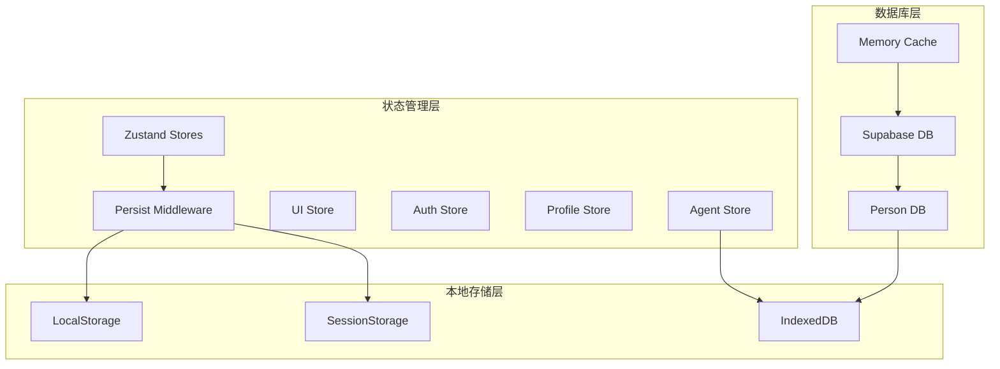
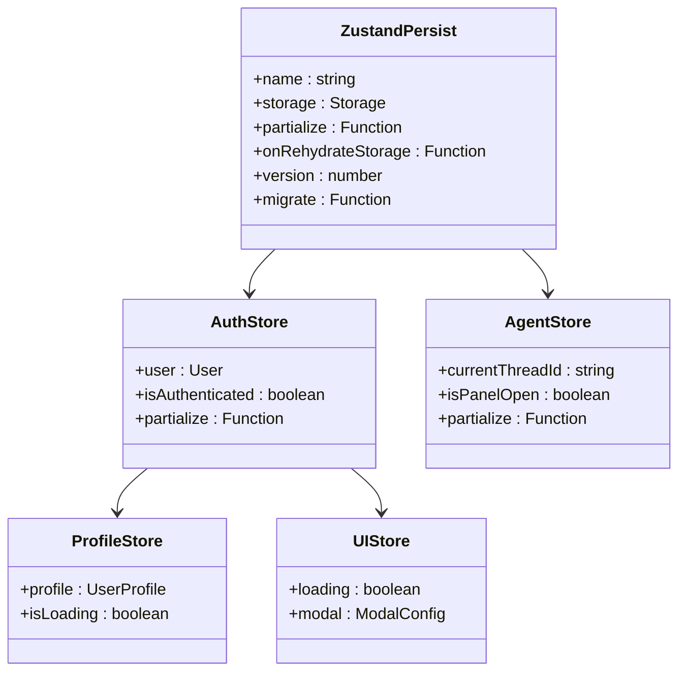
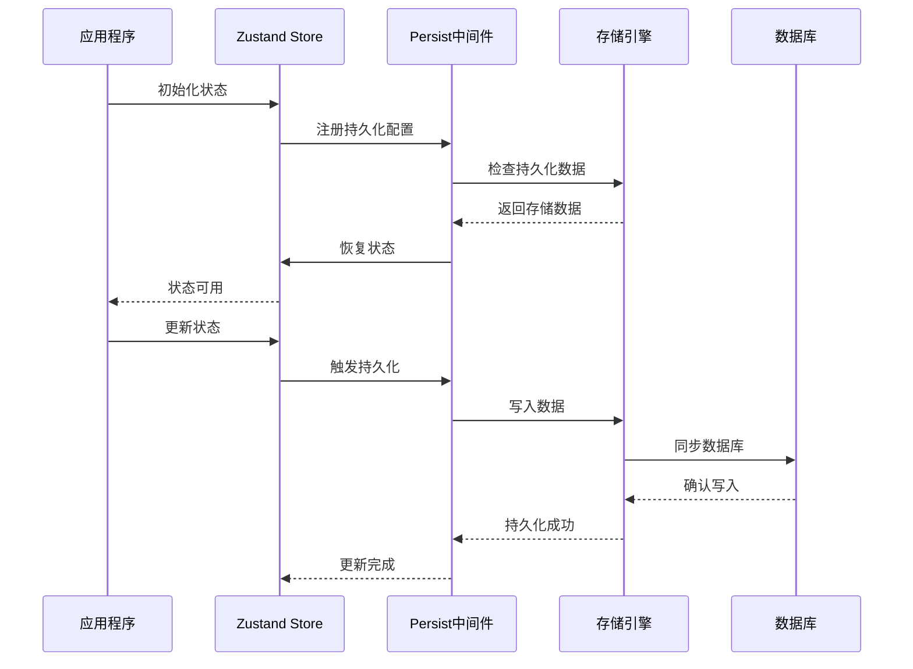
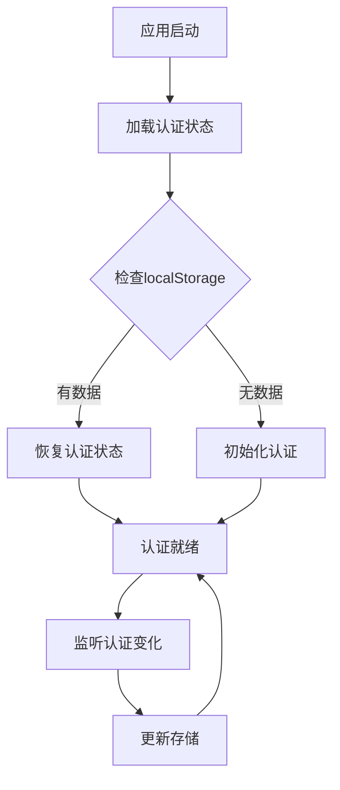
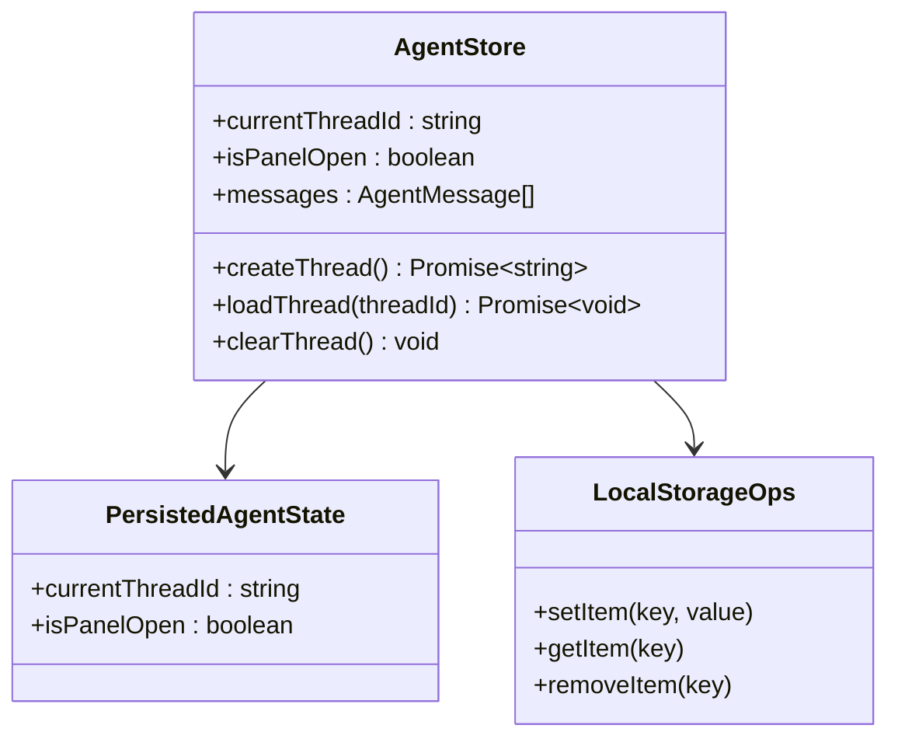
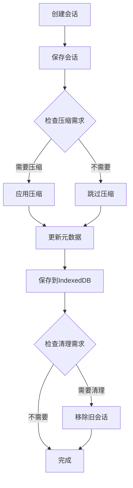
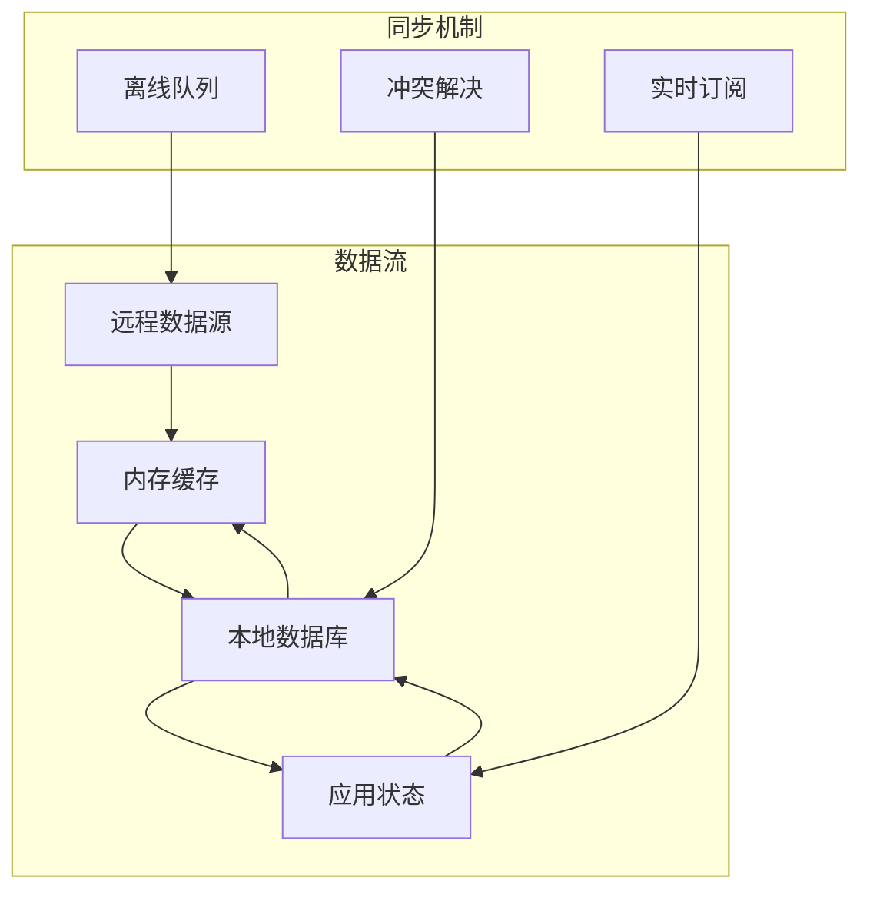
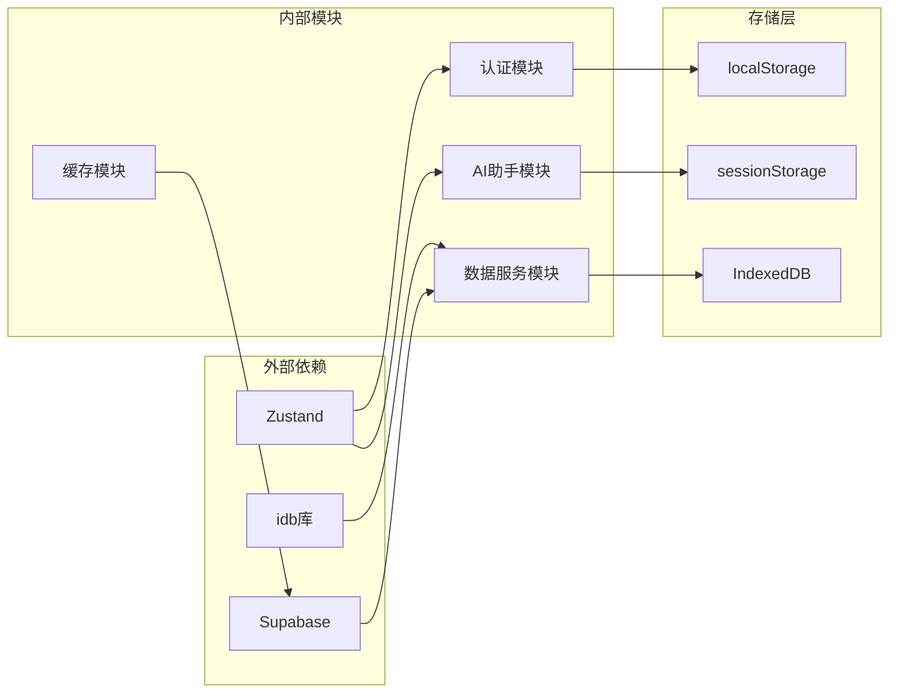
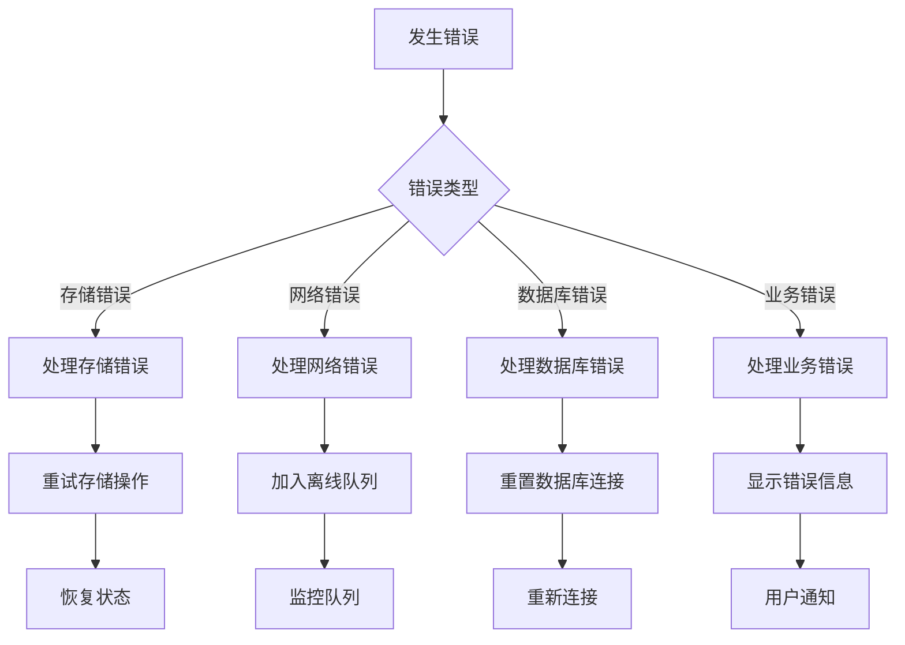

# 状态持久化机制

<cite>
**本文档引用的文件**
- [useAuthStore.ts](file://app/src/stores/useAuthStore.ts)
- [useAgentStore.ts](file://app/src/stores/useAgentStore.ts)
- [useProfileStore.ts](file://app/src/stores/useProfileStore.ts)
- [useUIStore.ts](file://app/src/stores/useUIStore.ts)
- [sessionStorage.ts](file://app/src/lib/agent/sessionStorage.ts)
- [DataService.ts](file://app/src/services/data/DataService.ts)
- [memoryCache.ts](file://app/src/services/cache/memoryCache.ts)
- [index.ts](file://app/src/services/db/index.ts)
- [personDB.ts](file://app/src/services/db/personDB.ts)
- [constants.ts](file://app/src/config/constants.ts)
- [syncManager.ts](file://app/src/services/data/sync/syncManager.ts)
</cite>

## 目录
1. [简介](#简介)
2. [项目结构](#项目结构)
3. [核心组件](#核心组件)
4. [架构概览](#架构概览)
5. [详细组件分析](#详细组件分析)
6. [依赖分析](#依赖分析)
7. [性能考虑](#性能考虑)
8. [故障排除指南](#故障排除指南)
9. [结论](#结论)

## 简介

本项目实现了多层次的状态持久化机制，结合了客户端状态管理、本地存储和数据库持久化策略。系统采用Zustand状态管理库配合persist中间件实现客户端状态的自动持久化，同时集成了IndexedDB数据库用于大规模数据的长期存储。

主要特性包括：
- 基于Zustand persist中间件的客户端状态持久化
- IndexedDB数据库的结构化数据存储
- 多种存储策略的灵活选择
- 数据迁移和版本兼容性处理
- 完整的状态恢复和错误处理机制

## 项目结构

项目的状态持久化机制分布在以下关键模块中：

**图表来源**
- [useAuthStore.ts:1-173](file://app/src/stores/useAuthStore.ts#L1-L173)
- [useAgentStore.ts:1-482](file://app/src/stores/useAgentStore.ts#L1-L482)
- [sessionStorage.ts:1-269](file://app/src/lib/agent/sessionStorage.ts#L1-L269)

**章节来源**
- [useAuthStore.ts:1-173](file://app/src/stores/useAuthStore.ts#L1-L173)
- [useAgentStore.ts:1-482](file://app/src/stores/useAgentStore.ts#L1-L482)
- [useProfileStore.ts:1-205](file://app/src/stores/useProfileStore.ts#L1-L205)
- [useUIStore.ts:1-105](file://app/src/stores/useUIStore.ts#L1-L105)

## 核心组件

### Zustand Persist 中间件配置

系统使用Zustand的persist中间件实现客户端状态的自动持久化。每个store都配置了特定的持久化策略：

**图表来源**
- [useAuthStore.ts:164-171](file://app/src/stores/useAuthStore.ts#L164-L171)
- [useAgentStore.ts:334-342](file://app/src/stores/useAgentStore.ts#L334-L342)

### 存储策略配置

系统实现了多种存储策略的组合使用：

| 存储类型 | 存储引擎 | 使用场景 | 特点 |
|---------|---------|---------|------|
| localStorage | 浏览器本地存储 | 简单状态数据 | 快速、容量有限 |
| sessionStorage | 会话存储 | 临时数据 | 会话结束自动清理 |
| IndexedDB | 结构化数据库 | 大量数据持久化 | 容量大、结构化存储 |
| 内存缓存 | 内存存储 | 高频访问数据 | 速度最快、易失性 |

**章节来源**
- [useAuthStore.ts:164-171](file://app/src/stores/useAuthStore.ts#L164-L171)
- [useAgentStore.ts:334-342](file://app/src/stores/useAgentStore.ts#L334-L342)
- [sessionStorage.ts:51-57](file://app/src/lib/agent/sessionStorage.ts#L51-L57)

## 架构概览

系统采用分层架构实现状态持久化：

**图表来源**
- [useAuthStore.ts:24-172](file://app/src/stores/useAuthStore.ts#L24-L172)
- [useAgentStore.ts:60-343](file://app/src/stores/useAgentStore.ts#L60-L343)

## 详细组件分析

### 认证状态持久化

认证状态使用localStorage进行持久化，只保存必要的认证信息：

**图表来源**
- [useAuthStore.ts:35-60](file://app/src/stores/useAuthStore.ts#L35-L60)
- [useAuthStore.ts:166-169](file://app/src/stores/useAuthStore.ts#L166-L169)

认证状态持久化配置特点：
- 只持久化用户基本信息和认证状态
- 自动监听认证状态变化并更新存储
- 错误处理和状态恢复机制

**章节来源**
- [useAuthStore.ts:24-172](file://app/src/stores/useAuthStore.ts#L24-L172)

### AI助手状态持久化

AI助手状态实现了部分状态持久化，只保存关键的会话信息：

**图表来源**
- [useAgentStore.ts:52-55](file://app/src/stores/useAgentStore.ts#L52-L55)
- [useAgentStore.ts:337-340](file://app/src/stores/useAgentStore.ts#L337-L340)

部分状态持久化策略：
- 仅持久化会话ID和面板状态
- 使用localStorage保存最后使用的会话ID
- 支持会话切换和恢复功能

**章节来源**
- [useAgentStore.ts:60-343](file://app/src/stores/useAgentStore.ts#L60-L343)

### 会话存储机制

系统使用IndexedDB实现对话历史的长期存储：

**图表来源**
- [sessionStorage.ts:94-116](file://app/src/lib/agent/sessionStorage.ts#L94-L116)
- [sessionStorage.ts:136-180](file://app/src/lib/agent/sessionStorage.ts#L136-L180)

会话存储特性：
- 使用IndexedDB存储大量对话数据
- 自动上下文压缩减少存储空间
- 会话数量限制和自动清理机制
- 用户级别的会话管理和检索

**章节来源**
- [sessionStorage.ts:1-269](file://app/src/lib/agent/sessionStorage.ts#L1-L269)

### 数据服务持久化

数据服务实现了复杂的多层持久化策略：

**图表来源**
- [DataService.ts:71-131](file://app/src/services/data/DataService.ts#L71-L131)
- [memoryCache.ts:20-41](file://app/src/services/cache/memoryCache.ts#L20-L41)

数据持久化策略：
- 读操作优先使用本地缓存
- 写操作先更新远程数据源
- 实时同步和冲突解决机制
- 离线队列和重试机制

**章节来源**
- [DataService.ts:1-419](file://app/src/services/data/DataService.ts#L1-L419)
- [memoryCache.ts:1-192](file://app/src/services/cache/memoryCache.ts#L1-L192)

## 依赖分析

系统状态持久化的依赖关系：

**图表来源**
- [useAuthStore.ts:4-8](file://app/src/stores/useAuthStore.ts#L4-L8)
- [useAgentStore.ts:8-24](file://app/src/stores/useAgentStore.ts#L8-L24)
- [sessionStorage.ts:8](file://app/src/lib/agent/sessionStorage.ts#L8)

**章节来源**
- [constants.ts:53-59](file://app/src/config/constants.ts#L53-L59)
- [index.ts:5-27](file://app/src/services/db/index.ts#L5-L27)

## 性能考虑

### 存储优化策略

1. **分层存储架构**
   - 高频访问数据使用内存缓存
   - 中等频率数据使用localStorage
   - 大量历史数据使用IndexedDB

2. **数据压缩机制**
   - 对话历史自动压缩
   - 智能压缩阈值判断
   - 压缩状态跟踪和恢复

3. **异步操作优化**
   - IndexedDB操作异步执行
   - 批量操作减少数据库往返
   - 内存缓存预加载机制

### 性能监控指标

| 指标类型 | 目标值 | 监控方式 |
|---------|--------|----------|
| 状态恢复时间 | < 100ms | 初始化计时器 |
| 数据库查询延迟 | < 50ms | 查询性能监控 |
| 缓存命中率 | > 80% | 缓存统计日志 |
| 内存使用 | < 50MB | 浏览器性能面板 |

## 故障排除指南

### 常见问题诊断

1. **状态丢失问题**
   - 检查浏览器存储权限
   - 验证localStorage可用性
   - 确认持久化配置正确性

2. **数据库连接问题**
   - 检查IndexedDB兼容性
   - 验证数据库版本升级
   - 监控数据库操作错误

3. **同步冲突问题**
   - 检查网络连接状态
   - 验证冲突解决策略
   - 监控离线队列处理

### 错误处理机制

**章节来源**
- [sessionStorage.ts:122-129](file://app/src/lib/agent/sessionStorage.ts#L122-L129)
- [DataService.ts:246-262](file://app/src/services/data/DataService.ts#L246-L262)

## 结论

本项目实现了完整的状态持久化解决方案，通过多层次的存储策略和智能的数据管理机制，提供了高性能、可靠的状态持久化能力。

### 主要优势

1. **灵活性** - 支持多种存储策略的组合使用
2. **可靠性** - 完善的错误处理和恢复机制
3. **性能** - 优化的缓存策略和异步操作
4. **可扩展性** - 模块化的架构设计

### 最佳实践建议

1. **合理选择存储策略** - 根据数据特性和使用频率选择合适的存储方式
2. **实施数据压缩** - 对大量数据应用压缩策略减少存储空间
3. **监控性能指标** - 建立完善的性能监控和告警机制
4. **定期维护清理** - 实施定期的数据清理和优化策略

通过这些机制的协同工作，系统能够提供稳定可靠的状态持久化服务，满足现代Web应用对数据持久化的需求。