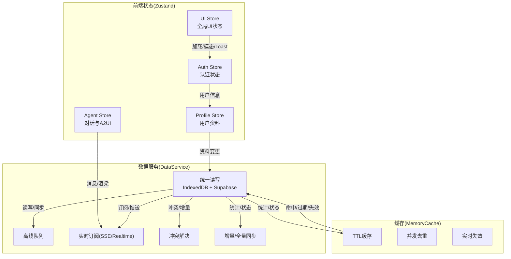
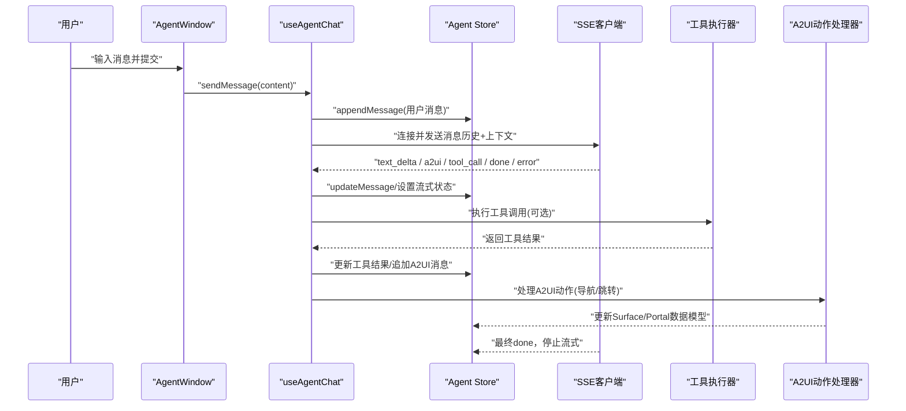
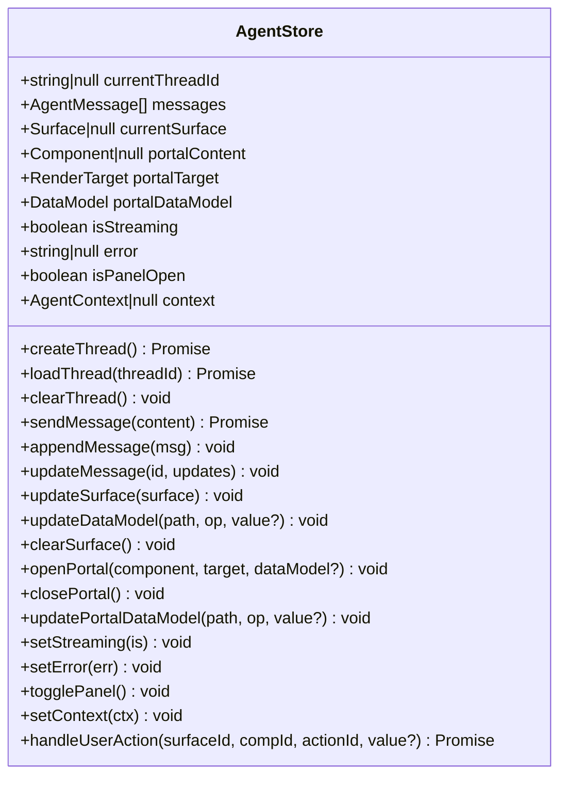
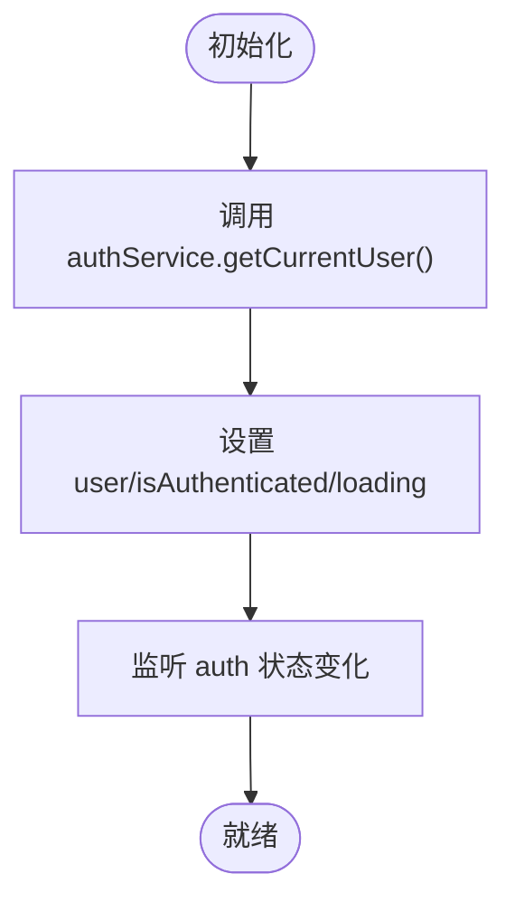
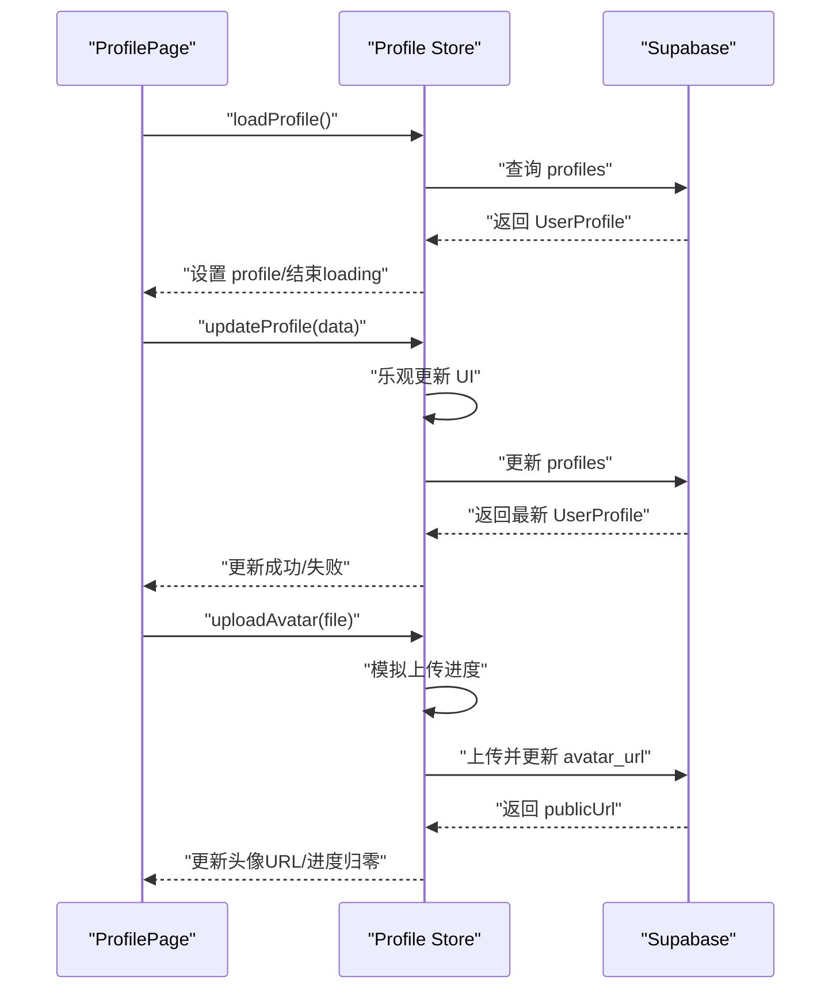
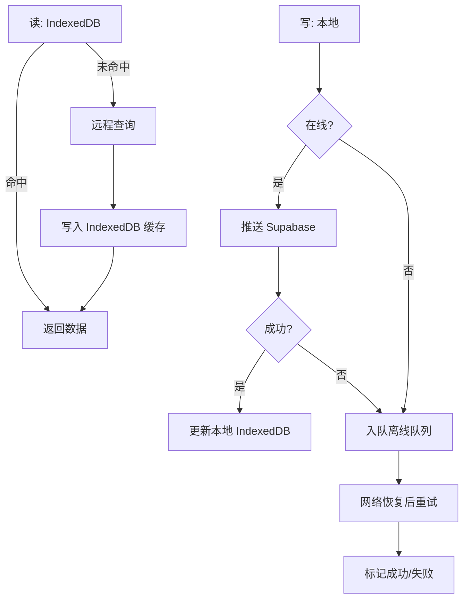
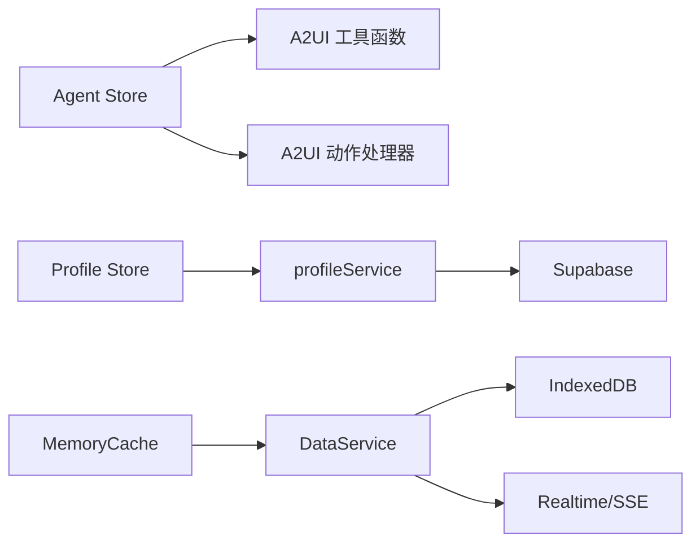

# 状态管理

<cite>
**本文引用的文件**
- [useAgentStore.ts](file://app/src/stores/useAgentStore.ts)
- [useAuthStore.ts](file://app/src/stores/useAuthStore.ts)
- [useProfileStore.ts](file://app/src/stores/useProfileStore.ts)
- [useUIStore.ts](file://app/src/stores/useUIStore.ts)
- [DataService.ts](file://app/src/services/data/DataService.ts)
- [agent.ts](file://app/src/types/agent.ts)
- [user.ts](file://app/src/types/user.ts)
- [a2uiActionHandler.ts](file://app/src/lib/agent/a2uiActionHandler.ts)
- [utils.ts](file://app/src/components/agent/a2ui/utils.ts)
- [memoryCache.ts](file://app/src/services/cache/memoryCache.ts)
- [DashboardPage.tsx](file://app/src/pages/DashboardPage.tsx)
- [ProfilePage.tsx](file://app/src/pages/ProfilePage.tsx)
- [AgentWindow.tsx](file://app/src/components/agent/AgentWindow.tsx)
- [useAgentChat.ts](file://app/src/hooks/useAgentChat.ts)
- [profileService.ts](file://app/src/services/api/profileService.ts)
</cite>

## 目录
1. [简介](#简介)
2. [项目结构](#项目结构)
3. [核心组件](#核心组件)
4. [架构总览](#架构总览)
5. [详细组件分析](#详细组件分析)
6. [依赖分析](#依赖分析)
7. [性能考量](#性能考量)
8. [故障排查指南](#故障排查指南)
9. [结论](#结论)
10. [附录](#附录)

## 简介
本文件系统性梳理基于 Zustand 的轻量级状态管理方案，覆盖 Store 设计原则、状态结构、异步操作处理、数据服务状态管理、持久化机制、最佳实践与调试技巧，并结合 Agent Store、Auth Store、Profile Store 等的实际使用场景，提供可操作的使用指南与可视化图示。

## 项目结构
本项目采用“按职责划分”的 Store 结构，配合统一数据服务层与内存缓存，形成“前端状态 + 数据服务 + 缓存”的三层协作模式：
- Store 层：Zustand 管理 UI 状态、认证状态、用户资料、Agent 对话状态
- 数据服务层：统一抽象读写、离线队列、实时订阅、冲突解决与增量同步
- 缓存层：内存缓存减少 API 请求，支持 TTL、并发去重与实时失效

图表来源
- [useAgentStore.ts:1-482](file://app/src/stores/useAgentStore.ts#L1-L482)
- [useAuthStore.ts:1-173](file://app/src/stores/useAuthStore.ts#L1-L173)
- [useProfileStore.ts:1-205](file://app/src/stores/useProfileStore.ts#L1-L205)
- [useUIStore.ts:1-105](file://app/src/stores/useUIStore.ts#L1-L105)
- [DataService.ts:1-419](file://app/src/services/data/DataService.ts#L1-L419)
- [memoryCache.ts:1-192](file://app/src/services/cache/memoryCache.ts#L1-L192)

章节来源
- [useAgentStore.ts:1-482](file://app/src/stores/useAgentStore.ts#L1-L482)
- [useAuthStore.ts:1-173](file://app/src/stores/useAuthStore.ts#L1-L173)
- [useProfileStore.ts:1-205](file://app/src/stores/useProfileStore.ts#L1-L205)
- [useUIStore.ts:1-105](file://app/src/stores/useUIStore.ts#L1-L105)
- [DataService.ts:1-419](file://app/src/services/data/DataService.ts#L1-L419)
- [memoryCache.ts:1-192](file://app/src/services/cache/memoryCache.ts#L1-L192)

## 核心组件
- Agent Store：负责对话会话、消息、Surface/Portal 渲染、A2UI 消息路由、流式状态与错误状态管理；支持持久化关键 UI 状态。
- Auth Store：封装 Supabase 认证初始化、注册/登录/登出、鉴权状态监听与持久化用户信息。
- Profile Store：封装用户资料加载、乐观更新、头像上传/删除、编辑状态与错误清理。
- UI Store：全局 UI 状态（加载、上传进度、模态框、Toast），提供统一的展示控制。
- DataService：统一数据访问，读优先 IndexedDB、写先云端再落本地缓存，支持离线队列、实时订阅、冲突解决与同步统计。
- MemoryCache：内存缓存，支持 TTL、并发去重、前缀批量失效与实时事件联动。

章节来源
- [useAgentStore.ts:1-482](file://app/src/stores/useAgentStore.ts#L1-L482)
- [useAuthStore.ts:1-173](file://app/src/stores/useAuthStore.ts#L1-L173)
- [useProfileStore.ts:1-205](file://app/src/stores/useProfileStore.ts#L1-L205)
- [useUIStore.ts:1-105](file://app/src/stores/useUIStore.ts#L1-L105)
- [DataService.ts:1-419](file://app/src/services/data/DataService.ts#L1-L419)
- [memoryCache.ts:1-192](file://app/src/services/cache/memoryCache.ts#L1-L192)

## 架构总览
以下序列图展示“用户发起消息 → Agent Store 管理消息 → SSE 客户端接收事件 → Store 更新 UI”的完整链路，以及“工具调用”和“A2UI 渲染”的扩展路径。

图表来源
- [AgentWindow.tsx:1-243](file://app/src/components/agent/AgentWindow.tsx#L1-L243)
- [useAgentChat.ts:1-380](file://app/src/hooks/useAgentChat.ts#L1-L380)
- [useAgentStore.ts:1-482](file://app/src/stores/useAgentStore.ts#L1-L482)
- [a2uiActionHandler.ts:1-77](file://app/src/lib/agent/a2uiActionHandler.ts#L1-L77)

章节来源
- [AgentWindow.tsx:1-243](file://app/src/components/agent/AgentWindow.tsx#L1-L243)
- [useAgentChat.ts:1-380](file://app/src/hooks/useAgentChat.ts#L1-L380)
- [useAgentStore.ts:1-482](file://app/src/stores/useAgentStore.ts#L1-L482)
- [a2uiActionHandler.ts:1-77](file://app/src/lib/agent/a2uiActionHandler.ts#L1-L77)

## 详细组件分析

### Agent Store（AI 助手状态）
- 职责边界
  - 会话管理：创建/加载/清空线程，维护当前线程 ID
  - 消息管理：追加/更新消息，支持流式标记
  - Surface/Portal 管理：根据 renderTarget 决定 inline 或 Portal 渲染，支持数据模型增删改
  - A2UI 消息路由：beginRendering/surfaceUpdate/dataModelUpdate/deleteSurface 的统一处理
  - 用户操作：触发 A2UI 动作（导航/跳转），并反馈通知消息
  - 上下文：注入 AgentContext（页面、视图、团队等）
- 状态结构
  - 会话：currentThreadId、messages
  - 渲染：currentSurface、portalContent/target/dataModel
  - UI：isStreaming、error、isPanelOpen
  - 上下文：context
- 持久化
  - 仅持久化 currentThreadId 与 isPanelOpen，避免敏感数据落地
- 异步与错误
  - 流式状态与错误状态分别管理，便于 UI 即时反馈
  - A2UI 消息按类型路由，缺失 component 时防御性告警
- 使用场景
  - AgentWindow 打开时检查上次会话并自动恢复
  - useAgentChat 负责事件聚合与工具调用执行

图表来源
- [useAgentStore.ts:1-482](file://app/src/stores/useAgentStore.ts#L1-L482)
- [agent.ts:222-306](file://app/src/types/agent.ts#L222-L306)

章节来源
- [useAgentStore.ts:1-482](file://app/src/stores/useAgentStore.ts#L1-L482)
- [agent.ts:222-306](file://app/src/types/agent.ts#L222-L306)

### Auth Store（认证状态）
- 职责边界
  - 初始化：监听 Supabase 认证状态变化，设置 user/isAuthenticated
  - 注册/登录/登出：封装错误码与错误信息，统一 loading 状态
  - 持久化：仅持久化 user 与 isAuthenticated，避免敏感数据
- 异步与错误
  - 所有操作均设置 isLoading 与 error，便于 UI 展示
  - 登录/注册失败时保留错误码，利于国际化与差异化提示
- 使用场景
  - Dashboard/Profile 页面首次进入时加载用户资料
  - ProtectedRoute 等路由守卫依赖 isAuthenticated

图表来源
- [useAuthStore.ts:1-173](file://app/src/stores/useAuthStore.ts#L1-L173)

章节来源
- [useAuthStore.ts:1-173](file://app/src/stores/useAuthStore.ts#L1-L173)

### Profile Store（用户资料）
- 职责边界
  - 加载/更新：乐观更新提升交互体验，失败回滚
  - 头像：压缩上传、进度模拟、URL 回写、删除清理
  - 编辑态：isEditing 控制表单编辑状态
  - 错误与重置：clearError/reset
- 异步与错误
  - 统一捕获错误并设置 error 字段，便于页面级错误展示
  - 上传进度通过定时器模拟，真实进度由 Storage API 提供
- 使用场景
  - ProfilePage 首次进入加载资料
  - 头像上传/删除与资料更新联动

图表来源
- [useProfileStore.ts:1-205](file://app/src/stores/useProfileStore.ts#L1-L205)
- [profileService.ts:1-345](file://app/src/services/api/profileService.ts#L1-L345)

章节来源
- [useProfileStore.ts:1-205](file://app/src/stores/useProfileStore.ts#L1-L205)
- [profileService.ts:1-345](file://app/src/services/api/profileService.ts#L1-L345)

### UI Store（全局 UI）
- 职责边界
  - 加载状态：全局 loading 控制
  - 上传进度：0-100 的进度条
  - 模态框：统一配置 open/title/content/onConfirm/onCancel
  - Toast：消息类型(success/error/warning/info)与持续时间
- 使用场景
  - ProfilePage 上传头像时展示进度与 Toast
  - 全局 Loading/确认对话框

章节来源
- [useUIStore.ts:1-105](file://app/src/stores/useUIStore.ts#L1-L105)

### 数据服务状态管理（DataService）
- 读写策略
  - 读：优先 IndexedDB（快速）
  - 写：先写 Supabase（权威）→ 成功后更新 IndexedDB（缓存）
- 同步与离线
  - 初始同步、增量同步、强制全量同步
  - 离线队列：写操作入队，联网后重试并标记成功/失败
  - 网络监听：在线自动触发队列处理
- 实时与冲突
  - Realtime 订阅：统一事件路由
  - 冲突解决：基于本地/远端数据的冲突检测与合并统计
- 状态与统计
  - 同步状态：idle/syncing/synced/error
  - 统计：队列大小、冲突数、最后同步时间等

图表来源
- [DataService.ts:1-419](file://app/src/services/data/DataService.ts#L1-L419)

章节来源
- [DataService.ts:1-419](file://app/src/services/data/DataService.ts#L1-L419)

### 内存缓存（MemoryCache）
- 特性
  - TTL 过期、手动失效、前缀批量失效
  - 并发去重：多请求复用同一 Promise
  - 实时失效：监听 dataservice 事件自动失效相关缓存
- 场景
  - 组织树、用户资料等不频繁变化数据的短期缓存

章节来源
- [memoryCache.ts:1-192](file://app/src/services/cache/memoryCache.ts#L1-L192)

### A2UI 动作与数据模型
- 动作处理
  - 导航类动作：跳转到 dashboard/persons/profile/settings/cloud-storage
  - Photo 功能已移除，返回明确错误
- 数据模型
  - 支持 setByPath/deleteByPath 的路径式更新
  - resolveBindings 将绑定值解析到组件 props

章节来源
- [a2uiActionHandler.ts:1-77](file://app/src/lib/agent/a2uiActionHandler.ts#L1-L77)
- [utils.ts:1-172](file://app/src/components/agent/a2ui/utils.ts#L1-L172)

## 依赖分析
- Store 间耦合
  - Agent Store 依赖 A2UI 工具函数与动作处理器，但不直接依赖 UI 组件
  - Profile Store 依赖 profileService，间接依赖 Supabase
  - UI Store 与各页面/组件松耦合，通过 Hook 使用
- 外部依赖
  - Zustand：状态容器
  - Supabase：认证、存储、实时订阅
  - IndexedDB：本地缓存
  - 浏览器事件：dataservice:* 事件驱动缓存失效

图表来源
- [useAgentStore.ts:1-482](file://app/src/stores/useAgentStore.ts#L1-L482)
- [a2uiActionHandler.ts:1-77](file://app/src/lib/agent/a2uiActionHandler.ts#L1-L77)
- [useProfileStore.ts:1-205](file://app/src/stores/useProfileStore.ts#L1-L205)
- [profileService.ts:1-345](file://app/src/services/api/profileService.ts#L1-L345)
- [DataService.ts:1-419](file://app/src/services/data/DataService.ts#L1-L419)
- [memoryCache.ts:1-192](file://app/src/services/cache/memoryCache.ts#L1-L192)

章节来源
- [useAgentStore.ts:1-482](file://app/src/stores/useAgentStore.ts#L1-L482)
- [useProfileStore.ts:1-205](file://app/src/stores/useProfileStore.ts#L1-L205)
- [profileService.ts:1-345](file://app/src/services/api/profileService.ts#L1-L345)
- [DataService.ts:1-419](file://app/src/services/data/DataService.ts#L1-L419)
- [memoryCache.ts:1-192](file://app/src/services/cache/memoryCache.ts#L1-L192)

## 性能考量
- Store 层
  - 使用选择器订阅，避免无关重渲染（如 useAgentChat 中对 messages 的直接读取）
  - 仅持久化必要字段，降低本地存储压力
- 数据层
  - 读优先 IndexedDB，写后缓存，减少网络往返
  - 离线队列与重试，保障弱网/离线场景
  - 内存缓存 TTL 与并发去重，降低重复请求
- UI 层
  - UI Store 统一管理全局加载与提示，避免分散状态

## 故障排查指南
- Agent Store
  - 无活动会话：发送消息前确保 currentThreadId 存在
  - A2UI 消息缺失 component：检查服务端消息结构，记录告警并跳过渲染
  - 流式中断：H2A 异步转向，调用 abort 后会标记中断状态
- Auth Store
  - 初始化失败：检查 Supabase 配置与网络；错误码可用于定位
  - 登录/注册异常：查看 error.message 与 code
- Profile Store
  - 上传进度停滞：确认 Storage API 是否返回进度；若无进度，需接入真实回调
  - 更新失败回滚：乐观更新失败会自动回滚到原始数据
- DataService
  - 同步异常：查看 syncManager 状态与队列统计；关注冲突数与最后同步时间
  - 离线队列堆积：网络恢复后自动处理，必要时触发手动处理

章节来源
- [useAgentStore.ts:1-482](file://app/src/stores/useAgentStore.ts#L1-L482)
- [useAuthStore.ts:1-173](file://app/src/stores/useAuthStore.ts#L1-L173)
- [useProfileStore.ts:1-205](file://app/src/stores/useProfileStore.ts#L1-L205)
- [DataService.ts:1-419](file://app/src/services/data/DataService.ts#L1-L419)

## 结论
本方案以 Zustand 为核心，结合 DataService 与 MemoryCache，构建了“轻量、可控、可扩展”的前端状态管理框架。通过清晰的 Store 职责划分、完善的异步与错误处理、合理的持久化与缓存策略，既满足日常业务需求，又为复杂场景（如离线、实时、冲突）预留了扩展空间。

## 附录

### Store 职责与使用场景速览
- Agent Store：AI 助手对话、A2UI 渲染、用户操作处理
- Auth Store：认证初始化、注册/登录/登出、鉴权状态
- Profile Store：用户资料加载/更新、头像上传/删除、编辑态
- UI Store：全局加载/模态/Toast 控制
- DataService：统一数据访问、离线队列、实时订阅、冲突解决
- MemoryCache：短期缓存、并发去重、实时失效

章节来源
- [useAgentStore.ts:1-482](file://app/src/stores/useAgentStore.ts#L1-L482)
- [useAuthStore.ts:1-173](file://app/src/stores/useAuthStore.ts#L1-L173)
- [useProfileStore.ts:1-205](file://app/src/stores/useProfileStore.ts#L1-L205)
- [useUIStore.ts:1-105](file://app/src/stores/useUIStore.ts#L1-L105)
- [DataService.ts:1-419](file://app/src/services/data/DataService.ts#L1-L419)
- [memoryCache.ts:1-192](file://app/src/services/cache/memoryCache.ts#L1-L192)