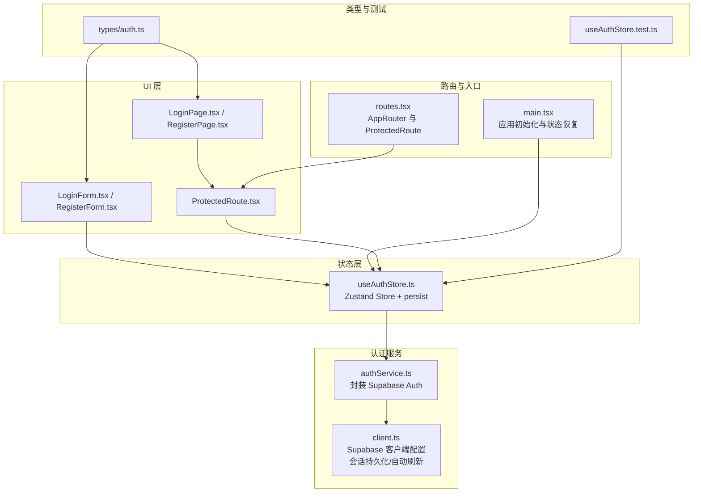
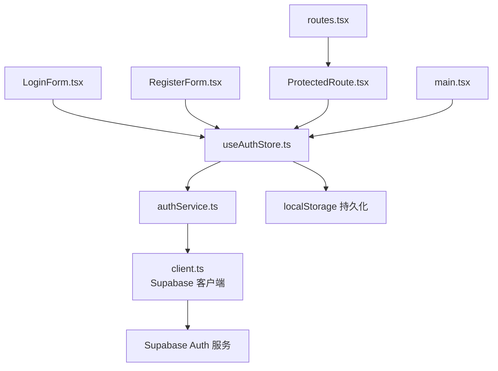
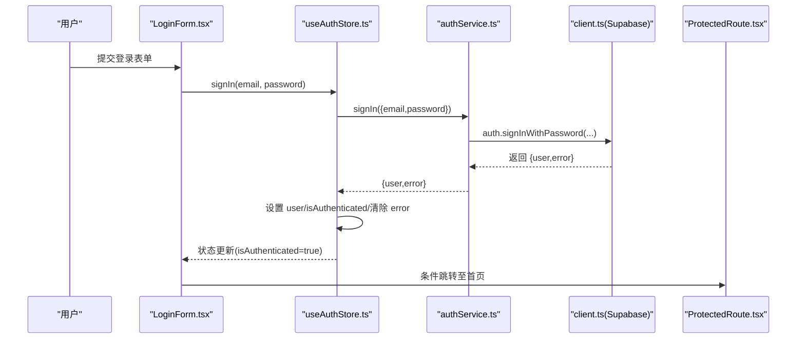
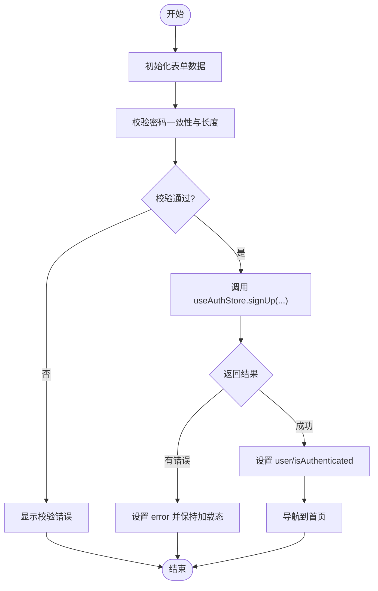
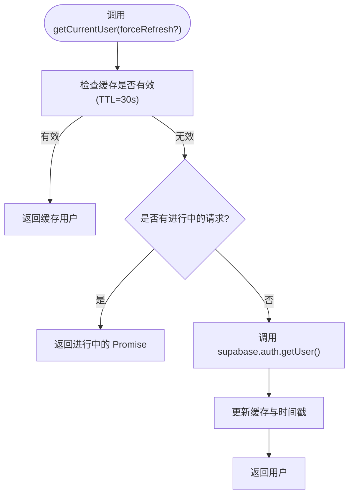
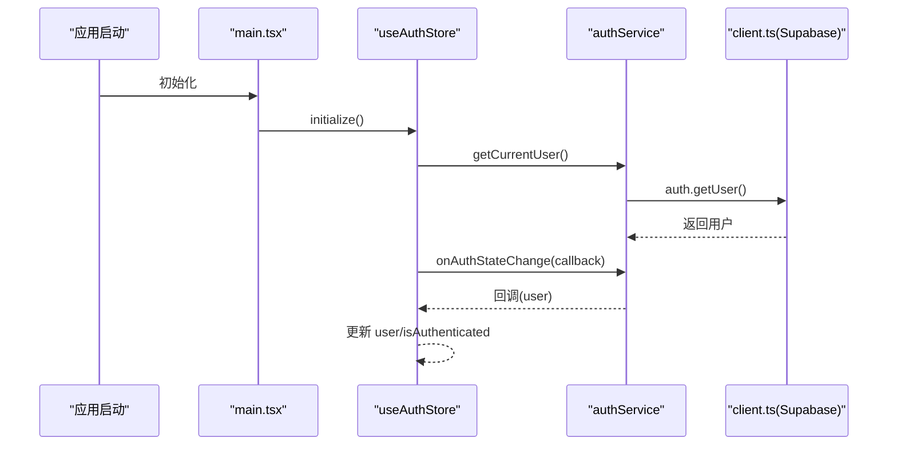
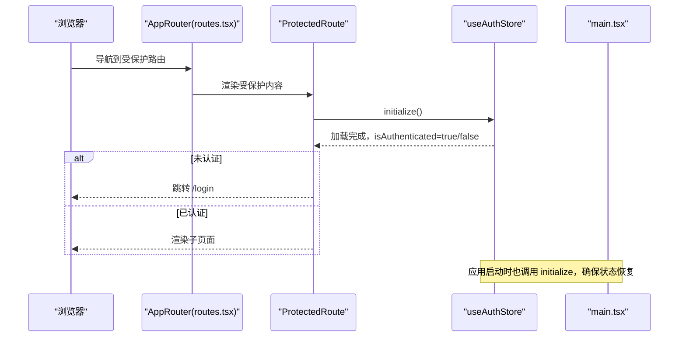
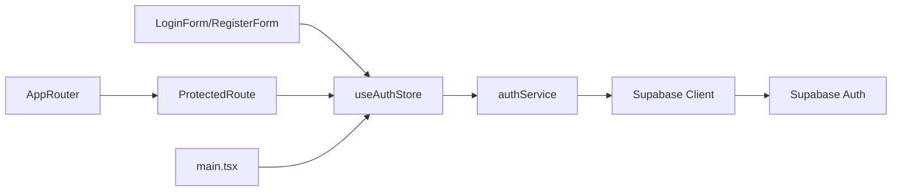

# 认证 Store 状态管理

<cite>
**本文引用的文件**
- [app/src/stores/useAuthStore.ts](file://app/src/stores/useAuthStore.ts)
- [app/src/lib/supabase/auth.ts](file://app/src/lib/supabase/auth.ts)
- [app/src/lib/supabase/client.ts](file://app/src/lib/supabase/client.ts)
- [app/src/auth/components/LoginForm.tsx](file://app/src/auth/components/LoginForm.tsx)
- [app/src/auth/components/RegisterForm.tsx](file://app/src/auth/components/RegisterForm.tsx)
- [app/src/auth/components/ProtectedRoute.tsx](file://app/src/auth/components/ProtectedRoute.tsx)
- [app/src/auth/pages/LoginPage.tsx](file://app/src/auth/pages/LoginPage.tsx)
- [app/src/auth/pages/RegisterPage.tsx](file://app/src/auth/pages/RegisterPage.tsx)
- [app/src/config/routes.tsx](file://app/src/config/routes.tsx)
- [app/src/main.tsx](file://app/src/main.tsx)
- [app/src/types/auth.ts](file://app/src/types/auth.ts)
- [app/src/stores/__tests__/useAuthStore.test.ts](file://app/src/stores/__tests__/useAuthStore.test.ts)
- [app/src/services/data/DataService.ts](file://app/src/services/data/DataService.ts)
- [app/package.json](file://app/package.json)
</cite>

## 目录
1. [简介](#简介)
2. [项目结构](#项目结构)
3. [核心组件](#核心组件)
4. [架构总览](#架构总览)
5. [详细组件分析](#详细组件分析)
6. [依赖关系分析](#依赖关系分析)
7. [性能考量](#性能考量)
8. [故障排查指南](#故障排查指南)
9. [结论](#结论)
10. [附录](#附录)

## 简介
本文件系统性梳理基于 Supabase Auth 的认证 Store 状态管理实现，覆盖登录状态管理、用户信息管理、认证令牌生命周期、会话持久化、路由保护与状态恢复等关键能力。文档同时提供最佳实践建议（安全、性能、体验），并通过图示与“章节来源”帮助读者快速定位实现细节。

## 项目结构
认证相关代码主要分布在以下模块：
- 状态层：useAuthStore（Zustand + persist）
- 认证服务封装：authService（对 Supabase Auth 的薄封装）
- Supabase 客户端：supabase（含会话持久化与自动刷新配置）
- 页面与组件：登录/注册表单、受保护路由
- 路由配置：AppRouter 与 ProtectedRoute
- 应用入口：main.tsx 中的初始化顺序与状态恢复
- 类型定义：认证相关接口与错误类型
- 测试：useAuthStore.test.ts（单元测试）



图表来源
- [app/src/stores/useAuthStore.ts:1-173](file://app/src/stores/useAuthStore.ts#L1-L173)
- [app/src/lib/supabase/auth.ts:1-120](file://app/src/lib/supabase/auth.ts#L1-L120)
- [app/src/lib/supabase/client.ts:1-34](file://app/src/lib/supabase/client.ts#L1-L34)
- [app/src/auth/components/LoginForm.tsx:1-76](file://app/src/auth/components/LoginForm.tsx#L1-L76)
- [app/src/auth/components/RegisterForm.tsx:1-119](file://app/src/auth/components/RegisterForm.tsx#L1-L119)
- [app/src/auth/components/ProtectedRoute.tsx:1-32](file://app/src/auth/components/ProtectedRoute.tsx#L1-L32)
- [app/src/auth/pages/LoginPage.tsx:1-37](file://app/src/auth/pages/LoginPage.tsx#L1-L37)
- [app/src/auth/pages/RegisterPage.tsx:1-37](file://app/src/auth/pages/RegisterPage.tsx#L1-L37)
- [app/src/config/routes.tsx:1-78](file://app/src/config/routes.tsx#L1-L78)
- [app/src/main.tsx:1-78](file://app/src/main.tsx#L1-L78)
- [app/src/types/auth.ts:1-21](file://app/src/types/auth.ts#L1-L21)
- [app/src/stores/__tests__/useAuthStore.test.ts:1-182](file://app/src/stores/__tests__/useAuthStore.test.ts#L1-L182)

章节来源
- [app/src/stores/useAuthStore.ts:1-173](file://app/src/stores/useAuthStore.ts#L1-L173)
- [app/src/lib/supabase/auth.ts:1-120](file://app/src/lib/supabase/auth.ts#L1-L120)
- [app/src/lib/supabase/client.ts:1-34](file://app/src/lib/supabase/client.ts#L1-L34)
- [app/src/auth/components/LoginForm.tsx:1-76](file://app/src/auth/components/LoginForm.tsx#L1-L76)
- [app/src/auth/components/RegisterForm.tsx:1-119](file://app/src/auth/components/RegisterForm.tsx#L1-L119)
- [app/src/auth/components/ProtectedRoute.tsx:1-32](file://app/src/auth/components/ProtectedRoute.tsx#L1-L32)
- [app/src/auth/pages/LoginPage.tsx:1-37](file://app/src/auth/pages/LoginPage.tsx#L1-L37)
- [app/src/auth/pages/RegisterPage.tsx:1-37](file://app/src/auth/pages/RegisterPage.tsx#L1-L37)
- [app/src/config/routes.tsx:1-78](file://app/src/config/routes.tsx#L1-L78)
- [app/src/main.tsx:1-78](file://app/src/main.tsx#L1-L78)
- [app/src/types/auth.ts:1-21](file://app/src/types/auth.ts#L1-L21)
- [app/src/stores/__tests__/useAuthStore.test.ts:1-182](file://app/src/stores/__tests__/useAuthStore.test.ts#L1-L182)

## 核心组件
- 认证 Store（useAuthStore）
  - 状态字段：user、isLoading、isAuthenticated、error
  - 行为方法：initialize、signUp、signIn、signOut、clearError
  - 持久化策略：persist（仅持久化 user 与 isAuthenticated）
- 认证服务（authService）
  - 封装 Supabase Auth：注册、登录、登出、获取当前用户、获取会话、监听状态变化
  - 内置缓存：30 秒 TTL 的 getUser 缓存，避免重复请求
- Supabase 客户端（client.ts）
  - 自动刷新与会话持久化：autoRefreshToken、persistSession、storage
  - MSW 模式适配：代理路径 /supabase-proxy，确保 Service Worker 可拦截
- UI 组件
  - 登录/注册表单：收集表单数据、提交认证、显示错误、控制按钮禁用
  - 受保护路由：初始化认证状态、加载态、未认证跳转
- 路由与入口
  - AppRouter：按需加载页面组件，配置认证与受保护路由
  - main.tsx：初始化顺序（主题 → MSW → 认证 → 数据服务 → 渲染），并在应用启动时调用 initialize

章节来源
- [app/src/stores/useAuthStore.ts:10-173](file://app/src/stores/useAuthStore.ts#L10-L173)
- [app/src/lib/supabase/auth.ts:29-120](file://app/src/lib/supabase/auth.ts#L29-L120)
- [app/src/lib/supabase/client.ts:26-34](file://app/src/lib/supabase/client.ts#L26-L34)
- [app/src/auth/components/LoginForm.tsx:11-76](file://app/src/auth/components/LoginForm.tsx#L11-L76)
- [app/src/auth/components/RegisterForm.tsx:11-119](file://app/src/auth/components/RegisterForm.tsx#L11-L119)
- [app/src/auth/components/ProtectedRoute.tsx:14-32](file://app/src/auth/components/ProtectedRoute.tsx#L14-L32)
- [app/src/config/routes.tsx:24-65](file://app/src/config/routes.tsx#L24-L65)
- [app/src/main.tsx:23-78](file://app/src/main.tsx#L23-L78)

## 架构总览
认证系统围绕“状态层 → 服务层 → 客户端层”的分层设计，结合 UI 组件与路由保护，形成完整的认证闭环。



图表来源
- [app/src/auth/components/LoginForm.tsx:11-76](file://app/src/auth/components/LoginForm.tsx#L11-L76)
- [app/src/auth/components/RegisterForm.tsx:11-119](file://app/src/auth/components/RegisterForm.tsx#L11-L119)
- [app/src/stores/useAuthStore.ts:24-172](file://app/src/stores/useAuthStore.ts#L24-L172)
- [app/src/lib/supabase/auth.ts:29-120](file://app/src/lib/supabase/auth.ts#L29-L120)
- [app/src/lib/supabase/client.ts:26-34](file://app/src/lib/supabase/client.ts#L26-L34)
- [app/src/auth/components/ProtectedRoute.tsx:14-32](file://app/src/auth/components/ProtectedRoute.tsx#L14-L32)
- [app/src/config/routes.tsx:24-65](file://app/src/config/routes.tsx#L24-L65)
- [app/src/main.tsx:47-47](file://app/src/main.tsx#L47-L47)

## 详细组件分析

### 认证 Store（useAuthStore）状态模型
- 状态字段
  - user：当前用户对象或 null
  - isLoading：初始化/请求中的加载态
  - isAuthenticated：是否已认证
  - error：认证错误对象（包含 message 与可选 code）
- 行为方法
  - initialize：初始化认证状态，拉取当前用户并订阅 auth 状态变化
  - signUp/signIn/signOut：封装 authService 的注册/登录/登出
  - clearError：清除错误

```mermaid
classDiagram
class AuthState {
+User user
+boolean isLoading
+boolean isAuthenticated
+AuthError error
+initialize() Promise~void~
+signUp(email, password, displayName) Promise~void~
+signIn(email, password) Promise~void~
+signOut() Promise~void~
+clearError() void
}
class AuthService {
+signUp(credentials) Promise~AuthResponse~
+signIn(credentials) Promise~AuthResponse~
+signOut() Promise~{ error }~
+getCurrentUser(forceRefresh) Promise~User|null~
+getSession() Promise~Session|null~
+onAuthStateChange(callback) Subscription
}
class SupabaseClient {
+auth
}
AuthState --> AuthService : "调用"
AuthService --> SupabaseClient : "使用"
```

图表来源
- [app/src/stores/useAuthStore.ts:10-22](file://app/src/stores/useAuthStore.ts#L10-L22)
- [app/src/stores/useAuthStore.ts:24-172](file://app/src/stores/useAuthStore.ts#L24-L172)
- [app/src/lib/supabase/auth.ts:29-120](file://app/src/lib/supabase/auth.ts#L29-L120)
- [app/src/lib/supabase/client.ts:26-34](file://app/src/lib/supabase/client.ts#L26-L34)

章节来源
- [app/src/stores/useAuthStore.ts:10-173](file://app/src/stores/useAuthStore.ts#L10-L173)

### 登录流程状态管理（序列图）
该序列图展示从用户提交登录表单到状态更新与导航的整体流程。



图表来源
- [app/src/auth/components/LoginForm.tsx:19-25](file://app/src/auth/components/LoginForm.tsx#L19-L25)
- [app/src/stores/useAuthStore.ts:100-126](file://app/src/stores/useAuthStore.ts#L100-L126)
- [app/src/lib/supabase/auth.ts:53-63](file://app/src/lib/supabase/auth.ts#L53-L63)
- [app/src/lib/supabase/client.ts:26-34](file://app/src/lib/supabase/client.ts#L26-L34)
- [app/src/auth/components/ProtectedRoute.tsx:18-31](file://app/src/auth/components/ProtectedRoute.tsx#L18-L31)

章节来源
- [app/src/auth/components/LoginForm.tsx:19-25](file://app/src/auth/components/LoginForm.tsx#L19-L25)
- [app/src/stores/useAuthStore.ts:100-126](file://app/src/stores/useAuthStore.ts#L100-L126)
- [app/src/lib/supabase/auth.ts:53-63](file://app/src/lib/supabase/auth.ts#L53-L63)
- [app/src/auth/components/ProtectedRoute.tsx:18-31](file://app/src/auth/components/ProtectedRoute.tsx#L18-L31)

### 注册流程与表单校验（流程图）
注册流程包含前端表单校验与后端注册调用，成功后进入认证态并导航。



图表来源
- [app/src/auth/components/RegisterForm.tsx:22-40](file://app/src/auth/components/RegisterForm.tsx#L22-L40)
- [app/src/stores/useAuthStore.ts:65-95](file://app/src/stores/useAuthStore.ts#L65-L95)
- [app/src/lib/supabase/auth.ts:33-48](file://app/src/lib/supabase/auth.ts#L33-L48)

章节来源
- [app/src/auth/components/RegisterForm.tsx:22-40](file://app/src/auth/components/RegisterForm.tsx#L22-L40)
- [app/src/stores/useAuthStore.ts:65-95](file://app/src/stores/useAuthStore.ts#L65-L95)
- [app/src/lib/supabase/auth.ts:33-48](file://app/src/lib/supabase/auth.ts#L33-L48)

### 用户信息管理与缓存机制
- 当前用户获取：authService.getCurrentUser 支持强制刷新与缓存（30 秒 TTL），避免频繁调用 /user 接口
- 用户资料更新：通过 Supabase Options 在注册时传入 display_name；实际资料更新可通过业务服务层进行（如 DataService 的远程 API 层）



图表来源
- [app/src/lib/supabase/auth.ts:76-101](file://app/src/lib/supabase/auth.ts#L76-L101)

章节来源
- [app/src/lib/supabase/auth.ts:7-120](file://app/src/lib/supabase/auth.ts#L7-L120)

### 认证令牌生命周期管理
- 自动刷新与会话持久化：client.ts 中启用 autoRefreshToken、persistSession，并使用 localStorage 存储会话
- MSW 模式：在开发且启用 MSW 时，关闭自动刷新与 URL 会话检测，保证请求被 Service Worker 拦截
- 监听状态变化：useAuthStore.initialize 中订阅 authService.onAuthStateChange，实时更新 user/isAuthenticated



图表来源
- [app/src/main.tsx:47-47](file://app/src/main.tsx#L47-L47)
- [app/src/stores/useAuthStore.ts:35-60](file://app/src/stores/useAuthStore.ts#L35-L60)
- [app/src/lib/supabase/auth.ts:114-118](file://app/src/lib/supabase/auth.ts#L114-L118)
- [app/src/lib/supabase/client.ts:26-34](file://app/src/lib/supabase/client.ts#L26-L34)

章节来源
- [app/src/lib/supabase/client.ts:26-34](file://app/src/lib/supabase/client.ts#L26-L34)
- [app/src/stores/useAuthStore.ts:35-60](file://app/src/stores/useAuthStore.ts#L35-L60)
- [app/src/lib/supabase/auth.ts:114-118](file://app/src/lib/supabase/auth.ts#L114-L118)

### 路由保护与状态恢复
- ProtectedRoute：在组件挂载时执行 initialize，处理加载态与未认证跳转
- AppRouter：将受保护路由包裹在 ProtectedRoute 下，确保访问受控
- 应用入口：main.tsx 在渲染前调用 useAuthStore.getState().initialize，确保全局状态可用



图表来源
- [app/src/config/routes.tsx:34-41](file://app/src/config/routes.tsx#L34-L41)
- [app/src/auth/components/ProtectedRoute.tsx:14-31](file://app/src/auth/components/ProtectedRoute.tsx#L14-L31)
- [app/src/main.tsx:47-47](file://app/src/main.tsx#L47-L47)

章节来源
- [app/src/config/routes.tsx:24-65](file://app/src/config/routes.tsx#L24-L65)
- [app/src/auth/components/ProtectedRoute.tsx:14-31](file://app/src/auth/components/ProtectedRoute.tsx#L14-L31)
- [app/src/main.tsx:47-47](file://app/src/main.tsx#L47-L47)

### 登出与错误处理
- 登出：调用 authService.signOut，成功后清空 user 与 isAuthenticated，并保留错误处理分支
- 错误处理：Store 中统一设置 error 对象（包含 message 与可选 code），组件可读取并展示

章节来源
- [app/src/stores/useAuthStore.ts:131-157](file://app/src/stores/useAuthStore.ts#L131-L157)
- [app/src/lib/supabase/auth.ts:68-71](file://app/src/lib/supabase/auth.ts#L68-L71)
- [app/src/auth/components/LoginForm.tsx:57-61](file://app/src/auth/components/LoginForm.tsx#L57-L61)
- [app/src/auth/components/RegisterForm.tsx:100-104](file://app/src/auth/components/RegisterForm.tsx#L100-L104)

## 依赖关系分析
- 状态层依赖服务层：useAuthStore 通过 authService 调用 Supabase Auth
- 服务层依赖客户端：authService 使用 supabase.auth API
- 客户端依赖 Supabase 后端：client.ts 创建 Supabase 客户端实例
- UI 依赖状态层：表单与受保护路由通过 Store 管理认证状态
- 路由依赖受保护组件：AppRouter 将受保护路由包裹在 ProtectedRoute 中
- 入口依赖状态层：main.tsx 在启动时调用 initialize



图表来源
- [app/src/stores/useAuthStore.ts:24-172](file://app/src/stores/useAuthStore.ts#L24-L172)
- [app/src/lib/supabase/auth.ts:29-120](file://app/src/lib/supabase/auth.ts#L29-L120)
- [app/src/lib/supabase/client.ts:26-34](file://app/src/lib/supabase/client.ts#L26-L34)
- [app/src/auth/components/LoginForm.tsx:13-13](file://app/src/auth/components/LoginForm.tsx#L13-L13)
- [app/src/auth/components/RegisterForm.tsx:13-13](file://app/src/auth/components/RegisterForm.tsx#L13-L13)
- [app/src/auth/components/ProtectedRoute.tsx:15-15](file://app/src/auth/components/ProtectedRoute.tsx#L15-L15)
- [app/src/config/routes.tsx:24-65](file://app/src/config/routes.tsx#L24-L65)
- [app/src/main.tsx:47-47](file://app/src/main.tsx#L47-L47)

章节来源
- [app/src/stores/useAuthStore.ts:24-172](file://app/src/stores/useAuthStore.ts#L24-L172)
- [app/src/lib/supabase/auth.ts:29-120](file://app/src/lib/supabase/auth.ts#L29-L120)
- [app/src/lib/supabase/client.ts:26-34](file://app/src/lib/supabase/client.ts#L26-L34)
- [app/src/auth/components/LoginForm.tsx:13-13](file://app/src/auth/components/LoginForm.tsx#L13-L13)
- [app/src/auth/components/RegisterForm.tsx:13-13](file://app/src/auth/components/RegisterForm.tsx#L13-L13)
- [app/src/auth/components/ProtectedRoute.tsx:15-15](file://app/src/auth/components/ProtectedRoute.tsx#L15-L15)
- [app/src/config/routes.tsx:24-65](file://app/src/config/routes.tsx#L24-L65)
- [app/src/main.tsx:47-47](file://app/src/main.tsx#L47-L47)

## 性能考量
- 缓存策略：authService.getCurrentUser 使用 30 秒 TTL 与进行中请求去重，降低 /user 接口压力
- 会话持久化：localStorage 存储会话，减少刷新后重新登录成本
- 初始化顺序：main.tsx 中先启动 MSW（开发模式），再初始化认证，避免白屏与真实请求
- 路由懒加载：AppRouter 使用 React.lazy，减小首屏体积
- 网络与离线：DataService 的离线队列与增量同步策略，间接提升整体性能与稳定性

章节来源
- [app/src/lib/supabase/auth.ts:7-120](file://app/src/lib/supabase/auth.ts#L7-L120)
- [app/src/lib/supabase/client.ts:26-34](file://app/src/lib/supabase/client.ts#L26-L34)
- [app/src/main.tsx:23-78](file://app/src/main.tsx#L23-L78)
- [app/src/config/routes.tsx:10-10](file://app/src/config/routes.tsx#L10-L10)
- [app/src/services/data/DataService.ts:76-101](file://app/src/services/data/DataService.ts#L76-L101)

## 故障排查指南
- 环境变量缺失
  - 现象：控制台提示缺少 Supabase 环境变量，认证功能被禁用
  - 处理：检查 VITE_SUPABASE_URL 与 VITE_SUPABASE_ANON_KEY 是否配置
- MSW 模式请求拦截
  - 现象：直接使用 localhost:54321 会导致跨域，MSW 无法拦截
  - 处理：在 MSW 模式下使用 /supabase-proxy 代理路径
- 登录/注册错误
  - 现象：表单显示错误信息
  - 处理：Store 中的 error 字段包含 message 与可选 code，组件根据 error 渲染
- 初始化失败
  - 现象：initialize 抛错，isLoading 未复位
  - 处理：Store 捕获异常并设置 error，调用方应调用 clearError 清理
- 单元测试参考
  - 可参考 useAuthStore.test.ts 的断言与 mock 方案，验证 initialize/signIn/signUp/signOut/clearError 的行为

章节来源
- [app/src/lib/supabase/client.ts:18-24](file://app/src/lib/supabase/client.ts#L18-L24)
- [app/src/lib/supabase/client.ts:13-16](file://app/src/lib/supabase/client.ts#L13-L16)
- [app/src/auth/components/LoginForm.tsx:57-61](file://app/src/auth/components/LoginForm.tsx#L57-L61)
- [app/src/auth/components/RegisterForm.tsx:100-104](file://app/src/auth/components/RegisterForm.tsx#L100-L104)
- [app/src/stores/useAuthStore.ts:52-59](file://app/src/stores/useAuthStore.ts#L52-L59)
- [app/src/stores/__tests__/useAuthStore.test.ts:62-72](file://app/src/stores/__tests__/useAuthStore.test.ts#L62-L72)

## 结论
本认证 Store 采用 Zustand + persist 实现轻量、可持久化的状态管理，配合 authService 对 Supabase Auth 的薄封装与 client.ts 的会话持久化/自动刷新配置，构建了稳定可靠的登录与会话管理能力。通过 ProtectedRoute 与 AppRouter 的路由保护，以及 main.tsx 的初始化顺序保障，实现了良好的用户体验与可维护性。建议在生产环境中进一步完善错误上报、埋点与安全加固（如 CSRF、XSS 防护）。

## 附录
- 使用指南
  - 登录：在 LoginPage 中填写邮箱与密码，提交后若 isAuthenticated 为真则跳转首页
  - 注册：在 RegisterPage 中填写昵称、邮箱、密码与确认密码，满足校验后提交
  - 登出：调用 useAuthStore.getState().signOut，在成功后 Store 会清空 user 与 isAuthenticated
  - 清理错误：调用 useAuthStore.getState().clearError
- 最佳实践
  - 安全：严格校验前端输入，避免明文传输敏感信息；后端开启 HTTPS 与安全头
  - 性能：利用 authService 的缓存与持久化，减少不必要的请求；合理使用路由懒加载
  - 体验：在加载态时提供反馈；错误信息清晰可读；支持一键清理错误

章节来源
- [app/src/auth/pages/LoginPage.tsx:7-34](file://app/src/auth/pages/LoginPage.tsx#L7-L34)
- [app/src/auth/pages/RegisterPage.tsx:7-34](file://app/src/auth/pages/RegisterPage.tsx#L7-L34)
- [app/src/stores/useAuthStore.ts:162-162](file://app/src/stores/useAuthStore.ts#L162-L162)
- [app/src/auth/components/LoginForm.tsx:20-25](file://app/src/auth/components/LoginForm.tsx#L20-L25)
- [app/src/auth/components/RegisterForm.tsx:36-40](file://app/src/auth/components/RegisterForm.tsx#L36-L40)