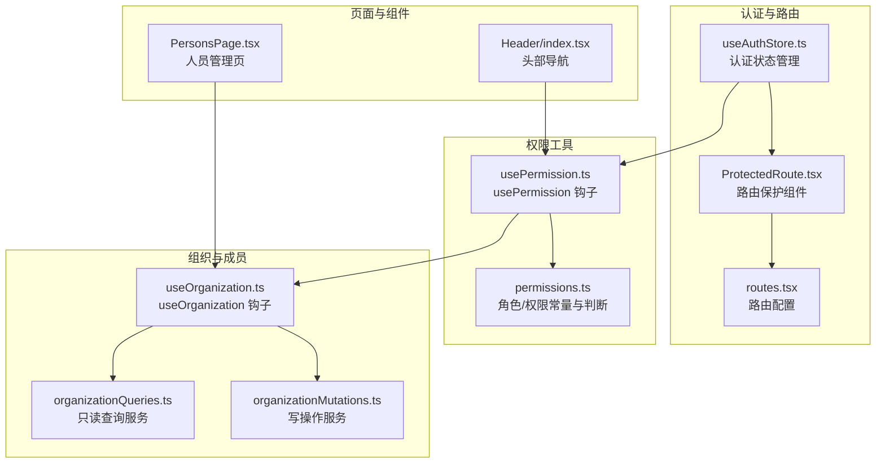
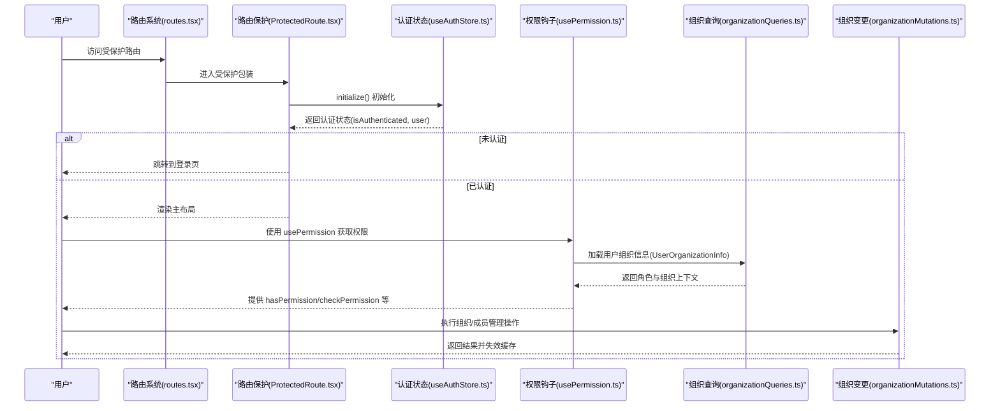
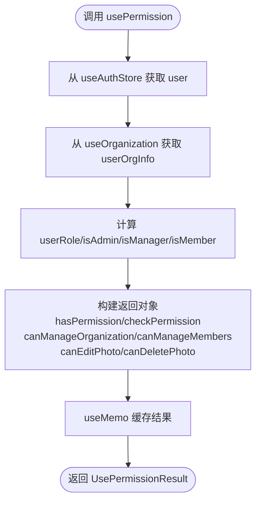
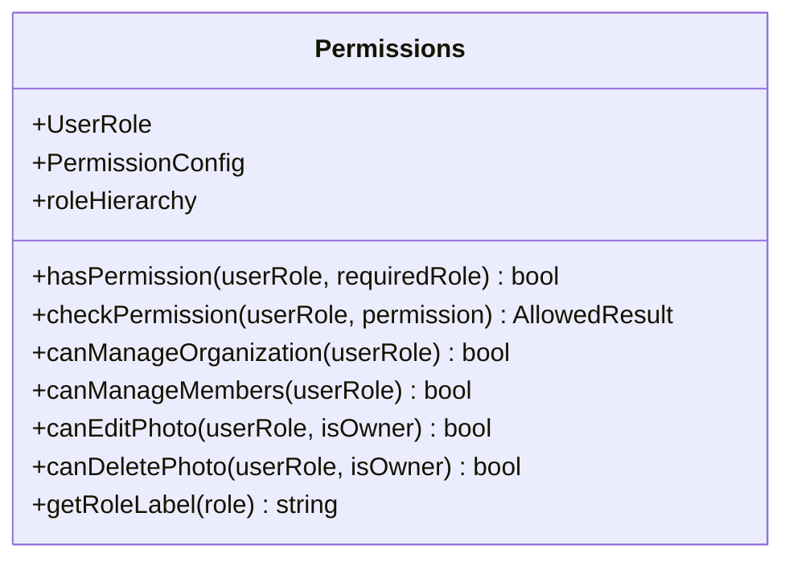
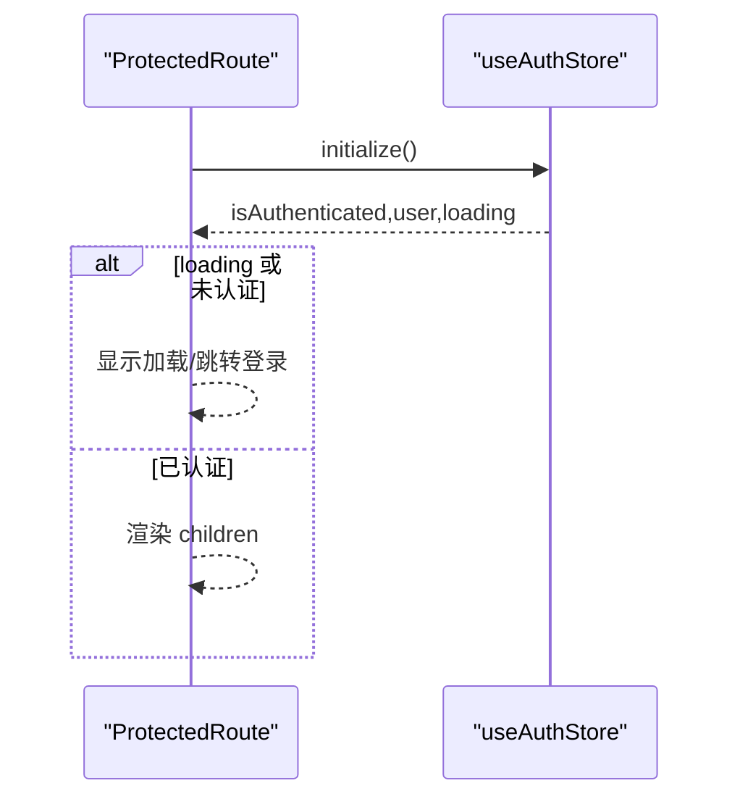
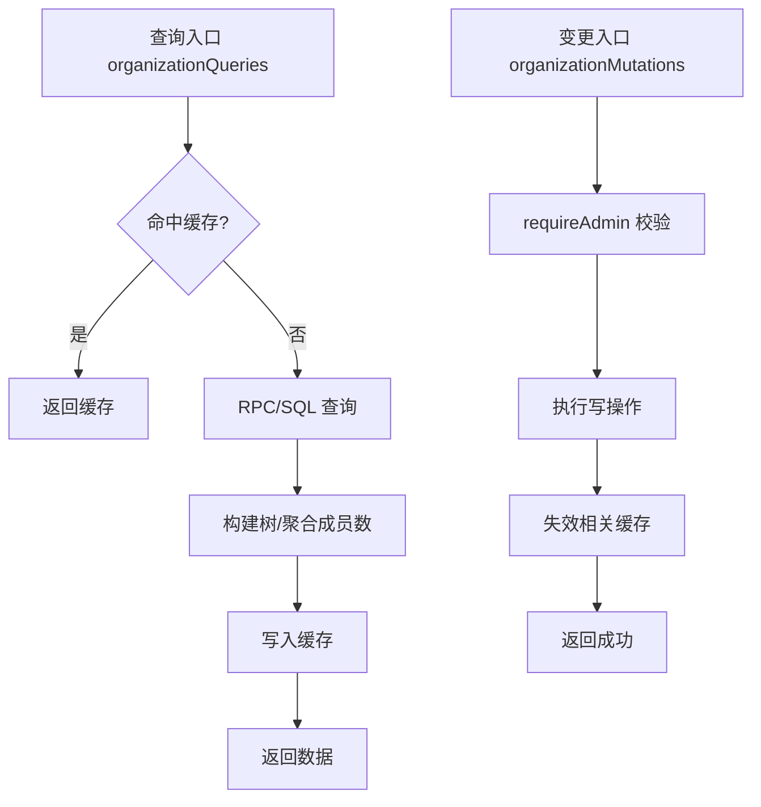
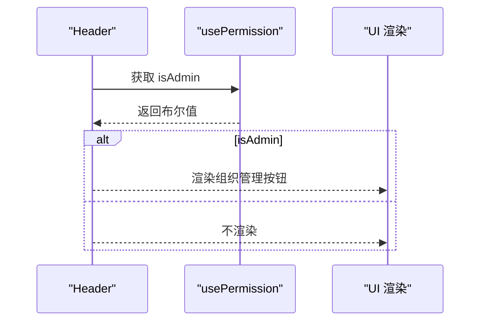
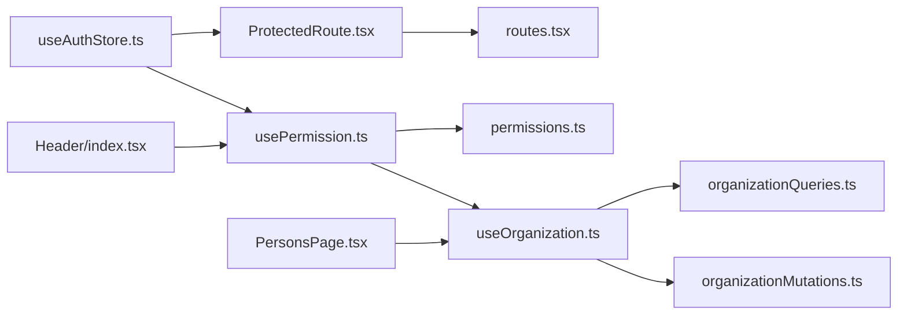

# 权限控制

<cite>
**本文引用的文件**
- [usePermission.ts](file://app/src/hooks/usePermission.ts)
- [permissions.ts](file://app/src/lib/permissions.ts)
- [ProtectedRoute.tsx](file://app/src/auth/components/ProtectedRoute.tsx)
- [routes.tsx](file://app/src/config/routes.tsx)
- [useOrganization.ts](file://app/src/hooks/useOrganization.ts)
- [organizationMutations.ts](file://app/src/services/organization/organizationMutations.ts)
- [organizationQueries.ts](file://app/src/services/organization/organizationQueries.ts)
- [Header/index.tsx](file://app/src/components/layout/Header/index.tsx)
- [PersonsPage.tsx](file://app/src/pages/PersonsPage.tsx)
- [useAuthStore.ts](file://app/src/stores/useAuthStore.ts)
</cite>

## 目录
1. [引言](#引言)
2. [项目结构](#项目结构)
3. [核心组件](#核心组件)
4. [架构总览](#架构总览)
5. [详细组件分析](#详细组件分析)
6. [依赖关系分析](#依赖关系分析)
7. [性能考量](#性能考量)
8. [故障排查指南](#故障排查指南)
9. [结论](#结论)
10. [附录](#附录)

## 引言
本文件系统性梳理并阐述本项目的权限控制体系，围绕基于角色的访问控制（RBAC）进行设计与实现，覆盖权限验证机制、路由保护、组件级权限控制、权限钩子函数的使用方法、权限数据模型与角色定义、权限映射与动态更新策略，并给出在页面访问、功能按钮、数据访问等多场景的应用范式与最佳实践。

## 项目结构
权限控制相关代码主要分布在以下模块：
- 认证与路由保护：认证状态管理、路由守卫
- 权限钩子与工具：usePermission 钩子、权限常量与判断工具
- 组织与成员：组织树、成员管理、用户组织信息
- 页面与组件：头部导航、人员管理页等对权限的使用

图表来源
- [useAuthStore.ts:1-173](file://app/src/stores/useAuthStore.ts#L1-L173)
- [ProtectedRoute.tsx:1-32](file://app/src/auth/components/ProtectedRoute.tsx#L1-L32)
- [routes.tsx:1-78](file://app/src/config/routes.tsx#L1-L78)
- [usePermission.ts:1-58](file://app/src/hooks/usePermission.ts#L1-L58)
- [permissions.ts:1-86](file://app/src/lib/permissions.ts#L1-L86)
- [useOrganization.ts:1-364](file://app/src/hooks/useOrganization.ts#L1-L364)
- [organizationQueries.ts:1-333](file://app/src/services/organization/organizationQueries.ts#L1-L333)
- [organizationMutations.ts:1-207](file://app/src/services/organization/organizationMutations.ts#L1-L207)
- [Header/index.tsx:1-123](file://app/src/components/layout/Header/index.tsx#L1-L123)
- [PersonsPage.tsx:1-214](file://app/src/pages/PersonsPage.tsx#L1-L214)

章节来源
- [routes.tsx:1-78](file://app/src/config/routes.tsx#L1-L78)
- [useAuthStore.ts:1-173](file://app/src/stores/useAuthStore.ts#L1-L173)

## 核心组件
- 认证状态管理：负责用户登录态初始化、监听认证状态变化、提供登录/注册/登出能力。
- 路由保护：在进入受保护路由前，确保用户已认证且完成初始化。
- 权限钩子 usePermission：封装角色判定、权限判断、组织级管理权限、图片编辑/删除等细粒度权限。
- 权限工具 permissions：定义角色层级、权限常量、通用权限判断与角色标签。
- 组织钩子 useOrganization：加载组织树、成员列表、用户组织信息；提供组织 CRUD 与成员管理；内置缓存与并发去重。
- 页面与组件：头部导航根据 isAdmin 控制管理员入口；人员管理页根据用户角色展示/禁用操作按钮。

章节来源
- [useAuthStore.ts:1-173](file://app/src/stores/useAuthStore.ts#L1-L173)
- [ProtectedRoute.tsx:1-32](file://app/src/auth/components/ProtectedRoute.tsx#L1-L32)
- [usePermission.ts:1-58](file://app/src/hooks/usePermission.ts#L1-L58)
- [permissions.ts:1-86](file://app/src/lib/permissions.ts#L1-L86)
- [useOrganization.ts:1-364](file://app/src/hooks/useOrganization.ts#L1-L364)
- [organizationQueries.ts:1-333](file://app/src/services/organization/organizationQueries.ts#L1-L333)
- [organizationMutations.ts:1-207](file://app/src/services/organization/organizationMutations.ts#L1-L207)
- [Header/index.tsx:1-123](file://app/src/components/layout/Header/index.tsx#L1-L123)
- [PersonsPage.tsx:1-214](file://app/src/pages/PersonsPage.tsx#L1-L214)

## 架构总览
整体权限控制采用“认证前置 + 角色驱动 + 组件级开关”的分层设计：
- 认证层：通过 useAuthStore 管理登录态，ProtectedRoute 在路由层拦截未认证请求。
- 角色层：permissions 定义角色层级与权限常量，usePermission 将角色映射为可直接使用的布尔值与判断函数。
- 数据层：useOrganization 聚合组织树与成员信息，结合后端 RPC/查询服务实现权限边界内的数据访问。
- 表现层：组件通过 usePermission 与 useOrganization 的结果进行条件渲染与交互控制。

图表来源
- [routes.tsx:1-78](file://app/src/config/routes.tsx#L1-L78)
- [ProtectedRoute.tsx:1-32](file://app/src/auth/components/ProtectedRoute.tsx#L1-L32)
- [useAuthStore.ts:1-173](file://app/src/stores/useAuthStore.ts#L1-L173)
- [usePermission.ts:1-58](file://app/src/hooks/usePermission.ts#L1-L58)
- [organizationQueries.ts:1-333](file://app/src/services/organization/organizationQueries.ts#L1-L333)
- [organizationMutations.ts:1-207](file://app/src/services/organization/organizationMutations.ts#L1-L207)

## 详细组件分析

### 权限钩子 usePermission：实现原理与使用
- 输入来源：从 useAuthStore 获取当前用户；从 useOrganization 获取用户在当前组织上下文的角色 userOrgInfo。
- 输出结果：导出 userRole、isAdmin、isManager、isMember、hasPermission、checkPermission、canManageOrganization、canManageMembers、canEditPhoto、canDeletePhoto、isLoading 等。
- 实现要点：
  - 基于角色层级比较 hasPermission，统一判断最小角色要求。
  - 对图片编辑/删除提供“是否本人”分支逻辑，非本人需更高角色。
  - 对权限判断提供带消息的 checkPermission，便于 UI 提示。
  - 使用 useMemo 缓存计算结果，避免重复渲染。

图表来源
- [usePermission.ts:1-58](file://app/src/hooks/usePermission.ts#L1-L58)
- [permissions.ts:1-86](file://app/src/lib/permissions.ts#L1-L86)
- [useOrganization.ts:1-364](file://app/src/hooks/useOrganization.ts#L1-L364)

章节来源
- [usePermission.ts:1-58](file://app/src/hooks/usePermission.ts#L1-L58)
- [permissions.ts:1-86](file://app/src/lib/permissions.ts#L1-L86)

### 权限工具 permissions：角色与权限映射
- 角色层级：admin > manager > member，通过数值映射实现等级比较。
- 权限常量：
  - 组织：创建/更新/删除/查看组织树
  - 成员：添加/移除/变更角色/分配团队
  - 照片：上传/编辑自身/编辑他人/删除自身/删除他人
- 判断函数：
  - hasPermission：按角色层级比较
  - checkPermission：返回允许与否及提示信息
  - canManageOrganization/canManageMembers：基于管理员角色
  - canEditPhoto/canDeletePhoto：区分“本人”与“非本人”

图表来源
- [permissions.ts:1-86](file://app/src/lib/permissions.ts#L1-L86)

章节来源
- [permissions.ts:1-86](file://app/src/lib/permissions.ts#L1-L86)

### 路由保护 ProtectedRoute：认证拦截
- 在组件挂载时执行 initialize，拉取当前用户并监听认证状态变化。
- 若 isLoading 中或未认证，则显示加载或跳转登录页。
- 已认证则放行子路由内容。

图表来源
- [ProtectedRoute.tsx:1-32](file://app/src/auth/components/ProtectedRoute.tsx#L1-L32)
- [useAuthStore.ts:1-173](file://app/src/stores/useAuthStore.ts#L1-L173)

章节来源
- [ProtectedRoute.tsx:1-32](file://app/src/auth/components/ProtectedRoute.tsx#L1-L32)
- [routes.tsx:1-78](file://app/src/config/routes.tsx#L1-L78)

### 组织与成员：数据访问边界
- 查询服务 organizationQueries：
  - 提供组织树、成员列表、用户组织信息等只读查询，具备内存缓存与并发去重。
  - getUserOrganizationInfo 返回用户所在组织、祖先节点与角色。
- 变更服务 organizationMutations：
  - 所有写操作均要求操作者为管理员，否则抛出权限不足错误。
  - 写操作后主动失效相关缓存，保证 UI 与后端一致性。

图表来源
- [organizationQueries.ts:1-333](file://app/src/services/organization/organizationQueries.ts#L1-L333)
- [organizationMutations.ts:1-207](file://app/src/services/organization/organizationMutations.ts#L1-L207)

章节来源
- [organizationQueries.ts:1-333](file://app/src/services/organization/organizationQueries.ts#L1-L333)
- [organizationMutations.ts:1-207](file://app/src/services/organization/organizationMutations.ts#L1-L207)

### 组件级权限控制：页面与导航
- 头部导航 Header：
  - 通过 usePermission().isAdmin 控制“组织管理”入口的显示。
- 人员管理页 PersonsPage：
  - 通过 userOrgInfo.role 判断是否为管理员，决定是否渲染创建/删除组织等按钮。
  - 与 useOrganization 协作，实现组织树与成员列表的条件渲染与交互。

图表来源
- [Header/index.tsx:1-123](file://app/src/components/layout/Header/index.tsx#L1-L123)
- [usePermission.ts:1-58](file://app/src/hooks/usePermission.ts#L1-L58)

章节来源
- [Header/index.tsx:1-123](file://app/src/components/layout/Header/index.tsx#L1-L123)
- [PersonsPage.tsx:1-214](file://app/src/pages/PersonsPage.tsx#L1-L214)

## 依赖关系分析
- 认证与路由保护依赖 useAuthStore，后者提供 initialize/onAuthStateChange 等能力。
- 权限钩子 usePermission 依赖 useOrganization 与 permissions 工具。
- useOrganization 依赖 organizationQueries 与 organizationMutations，二者分别提供只读与写操作。
- 页面与组件通过 usePermission 与 useOrganization 的结果进行条件渲染与交互控制。

图表来源
- [useAuthStore.ts:1-173](file://app/src/stores/useAuthStore.ts#L1-L173)
- [ProtectedRoute.tsx:1-32](file://app/src/auth/components/ProtectedRoute.tsx#L1-L32)
- [routes.tsx:1-78](file://app/src/config/routes.tsx#L1-L78)
- [usePermission.ts:1-58](file://app/src/hooks/usePermission.ts#L1-L58)
- [permissions.ts:1-86](file://app/src/lib/permissions.ts#L1-L86)
- [useOrganization.ts:1-364](file://app/src/hooks/useOrganization.ts#L1-L364)
- [organizationQueries.ts:1-333](file://app/src/services/organization/organizationQueries.ts#L1-L333)
- [organizationMutations.ts:1-207](file://app/src/services/organization/organizationMutations.ts#L1-L207)
- [Header/index.tsx:1-123](file://app/src/components/layout/Header/index.tsx#L1-L123)
- [PersonsPage.tsx:1-214](file://app/src/pages/PersonsPage.tsx#L1-L214)

章节来源
- [useAuthStore.ts:1-173](file://app/src/stores/useAuthStore.ts#L1-L173)
- [usePermission.ts:1-58](file://app/src/hooks/usePermission.ts#L1-L58)
- [useOrganization.ts:1-364](file://app/src/hooks/useOrganization.ts#L1-L364)

## 性能考量
- 缓存策略：
  - useOrganization 对组织树与“可上传组织”集合使用本地缓存，TTL 5 分钟，减少重复请求。
  - organizationQueries 使用内存缓存与并发去重（Promise Map），避免重复网络请求。
- 渲染优化：
  - usePermission 使用 useMemo 缓存计算结果，降低频繁渲染成本。
- 网络与离线：
  - 路由保护在初始化阶段完成认证状态拉取，避免后续重复 IO。
  - 数据服务具备离线队列与手动同步能力，配合 UI 提示提升用户体验。

章节来源
- [useOrganization.ts:1-364](file://app/src/hooks/useOrganization.ts#L1-L364)
- [organizationQueries.ts:1-333](file://app/src/services/organization/organizationQueries.ts#L1-L333)
- [usePermission.ts:1-58](file://app/src/hooks/usePermission.ts#L1-L58)

## 故障排查指南
- 路由无法进入：
  - 检查 ProtectedRoute 是否正确调用 initialize，确认 useAuthStore 的 isAuthenticated 状态。
  - 查看初始化过程中的错误字段与 loading 状态。
- 权限判断异常：
  - 确认 useOrganization 返回的 userOrgInfo.role 是否正确。
  - 使用 checkPermission 获取具体提示信息，定位所需角色。
- 组织/成员操作失败：
  - organizationMutations 要求管理员身份，若报“权限不足”，确认当前用户角色。
  - 操作后需等待缓存失效与重新拉取，确认 UI 是否刷新。
- 图片编辑/删除权限问题：
  - canEditPhoto/canDeletePhoto 区分“本人”与“非本人”，确认 isOwner 参数传入是否正确。

章节来源
- [ProtectedRoute.tsx:1-32](file://app/src/auth/components/ProtectedRoute.tsx#L1-L32)
- [useAuthStore.ts:1-173](file://app/src/stores/useAuthStore.ts#L1-L173)
- [usePermission.ts:1-58](file://app/src/hooks/usePermission.ts#L1-L58)
- [organizationMutations.ts:1-207](file://app/src/services/organization/organizationMutations.ts#L1-L207)

## 结论
本权限体系以认证前置、角色驱动为核心，结合钩子与服务层实现“路由保护 + 组件级权限控制 + 数据访问边界”的闭环。通过清晰的角色层级与权限常量、完善的缓存与并发去重策略、以及在 UI 层的条件渲染与交互控制，既保障了安全性，也兼顾了性能与可维护性。建议在扩展新权限时遵循“最小权限原则”与“职责分离”，并在新增页面或功能时同步完善路由保护与组件级权限控制。

## 附录

### 权限数据模型与角色定义
- 角色层级：admin > manager > member（数值映射）
- 权限常量：
  - 组织：创建/更新/删除/查看组织树
  - 成员：添加/移除/变更角色/分配团队
  - 照片：上传/编辑自身/编辑他人/删除自身/删除他人

章节来源
- [permissions.ts:1-86](file://app/src/lib/permissions.ts#L1-L86)

### 权限钩子 usePermission 使用指南
- 获取角色与权限：
  - 通过 usePermission().userRole 获取当前角色
  - 通过 usePermission().isAdmin/isManager/isMember 快速判断
- 权限判断：
  - 使用 hasPermission(requiredRole) 判断是否满足某角色要求
  - 使用 checkPermission(permission) 获取允许与否与提示信息
- 组织与资源权限：
  - canManageOrganization/canManageMembers：管理员可用
  - canEditPhoto/canDeletePhoto：区分“本人”与“非本人”

章节来源
- [usePermission.ts:1-58](file://app/src/hooks/usePermission.ts#L1-L58)
- [permissions.ts:1-86](file://app/src/lib/permissions.ts#L1-L86)

### 路由保护与页面访问控制
- 路由保护：
  - 在路由配置中使用 ProtectedRoute 包裹需要认证的页面
  - ProtectedRoute 在挂载时调用 initialize 并监听认证状态
- 页面访问控制：
  - 在页面组件中根据 usePermission 的结果决定渲染与交互

章节来源
- [routes.tsx:1-78](file://app/src/config/routes.tsx#L1-L78)
- [ProtectedRoute.tsx:1-32](file://app/src/auth/components/ProtectedRoute.tsx#L1-L32)

### 组件级权限控制示例
- 头部导航：
  - 通过 isAdmin 控制“组织管理”入口显示
- 人员管理页：
  - 通过 userOrgInfo.role 控制创建/删除组织按钮的显示与交互

章节来源
- [Header/index.tsx:1-123](file://app/src/components/layout/Header/index.tsx#L1-L123)
- [PersonsPage.tsx:1-214](file://app/src/pages/PersonsPage.tsx#L1-L214)