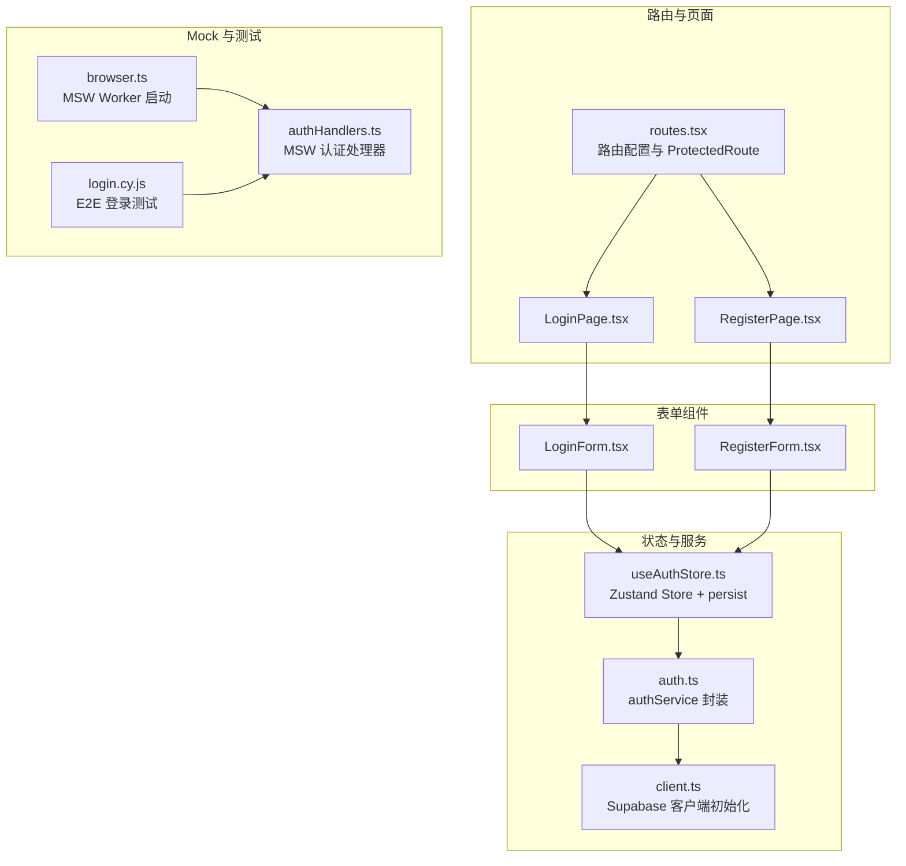
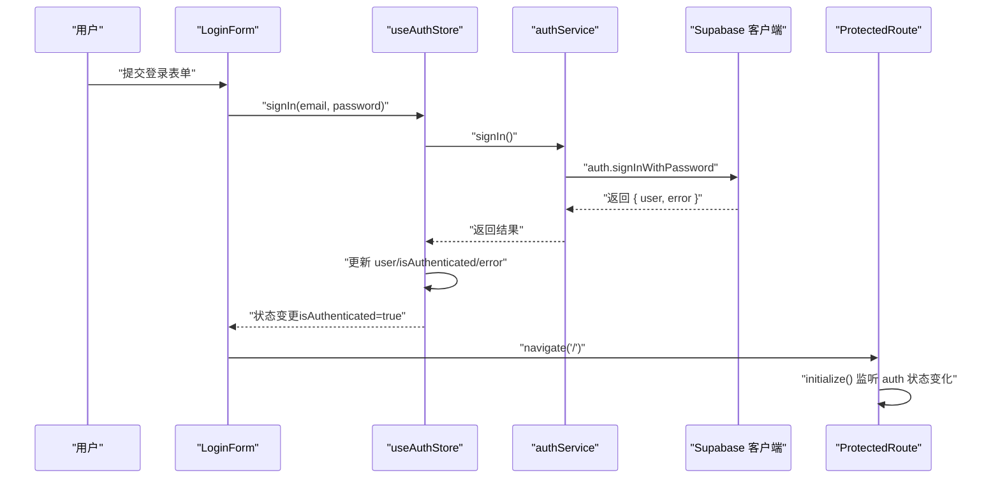
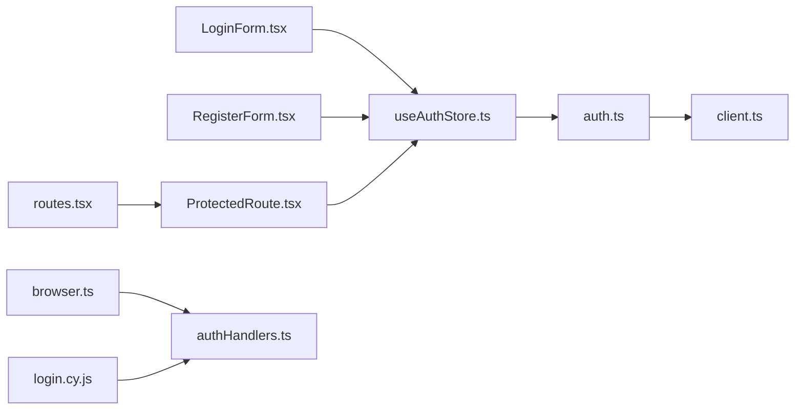

# 用户认证

<cite>
**本文引用的文件**
- [useAuthStore.ts](file://app/src/stores/useAuthStore.ts)
- [auth.ts](file://app/src/lib/supabase/auth.ts)
- [client.ts](file://app/src/lib/supabase/client.ts)
- [routes.tsx](file://app/src/config/routes.tsx)
- [ProtectedRoute.tsx](file://app/src/auth/components/ProtectedRoute.tsx)
- [LoginForm.tsx](file://app/src/auth/components/LoginForm.tsx)
- [RegisterForm.tsx](file://app/src/auth/components/RegisterForm.tsx)
- [LoginPage.tsx](file://app/src/auth/pages/LoginPage.tsx)
- [RegisterPage.tsx](file://app/src/auth/pages/RegisterPage.tsx)
- [authHandlers.ts](file://app/src/mocks/handlers/authHandlers.ts)
- [browser.ts](file://app/src/mocks/browser.ts)
- [login.cy.js](file://app/cypress/e2e/auth/login.cy.js)
- [main.tsx](file://app/src/main.tsx)
- [App.tsx](file://app/src/App.tsx)
- [auth.ts 类型定义](file://app/src/types/auth.ts)
</cite>

## 目录
1. [简介](#简介)
2. [项目结构](#项目结构)
3. [核心组件](#核心组件)
4. [架构总览](#架构总览)
5. [详细组件分析](#详细组件分析)
6. [依赖关系分析](#依赖关系分析)
7. [性能考量](#性能考量)
8. [故障排查指南](#故障排查指南)
9. [结论](#结论)
10. [附录](#附录)

## 简介
本文件系统性梳理基于 Supabase Auth 的用户认证模块，覆盖登录/注册表单组件、认证状态管理（Zustand）、JWT 会话与持久化、路由保护、错误与加载状态管理、以及最佳实践与安全建议。读者无需深入前端状态管理即可理解整体实现，同时也能从代码级图示与路径定位快速定位实现细节。

## 项目结构
认证相关代码主要分布在以下位置：
- 路由与页面：认证页面与受保护路由
- 表单组件：登录与注册表单
- 认证服务：对 Supabase Auth 的薄封装
- 状态管理：Zustand Store 与持久化
- 客户端初始化：Supabase 客户端配置与 MSW 支持
- Mock 与测试：MSW 认证处理器与 E2E 测试



图表来源
- [routes.tsx:24-65](file://app/src/config/routes.tsx#L24-L65)
- [ProtectedRoute.tsx:14-31](file://app/src/auth/components/ProtectedRoute.tsx#L14-L31)
- [LoginForm.tsx:11-76](file://app/src/auth/components/LoginForm.tsx#L11-L76)
- [RegisterForm.tsx:11-119](file://app/src/auth/components/RegisterForm.tsx#L11-L119)
- [useAuthStore.ts:24-172](file://app/src/stores/useAuthStore.ts#L24-L172)
- [auth.ts:29-119](file://app/src/lib/supabase/auth.ts#L29-L119)
- [client.ts:26-33](file://app/src/lib/supabase/client.ts#L26-L33)
- [authHandlers.ts:175-193](file://app/src/mocks/handlers/authHandlers.ts#L175-L193)
- [browser.ts:16-40](file://app/src/mocks/browser.ts#L16-L40)
- [login.cy.js:6-35](file://app/cypress/e2e/auth/login.cy.js#L6-L35)

章节来源
- [routes.tsx:24-65](file://app/src/config/routes.tsx#L24-L65)
- [LoginForm.tsx:11-76](file://app/src/auth/components/LoginForm.tsx#L11-L76)
- [RegisterForm.tsx:11-119](file://app/src/auth/components/RegisterForm.tsx#L11-L119)
- [useAuthStore.ts:24-172](file://app/src/stores/useAuthStore.ts#L24-L172)
- [auth.ts:29-119](file://app/src/lib/supabase/auth.ts#L29-L119)
- [client.ts:26-33](file://app/src/lib/supabase/client.ts#L26-L33)
- [authHandlers.ts:175-193](file://app/src/mocks/handlers/authHandlers.ts#L175-L193)
- [browser.ts:16-40](file://app/src/mocks/browser.ts#L16-L40)
- [login.cy.js:6-35](file://app/cypress/e2e/auth/login.cy.js#L6-L35)

## 核心组件
- Zustand 认证 Store：集中管理用户、加载状态、认证状态与错误；提供注册、登录、登出、初始化与错误清理等动作；通过 persist 中间件进行本地持久化。
- Supabase 认证服务：对 Supabase Auth 的薄封装，提供注册、登录、登出、获取当前用户、获取会话、监听认证状态变化等方法；内置缓存与防抖逻辑。
- 登录/注册表单组件：负责收集表单数据、执行认证动作、展示错误与加载状态、触发导航跳转。
- 路由保护组件：在应用主路由上包裹受保护区域，初始化认证状态并在加载期间显示加载指示，未认证时重定向至登录页。
- 路由配置：定义认证页面与受保护页面的路由映射，使用 Suspense 与懒加载提升首屏性能。
- 客户端初始化：根据环境变量选择真实后端或 MSW 代理路径，开启/关闭自动刷新与会话持久化，确保开发与测试场景下的可控行为。
- Mock 与测试：MSW 认证处理器模拟登录、注册、获取用户与登出；E2E 测试覆盖登录流程、错误提示与页面跳转。

章节来源
- [useAuthStore.ts:10-22](file://app/src/stores/useAuthStore.ts#L10-L22)
- [auth.ts:13-27](file://app/src/lib/supabase/auth.ts#L13-L27)
- [LoginForm.tsx:11-25](file://app/src/auth/components/LoginForm.tsx#L11-L25)
- [RegisterForm.tsx:11-40](file://app/src/auth/components/RegisterForm.tsx#L11-L40)
- [ProtectedRoute.tsx:14-31](file://app/src/auth/components/ProtectedRoute.tsx#L14-L31)
- [routes.tsx:24-65](file://app/src/config/routes.tsx#L24-L65)
- [client.ts:10-33](file://app/src/lib/supabase/client.ts#L10-L33)
- [authHandlers.ts:42-57](file://app/src/mocks/handlers/authHandlers.ts#L42-L57)
- [login.cy.js:69-130](file://app/cypress/e2e/auth/login.cy.js#L69-L130)

## 架构总览
认证系统采用“组件层（表单）—状态层（Zustand）—服务层（authService）—客户端层（Supabase 客户端）”的分层设计，结合路由保护与持久化中间件，形成完整的认证闭环。



图表来源
- [LoginForm.tsx:19-25](file://app/src/auth/components/LoginForm.tsx#L19-L25)
- [useAuthStore.ts:100-126](file://app/src/stores/useAuthStore.ts#L100-L126)
- [auth.ts:53-63](file://app/src/lib/supabase/auth.ts#L53-L63)
- [client.ts:26-33](file://app/src/lib/supabase/client.ts#L26-L33)
- [ProtectedRoute.tsx:18-20](file://app/src/auth/components/ProtectedRoute.tsx#L18-L20)

## 详细组件分析

### Zustand 认证 Store（useAuthStore）
- 设计要点
  - 状态字段：user、isLoading、isAuthenticated、error
  - 动作：signUp、signIn、signOut、initialize、clearError
  - 持久化：使用 persist 中间件，仅持久化 user 与 isAuthenticated，减少存储体积并聚焦关键状态
  - 初始化：调用 authService.getCurrentSession 并监听 auth 状态变化，保证全局状态一致
- 错误处理
  - 对每个异步动作捕获异常并设置 error，同时将 isLoading 置为 false
  - clearError 用于手动清空错误
- 性能与复杂度
  - initialize 内部监听 Supabase auth 状态变化，避免重复订阅
  - 缓存与防抖：authService 内部对 getUser 做 TTL 缓存与 inflightPromise 防抖，降低重复请求

```mermaid
classDiagram
class AuthState {
+user : User|null
+isLoading : boolean
+isAuthenticated : boolean
+error : AuthError|null
+signUp(email, password, displayName)
+signIn(email, password)
+signOut()
+initialize()
+clearError()
}
class AuthService {
+signUp(credentials) Promise~AuthResponse~
+signIn(credentials) Promise~AuthResponse~
+signOut() Promise~{error}|null~
+getCurrentUser(forceRefresh?) Promise~User|null~
+getSession() Promise~Session|null~
+onAuthStateChange(callback) void
}
class SupabaseClient {
+auth
}
AuthState --> AuthService : "调用"
AuthService --> SupabaseClient : "封装"
```

图表来源
- [useAuthStore.ts:10-22](file://app/src/stores/useAuthStore.ts#L10-L22)
- [auth.ts:29-119](file://app/src/lib/supabase/auth.ts#L29-L119)
- [client.ts:26-33](file://app/src/lib/supabase/client.ts#L26-L33)

章节来源
- [useAuthStore.ts:24-172](file://app/src/stores/useAuthStore.ts#L24-L172)
- [auth.ts:76-101](file://app/src/lib/supabase/auth.ts#L76-L101)

### Supabase 认证服务（authService）
- 职责
  - 注册：携带 display_name 用户元数据
  - 登录：标准密码登录
  - 登出：调用 Supabase signOut
  - 当前用户：带 TTL 缓存与 inflightPromise 防抖
  - 会话：getSession
  - 认证状态监听：onAuthStateChange
- 关键实现
  - 缓存策略：CACHE_TTL_MS 控制缓存有效期，避免频繁调用 /auth/v1/user
  - inflightPromise：并发请求去重，提升性能
  - 自动刷新与检测：根据是否 MSW 模式决定 autoRefreshToken 与 detectSessionInUrl

章节来源
- [auth.ts:29-119](file://app/src/lib/supabase/auth.ts#L29-L119)
- [client.ts:26-33](file://app/src/lib/supabase/client.ts#L26-L33)

### 登录表单组件（LoginForm）
- 表单字段：email、password
- 行为
  - 提交时调用 useAuthStore.signIn
  - 若 isAuthenticate 为真则导航至首页
  - 展示 error 与 isLoading 状态
- 最佳实践
  - 使用 HTML5 required 与 type=email/password 进行基础校验
  - 在提交时禁用按钮，避免重复提交

章节来源
- [LoginForm.tsx:11-76](file://app/src/auth/components/LoginForm.tsx#L11-L76)

### 注册表单组件（RegisterForm）
- 表单字段：displayName、email、password、confirmPassword
- 行为
  - 前端校验：密码一致性与长度
  - 提交时调用 useAuthStore.signUp
  - 成功后导航至首页
  - 展示 validationError 与 error
- 最佳实践
  - 前端强校验与后端错误提示并用
  - 使用 disabled 状态避免重复提交

章节来源
- [RegisterForm.tsx:11-119](file://app/src/auth/components/RegisterForm.tsx#L11-L119)

### 路由保护组件（ProtectedRoute）
- 行为
  - 首次渲染时调用 initialize，监听 auth 状态变化
  - isLoading 期间显示 LoadingSpinner
  - 未认证时重定向至 /login 并携带 from 位置信息
- 与路由配置配合
  - AppRouter 中将 ProtectedRoute 包裹在根路由下，实现整站保护

章节来源
- [ProtectedRoute.tsx:14-31](file://app/src/auth/components/ProtectedRoute.tsx#L14-L31)
- [routes.tsx:34-41](file://app/src/config/routes.tsx#L34-L41)

### 路由配置与页面
- 认证页面：/login、/register
- 受保护路由：/ 与子路由（persons/profile/settings 等），均被 ProtectedRoute 包裹
- 页面组件：Login/ Register Page 仅负责布局与容器，具体表单逻辑在对应组件中实现

章节来源
- [routes.tsx:24-65](file://app/src/config/routes.tsx#L24-L65)
- [LoginPage.tsx:7-34](file://app/src/auth/pages/LoginPage.tsx#L7-L34)
- [RegisterPage.tsx:7-34](file://app/src/auth/pages/RegisterPage.tsx#L7-L34)

### 客户端初始化与 MSW 支持
- 环境变量控制
  - VITE_ENABLE_MSW：启用 MSW 模式，使用 /supabase-proxy 代理路径
  - VITE_SUPABASE_URL/VITE_SUPABASE_ANON_KEY：生产/非 MSW 模式下的真实后端
- 初始化顺序
  - 主题 → MSW（可选）→ 认证 → 数据服务（可选）→ 渲染
- Supabase 客户端
  - auth.persistSession = true
  - autoRefreshToken/detectSessionInUrl 根据模式动态开启/关闭
  - storage 使用 localStorage

章节来源
- [client.ts:10-33](file://app/src/lib/supabase/client.ts#L10-L33)
- [main.tsx:23-77](file://app/src/main.tsx#L23-L77)

### Mock 与测试
- MSW 认证处理器
  - 支持 token（含 refresh_token）、user、logout、signup
  - 同时匹配开发代理与生产域名
- E2E 测试
  - 登录页面可达性与表单验证
  - 正确凭据登录、错误凭据提示、登录后页面跳转与受保护页面访问
  - 登录状态保持（刷新/新标签页）

章节来源
- [authHandlers.ts:42-57](file://app/src/mocks/handlers/authHandlers.ts#L42-L57)
- [authHandlers.ts:175-193](file://app/src/mocks/handlers/authHandlers.ts#L175-L193)
- [browser.ts:16-40](file://app/src/mocks/browser.ts#L16-L40)
- [login.cy.js:69-130](file://app/cypress/e2e/auth/login.cy.js#L69-L130)

## 依赖关系分析
- 组件依赖
  - LoginForm/ RegisterForm 依赖 useAuthStore
  - ProtectedRoute 依赖 useAuthStore 与 LoadingSpinner
  - 路由配置依赖 ProtectedRoute 与页面组件
- 状态与服务
  - useAuthStore 依赖 authService
  - authService 依赖 supabase 客户端
- 客户端与环境
  - client.ts 根据环境变量决定代理与自动刷新策略
- Mock 与测试
  - authHandlers.ts 与 browser.ts 为 MSW 提供认证相关拦截
  - login.cy.js 驱动端到端验证



图表来源
- [LoginForm.tsx:11-13](file://app/src/auth/components/LoginForm.tsx#L11-L13)
- [RegisterForm.tsx:11-13](file://app/src/auth/components/RegisterForm.tsx#L11-L13)
- [useAuthStore.ts:6-6](file://app/src/stores/useAuthStore.ts#L6-L6)
- [auth.ts:4-5](file://app/src/lib/supabase/auth.ts#L4-L5)
- [client.ts:8-16](file://app/src/lib/supabase/client.ts#L8-L16)
- [ProtectedRoute.tsx:7-15](file://app/src/auth/components/ProtectedRoute.tsx#L7-L15)
- [routes.tsx:8-19](file://app/src/config/routes.tsx#L8-L19)
- [browser.ts:1-11](file://app/src/mocks/browser.ts#L1-L11)
- [authHandlers.ts:1-7](file://app/src/mocks/handlers/authHandlers.ts#L1-L7)
- [login.cy.js:1-11](file://app/cypress/e2e/auth/login.cy.js#L1-L11)

章节来源
- [LoginForm.tsx:11-13](file://app/src/auth/components/LoginForm.tsx#L11-L13)
- [RegisterForm.tsx:11-13](file://app/src/auth/components/RegisterForm.tsx#L11-L13)
- [useAuthStore.ts:6-6](file://app/src/stores/useAuthStore.ts#L6-L6)
- [auth.ts:4-5](file://app/src/lib/supabase/auth.ts#L4-L5)
- [client.ts:8-16](file://app/src/lib/supabase/client.ts#L8-L16)
- [ProtectedRoute.tsx:7-15](file://app/src/auth/components/ProtectedRoute.tsx#L7-L15)
- [routes.tsx:8-19](file://app/src/config/routes.tsx#L8-L19)
- [browser.ts:1-11](file://app/src/mocks/browser.ts#L1-L11)
- [authHandlers.ts:1-7](file://app/src/mocks/handlers/authHandlers.ts#L1-L7)
- [login.cy.js:1-11](file://app/cypress/e2e/auth/login.cy.js#L1-L11)

## 性能考量
- 缓存与防抖
  - authService.getCurrentUser 使用 TTL 缓存与 inflightPromise 防止重复请求
- 懒加载与 Suspense
  - 路由与页面组件使用 React.lazy 与 Suspense，减少首屏负担
- 初始化顺序
  - MSW 先于认证初始化，避免真实请求导致白屏与不必要的网络开销
- 存储与持久化
  - Zustand persist 仅持久化必要字段，降低存储压力

章节来源
- [auth.ts:76-101](file://app/src/lib/supabase/auth.ts#L76-L101)
- [routes.tsx:10-19](file://app/src/config/routes.tsx#L10-L19)
- [main.tsx:36-44](file://app/src/main.tsx#L36-L44)
- [useAuthStore.ts:164-171](file://app/src/stores/useAuthStore.ts#L164-L171)

## 故障排查指南
- 常见问题与定位
  - 缺少 Supabase 环境变量：客户端初始化阶段会输出错误日志，确认 VITE_SUPABASE_URL 与 VITE_SUPABASE_ANON_KEY
  - MSW 模式下跨域：确保使用 /supabase-proxy 代理路径，Service Worker 可拦截请求
  - 登录失败：检查 authHandlers 中的凭据匹配与错误响应
  - 刷新/新标签页后未保持登录：确认 localStorage 与 persist 配置生效
- 调试建议
  - 在 main.tsx 中观察初始化日志
  - 在 ProtectedRoute 中确认 initialize 是否执行
  - 在 LoginForm/ RegisterForm 中检查 error 与 isLoading 状态
- E2E 验证
  - 使用 login.cy.js 验证登录流程、错误提示与页面跳转

章节来源
- [client.ts:18-24](file://app/src/lib/supabase/client.ts#L18-L24)
- [main.tsx:29-44](file://app/src/main.tsx#L29-L44)
- [authHandlers.ts:99-111](file://app/src/mocks/handlers/authHandlers.ts#L99-L111)
- [login.cy.js:69-130](file://app/cypress/e2e/auth/login.cy.js#L69-L130)

## 结论
该认证模块以 Supabase Auth 为核心，结合 Zustand 状态管理与路由保护，构建了清晰、可维护且具备良好开发体验的认证体系。通过 MSW 支持与完善的 E2E 测试，开发者可在本地快速迭代并保证质量。建议在生产环境中严格配置环境变量与安全头，并持续关注会话生命周期与错误恢复策略。

## 附录

### 认证流程最佳实践与安全考虑
- 输入校验
  - 前端：必填、格式、长度等基础校验
  - 后端：二次校验与速率限制
- 错误处理
  - 统一错误结构（message/code），避免泄露敏感信息
  - 区分业务错误与系统错误，指导用户与记录日志
- 会话与令牌
  - 启用自动刷新与持久化（非 MSW 模式）
  - 登出时清理本地存储
- 路由保护
  - 受保护路由统一包裹 ProtectedRoute
  - 未认证时携带来源位置，便于登录后回跳
- 开发与测试
  - 使用 MSW 模拟认证流程，提升开发效率
  - 编写 E2E 测试覆盖关键路径与边界条件

### 使用示例（组件内如何使用认证功能）
- 登录
  - 在表单提交时调用 useAuthStore.signIn，成功后判断 isAuthenticated 并导航
  - 参考路径：[LoginForm.tsx:19-25](file://app/src/auth/components/LoginForm.tsx#L19-L25)
- 注册
  - 前端校验后调用 useAuthStore.signUp，成功后导航
  - 参考路径：[RegisterForm.tsx:22-40](file://app/src/auth/components/RegisterForm.tsx#L22-L40)
- 路由保护
  - 将受保护页面包裹在 ProtectedRoute 下，初始化认证状态
  - 参考路径：[routes.tsx:34-41](file://app/src/config/routes.tsx#L34-L41)，[ProtectedRoute.tsx:18-20](file://app/src/auth/components/ProtectedRoute.tsx#L18-L20)
- 状态与持久化
  - 通过 useAuthStore 访问 user/isAuthenticated/error，利用 persist 保持状态
  - 参考路径：[useAuthStore.ts:24-60](file://app/src/stores/useAuthStore.ts#L24-L60)