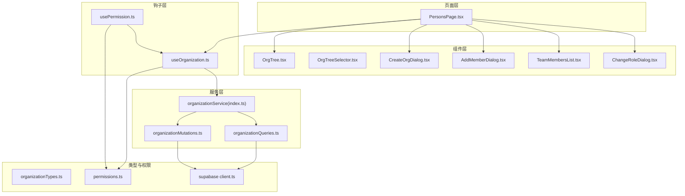
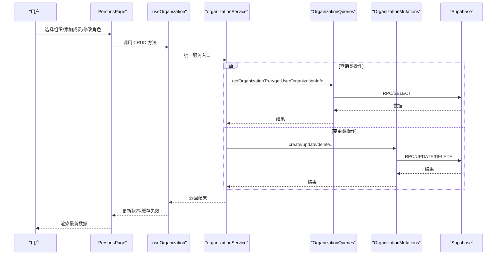
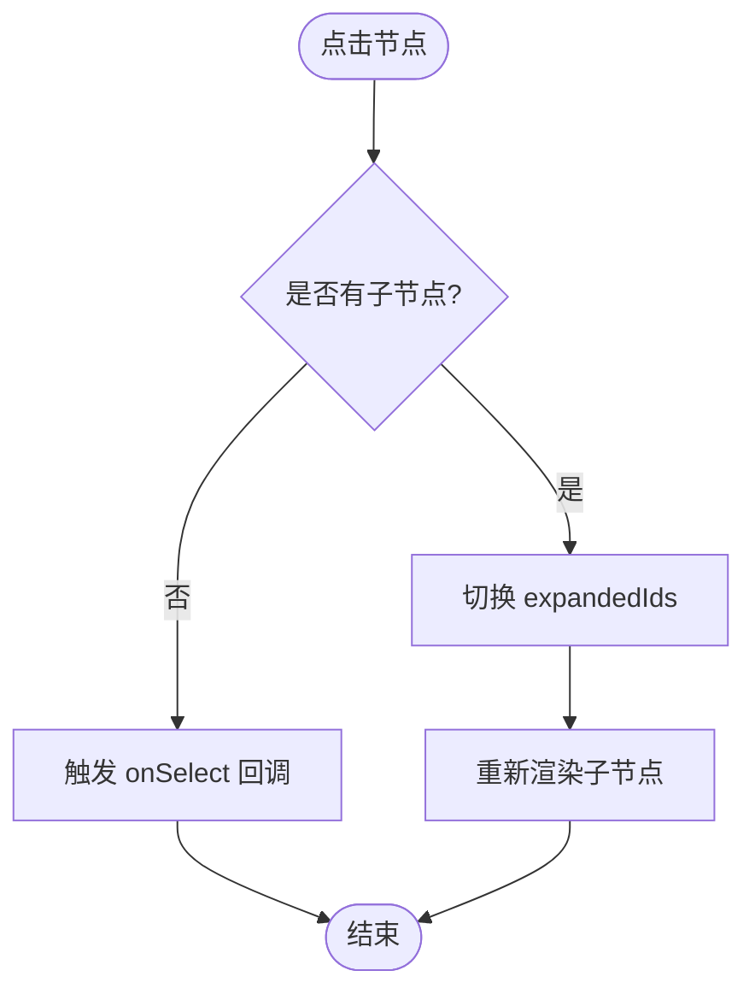
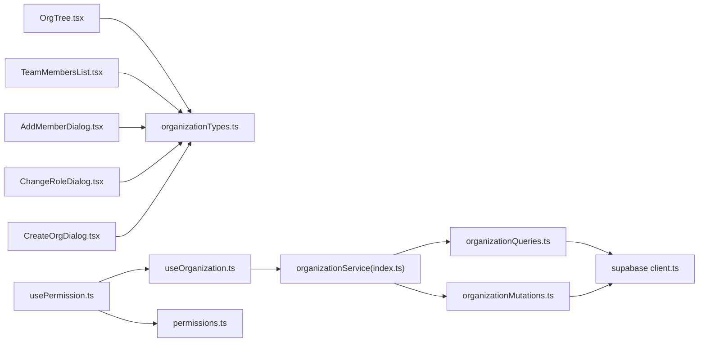

# 组织管理

<cite>
**本文档引用的文件**
- [app/src/components/organization/OrgTree.tsx](file://app/src/components/organization/OrgTree.tsx)
- [app/src/components/organization/OrgTreeSelector.tsx](file://app/src/components/organization/OrgTreeSelector.tsx)
- [app/src/components/organization/CreateOrgDialog.tsx](file://app/src/components/organization/CreateOrgDialog.tsx)
- [app/src/components/organization/AddMemberDialog.tsx](file://app/src/components/organization/AddMemberDialog.tsx)
- [app/src/components/organization/TeamMembersList.tsx](file://app/src/components/organization/TeamMembersList.tsx)
- [app/src/components/organization/ChangeRoleDialog.tsx](file://app/src/components/organization/ChangeRoleDialog.tsx)
- [app/src/services/organization/organizationQueries.ts](file://app/src/services/organization/organizationQueries.ts)
- [app/src/services/organization/organizationMutations.ts](file://app/src/services/organization/organizationMutations.ts)
- [app/src/services/organization/index.ts](file://app/src/services/organization/index.ts)
- [app/src/hooks/useOrganization.ts](file://app/src/hooks/useOrganization.ts)
- [app/src/hooks/usePermission.ts](file://app/src/hooks/usePermission.ts)
- [app/src/lib/permissions.ts](file://app/src/lib/permissions.ts)
- [app/src/lib/supabase/organizationTypes.ts](file://app/src/lib/supabase/organizationTypes.ts)
- [app/src/lib/supabase/client.ts](file://app/src/lib/supabase/client.ts)
- [app/src/pages/PersonsPage.tsx](file://app/src/pages/PersonsPage.tsx)
</cite>

## 目录
1. [引言](#引言)
2. [项目结构](#项目结构)
3. [核心组件](#核心组件)
4. [架构总览](#架构总览)
5. [详细组件分析](#详细组件分析)
6. [依赖分析](#依赖分析)
7. [性能考量](#性能考量)
8. [故障排查指南](#故障排查指南)
9. [结论](#结论)
10. [附录](#附录)

## 引言
本文件面向组织管理系统的使用者与维护者，系统性梳理多层级组织结构的设计与实现，涵盖组织创建、成员管理、角色分配、权限控制、团队管理、查询与变更流程等。文档同时解析组织树组件的实现原理（层级展示、节点交互）、成员邀请机制、GraphQL 风格的查询与变更接口、最佳实践与性能优化建议，并提供可追溯的代码片段路径以便进一步查阅。

## 项目结构
组织管理功能主要分布在以下层次：
- 页面层：负责业务编排与用户交互，如人员管理页面。
- 组件层：提供可复用的 UI 组件，如组织树、成员列表、对话框等。
- 服务层：封装只读查询与写操作，统一暴露 API。
- 钩子层：封装数据加载、缓存与权限判断逻辑。
- 类型与权限：定义数据模型与权限策略。

**图表来源**
- [app/src/pages/PersonsPage.tsx:1-214](file://app/src/pages/PersonsPage.tsx#L1-L214)
- [app/src/components/organization/OrgTree.tsx:1-164](file://app/src/components/organization/OrgTree.tsx#L1-L164)
- [app/src/components/organization/OrgTreeSelector.tsx:1-123](file://app/src/components/organization/OrgTreeSelector.tsx#L1-L123)
- [app/src/components/organization/CreateOrgDialog.tsx:1-122](file://app/src/components/organization/CreateOrgDialog.tsx#L1-L122)
- [app/src/components/organization/AddMemberDialog.tsx:1-235](file://app/src/components/organization/AddMemberDialog.tsx#L1-L235)
- [app/src/components/organization/TeamMembersList.tsx:1-158](file://app/src/components/organization/TeamMembersList.tsx#L1-L158)
- [app/src/components/organization/ChangeRoleDialog.tsx:1-167](file://app/src/components/organization/ChangeRoleDialog.tsx#L1-L167)
- [app/src/hooks/useOrganization.ts:1-364](file://app/src/hooks/useOrganization.ts#L1-L364)
- [app/src/hooks/usePermission.ts:1-58](file://app/src/hooks/usePermission.ts#L1-L58)
- [app/src/services/organization/index.ts:1-97](file://app/src/services/organization/index.ts#L1-L97)
- [app/src/services/organization/organizationQueries.ts:1-333](file://app/src/services/organization/organizationQueries.ts#L1-L333)
- [app/src/services/organization/organizationMutations.ts:1-207](file://app/src/services/organization/organizationMutations.ts#L1-L207)
- [app/src/lib/supabase/organizationTypes.ts:1-91](file://app/src/lib/supabase/organizationTypes.ts#L1-L91)
- [app/src/lib/permissions.ts:1-86](file://app/src/lib/permissions.ts#L1-L86)
- [app/src/lib/supabase/client.ts:1-34](file://app/src/lib/supabase/client.ts#L1-L34)

**章节来源**
- [app/src/pages/PersonsPage.tsx:1-214](file://app/src/pages/PersonsPage.tsx#L1-L214)
- [app/src/components/organization/OrgTree.tsx:1-164](file://app/src/components/organization/OrgTree.tsx#L1-L164)
- [app/src/services/organization/index.ts:1-97](file://app/src/services/organization/index.ts#L1-L97)

## 核心组件
- 组织树组件：递归渲染组织层级，支持节点展开/折叠与选中交互。
- 组织选择器：下拉菜单形式的组织树，便于选择目标组织。
- 成员列表：展示团队成员与角色，支持移除成员、修改角色与分配团队。
- 对话框组件：创建组织、添加成员、修改角色等交互。
- 服务与钩子：统一的查询/变更 API 与权限校验、本地缓存、并发去重。

**章节来源**
- [app/src/components/organization/OrgTree.tsx:1-164](file://app/src/components/organization/OrgTree.tsx#L1-L164)
- [app/src/components/organization/OrgTreeSelector.tsx:1-123](file://app/src/components/organization/OrgTreeSelector.tsx#L1-L123)
- [app/src/components/organization/TeamMembersList.tsx:1-158](file://app/src/components/organization/TeamMembersList.tsx#L1-L158)
- [app/src/components/organization/CreateOrgDialog.tsx:1-122](file://app/src/components/organization/CreateOrgDialog.tsx#L1-L122)
- [app/src/components/organization/AddMemberDialog.tsx:1-235](file://app/src/components/organization/AddMemberDialog.tsx#L1-L235)
- [app/src/components/organization/ChangeRoleDialog.tsx:1-167](file://app/src/components/organization/ChangeRoleDialog.tsx#L1-L167)
- [app/src/services/organization/index.ts:1-97](file://app/src/services/organization/index.ts#L1-L97)
- [app/src/hooks/useOrganization.ts:1-364](file://app/src/hooks/useOrganization.ts#L1-L364)

## 架构总览
系统采用“页面 -> 组件 -> 钩子 -> 服务 -> 类型/权限”的分层设计。页面负责编排，组件负责展示与交互，钩子负责数据与权限，服务负责与后端通信，类型与权限保障数据一致性与访问控制。

**图表来源**
- [app/src/pages/PersonsPage.tsx:1-214](file://app/src/pages/PersonsPage.tsx#L1-L214)
- [app/src/hooks/useOrganization.ts:1-364](file://app/src/hooks/useOrganization.ts#L1-L364)
- [app/src/services/organization/index.ts:1-97](file://app/src/services/organization/index.ts#L1-L97)
- [app/src/services/organization/organizationQueries.ts:1-333](file://app/src/services/organization/organizationQueries.ts#L1-L333)
- [app/src/services/organization/organizationMutations.ts:1-207](file://app/src/services/organization/organizationMutations.ts#L1-L207)
- [app/src/lib/supabase/client.ts:1-34](file://app/src/lib/supabase/client.ts#L1-L34)

## 详细组件分析

### 组织树组件（OrgTree）
- 实现要点
  - 递归渲染：根据节点 children 递归生成子节点。
  - 展开/折叠：通过 expandedIds 控制是否渲染子节点。
  - 选中态：通过 selectedId 高亮当前节点。
  - 成员计数：在节点右侧展示成员数量（若存在）。
  - 默认展开：首次渲染时默认展开根节点。
- 性能与可用性
  - 使用 Set 存储展开状态，避免重复渲染。
  - 通过缩进与图标区分层级与叶子节点。
- 交互流程

**图表来源**
- [app/src/components/organization/OrgTree.tsx:34-114](file://app/src/components/organization/OrgTree.tsx#L34-L114)

**章节来源**
- [app/src/components/organization/OrgTree.tsx:1-164](file://app/src/components/organization/OrgTree.tsx#L1-L164)

### 组织树选择器（OrgTreeSelector）
- 实现要点
  - 下拉菜单内嵌组织树，支持层级选择。
  - 选中后显示勾选图标，便于识别当前值。
  - 通过 findNodeById 在树中定位选中节点。
- 使用场景
  - 表单中选择目标组织，或在需要组织上下文的场景中使用。

**章节来源**
- [app/src/components/organization/OrgTreeSelector.tsx:1-123](file://app/src/components/organization/OrgTreeSelector.tsx#L1-L123)

### 成员列表（TeamMembersList）
- 实现要点
  - 展示成员头像、姓名、ID 与角色徽章。
  - 管理员可见操作按钮：添加成员、修改角色、移除成员。
  - 当前用户高亮显示。
- 权限控制
  - 仅管理员可见并使用管理功能。

**章节来源**
- [app/src/components/organization/TeamMembersList.tsx:1-158](file://app/src/components/organization/TeamMembersList.tsx#L1-L158)

### 对话框组件
- 创建组织对话框（CreateOrgDialog）
  - 支持设置组织标识、显示名称、描述，以及父组织选择。
  - 校验必填字段与格式。
- 添加成员对话框（AddMemberDialog）
  - 搜索用户并过滤已在组织内的成员。
  - 选择角色（成员/经理），提交后刷新成员列表。
- 修改角色对话框（ChangeRoleDialog）
  - 管理员角色不开放前端修改，提示在后台修改。
  - 其他角色可改为成员或经理。

**章节来源**
- [app/src/components/organization/CreateOrgDialog.tsx:1-122](file://app/src/components/organization/CreateOrgDialog.tsx#L1-L122)
- [app/src/components/organization/AddMemberDialog.tsx:1-235](file://app/src/components/organization/AddMemberDialog.tsx#L1-L235)
- [app/src/components/organization/ChangeRoleDialog.tsx:1-167](file://app/src/components/organization/ChangeRoleDialog.tsx#L1-L167)

### 服务与钩子

#### useOrganization 钩子
- 职责
  - 统一管理组织树、成员、用户组织信息、可上传组织等数据。
  - 封装 CRUD 操作，处理加载状态与错误。
  - 本地缓存完整组织树（5 分钟 TTL），提升首屏体验。
  - 与服务层交互，变更后刷新缓存。
- 关键能力
  - 加载组织树、选择组织、加载成员。
  - 创建/更新/删除组织。
  - 成员管理：添加、移除、修改角色。
  - 获取用户组织信息、搜索用户、加载可上传组织。

**章节来源**
- [app/src/hooks/useOrganization.ts:1-364](file://app/src/hooks/useOrganization.ts#L1-L364)

#### organizationService（统一服务门面）
- 职责
  - 组合 Queries 与 Mutations，对外暴露一致的 API。
  - 保持调用方无需关心底层实现细节。
- 接口概览
  - 查询：getOrganizationTree、getUserOrganizationInfo、getOrganizationMembers 等。
  - 变更：createOrganization、updateOrganization、deleteOrganization、addMemberToOrganization 等。

**章节来源**
- [app/src/services/organization/index.ts:1-97](file://app/src/services/organization/index.ts#L1-L97)

#### OrganizationQueries（只读查询）
- 特性
  - 内存缓存与并发去重（Promise Map）。
  - 组织树构建：将扁平组织列表转为树形结构。
  - 成员计数：按组织统计活跃成员数量。
  - 用户组织信息：返回用户所属组织、祖先组织与角色。
- 关键方法
  - getOrganizationTree、getOrganizationMembers、getUserOrganizationInfo、searchUsers 等。

**章节来源**
- [app/src/services/organization/organizationQueries.ts:1-333](file://app/src/services/organization/organizationQueries.ts#L1-L333)

#### OrganizationMutations（写操作）
- 特性
  - 基于 RPC 的组织创建/删除。
  - 基于 SQL 的组织更新（名称/显示名/描述）。
  - 成员管理：更新用户组织归属、添加成员、移除成员、修改角色。
  - 管理员权限校验：仅管理员可执行敏感操作。
  - 路径更新：当组织名称变化时，同步更新后代组织的 path。
  - 缓存失效：变更后主动失效相关缓存。
- 关键方法
  - createOrganization、updateOrganization、deleteOrganization、addMemberToOrganization、removeMemberFromOrganization、updateUserRole。

**章节来源**
- [app/src/services/organization/organizationMutations.ts:1-207](file://app/src/services/organization/organizationMutations.ts#L1-L207)

### 权限与角色
- 角色层级
  - admin > manager > member。
- 权限矩阵
  - 组织：创建/更新/删除需管理员；查看组织树对成员开放。
  - 成员：添加/移除/改角色需管理员；分配团队需管理员。
  - 照片：上传/编辑/删除权限与角色和所有权相关。
- 钩子 usePermission
  - 基于 useOrganization 的用户组织信息计算当前角色与权限。
  - 提供 hasPermission、checkPermission、canManageOrganization 等便捷方法。

**章节来源**
- [app/src/lib/permissions.ts:1-86](file://app/src/lib/permissions.ts#L1-L86)
- [app/src/hooks/usePermission.ts:1-58](file://app/src/hooks/usePermission.ts#L1-L58)

### 数据模型与类型
- 核心类型
  - Organization：组织实体，包含层级与路径。
  - Profile：用户档案，包含组织归属与角色。
  - OrganizationTreeNode：带 children 的树节点，用于 UI 展示。
  - UserOrganizationInfo：用户组织信息（组织、祖先、角色）。
  - 输入类型：CreateOrganizationInput、UpdateOrganizationInput。
- 设计要点
  - 组织树通过 path 与 parent_id 维护层级关系。
  - 成员列表通过 organization_id 与 is_active 过滤。

**章节来源**
- [app/src/lib/supabase/organizationTypes.ts:1-91](file://app/src/lib/supabase/organizationTypes.ts#L1-L91)

### 页面编排（PersonsPage）
- 职责
  - 展示组织树与成员列表。
  - 提供创建组织、添加成员、修改角色、删除组织等入口。
  - 管理对话框的打开/关闭与提交流程。
- 流程
  - 初始化时加载组织树与用户组织信息。
  - 选择组织后加载成员列表。
  - 管理员可见组织管理按钮。

**章节来源**
- [app/src/pages/PersonsPage.tsx:1-214](file://app/src/pages/PersonsPage.tsx#L1-L214)

## 依赖分析
- 组件依赖
  - OrgTree 依赖 OrganizationTreeNode 类型与图标库。
  - TeamMembersList 依赖 Badge、Button 等 UI 组件。
  - 对话框组件依赖 UI 组件库与输入校验。
- 服务依赖
  - organizationService 依赖 OrganizationQueries 与 OrganizationMutations。
  - Queries/Mutations 依赖 Supabase 客户端与内存缓存。
- 钩子依赖
  - useOrganization 依赖 organizationService 与本地缓存。
  - usePermission 依赖 useOrganization 与权限工具。

**图表来源**
- [app/src/components/organization/OrgTree.tsx:1-164](file://app/src/components/organization/OrgTree.tsx#L1-L164)
- [app/src/components/organization/TeamMembersList.tsx:1-158](file://app/src/components/organization/TeamMembersList.tsx#L1-L158)
- [app/src/components/organization/AddMemberDialog.tsx:1-235](file://app/src/components/organization/AddMemberDialog.tsx#L1-L235)
- [app/src/components/organization/ChangeRoleDialog.tsx:1-167](file://app/src/components/organization/ChangeRoleDialog.tsx#L1-L167)
- [app/src/components/organization/CreateOrgDialog.tsx:1-122](file://app/src/components/organization/CreateOrgDialog.tsx#L1-L122)
- [app/src/hooks/useOrganization.ts:1-364](file://app/src/hooks/useOrganization.ts#L1-L364)
- [app/src/services/organization/index.ts:1-97](file://app/src/services/organization/index.ts#L1-L97)
- [app/src/services/organization/organizationQueries.ts:1-333](file://app/src/services/organization/organizationQueries.ts#L1-L333)
- [app/src/services/organization/organizationMutations.ts:1-207](file://app/src/services/organization/organizationMutations.ts#L1-L207)
- [app/src/lib/supabase/organizationTypes.ts:1-91](file://app/src/lib/supabase/organizationTypes.ts#L1-L91)
- [app/src/lib/supabase/client.ts:1-34](file://app/src/lib/supabase/client.ts#L1-L34)
- [app/src/hooks/usePermission.ts:1-58](file://app/src/hooks/usePermission.ts#L1-L58)
- [app/src/lib/permissions.ts:1-86](file://app/src/lib/permissions.ts#L1-L86)

**章节来源**
- [app/src/services/organization/index.ts:1-97](file://app/src/services/organization/index.ts#L1-L97)
- [app/src/hooks/useOrganization.ts:1-364](file://app/src/hooks/useOrganization.ts#L1-L364)

## 性能考量
- 缓存策略
  - 内存缓存：Queries 使用内存缓存与 Promise 去重，减少重复请求。
  - 本地缓存：useOrganization 对完整组织树进行短期本地缓存（5 分钟）。
  - 缓存失效：变更操作后主动失效相关缓存，保证一致性。
- 查询优化
  - 组织树构建：一次查询后在内存中构建树结构，避免多次遍历。
  - 成员计数：通过一次查询聚合统计，再映射到节点。
- 网络与并发
  - MSW 模式下使用同源代理路径，确保 Service Worker 可拦截请求，便于测试与开发。
- 可扩展性
  - 服务层统一入口，便于引入分页、增量更新、乐观锁等高级特性。

[本节为通用性能建议，不直接分析具体文件]

## 故障排查指南
- 常见问题
  - 无法加载组织树：检查 Supabase 连接与环境变量配置。
  - 成员列表为空：确认用户 is_active 状态与组织归属。
  - 修改角色失败：管理员角色需在后台修改，前端会给出提示。
  - 权限不足：确认当前用户角色与所需最小角色。
- 定位方法
  - 查看控制台错误信息与错误弹窗。
  - 检查 useOrganization 的 error 字段与 isLoading 状态。
  - 核对 usePermission 的 userRole 与 canManageMembers。
- 处理建议
  - 刷新页面或重新登录。
  - 清除本地缓存后重试。
  - 确认 RPC 与表结构一致（如 admin_create_organization）。

**章节来源**
- [app/src/hooks/useOrganization.ts:75-102](file://app/src/hooks/useOrganization.ts#L75-L102)
- [app/src/services/organization/organizationMutations.ts:165-176](file://app/src/services/organization/organizationMutations.ts#L165-L176)
- [app/src/hooks/usePermission.ts:33-57](file://app/src/hooks/usePermission.ts#L33-L57)

## 结论
本组织管理系统通过清晰的分层设计与完善的权限控制，实现了多层级组织结构的可视化与可管理性。组件化与服务化的架构提升了可维护性与可扩展性；缓存与并发去重机制有效改善了性能；严格的权限策略与后台提示确保了安全性。建议在后续迭代中引入分页、增量更新与更细粒度的权限控制，以进一步提升大规模组织场景下的用户体验与系统稳定性。

## 附录

### GraphQL 风格的查询与变更（概念说明）
- 查询
  - 组织树：getOrganizationTree(rootId?)
  - 用户组织信息：getUserOrganizationInfo(userId)
  - 组织成员：getOrganizationMembers(organizationId)
  - 搜索用户：searchUsers(query)
- 变更
  - 创建组织：createOrganization(input, operatorId)
  - 更新组织：updateOrganization(id, input, operatorId)
  - 删除组织：deleteOrganization(id, operatorId)
  - 成员管理：addMemberToOrganization / removeMemberFromOrganization / updateUserRole
- 说明
  - 本项目使用 Supabase RPC 与 SQL 接口实现上述能力，语义上与 GraphQL 的查询/变更一致，便于理解与迁移。

[本节为概念说明，不直接分析具体文件]