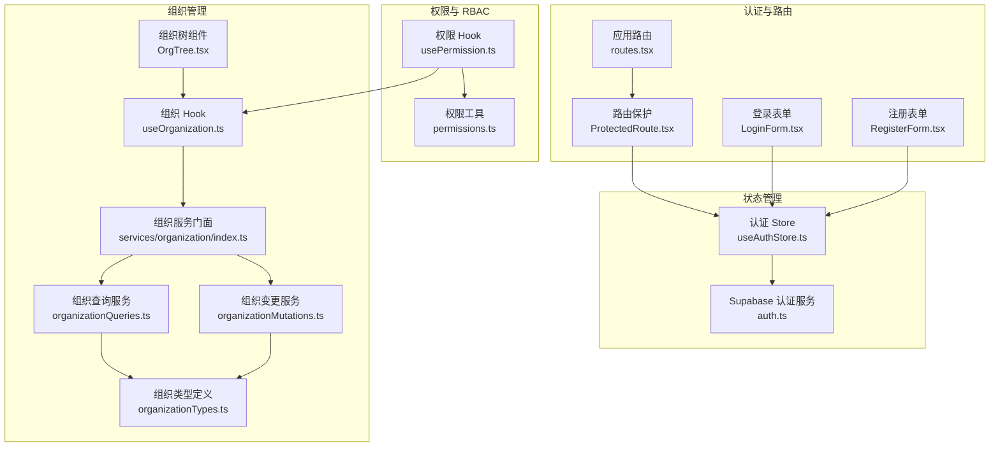
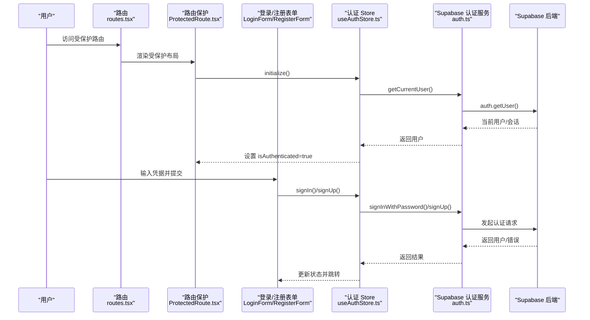
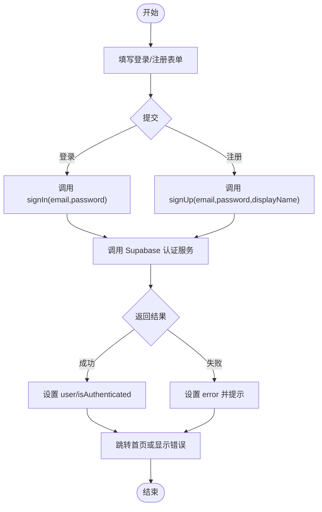
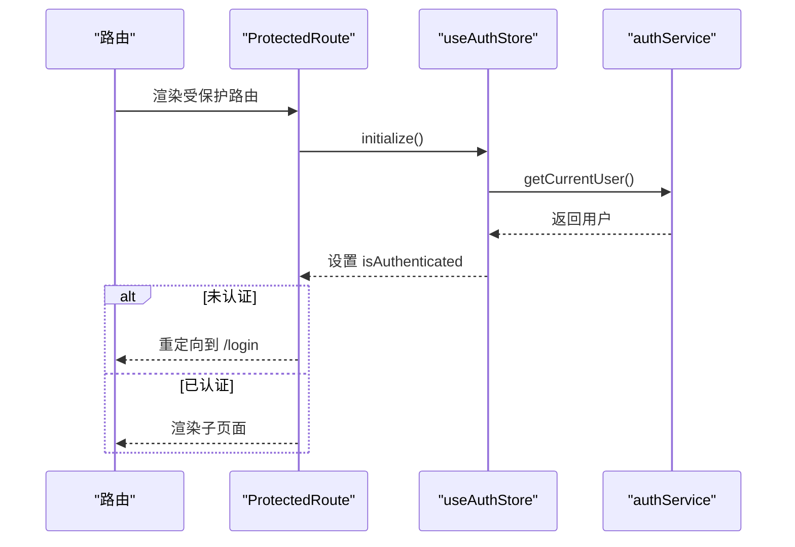
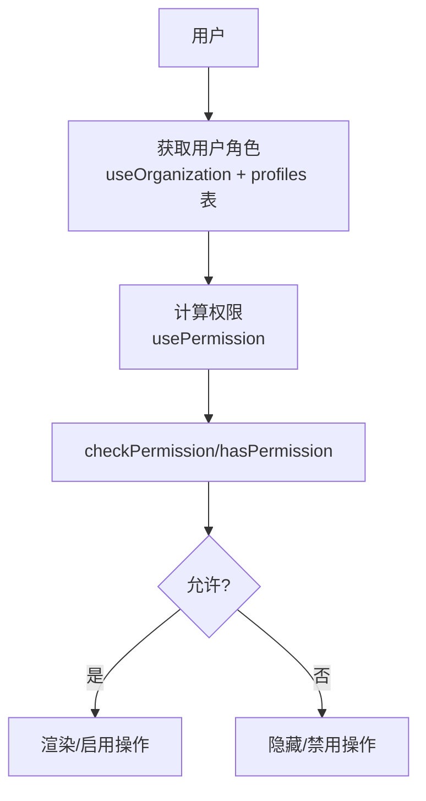
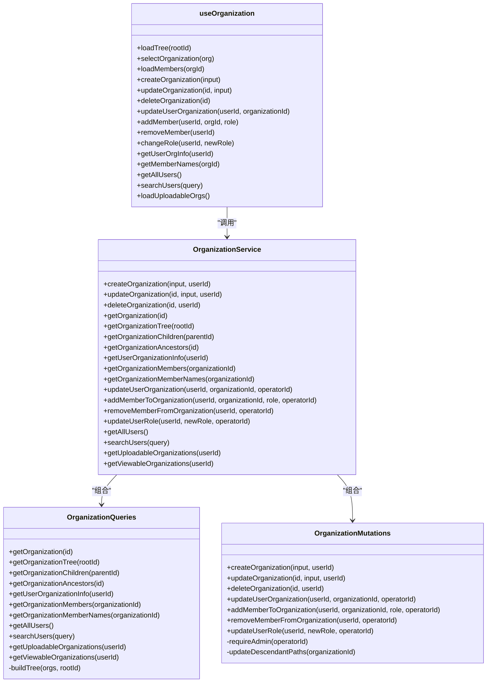
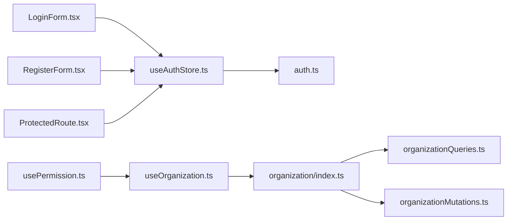

# 认证与授权系统

<cite>
**本文引用的文件**
- [LoginForm.tsx](file://app/src/auth/components/LoginForm.tsx)
- [RegisterForm.tsx](file://app/src/auth/components/RegisterForm.tsx)
- [ProtectedRoute.tsx](file://app/src/auth/components/ProtectedRoute.tsx)
- [useAuthStore.ts](file://app/src/stores/useAuthStore.ts)
- [auth.ts](file://app/src/lib/supabase/auth.ts)
- [permissions.ts](file://app/src/lib/permissions.ts)
- [usePermission.ts](file://app/src/hooks/usePermission.ts)
- [routes.tsx](file://app/src/config/routes.tsx)
- [index.ts](file://app/src/services/organization/index.ts)
- [organizationQueries.ts](file://app/src/services/organization/organizationQueries.ts)
- [organizationMutations.ts](file://app/src/services/organization/organizationMutations.ts)
- [useOrganization.ts](file://app/src/hooks/useOrganization.ts)
- [organizationTypes.ts](file://app/src/lib/supabase/organizationTypes.ts)
- [OrgTree.tsx](file://app/src/components/organization/OrgTree.tsx)
- [auth.ts](file://app/src/types/auth.ts)
</cite>

## 目录
1. [简介](#简介)
2. [项目结构](#项目结构)
3. [核心组件](#核心组件)
4. [架构总览](#架构总览)
5. [详细组件分析](#详细组件分析)
6. [依赖分析](#依赖分析)
7. [性能考虑](#性能考虑)
8. [故障排查指南](#故障排查指南)
9. [结论](#结论)
10. [附录](#附录)

## 简介
本文件系统性梳理基于 Supabase Auth 的认证与授权体系，覆盖登录注册流程、JWT 会话与状态管理、组织管理（多层级组织结构、成员管理、角色权限控制）、RBAC 权限体系（权限验证、路由保护、组件级权限控制），以及用户状态管理（Zustand Store 设计、状态持久化、异步操作处理）。同时提供安全最佳实践与常见问题解决方案，并给出可直接定位到源码位置的“代码示例路径”。

## 项目结构
围绕认证与授权的核心目录与文件如下：
- 认证界面与路由保护
  - 表单组件：登录、注册
  - 路由保护组件
  - 应用路由配置
- 认证状态管理（Zustand）
  - 认证 Store（初始化、登录、注册、登出、错误处理、持久化）
  - Supabase 认证服务封装（注册、登录、登出、当前用户、会话、状态监听）
- 权限与 RBAC
  - 角色与权限工具
  - 权限 Hook（根据用户角色与组织上下文计算权限）
- 组织管理
  - 组织服务门面（统一导出查询与变更）
  - 组织查询服务（树、成员、祖先、上传/查看组织等）
  - 组织变更服务（创建、更新、删除、成员管理）
  - 组织 Hook（树加载、CRUD、成员管理、搜索）
  - 组织树组件（递归渲染）
  - 组织类型定义

**图表来源**
- [routes.tsx:24-65](file://app/src/config/routes.tsx#L24-L65)
- [ProtectedRoute.tsx:14-31](file://app/src/auth/components/ProtectedRoute.tsx#L14-L31)
- [LoginForm.tsx:11-25](file://app/src/auth/components/LoginForm.tsx#L11-L25)
- [RegisterForm.tsx:11-40](file://app/src/auth/components/RegisterForm.tsx#L11-L40)
- [useAuthStore.ts:24-172](file://app/src/stores/useAuthStore.ts#L24-L172)
- [auth.ts:29-119](file://app/src/lib/supabase/auth.ts#L29-L119)
- [permissions.ts:1-86](file://app/src/lib/permissions.ts#L1-L86)
- [usePermission.ts:33-57](file://app/src/hooks/usePermission.ts#L33-L57)
- [index.ts:19-96](file://app/src/services/organization/index.ts#L19-L96)
- [organizationQueries.ts:17-332](file://app/src/services/organization/organizationQueries.ts#L17-L332)
- [organizationMutations.ts:16-206](file://app/src/services/organization/organizationMutations.ts#L16-L206)
- [useOrganization.ts:66-363](file://app/src/hooks/useOrganization.ts#L66-L363)
- [OrgTree.tsx:116-163](file://app/src/components/organization/OrgTree.tsx#L116-L163)
- [organizationTypes.ts:8-90](file://app/src/lib/supabase/organizationTypes.ts#L8-L90)

**章节来源**
- [routes.tsx:1-78](file://app/src/config/routes.tsx#L1-L78)
- [useAuthStore.ts:1-173](file://app/src/stores/useAuthStore.ts#L1-L173)
- [auth.ts:1-120](file://app/src/lib/supabase/auth.ts#L1-L120)
- [permissions.ts:1-86](file://app/src/lib/permissions.ts#L1-L86)
- [usePermission.ts:1-58](file://app/src/hooks/usePermission.ts#L1-L58)
- [index.ts:1-97](file://app/src/services/organization/index.ts#L1-L97)
- [organizationQueries.ts:1-333](file://app/src/services/organization/organizationQueries.ts#L1-L333)
- [organizationMutations.ts:1-207](file://app/src/services/organization/organizationMutations.ts#L1-L207)
- [useOrganization.ts:1-364](file://app/src/hooks/useOrganization.ts#L1-L364)
- [organizationTypes.ts:1-91](file://app/src/lib/supabase/organizationTypes.ts#L1-L91)
- [OrgTree.tsx:1-164](file://app/src/components/organization/OrgTree.tsx#L1-L164)

## 核心组件
- 登录表单组件：负责收集邮箱与密码，调用认证 Store 的登录方法，并在成功后跳转首页。
- 注册表单组件：负责收集邮箱、密码、确认密码与昵称，进行本地校验后调用认证 Store 的注册方法。
- 路由保护组件：在应用启动时初始化认证状态，未认证时重定向至登录页；加载期间显示加载指示器。
- 认证 Store（Zustand）：封装 Supabase 认证服务，提供初始化、注册、登录、登出、错误清理与持久化；监听认证状态变化以保持全局同步。
- Supabase 认证服务：封装注册、登录、登出、获取当前用户、获取会话、监听认证状态变化；内置缓存与防抖逻辑。
- 权限工具与 Hook：定义角色层级与权限配置，提供权限判断、角色标签、组织/成员/照片权限判定；Hook 基于用户与组织上下文计算可用权限。
- 组织服务门面：统一导出查询与变更 API，隐藏内部实现细节。
- 组织查询服务：提供组织树、成员列表、祖先链、用户组织信息、上传/查看组织等只读查询，带内存缓存与并发去重。
- 组织变更服务：提供组织 CRUD 与成员管理，严格校验管理员权限并失效相关缓存。
- 组织 Hook：封装树加载、选择、成员加载、CRUD、成员变更、搜索等业务逻辑，结合本地缓存与服务层缓存。
- 组织树组件：递归渲染组织层级，支持展开/折叠与选中交互。

**章节来源**
- [LoginForm.tsx:11-75](file://app/src/auth/components/LoginForm.tsx#L11-L75)
- [RegisterForm.tsx:11-118](file://app/src/auth/components/RegisterForm.tsx#L11-L118)
- [ProtectedRoute.tsx:14-31](file://app/src/auth/components/ProtectedRoute.tsx#L14-L31)
- [useAuthStore.ts:24-172](file://app/src/stores/useAuthStore.ts#L24-L172)
- [auth.ts:29-119](file://app/src/lib/supabase/auth.ts#L29-L119)
- [permissions.ts:1-86](file://app/src/lib/permissions.ts#L1-L86)
- [usePermission.ts:33-57](file://app/src/hooks/usePermission.ts#L33-L57)
- [index.ts:19-96](file://app/src/services/organization/index.ts#L19-L96)
- [organizationQueries.ts:17-332](file://app/src/services/organization/organizationQueries.ts#L17-L332)
- [organizationMutations.ts:16-206](file://app/src/services/organization/organizationMutations.ts#L16-L206)
- [useOrganization.ts:66-363](file://app/src/hooks/useOrganization.ts#L66-L363)
- [OrgTree.tsx:116-163](file://app/src/components/organization/OrgTree.tsx#L116-L163)

## 架构总览
下图展示从用户交互到数据库的端到端流程：登录/注册请求经由认证 Store 调用 Supabase 认证服务，完成 JWT 会话建立与状态监听；路由保护确保受保护页面仅在认证状态下访问；权限 Hook 基于用户角色与组织上下文进行权限判定；组织 Hook 负责组织树与成员数据的加载与缓存，变更通过组织服务调用数据库 RPC 或表写入。

**图表来源**
- [routes.tsx:24-65](file://app/src/config/routes.tsx#L24-L65)
- [ProtectedRoute.tsx:14-31](file://app/src/auth/components/ProtectedRoute.tsx#L14-L31)
- [LoginForm.tsx:11-25](file://app/src/auth/components/LoginForm.tsx#L11-L25)
- [RegisterForm.tsx:11-40](file://app/src/auth/components/RegisterForm.tsx#L11-L40)
- [useAuthStore.ts:35-126](file://app/src/stores/useAuthStore.ts#L35-L126)
- [auth.ts:76-118](file://app/src/lib/supabase/auth.ts#L76-L118)

## 详细组件分析

### 认证流程与状态管理（登录/注册/登出）
- 登录流程
  - 表单收集邮箱与密码，提交后调用认证 Store 的登录方法。
  - Store 异步调用 Supabase 认证服务执行登录，捕获错误并设置状态。
  - 成功后设置认证状态为已认证，并在组件中检测状态变化后跳转首页。
- 注册流程
  - 表单收集邮箱、密码、确认密码与昵称，先做本地校验（如密码长度、一致性）。
  - 调用认证 Store 的注册方法，注册成功后同样设置认证状态并跳转。
- 登出流程
  - 调用认证 Store 的登出方法，清空用户状态并返回错误信息（如有）。
- 状态持久化与缓存
  - 认证 Store 使用持久化中间件，仅持久化必要字段（用户与认证状态）。
  - Supabase 认证服务对获取当前用户增加 TTL 缓存与并发去重，避免重复请求。

**图表来源**
- [LoginForm.tsx:19-25](file://app/src/auth/components/LoginForm.tsx#L19-L25)
- [RegisterForm.tsx:22-40](file://app/src/auth/components/RegisterForm.tsx#L22-L40)
- [useAuthStore.ts:65-126](file://app/src/stores/useAuthStore.ts#L65-L126)
- [auth.ts:33-63](file://app/src/lib/supabase/auth.ts#L33-L63)

**章节来源**
- [LoginForm.tsx:11-75](file://app/src/auth/components/LoginForm.tsx#L11-L75)
- [RegisterForm.tsx:11-118](file://app/src/auth/components/RegisterForm.tsx#L11-L118)
- [useAuthStore.ts:24-172](file://app/src/stores/useAuthStore.ts#L24-L172)
- [auth.ts:29-119](file://app/src/lib/supabase/auth.ts#L29-L119)
- [auth.ts:5-20](file://app/src/types/auth.ts#L5-L20)

### 路由保护与会话状态维护
- 路由保护组件在挂载时调用认证 Store 的初始化方法，监听认证状态变化，未认证时重定向至登录页。
- 加载期间显示加载指示器，避免空白页面。
- 应用路由配置将受保护页面包裹在路由保护组件内，保证全局一致的访问控制。

**图表来源**
- [routes.tsx:34-41](file://app/src/config/routes.tsx#L34-L41)
- [ProtectedRoute.tsx:14-31](file://app/src/auth/components/ProtectedRoute.tsx#L14-L31)
- [useAuthStore.ts:35-60](file://app/src/stores/useAuthStore.ts#L35-L60)
- [auth.ts:76-101](file://app/src/lib/supabase/auth.ts#L76-L101)

**章节来源**
- [routes.tsx:1-78](file://app/src/config/routes.tsx#L1-L78)
- [ProtectedRoute.tsx:1-32](file://app/src/auth/components/ProtectedRoute.tsx#L1-L32)
- [useAuthStore.ts:1-173](file://app/src/stores/useAuthStore.ts#L1-L173)

### RBAC 权限体系（角色与权限）
- 角色层级：管理员 > 经理 > 成员，提供比较函数判断权限是否满足。
- 权限配置：组织、成员、照片三类权限，每类包含若干细项，定义所需最低角色。
- 权限 Hook：根据用户与组织上下文计算用户角色，暴露便捷方法（如能否管理组织、成员、编辑/删除照片等）。
- 组件级权限控制：在 UI 中通过权限 Hook 判断按钮显隐与交互能力，避免越权操作。

**图表来源**
- [usePermission.ts:33-57](file://app/src/hooks/usePermission.ts#L33-L57)
- [permissions.ts:17-52](file://app/src/lib/permissions.ts#L17-L52)
- [organizationQueries.ts:157-204](file://app/src/services/organization/organizationQueries.ts#L157-L204)

**章节来源**
- [permissions.ts:1-86](file://app/src/lib/permissions.ts#L1-L86)
- [usePermission.ts:1-58](file://app/src/hooks/usePermission.ts#L1-L58)
- [organizationQueries.ts:157-204](file://app/src/services/organization/organizationQueries.ts#L157-L204)

### 组织管理（多层级组织结构、成员管理）
- 组织服务门面：统一导出查询与变更 API，便于上层调用。
- 组织查询服务：提供组织树构建、成员列表、祖先链、用户组织信息、上传/查看组织等，均带缓存与并发去重。
- 组织变更服务：严格限制管理员权限，提供组织 CRUD、成员添加/移除/角色变更、路径更新等。
- 组织 Hook：封装树加载、选择、成员加载、CRUD、成员变更、搜索等，结合本地缓存与服务层缓存。
- 组织树组件：递归渲染组织层级，支持展开/折叠与选中交互。

**图表来源**
- [index.ts:19-96](file://app/src/services/organization/index.ts#L19-L96)
- [organizationQueries.ts:17-332](file://app/src/services/organization/organizationQueries.ts#L17-L332)
- [organizationMutations.ts:16-206](file://app/src/services/organization/organizationMutations.ts#L16-L206)
- [useOrganization.ts:66-363](file://app/src/hooks/useOrganization.ts#L66-L363)

**章节来源**
- [index.ts:1-97](file://app/src/services/organization/index.ts#L1-L97)
- [organizationQueries.ts:1-333](file://app/src/services/organization/organizationQueries.ts#L1-L333)
- [organizationMutations.ts:1-207](file://app/src/services/organization/organizationMutations.ts#L1-L207)
- [useOrganization.ts:1-364](file://app/src/hooks/useOrganization.ts#L1-L364)
- [organizationTypes.ts:1-91](file://app/src/lib/supabase/organizationTypes.ts#L1-L91)
- [OrgTree.tsx:1-164](file://app/src/components/organization/OrgTree.tsx#L1-L164)

## 依赖分析
- 组件与 Store 的耦合
  - 表单组件仅依赖认证 Store 的动作，不直接访问 Supabase，降低耦合度。
  - 路由保护组件依赖认证 Store 的初始化与状态，确保全局一致性。
- Store 与服务层的耦合
  - 认证 Store 依赖 Supabase 认证服务封装，集中处理错误与状态。
  - 组织 Hook 依赖组织服务门面，进一步解耦查询与变更实现。
- 权限与组织上下文
  - 权限 Hook 依赖组织 Hook 获取用户组织信息，形成“角色 → 权限”的映射。

**图表来源**
- [LoginForm.tsx:11-13](file://app/src/auth/components/LoginForm.tsx#L11-L13)
- [RegisterForm.tsx:11-13](file://app/src/auth/components/RegisterForm.tsx#L11-L13)
- [ProtectedRoute.tsx:14-15](file://app/src/auth/components/ProtectedRoute.tsx#L14-L15)
- [useAuthStore.ts:6-6](file://app/src/stores/useAuthStore.ts#L6-L6)
- [auth.ts:4-4](file://app/src/lib/supabase/auth.ts#L4-L4)
- [usePermission.ts:6-7](file://app/src/hooks/usePermission.ts#L6-L7)
- [useOrganization.ts:6-6](file://app/src/hooks/useOrganization.ts#L6-L6)
- [index.ts:8-9](file://app/src/services/organization/index.ts#L8-L9)

**章节来源**
- [LoginForm.tsx:1-76](file://app/src/auth/components/LoginForm.tsx#L1-L76)
- [RegisterForm.tsx:1-119](file://app/src/auth/components/RegisterForm.tsx#L1-L119)
- [ProtectedRoute.tsx:1-32](file://app/src/auth/components/ProtectedRoute.tsx#L1-L32)
- [useAuthStore.ts:1-173](file://app/src/stores/useAuthStore.ts#L1-L173)
- [auth.ts:1-120](file://app/src/lib/supabase/auth.ts#L1-L120)
- [usePermission.ts:1-58](file://app/src/hooks/usePermission.ts#L1-L58)
- [useOrganization.ts:1-364](file://app/src/hooks/useOrganization.ts#L1-L364)
- [index.ts:1-97](file://app/src/services/organization/index.ts#L1-L97)

## 性能考虑
- 认证状态缓存
  - Supabase 认证服务对获取当前用户增加 TTL 缓存与并发去重，减少重复请求。
- 组织数据缓存
  - 组织查询服务对组织树、成员列表、用户组织信息等采用内存缓存与并发去重，显著降低数据库压力。
  - 组织 Hook 结合本地缓存（短期 TTL）与服务层缓存，提升首屏与切换体验。
- 会话监听
  - 认证 Store 监听认证状态变化，避免手动轮询，实时同步状态。
- 路由懒加载
  - 应用路由使用动态导入与 Suspense，减少初始包体积与首屏等待。

[本节为通用性能建议，无需特定文件来源]

## 故障排查指南
- 登录/注册失败
  - 检查认证 Store 是否正确设置错误状态并提示用户。
  - 查看 Supabase 认证服务返回的错误对象，定位具体原因（如密码长度、邮箱格式、账户状态等）。
  - 参考路径：[useAuthStore.ts:65-126](file://app/src/stores/useAuthStore.ts#L65-L126)、[auth.ts:33-63](file://app/src/lib/supabase/auth.ts#L33-L63)
- 路由保护无效
  - 确认路由保护组件已包裹受保护页面，且初始化逻辑正常执行。
  - 检查认证 Store 的初始化是否成功设置认证状态。
  - 参考路径：[routes.tsx:34-41](file://app/src/config/routes.tsx#L34-L41)、[ProtectedRoute.tsx:14-31](file://app/src/auth/components/ProtectedRoute.tsx#L14-L31)
- 权限判断异常
  - 确认用户组织信息已正确加载，角色字段是否符合预期。
  - 使用权限 Hook 的便捷方法进行断点调试，核对最小角色要求。
  - 参考路径：[usePermission.ts:33-57](file://app/src/hooks/usePermission.ts#L33-L57)、[permissions.ts:17-52](file://app/src/lib/permissions.ts#L17-L52)
- 组织树不显示或成员为空
  - 检查组织查询服务的缓存键与过期策略，必要时清除缓存后重试。
  - 确认数据库中存在组织与成员数据，且用户已关联到组织。
  - 参考路径：[organizationQueries.ts:52-117](file://app/src/services/organization/organizationQueries.ts#L52-L117)、[useOrganization.ts:75-102](file://app/src/hooks/useOrganization.ts#L75-L102)

**章节来源**
- [useAuthStore.ts:65-126](file://app/src/stores/useAuthStore.ts#L65-L126)
- [auth.ts:33-63](file://app/src/lib/supabase/auth.ts#L33-L63)
- [routes.tsx:34-41](file://app/src/config/routes.tsx#L34-L41)
- [ProtectedRoute.tsx:14-31](file://app/src/auth/components/ProtectedRoute.tsx#L14-L31)
- [usePermission.ts:33-57](file://app/src/hooks/usePermission.ts#L33-L57)
- [permissions.ts:17-52](file://app/src/lib/permissions.ts#L17-L52)
- [organizationQueries.ts:52-117](file://app/src/services/organization/organizationQueries.ts#L52-L117)
- [useOrganization.ts:75-102](file://app/src/hooks/useOrganization.ts#L75-L102)

## 结论
本系统以 Supabase Auth 为核心，结合 Zustand 实现轻量高效的认证状态管理，配合路由保护与权限 Hook 构建了清晰的前端访问控制层。组织管理模块通过服务门面与查询/变更分离，实现了多层级组织结构与成员管理的高内聚低耦合设计。整体架构具备良好的扩展性与可维护性，适合在企业级场景中落地。

[本节为总结性内容，无需特定文件来源]

## 附录
- 代码示例路径（不含具体代码内容）
  - 登录流程入口：[LoginForm.tsx:19-25](file://app/src/auth/components/LoginForm.tsx#L19-L25)
  - 注册流程入口：[RegisterForm.tsx:22-40](file://app/src/auth/components/RegisterForm.tsx#L22-L40)
  - 路由保护实现：[ProtectedRoute.tsx:14-31](file://app/src/auth/components/ProtectedRoute.tsx#L14-L31)
  - 认证 Store 初始化与动作：[useAuthStore.ts:35-157](file://app/src/stores/useAuthStore.ts#L35-L157)
  - Supabase 认证服务封装：[auth.ts:29-119](file://app/src/lib/supabase/auth.ts#L29-L119)
  - 权限工具与 Hook：[permissions.ts:17-85](file://app/src/lib/permissions.ts#L17-L85)、[usePermission.ts:33-57](file://app/src/hooks/usePermission.ts#L33-L57)
  - 组织服务门面与查询/变更：[index.ts:19-96](file://app/src/services/organization/index.ts#L19-L96)、[organizationQueries.ts:17-332](file://app/src/services/organization/organizationQueries.ts#L17-L332)、[organizationMutations.ts:16-206](file://app/src/services/organization/organizationMutations.ts#L16-L206)
  - 组织 Hook 与树组件：[useOrganization.ts:66-363](file://app/src/hooks/useOrganization.ts#L66-L363)、[OrgTree.tsx:116-163](file://app/src/components/organization/OrgTree.tsx#L116-L163)
  - 类型定义参考：[organizationTypes.ts:8-90](file://app/src/lib/supabase/organizationTypes.ts#L8-L90)

[本节为补充材料，无需特定文件来源]