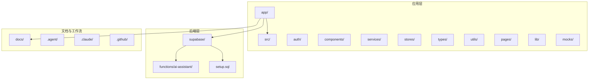
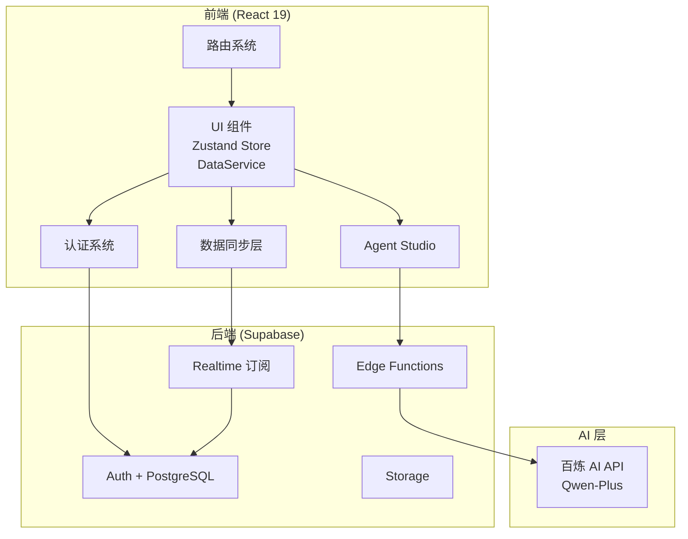
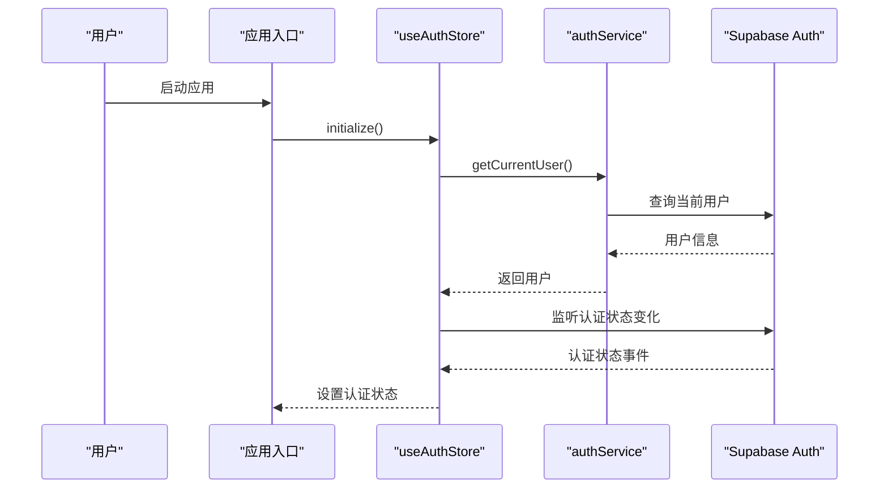
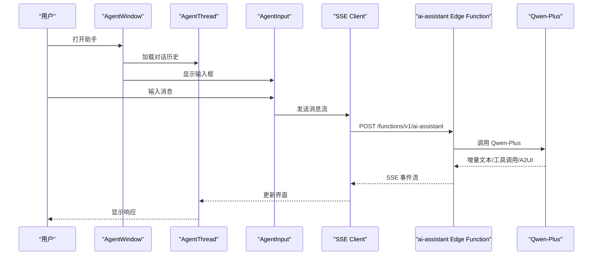
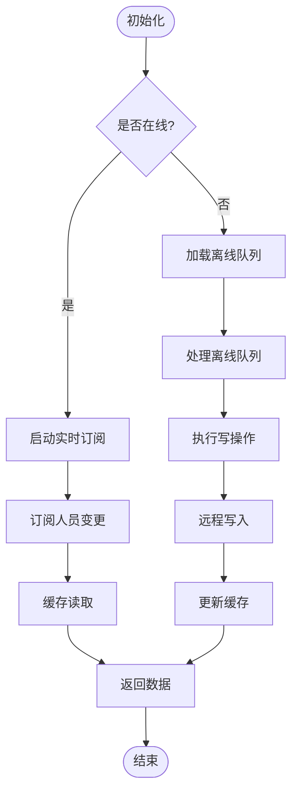
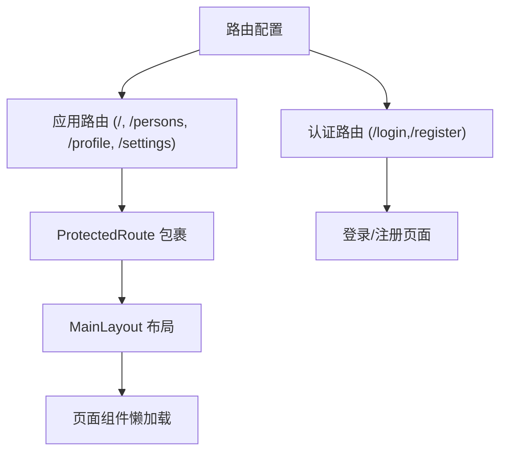
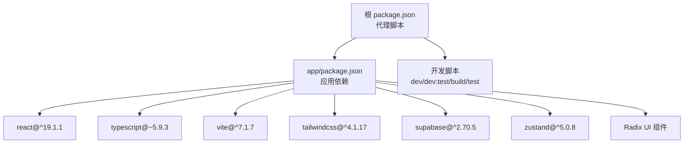

# 项目概述

<cite>
**本文档引用的文件**
- [README.md](file://README.md)
- [package.json](file://package.json)
- [app/package.json](file://app/package.json)
- [plan.md](file://plan.md)
- [CONTRIBUTING.md](file://CONTRIBUTING.md)
- [docs/Architecture.md](file://docs/Architecture.md)
- [docs/API.md](file://docs/API.md)
- [AGENTS.md](file://AGENTS.md)
- [app/src/App.tsx](file://app/src/App.tsx)
- [app/src/main.tsx](file://app/src/main.tsx)
- [app/src/components/agent/AgentWindow.tsx](file://app/src/components/agent/AgentWindow.tsx)
- [app/src/services/data/DataService.ts](file://app/src/services/data/DataService.ts)
- [app/supabase/functions/ai-assistant/index.ts](file://app/supabase/functions/ai-assistant/index.ts)
- [app/src/config/routes.tsx](file://app/src/config/routes.tsx)
- [app/src/stores/useAuthStore.ts](file://app/src/stores/useAuthStore.ts)
</cite>

## 目录
1. [简介](#简介)
2. [项目结构](#项目结构)
3. [核心组件](#核心组件)
4. [架构总览](#架构总览)
5. [详细组件分析](#详细组件分析)
6. [依赖关系分析](#依赖关系分析)
7. [性能考量](#性能考量)
8. [故障排除指南](#故障排除指南)
9. [结论](#结论)
10. [附录](#附录)

## 简介
OPC-Starter 是一个专为使用 Cursor、Qoder 等 AI 编码工具设计的一人公司启动器，基于 React 19 + TypeScript + Vite + Tailwind CSS + Supabase 的现代化全栈解决方案。项目以“AI 友好”为核心定位，提供完整的 BMAD 方法论支持，确保 AI 工具能够高效理解与协作。

### 价值主张
- **AI 友好编码**：严格的类型系统、模块化架构与清晰的目录结构，便于 AI 理解与生成
- **开箱即用认证**：集成 Supabase Auth，支持注册、登录与会话持久化
- **组织架构管理**：支持多层级团队与成员权限管理，配合 RLS 策略保障数据安全
- **Agent Studio**：基于 A2UI 的动态 UI 协议，自然语言驱动的交互体验
- **数据同步**：IndexedDB 缓存 + Supabase Realtime 的混合离线/在线同步策略
- **精美 UI 组件**：基于 Radix UI + shadcn/ui 风格，提供高质量基础组件库

**章节来源**
- [README.md:13-22](file://README.md#L13-L22)
- [docs/Architecture.md:5-21](file://docs/Architecture.md#L5-L21)

## 项目结构
项目采用分层清晰的目录结构，围绕前端应用、Supabase 后端与文档三大部分组织：

**图表来源**
- [README.md:114-144](file://README.md#L114-L144)
- [docs/Architecture.md:160-196](file://docs/Architecture.md#L160-L196)

**章节来源**
- [README.md:114-144](file://README.md#L114-L144)
- [docs/Architecture.md:160-196](file://docs/Architecture.md#L160-L196)

## 核心组件
- **认证系统**：基于 Supabase Auth，提供用户注册、登录、登出与会话监听
- **组织架构**：支持多层级组织结构与角色权限管理，配合 RLS 策略
- **Agent Studio**：悬浮对话框、对话线程、输入组件与 A2UI 渲染系统
- **数据同步层**：DataService 统一数据访问，支持离线队列、冲突解决与实时订阅
- **路由系统**：基于 React Router 的代码分割路由，支持受保护页面
- **UI 组件库**：基于 Radix UI 的基础组件，提供按钮、对话框、输入框等

**章节来源**
- [docs/Architecture.md:43-107](file://docs/Architecture.md#L43-L107)
- [docs/Architecture.md:109-158](file://docs/Architecture.md#L109-L158)
- [app/src/config/routes.tsx:1-78](file://app/src/config/routes.tsx#L1-L78)
- [app/src/stores/useAuthStore.ts:1-173](file://app/src/stores/useAuthStore.ts#L1-L173)

## 架构总览
OPC-Starter 采用“前端 React + Supabase 后端 + 百炼 AI API”的三层架构，结合 MSW Mock 实现 AI 友好的本地开发体验。

**图表来源**
- [docs/Architecture.md:22-39](file://docs/Architecture.md#L22-L39)
- [docs/Architecture.md:11-21](file://docs/Architecture.md#L11-L21)

**章节来源**
- [docs/Architecture.md:22-39](file://docs/Architecture.md#L22-L39)
- [docs/Architecture.md:11-21](file://docs/Architecture.md#L11-L21)

## 详细组件分析

### 认证系统
认证系统基于 Supabase Auth，使用 Zustand 管理用户状态，并通过持久化中间件实现跨会话保持。

**图表来源**
- [app/src/main.tsx:23-78](file://app/src/main.tsx#L23-L78)
- [app/src/stores/useAuthStore.ts:35-60](file://app/src/stores/useAuthStore.ts#L35-L60)

**章节来源**
- [app/src/main.tsx:23-78](file://app/src/main.tsx#L23-L78)
- [app/src/stores/useAuthStore.ts:1-173](file://app/src/stores/useAuthStore.ts#L1-L173)

### Agent Studio
Agent Studio 提供悬浮对话框与 A2UI 动态渲染能力，支持拖拽、最小化与对话恢复。

**图表来源**
- [app/src/components/agent/AgentWindow.tsx:36-243](file://app/src/components/agent/AgentWindow.tsx#L36-L243)
- [app/supabase/functions/ai-assistant/index.ts:22-116](file://app/supabase/functions/ai-assistant/index.ts#L22-L116)

**章节来源**
- [app/src/components/agent/AgentWindow.tsx:1-243](file://app/src/components/agent/AgentWindow.tsx#L1-L243)
- [docs/API.md:1-172](file://docs/API.md#L1-L172)

### 数据同步层 (DataService)
DataService 实现“缓存优先 + 实时订阅”的混合同步策略，支持离线队列与冲突解决。

**图表来源**
- [app/src/services/data/DataService.ts:71-419](file://app/src/services/data/DataService.ts#L71-L419)

**章节来源**
- [app/src/services/data/DataService.ts:1-419](file://app/src/services/data/DataService.ts#L1-L419)

### 路由系统
应用采用 React Router 的代码分割与受保护路由，确保登录状态下的页面访问控制。

**图表来源**
- [app/src/config/routes.tsx:24-78](file://app/src/config/routes.tsx#L24-L78)

**章节来源**
- [app/src/config/routes.tsx:1-78](file://app/src/config/routes.tsx#L1-L78)

## 依赖关系分析
项目采用模块化依赖管理，前端依赖通过 NPM 管理，根目录提供代理脚本简化开发流程。

**图表来源**
- [package.json:5-21](file://package.json#L5-L21)
- [app/package.json:48-121](file://app/package.json#L48-L121)

**章节来源**
- [package.json:1-23](file://package.json#L1-L23)
- [app/package.json:1-141](file://app/package.json#L1-L141)

## 性能考量
- **启动性能**：MSW Mock 模式下无需真实后端，启动速度极快；生产模式下通过 Vite 构建优化
- **网络性能**：离线队列与增量同步减少网络请求；Realtime 订阅实现实时更新
- **内存管理**：Zustand 轻量状态管理，避免不必要的重渲染
- **构建优化**：TypeScript 严格模式与 ESLint 配置确保代码质量与可维护性

## 故障排除指南
- **npm install 失败 (ECONNRESET)**：删除 package-lock.json 与 node_modules，使用官方镜像源重新安装
- **浏览器白屏/ERR_NAME_NOT_RESOLVED**：清除浏览器站点数据中的过期 Token
- **WebSocket 连接警告**：MSW 模式下属于预期行为，不影响功能
- **MSW 模式下 Supabase 请求拦截**：确保在认证初始化前启动 MSW

**章节来源**
- [README.md:83-113](file://README.md#L83-L113)

## 结论
OPC-Starter 通过精心设计的架构与完善的 AI 友好特性，为一人公司的快速启动提供了坚实的技术基础。其模块化设计、严格的类型系统与丰富的工具链，使得开发者能够专注于业务逻辑而非基础设施搭建。

## 附录

### 技术栈概览
- **前端框架**：React 19.1 + TypeScript 5.9 + Vite 7.1
- **样式框架**：Tailwind CSS 4.1
- **后端服务**：Supabase 2.80 (Auth + Storage + Realtime + Edge Functions)
- **状态管理**：Zustand 5.0
- **类型校验**：Zod 4.1
- **AI 集成**：Qwen-Plus (百炼 API)

**章节来源**
- [README.md:146-157](file://README.md#L146-L157)
- [docs/Architecture.md:11-21](file://docs/Architecture.md#L11-L21)

### 适用场景与目标用户
- **适用场景**：一人公司、独立开发者、初创团队的 MVP 快速搭建
- **目标用户**：使用 Cursor、Qoder 等 AI 编码工具的开发者，追求高效率与低维护成本的团队

**章节来源**
- [README.md:3-11](file://README.md#L3-L11)

### 项目路线图
- [x] v1.0.0 - 基础 Boilerplate 发布
- [x] v1.1.0 - 主题系统 (深色/浅色模式)
- [ ] v1.2.0 - 多 LLM Provider 支持 (OpenAI, Claude, Gemini)
- [ ] v1.3.0 - 国际化 (i18n)

**章节来源**
- [README.md:200-206](file://README.md#L200-L206)

### 许可证信息
项目采用 AGPL-3.0 许可证，适用于开源协作与商业使用，需遵守相关开源协议要求。

**章节来源**
- [README.md:211-214](file://README.md#L211-L214)